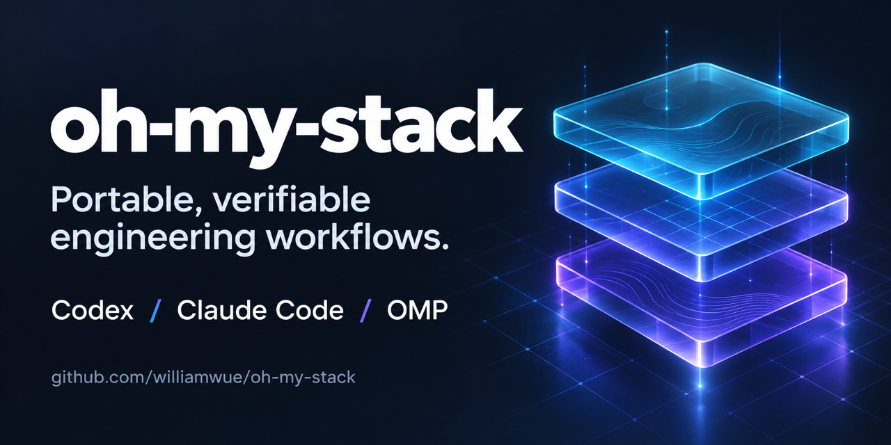

# Oh My Stack



[English](README.md) | [简体中文](README.zh-CN.md)

在 Codex 和 Claude Code 中使用基于 pstack 的工程工作流，以及 Matt Pocock 的精选 AIHero 原版技能。

描述任务、澄清需求、审阅改动或检查模块设计。Oh My Stack 为 agent 提供执行步骤，并要求它用实际证据说明结果。

[开始使用](docs/zh-CN/getting-started.md) · [按任务选择入口](docs/zh-CN/guides/common-tasks.md) · [文档中心](docs/zh-CN/README.md)

## 安装

复制对应提示词，发给能操作本机的 agent，让它完成下载、安装和检查。

### Codex

```text
请在本机为 Codex 安装最新版正式发布的 Oh My Stack。
先阅读并遵循 https://github.com/williamwue/oh-my-stack/blob/main/docs/install/codex.md
保留我已有的模型配置和项目文件。完成安装与版本核对，条件允许时在新会话显式加载 prove-it-works 做只读验证。
最后报告实际安装版本及已完成的检查；需要我重启或手动操作时，给出明确的下一步。
```

### Claude Code

```text
请在本机为 Claude Code 安装 Oh My Stack，使用用户范围。
先阅读并遵循 https://github.com/williamwue/oh-my-stack/blob/main/docs/install/claude-code.md
使用最新版正式发布版本，保留我已有的模型配置和项目文件。完成安装与版本核对，条件允许时在新会话显式加载 prove-it-works 做只读验证。
最后报告实际安装版本及已完成的检查；需要我重启或手动操作时，给出明确的下一步。
```

完整提示词、已有安装的处理和可选模型配置，见[让 agent 帮你安装](docs/zh-CN/install/with-agent.md)。

手动安装请按工具查看指南。每个工具需要独立安装。

| 使用的工具 | 安装指南 |
| --- | --- |
| Codex | [stable Git marketplace 或正式发布包](docs/zh-CN/install/codex.md)，无需构建源码。 |
| Claude Code | [Marketplace 安装](docs/zh-CN/install/claude-code.md)。 |
| OMP | [通过独立 profile 检查安装](docs/zh-CN/install/omp.md)。不同工作流的实测范围不同。 |

安装后新开会话。[支持范围](docs/support-policy.md)说明已测试的工具和当前限制。

## 更新现有安装

[复制更新提示词或使用原生命令](docs/zh-CN/guides/update-and-uninstall.md)。
按现有来源和安装范围更新，保留模型配置；“检查更新”只读，“执行更新”完成实际更新。

## 完成第一个任务

在新会话中打开你的项目，先选择 `prove-it-works`。
它只检查 Skill 是否加载及工作区事实，不修改项目文件。

然后通过 `poteto-mode` 完成一个只读任务。

在 Codex 输入 `$`，从 Skill 选择器选择 `oh-my-stack:poteto-mode`，再发送：

```text
解释当前项目的主要模块和请求入口。
引用实际文件。只读分析，不修改文件。
```

在 Claude Code 对话中输入：

```text
/oh-my-stack:poteto-mode 解释当前项目的主要模块和请求入口。引用实际文件。只读分析，不修改文件。
```

你应得到带文件引用的代码解释。无法确认的部分，agent 应明确说明。
[首次使用指南](docs/zh-CN/getting-started.md)说明安装检查、预期结果和排查步骤。

## 按任务选择入口

| 你要做什么 | 入口 | 预期结果 |
| --- | --- | --- |
| 修 bug、开发功能，或让 agent 选择工程工作流 | `poteto-mode` | 按请求选择工作流，在授权范围内执行并验证结果。 |
| 澄清需求，记录已确认的术语和决策 | `grill-with-docs` | 分轮提问，更新术语表，并在需要时记录架构决策。 |
| 通过讨论检验一个想法 | `grill-me` | 给出问题和建议，然后等待你回答。 |
| 审阅改动 | `interrogate` | 独立审阅固定版本的改动，由主 agent 作最终判断。 |
| 寻找值得改进的模块 | `improve-codebase-architecture` | 生成架构报告，等待你选择候选项，再讨论设计。 |
| 询问工具如何使用 | `poteto-help` | 解释用法并给出建议提示词，不直接执行该任务。 |

在 Codex 选择 `oh-my-stack:<入口>`，在 Claude Code 输入 `/oh-my-stack:<入口>`。
[常见任务示例](docs/zh-CN/guides/common-tasks.md)提供提示词，并说明哪些任务会修改文件。

`poteto-mode` 负责选择 pstack 衍生的工程工作流。需要 AIHero 原版能力时，直接调用对应入口。
目前没有自动串联 AIHero 与 pstack 的流程。[AIHero 指南](docs/zh-CN/guides/aihero.md)说明已引入的原版技能及依赖。

未配置 Oh My Stack 模型映射时，基础使用继承 agent 的模型。
需要为角色和审阅面板选择模型、推理预算时，使用[可选模型配置指南](docs/zh-CN/model-configuration.md)。

## 更多文档

- [首次使用](docs/zh-CN/getting-started.md)
- [完整技能目录](docs/skill-directory.md)
- [更新和卸载](docs/zh-CN/guides/update-and-uninstall.md)
- [FAQ 与故障排查](docs/zh-CN/faq.md)
- [支持范围](docs/support-policy.md)
- [最新发布版本](https://github.com/williamwue/oh-my-stack/releases/latest)

## 参与开发

[贡献指南](CONTRIBUTING.md)提供构建、架构、测试和发布资料的入口。
[旧版 README](docs/maintainers/readme-0.9.0.md)保留此前的实现过程和验收说明。

## 扩展阅读

[kaito 的 pstack 书籍](docs/books/pstack/README.md)包含英文、简体中文及 OMS 伴读资料。

## 来源与许可

pstack 衍生工作流包含跨工具适配。精选 AIHero 技能保留固定版本的原文。
来源、改动和许可见[第三方声明](THIRD_PARTY_NOTICES.md)。项目采用 [MIT 许可](LICENSE)。
