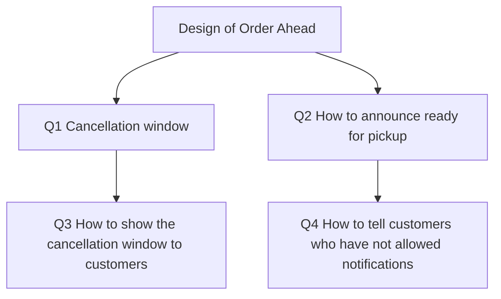

# Figure 47-01

[返回章节 / Back to chapter](../../en/47-chapter.md)

作者：kaito · [日文来源](https://zenn.dev/sc30gsw/books/080faba713547b/viewer/80691b) · [English source](https://zenn.dev/sc30gsw/books/7ff701b9811d04/viewer/58a03b)

