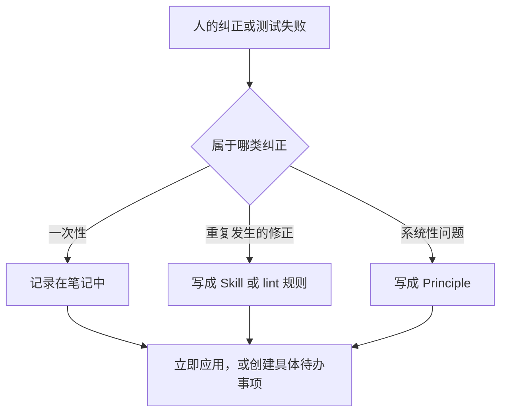

# 图示 26-01

[返回章节 / Back to chapter](../../zh-CN/26-chapter.md)

作者：kaito · [日文来源](https://zenn.dev/sc30gsw/books/080faba713547b/viewer/dd2d9f) · [English source](https://zenn.dev/sc30gsw/books/7ff701b9811d04/viewer/10f4b3)

