# Chapter 7: /poteto-mode, the entry point that routes each request

[Contents](README.md) · [Previous](09-chapter.md) · [Next](11-chapter.md) · [简体中文](../zh-CN/10-chapter.md)

By kaito · [Japanese original](https://zenn.dev/sc30gsw/books/080faba713547b/viewer/4fda7d) · [Author’s English edition](https://zenn.dev/sc30gsw/books/7ff701b9811d04/viewer/55bbdb)

Source snapshot: 2026-10-03. The text below preserves the author’s English edition.

[Authorization / 授权记录](../AUTHORIZATION.md)

<!-- book-body:start -->
`/poteto-mode` is the entry point to pstack. <strong>It reads the request, picks one of the 23 Playbooks, and follows that Playbook's steps to do the work</strong>.

The user does not have to say which Playbook to use, or which Skills to call in which order. All the user does is <strong>give the goal and the way to verify it, in their own words</strong>.

This chapter explains how to call `/poteto-mode`, what happens when you call it, the rules that route a request to a Playbook, and how to write a good request.

<a id="how-this-chapter-is-organized"></a>


## How this chapter is organized

This chapter has the following sections.

- You call `/poteto-mode` by putting it at the start of the request
- Calling it makes three things happen
- Fixed rules route the request to a Playbook
- A good request states the goal and the finish condition in your own words
- Summary: start the request with `/poteto-mode` and state the goal and the check

<a id="you-call-%2Fpoteto-mode-by-putting-it-at-the-start-of-the-request"></a>


## You call `/poteto-mode` by putting it at the start of the request

You call `/poteto-mode` <strong>by putting it at the start of a work request</strong>.

Once you call it, it stays active for later turns in the same conversation even without `/poteto-mode`, as the section "[Once called, it stays active for the rest of the conversation](#once-called%2C-it-stays-active-for-the-rest-of-the-conversation)" explains. If it is tedious to add it at the start of every conversation, you can also pin `/poteto-mode` as a [Custom Mode](https://cursor.com/changelog/0-48-x), a Cursor mode that makes the agent use the same Skill on every turn.

<a id="the-basic-usage-is-to-put-it-at-the-start-of-the-request"></a>


### The basic usage is to put it at the start of the request

The pstack [README](https://github.com/cursor/plugins/blob/main/pstack/README.md) positions `/poteto-mode` as the default entry point for all nontrivial work, and gives examples such as the following.

```
/poteto-mode this pr has a subtle bug where the scroll drifts every 750ms even when idle. repro first, then fix and verify.
```

This request does not say which Playbook or Skill to use. It states only two things. The symptom is that the scroll drifts every 750ms even when idle, and the work the user wants is to reproduce first, then fix, then verify.

`/poteto-mode` picks the Playbook and the Skills from the content of the request, so <strong>the user needs to write only the symptom and the work they want done</strong>.

The `reminder`, which the section "[In Cursor, you can pin it as a Custom Mode](#in-cursor%2C-you-can-pin-it-as-a-custom-mode)" covers, decides whether `/poteto-mode` applies. The `reminder` says to apply `/poteto-mode` to a new task only when a Playbook matches or the task needs rigor. It also says not to apply `/poteto-mode` to light requests, such as casual chat, or to questions.

So when you are unsure whether to add `/poteto-mode`, I think it is better to add it. For a light request or a question, the agent answers without following a Playbook's steps.

<a id="in-cursor%2C-you-can-pin-it-as-a-custom-mode"></a>


### In Cursor, you can pin it as a Custom Mode

If it is tedious to type `/poteto-mode` for every request, you can pin `/poteto-mode` as a [Custom Mode](https://cursor.com/changelog/0-48-x). *The Complete Guide to pstack* [Part 1](https://x.com/poteto/status/2094457600259842065) shows how.

When `/poteto-mode` autocompletes, press `Opt + Enter` instead of Enter. Cursor adds the Skill as a [Custom Mode](https://cursor.com/changelog/0-48-x), and on every new turn the agent gets a reminder to use this Skill.

The text of the reminder is in the frontmatter of [`/poteto-mode`](https://github.com/cursor/plugins/blob/main/pstack/skills/poteto-mode/SKILL.md), as `reminder`.

```
mode: true
reminder: New task? Playbook match or rigor needed -> apply /poteto-mode. Casual turn or user opts out -> don't.
```

<strong>Because of this one line, a pinned [Custom Mode](https://cursor.com/changelog/0-48-x) does not force a Playbook on every turn. The agent does not follow a Playbook's steps on turns with light requests such as casual chat, on turns with questions, or when the user says to stop the mode</strong>.

<a id="once-called%2C-it-stays-active-for-the-rest-of-the-conversation"></a>


### Once called, it stays active for the rest of the conversation

The README calls `/poteto-mode` a sticky mode. Sticky means that once you send a request with `/poteto-mode`, the mode stays active for later turns in the same conversation even without `/poteto-mode`.

In other words, the user runs `/poteto-mode` once in a conversation and does not need to add `/poteto-mode` explicitly on later turns.

While it is active, `/poteto-mode` follows a Playbook's steps only when the request matches a Playbook or the work needs rigor. For other requests, such as casual chat, it does not follow a Playbook's steps. To stop the mode, tell the agent to stop it.

So when you continue work in the same conversation, the request can be short. The bundled guide's [`02-poteto-mode.md`](https://github.com/cursor/plugins/blob/main/pstack/docs/guide/02-poteto-mode.md) lists examples such as these.

```
/poteto-mode do it
```

```
continue
```

```
keep going until done
```

The same page explains that a short request is enough because the mode is sticky and the Playbook contains the steps, which give the work its structure. <strong>The user's words convey the intent, and the Skill takes on the job of following the steps strictly</strong>.

But because `/poteto-mode` is sticky, when you move to a different topic in the same conversation, the agent may treat the new topic as a continuation of the previous task. The section [Say "new task" when you change topics](#say-%22new-task%22-when-you-change-topics) in this chapter covers how to ask when you change topics.

<a id="calling-it-makes-three-things-happen"></a>


## Calling it makes three things happen

When you call `/poteto-mode`, three things happen. <strong>It copies the Playbook's steps into a TODO list, calls other Skills as the steps require, and replies in a fixed style</strong>.

<aside class="msg message"><span class="msg-symbol">!</span><div class="msg-content">
<p class="code-line" data-line="84"><strong>TODO list.</strong> The TODO list is the plan, a list of things to do, that the agent makes at the start of the work. In Cursor, it appears in the chat view. From this list, the user can check which steps the agent worked through and which steps it skipped. The agent marks a skipped step with <code>skip: &lt;reason&gt;</code>, as the bundled guide <a href="https://github.com/cursor/plugins/blob/main/pstack/docs/guide/01-setup.md" rel="nofollow noopener noreferrer" target="_blank"><code>01-setup.md</code></a> describes.</p>
</div></aside>

The README describes the three as follows.

1. Match the request to a Playbook and open a TODO list. Its first items are the Playbook's steps, copied word for word
2. As the steps proceed, route to the other Skills they need
3. Write the reply to the user with the AI tells removed

<a id="1.-copy-the-playbook's-steps-into-the-todo-list-as-they-are"></a>


### 1. Copy the Playbook's steps into the TODO list as they are

The central rule of `/poteto-mode` is to copy the steps as they are. The `/poteto-mode` section "[Playbooks](https://github.com/cursor/plugins/blob/main/pstack/skills/poteto-mode/SKILL.md#playbooks)" begins with this rule.

> Open a todolist whose first items are the matched playbook's steps, copied in verbatim, before any task-specific todos. A step you choose not to do stays in the list with a one-line `skip: <reason>`.

The agent <strong>turns the Playbook's steps into the work list as they are, without summarizing them, and keeps the steps it will not do, with a reason</strong>.

This rule has two effects.

- <strong>The Playbook's order sets the structure of the work.</strong> The agent has less room to summarize or reorder the steps on its own judgment.
- <strong>Skipped steps stay visible.</strong> Steps the agent will not do remain as `skip: <reason>`, so the human can inspect the agent's decisions along the way, not only the result. The bundled guide's [`01-setup.md`](https://github.com/cursor/plugins/blob/main/pstack/docs/guide/01-setup.md) also says that the TODO list shows what the agent decided not to do.

<a id="2.-call-other-skills-when-a-step-requires-them"></a>


### 2. Call other Skills when a step requires them

Each step of a Playbook says which Skill to use and where. The agent does not call `/how` or `/architect` all at once at startup. It calls each one when the steps reach the point that needs it. [Chapter 8](https://zenn.dev/sc30gsw/books/7ff701b9811d04/viewer/cd0205) and [Chapter 9](https://zenn.dev/sc30gsw/books/7ff701b9811d04/viewer/84aa6e) cover this mechanism.

<a id="3.-write-the-reply-in-a-fixed-style"></a>


### 3. Write the reply in a fixed style

The `/poteto-mode` section "[Writing the reply](https://github.com/cursor/plugins/blob/main/pstack/skills/poteto-mode/SKILL.md#writing-the-reply)" sets the style of the reply. Its rules include the following.

- Write short, declarative sentences with one idea each
- Write first who the work is for and what changes
- Attach evidence to each claim, or a label of "measured", "inferred", or "guessed"

Every Playbook ends with a reply in this style, and the "Reply" line at the end of each Playbook says what that Playbook reports. [Chapter 35](https://zenn.dev/sc30gsw/books/7ff701b9811d04/viewer/9cd5c1) covers the full set of rules.

<a id="fixed-rules-route-the-request-to-a-playbook"></a>


## Fixed rules route the request to a Playbook

In the basic routing, <strong>the agent looks at the kind of request, such as a question that only needs investigation, a bug, or new behavior, and picks the one Playbook that fits</strong>.

But <strong>when the work is large, its size decides the route, not the kind of request</strong>. Even a request that matches a Playbook such as "[Feature](https://github.com/cursor/plugins/blob/main/pstack/skills/poteto-mode/playbooks/feature.md)" goes to `/figure-it-out` or "[Orchestrate](https://github.com/cursor/plugins/blob/main/pstack/skills/poteto-mode/playbooks/orchestrate.md)".

<a id="the-common-routes-are-five-playbooks-and-one-exception"></a>


### The common routes are five Playbooks and one exception

To get the overall picture of routing, you need only the five main Playbooks and the one exception for when no Playbook fits ([`/figure-it-out`](https://github.com/cursor/plugins/blob/main/pstack/skills/figure-it-out/SKILL.md)). The following diagram redraws the routing diagram in the bundled guide's `02-poteto-mode.md`.

<span class="embed-block zenn-embedded zenn-embedded-mermaid"><iframe data-content="flowchart%20TD%0A%20%20%20%20A%5BRequest%5D%20--%3E%20B%5B%22%2Fpoteto-mode%22%5D%0A%20%20%20%20B%20--%3E%20C%5BRead%20the%20list%20of%20Principles%5D%0A%20%20%20%20C%20--%3E%20D%7BClassify%20the%20kind%20of%20request%7D%0A%20%20%20%20D%20--%3E%7CQuestion%20that%20only%20needs%20investigation%7C%20E%5BInvestigation%5D%0A%20%20%20%20D%20--%3E%7CBug%7C%20F%5BBug%20fix%5D%0A%20%20%20%20D%20--%3E%7CNew%20behavior%7C%20G%5BFeature%5D%0A%20%20%20%20D%20--%3E%7CStructure-only%20change%7C%20H%5BRefactoring%5D%0A%20%20%20%20D%20--%3E%7CMeasurable%20slowness%7C%20I%5BPerf%20issue%5D%0A%20%20%20%20D%20--%3E%7CLarge%20work%2C%20or%20no%20match%7C%20J%5B%22%2Ffigure-it-out%22%5D%0A%20%20%20%20E%20--%3E%20K%5BVerify%20and%20report%5D%0A%20%20%20%20F%20--%3E%20K%0A%20%20%20%20G%20--%3E%20K%0A%20%20%20%20H%20--%3E%20K%0A%20%20%20%20I%20--%3E%20K%0A%20%20%20%20J%20--%3E%20K" frameborder="0" id="zenn-embedded__248385e7f04af" loading="lazy" scrolling="no" src="https://embed.zenn.studio/mermaid#zenn-embedded__248385e7f04af"></iframe></span>

<!-- book-diagram-link:start -->


[View diagram 1](../diagrams/en/10-01.md)
<!-- book-diagram-link:end -->

The diagram shows only the main routes. There are also Playbooks for the following work.

- Continuous improvement of a metric
- Diagnosis of runtime symptoms or of traces already captured
- Prototypes
- Visual matching
- Creating and evaluating Skills
- Long autonomous runs
- Opening a PR
- Watching a PR and shipping it to production
- Running a PR queue automatically
- Coordinating project-scale work
- Handing off and pausing work
- Multi-phase planning
- Cleaning up worktrees

[Part III](https://zenn.dev/sc30gsw/books/7ff701b9811d04/viewer/0d1535) covers all 23 in detail.

In the diagram, a "Read the list of Principles" stage comes before the agent classifies the kind of request. [Chapter 9](https://zenn.dev/sc30gsw/books/7ff701b9811d04/viewer/84aa6e) covers how the agent reads Principles.

<a id="large-work-goes-to-%2Ffigure-it-out%2C-and-project-scale-work-goes-to-%22orchestrate%22"></a>


### Large work goes to `/figure-it-out`, and project-scale work goes to "Orchestrate"

When the work is large, the agent routes it to `/figure-it-out` or the "Orchestrate" Playbook, ahead of any individual Playbook. These are two rules in the `/poteto-mode` section "Playbooks", and both change the route by the size of the work.

The first is `/figure-it-out`. The rule reads as follows.

> A large or cross-cutting effort (a migration across many call sites, an ambitious multi-part change), or work the user steps away from to trust later, routes to the <strong>figure-it-out</strong> skill even when a narrower playbook like Feature fits.

The agent <strong>decides the route by the size of the work, ahead of the wording of the request</strong>.

Work that matches no Playbook also goes to `/figure-it-out`.

`/figure-it-out` is a Skill that designs a rigorous, auditable Playbook for that task.

The second is "Orchestrate". It covers project-scale work that lasts for days, where one coordinator agent and many subagents move a large stack of PRs forward.

The difference between the two is that `/figure-it-out` designs a Playbook for one piece of work, while "Orchestrate" runs a whole effort that lasts for days.

But the description of "Orchestrate" states explicitly that work one agent can finish within the session budget goes to "[Autonomous run](https://github.com/cursor/plugins/blob/main/pstack/skills/poteto-mode/playbooks/autonomous-run.md)".

The rules come down to the following.

<table class="code-line" data-line="191">
<thead class="code-line" data-line="191">
<tr class="code-line" data-line="191">
<th>Nature of the request</th>
<th>Route</th>
</tr>
</thead>
<tbody class="code-line" data-line="193">
<tr class="code-line" data-line="193">
<td>Normal-size work that matches one Playbook</td>
<td>The matching Playbook</td>
</tr>
<tr class="code-line" data-line="194">
<td>Large, cross-cutting work, work you step away from and check later, or work that matches no Playbook</td>
<td><code>/figure-it-out</code></td>
</tr>
<tr class="code-line" data-line="195">
<td>An ongoing program that spans several days, many PRs, and many subagents</td>
<td>"Orchestrate"</td>
</tr>
<tr class="code-line" data-line="196">
<td>A long task that one agent can finish, such as "keep going until done"</td>
<td>"Autonomous run"</td>
</tr>
</tbody>
</table>

<a id="a-good-request-states-the-goal-and-the-finish-condition-in-your-own-words"></a>


## A good request states the goal and the finish condition in your own words

The bundled guide ([`docs/guide/`](https://github.com/cursor/plugins/blob/main/pstack/docs/guide/README.md)) recommends four things for writing a good request.

1. <strong>Write the goal and how to verify it</strong>
2. <strong>Do not list Skills</strong>
3. <strong>Do not make working time the finish condition</strong>
4. <strong>Say "new task" when you change topics</strong>

<a id="write-the-goal%2C-not-the-steps"></a>


### Write the goal, not the steps

The bundled guide's `02-poteto-mode.md` explains that a request does not need a detailed spec. It is enough to say what is wrong, what you want to achieve, and anything you already know that helps the work.

The guide has the following example of a bug request.

```
/poteto-mode users get two notifications after a retry. repro first, then fix and verify.
```

The guide explains that "repro first" is not politeness but <strong>a real constraint that the Playbook keeps</strong>. `/poteto-mode` does route this request to the "[Bug fix](https://github.com/cursor/plugins/blob/main/pstack/skills/poteto-mode/playbooks/bug-fix.md)" Playbook, and the TODO list starts with the reproduction step.

The table of contents of the bundled guide also gives a one-line summary. If you remember only one thing, remember <strong>to give the goal and the way to verify it in your own words</strong>.

For the verification, a good model is the bundled guide's example from [Chapter 2](https://zenn.dev/sc30gsw/books/7ff701b9811d04/viewer/950071): "text output does not change by a single byte, and the JSON parses." Both conditions are in a form the agent can run and judge as pass or fail by itself.

The verification is not the only thing worth writing in a request. Some example requests in *The Complete Guide to pstack* [Part 2](https://x.com/poteto/status/2097732320606507506) also state the shape of the result the user wants. For example, they ask the agent to show what is known, the data used, and the leading hypotheses separately. They also state when to review, for example "check with me before you proceed."

<a id="do-not-list-skills"></a>


### Do not list Skills

The bundled guide's `02-poteto-mode.md` says that a list of Skills in the request is a pitfall.

> <strong>Pitfall:</strong> don't enumerate skills in your prompt ("use /how, then /architect, then /arena..."). The playbook already sequences them, and a hand-written sequence usually reorders or drops steps the playbook would have kept. Name a skill only when you want to override a specific choice.

For example, if a bug request says "investigate with /how, then design with /architect", the hand-written order may drop the "reproduce it yourself" step that the "Bug fix" Playbook puts first. The guide's table of contents also says at the top that <strong>pstack works best when you stop micromanaging the agent</strong>.

The Playbook treats words like "repro first", from the section "[Write the goal, not the steps](#write-the-goal%2C-not-the-steps)", as constraints it keeps. <strong>Write the constraints in the request, and leave the steps for how to proceed to the Playbook.</strong> That is the division of work.

<a id="%22how-many-hours-to-keep-going%22-is-not-a-finish-condition"></a>


### "How many hours to keep going" is not a finish condition

When you step away, write the finish condition before you leave. The bundled guide's `02-poteto-mode.md` has the following example.

```
/poteto-mode im stepping away. keep going until the migration check reports zero old callers. log your decisions.
```

The bundled guide's page on overnight runs ([`07-overnight.md`](https://github.com/cursor/plugins/blob/main/pstack/docs/guide/07-overnight.md)) <strong>says that a length of time as the finish condition is a pitfall</strong>.

"Work on this for 4 hours" gives the agent nothing to verify, and in the morning you have 4 hours of activity instead of a result. [Chapter 15](https://zenn.dev/sc30gsw/books/7ff701b9811d04/viewer/305f88) covers overnight runs.

The goal in the example above, "the migration check reports zero old callers", is a check the agent can run and pass or fail by itself. <strong>Instead of a length of time, write a check that runs and returns pass or fail as the finish condition</strong>.

<a id="say-%22new-task%22-when-you-change-topics"></a>


### Say "new task" when you change topics

`/poteto-mode` stays active within a conversation, so a long conversation builds up context from earlier tasks. For this reason, the bundled guide's `02-poteto-mode.md` recommends that you say "new task" when you change topics.

```
/poteto-mode new task. figure out why the cache entry survives logout. don't change any code yet.
```

In other words, <strong>"new task" is the signal that makes the agent pick the Playbook again</strong>.

If you change topics without saying "new task", the Playbook in progress may treat the new question as a continuation of the previous work.

<a id="summary%3A-start-the-request-with-%2Fpoteto-mode-and-state-the-goal-and-the-check"></a>


## Summary: start the request with `/poteto-mode` and state the goal and the check

- <strong>How to call it.</strong> `/poteto-mode` is the entry point to pstack. You call it by putting it at the start of a request, and it is the default entry point for all nontrivial work. Once called, it stays active for the rest of the conversation. In Cursor, you can also pin it as a [Custom Mode](https://cursor.com/changelog/0-48-x) with `Opt + Enter`.
- <strong>What happens when you call it.</strong> It picks a Playbook, copies the Playbook's steps word for word into the TODO list, calls Skills as the steps require, and replies in a fixed style. Skipped steps stay as `skip: <reason>`, so you can inspect the work along the way.
- <strong>The routing rules.</strong> In the basic case, it picks one Playbook by the kind of request. Large work goes to `/figure-it-out`, and ongoing project-scale work goes to "Orchestrate".
- <strong>How to write a good request.</strong> Write the goal and how to verify it in your own words, do not list Skills, do not make working time the finish condition, and say "new task" when you change topics.

The next chapter, [Chapter 8](https://zenn.dev/sc30gsw/books/7ff701b9811d04/viewer/cd0205), covers the three parts that work inside `/poteto-mode`: Playbook, Skill, and Principle. It explains how their roles differ, and uses this book's running example request to trace where Skills and Principles act in each step of the "Bug fix" Playbook.
<!-- book-body:end -->

---

[Contents](README.md) · [Previous](09-chapter.md) · [Next](11-chapter.md) · [简体中文](../zh-CN/10-chapter.md)
