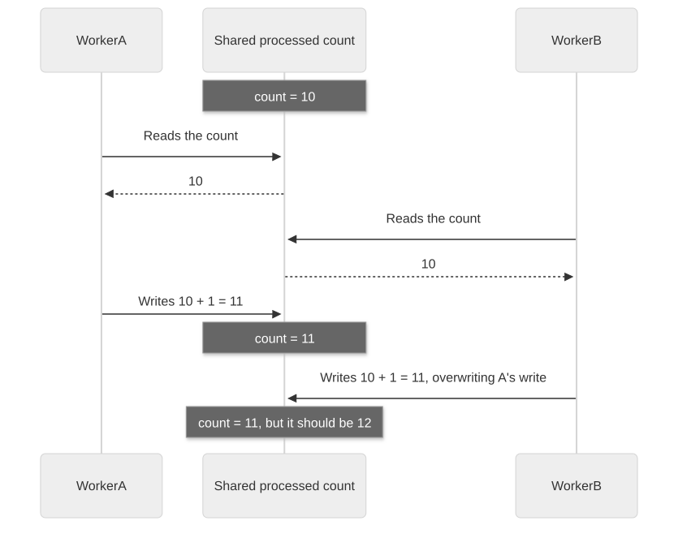
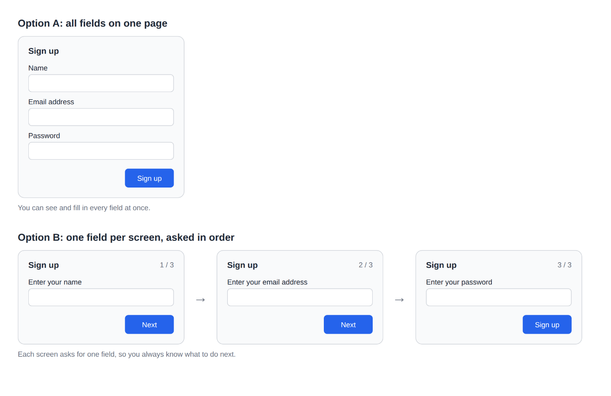

# Chapter 17: Core: ten principles that decide how work proceeds

[Contents](README.md) · [Previous](21-chapter.md) · [Next](23-chapter.md) · [简体中文](../zh-CN/22-chapter.md)

By kaito · [Japanese original](https://zenn.dev/sc30gsw/books/080faba713547b/viewer/a8e80b) · [Author’s English edition](https://zenn.dev/sc30gsw/books/7ff701b9811d04/viewer/97d863)

Source snapshot: 2026-10-03. The text below preserves the author’s English edition.

[Authorization / 授权记录](../AUTHORIZATION.md)

<!-- book-body:start -->
This chapter covers the following ten principles.

1. [Laziness Protocol](https://github.com/cursor/plugins/blob/main/pstack/skills/principle-laziness-protocol/SKILL.md)
2. [Subtract Before You Add](https://github.com/cursor/plugins/blob/main/pstack/skills/principle-subtract-before-you-add/SKILL.md)
3. [Minimize Reader Load](https://github.com/cursor/plugins/blob/main/pstack/skills/principle-minimize-reader-load/SKILL.md)
4. [Foundational Thinking](https://github.com/cursor/plugins/blob/main/pstack/skills/principle-foundational-thinking/SKILL.md)
5. [Redesign from First Principles](https://github.com/cursor/plugins/blob/main/pstack/skills/principle-redesign-from-first-principles/SKILL.md)
6. [Attack the Premise](https://github.com/cursor/plugins/blob/main/pstack/skills/principle-attack-the-premise/SKILL.md)
7. [Outcome-Oriented Execution](https://github.com/cursor/plugins/blob/main/pstack/skills/principle-outcome-oriented-execution/SKILL.md)
8. [Experience First](https://github.com/cursor/plugins/blob/main/pstack/skills/principle-experience-first/SKILL.md)
9. [Exhaust the Design Space](https://github.com/cursor/plugins/blob/main/pstack/skills/principle-exhaust-the-design-space/SKILL.md)
10. [Build the Lever](https://github.com/cursor/plugins/blob/main/pstack/skills/principle-build-the-lever/SKILL.md)

These ten belong to the Core group of principles. The bundled guide's page [`docs/guide/08-principles.md`](https://github.com/cursor/plugins/blob/main/pstack/docs/guide/08-principles.md) describes the Core ten as principles that decide "<strong>how much to build and when to revisit the design</strong>." The agent uses them for decisions such as keeping the diff minimal, cutting complexity before adding a feature, and questioning the premise after two fixes built on it have failed.

A plain list of the ten does not show which principle serves which kind of decision. So this chapter sorts the ten into four groups by what the decision is about. The four groups are as follows.

- <strong>1 to 3.</strong> Principles that reduce code.
- <strong>4 to 7.</strong> Principles that decide where the design sits, meaning its foundation and when to revisit it.
- <strong>8 and 9.</strong> Principles that decide what to aim for, meaning the target shape, based on the user's experience and on several options.
- <strong>10.</strong> The principle that turns manual work into tools.

This chapter explains the ten principles in this order, one at a time, from the following angles.

- <strong>Rule.</strong> What the principle requires.
- <strong>Trigger condition.</strong> The situations where the principle applies.

<a id="how-this-chapter-is-organized"></a>


## How this chapter is organized

This chapter is organized as follows.

- Three premises to know before reading the Principles
- A list of the ten principles
- "Laziness Protocol" gets the largest result from the smallest change
- "Subtract Before You Add" cuts complexity before adding a feature
- "Minimize Reader Load" reduces the layers of indirection a reader follows and the code state a reader has to keep in mind
- "Foundational Thinking" settles data structures and foundations before logic
- "Redesign from First Principles" redesigns as if the new requirement had been a premise from the start
- "Attack the Premise" questions the premise when fixes built on it fail the same test twice
- "Outcome-Oriented Execution" puts a verifiable end state ahead of temporary code that keeps mid-migration code consistent
- "Experience First" picks the user's experience over what is convenient to implement
- "Exhaust the Design Space" builds and compares two or three options for an unprecedented design
- "Build the Lever" builds a tool that does the work instead of doing it by hand
- Summary

<a id="three-premises-to-know-before-reading-the-principles"></a>


## Three premises to know before reading the Principles

I covered how Principles work in [Chapter 8](https://zenn.dev/sc30gsw/books/7ff701b9811d04/viewer/cd0205) and [Chapter 9](https://zenn.dev/sc30gsw/books/7ff701b9811d04/viewer/84aa6e). For this chapter, these three points are enough.

1. <strong>A Principle decides whether the current change goes in, or whether the work is not done yet</strong>  
   <strong>A Principle itself is a standard for judgment, not a procedure or a capability.</strong> Some Principles, though, such as "Build the Lever" and "[Prove It Works](https://github.com/cursor/plugins/blob/main/pstack/skills/principle-prove-it-works/SKILL.md)," require you to write a script when they apply.
2. <strong>The trigger conditions are written in the Principle list of `/poteto-mode` and at the top of each Principle</strong>  
   This book calls the situations where a principle applies its trigger conditions. The trigger conditions in this chapter are my translations of two sources. The first is the "when it applies" part of each item under "[Principles](https://github.com/cursor/plugins/blob/main/pstack/skills/poteto-mode/SKILL.md#principles)" in `/poteto-mode`. The second is the situations named in the description at the top of each Principle's `SKILL.md`.
3. <strong>The agent uses a principle even if the request does not name it</strong>  
   <strong>When the work matches a trigger condition, the agent reads the principle and applies it on its own.</strong> However, <strong>the agent reads the Principle index at the start of multi-step work, and the agent also decides whether a principle applies</strong>. So the agent can miss a situation where a principle applies.  
   If the agent misses or skips a principle, a human can <strong>name the principle in the request</strong>. The agent then applies that principle and corrects the direction of the work.

<aside class="msg message"><span class="msg-symbol">!</span><div class="msg-content">
<p class="code-line" data-line="60">Of the ten, this chapter gives example requests for only three: "Subtract Before You Add," "Exhaust the Design Space," and "Build the Lever."</p>
<p class="code-line" data-line="62">This book limits example requests to the ones that appear in pstack's bundled guide or <a href="https://github.com/cursor/plugins/blob/main/pstack/README.md" rel="nofollow noopener noreferrer" target="_blank">README</a>. If I wrote example requests for principles whose source has none, I might show a use that pstack does not intend.</p>
</div></aside>

<a id="a-list-of-the-ten-principles"></a>


## A list of the ten principles

<table class="code-line" data-line="67">
<thead class="code-line" data-line="67">
<tr class="code-line" data-line="67">
<th>Group</th>
<th>Principle</th>
<th>The conclusion in one sentence</th>
</tr>
</thead>
<tbody class="code-line" data-line="69">
<tr class="code-line" data-line="69">
<td>Reduce code</td>
<td>"Laziness Protocol"</td>
<td>Get the largest result with the least code and complexity</td>
</tr>
<tr class="code-line" data-line="70">
<td>Reduce code</td>
<td>"Subtract Before You Add"</td>
<td>Cut complexity before adding a feature</td>
</tr>
<tr class="code-line" data-line="71">
<td>Reduce code</td>
<td>"Minimize Reader Load"</td>
<td>Reduce the layers of indirection a reader follows and the code state a reader has to keep in mind</td>
</tr>
<tr class="code-line" data-line="72">
<td>Where the design sits</td>
<td>"Foundational Thinking"</td>
<td>Settle data structures and foundations before logic</td>
</tr>
<tr class="code-line" data-line="73">
<td>Where the design sits</td>
<td>"Redesign from First Principles"</td>
<td>Redesign as if the new requirement had been a premise from the start</td>
</tr>
<tr class="code-line" data-line="74">
<td>Where the design sits</td>
<td>"Attack the Premise"</td>
<td>When fixes built on the same premise fail the same test twice, question the premise</td>
</tr>
<tr class="code-line" data-line="75">
<td>Where the design sits</td>
<td>"Outcome-Oriented Execution"</td>
<td>Put a verifiable end state ahead of temporary code that keeps mid-migration code consistent</td>
</tr>
<tr class="code-line" data-line="76">
<td>What to aim for</td>
<td>"Experience First"</td>
<td>Pick the user's experience over what is convenient to implement</td>
</tr>
<tr class="code-line" data-line="77">
<td>What to aim for</td>
<td>"Exhaust the Design Space"</td>
<td>For an unprecedented design, build and compare two or three options</td>
</tr>
<tr class="code-line" data-line="78">
<td>Turn into tools</td>
<td>"Build the Lever"</td>
<td>Instead of doing the work by hand, build a tool that does the work or a tool that proves the work is correct</td>
</tr>
</tbody>
</table>

<a id="%22laziness-protocol%22-gets-the-largest-result-from-the-smallest-change"></a>


## "Laziness Protocol" gets the largest result from the smallest change

The principle "Laziness Protocol" requires you to <strong>get the largest result with the least code and complexity</strong>. It judges a solution by one standard: <strong>whether that code would exhaust a human developer who maintains it</strong>. The skill states the standard this way: "<strong>If a human developer would find the code exhausting to maintain, it is a bad solution.</strong>"

<a id="rule%3A-delete-code%2C-flatten-the-call-hierarchy%2C-and-decide-each-choice-in-one-place"></a>


### Rule: delete code, flatten the call hierarchy, and decide each choice in one place

The main rules are as follows.

<a id="look-for-what-you-can-delete-first"></a>


#### Look for what you can delete first

When a request asks you to improve something, look for what you can delete before you add code.

<a id="flatten-the-call-hierarchy"></a>


#### Flatten the call hierarchy

If you have to follow four or more files, or four or more layers of calls, to find something in the code, remove the layers in between and flatten the hierarchy. Code that answers a question only after many layers wears out the people who maintain it.

<a id="put-each-decision-in-one-place"></a>


#### Put each decision in one place

Do not check the same condition in several places. Check it in one place.  
For example, check once whether an input field is empty, and use the result in several places, such as "enabling or disabling the button" and "showing a hint." When the condition changes, you fix only that one check. If the same decision lives in many places, the work of keeping the copies in sync never ends.

<a id="keep-the-diff-minimal"></a>


#### Keep the diff minimal

Fewer lines beat elaborate boilerplate.

<a id="stop-before-passing-a-new-value-through-layers"></a>


#### Stop before passing a new value through layers

When a request asks you to pass a new value through types, schemas, pipelines, and other layers, stop and look for a more direct option.

For example, suppose you add a feature that shows a button only to paying members. Instead of adding a new "is a paying member" value to the API types, the conversion step, and the values passed from parent to child, first look for a way to decide directly from user data already available near the button.

<a id="trigger-conditions"></a>


### Trigger conditions

- When you refactor or estimate the size of a diff
- When you are tempted to add an abstraction or a layer
- When you are tempted to pass a new value across many layers

<a id="%22subtract-before-you-add%22-cuts-complexity-before-adding-a-feature"></a>


## "Subtract Before You Add" cuts complexity before adding a feature

The principle "Subtract Before You Add" requires that <strong>when you grow a system, you remove complexity first and then build</strong>. Adding a feature to a complex system piles more complexity on top. If you cut complexity first, the code shrinks, the system's essential structure shows, and the next design step usually becomes clear.

<a id="rule%3A-remove-complexity-before-you-build"></a>


### Rule: remove complexity before you build

The rules are these:

- Remove complexity before you build, and cut down to the minimum before you polish quality
- Do not add handling for edge cases whose need nobody has confirmed yet. Design for the uses you have observed
- Keep validators and guards to what the spec requires. Do not add them on a guess
- Delete duplicated instructions in the text of prompts and Skills too

<a id="trigger-conditions-1"></a>


### Trigger conditions

When you decide the order in which to add features or processing, or when you refactor or rewrite.

<a id="example-request%3A-delete-the-old-adapters%2C-then-design"></a>


### Example request: delete the old adapters, then design

The bundled guide gives the following example request for a situation where the agent is about to add a fourth adapter to three existing ones.

```
use subtract before you add. delete the obsolete adapters first, then design what's left.
```

<aside class="msg message"><span class="msg-symbol">!</span><div class="msg-content">
<p class="code-line" data-line="143">An <strong>adapter</strong> is a component that absorbs the differences between external services so you can call them the same way.</p>
<p class="code-line" data-line="145">For example, the payment services of companies A, B, and C each have a different calling convention. With one adapter per company, the app calls any of them with the same <code>pay(amount)</code>.</p>
</div></aside>

<a id="%22minimize-reader-load%22-reduces-the-layers-of-indirection-a-reader-follows-and-the-code-state-a-reader-has-to-keep-in-mind"></a>


## "Minimize Reader Load" reduces the layers of indirection a reader follows and the code state a reader has to keep in mind

The principle "Minimize Reader Load" defines maintainability as "<strong>the amount of work a reader does to understand the code</strong>." People read code far more often than they write it.

The principle measures the reader's load on two axes, "layers followed" and "state held."

"Layers followed" is the number of functions or files a reader has to step through between asking a question and reaching the answer.

"State held" is the hidden state and the mutable values a reader has to keep in mind to understand how the code behaves. State held measures how much the reader has to track which value changes where.

The two axes make code hard to read in different ways.

For example, a single file with no deep chain of functions is still hard to follow if it has 50 global variables, which anything can change. The reader struggles to track when and where a value changes. On the other hand, code with few variables is also hard to read if the reader has to go through six layers of adapters, which are layers that handle conversion, to reach the answer.

So the principle asks you to reduce both axes.

"Minimize Reader Load" is the human version of "[Guard the Context Window](https://github.com/cursor/plugins/blob/main/pstack/skills/principle-guard-the-context-window/SKILL.md)" in [Chapter 20](https://zenn.dev/sc30gsw/books/7ff701b9811d04/viewer/0ec4d6), the principle that keeps large outputs from filling the agent's context window. The agent is not the only one with a working memory, a limit on how much it can hold at once. The humans who read code have the same limit.

<a id="rule%3A-reduce-layers-and-state"></a>


### Rule: reduce layers and state

<a id="remove-layers-that-only-pass-things-through"></a>


#### Remove layers that only pass things through

If a function only calls another function and is used from only one place, remove it and call the inner function directly from the caller.  
For example, if `saveUser()` only calls `db.save()`, call `db.save()` directly.

```
type User = { name: string };
declare const db: { save(user: User): Promise<void> };
declare const user: User;

// Before: saveUser only calls db.save, and this is the only place it is used
function saveUser(user: User) {
  return db.save(user);
}
await saveUser(user);

// After: remove saveUser and call db.save directly
await db.save(user);
```

Remove a layer between the caller and the real work in the same way when no other implementation ever replaces the code behind the layer. The rule includes layers that someone added with future extensibility in mind.

For example, suppose you use only one payment service but put a swappable interface such as `PaymentGateway` in front of it. A layer like that only makes the reader open the layer to check what is inside.

```
declare const aPayClient: { charge(amount: number): Promise<void> };

// Before: a swappable interface sits in front, but the only implementation is the one for company A
interface PaymentGateway {
  pay(amount: number): Promise<void>;
}

class APayPaymentGateway implements PaymentGateway {
  pay(amount: number) {
    return aPayClient.charge(amount);
  }
}

const gateway: PaymentGateway = new APayPaymentGateway();
await gateway.pay(1000);

// After: remove the interface and call company A's payment directly
await aPayClient.charge(1000);
```

<a id="narrow-the-scope-of-state"></a>


#### Narrow the scope of state

Narrow the range from which a value can change. For example, pick a local variable, which only one function uses, over a global variable, which anything can change.

Also, do not keep a value that you can compute from other values as a separate variable.  
For example, if you keep a "number of products" variable apart from the product list, you have to update the count every time the list changes. If you add a product to a list of three and forget to update the count, the list has four items but the count still says 3. Count the list when you need the number.

The narrower the scope of state, the less code state the reader has to keep in mind.

<a id="check-an-invariant-once-at-the-boundary-and-give-it-a-name"></a>


#### Check an invariant once at the boundary and give it a name

An invariant is a condition that must hold the whole time the program runs, such as "the amount is 0 or more." The principle asks you to check an invariant once at the boundary, not at every place that uses the value.

<aside class="msg message"><span class="msg-symbol">!</span><div class="msg-content">
<p class="code-line" data-line="227">A <strong>boundary</strong> here is a place where data comes in from outside, such as form input or an API response.</p>
<p class="code-line" data-line="229">For example, the function that receives an amount from an order form checks "is the amount 0 or more" once, and passes the checked value on as a type named <code>NonNegativeAmount</code>, which means an amount of 0 or more.</p>
<p class="code-line" data-line="231">The functions that use the amount, such as one that computes a total and one that creates an invoice, take it as a <code>NonNegativeAmount</code> and do not repeat the same check.</p>
<p class="code-line" data-line="233">The type name tells you that "this amount was checked to be 0 or more at the boundary." With this approach, <strong>the reader learns the condition once by reading one place at the boundary and the name of the type</strong>.</p>
<div class="code-block-container"><pre class="shiki github-dark" style="background-color:#151e2c;color:#e1e4e8"><code class="code-line" data-line="235"><span class="line"><span style="color:#a0aab5">// A type for an amount already checked to be 0 or more</span></span>
<span class="line"><span style="color:#F97583">type</span><span style="color:#B392F0"> NonNegativeAmount</span><span style="color:#F97583"> =</span><span style="color:#79B8FF"> number</span><span style="color:#F97583"> &amp;</span><span style="color:#E1E4E8"> { </span><span style="color:#F97583">readonly</span><span style="color:#FFAB70"> __brand</span><span style="color:#F97583">:</span><span style="color:#9ECBFF"> "NonNegativeAmount"</span><span style="color:#E1E4E8"> };</span></span>
<span class="line"></span>
<span class="line"><span style="color:#a0aab5">// Boundary: check the amount from the order form once, here</span></span>
<span class="line"><span style="color:#F97583">function</span><span style="color:#B392F0"> parseAmount</span><span style="color:#E1E4E8">(</span><span style="color:#FFAB70">input</span><span style="color:#F97583">:</span><span style="color:#79B8FF"> number</span><span style="color:#E1E4E8">)</span><span style="color:#F97583">:</span><span style="color:#B392F0"> NonNegativeAmount</span><span style="color:#E1E4E8"> {</span></span>
<span class="line"><span style="color:#F97583">  if</span><span style="color:#E1E4E8"> (input </span><span style="color:#F97583">&lt;</span><span style="color:#79B8FF"> 0</span><span style="color:#E1E4E8">) {</span></span>
<span class="line"><span style="color:#F97583">    throw</span><span style="color:#F97583"> new</span><span style="color:#B392F0"> Error</span><span style="color:#E1E4E8">(</span><span style="color:#9ECBFF">"Enter an amount of 0 or more"</span><span style="color:#E1E4E8">);</span></span>
<span class="line"><span style="color:#E1E4E8">  }</span></span>
<span class="line"></span>
<span class="line"><span style="color:#F97583">  return</span><span style="color:#E1E4E8"> input </span><span style="color:#F97583">as</span><span style="color:#B392F0"> NonNegativeAmount</span><span style="color:#E1E4E8">; </span><span style="color:#a0aab5">// We just checked it, so this is the only place we assign the type</span></span>
<span class="line"><span style="color:#E1E4E8">}</span></span>
<span class="line"></span>
<span class="line"><span style="color:#a0aab5">// User side: it takes a NonNegativeAmount, so it does not check "0 or more" again</span></span>
<span class="line"><span style="color:#F97583">function</span><span style="color:#B392F0"> calcTotal</span><span style="color:#E1E4E8">(</span><span style="color:#FFAB70">price</span><span style="color:#F97583">:</span><span style="color:#B392F0"> NonNegativeAmount</span><span style="color:#E1E4E8">, </span><span style="color:#FFAB70">quantity</span><span style="color:#F97583">:</span><span style="color:#79B8FF"> number</span><span style="color:#E1E4E8">)</span><span style="color:#F97583">:</span><span style="color:#79B8FF"> number</span><span style="color:#E1E4E8"> {</span></span>
<span class="line"><span style="color:#F97583">  return</span><span style="color:#E1E4E8"> price </span><span style="color:#F97583">*</span><span style="color:#E1E4E8"> quantity;</span></span>
<span class="line"><span style="color:#E1E4E8">}</span></span>
<span class="line"></span>
<span class="line"><span style="color:#F97583">function</span><span style="color:#B392F0"> createInvoice</span><span style="color:#E1E4E8">(</span><span style="color:#FFAB70">amount</span><span style="color:#F97583">:</span><span style="color:#B392F0"> NonNegativeAmount</span><span style="color:#E1E4E8">)</span><span style="color:#F97583">:</span><span style="color:#79B8FF"> string</span><span style="color:#E1E4E8"> {</span></span>
<span class="line"><span style="color:#F97583">  return</span><span style="color:#9ECBFF"> `Amount due: ${</span><span style="color:#E1E4E8">amount</span><span style="color:#9ECBFF">} yen`</span><span style="color:#E1E4E8">;</span></span>
<span class="line"><span style="color:#E1E4E8">}</span></span>
<span class="line"></span></code></pre></div>
<p class="code-line" data-line="258"><code>calcTotal</code> and <code>createInvoice</code> have no check such as <code>if (amount &lt; 0)</code>. If you pass a number that did not go through <code>parseAmount</code>, the compiler reports an error, so the user side does not need to check again.</p>
</div></aside>

<a id="judge-with-the-30-second-test"></a>


#### Judge with the 30-second test

<strong>The principle uses a "30-second test" to judge whether there are too many layers or too much state.</strong> If a new reader cannot answer "where does X come from" and "what can change X" within 30 seconds, cut layers or state.

<a id="trigger-conditions-2"></a>


### Trigger conditions

When you review code whose flow is hard to follow, or when you write such code or restructure it.

<a id="%22foundational-thinking%22-settles-data-structures-and-foundations-before-logic"></a>


## "Foundational Thinking" settles data structures and foundations before logic

The principle "Foundational Thinking" requires you to <strong>settle the shape of the data before you write logic</strong>.

The principle divides decisions into the following two kinds.

1. Structural decisions
2. Decisions about how to write the code

Structural decisions protect future options. A structural decision here means "deciding the shape of the data and the order of the work," and a future option means "room to choose a different path later."  
Decisions about how to write the code protect the code's simplicity. If you choose the right data structure, what to write in the code that follows becomes obvious.

In *The Complete Guide to pstack* [Part 2](https://x.com/poteto/status/2097732320606507506), poteto describes a division of labor: <strong>in the age of agents, engineers spend their time choosing the architecture and the data structures, and the agent fills in the implementation details</strong>. This principle puts the choice of data structure at the start of the agent's work.

<a id="rule%3A-settle-the-data-structure%2C-separate-concurrent-state%2C-and-build-the-foundation-before-stacking-mechanisms-on-it"></a>


### Rule: settle the data structure, separate concurrent state, and build the foundation before stacking mechanisms on it

<a id="settle-the-data-structure-first"></a>


#### Settle the data structure first

Before you write logic, decide the type of the central data. Then list every place that reads or writes that data and how, and pick the shape that fits the most common operation.

For example, for a product list feature, first decide the shape "a product has a name, a price, and a stock count." Only then think about how to write the display or the add-to-cart step. Once the shape of the data is settled, you can write the code that uses it without hesitation.

```
// Decide first: a product has a name, a price, and a stock count
type Product = {
  name: string;
  price: number;
  stock: number;
};

// The shape is settled, so the display and add-to-cart code are clear to write
function formatProduct(product: Product): string {
  return `${product.name} ${product.price} yen (stock: ${product.stock})`;
}

function canAddToCart(product: Product): boolean {
  return product.stock > 0;
}
```

<a id="in-code%2C-remove-duplicated-structure-before-duplicated-lines"></a>


#### In code, remove duplicated structure before duplicated lines

Instead of pulling every set of similar lines into a shared function, remove duplicated structure, such as the shape of data.

The principle says three similar statements in a row are better left as they are than merged in a hurry. It also prefers code that is obvious on sight to clever code. Clever code here means code that is short but that a reader cannot understand on the first read. For example, write `n % 2 === 1` to check whether a number is odd, not a bit operation such as `n & 1`.

<strong>Premature abstraction and clever code work against the goal of keeping code simple.</strong>

<a id="separate-values-that-can-be-written-at-the-same-time-instead-of-sharing-them"></a>


#### Separate values that can be written at the same time instead of sharing them

Here an actor is a Worker or an agent that runs at the same time as others. Before several actors share one value, ask "<strong>what happens if another actor writes the same value at the same time?</strong>" If something goes wrong, do not share the value. Give each actor its own value.

For example, two Workers, A and B, each add 1 to a shared "processed count." If A and B run at nearly the same time while the count is 10, the following happens.

<span class="embed-block zenn-embedded zenn-embedded-mermaid"><iframe data-content="sequenceDiagram%0A%20%20%20%20participant%20A%20as%20WorkerA%0A%20%20%20%20participant%20S%20as%20Shared%20processed%20count%0A%20%20%20%20participant%20B%20as%20WorkerB%0A%20%20%20%20Note%20over%20S%3A%20count%20%3D%2010%0A%20%20%20%20A-%3E%3ES%3A%20Reads%20the%20count%0A%20%20%20%20S--%3E%3EA%3A%2010%0A%20%20%20%20B-%3E%3ES%3A%20Reads%20the%20count%0A%20%20%20%20S--%3E%3EB%3A%2010%0A%20%20%20%20A-%3E%3ES%3A%20Writes%2010%20%2B%201%20%3D%2011%0A%20%20%20%20Note%20over%20S%3A%20count%20%3D%2011%0A%20%20%20%20B-%3E%3ES%3A%20Writes%2010%20%2B%201%20%3D%2011%2C%20overwriting%20A's%20write%0A%20%20%20%20Note%20over%20S%3A%20count%20%3D%2011%2C%20but%20it%20should%20be%2012" frameborder="0" id="zenn-embedded__cde44d38db396" loading="lazy" scrolling="no" src="https://embed.zenn.studio/mermaid#zenn-embedded__cde44d38db396"></iframe></span>

<!-- book-diagram-link:start -->


[View diagram 1](../diagrams/en/22-01.md)
<!-- book-diagram-link:end -->

The two Workers each processed one item, so the count should be 12. But B writes 11 based on the 10 it read before A wrote, so the count ends at 11 and one item is lost.

So give each Worker its own count, and add them up only when you need the total. When each actor has its own value, no other actor can overwrite it in the first place.

```
type Job = { id: string };
declare const store: {
  get(key: string): Promise<number>;
  set(key: string, value: number): Promise<void>;
};
declare function processJob(job: Job): Promise<void>;
declare const jobsForA: Job[];
declare const jobsForB: Job[];

// Before: all Workers share one "processed count" and read it before writing
async function countUp() {
  // A and B read 10 at nearly the same time
  const current = await store.get("processedCount"); 
  // Both write 11, and one item is lost
  await store.set("processedCount", current + 1);
}

// After: give each Worker its own count, and add them up only when you need the total
async function runWorker(jobs: Job[]): Promise<number> {
  let processedCount = 0; // A value for this Worker only

  for (const job of jobs) {
    await processJob(job);
    processedCount += 1;
  }

  return processedCount;
}

const counts = await Promise.all([runWorker(jobsForA), runWorker(jobsForB)]);
const total = counts[0] + counts[1];
```

<a id="build-the-foundation-first"></a>


#### Build the foundation first

Ask "<strong>does every later stage benefit from having this?</strong>" If the answer is "yes," build it first. CI, lint, test infrastructure, and shared types are examples of a foundation. The principle calls this kind of foundation <strong>scaffold</strong>.

Do setup before features, and write tests before fixes. Also prefer small commits with a single purpose. When the foundation comes first, all later work can use it.

However, <strong>deleting unused code comes before building the foundation</strong>.

If you build the foundation while unused code is still there, the shared types and tests end up supporting that unneeded code too. If you delete it first, only the parts that are really in use remain visible, and you can build a foundation that fits them. Deleting first is the same idea as ["Subtract Before You Add"](#%22subtract-before-you-add%22-cuts-complexity-before-adding-a-feature) in this chapter.

As [Chapter 4](https://zenn.dev/sc30gsw/books/7ff701b9811d04/viewer/3cc0dd) showed, the codebase is also the agent's memory. This book reads the priority on deleting unused code as a way to keep wrong context out of the codebase as well.

<a id="put-one-coherent-mechanism-in-place-with-each-change"></a>


#### Put one coherent mechanism in place with each change

With each change, build one coherent mechanism, such as a shared function or component that several places can use. Or make an existing mechanism, such as a shared function or component, easier to use.

When you add a new feature, do not scatter special-case handling across every place that uses it. For example, to add sorting to a product list, do not add sorting logic to every screen that shows the list. Build one component that handles sorting, and have each screen call it.

<strong>When a new feature lives in one place, anyone who reads or fixes it only has to look at that one place.</strong>

<a id="trigger-conditions-3"></a>


### Trigger conditions

- Before you write logic, when you choose the central types or data structures
- When you decide whether to build the foundation or the feature first. The foundation is the set of mechanisms that all later work uses, such as CI, lint, test infrastructure, and shared types
- When you consider what several concurrent <strong>actors</strong> share

<aside class="msg message"><span class="msg-symbol">!</span><div class="msg-content">
<p class="code-line" data-line="404">An <strong>actor</strong> here is anything that runs at the same time as others and moves work forward.</p>
<p class="code-line" data-line="406">For example, several Workers that take jobs from a queue and process them in parallel are actors. A Worker here is a program that handles processing. Several agents that work in the same repository at the same time are actors too.</p>
</div></aside>

<a id="%22redesign-from-first-principles%22-redesigns-as-if-the-new-requirement-had-been-a-premise-from-the-start"></a>


## "Redesign from First Principles" redesigns as if the new requirement had been a premise from the start

The principle "Redesign from First Principles" requires you not to bolt a change onto the current design, but to <strong>redesign as if the requirement had existed from the start</strong>. This book reads "Foundational Thinking" as "the principle for building something new" and "Redesign from First Principles" as "the principle for working a change into an existing design."

<a id="rule%3A-redesign-in-four-steps"></a>


### Rule: redesign in four steps

1. Read every affected file and understand the current design
2. Ask, "If I had known this new requirement from the start and were writing from scratch, what would I build?"
3. Update every place the change touches to match the new design, down to types, docs, examples, and the sections that record design rationale
4. Think through the whole redesigned picture first, then land the change in small pieces

For example, take the case "add dollar payments to a pricing calculation that only handled Japanese yen." You can think about it like this.

- A bolt-on adds a branch "if it is dollars, calculate it this way" at every place that uses an amount
- A redesign asks, "How would I build this if handling several currencies had been a premise from the start?" and changes the amount into "a pair of a number and a currency"

Finally, to reflect the redesign, update every place that uses an amount, along with the types and the docs, to match that shape.

```
// Bolt-on: keep the amount as a number in yen, and add an "if dollars" branch at every place that uses it
function formatPrice(amount: number, isDollar: boolean): string {
  if (isDollar) {
    return `$${amount.toFixed(2)}`;
  }

  return `${amount} yen`;
}
```

```
// Redesign: hold the amount as "a pair of a number and a currency," and have every place that uses it take this type
type Currency = "JPY" | "USD";
type Money = { amount: number; currency: Currency };

function formatPrice(price: Money): string {
  if (price.currency === "USD") {
    return `$${price.amount.toFixed(2)}`;
  }

  return `${price.amount} yen`;
}
```

The principle describes these four steps as the way to <strong>work a change into an existing design while keeping future options open</strong>. A bolt-on leaves the added part and the original design out of step. Every later change then has to work around that mismatch, so fewer designs remain open to choose later.

<a id="trigger-conditions-4"></a>


### Trigger conditions

When you work a new requirement into an existing design.

<a id="%22attack-the-premise%22-questions-the-premise-when-fixes-built-on-it-fail-the-same-test-twice"></a>


## "Attack the Premise" questions the premise when fixes built on it fail the same test twice

The principle "Attack the Premise" says that when two or more fixes built on the same premise fail at the same gate, you <strong>question the premise, not the fix</strong>.

<aside class="msg message"><span class="msg-symbol">!</span><div class="msg-content">
<ul class="code-line" data-line="463">
<li class="code-line" data-line="463">A <strong>gate</strong> is a test or check that a fix has to pass</li>
<li class="code-line" data-line="464">A <strong>premise</strong> is what the person or agent who wrote the fix took for granted as "this is the cause"</li>
</ul>
</div></aside>

For example, suppose the agent thinks "it is slow because there is too much data." Both its first and second fixes reduce the amount of data handled at once, and both fail the same test.

If the amount of data were the cause, reducing it should have made the test pass. The test failed both times, so the slowness may have some other cause. Before writing a third fix, the agent questions the idea "it is slow because there is too much data" itself. <strong>Each failure of a fix built on the same premise is evidence about the premise itself</strong>, so the agent can question the premise on its own.

"Redesign from First Principles" rebuilds the design around a new requirement. This principle instead <strong>questions a fact that the current design takes for granted as a premise</strong>.

<a id="rule%3A-write-down-the-premise-and-count-the-skew-before-you-fix"></a>


### Rule: write down the premise and count the skew before you fix

<a id="write-down-the-premise"></a>


#### Write down the premise

Write the premise that every failed fix took for granted in one sentence. The written sentence makes clear what you are questioning.

<a id="take-a-census-before-the-next-fix"></a>


#### Take a census before the next fix

A <strong>census</strong> is a breakdown of the skew, counted per actor.

For example, if four Workers split the jobs, count the unprocessed jobs per Worker and build a breakdown such as "Worker 1 has 30, Workers 2 to 4 have 2 each." A census tells you not how large the skew is, but which actor the skew collects on. In this example, that actor is Worker 1.

The agent writes the census as a script that it can rerun any number of times. The rerunnable script follows ["Build the Lever"](#%22build-the-lever%22-builds-a-tool-that-does-the-work-instead-of-doing-it-by-hand), covered at the end of this chapter.

<a id="read-how-the-skew-falls"></a>


#### Read how the skew falls

<strong>If the skew collects on the same few actors on every run, something in the configuration, the code, or elsewhere assigns those actors a role that creates the skew.</strong> The agent looks for that assignment.

That assignment is the next "why" to ask.  
Asking the next "why" is the idea behind "[Fix Root Causes](https://github.com/cursor/plugins/blob/main/pstack/skills/principle-fix-root-causes/SKILL.md)," the principle of asking "why" repeatedly to fix the root cause rather than the symptom ([Chapter 19](https://zenn.dev/sc30gsw/books/7ff701b9811d04/viewer/d3f914)).

<a id="remove-the-assignment-that-creates-the-skew-instead-of-compensating-for-the-skew-afterward"></a>


#### Remove the assignment that creates the skew instead of compensating for the skew afterward

Use one of the following methods so that the same actor does not hold the role every time.

- Rotate the role among the actors
- Randomize the assignment
- Move the role somewhere else

For example, if the configuration always gives the first batch of jobs to Worker 1, change the recipient every time.

A mechanism that compensates afterward leaves the assignment that creates the skew in place and adds extra work on every run. That extra work goes against "Laziness Protocol". Examples of compensating mechanisms are a mechanism where idle Workers take jobs from other Workers, a shared pool where everyone puts jobs, a mechanism that hands jobs over in batches, and periodic redistribution.

<a id="do-not-start-the-next-fix-until-the-premise-and-the-census-exist"></a>


#### Do not start the next fix until the premise and the census exist

The agent does not start the next fix until it has written down the premise and finished the census. If the census shows the work spread evenly across the actors, the premise is not the cause. In that case, the agent looks for the cause somewhere else and keeps the census as evidence.

<aside class="msg message"><span class="msg-symbol">!</span><div class="msg-content">
<p class="code-line" data-line="511">For example, suppose several Workers process a queue, and the test "the queue empties within the time limit" fails twice.</p>
<p class="code-line" data-line="513">First, the agent adds the following in each attempt.</p>
<ul class="code-line" data-line="515">
<li class="code-line" data-line="515">Attempt 1: a mechanism where idle Workers take jobs from other Workers</li>
<li class="code-line" data-line="516">Attempt 2: a mechanism that redistributes jobs periodically</li>
</ul>
<p class="code-line" data-line="518">Both rest on the same premise: "jobs pile up on some Workers because the size of each job, meaning the time it takes to process, varies."</p>
<p class="code-line" data-line="520">Next, before writing a third fix, the agent writes a script that counts the unprocessed jobs per Worker from the run logs.</p>
<p class="code-line" data-line="522">If varying job sizes were the cause, the Worker where jobs pile up should change from run to run.<br/>
But if Worker 1 alone has many unprocessed jobs in all three runs, the premise is wrong. The next "why" is "what assigns this role to Worker 1?"</p>
<p class="code-line" data-line="525">That something could be, for example, a setting that always gives the first batch of jobs to Worker 1.</p>
</div></aside>

<a id="trigger-conditions-5"></a>


### Trigger conditions

When two or more fixes that share one premise fail at the same gate.

<a id="%22outcome-oriented-execution%22-puts-a-verifiable-end-state-ahead-of-temporary-code-that-keeps-mid-migration-code-consistent"></a>


## "Outcome-Oriented Execution" puts a verifiable end state ahead of temporary code that keeps mid-migration code consistent

The principle "Outcome-Oriented Execution" says to put <strong>reaching the final target shape (the end state) and proving it correct</strong> ahead of keeping mid-migration code running smoothly. If you try to keep every intermediate stage working, <strong>you produce temporary compatibility code that runs on both the old shape and the new one. That code tends to stay long after the migration and become debt</strong>.

For example, suppose you move a configuration file from an old format to a new one. To read either format at every stage along the way, you write bridge code that converts the old format into the new one.

Once the migration ends, nothing uses the old format and the bridge code should no longer be needed. Yet the bridge code tends to stay, because someone forgets to delete it or worries that some old-format files might remain. An agent that follows this principle moves toward the target shape instead of keeping things consistent along the way with code like that. It then proves correctness at verification boundaries, which are points that you decide in advance for verification.

<a id="rule%3A-decide-in-advance-where-things-may-break-along-the-way%2C-and-verify-everything-at-the-end"></a>


### Rule: decide in advance where things may break along the way, and verify everything at the end

- Allow something to stop working temporarily only when the breakage is planned, limited in scope, and reversible.
- Declare in advance where things may break temporarily. For example, write in the plan, "During the migration, search in the admin screen may not work."
- Even mid-migration, keep checks that catch a problem right away on the parts you are currently changing.
- At the end of the plan, pass both kinds of verification in full: verification without running the code, such as type checks, and verification by running it.

The principle does not allow breakage unconditionally. It requires you to <strong>declare in the plan, in advance, where things may break</strong>.

<a id="trigger-conditions-6"></a>


### Trigger conditions

During a planned rewrite or migration whose phase boundaries are set in advance. The agent does not use this principle for ordinary small fixes with no such boundaries.

<aside class="msg message"><span class="msg-symbol">!</span><div class="msg-content">
<p class="code-line" data-line="554"><strong>Phase boundaries</strong> are the points between phases when you split a large job into several phases.</p>
<p class="code-line" data-line="556">For example, to migrate the format of configuration files, split the work into the following phases, and at the end of each phase verify that things work correctly.</p>
<ol class="code-line" data-line="558">
<li class="code-line" data-line="558">Make the code able to read the new format</li>
<li class="code-line" data-line="559">Rewrite every configuration file in the new format</li>
<li class="code-line" data-line="560">Delete the code that reads the old format</li>
</ol>
</div></aside>

<a id="%22experience-first%22-picks-the-user's-experience-over-what-is-convenient-to-implement"></a>


## "Experience First" picks the user's experience over what is convenient to implement

The principle "Experience First" says that <strong>when the approach that is easier for the builder conflicts with the approach that gives the user a better experience, pick the one that gives the better experience</strong>. Three well-finished features beat ten rough ones. Also, a design decision is cheaper to test in throwaway HTML than in production code.

<a id="rule%3A-build-fewer-features%2C-and-build-them-well"></a>


### Rule: build fewer features, and build them well

<a id="give-every-feature%2C-interaction%2C-and-option-a-reason"></a>


#### Give every feature, interaction, and option a reason

Be able to explain why each button and each setting option on the screen is needed.

<a id="build-fewer-features%2C-and-build-them-well"></a>


#### Build fewer features, and build them well

Build three well-finished features instead of ten rough ones.

<a id="build-a-prototype-before-you-decide"></a>


#### Build a prototype before you decide

Before writing production code, prototype in throwaway HTML or similar, use the prototype to verify how the design behaves, and only then decide on the design. Finding a mistake at the prototype stage costs less than rebuilding production code.

<a id="get-the-details-right"></a>


#### Get the details right

Get the screen transitions, the alignment of elements, the spacing, the response to interactions, and the error display right.

For example, when a save fails, show what happened instead of showing nothing.

<a id="center-on-the-user's-main-workflow"></a>


#### Center on the user's main workflow

Every feature either helps the user's main workflow or stays out of its way.

<a id="explain-impact-from-the-user's-point-of-view"></a>


#### Explain impact from the user's point of view

The user, in this principle, is anyone who uses what you build. For a screen, that is the person using the app. For a library or an internal API, it is the colleague who imports it. The engineer who maintains the code next is a user too.

For example, instead of "changed the format of the API response," explain what changes for the user, such as "the list screen shows up faster than before."

The principle separates the roles of two principles. "Foundational Thinking" decides the order of the work, and "Experience First" decides the target shape. On that basis, "Experience First" treats foundations such as CI, test infrastructure, and shared types as things that exist to improve the user's experience too.

<a id="trigger-conditions-7"></a>


### Trigger conditions

When a trade-off comes up in product, UX, or feature scope, where taking one thing means giving up another.

<a id="%22exhaust-the-design-space%22-builds-and-compares-two-or-three-options-for-an-unprecedented-design"></a>


## "Exhaust the Design Space" builds and compares two or three options for an unprecedented design

The principle "Exhaust the Design Space" requires that for an interaction or design decision with no precedent in the codebase, you <strong>try several concrete alternatives before implementing</strong>. Building the wrong thing costs more than trying three options.

<a id="rule%3A-put-two-or-three-options-of-different-shapes-side-by-side-and-compare-them"></a>


### Rule: put two or three options of different shapes side by side and compare them

When the right design is not clear, the agent builds two or three competing prototypes of different shapes, compares them, and then decides which one to adopt. Each option is a prototype you can use or a draft. Another name for this rule is "Design it twice."

What matters is that <strong>the options differ fundamentally in shape</strong>. A slight variation on the first option does not count as a second option. Only by comparing options of different shapes do you learn which shape fits the user.

For example, for a sign-up screen, the following two have different shapes, so they are separate options.



On the other hand, a version of option A with a different button color or position has the same screen shape as option A, so it is not a separate option.

<a id="trigger-conditions-8"></a>


### Trigger conditions

- When you build a new UI interaction that has no similar precedent in the codebase yet
- When you choose an architecture that you can build in more than one way
- When you judge a product design whose feel depends on intuition more than on logic

On the other hand, the principle does not apply to the following changes.

- Mechanical implementation with an established method
- Bug fixes or refactoring with a clear target state
- Changes where the constraints leave only one way to build the change

<a id="example-request%3A-build-two-prototypes-and-compare-them"></a>


### Example request: build two prototypes and compare them

The following example request comes from pstack's README. With this request, the agent enters the "[Prototype](https://github.com/cursor/plugins/blob/main/pstack/skills/poteto-mode/playbooks/prototype.md)" Playbook, so it builds prototypes that it expects to throw away.

```
/poteto-mode build two prototypes of the markdown renderer so we can compare. spawn an agent for each.
```

<a id="%22build-the-lever%22-builds-a-tool-that-does-the-work-instead-of-doing-it-by-hand"></a>


## "Build the Lever" builds a tool that does the work instead of doing it by hand

The principle "Build the Lever" says that if a job is not trivial, you do not do it by hand. Instead, you <strong>build a tool that does the job, or a tool that proves the job is correct</strong>.

Building a tool has two payoffs.

The first is throughput. A codemod is a script that rewrites code mechanically. A codemod or another script does the work the same way on every run. So even with 100 target files, the agent does not spend time on them one at a time as it would by hand.

When the agent changes the method partway through, or when more target files appear, it reruns the script, and the script reprocesses every file the same way.

The second is confidence. A reviewer can read the tool's code and rerun it to verify for themselves that the work is correct.

A manual change, by contrast, leaves no record of the steps used to rewrite it. So the only way for a reviewer to re-check its correctness is to redo the same work. For a change that rewrote 100 files by hand, the reviewer also has to look through all 100 one at a time. That review takes time and makes misses likely.

The principle sums up the second payoff this way: 'A deterministic script turns "trust me" into "run this".'

<aside class="msg message"><span class="msg-symbol">!</span><div class="msg-content">
<ul class="code-line" data-line="656">
<li class="code-line" data-line="656">A <strong>deterministic script</strong> is a script that gives the same result for the same input every time</li>
<li class="code-line" data-line="657">
<strong>Turning "trust me" into "run this"</strong> describes a change in what the reviewer can do. With manual work, the reviewer can only trust the result. With a script, the reviewer can rerun the script and verify the result themselves</li>
</ul>
</div></aside>

<a id="rule%3A-do-the-first-one-by-hand-to-learn-the-steps%2C-then-build-the-tool"></a>


### Rule: do the first one by hand to learn the steps, then build the tool

<a id="do-the-first-one-by-hand%2C-then-build-the-tool"></a>


#### Do the first one by hand, then build the tool

For example, to rename an old function to a new name across 100 files, first rewrite one file by hand to verify the steps, then build a rewriting script.

Next, run the script on that first file and compare the result with your hand-edited version to prove the script is correct. Build the tool so that it is safe to rerun any number of times.

<a id="pick-the-tool-that-fits-the-job"></a>


#### Pick the tool that fits the job

Use a codemod or a script for edits, a generator for files with a lot of repetition, queries over data exported to SQLite for analysis, and scripts you can run any number of times for verification.

<a id="do-with-a-script-what-a-script-can-do%2C-instead-of-splitting-it-across-several-subagents"></a>


#### Do with a script what a script can do, instead of splitting it across several subagents

If a script can process every unit in one pass, run the script yourself. A script that gives the same result every time is more reliable than subagents that do each unit by hand.

<a id="when-you-hand-work-out-to-subagents%2C-write-the-instructions-as-a-skill"></a>


#### When you hand work out to subagents, write the instructions as a Skill

When you hand work out to subagents, write the instructions everyone reads as a Skill, and put the steps, the way to verify, and the areas that must not be touched in one place.

Put this Skill where the subagents cannot edit it, so they cannot quietly change the agreed steps or verification method.

<a id="build-the-smallest-script%2C-not-a-framework"></a>


#### Build the smallest script, not a framework

Build only the smallest script that does the work or proves it correct, as "Laziness Protocol" requires.

<a id="if-the-work-continues-across-sessions%2C-commit-the-tool"></a>


#### If the work continues across sessions, commit the tool

Keep the tool so the next session can use it too.

The flow from the first manual pass to processing everything with the tool looks like this.

```
Do the first one by hand and learn the steps
   ↓
Build the tool (a codemod, a script, or similar)
   ↓
Rerun the first one with the tool and compare its output with the hand-done version
   ↓ If they match
Run the tool yourself and process all remaining units
(Do not have subagents do them one at a time by hand)
```

<strong>When the agent applies this principle, tool files appear in the diff.</strong> If the agent cites the principle but the diff has no codemod, script, generator, or Skill for delegation, the agent has not applied it.

Two other principles resemble this one in that they also build tools or scripts. To keep them apart, the table shows what each one targets.

<table class="code-line" data-line="707">
<thead class="code-line" data-line="707">
<tr class="code-line" data-line="707">
<th>Principle</th>
<th>Target</th>
</tr>
</thead>
<tbody class="code-line" data-line="709">
<tr class="code-line" data-line="709">
<td>"Build the Lever"</td>
<td>Process the work at hand in volume, in a form a reviewer can verify</td>
</tr>
<tr class="code-line" data-line="710">
<td>"<a href="https://github.com/cursor/plugins/blob/main/pstack/skills/principle-encode-lessons-in-structure/SKILL.md" rel="nofollow noopener noreferrer" target="_blank">Encode Lessons in Structure</a>" (<a href="https://zenn.dev/sc30gsw/books/7ff701b9811d04/viewer/10f4b3" target="_blank">Chapter 21</a>)</td>
<td>Build instructions that keep coming up into mechanisms such as lint rules or runtime checks, so they become lasting guardrails</td>
</tr>
<tr class="code-line" data-line="711">
<td>"<a href="https://github.com/cursor/plugins/blob/main/pstack/skills/principle-prove-it-works/SKILL.md" rel="nofollow noopener noreferrer" target="_blank">Prove It Works</a>" (<a href="https://zenn.dev/sc30gsw/books/7ff701b9811d04/viewer/d3f914" target="_blank">Chapter 19</a>)</td>
<td>Before calling the work done, run it and verify</td>
</tr>
</tbody>
</table>

<a id="trigger-conditions-9"></a>


### Trigger conditions

Every job that is not trivial, whether it is an edit, a migration, an analysis, or a check.

The agent may skip building a tool only for trivial jobs, such as a fix in a few places that is obviously right on sight.

Also, the agent decides whether to build a tool by whether the job is trivial, not by how many times the same job repeats. A trivial job here is one with few places to change, whose correctness you can see by looking.

A job with many places to change, or with many steps to verify, is not trivial even if it happens only once. So the agent builds a tool even for a one-time job when a tool would let it verify correctness.

<a id="example-request%3A-hand-off-a-migration-while-you-are-away"></a>


### Example request: hand off a migration while you are away

pstack's README has the following example request. The README lists it as an example of `/figure-it-out`. This book reads the request as a situation where a tool helps, because the request hands off a migration that must not change behavior.

```
/poteto-mode i'm stepping away. migrate every caller from the synchronous store to the new async one, keeping behavior identical. i want to trust it was done right when i'm back.
```

<a id="summary"></a>


## Summary

- A Principle is a standard for judging whether the current change goes in or the work is not done yet. A human can correct the direction of the agent's work by naming the principle in the request.
- Three principles reduce code: "Laziness Protocol," "Subtract Before You Add," and "Minimize Reader Load."
- Four principles decide where the design sits. "Foundational Thinking" settles the shape of the data and the foundation first. "Redesign from First Principles" redesigns as if the requirement had existed from the start. "Attack the Premise" questions the premise behind fixes that keep failing the same test. "Outcome-Oriented Execution" declares where things may break and moves toward the end state.
- Two principles decide what to aim for. "Experience First" picks the user's experience, and "Exhaust the Design Space" compares options of different shapes for an unprecedented design.
- "Build the Lever" turns work into a tool you can rerun. If the agent cites the principle but the diff has no tool, the agent has not applied the principle.

The next chapter, [Chapter 18](https://zenn.dev/sc30gsw/books/7ff701b9811d04/viewer/e529e4), covers the six Architecture principles. Each one decides "where in the code to put data and checks."
<!-- book-body:end -->

---

[Contents](README.md) · [Previous](21-chapter.md) · [Next](23-chapter.md) · [简体中文](../zh-CN/22-chapter.md)
