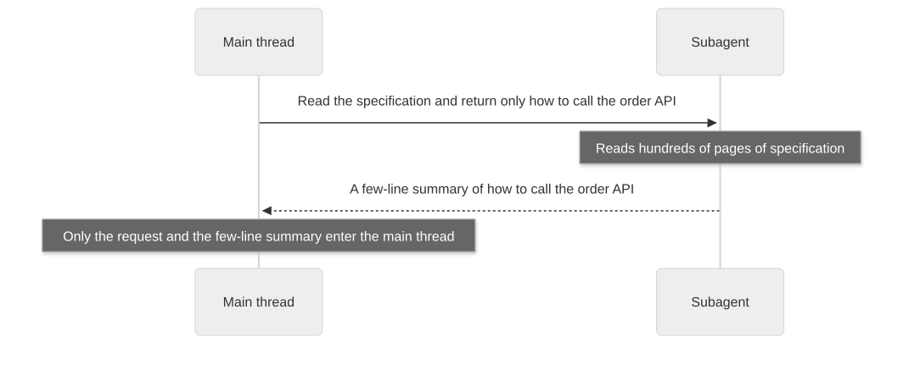
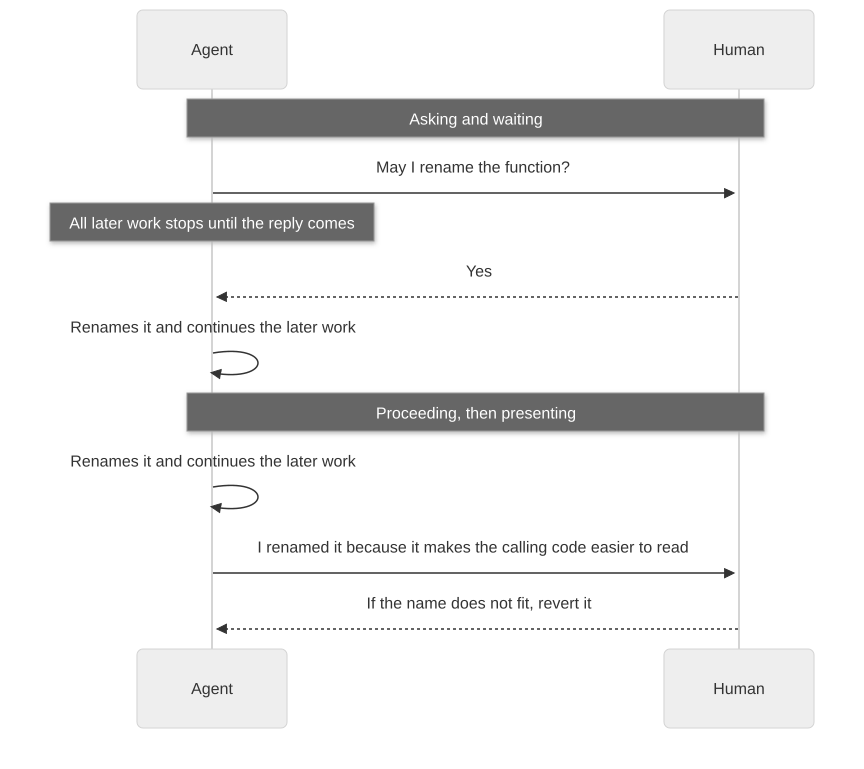

# Chapter 20: Delegation: two principles for delegated and parallel work

[Contents](README.md) · [Previous](24-chapter.md) · [Next](26-chapter.md) · [简体中文](../zh-CN/25-chapter.md)

By kaito · [Japanese original](https://zenn.dev/sc30gsw/books/080faba713547b/viewer/c155cc) · [Author’s English edition](https://zenn.dev/sc30gsw/books/7ff701b9811d04/viewer/0ec4d6)

Source snapshot: 2026-10-03. The text below preserves the author’s English edition.

[Authorization / 授权记录](../AUTHORIZATION.md)

<!-- book-body:start -->
This chapter covers the following two principles.

1. [Guard the Context Window](https://github.com/cursor/plugins/blob/main/pstack/skills/principle-guard-the-context-window/SKILL.md)
2. [Never Block on the Human](https://github.com/cursor/plugins/blob/main/pstack/skills/principle-never-block-on-the-human/SKILL.md)

Both belong to the Delegation group. They decide what the agent does when it hands work to subagents and when it moves on without waiting for a human reply.

The bundled guide's page [`docs/guide/08-principles.md`](https://github.com/cursor/plugins/blob/main/pstack/docs/guide/08-principles.md) sums up the two as principles that <strong>"keep parallel work sane"</strong>.  
Both principles let the agent that hands out work keep the parallel work moving. The agent does not fill its context with the large output of subagents, and it does not stop to wait for a human reply.

With the two principles, the agent behaves as follows.

- It has subagents read test logs thousands of lines long or API specifications hundreds of pages long. In the main thread, which is the conversation that calls the subagents, it receives only a few lines of summary, such as "which tests failed, and why".
- It carries out reversible work, such as renaming a function, without asking the human "May I change this?", and then shows the human the result and the reason.
- It checks with the human before it acts only for irreversible operations, such as a force-push to a shared branch.

Also, <strong>the two principles protect different things</strong>. "Guard the Context Window" keeps the agent's context from filling up with raw data. Raw data here means output read in as is, without a summary, such as test logs thousands of lines long, screenshots, and large documents.

Most of this data never feeds a decision, yet it uses up context in proportion to what the agent reads. So "Guard the Context Window" has the agent protect its context.

"Never Block on the Human" keeps the human's attention from being pulled away every time the agent asks for approval.

The two principles also appear in the steps of Playbooks.

For example, the "[Session pickup](https://github.com/cursor/plugins/blob/main/pstack/skills/poteto-mode/playbooks/session-pickup.md)" Playbook in [Chapter 15](https://zenn.dev/sc30gsw/books/7ff701b9811d04/viewer/305f88) has a subagent read long transcripts, which applies "Guard the Context Window". The "[Multi-phase or multi-PR plan](https://github.com/cursor/plugins/blob/main/pstack/skills/poteto-mode/playbooks/multi-phase-plan.md)" Playbook in [Chapter 16](https://zenn.dev/sc30gsw/books/7ff701b9811d04/viewer/3b2bef) does not ask the operator questions that the agent could answer by running a prototype, which applies "Never Block on the Human".

As in [Chapter 17](https://zenn.dev/sc30gsw/books/7ff701b9811d04/viewer/97d863), this chapter explains the two principles one at a time through their rules and trigger conditions. At the end, it looks at how the two principles connect to the theme of [the talk](https://x.com/poteto/status/2102050467505430555): a state in which the human does not need to sit next to the agent and watch.

<aside class="msg message"><span class="msg-symbol">!</span><div class="msg-content">
<p class="code-line" data-line="29">This chapter gives no request examples for its two principles.</p>
<p class="code-line" data-line="31">In this book, I limit request examples to those that appear in pstack's bundled guide or <a href="https://github.com/cursor/plugins/blob/main/pstack/README.md" rel="nofollow noopener noreferrer" target="_blank">README</a>. If I made up request examples for principles that have none in the source, I might show uses that pstack does not intend.</p>
</div></aside>

<a id="how-this-chapter-is-organized"></a>


## How this chapter is organized

This chapter is organized as follows.

- The two principles at a glance
- "Guard the Context Window" has subagents read large output and documents, and leaves a summary in the main thread
- "Never Block on the Human" moves reversible work forward without waiting for the human to confirm
- When the agent's context and the human's attention are protected, the human does not need to sit and watch
- Summary

<a id="the-two-principles-at-a-glance"></a>


## The two principles at a glance

<table class="code-line" data-line="46">
<thead class="code-line" data-line="46">
<tr class="code-line" data-line="46">
<th>Principle</th>
<th>One-sentence conclusion</th>
<th>Resource it protects</th>
</tr>
</thead>
<tbody class="code-line" data-line="48">
<tr class="code-line" data-line="48">
<td>"Guard the Context Window"</td>
<td>Have subagents read large output and documents, such as logs thousands of lines long or specifications hundreds of pages long, and put only a summary in the main thread</td>
<td>The agent's context</td>
</tr>
<tr class="code-line" data-line="49">
<td>"Never Block on the Human"</td>
<td>Move reversible work, such as writing code or renaming a function, forward without waiting for confirmation, and show the human the result and the reason. Confirm only irreversible operations, such as a force-push or deleting production data, before you act</td>
<td>The human's attention</td>
</tr>
</tbody>
</table>

<a id="%22guard-the-context-window%22-has-subagents-read-large-output-and-documents%2C-and-leaves-a-summary-in-the-main-thread"></a>


## "Guard the Context Window" has subagents read large output and documents, and leaves a summary in the main thread

The principle "Guard the Context Window" asks the agent to <strong>pick each thing it puts in the main thread by whether it is worth the cost</strong>. The cost here is the number of tokens read into the main thread.

<aside class="msg message"><span class="msg-symbol">!</span><div class="msg-content">
<p class="code-line" data-line="56"><strong>Worth the cost</strong> means that, for the number of tokens read into the main thread, the content helps the agent make its next decision.</p>
<p class="code-line" data-line="58">For example, a few-line summary of which tests failed and why is worth the cost, because the agent can use it as is to decide what to fix next.</p>
<p class="code-line" data-line="60">On the other hand, a log thousands of lines long, passing tests included, is not worth the cost if the agent reads it into the main thread as is. The agent uses only a tiny part of that log for its decision.</p>
</div></aside>

The principle asks for this because <strong>the context window is limited, and within one session, the agent cannot free up space it has already used</strong>.

When the context window fills up, the quality of the agent's reasoning drops. Conversation compaction summarizes the part of the conversation that no longer fits. That summary drops some of what the agent read earlier, and in the end the work itself stops.

<a id="rules%3A-put-only-what-is-worth-the-cost-in-the-main-thread"></a>


### Rules: put only what is worth the cost in the main thread

The principle names the following three methods.

<a id="1.-have-subagents-read-large-output-and-documents"></a>


#### 1. Have subagents read large output and documents

The agent has subagents read verbose output, such as test logs thousands of lines long, screenshots, and large documents. It receives only a summary in the main thread, not the raw data. If the agent reads raw data in the main thread, the raw data fills the main thread's context by that amount.

For example, suppose the agent needs to know only how to call the order API from an API specification hundreds of pages long. The agent splits the work as follows.

<span class="embed-block zenn-embedded zenn-embedded-mermaid"><iframe data-content="sequenceDiagram%0A%20%20%20%20participant%20M%20as%20Main%20thread%0A%20%20%20%20participant%20S%20as%20Subagent%0A%20%20%20%20M-%3E%3ES%3A%20Read%20the%20specification%20and%20return%20only%20how%20to%20call%20the%20order%20API%0A%20%20%20%20Note%20over%20S%3A%20Reads%20hundreds%20of%20pages%20of%20specification%0A%20%20%20%20S--%3E%3EM%3A%20A%20few-line%20summary%20of%20how%20to%20call%20the%20order%20API%0A%20%20%20%20Note%20over%20M%3A%20Only%20the%20request%20and%20the%20few-line%20summary%20enter%20the%20main%20thread" frameborder="0" id="zenn-embedded__95cf175f10211" loading="lazy" scrolling="no" src="https://embed.zenn.studio/mermaid#zenn-embedded__95cf175f10211"></iframe></span>

<!-- book-diagram-link:start -->


[View diagram 1](../diagrams/en/25-01.md)
<!-- book-diagram-link:end -->

The hundreds of pages of specification fill only the subagent's context. The main thread's context shrinks only by the request and the few-line summary.

If the agent read the large document in the main thread, the document would fill the main thread's context by that amount. So the agent needs to have a subagent read the document.

<a id="2.-put-templates-and-reference-material-used-every-time-in-the-skill.md-body"></a>


#### 2. Put templates and reference material used every time in the `SKILL.md` body

When a Skill reads a template or reference material every time it runs, the agent writes that material into the `SKILL.md` body instead of splitting it into a separate file. A separate file adds the cost of reading that file every time the Skill runs.

For example, when a review Skill writes its report in the same format every time, the files are laid out as follows.

```
Before: the report format used every time is in a separate file
skills/review/SKILL.md             ← the steps, plus one sentence: "write the report in the format of templates/report.md"
skills/review/templates/report.md  ← the report format

After: the report format used every time is in the SKILL.md body
skills/review/SKILL.md             ← the steps and the report format
```

In the before layout, every time the agent uses the Skill, it reads `SKILL.md` and then also reads `templates/report.md`. In the after layout, one read of `SKILL.md` is enough.

So when the location changes how many reads happen each time, the agent needs to put what it uses every time in the `SKILL.md` body.

<a id="3.-cap-the-scope-of-work-in-each-phase"></a>


#### 3. Cap the scope of work in each phase

The agent splits large work into phases and caps both the number of files one phase handles and the number of turns it may use.

The agent also accounts in advance for the context that the machinery of the work itself uses, such as subagent calls. For example, the request sent to a subagent and the summary that comes back from it both use the main thread's context.

If the agent sets no caps and does not account for what the machinery uses, the context fills up in the middle of a phase. Then, before the phase ends, the quality of the agent's reasoning drops or the work stops.

<a id="the-test-is-whether-content-is-worth-the-cost"></a>


#### The test is whether content is worth the cost

<strong>The principle tests whether content is worth the cost, not whether the agent reads less</strong>. The second method shows the difference.

If the agent puts the template in the `SKILL.md` body, `SKILL.md` gets longer and one read covers more text.

The principle still picks the body because the agent reads a template used every time on every run anyway, even from a separate file. With a separate file, the content read stays the same and the number of reads goes up by one. So the body is the cheaper place for the template.

<a id="trigger-conditions"></a>


### Trigger conditions

When the context starts to fill up from large output, long files, rereading the same file, and similar causes. It also applies when the agent plans a fan-out, which splits the work across several subagents that run in parallel.

<a id="playbook-example%3A-a-subagent-that-explores-the-codebase-may-return-only-four-things"></a>


### Playbook example: a subagent that explores the codebase may return only four things

The "[Multi-phase or multi-PR plan](https://github.com/cursor/plugins/blob/main/pstack/skills/poteto-mode/playbooks/multi-phase-plan.md)" Playbook ([Chapter 16](https://zenn.dev/sc30gsw/books/7ff701b9811d04/viewer/3b2bef)) hands the job of exploring the codebase to a subagent before the agent writes the plan document. At that point, it cites this principle and <strong>limits what the subagent returns to the following four things</strong>.

- The locations of the relevant files
- The conventions of the codebase
- The test commands
- The entry points, meaning the functions or files where the feature under study starts its processing, for example the handler that first receives an API request or the function that receives a CLI command

The Playbook also forbids "inlined dumps", in which the subagent pastes the code it read into its reply as is.

When the reply is limited to these four things, only the information used to write the plan document enters the main thread.

<a id="%22never-block-on-the-human%22-moves-reversible-work-forward-without-waiting-for-the-human-to-confirm"></a>


## "Never Block on the Human" moves reversible work forward without waiting for the human to confirm

For reversible work, the principle "Never Block on the Human" asks the agent to <strong>act without asking permission</strong> and show the human the result and the reason. The human looks at the result and corrects course afterward.

The principle opens with these two sentences.

> The human supervises asynchronously. Agents must stay unblocked.

In other words, the human does not stay with the agent while it works. The human checks the results afterward, so the agent must not stop and wait for the human's reply.

The principle asks for this because <strong>every time the agent stops to wait for the human's permission, the pipeline stops, and the human's reply sets the pace of the whole job</strong>.

Code changes can be reverted and reviewed, so <strong>the cost of a wrong decision is usually smaller than the cost of stopping</strong>. After a wrong decision, all the human needs to do is notice it in review and revert the change. After a stop, nothing downstream moves until the human replies.

<a id="rules%3A-check-with-the-human-only-for-irreversible-operations"></a>


### Rules: check with the human only for irreversible operations

Instead of asking "May I do X?", the principle asks the agent to do X and then show the result and the reason. The principle calls this "Proceed, then present".

For example, say the agent is unsure whether to rename a function. The diagram below compares asking and waiting with proceeding and then presenting.

<span class="embed-block zenn-embedded zenn-embedded-mermaid"><iframe data-content="sequenceDiagram%0A%20%20%20%20participant%20A%20as%20Agent%0A%20%20%20%20participant%20H%20as%20Human%0A%20%20%20%20Note%20over%20A%2CH%3A%20Asking%20and%20waiting%0A%20%20%20%20A-%3E%3EH%3A%20May%20I%20rename%20the%20function%3F%0A%20%20%20%20Note%20over%20A%3A%20All%20later%20work%20stops%20until%20the%20reply%20comes%0A%20%20%20%20H--%3E%3EA%3A%20Yes%0A%20%20%20%20A-%3E%3EA%3A%20Renames%20it%20and%20continues%20the%20later%20work%0A%20%20%20%20Note%20over%20A%2CH%3A%20Proceeding%2C%20then%20presenting%0A%20%20%20%20A-%3E%3EA%3A%20Renames%20it%20and%20continues%20the%20later%20work%0A%20%20%20%20A-%3E%3EH%3A%20I%20renamed%20it%20because%20it%20makes%20the%20calling%20code%20easier%20to%20read%0A%20%20%20%20H--%3E%3EA%3A%20If%20the%20name%20does%20not%20fit%2C%20revert%20it" frameborder="0" id="zenn-embedded__b679c736e8025" loading="lazy" scrolling="no" src="https://embed.zenn.studio/mermaid#zenn-embedded__b679c736e8025"></iframe></span>

<!-- book-diagram-link:start -->


[View diagram 2](../diagrams/en/25-02.md)
<!-- book-diagram-link:end -->

If the agent asks and waits, the work stops until the human replies. If the agent proceeds and then presents, a name that does not fit costs the human one review reply that says "revert it".

So for reversible work, the agent needs to proceed and then present.

<strong>The principle also asks for self-healing</strong>, meaning the system fixes itself over time. When the agent notices a problem in the middle of its work, it records the problem without waiting for the human's instructions and fixes it in the next round of work. If the agent waited for the human's instructions every time it noticed something, the work would stop every time.

For example, say the agent notices in the middle of its work that a different test fails now and then. The agent records the failing test and fixes it in the next round of work. An agent that tells the human about the problem and stops until instructions arrive is not self-healing.

The agent may proceed without waiting for confirmation because the change can be reverted.  
A mistake in an irreversible operation cannot be undone, so the agent checks with the human before it acts.

The handling splits into the following three kinds of operation.

<table class="code-line" data-line="191">
<thead class="code-line" data-line="191">
<tr class="code-line" data-line="191">
<th>Kind</th>
<th>Handling</th>
<th>Examples</th>
</tr>
</thead>
<tbody class="code-line" data-line="193">
<tr class="code-line" data-line="193">
<td>Irreversible operation</td>
<td>Needs confirmation</td>
<td>A force-push, deleting production data, sending a message outside</td>
</tr>
<tr class="code-line" data-line="194">
<td>Reversible operation</td>
<td>Proceed without stopping</td>
<td>Writing code, editing notes, splitting tasks</td>
</tr>
<tr class="code-line" data-line="195">
<td>Product direction</td>
<td>The human decides the direction of what to build. Once the direction is set, the implementation proceeds without stopping</td>
<td>Deciding which feature to build</td>
</tr>
</tbody>
</table>

<a id="trigger-conditions-1"></a>


### Trigger conditions

When the agent feels like asking "May I do X?" about reversible work.

<a id="two-places-in-%2Fpoteto-mode-draw-the-line-between-operations-that-stop-and-operations-that-proceed"></a>


### Two places in `/poteto-mode` draw the line between operations that stop and operations that proceed

Two sections of `/poteto-mode`, the Skill you use to start work, spell out which operations make the agent stop and which let it proceed.

- The "[Autonomy](https://github.com/cursor/plugins/blob/main/pstack/skills/poteto-mode/SKILL.md#autonomy)" section requires the agent to always stop before irreversible writes such as a force-push to a shared branch, a deploy, deleting data, or a message to a customer. On the other hand, it tells the agent to proceed without asking on reversible work and on outside actions such as posting in the team chat or updating a ticket ([Chapter 35](https://zenn.dev/sc30gsw/books/7ff701b9811d04/viewer/9cd5c1)).
- The "[Non-negotiables](https://github.com/cursor/plugins/blob/main/pstack/skills/poteto-mode/SKILL.md#non-negotiables)" section ([Chapter 8](https://zenn.dev/sc30gsw/books/7ff701b9811d04/viewer/cd0205)) asks that <strong>when the answer is a fact the agent can observe by running something, such as behavior, time taken, screen layout, or output, the agent decides by trying a prototype instead of asking the human</strong>. The agent asks the human only about product and taste decisions that no experiment can settle ([Chapter 38](https://zenn.dev/sc30gsw/books/7ff701b9811d04/viewer/006bc8)).

The principle "Never Block on the Human" treats sending a message outside as an irreversible operation no matter who receives it, and requires the agent to check with the human before it acts. The first row of the table in ["Rules: check with the human only for irreversible operations"](#rules%3A-check-with-the-human-only-for-irreversible-operations) shows this rule. The "Autonomy" section, on the other hand, splits outside actions by recipient. It puts messages to customers on the stop side and posts in the team chat on the proceed side.

In other words, the difference is that the "Autonomy" section draws a finer line.

<a id="when-the-agent's-context-and-the-human's-attention-are-protected%2C-the-human-does-not-need-to-sit-and-watch"></a>


## When the agent's context and the human's attention are protected, the human does not need to sit and watch

One point poteto made in the talk was that if the environment is set up well enough, the human does not need to sit next to the agent and watch all the time.

In this book, I read the point as follows. When the agent follows the two Delegation principles, <strong>the human does not need to sit next to it and watch</strong>. There are two reasons.

- If raw data does not fill the agent's context, the quality of its reasoning is less likely to drop and the work is less likely to stop, even in the middle of a long task. So the human needs to check in less often.
- If the agent moves reversible work forward without asking, the human does not have to answer the agent's approval requests, such as "May I?", on the spot. All the human needs to do is read the result and the reason that the agent showed, at a convenient time, and decide.

<a id="summary"></a>


## Summary

- <strong>Guard the Context Window.</strong> It protects the agent's context. The agent has subagents read large content, such as logs thousands of lines long, and leaves only a summary in the main thread. The test is whether content is worth the cost, not whether the agent reads less, so the agent puts templates used every time in the `SKILL.md` body even if `SKILL.md` gets longer.
- <strong>Never Block on the Human.</strong> It protects the human's attention. The agent proceeds with reversible work, such as writing code, and then shows the result and the reason. It checks with the human only for irreversible operations, such as a force-push or deleting production data, and for product direction, such as which feature to build.
- <strong>Protecting context and attention.</strong> The human does not need to sit and watch. The human needs only to read the result and the reason that the agent showed, and then decide.

The next chapter, [Chapter 21](https://zenn.dev/sc30gsw/books/7ff701b9811d04/viewer/10f4b3), covers the Meta principle "[Encode Lessons in Structure](https://github.com/cursor/plugins/blob/main/pstack/skills/principle-encode-lessons-in-structure/SKILL.md)".
<!-- book-body:end -->

---

[Contents](README.md) · [Previous](24-chapter.md) · [Next](26-chapter.md) · [简体中文](../zh-CN/25-chapter.md)
