# Chapter 27: Check what a change could break and where the diff is weak

[Contents](README.md) · [Previous](32-chapter.md) · [Next](34-chapter.md) · [简体中文](../zh-CN/33-chapter.md)

By kaito · [Japanese original](https://zenn.dev/sc30gsw/books/080faba713547b/viewer/997880) · [Author’s English edition](https://zenn.dev/sc30gsw/books/7ff701b9811d04/viewer/e23752)

Source snapshot: 2026-10-03. The text below preserves the author’s English edition.

[Authorization / 授权记录](../AUTHORIZATION.md)

<!-- book-body:start -->
This chapter covers two Skills:

1. [`/blast-radius`](https://github.com/cursor/plugins/blob/main/pstack/skills/blast-radius/SKILL.md)
2. [`/interrogate`](https://github.com/cursor/plugins/blob/main/pstack/skills/interrogate/SKILL.md)

Both Skills examine a change that is already written. <strong>What you want to know decides which one to use</strong>.

Here is how to choose:

- <strong>What could break outside the changed files</strong> (for example, if you change the shape of a value written to a cache, does another service that reads the same cache break?). Use `/blast-radius`.
- <strong>Whether the code in the diff itself has weak spots</strong> (for example, does it work on empty input or when it runs twice?). Use `/interrogate`.

This chapter lists the two Skills, then explains each one from three angles: when to use it, its steps, and its output. For a Skill whose source includes a sample request, I show that request too.

At the end, I sum up how to choose between the two.

<a id="how-this-chapter-is-organized"></a>


## How this chapter is organized

This chapter has these sections:

- Each Skill answers a different question
- `/blast-radius` shows, by running code, why a change is safe
- `/interrogate` has reviewers on different models look for weak spots in the diff, and the main agent sorts their findings
- /interrogate questions what is inside the diff, and /blast-radius questions what is outside it
- Summary

<a id="each-skill-answers-a-different-question"></a>


## Each Skill answers a different question

<table class="code-line" data-line="28">
<thead class="code-line" data-line="28">
<tr class="code-line" data-line="28">
<th>Skill</th>
<th>In one line</th>
<th>Main question</th>
</tr>
</thead>
<tbody class="code-line" data-line="30">
<tr class="code-line" data-line="30">
<td><code>/blast-radius</code></td>
<td>Looks for what breaks outside the changed files, and proves the reason the change is safe by running real code</td>
<td>What could this change break?</td>
</tr>
<tr class="code-line" data-line="31">
<td><code>/interrogate</code></td>
<td>Reviewers on different models look for weak spots in the same diff, and the main agent sorts their findings into four groups, such as "Act on" and "Dismissed"</td>
<td>Point out the problems in this diff, and be harsh</td>
</tr>
</tbody>
</table>

Both <strong>Skills run only when someone calls them by name</strong>.

Both `SKILL.md` files have a setting (`disable-model-invocation: true`) that stops the agent from choosing and running them on its own based on the conversation. So the two run only when the user calls them by name, or when `/poteto-mode` or another Skill calls them by name as one of its steps.

Who calls each one differs:

- <strong>`/interrogate`.</strong> `/poteto-mode` calls it as a Playbook step and under the rules in its "[Non-negotiables](https://github.com/cursor/plugins/blob/main/pstack/skills/poteto-mode/SKILL.md#non-negotiables)" section. `/architect` also calls it as one of its steps. The user can also call it directly by name.
- <strong>`/blast-radius`.</strong> It appears in no "Non-negotiables" rule of `/poteto-mode`, in no Playbook step, and in no other Skill's steps. So it runs only when the user calls it by name.

<a id="%2Fblast-radius-shows%2C-by-running-code%2C-why-a-change-is-safe"></a>


## `/blast-radius` shows, by running code, why a change is safe

`/blast-radius` looks for what a change that looks small could break outside the changed files. It is <strong>a Skill that verifies the reason a change is safe by running code</strong>.

<strong>A plausible description of the impact is equally convincing whether the description is right or wrong. So a description alone has no value</strong>. For that reason, an agent that runs `/blast-radius` does not return a sentence like "the impact should be small". It returns a fact that makes the change safe, together with the result of the code it ran to verify that fact.

<a id="when-to-use-it%3A-a-diff-that-looks-small-but-that-you-do-not-fully-trust"></a>


### When to use it: a diff that looks small but that you do not fully trust

Use it when a diff looks small but you do not fully trust it, and you want to know what else it could break.

<a id="steps%3A-prove-the-reason-the-change-is-safe-by-running-code"></a>


### Steps: prove the reason the change is safe by running code

The job of `/blast-radius` is not to list the callers. The agent can list the callers right away with grep.

The job is <strong>to find ways the change can break that grep cannot see</strong>. For example, if a service written in another language reads the same cache, that breakage does not show up in a list of callers.

So the agent looks at places grep cannot follow: library source, execution timing, the JSON an API returns, database columns, and feature flags. Execution timing means, for example, when async work runs or when cleanup runs as a screen closes.

<aside class="msg message"><span class="msg-symbol">!</span><div class="msg-content">
<p class="code-line" data-line="61"><strong>Feature flag</strong>. A mechanism that turns a feature on or off by switching a setting, without changing code. For example, a feature flag can show a new screen to only some users.</p>
</div></aside>

But the agent does not spend its time listing the many "this might break" possibilities it finds this way. It spends its time <strong>finding one reason the change is safe</strong>.

One reason is enough because many changes that look risky are safe as long as one fact holds.

For example, suppose you change the code that discards cache entries. The fact "this call only discards cache entries that are already invalid and does nothing else" rules out most worries at once, such as the worry that the code also deletes entries that are still in use.

So the agent finds that fact and proves it with a script or test that runs real code.

For a large change or one with a wide reach, the agent has several models investigate it with `/arena` ([Chapter 24](https://zenn.dev/sc30gsw/books/7ff701b9811d04/viewer/2df1db)). Different models find different bugs.

<a id="output%3A-the-reason-for-safety%2C-how-deeply-the-agent-verified-it%2C-and-the-cheapest-check-before-merging"></a>


### Output: the reason for safety, how deeply the agent verified it, and the cheapest check before merging

The output has five items:

- What changed, including changes that are hard to read from the diff
- The one fact that makes the change safe, and its proof
- Risks, each with how it breaks, a real `file:line`, its likelihood and damage, and how to check it
- What the agent checked and cleared, and why
- The cheapest test or reproduction steps to run before merging that would find a bug that could really happen, including any scripts the agent wrote

For each reason for safety, the agent also states how far it verified that reason, on a five-level scale. The level lets the reader judge how much to trust the reason.

A higher number means more certainty. The agent verifies to the highest level it can reach without spending too much effort. The five levels are as follows.

1. The agent only stated the reason in words (this alone has no value).
2. The agent pointed to the line of code (`file:line`) that supports the reason, or to the matching line in the source of the library it calls.
3. The agent traced the flow step by step toward the breakage it worries about, for example the deletion of a cache entry that is still in use, and showed that the flow does not reach that breakage.
4. The agent ran a script or test that calls the real code (if the reason is wrong, the script or test fails clearly).
5. The agent operated the running app and verified that the app behaves as the reason says.

As an example of the five levels, suppose the agent verifies the fact from earlier, "this call only discards cache entries that are already invalid and does nothing else". At each level, the agent does the following:

- At level 1, it only writes "it should discard only invalid entries".
- At level 2, it shows the `file:line` of the function that discards entries, or the matching line in the source of the library it calls.
- At level 3, it traces step by step what happens when a valid entry that is still in use comes in, and shows that the entry never reaches the discard step.
- At level 4, it runs a script that loads the same library as the app, calls that function, and checks that the valid entries remain. If the reason is wrong, the script fails clearly.
- At level 5, it discards the cache in the running app and checks that the valid entries remain.

How deeply the agent verified a reason changes how far you can trust that reason. So the agent must state, for each reason, the level it reached.

If the agent cannot prove the reason, it writes unproven.

<a id="%2Finterrogate-has-reviewers-on-different-models-look-for-weak-spots-in-the-diff%2C-and-the-main-agent-sorts-their-findings"></a>


## `/interrogate` has reviewers on different models look for weak spots in the diff, and the main agent sorts their findings

`/interrogate` launches one reviewer for each review model set in `/setup-pstack` ([Chapter 34](https://zenn.dev/sc30gsw/books/7ff701b9811d04/viewer/c37697)). Each reviewer looks for where the diff breaks, and <strong>the main agent sorts their findings</strong>.

Different models have different blind spots. So <strong>when two models raise the same finding independently, that finding is likely a real problem</strong>.

<a id="when-to-use-it%3A-you-want-several-models-to-look-for-weak-spots-in-a-diff"></a>


### When to use it: you want several models to look for weak spots in a diff

Use it when you want a search for where the diff breaks, including a harsh code-quality review, with requests such as "review this adversarially" or "find the blind spots".

<a id="steps%3A-the-reviewers-accept-the-intent-and-look-for-weak-spots-in-the-code-that-carries-it-out"></a>


### Steps: the reviewers accept the intent and look for weak spots in the code that carries it out

The main agent decides the scope to review and writes the intent of the change in one paragraph. If the user gives no scope, the scope is `git diff main...HEAD`. It reads the intent from the user's request, the commit messages, and the PR description. If the main agent is not sure of the intent, it asks the user before it goes on.

Then the main agent launches reviewers in read-only mode on three models. By default, the models are Opus, GPT, and Grok. All reviewers get the same instructions and the same review criteria, so that differences in the findings come from the models, not from different roles.

<span class="embed-block zenn-embedded zenn-embedded-mermaid"><iframe data-content="flowchart%20TD%0A%20%20%20%20M%5BThe%20main%20agent%20decides%20the%20scope%20and%20writes%20the%20intent%20in%20one%20paragraph%5D%20--%3E%7Csame%20instructions%2C%20intent%2C%20and%20criteria%7C%20R1%5BReviewer%20on%20Opus%5D%0A%20%20%20%20M%20--%3E%7Csame%20instructions%2C%20intent%2C%20and%20criteria%7C%20R2%5BReviewer%20on%20GPT%5D%0A%20%20%20%20M%20--%3E%7Csame%20instructions%2C%20intent%2C%20and%20criteria%7C%20R3%5BReviewer%20on%20Grok%5D%0A%20%20%20%20R1%20--%3E%20S%5BThe%20main%20agent%20compares%20the%20findings%20and%20sorts%20them%20into%20four%20groups%5D%0A%20%20%20%20R2%20--%3E%20S%0A%20%20%20%20R3%20--%3E%20S" frameborder="0" id="zenn-embedded__2af18c1e93f8f" loading="lazy" scrolling="no" src="https://embed.zenn.studio/mermaid#zenn-embedded__2af18c1e93f8f"></iframe></span>

<!-- book-diagram-link:start -->


[View diagram 1](../diagrams/en/33-01.md)
<!-- book-diagram-link:end -->

The main agent gives the most weight to findings that two or more models raised independently, and less weight to findings that only one model raised.

<strong>The reviewers accept the intent, the goal of the change, as correct and examine closely whether the code achieves that goal well</strong>.

For example, if the intent is "when canceling runs, fetch the runs in one batch instead of one at a time, to remove the N+1", the reviewers do not ask whether a batch fetch is the right choice. Instead, they check whether the batch query also picks up runs that must not be canceled.

The reviewers get these review criteria:

- <strong>Correctness.</strong> Whether the code works as intended, for example on empty input, when it runs twice, or when the previous run stopped partway.
- <strong>Root cause.</strong> Whether the change fixes the root cause or only hides the symptom, for example whether a retry hides a broken assumption.
- <strong>Structural soundness.</strong> Whether the change fits the shape of the system, for example whether validation sits at the boundary or whether an old API stays after a new one was added.
- <strong>Verification.</strong> Whether there is a way to verify that the code works, for example whether a bug fix comes with a test that reproduces the bug.
- <strong>Complexity budget.</strong> Whether the complexity matches the job the code does. Examples of a mismatch are an abstraction with only one caller and a setting for a case that does not exist yet.
- <strong>Security.</strong> Whether there is a path for dangerous input, for example whether user input reaches SQL or a shell without validation.

Besides these criteria, the reviewers also look for ways to simplify the implementation a lot without changing its external behavior. An example is a rewrite that makes a whole conditional or helper function unnecessary.

So the reviewers raise findings broadly. The main agent has the full context, and it is the one that dismisses rewrites driven by taste and hypotheticals that cannot happen. An example of such a hypothetical is "this crashes if null comes in" when no caller can pass null. The reviewers saw only the diff and the one-paragraph intent. They do not know the options already tried and rejected, or the constraints that live outside the code.

<a id="output%3A-the-findings-sorted-into-act-on%2C-consider%2C-noted%2C-and-dismissed"></a>


### Output: the findings sorted into Act on, Consider, Noted, and Dismissed

The main agent acts as a practical senior engineer, not a neutral tallier, and sorts every finding into four groups. The examples come from a review of the earlier diff that removes the N+1.

<table class="code-line" data-line="155">
<thead class="code-line" data-line="155">
<tr class="code-line" data-line="155">
<th>Group</th>
<th>Meaning</th>
<th>Example</th>
</tr>
</thead>
<tbody class="code-line" data-line="157">
<tr class="code-line" data-line="157">
<td>Act on</td>
<td>A real problem that affects correctness, security, or maintainability. In a real PR, a problem that blocks the merge</td>
<td>The batch query also picks up completed runs that must not be canceled</td>
</tr>
<tr class="code-line" data-line="158">
<td>Consider</td>
<td>Reasonable, but it is unclear whether it is worth the cost of handling it now</td>
<td>A cache for the fetched results would make it faster, but it is unclear whether the current volume needs it</td>
</tr>
<tr class="code-line" data-line="159">
<td>Noted</td>
<td>Technically correct, but not handled now</td>
<td>A variable name could be more specific</td>
</tr>
<tr class="code-line" data-line="160">
<td>Dismissed</td>
<td>A finding that is wrong, too minor, or caused by missing context. The agent adds a short reason for dismissing it</td>
<td>"It is slow when there are many rows." Dismissed because the caller already caps the row count</td>
</tr>
</tbody>
</table>

The main agent keeps a reason for each dismissed finding. <strong>The user can then read what the main agent dismissed and why, and use their own judgment to pick up again any finding they disagree with</strong>.

The main agent returns only the sorted results. It does not apply the suggested changes automatically.

<a id="sample-request%3A-use-it-before-merging-a-design-that-people-disagree-on"></a>


### Sample request: use it before merging a design that people disagree on

The "Non-negotiables" of `/poteto-mode` say to use `/interrogate` before merging a design that people disagree on. The "[Feature](https://github.com/cursor/plugins/blob/main/pstack/skills/poteto-mode/playbooks/feature.md)" Playbook, the "[Opening a PR](https://github.com/cursor/plugins/blob/main/pstack/skills/poteto-mode/playbooks/opening-a-pr.md)" Playbook that creates PRs, and `/architect` in [Chapter 24](https://zenn.dev/sc30gsw/books/7ff701b9811d04/viewer/2df1db) also call `/interrogate`.

The bundled guide [`04-design.md`](https://github.com/cursor/plugins/blob/main/pstack/docs/guide/04-design.md) has this sample request:

```
/interrogate the whole branch, but skeptically. no nitpicks unless it's an actual bug or regression.
```

An adversarial reviewer that finds no serious problem tends to fill its report with nitpicks. When the user forbids nitpicks, as in this sample request, the findings in Act on narrow to real problems and become worth reading.

<a id="%2Finterrogate-questions-what-is-inside-the-diff%2C-and-%2Fblast-radius-questions-what-is-outside-it"></a>


## /interrogate questions what is inside the diff, and /blast-radius questions what is outside it

Both check whether a change is safe. `/interrogate` has several models review what is inside the diff. `/blast-radius` looks outside the diff and proves the reason for safety by running code.

<a id="summary"></a>


## Summary

- <strong>`/blast-radius`.</strong> It finds the one fact that makes a change safe, such as "this call only discards cache entries that are already invalid", and proves that fact by running a script or test that calls real code.
- <strong>`/interrogate`.</strong> Reviewers on Opus, GPT, and Grok look for weak spots in the same diff. The main agent sorts the findings into four groups, Act on, Consider, Noted, and Dismissed, and keeps a reason for each dismissed finding.
- <strong>How to choose.</strong> `/interrogate` questions what is inside the diff, and `/blast-radius` questions what is outside it.

The next chapter, [Chapter 28](https://zenn.dev/sc30gsw/books/7ff701b9811d04/viewer/6638a6), covers [`/show-me-your-work`](https://github.com/cursor/plugins/blob/main/pstack/skills/show-me-your-work/SKILL.md), which records the agent's decisions and reasons so that you can trace the evidence and verify them later.
<!-- book-body:end -->

---

[Contents](README.md) · [Previous](32-chapter.md) · [Next](34-chapter.md) · [简体中文](../zh-CN/33-chapter.md)
