# Chapter 30: TDD: verify with a failing test before the fix

[Contents](README.md) · [Previous](35-chapter.md) · [Next](37-chapter.md) · [简体中文](../zh-CN/36-chapter.md)

By kaito · [Japanese original](https://zenn.dev/sc30gsw/books/080faba713547b/viewer/ad5727) · [Author’s English edition](https://zenn.dev/sc30gsw/books/7ff701b9811d04/viewer/32928b)

Source snapshot: 2026-10-03. The text below preserves the author’s English edition.

[Authorization / 授权记录](../AUTHORIZATION.md)

<!-- book-body:start -->
This chapter covers [`/tdd`](https://github.com/cursor/plugins/blob/main/pstack/skills/tdd/SKILL.md).

`/tdd` is a Skill that has the agent first write a test that fails as long as the bug exists, before it fixes the bug. For example, for the bug "a retry delivers two notifications", the agent writes a test that verifies "only one notification arrives". This test fails before the fix and passes after it.

`/tdd` is the second of the three Skills that keep code quality, continuing from [Chapter 29](https://zenn.dev/sc30gsw/books/7ff701b9811d04/viewer/00dce1). In `/tdd`, a regression test that fails before the fix and passes after it verifies the fix, in place of the agent that wrote the code.

This chapter explains `/tdd` from four angles: its role, when to use it, its procedure, and how to write the request.

<a id="how-this-chapter-is-organized"></a>


## How this chapter is organized

This chapter is organized as follows.

- Role: reproduce the broken behavior in a test before fixing the bug
- When to use it: only when the user asks for TDD or when a cheap test is within reach
- Procedure: before the fix, verify that the test "fails for the right reason"
- How to write the request: the command alone is enough
- Summary

<a id="role%3A-reproduce-the-broken-behavior-in-a-test-before-fixing-the-bug"></a>


## Role: reproduce the broken behavior in a test before fixing the bug

`/tdd` is a Skill that has the agent write one regression test before it fixes a bug. The agent then verifies that the test fails before the fix and passes after it.

The name says TDD. But as the `SKILL.md` title "TDD Bug Fix" shows, <strong>`/tdd` is a Skill that handles only bug fixes, not a guide to test-first design of new features</strong>.

`/tdd` does not require the agent to write the test first every time. <strong>The agent writes the test first only when the user asks for it or when a cheap test is within reach.</strong>

<a id="when-to-use-it%3A-only-when-the-user-asks-for-tdd-or-when-a-cheap-test-is-within-reach"></a>


## When to use it: only when the user asks for TDD or when a cheap test is within reach

`/tdd` has the setting `disable-model-invocation: true` ([Chapter 25](https://zenn.dev/sc30gsw/books/7ff701b9811d04/viewer/e5f103)), so the agent never picks and runs `/tdd` based on what the conversation is about.

Two callers run `/tdd`: the user, who calls it by name, and `/poteto-mode`. The [README](https://github.com/cursor/plugins/blob/main/pstack/README.md) explains that `/poteto-mode` runs `/tdd` when its procedure needs it.

The `SKILL.md` description limits the use of `/tdd` to the following cases.

- The user asks for TDD, a failing test, or a regression test
- The agent knows that a test it can run locally right away can verify the bug

Put the other way around, the agent does not add a new test in the following cases.

- The path to a test is unclear
- The test would take a lot of work
- The agent cannot write the test without combining many parts
- Nobody asked for a test

"A cheap test is within reach" means, for example, that the buggy code already has unit tests and one more test there is enough.

<a id="if-the-test-needs-heavy-setup%2C-do-not-add-it%2C-and-switch-to-the-nearest-check"></a>


### If the test needs heavy setup, do not add it, and switch to the nearest check

The cases above, "the test would take a lot of work" and "the agent cannot write the test without combining many parts", mean that the test needs things like the following.

- A new, wide-ranging harness that runs the tests
- Fragile mocks that break when the implementation changes a little
- Infrastructure for E2E tests that take a long time to run
- State that exists only in production, such as data in the production database
- Vague reproduction steps
- Large changes to fixtures that have nothing to do with the bug

When the test needs such things, the agent does not add a new test. It switches to the nearest check, such as a script or a manual reproduction command.

The agent does not add a test in these cases because <strong>a test that needs such setup to work is weak evidence that the bug is fixed</strong>.

For example, a test that passes with fragile mocks checks only the mocks in place of the real parts. According to the bundled guide [`docs/guide/10-recipes-and-pitfalls.md`](https://github.com/cursor/plugins/blob/main/pstack/docs/guide/10-recipes-and-pitfalls.md), such a test shows the fix less convincingly than a run of the real command.

<a id="the-%22bug-fix%22-playbook-refers-to-%2Ftdd-only-when-a-cheap-test-is-within-reach"></a>


### The "Bug fix" Playbook refers to `/tdd` only when a cheap test is within reach

`/poteto-mode` also uses `/tdd`. The "Bug fix" Playbook defines how to fix a bug. In step 5, the Playbook requires that the commit that reproduces the bug, such as a test that fails on the code before the fix, comes before the fix commit in the Git history. Step 5 then refers to `/tdd` when a cheap test is within reach.

However, this Playbook also says to skip `/tdd` when the test would take a lot of work, when the agent cannot write the test without combining many parts, or when it is unclear how to write the test.

<a id="procedure%3A-before-the-fix%2C-verify-that-the-test-%22fails-for-the-right-reason%22"></a>


## Procedure: before the fix, verify that the test "fails for the right reason"

<a id="six-steps-verify-everything-from-the-failure-before-the-fix-to-the-pass-after-it"></a>


### Six steps verify everything from the failure before the fix to the pass after it

The `/tdd` procedure has six steps.

1. <strong>Understand the bug.</strong> The agent identifies the intended behavior, the current behavior, and the smallest reproduction of the bug, which is the shortest sequence of actions or inputs that triggers it.
2. <strong>Pick the test that verifies the narrowest scope.</strong> From the tests the buggy code already uses, the agent picks the one that verifies the buggy spot in the narrowest scope. If it finds no test that it can use cheaply, it does not build a new test from scratch only to complete this step.
3. <strong>Write the failing test first.</strong> The agent adds one test, the smallest that can catch this bug. The test's expected value is the behavior the code should have. For example, for the bug that delivers two notifications, the expected value is 1, not 2, even though the current code sends two.
4. <strong>Run the test before the fix.</strong> The agent verifies that the test fails for the intended reason, which is the bug itself.
5. <strong>Fix the bug.</strong> The agent makes the smallest change that meets the intended behavior. It changes the application code, not the test. It also keeps the contracts that the surrounding code depends on, such as the shape of a function's parameters and return value.
6. <strong>Rerun the regression test.</strong> The agent verifies that the test passes.

The diagram below shows the branches for when the agent finds no cheap test and for when the test before the fix did not fail for the intended reason.

<span class="embed-block zenn-embedded zenn-embedded-mermaid"><iframe data-content="flowchart%20TD%0A%20%20%20%20A%5BUnderstand%20the%20bug%5D%20--%3E%20B%7BIs%20a%20cheap%20test%20you%20can%20run%20within%20reach%3F%7D%0A%20%20%20%20B%20--%3E%7CNo%7C%20X%5BVerify%20with%20the%20nearest%20check%2C%20such%20as%20a%20script%20or%20a%20reproduction%20command%5D%0A%20%20%20%20B%20--%3E%7CYes%7C%20C%5BWrite%20the%20failing%20test%20first%5D%0A%20%20%20%20C%20--%3E%20D%5BRun%20the%20test%20before%20the%20fix%5D%0A%20%20%20%20D%20--%3E%20E%7BDid%20it%20fail%20for%20the%20intended%20reason%3F%7D%0A%20%20%20%20E%20--%3E%7CNo%3A%20it%20passed%2C%20or%20it%20failed%20for%20another%20reason%7C%20F%5BFix%20the%20test%20or%20the%20reproduction%20instead%5D%0A%20%20%20%20F%20--%3E%20D%0A%20%20%20%20E%20--%3E%7CYes%7C%20G%5BFix%20the%20bug%5D%0A%20%20%20%20G%20--%3E%20H%5BRerun%20the%20test%20and%20verify%20that%20it%20passes%5D" frameborder="0" id="zenn-embedded__89c83157e36cf" loading="lazy" scrolling="no" src="https://embed.zenn.studio/mermaid#zenn-embedded__89c83157e36cf"></iframe></span>

<!-- book-diagram-link:start -->


[View diagram 1](../diagrams/en/36-01.md)
<!-- book-diagram-link:end -->

<a id="the-run-before-the-fix-tells-you-whether-the-bug-causes-the-failure"></a>


### The run before the fix tells you whether the bug causes the failure

The agent runs the test before the fix in step 4 <strong>to tell whether the test fails because of the bug or for another reason</strong>.

A test that fails for another reason, such as a misspelled function name, fails whether or not the bug exists. That failure is therefore not evidence that the test can catch the bug.

A test that passes before the fix does not detect the bug either, so the agent fixes the test.

<a id="example%3A-compare-a-failure-for-the-right-reason-with-a-failure-for-another-reason-in-the-two-notification-bug"></a>


### Example: compare a failure for the right reason with a failure for another reason in the two-notification bug

For example, suppose the agent fixes the bug "a retry delivers two notifications". Look at the run before the fix in step 4.

The test verifies the intended behavior "even after a retry, only one notification arrives".

```
declare function test(name: string, fn: () => void): void;
declare function expect<T>(actual: T): { toBe(expected: T): void };
// The function under test: sends a notification and retries on failure. Returns the list of notifications sent
declare function sendWithRetry(message: string): string[];

// A test that fails for the right reason: before the fix, it fails with "expected 1 but got 2"
test("only one notification arrives even after a retry", () => {
  const sent = sendWithRetry("Your order has been received");
  expect(sent.length).toBe(1);
});

// A test that fails for another reason: the function name is misspelled, so it fails regardless of the bug
test("only one notification arrives even after a retry", () => {
  const sent = sendAndRetry("Your order has been received");
  expect(sent.length).toBe(1);
});
```

If the test before the fix fails for a reason other than the bug, as in the second test, the agent must fix the test before it fixes the implementation.

<a id="when-a-test-is-not-possible%2C-replace-it-with-a-check-you-can-run"></a>


### When a test is not possible, replace it with a check you can run

When a test is not practical, the agent replaces the test with a check it can run: a script, a manual reproduction command, browser automation, or a check that the expected line appears in the logs.

<strong>Even when the agent does not write a test, it does not skip the check itself.</strong> If it skipped the check, no evidence that the bug is fixed would remain.

<a id="the-final-report-gives-the-evidence-before-and-after-the-fix-along-with-the-result"></a>


### The final report gives the evidence before and after the fix along with the result

In the final report, the agent writes which test or check failed before the fix and how, and the run that passed after the fix. If it could not show a failure before the fix, it writes why and which check it used instead.

<strong>The agent reports the evidence along with the result.</strong> With only the result "it's fixed", the person who reads the report cannot verify that the agent fixed the bug.

<a id="add-no-new-test-rather-than-a-bad-one"></a>


### Add no new test rather than a bad one

`/tdd` takes the position that <strong>no new test is better than a bad new test</strong>.

Bad tests include tests that check mostly mocks and tests that lock in details of the current implementation. Both kinds go against the principle "[Test Behavior, Not Implementation](https://github.com/cursor/plugins/blob/main/pstack/skills/principle-test-behavior-not-implementation/SKILL.md)" from [Chapter 19](https://zenn.dev/sc30gsw/books/7ff701b9811d04/viewer/d3f914). A test that checks mostly mocks does not check the real behavior. A test that locks in implementation details breaks even on a rewrite that does not change the behavior.

Here are the two kinds of bad tests and a good test, compared on the two-notification bug.

```
declare function test(name: string, fn: () => void): void;
declare function expect<T>(actual: T): { toBe(expected: T): void };
type Transport = { send(message: string): void };
// The function under test: sends a notification and retries on failure. Returns the list of notifications sent
declare function sendWithRetry(message: string, transport?: Transport): string[];
// A fake of the sending part (a mock). Counts how many times send is called
declare const mockTransport: Transport & { calls: number };
// A variable used inside the function that counts the retries
declare const retryState: { attempts: number };

// Bad test 1 (checks mostly mocks): it only looks at how many times the fake send was called,
// and does not check how many notifications actually arrived
test("calls the sending part once", () => {
  sendWithRetry("Your order has been received", mockTransport);
  expect(mockTransport.calls).toBe(1);
});

// Bad test 2 (locks in implementation details): it depends on the value of an internal variable,
// so it breaks even on a rewrite that does not change how many notifications arrive (for example, renaming the variable)
test("the retry count becomes 1", () => {
  sendWithRetry("Your order has been received");
  expect(retryState.attempts).toBe(1);
});

// Good test: checks the behavior visible from outside (the number of notifications that arrived)
test("only one notification arrives even after a retry", () => {
  const sent = sendWithRetry("Your order has been received");
  expect(sent.length).toBe(1);
});
```

The agent fits the test to the intended behavior. It does not change the test to fit a wrong implementation. It also does not weaken an existing assertion, such as `expect(sent.length).toBe(1)`, unless the expected behavior itself has changed and the reason is clear.

```
declare const sent: string[];
declare function expect<T>(actual: T): {
  toBe(expected: T): void;
  toBeGreaterThanOrEqual(expected: number): void;
};

// Before: verifies the intended behavior (only one notification arrives)
expect(sent.length).toBe(1);

// After (a rewrite you must not make): this weakens the assertion so that a wrong implementation that delivers two still passes
expect(sent.length).toBeGreaterThanOrEqual(1);
```

<a id="how-to-write-the-request%3A-the-command-alone-is-enough"></a>


## How to write the request: the command alone is enough

If a cheap test can verify the bug you want fixed, and the conversation has already discussed the bug, the command alone is enough for the user's request ([`docs/guide/05-build-and-clean.md`](https://github.com/cursor/plugins/blob/main/pstack/docs/guide/05-build-and-clean.md)).

```
/tdd implement
```

If you want the agent to use `/tdd` only when a cheap test exists, add the condition, as in the following request from `docs/guide/10-recipes-and-pitfalls.md`.

```
/poteto-mode repro the duplicate write first. if there's a cheap test path, /tdd it. then fix and rerun.
```

The request has the condition "if there's a cheap test path", so when no cheap test exists, the agent can skip `/tdd` and use the nearest check.

<a id="summary"></a>


## Summary

- <strong>What verifies the fix.</strong> A regression test that fails before the fix and passes after it verifies the fix.
- <strong>When to use it.</strong> The agent writes the failing test before the fix only when the user asks or when a cheap test is within reach.
- <strong>Procedure.</strong> The agent runs the test before the fix, verifies that the bug causes the failure, and then fixes the bug.

The next chapter, [Chapter 31](https://zenn.dev/sc30gsw/books/7ff701b9811d04/viewer/347946), covers [`/no-comments`](https://github.com/cursor/plugins/blob/main/pstack/skills/no-comments/SKILL.md), the third of the three Skills that keep code quality. It has an agent other than the author review the comments in a diff.
<!-- book-body:end -->

---

[Contents](README.md) · [Previous](35-chapter.md) · [Next](37-chapter.md) · [简体中文](../zh-CN/36-chapter.md)
