# Chapter 34: Install pstack and choose a model for each role

[Contents](README.md) · [Previous](39-chapter.md) · [Next](41-chapter.md) · [简体中文](../zh-CN/40-chapter.md)

By kaito · [Japanese original](https://zenn.dev/sc30gsw/books/080faba713547b/viewer/8487f0) · [Author’s English edition](https://zenn.dev/sc30gsw/books/7ff701b9811d04/viewer/c37697)

Source snapshot: 2026-10-03. The text below preserves the author’s English edition.

[Authorization / 授权记录](../AUTHORIZATION.md)

<!-- book-body:start -->
This chapter covers [`/setup-pstack`](https://github.com/cursor/plugins/blob/main/pstack/skills/setup-pstack/SKILL.md).

`/setup-pstack` is <strong>a Skill that chooses which model to use for each role</strong> of the subagents that pstack starts. After you install the pstack plugin, this is the first Skill you run.

A role here is the job a subagent takes on. For example, `bug-fix` is the subagent that writes code in the "Bug fix" Playbook. `judgment and prose` is the subagent that handles writing and judgment. `arena runners` are the candidate subagents that `/arena` has solve the same task.

This chapter explains how to install pstack, how `/setup-pstack` proceeds, and the rule file that `/setup-pstack` writes.

<aside class="msg message"><span class="msg-symbol">!</span><div class="msg-content">
<p class="code-line" data-line="9">This chapter also covers how to install pstack because installation, like <code>/setup-pstack</code>, is one of the first things you do when you start using pstack.</p>
<p class="code-line" data-line="11"><a href="https://zenn.dev/sc30gsw/books/7ff701b9811d04/viewer/3a7791#some-skills-the-steps-rely-on-by-name-are-not-bundled" target="_blank">"Chapter 6: Some Skills that the procedures call by name do not ship with pstack"</a> covers the Skills that ship with pstack and the Skills you must install as a separate plugin.</p>
</div></aside>

<a id="how-this-chapter-is-organized"></a>


## How this chapter is organized

The chapter has the following sections.

- Install pstack
- The list of roles
- Each Skill reads one rule file
- Detect the available models
- Read the previous rule file
- Choose a reasoning budget
- `inherit-parent` and `auto` use the parent chat's model
- Verify that the models are available before writing
- Panel roles
- The file it writes
- Lines that remain when you run it again
- `/setup-pstack` offers to create a verification skill
- Summary

<a id="install-pstack"></a>


## Install pstack

You install pstack with one command and a short conversation.

1. In the Cursor chat, run the following command.

   ```
   /add-plugin pstack
   ```
2. Next, run `/setup-pstack` with the following command and answer its questions. The sections after this one explain what `/setup-pstack` asks and what it decides.

   ```
   /setup-pstack
   ```
3. When `/setup-pstack` finishes, start a new chat. <strong>The model rules that `/setup-pstack` writes apply from the next new chat</strong>.

<a id="the-list-of-roles"></a>


## The list of roles

As of pstack version `0.15.5`, `/setup-pstack` chooses models for the following 17 roles. The role names are the original names written in the rule file.

<table class="code-line" data-line="54">
<thead class="code-line" data-line="54">
<tr class="code-line" data-line="54">
<th>Role</th>
<th>Subagent that takes the role</th>
<th>Default model</th>
</tr>
</thead>
<tbody class="code-line" data-line="56">
<tr class="code-line" data-line="56">
<td><code>feature, refactoring</code></td>
<td>Writes code in the "Feature" and "Refactoring" Playbooks</td>
<td><code>grok-4.7-xhigh-fast</code></td>
</tr>
<tr class="code-line" data-line="57">
<td><code>bug-fix</code></td>
<td>Writes code in the "Bug fix" Playbook</td>
<td><code>grok-4.7-xhigh-fast</code></td>
</tr>
<tr class="code-line" data-line="58">
<td><code>perf-issue</code></td>
<td>Writes code in the "Perf issue" Playbook</td>
<td><code>grok-4.7-xhigh-fast</code></td>
</tr>
<tr class="code-line" data-line="59">
<td><code>hillclimb</code></td>
<td>Writes code in the "Hillclimb" Playbook</td>
<td><code>grok-4.7-xhigh-fast</code></td>
</tr>
<tr class="code-line" data-line="60">
<td><code>judgment and prose</code></td>
<td>Writes prose and makes judgments</td>
<td><code>claude-opus-5-5-max</code></td>
</tr>
<tr class="code-line" data-line="61">
<td><code>hardest tasks</code></td>
<td>Writes code for the hardest changes, such as designs that span several places, tangled concurrency, and algorithms where small errors are hard to notice</td>
<td><code>claude-opus-5-5-max</code></td>
</tr>
<tr class="code-line" data-line="62">
<td><code>how explorer</code></td>
<td>Splits up the code investigation in <code>/how</code>
</td>
<td><code>grok-4.7-xhigh-fast</code></td>
</tr>
<tr class="code-line" data-line="63">
<td><code>how explainer</code></td>
<td>Combines the findings into one explanation in <code>/how</code>
</td>
<td><code>claude-opus-5-5-max</code></td>
</tr>
<tr class="code-line" data-line="64">
<td><code>why investigators</code></td>
<td>Splits up the investigation of sources such as Git history and tickets in <code>/why</code>
</td>
<td><code>grok-4.7-xhigh-fast</code></td>
</tr>
<tr class="code-line" data-line="65">
<td><code>why synthesizer</code></td>
<td>Combines the findings into one answer in <code>/why</code>
</td>
<td><code>claude-opus-5-5-max</code></td>
</tr>
<tr class="code-line" data-line="66">
<td><code>reflect tooling</code></td>
<td>Reads the conversation from the tooling point of view in <code>/reflect</code>
</td>
<td><code>gpt-5.6-sol-max</code></td>
</tr>
<tr class="code-line" data-line="67">
<td><code>reflect judgment, divergent, synthesizer</code></td>
<td>Reads the conversation from the judgment and divergent points of view in <code>/reflect</code> and sorts the results</td>
<td><code>claude-opus-5-5-max</code></td>
</tr>
<tr class="code-line" data-line="68">
<td><code>arena runners</code></td>
<td>The candidates that solve the same task in <code>/arena</code>
</td>
<td>
<code>claude-opus-5-5-max</code>, <code>gpt-5.6-sol-max</code>, <code>grok-4.7-xhigh-fast</code>
</td>
</tr>
<tr class="code-line" data-line="69">
<td><code>arena cross-judge pool</code></td>
<td>The judge that scores the candidates' artifacts in <code>/arena</code> (<code>/arena</code> picks one model from this list)</td>
<td>
<code>claude-opus-5-5-max</code>, <code>gpt-5.6-sol-max</code>, <code>grok-4.7-xhigh-fast</code>
</td>
</tr>
<tr class="code-line" data-line="70">
<td><code>swarm workers</code></td>
<td>The Workers that run in parallel in <code>/swarm</code>
</td>
<td><code>grok-4.7-xhigh-fast</code></td>
</tr>
<tr class="code-line" data-line="71">
<td><code>architect runners</code></td>
<td>Creates design options in <code>/architect</code>
</td>
<td>
<code>claude-opus-5-5-max</code>, <code>gpt-5.6-sol-max</code>, <code>grok-4.7-xhigh-fast</code>
</td>
</tr>
<tr class="code-line" data-line="72">
<td><code>interrogate reviewers</code></td>
<td>Looks for weak points in the diff in <code>/interrogate</code>
</td>
<td>
<code>claude-opus-5-5-max</code>, <code>gpt-5.6-sol-max</code>, <code>grok-4.7-xhigh-fast</code>
</td>
</tr>
</tbody>
</table>

For a role with three default models, the value is a list of models. The section ["Panel roles"](#panel-roles) explains these roles.

<a id="each-skill-reads-one-rule-file"></a>


## Each Skill reads one rule file

`/setup-pstack` is <strong>a Skill that asks for the reasoning budget and the model for each role, and writes the answers to `~/.cursor/rules/pstack-models.mdc`, a rule that always applies</strong>.

<aside class="msg message"><span class="msg-symbol">!</span><div class="msg-content">
<ul class="code-line" data-line="81">
<li class="code-line" data-line="81">
<strong>Reasoning budget.</strong> A setting that decides the reasoning effort of every role's model at once.</li>
<li class="code-line" data-line="82">
<strong>Slug.</strong> An identifier that names a model, such as <code>claude-opus-5-5-max</code>.
<ul class="code-line" data-line="83">
<li class="code-line" data-line="83">Example: <code>claude-opus-5-5-max</code> runs Claude Opus 5.5 at effort level <code>max</code>
</li>
</ul>
</li>
<li class="code-line" data-line="84">
<strong>Effort level.</strong> How much work a model puts into reasoning. The words <code>max</code>, <code>xhigh</code>, <code>high</code>, <code>medium</code>, and <code>low</code> in a slug express it, strongest first.</li>
</ul>
</div></aside>

Each pstack Skill reads this rule and decides the model for each role.

<span class="embed-block zenn-embedded zenn-embedded-mermaid"><iframe data-content="flowchart%20TD%0A%20%20%20%20S%5B%22%2Fsetup-pstack%22%5D%20--%3E%7Cwrites%7C%20R%5B%22~%2F.cursor%2Frules%2Fpstack-models.mdc%2C%20a%20rule%20that%20always%20applies%22%5D%0A%20%20%20%20R%20--%3E%7Ceach%20Skill%20reads%20it%7C%20Q%7B%22Is%20there%20a%20line%20for%20the%20role%3F%22%7D%0A%20%20%20%20Q%20--%3E%7Cyes%7C%20A%5B%22Runs%20on%20the%20model%20in%20the%20rule%22%5D%0A%20%20%20%20Q%20--%3E%7Cno%7C%20B%5B%22Runs%20on%20the%20Skill's%20default%20model%22%5D" frameborder="0" id="zenn-embedded__e54b013ad3223" loading="lazy" scrolling="no" src="https://embed.zenn.studio/mermaid#zenn-embedded__e54b013ad3223"></iframe></span>

<!-- book-diagram-link:start -->


[View diagram 1](../diagrams/en/40-01.md)
<!-- book-diagram-link:end -->

A role without a line runs on the Skill's default model.

So you change only the roles that you want to move off the default model. For example, if you want only the `bug-fix` role to run on another model, change only the `bug-fix` line.

To put a role back on the default model, delete that role's line from the rule file.

`/setup-pstack` proceeds in the following order.

<span class="embed-block zenn-embedded zenn-embedded-mermaid"><iframe data-content="flowchart%20TD%0A%20%20%20%20D%5B%22Detect%20the%20slugs%20of%20the%20available%20models%22%5D%20--%3E%20L%5B%22Read%20the%20rule%20file%20from%20the%20previous%20%2Fsetup-pstack%20run%2C%20if%20there%20is%20one%22%5D%0A%20%20%20%20L%20--%3E%20B%5B%22The%20user%20chooses%20a%20reasoning%20budget%22%5D%0A%20%20%20%20B%20--%3E%20M%5B%22Replace%20each%20role's%20slug%20to%20match%20the%20budget%22%5D%0A%20%20%20%20M%20--%3E%20C%5B%22Show%20all%20roles%20and%20models%2C%20and%20ask%20whether%20to%20accept%20or%20change%20them%22%5D%0A%20%20%20%20C%20--%3E%20K%5B%22Verify%20that%20the%20slugs%20to%20write%20are%20available%20models%22%5D%0A%20%20%20%20K%20--%3E%20W%5B%22Write%20the%20whole%20rule%20file%22%5D%0A%20%20%20%20W%20--%3E%20N%5B%22Report%20that%20the%20rule%20was%20written%20and%20that%20it%20applies%20from%20a%20new%20chat%22%5D%0A%20%20%20%20N%20--%3E%20V%7B%22Is%20there%20a%20way%20to%20run%20and%20verify%20the%20real%20app%3F%22%7D%0A%20%20%20%20V%20--%3E%7Cno%7C%20O%5B%22Offer%20once%20to%20create%20a%20verification%20skill%22%5D%0A%20%20%20%20V%20--%3E%7Cyes%7C%20E%5B%22Finish%22%5D%0A%20%20%20%20O%20--%3E%20E" frameborder="0" id="zenn-embedded__30b3daedf35e3" loading="lazy" scrolling="no" src="https://embed.zenn.studio/mermaid#zenn-embedded__30b3daedf35e3"></iframe></span>

<!-- book-diagram-link:start -->


[View diagram 2](../diagrams/en/40-02.md)
<!-- book-diagram-link:end -->

<a id="detect-the-available-models"></a>


## Detect the available models

First, `/setup-pstack` finds the slugs of the models the user can use. It looks in the following ways.

- <strong>The basic method.</strong> It checks which slugs it can pass to a subagent in the current chat. The source treats this as the reliable method.
- <strong>When there is an API or CLI.</strong> If Cursor provides an API or CLI that lists the models the user can use, it prefers that list, so that it misses no model.
- <strong>When it finds nothing.</strong> It asks the user to paste the slugs they can use into the chat.

In this chapter, I call the slugs found here "the available models".

<a id="read-the-previous-rule-file"></a>


## Read the previous rule file

If you ran `/setup-pstack` before, the rule file that it wrote then, `~/.cursor/rules/pstack-models.mdc`, already exists. In that case, `/setup-pstack` reads the value for each role and the file's `# budget` line, which holds the budget you chose last time. It uses these values as the starting point for choosing again.

The previous rule file, however, may still hold lines for roles that pstack has since removed, such as a `how critics` line. A removed role is a role that does not appear in the file the current pstack writes. The section ["The file it writes"](#the-file-it-writes) in this chapter shows the contents of that file.

`/setup-pstack` discards these lines. It tells the user which lines it discarded when it shows the list of roles and models.

<a id="choose-a-reasoning-budget"></a>


## Choose a reasoning budget

The reasoning budget is a setting that decides at once <strong>which effort level every role's model runs at</strong>. The words `max`, `xhigh`, `high`, `medium`, and `low` in a slug express it. `max` is the strongest level and `low` is the weakest.

You choose one of the following four budgets.  
Each budget sets the effort level that `/setup-pstack` aligns the slugs to. From here on, I call this level the target level.

<table class="code-line" data-line="145">
<thead class="code-line" data-line="145">
<tr class="code-line" data-line="145">
<th>Budget</th>
<th>Target level</th>
<th>What <code>claude-opus-5-5-max</code> becomes</th>
</tr>
</thead>
<tbody class="code-line" data-line="147">
<tr class="code-line" data-line="147">
<td>unlimited</td>
<td>
<code>max</code> (<code>/setup-pstack</code> does not replace the effort in each slug, so it stays at the default)</td>
<td><code>claude-opus-5-5-max</code></td>
</tr>
<tr class="code-line" data-line="148">
<td>large</td>
<td>Align to <code>xhigh</code>
</td>
<td><code>claude-opus-5-5-xhigh</code></td>
</tr>
<tr class="code-line" data-line="149">
<td>medium</td>
<td>Align to <code>high</code>
</td>
<td><code>claude-opus-5-5-high</code></td>
</tr>
<tr class="code-line" data-line="150">
<td>small</td>
<td>Align to <code>medium</code>
</td>
<td><code>claude-opus-5-5-medium</code></td>
</tr>
</tbody>
</table>

<a id="replace-the-effort-word-in-each-slug-with-the-target-level"></a>


### Replace the effort word in each slug with the target level

If you choose `large`, `medium`, or `small`, `/setup-pstack` replaces only the effort word in every role's slug with the target level. The effort word is at the end of the slug. If the slug ends in `fast`, the effort word comes right before `fast`.

For example, if you choose `small`, whose target level is `medium`, the slugs change as follows.

- `claude-opus-5-5-max` becomes `claude-opus-5-5-medium`
- `grok-4.7-xhigh-fast` becomes `grok-4.7-medium-fast`

On a line that lists several models for one role, such as `arena runners: claude-opus-5-5-max, gpt-5.6-sol-max, grok-4.7-xhigh-fast`, `/setup-pstack` replaces every listed slug. The section ["Panel roles"](#panel-roles) in this chapter explains these roles.

`inherit-parent` and `auto` are not slugs, so `/setup-pstack` does not replace them.

<a id="when-a-replaced-model-is-not-available%2C-pick-a-substitute-in-the-same-family"></a>


### When a replaced model is not available, pick a substitute in the same family

The slug after replacement may not be among the available models. For example, `claude-opus-5-5-medium` may not be available.

In that case, `/setup-pstack` decides the substitute model in the following order.

1. Look for available models in the same family
2. Among those at the target level or weaker, use the strongest one
3. If there are none, show the role as one the user must choose again

For example, say you chose `small`, whose target level is `medium`, and the only Claude models you can use are `claude-opus-5-5-high` and `claude-opus-5-5-low`.

- `high` is stronger than the target `medium`, so `/setup-pstack` does not use it.
- `low` is weaker than the target `medium`, so `/setup-pstack` can use it.

So `/setup-pstack` uses `claude-opus-5-5-low`.

Because `/setup-pstack` picks substitutes only from the same family, <strong>a lower budget does not change the model family</strong>. For example, a role that ran on Claude does not switch to Grok because you lowered the budget.

<a id="finally%2C-check-the-list-of-roles-and-models"></a>


### Finally, check the list of roles and models

When the replacement is done, `/setup-pstack` shows a list of every role and the model assigned to it. Roles you must choose again carry a mark that says so.

You either accept the list as it is or change the model for specific roles. To change a model, pick one of the available models, `inherit-parent`, or `auto`.

<a id="inherit-parent-and-auto-use-the-parent-chat's-model"></a>


## `inherit-parent` and `auto` use the parent chat's model

Both `inherit-parent` and `auto` mean <strong>run that role's subagent on the same model as the parent chat</strong>. The parent chat is the chat that started the subagent.

For a role with either of these values, no Skill specifies a model when it starts the subagent. A subagent started without a model runs on the same model as the parent chat.

Auto is the setting in which Cursor picks the model automatically. So if you use the chat with Auto, you can run subagents on Auto too by writing `inherit-parent` or `auto` for the role.

<a id="verify-that-the-models-are-available-before-writing"></a>


## Verify that the models are available before writing

After you review the list, `/setup-pstack` runs one more check before it writes the rule file. It verifies that every slug it will write is among the available models it detected in ["Detect the available models"](#detect-the-available-models) in this chapter.

If even one slug is missing from that list, `/setup-pstack` stops without writing and asks you to choose the model for that role again. <strong>`/setup-pstack` does not write a slug to the rule file unless it has confirmed that the slug is available</strong>.

The reason is that each Skill passes the slug from the rule file unchanged as the model when it starts a subagent.

`inherit-parent` and `auto` are not model slugs, so this check does not apply to them. You can always write them to the rule file.

<a id="panel-roles"></a>


## Panel roles

Every frontier model, meaning each company's most advanced model, has strengths and weaknesses. For that reason, according to the [README](https://github.com/cursor/plugins/blob/main/pstack/README.md), many pstack Skills combine several models to use the strengths of each.

`/setup-pstack` gives the name panel roles to the roles that list several models for this purpose. A panel is a mechanism that gives the same question to several models and compares the answers ([Chapter 6](https://zenn.dev/sc30gsw/books/7ff701b9811d04/viewer/3a7791)).

There are three panel roles.

- <strong>`arena runners`.</strong> The candidate subagents that `/arena` has solve the same task.
- <strong>`architect runners`.</strong> The subagents that `/architect` has create design options before anyone writes code.
- <strong>`interrogate reviewers`.</strong> The reviewer subagents that `/interrogate` has look for weak points in the diff.

<a id="one-subagent-starts-for-each-listed-model"></a>


### One subagent starts for each listed model

The value of a panel role lists models separated by `,`. <strong>One subagent starts for each model in the list</strong>.

For example, with `arena runners: claude-opus-5-5-max, gpt-5.6-sol-max, grok-4.7-xhigh-fast`, `/arena` starts one subagent on each of the three models, three subagents in total.

If the list contains `inherit-parent` or `auto`, one subagent still starts for each item. That subagent runs on the parent chat's model.

<a id="a-line-that-lists-models-but-is-not-a-panel-role"></a>


### A line that lists models but is not a panel role

The rule file has one line that lists models in its value but is not a panel role: `arena cross-judge pool`.

`arena cross-judge pool` is the line that lists the candidate models for the `/arena` judge, the agent that scores the candidates' artifacts ([Chapter 24](https://zenn.dev/sc30gsw/books/7ff701b9811d04/viewer/2df1db)). After all candidates finish writing, `/arena` picks one model from the models on the `arena cross-judge pool` line and starts it as the judge. When it picks, it prefers a model from a different family than the parent chat's model.

`swarm workers` is not a panel role either. `swarm workers` is the default model for every Worker that `/swarm` starts, and its value holds one model.

The exception is a model race. A model race is a way of using `/swarm` in which Workers on different models solve the same task, and you compare which model gives the best result.

In that case, `/swarm` decides the model for each Worker before it starts the Workers. Each Worker runs on its assigned model, not on the `swarm workers` model.

<a id="the-file-it-writes"></a>


## The file it writes

Each time it runs, `/setup-pstack` rewrites the whole rule file from scratch. It does not append lines to the previous file or rewrite only some of its lines.

If you choose the `unlimited` budget and accept the defaults for every role, `/setup-pstack` writes the following file. This example is from pstack version `0.15.5`.

```
---
description: pstack per-role model choices (overrides skill defaults)
alwaysApply: true
---
# pstack model configuration. One line per role. Delete a line to fall back to the skill default.
# `inherit-parent` or `auto` as a value: the role runs on the parent chat model (omit Task `model`). Alias entries in a panel list still count toward its fan-out.
# budget: unlimited (max)
feature, refactoring: grok-4.7-xhigh-fast
bug-fix: grok-4.7-xhigh-fast
perf-issue: grok-4.7-xhigh-fast
hillclimb: grok-4.7-xhigh-fast
judgment and prose: claude-opus-5-5-max
hardest tasks: claude-opus-5-5-max
how explorer: grok-4.7-xhigh-fast
how explainer: claude-opus-5-5-max
why investigators: grok-4.7-xhigh-fast
why synthesizer: claude-opus-5-5-max
reflect tooling: gpt-5.6-sol-max
reflect judgment, divergent, synthesizer: claude-opus-5-5-max
arena runners: claude-opus-5-5-max, gpt-5.6-sol-max, grok-4.7-xhigh-fast
arena cross-judge pool: claude-opus-5-5-max, gpt-5.6-sol-max, grok-4.7-xhigh-fast
swarm workers: grok-4.7-xhigh-fast
architect runners: claude-opus-5-5-max, gpt-5.6-sol-max, grok-4.7-xhigh-fast
interrogate reviewers: claude-opus-5-5-max, gpt-5.6-sol-max, grok-4.7-xhigh-fast
```

According to the README, pstack by default assigns `grok-4.7-xhigh-fast` to the four roles that write code: `feature, refactoring`, `bug-fix`, `perf-issue`, and `hillclimb`. It assigns `claude-opus-5-5-max` to `hardest tasks`, which handles the hardest changes, and to `judgment and prose`, which handles writing and judgment.

The default models for the panel roles are `claude-opus-5-5-max`, `gpt-5.6-sol-max`, and `grok-4.7-xhigh-fast`.

For reference, my latest settings are below.

The choices I care about are that I use different models for the investigator roles and the explainer roles, and that I leave Claude models out of the `/arena` judge pool.  
The reason is that different models have different personalities.

```
---
description: pstack per-role model choices (overrides skill defaults)
alwaysApply: true
---
# pstack model configuration. One line per role. Delete a line to fall back to the skill default.
# `inherit-parent` or `auto` as a value: the role runs on the parent chat model (omit Task `model`). Alias entries in a panel list still count toward its fan-out.
# budget: medium (high)
feature, refactoring: grok-4.7-high
bug-fix: grok-4.7-high
perf-issue: grok-4.7-high
hillclimb: grok-4.7-high
judgment and prose: claude-opus-5-5-high
hardest tasks: claude-opus-5-5-high
how explorer: grok-4.7-high
how explainer: claude-opus-5-5-medium
why investigators: grok-4.7-high
why synthesizer: claude-opus-5-5-medium
reflect tooling: claude-sonnet-5-5-high
reflect judgment, divergent, synthesizer: claude-opus-5-5-medium
arena runners: claude-opus-5-5-high, muse-spark-1.3-max, grok-4.7-high, claude-sonnet-5-5-high
arena cross-judge pool:  gpt-5.6-sol-medium, grok-4.7-high, muse-spark-1.3-max
swarm workers: grok-4.7-high
architect runners: claude-opus-5-5-high, muse-spark-1.3-max, grok-4.7-high, claude-sonnet-5-5-high
interrogate reviewers: claude-opus-5-5-medium, muse-spark-1.3-max, grok-4.7-high, claude-sonnet-5-5-high
```

<a id="lines-that-remain-when-you-run-it-again"></a>


## Lines that remain when you run it again

When you run `/setup-pstack` again, it looks at the previous rule file and decides each role's model as follows.

- <strong>A role that stayed on the default model last time.</strong> It decides the model again, starting from the default model.
- <strong>A role that the user changed to a non-default model last time.</strong> It keeps the model the user chose.

For example, say that in the previous run you changed only `bug-fix` from the default `grok-4.7-xhigh-fast` to `claude-opus-5-5-max`. When you run it again, `bug-fix` keeps `claude-opus-5-5-max`, and `/setup-pstack` decides the other roles again from the default models.

<strong>You do not have to choose the roles you changed again on every run</strong>.

<a id="rule-files-from-before-pstack-version-0.15.3-keep-the-old-models"></a>


### Rule files from before pstack version `0.15.3` keep the old models

This mechanism has one problem.

A rule file written before pstack version `0.15.3` holds the default models of that time, but pstack has changed its default models since then. In other words, the old default models now differ from the current defaults.

So even when you run it again, `/setup-pstack` keeps those lines as "lines that hold a non-default model". Those roles keep running on the old default models.

The [README](https://github.com/cursor/plugins/blob/main/pstack/README.md) and the bundled guide give the following advice. If you ran `/setup-pstack` before pstack version `0.15.3`, do one of the following and then run `/setup-pstack` again.

- Delete the lines for roles that hold the old default models
- Delete the whole rule file, `~/.cursor/rules/pstack-models.mdc`

<a id="%2Fsetup-pstack-offers-to-create-a-verification-skill"></a>


## `/setup-pstack` offers to create a verification skill

At the end, `/setup-pstack` checks whether the agent can run the project's app and verify that a change works. It checks whether the project has either of the following two things.

- <strong>A verification skill.</strong> A project-specific Skill that the agent uses to start the app, operate it, and collect evidence ([Chapter 3](https://zenn.dev/sc30gsw/books/7ff701b9811d04/viewer/87177c)). If you create it with `/create-verification-skill`, `/create-verification-skill` names it `verify-<app name>`.
- <strong>An existing harness.</strong> A mechanism already in the repository that drives the app from the outside, such as Playwright tests.

If there is neither, `/setup-pstack` offers once to create a verification skill with `/create-verification-skill`.

In the text of the offer, `/setup-pstack` gives the purpose of a verification skill as "<strong>so that the agent can operate the app the way a user does and prove that a change works</strong>".

- <strong>If the user accepts.</strong> `/setup-pstack` calls `/create-verification-skill`.
- <strong>If the user declines.</strong> `/setup-pstack` finishes without recommending `/create-verification-skill`.

[Chapter 26](https://zenn.dev/sc30gsw/books/7ff701b9811d04/viewer/9884cb) covers the procedure `/create-verification-skill` follows to create a verification skill, and [Chapter 36](https://zenn.dev/sc30gsw/books/7ff701b9811d04/viewer/c9901e) covers how to create a verification skill and start using it with your own app.

<a id="summary"></a>


## Summary

- <strong>What it writes.</strong> `/setup-pstack` writes the model for each role to one rule file. It writes only slugs that it has confirmed are available.
- <strong>Reasoning budget.</strong> A lower budget lowers only the effort level and does not change the model family.
- <strong>When it applies.</strong> The rule applies from a new chat, so you must start a new chat after it runs.

The next chapter, [Chapter 35](https://zenn.dev/sc30gsw/books/7ff701b9811d04/viewer/9cd5c1), covers [`/poteto-mode`](https://github.com/cursor/plugins/blob/main/pstack/skills/poteto-mode/SKILL.md), pstack's Router, which receives the work requests of a user who has installed pstack.
<!-- book-body:end -->

---

[Contents](README.md) · [Previous](39-chapter.md) · [Next](41-chapter.md) · [简体中文](../zh-CN/40-chapter.md)
