# Chapter 38: Guide 2: test a design from how the user will use it

[Contents](README.md) · [Previous](44-chapter.md) · [Next](46-chapter.md) · [简体中文](../zh-CN/45-chapter.md)

By kaito · [Japanese original](https://zenn.dev/sc30gsw/books/080faba713547b/viewer/7549a7) · [Author’s English edition](https://zenn.dev/sc30gsw/books/7ff701b9811d04/viewer/006bc8)

Source snapshot: 2026-10-03. The text below preserves the author’s English edition.

[Authorization / 授权记录](../AUTHORIZATION.md)

<!-- book-body:start -->
[Chapter 37](https://zenn.dev/sc30gsw/books/7ff701b9811d04/viewer/6a59d6) covered how to decide with the agent what to build: which problem to solve, with what design, and with what plan.

After you understand the problem, the next stage is to test solutions. This chapter covers that stage.

This chapter is also based on [Part 2](https://x.com/poteto/status/2097732320606507506) of *The Complete Guide to pstack*, which I call "the guide" from here on.

<strong>The guide recommends three things instead of a detailed abstract plan</strong>. An abstract plan is a plan that exists only as text and has no code yet.

- Write how the user will use the product before you implement it
- Build several options and run them
- Choose by the results of running them

In [Chapter 37](https://zenn.dev/sc30gsw/books/7ff701b9811d04/viewer/6a59d6), this book summarized the guide in [13 key points](https://zenn.dev/sc30gsw/books/7ff701b9811d04/viewer/6a59d6#the-thirteen-key-points%2C-and-how-key-points-1-to-4-connect).

This chapter covers key points 5 to 8.

<table class="code-line" data-line="16">
<thead class="code-line" data-line="16">
<tr class="code-line" data-line="16">
<th>No.</th>
<th>Matching section of Part 2</th>
<th>Summary</th>
</tr>
</thead>
<tbody class="code-line" data-line="18">
<tr class="code-line" data-line="18">
<td>5</td>
<td>"Working backwards"</td>
<td>The human has the agent write a README or a tutorial before the implementation, and has it design the API and the internals from how the user will use them</td>
</tr>
<tr class="code-line" data-line="19">
<td>6</td>
<td>"Working backwards"</td>
<td>The agent uses <code>/technical-writing</code> to split documents by purpose into tutorial, how-to, reference, and explanation, and uses <code>/unslop</code>, which <code>/technical-writing</code> calls internally, to remove the unnatural phrasing AI tends to write</td>
</tr>
<tr class="code-line" data-line="20">
<td>7</td>
<td>"Measure a hundred times, cut once"</td>
<td>The human does not adopt the agent's first design as is. The human has the agent build prototypes of several options and compares them by screenshots taken during use, by measured timings, and by layout</td>
</tr>
<tr class="code-line" data-line="21">
<td>8</td>
<td>"Measure a hundred times, cut once", "Architecting bigger changes"</td>
<td>The human has the agent answer for itself the questions that a small experiment can answer. Prototypes and verification reduce uncertainty better than repeated reviews of an abstract plan</td>
</tr>
</tbody>
</table>

The "Matching section of Part 2" column gives the name of the section of the guide that covers each key point.

First, I explain why the pstack [README](https://github.com/cursor/plugins/blob/main/pstack/README.md) says "i don't believe in planning". Then I go through key points 5 to 8 one at a time.

I write each key point mostly in two sections, "The guide's view" and "pstack".

<aside class="msg message"><span class="msg-symbol">!</span><div class="msg-content">
<p class="code-line" data-line="30"><a href="https://zenn.dev/sc30gsw/books/7ff701b9811d04/viewer/4f3e0a" target="_blank">Chapter 12</a> covered the steps of the "Prototype" Playbook that key point 7 uses.</p>
<p class="code-line" data-line="32">This chapter leaves out the following and focuses on what the guide recommends.</p>
<ul class="code-line" data-line="34">
<li class="code-line" data-line="34">
<strong>How to build a prototype.</strong> The agent puts speed first and does not care about code quality.</li>
<li class="code-line" data-line="35">
<strong>The report after building.</strong> The agent shows the human the options it tried, the evidence, such as screenshots and measurements, the trade-offs, and the option it recommends.</li>
</ul>
</div></aside>

<a id="how-this-chapter-is-organized"></a>


## How this chapter is organized

This chapter covers the following topics.

- "I don't believe in planning" means "plan in code"
- Key point 5: write the usage first
- Key point 6: split documents by purpose with /technical-writing
- Key point 7: compare prototypes of several options
- Key point 8: have the agent answer questions with experiments
- Summary

<a id="%22i-don't-believe-in-planning%22-means-%22plan-in-code%22"></a>


## "I don't believe in planning" means "plan in code"

The pstack README says "i don't believe in planning". The sentence does not tell you to throw planning away. It tells you to <strong>plan in code</strong>.

The [README](https://github.com/cursor/plugins/blob/main/pstack/README.md) section "why are there no planning skills?" has this sentence.

> personally, i don't believe in planning. the best spec is code.

<aside class="msg message"><span class="msg-symbol">!</span><div class="msg-content">
<p class="code-line" data-line="58"><strong>Plan mode.</strong> A mode in which the agent writes a plan before it writes code.</p>
</div></aside>

In the guide's section "Working backwards", poteto writes the following about most harnesses that have a plan mode.

"<strong>They tend to put too many implementation details in the plan and too little of everything else.</strong>"

But poteto also writes the following, so he does make plans.

> The truth is that I do plan, but I do so through code.

<strong>What differs is how he plans</strong>.

In this book, I treat <strong>planning in code as "resolving design questions by building things and checking them"</strong>. Planning in code does not mean that you start the implementation without thought.

Ways to plan in code include building and checking "a tutorial that shows the usage ([key point 5](#key-point-5%3A-write-the-usage-first))" and "prototypes that you run and compare ([key point 7](#key-point-7%3A-compare-prototypes-of-several-options) and [key point 8](#key-point-8%3A-have-the-agent-answer-questions-with-experiments))".

<a id="key-point-5%3A-write-the-usage-first"></a>


## Key point 5: write the usage first

Before the implementation, the human has the agent <strong>write the usage in a README or a tutorial</strong>, and has it work backward from that usage to the API and the internals.

<a id="the-guide's-view%3A-start-from-the-readme"></a>


### The guide's view: start from the README

In the guide, poteto introduces "<strong>README-driven development</strong>" as a development method that writes the usage first.

<aside class="msg message"><span class="msg-symbol">!</span><div class="msg-content">
<p class="code-line" data-line="84"><strong>README-driven development.</strong> A development method that starts from a README that explains the usage to the intended user and works backward to the implementation and the architecture.</p>
</div></aside>

When you start from the README, you have to think about developer experience from the position of the person who uses what you build, such as an API.

For example, when poteto built Dune, Cursor's internal framework for desktop apps, he first had the agent write a tutorial to see what it would be like to build an app with Dune.

<strong>Usage written before the implementation gives the human material to understand the finished product. It also gives the agent a concrete standard to verify behavior against after the implementation</strong>.

The guide also says that at first poteto found it hard to get the agent to write a readable tutorial, so he built `/technical-writing` first ([key point 6](#key-point-6%3A-split-documents-by-purpose-with-%2Ftechnical-writing)).

<a id="pstack%3A-%2Farchitect-also-writes-the-usage-first-in-its-output"></a>


### pstack: /architect also writes the usage first in its output

The `SKILL.md` of [`/architect`](https://github.com/cursor/plugins/blob/main/pstack/skills/architect/SKILL.md) ([Chapter 24](https://zenn.dev/sc30gsw/books/7ff701b9811d04/viewer/2df1db)) also requires, in its section "Outputs", that <strong>the agent writes the caller's usage first and derives the skeleton from that usage</strong>.

> The caller's usage is written first and the type sketch derived from it.

<aside class="msg message"><span class="msg-symbol">!</span><div class="msg-content">
<ul class="code-line" data-line="103">
<li class="code-line" data-line="103">
<strong>Skeleton.</strong> Code that gives only the shapes of the types and functions, with no bodies yet.</li>
<li class="code-line" data-line="104">
<strong>Webhook.</strong> A mechanism that sends an HTTP request to a given URL to notify another system of an event (<a href="https://zenn.dev/sc30gsw/books/7ff701b9811d04/viewer/e5f103" target="_blank">Chapter 25</a>).</li>
</ul>
</div></aside>

As an example of how a skeleton comes from usage, consider a feature that puts a rate limit on webhooks that arrive from outside. A rate limit caps the number of requests that a system accepts in a given time.

This feature also appears in example 2 of the guide's section "The workflow in practice", in the request `we need to add rate limiting for external webhooks`. [Chapter 39](https://zenn.dev/sc30gsw/books/7ff701b9811d04/viewer/f87769) covers this request in "Example 2: a design request".

This section uses an example that limits webhooks from the same sender to 60 per minute. The sender is the external system that sends the webhooks.

When the agent follows `/architect`, writes the usage first, and derives the skeleton from it, the result looks like this.

```
// 1. First, write the caller's usage
const limiter = createRateLimiter({ perMinute: 60 });

function handleWebhook(webhook: { senderId: string }): Response {
  if (!limiter.tryAcquire(webhook.senderId)) {
    return new Response("Too Many Requests", { status: 429 });
  }
  return new Response("OK");
}

// 2. Derive the skeleton from the usage: write only the shapes of the types and functions, with no bodies yet
type RateLimiterOptions = { perMinute: number };
type RateLimiter = { tryAcquire(senderId: string): boolean };

function createRateLimiter(options: RateLimiterOptions): RateLimiter {
  throw new Error("not implemented");
}
```

The usage in 1 passes `{ perMinute: 60 }` to `createRateLimiter`, and that fixes the shape of `RateLimiterOptions` in 2.

The usage in 1 also branches on the result of `limiter.tryAcquire(webhook.senderId)` to decide whether to accept the webhook. That branch fixes `RateLimiter` in 2 as a type with a `tryAcquire` method that takes the sender ID, a string, and returns a boolean.

The agent writes the function body, which is the `throw new Error("not implemented")` part, in the implementation stage, after the skeleton is fixed. Key point 9 in [Chapter 39](https://zenn.dev/sc30gsw/books/7ff701b9811d04/viewer/f87769) covers what the guide says about the stage that implements the skeleton.

In this way, <strong>when you write the usage first, the usage decides the shapes of the types and functions</strong>.

<a id="key-point-6%3A-split-documents-by-purpose-with-%2Ftechnical-writing"></a>


## Key point 6: split documents by purpose with /technical-writing

The agent uses `/technical-writing` to split documents into tutorial, how-to, reference, and explanation, and <strong>does not mix purposes in one document</strong>.

<a id="the-guide's-view%3A-a-readme-that-mixes-purposes-is-hard-to-read"></a>


### The guide's view: a README that mixes purposes is hard to read

The first README for Dune, which poteto had the agent write without `/technical-writing`, was hard to read.

<strong>It packed the jobs of a tutorial, a how-to, an explanation, and a reference into one document</strong>, and the agent wrote it in pompous, AI-sounding prose.

So poteto built `/technical-writing` ([Chapter 32](https://zenn.dev/sc30gsw/books/7ff701b9811d04/viewer/c22a83)).

<aside class="msg message"><span class="msg-symbol">!</span><div class="msg-content">
<ul class="code-line" data-line="156">
<li class="code-line" data-line="156">
<strong><a href="https://diataxis.fr/" rel="nofollow noopener noreferrer" target="_blank">Diátaxis</a>.</strong> An approach that splits documents into four kinds, called modes, by the reader's purpose.</li>
<li class="code-line" data-line="157">
<strong><code>/unslop</code>.</strong> A Skill with which the agent uses rules to cut AI tells from its own writing. AI tells are phrases and formatting that make the reader notice a machine wrote the text, for example a stock phrase like "I hope this helps" (<a href="https://zenn.dev/sc30gsw/books/7ff701b9811d04/viewer/c22a83" target="_blank">Chapter 32</a>).</li>
</ul>
</div></aside>

`/technical-writing` classifies documents according to Diátaxis.  
`/technical-writing` also uses `/unslop`, so <strong>the documents it produces are easier to read</strong>.

<a id="the-guide's-view%3A-combine-%2Ftechnical-writing-with-other-skills"></a>


### The guide's view: combine /technical-writing with other Skills

Many pstack Skills, `/technical-writing` among them, work together, and each makes the others more effective.

The guide names the design phase, the stage in which the user works out the design of their own app, as a place where that happens.

When you combine pstack Skills to draw out rich context, <strong>the agent can see the essential parts of the problem the way a human does, instead of seeing only a small part of it</strong>.

<aside class="msg message"><span class="msg-symbol">!</span><div class="msg-content">
<ul class="code-line" data-line="172">
<li class="code-line" data-line="172">
<strong>Verification skill.</strong> A project-specific Skill with which the agent starts and operates the app to collect evidence (<a href="https://zenn.dev/sc30gsw/books/7ff701b9811d04/viewer/c9901e" target="_blank">Chapter 36</a>).</li>
<li class="code-line" data-line="173">
<strong>Virtualization.</strong> A technique that renders only the visible part of a long list (<a href="https://zenn.dev/sc30gsw/books/7ff701b9811d04/viewer/6a59d6" target="_blank">Chapter 37</a>).</li>
</ul>
</div></aside>

The following three-part request is an example that combines Skills.

```
(1) /recall my work fixing virtualization bugs and perf issues from the past 7 days. use /how and /why to understand how our current virtualization implementation works.

(2) then use /poteto-mode planning and /technical-writing to come up with a new virtualization engine that categorically eliminates flickering and jittering. let's start by writing a tutorial on how i would use this new package to virtualize a React app

(3) after you write the plan, /teach me and prove to me why this new approach is superior to our current engine
```

`/technical-writing` appears in (2). Its job is to write the tutorial for the new package, which is the "usage" of [key point 5](#key-point-5%3A-write-the-usage-first).

The three parts ask for the following.

- <strong>(1).</strong> Use `/recall` to recall the work of the past 7 days, and use `/how` and `/why` to understand how the current virtualization implementation works.
- <strong>(2).</strong> Use what (1) gathered, such as the bugs fixed before, to come up with a new design that eliminates flickering and jittering at the root.
- <strong>(3).</strong> After you write the plan, explain it with `/teach` and prove that the new package is better than the current engine, the component that does virtualization today.  
  (High-quality tools such as a verification skill matter here.)

In this way, <strong>the request aims to have the agent draw out rich context about past work and the current implementation, and to use that context for the design and the proof</strong>.

<a id="pstack%3A-one-mode-per-document"></a>


### pstack: one mode per document

The `SKILL.md` of [`/technical-writing`](https://github.com/cursor/plugins/blob/main/pstack/skills/technical-writing/SKILL.md) requires <strong>one mode per document</strong> in its section "Pick the mode first (Diátaxis)".

> One document, one mode.

The agent picks the mode with two questions that check what the content does for the reader.

- Is it for action or for understanding?
- Is it for learning or for work?

Each combination gives a mode as follows. The description of each mode follows the guide.

- <strong>Action and learning.</strong> Tutorial. A document in which a newcomer learns by following steps and building something visible.
- <strong>Action and work.</strong> How-to. A document with steps that an experienced user follows to solve a specific problem they have.
- <strong>Understanding and work.</strong> Reference. A document that describes an API or settings accurately and completely.
- <strong>Understanding and learning.</strong> Explanation. A document that explains background, design choices, and trade-offs.

You can apply the two questions to a whole document or to a single sentence.

This `SKILL.md` also forbids a reference table inside a tutorial. It requires the agent to split that content out and link to it instead.

For example, if the agent is about to put a table of settings in the middle of a tutorial, the table is reference material for understanding, so the agent moves the table into a separate document and links to that document from the tutorial.

<span class="embed-block zenn-embedded zenn-embedded-mermaid"><iframe data-content="flowchart%20LR%0A%20%20%20%20subgraph%20before%5B%22Before%20the%20split%22%5D%0A%20%20%20%20%20%20%20%20A%5B%22Tutorial%20with%20a%20table%20of%20settings%20in%20the%20middle%20of%20the%20steps%22%5D%0A%20%20%20%20end%0A%20%20%20%20subgraph%20after%5B%22After%20the%20split%22%5D%0A%20%20%20%20%20%20%20%20B%5B%22Tutorial%20with%20only%20the%20steps%22%5D%20--%3E%7Clink%7C%20C%5B%22Reference%20with%20the%20table%20of%20settings%22%5D%0A%20%20%20%20end%0A%20%20%20%20before%20--%3E%20after" frameborder="0" id="zenn-embedded__88c8fe049349b" loading="lazy" scrolling="no" src="https://embed.zenn.studio/mermaid#zenn-embedded__88c8fe049349b"></iframe></span>

<!-- book-diagram-link:start -->


[View diagram 1](../diagrams/en/45-01.md)
<!-- book-diagram-link:end -->

[Chapter 32](https://zenn.dev/sc30gsw/books/7ff701b9811d04/viewer/c22a83) covers the detailed rules.

<a id="key-point-7%3A-compare-prototypes-of-several-options"></a>


## Key point 7: compare prototypes of several options

The human does not adopt the agent's first design as is. <strong>The human has the agent build several options and chooses one by the results of use and measurement</strong>.

<a id="the-guide's-view%3A-build-prototypes-of-several-options-and-compare-them"></a>


### The guide's view: build prototypes of several options and compare them

In the section "Measure a hundred times, cut once", poteto names two <strong>common mistakes in planning</strong>.

- Accepting the agent's first design as is
- Overcooking the plan without empirical evidence

This book covers the fix for the first mistake in this key point 7, and the fix for the second in [key point 8](#key-point-8%3A-have-the-agent-answer-questions-with-experiments).

poteto explains the first mistake as follows.

When humans wrote the code, people normally exchanged design docs and rewrote them many times until the design settled.

With agents, you can skip the step in which a human writes the design doc. It has become normal to have the agent write the design doc.

The problem is that "<strong>the human often accepts the first design the agent returns as is</strong>".

poteto calls this a mistake.

> With agents, while we can skip the ceremony of the design doc, I often see the mistake of accepting the first thing the agent gives back to you.

The guide does not say why it is a mistake to accept the first design. I think the claim is right both by intuition and by experience.

In practice, <strong>you cannot judge whether a design is good if you have not compared it with anything</strong>.

Humans wrote the alternatives they considered into design docs and rewrote them many times so they could compare options and pick the better one.  
If you accept the first design as is, this comparison drops out completely.

The "[Prototype](https://github.com/cursor/plugins/blob/main/pstack/skills/poteto-mode/playbooks/prototype.md)" Playbook, which builds and compares several options, addresses this mistake.

Here is an example request.

```
/poteto-mode prototype a few options for <feature request>. use /control-app* and take videos/screenshots for me to review and choose from
```

The guide's footnote (\*) explains that `/control-app` refers to the verification skill built in *The Complete Guide to pstack* [Part 1](https://x.com/poteto/status/2094457600259842065) ([Chapter 36](https://zenn.dev/sc30gsw/books/7ff701b9811d04/viewer/c9901e)).

For a prototype that changes how something looks, the agent builds a throwaway version inside the app or in a scratch directory.

To compare UI interactions, the agent builds two or three options and adds a simple toggle that switches which option is shown.

For example, to compare three ways of opening a menu, the agent puts "Option A", "Option B", and "Option C" buttons on the screen, and each button opens the menu the way that option does.  
That way, you can switch between options and compare them on the same screen.

Then the agent uses `/control-app` to operate each option, take screenshots, and measure the real timing and layout.

The "Prototype" Playbook also works to compare options for features and bug fixes, not only visual options.

<a id="pstack%3A-a-prototype-is-a-throwaway-tool-for-deciding-the-design"></a>


### pstack: a prototype is a throwaway tool for deciding the design

The "Prototype" Playbook defines <strong>a prototype as a throwaway tool for deciding the design</strong>.

Before it starts, the agent states clearly "what the prototype will decide".

The prototype decides these three things.

- Which layout to use
- Which interaction to use
- How densely to pack the elements on the screen

When the agent can run and observe the options to see which one is better, the prototype also decides things such as the following.

- Which behavior to use
- Which timing to use
- Which approach to use

If there is nothing for a prototype to decide, the agent does not build one and passes the work to the "[Feature](https://github.com/cursor/plugins/blob/main/pstack/skills/poteto-mode/playbooks/feature.md)" Playbook, which builds new features.

When the human has chosen an option, the agent also passes that option to the "Feature" Playbook.

If the agent needs to decide the shapes of the types or modules first, it passes the work to `/architect`.

<a id="key-point-8%3A-have-the-agent-answer-questions-with-experiments"></a>


## Key point 8: have the agent answer questions with experiments

The human does not answer questions that building and running something can answer, and does not make the agent wait for a human reply. <strong>The human has the agent answer them with experiments</strong>.

While the plan is still abstract, the human also does not refine it through repeated reviews.

<aside class="msg message"><span class="msg-symbol">!</span><div class="msg-content">
<ul class="code-line" data-line="318">
<li class="code-line" data-line="318">
<strong>Experiment.</strong> Building something small, running it, and checking the result.</li>
<li class="code-line" data-line="319">
<strong>Abstract plan.</strong> A plan that exists only as text and has no code yet. Even a long plan with full implementation details is abstract if it has no code yet.</li>
</ul>
</div></aside>

<a id="the-guide's-view%3A-answer-questions-with-prototypes%2C-and-do-not-review-abstract-plans-adversarially"></a>


### The guide's view: answer questions with prototypes, and do not review abstract plans adversarially

> Overcooking the plan without empirical evidence.

Prototypes are also the fix for [the second mistake named in key point 7](#the-guide's-view%3A-build-prototypes-of-several-options-and-compare-them).

In the section "Measure a hundred times, cut once", poteto writes that <strong>building a prototype is planning in code</strong>.

<strong>With a prototype, the agent can answer its own questions with the results of running it, without waiting for a human reply</strong>.

For example, for "which is faster, A or B", the agent runs both and measures the time. For "does this action break the layout", the agent operates the prototype and checks.

At the end of the section "Architecting bigger changes", poteto writes that <strong>planning in code with prototypes and `/architect` is far more effective</strong>.  
He goes on to say that this effectiveness is also why he does not review abstract plans adversarially.

<aside class="msg message"><span class="msg-symbol">!</span><div class="msg-content">
<p class="code-line" data-line="338"><strong>Adversarial review.</strong> A review in which the agent criticizes something from the position of someone who looks for defects.</p>
</div></aside>

Here is the reason not to review an abstract plan adversarially. When you ask the agent to review the plan, the agent <strong>makes up groundless, purely theoretical risks and presents them as facts</strong>.  
It then invents complex edge cases to prepare for problems that never happen.

For example, the agent comments on a function in the plan: "if null is passed to this function, it crashes". Null is the value that means no value. The agent then asks to add handling for null to the plan.

With code, you can trace the callers and check whether any caller passes null.

If no caller passes null, you know that the handling this comment asks for prepares for a problem that never happens.

But <strong>an abstract plan has no callers to trace</strong>.  
So nobody can check the comment, and people treat the comment as fact. The plan then fills up with edge-case handling for problems that never happen.

For these reasons, the guide recommends that <strong>you do not refine a plan while it is abstract, and that for open questions you have the agent build prototypes, check the results, and reach the answer itself</strong>.

<a id="pstack%3A-before-asking-the-human%2C-the-agent-tells-whether-an-experiment-can-answer-the-question"></a>


### pstack: before asking the human, the agent tells whether an experiment can answer the question

The section "[Non-negotiables](https://github.com/cursor/plugins/blob/main/pstack/skills/poteto-mode/SKILL.md#non-negotiables)" of [`/poteto-mode`](https://github.com/cursor/plugins/blob/main/pstack/skills/poteto-mode/SKILL.md) lists the rules the agent follows in the work of every Playbook ([Chapter 8](https://zenn.dev/sc30gsw/books/7ff701b9811d04/viewer/cd0205)).

This section also has a rule for when the agent is about to ask the human a question.

The rule covers questions at points where the work can go several ways, such as the following.

- Which approach to use
- How it should be built
- What this should do

"Non-negotiables" requires the agent, before asking such a question, <strong>to tell whether the answer is a fact it can learn by running something and observing it</strong> ([Chapter 35](https://zenn.dev/sc30gsw/books/7ff701b9811d04/viewer/9cd5c1)).

If the answer is a fact you can observe by running something, the human should not have to answer it.

Observable facts include the following.

- Behavior
- Timing
- Layout
- Output
- Performance

For questions whose answers are such facts, <strong>the agent tries the options with the "Prototype" Playbook and decides without asking the human</strong>.

But "Non-negotiables" makes an exception when the work is a read-only investigation with the "[Investigation](https://github.com/cursor/plugins/blob/main/pstack/skills/poteto-mode/playbooks/investigation.md)" Playbook and the artifact is an answer with its grounds.

In that case, the agent does not build a prototype and answers from the evidence it gathered.

<strong>What the agent asks the human about is product judgment and taste, which trying things cannot answer</strong>.

Two questions show this split.

The agent can answer "Does this action break the layout?" by operating a prototype, so the agent tries it and decides.

"Which of the two layouts should this product adopt?" is a question of taste that trying things cannot answer. You can observe how each screen is arranged, which is its layout, but observing it does not decide which one to choose.

So the agent shows the screens side by side and leaves the choice to the human.

<a id="pstack%3A-what-goes-to-%2Finterrogate-is-the-skeleton-and-the-diff"></a>


### pstack: what goes to /interrogate is the skeleton and the diff

If pstack does not review abstract plans adversarially, what does it review adversarially?

pstack has [`/interrogate`](https://github.com/cursor/plugins/blob/main/pstack/skills/interrogate/SKILL.md), a Skill that has several models review a change adversarially ([Chapter 27](https://zenn.dev/sc30gsw/books/7ff701b9811d04/viewer/e23752)).

In its instructions to the reviewers, `/interrogate` calls each reviewer an "adversarial code reviewer" and tells them to look for real problems instead of help or encouragement.

"Non-negotiables" sets when to use `/interrogate`. <strong>A contested design goes through `/interrogate` before anyone merges it</strong>.

<aside class="msg message"><span class="msg-symbol">!</span><div class="msg-content">
<p class="code-line" data-line="406"><strong>Contested design.</strong> A design that people judge differently as good or bad.<br/>
In this book, I treat a design as contested when several approaches would all work correctly. Error handling is an example. An exception and a return value both report a failure correctly, so opinions differ.</p>
</div></aside>

The two pstack `SKILL.md` files show that the designs that go through `/interrogate` are both <strong>things that already exist as code</strong>.

- <strong>Diff.</strong> The `SKILL.md` of `/interrogate` defines the review target as a code change, which is a diff.
- <strong>Skeleton.</strong> The section "Phase C: Agree (opt-in)" in the `SKILL.md` of `/architect` says that you can put the merged skeleton through `/interrogate` before the implementation starts. `/architect` is a Skill that merges design options from several models into one skeleton ([Chapter 24](https://zenn.dev/sc30gsw/books/7ff701b9811d04/viewer/2df1db)). A skeleton is code that gives only the shapes of the types and functions, with no bodies yet.

When the design exists as code, you can check each review comment against the real thing.

In `/interrogate`, the main agent, which has the full context, verifies the reviewers' comments.

A hypothetical that never happens in practice, like the null example above, turns out not to be a problem once you trace the callers. So the main agent sorts it as a comment that needs no action ([Chapter 27](https://zenn.dev/sc30gsw/books/7ff701b9811d04/viewer/e23752)).

From these two points, this book reads "do not review abstract plans adversarially" not as "do not review" but as <strong>prepare the grounds first, then review</strong>.

Grounds here means things the reviewer can check against the real thing, such as a skeleton, a diff, a usage example, a prototype, or a measurement.

<a id="summary"></a>


## Summary

- <strong>What "I don't believe in planning" means.</strong> It does not tell you to throw planning away. It tells you to plan in code. In this book, I treat planning in code as resolving design questions by building things and checking them.
- <strong>Key point 5: write the usage first.</strong> The human has the agent write a README or a tutorial first, and has it design the API and the internals from that usage.
- <strong>Key point 6: split documents by purpose with /technical-writing.</strong> The agent uses `/technical-writing` to split documents into four modes, tutorial, how-to, reference, and explanation, and does not mix purposes in one document. `/unslop`, which `/technical-writing` uses, cuts the AI tells.
- <strong>Key point 7: compare prototypes of several options.</strong> The human does not adopt the agent's first design as is. The human has the agent build prototypes of several options and compares them by screenshots and measurements. A prototype is a throwaway tool for deciding the design.
- <strong>Key point 8: have the agent answer questions with experiments.</strong> The human has the agent answer for itself the questions that experiments can answer. As a rule, the human answers only questions that trying things cannot answer, the ones that depend on product judgment or taste. This book reads "do not review abstract plans adversarially" as "first prepare grounds, such as a skeleton, a diff, a usage example, a prototype, or a measurement, then review".

The next chapter, [Chapter 39](https://zenn.dev/sc30gsw/books/7ff701b9811d04/viewer/f87769), covers key points 9 to 13 as the stage that "settles the solution and turns it into a plan you can carry out".

- Key point 9: compare and merge several designs with /architect
- Key point 10: when implementation shows the design is wrong, revise the design
- Key point 11: split the work into small tasks you can verify
- Key point 12: the plan document is temporary
- Key point 13: what to tell /poteto-mode
<!-- book-body:end -->

---

[Contents](README.md) · [Previous](44-chapter.md) · [Next](46-chapter.md) · [简体中文](../zh-CN/45-chapter.md)
