# 第 7 章：/poteto-mode，让请求进入合适工作流的入口

[目录](README.md) · [上一篇](09-chapter.md) · [下一篇](11-chapter.md) · [English](../en/10-chapter.md)

作者：kaito · [日文原文](https://zenn.dev/sc30gsw/books/080faba713547b/viewer/4fda7d) · [作者英文版](https://zenn.dev/sc30gsw/books/7ff701b9811d04/viewer/55bbdb)

来源快照：2026-10-03。中文为 AI 辅助译稿，尚未完成人工终审；正文中的“我”指原作者。

[Authorization / 授权记录](../AUTHORIZATION.md)

<!-- book-body:start -->
`/poteto-mode` 是 pstack 的入口。<strong>它阅读请求，从 23 个 Playbook 中选择一个，并按其步骤推进工作</strong>。

用户无需指定使用哪个 Playbook，也无需指定按什么顺序调用哪些 Skill。用户要做的只是<strong>用自己的话说明目标和验证目标的方法</strong>。

本章讲解如何调用 `/poteto-mode`、调用后会发生什么、请求如何分配给 Playbook，以及怎样写好请求。

<a id="%E3%81%93%E3%81%AE%E7%AB%A0%E3%81%AE%E6%A7%8B%E6%88%90"></a>


## 本章结构

本章按以下顺序展开。

- 在请求开头加上 `/poteto-mode` 来调用它
- 调用后会发生三件事
- 按既定规则将请求分配给 Playbook
- 好的请求会用自己的话写出目标和完成条件
- 小结

<a id="%2Fpoteto-mode-%E3%81%AF%E3%80%81%E4%BE%9D%E9%A0%BC%E3%81%AE%E5%85%88%E9%A0%AD%E3%81%AB%E4%BB%98%E3%81%91%E3%81%A6%E5%91%BC%E3%81%B3%E5%87%BA%E3%81%99"></a>


## 在请求开头加上 `/poteto-mode` 来调用它

<strong>将 `/poteto-mode` 加在工作请求的开头</strong>，即可调用它。

调用一次之后，在同一段对话的后续轮次中，即使不再写 `/poteto-mode`，它仍然有效（见[后文](#%E4%B8%80%E5%BA%A6%E5%91%BC%E3%81%B3%E5%87%BA%E3%81%99%E3%81%A8%E3%80%81%E5%90%8C%E3%81%98%E4%BC%9A%E8%A9%B1%E3%81%AE%E4%B8%AD%E3%81%A7%E3%81%AF%E6%9C%89%E5%8A%B9%E3%81%AA%E3%81%BE%E3%81%BE)）。如果每次开始对话时添加它很麻烦，也可以将 `/poteto-mode` 固定为 [Custom Mode](https://cursor.com/ja/changelog/0-48-x)（让 Cursor 每轮使用同一个 Skill 的模式）。

<a id="%E5%9F%BA%E6%9C%AC%E3%81%AF%E3%80%81%E4%BE%9D%E9%A0%BC%E6%96%87%E3%81%AE%E9%A0%AD%E3%81%AB%E4%BB%98%E3%81%91%E3%82%8B%E3%81%A0%E3%81%91"></a>


### 基本用法：加在请求开头即可

pstack 的 [README](https://github.com/cursor/plugins/blob/main/pstack/README.md) 将 `/poteto-mode` 定为所有非简单工作的默认入口，并举出以下例子。

```
/poteto-mode this pr has a subtle bug where the scroll drifts every 750ms even when idle. repro first, then fix and verify.
// このPRには気づきにくいバグがある。アイドル中でも750msごとにスクロールがずれる。まず再現して、それから直して、確かめて。
```

这段请求没有写要使用哪个 Playbook 或 Skill，只写了出现的症状（即使空闲，每隔 750 ms 滚动位置仍会偏移）和希望完成的工作（先复现、再修复并验证）。

`/poteto-mode` 会根据请求内容选择 Playbook 和 Skill，因此<strong>用户只需写明症状和希望完成的工作</strong>。

是否应用 `/poteto-mode`，取决于[下一节](#cursor%E3%81%A7%E3%81%AF%E3%80%81custom-mode%E3%81%A8%E3%81%97%E3%81%A6%E5%9B%BA%E5%AE%9A%E3%81%A7%E3%81%8D%E3%82%8B)将介绍的 `reminder`。它规定：遇到新任务时，只有在请求符合 Playbook 或需要严谨性时才应用 `/poteto-mode`；闲聊等轻量请求或问题则不应用。

所以我认为，当你犹豫要不要加 `/poteto-mode` 时，可以先加上。若只是轻量请求或问题，Agent 会直接回答，不走 Playbook 的步骤。

<a id="cursor%E3%81%A7%E3%81%AF%E3%80%81custom-mode%E3%81%A8%E3%81%97%E3%81%A6%E5%9B%BA%E5%AE%9A%E3%81%A7%E3%81%8D%E3%82%8B"></a>


### 在 Cursor 中可以固定为 Custom Mode

如果每次请求都输入 `/poteto-mode` 很麻烦，可以将它固定为 [Custom Mode](https://cursor.com/ja/changelog/0-48-x)。《The Complete Guide to pstack》的 [Part 1](https://x.com/poteto/status/2094457600259842065) 介绍了操作方法。

补全 `/poteto-mode` 时，不按 Enter 而按 `Opt + Enter`，Skill 就会被加入 [Custom Mode](https://cursor.com/ja/changelog/0-48-x)；每轮开始时，Agent 都会收到使用该 Skill 的提醒。

提醒内容写在 [`/poteto-mode`](https://github.com/cursor/plugins/blob/main/pstack/skills/poteto-mode/SKILL.md) 的 frontmatter 中，键名为 `reminder`。

```
mode: true
reminder: New task? Playbook match or rigor needed -> apply /poteto-mode. Casual turn or user opts out -> don't.
# 新しいタスクで、Playbookに当てはまるか厳密さが必要なら /poteto-mode を適用する。雑談のターンや、利用者がやめると言った場合は適用しない。
```

<strong>有了这一行，即使固定在 [Custom Mode](https://cursor.com/ja/changelog/0-48-x) 中，面对闲聊等轻量请求或问题，或用户表示要退出该模式时，Agent 也不会执行 Playbook 的步骤</strong>。

<a id="%E4%B8%80%E5%BA%A6%E5%91%BC%E3%81%B3%E5%87%BA%E3%81%99%E3%81%A8%E3%80%81%E5%90%8C%E3%81%98%E4%BC%9A%E8%A9%B1%E3%81%AE%E4%B8%AD%E3%81%A7%E3%81%AF%E6%9C%89%E5%8A%B9%E3%81%AA%E3%81%BE%E3%81%BE"></a>


### 调用一次后，在同一段对话中持续有效

README 将 `/poteto-mode` 称为持续模式（原文为 sticky mode）。意思是，第一次在请求中加上 `/poteto-mode` 之后，同一段对话的后续轮次无需重复添加，它仍然有效。

也就是说，用户在一段对话中只需运行一次 `/poteto-mode`，下一轮起无需再显式添加。

在模式有效期间，也只有当请求符合 Playbook，或工作需要严谨性时，`/poteto-mode` 才会按 Playbook 的步骤推进。其他请求（如闲聊）不会走这些步骤。想停止时，告诉它即可。

因此，在同一段对话中继续工作时，请求可以很简短。随附指南的 [`02-poteto-mode.md`](https://github.com/cursor/plugins/blob/main/pstack/docs/guide/02-poteto-mode.md) 给出了以下例子。

```
/poteto-mode do it
// それで進めて
```

```
continue
// 続けて
```

```
keep going until done
// 終わるまで続けて
```

同一页面解释说，简短请求之所以足够，是因为模式持续有效，而 Playbook 已经提供组织工作的步骤。<strong>用户的话说明想做什么（意图），Skill 负责按步骤严谨地推进</strong>。

不过，因为 `/poteto-mode` 持续有效，在同一段对话中转向其他话题时，新请求可能被当成前一任务的延续。本章的「[换话题时，说明『新任务』](#%E8%A9%B1%E9%A1%8C%E3%82%92%E5%A4%89%E3%81%88%E3%82%8B%E3%81%A8%E3%81%8D%E3%81%AF%E3%80%8C%E6%96%B0%E3%81%97%E3%81%84%E3%82%BF%E3%82%B9%E3%82%AF%E3%80%8D%E3%81%A8%E8%A8%80%E3%81%86)」一节会介绍如何提出新话题。

<a id="%E5%91%BC%E3%81%B3%E5%87%BA%E3%81%99%E3%81%A8%E3%80%813%E3%81%A4%E3%81%AE%E3%81%93%E3%81%A8%E3%81%8C%E8%B5%B7%E3%81%8D%E3%82%8B"></a>


## 调用后会发生三件事

调用 `/poteto-mode` 后，<strong>它会把 Playbook 的步骤抄进 TODO 列表、按步骤调用其他 Skill，并按规定的方式回复</strong>。这就是会发生的三件事。

<aside class="msg message"><span class="msg-symbol">!</span><div class="msg-content">
<p class="code-line" data-line="89"><strong>TODO 列表</strong>……Agent 开始工作时创建的待办事项清单（计划）。在 Cursor 中，它显示在聊天界面。用户可据此查看 Agent 执行了哪些步骤、跳过了哪些步骤（<code>skip: &lt;理由&gt;</code>）<br/>
（随附指南 <a href="https://github.com/cursor/plugins/blob/main/pstack/docs/guide/01-setup.md" rel="nofollow noopener noreferrer" target="_blank"><code>01-setup.md</code></a>）。</p>
</div></aside>

README 对这三件事的说明如下。

1. 将请求与 Playbook 对照，打开 TODO 列表；开头的项目一字一句抄录所选 Playbook 的步骤
2. 随着步骤推进，将工作分配给所需的其他 Skill
3. 面向用户撰写去除 AI 腔调的回复

<a id="1.-playbook%E3%81%AE%E6%89%8B%E9%A0%86%E3%82%92%E3%80%81%E3%81%9D%E3%81%AE%E3%81%BE%E3%81%BEtodo%E3%83%AA%E3%82%B9%E3%83%88%E3%81%AB%E5%86%99%E3%81%99"></a>


### 1. 将 Playbook 步骤原样抄进 TODO 列表

这是 `/poteto-mode` 的核心规则。其「[Playbooks](https://github.com/cursor/plugins/blob/main/pstack/skills/poteto-mode/SKILL.md#playbooks)」一节开头规定：

> Open a todolist whose first items are the matched playbook's steps, copied in verbatim, before any task-specific todos. A step you choose not to do stays in the list with a one-line `skip: <reason>`.
>
> 打开 TODO 列表，先将匹配的 Playbook 步骤一字一句抄在开头，再列任务专属的待办事项。即使决定不执行某一步，也要将它留在列表中，并附上一行 `skip: <理由>`。

Agent <strong>不概括 Playbook 步骤，而是直接以它们组成工作清单；不执行的步骤也保留并说明理由</strong>。

这项规则有两个作用。

- <strong>Playbook 的顺序直接成为工作的骨架</strong>……Agent 自行概括或重新安排步骤的空间变小。
- <strong>跳过的步骤清晰可见</strong>……不执行的步骤也以 `skip: <理由>` 形式保留，因此人不仅能检查结果，也能检查 Agent 途中作出的判断。随附指南的 [`01-setup.md`](https://github.com/cursor/plugins/blob/main/pstack/docs/guide/01-setup.md) 也说，查看 TODO 列表，就能知道 Agent 决定不做什么。

<a id="2.-%E6%89%8B%E9%A0%86%E3%81%8C%E6%B1%82%E3%82%81%E3%82%8B%E3%81%A8%E3%81%8D%E3%81%AB%E3%80%81%E3%81%BB%E3%81%8B%E3%81%AEskill%E3%82%92%E5%91%BC%E3%81%B6"></a>


### 2. 在步骤要求时调用其他 Skill

Playbook 的每个步骤都写明何时使用什么 Skill。`/how` 和 `/architect` 并非启动时一次性调用，而是在步骤推进到对应场景时才调用。这个机制将在[第 8 章](https://zenn.dev/sc30gsw/books/080faba713547b/viewer/096f3d)和[第 9 章](https://zenn.dev/sc30gsw/books/080faba713547b/viewer/6b7496)讨论。

<a id="3.-%E8%BF%94%E7%AD%94%E3%81%AF%E3%80%81%E6%B1%BA%E3%81%BE%E3%81%A3%E3%81%9F%E6%9B%B8%E3%81%8D%E6%96%B9%E3%81%A7%E6%9B%B8%E3%81%8F"></a>


### 3. 按规定方式撰写回复

回复的写法由 `/poteto-mode` 的「[Writing the reply](https://github.com/cursor/plugins/blob/main/pstack/skills/poteto-mode/SKILL.md#writing-the-reply)」一节规定，例如：

- 用简短的断定句，每句话只表达一个意思
- 先说明工作为谁而做，以及会带来什么变化
- 每项主张附上证据，或标明「测量所得、根据证据推断、猜测」

所有 Playbook 最终都按这种方式回复，各 Playbook 末尾的「Reply」行则写明该 Playbook 应报告的内容。完整规则将在[第 35 章](https://zenn.dev/sc30gsw/books/080faba713547b/viewer/4f8911)讨论。

<a id="%E4%BE%9D%E9%A0%BC%E3%81%AF%E3%80%81%E6%B1%BA%E3%81%BE%E3%81%A3%E3%81%9F%E8%A6%8F%E5%89%87%E3%81%A7playbook%E3%81%AB%E6%8C%AF%E3%82%8A%E5%88%86%E3%81%91%E3%82%89%E3%82%8C%E3%82%8B"></a>


## 按既定规则将请求分配给 Playbook

分配的基本规则是：<strong>根据请求的类型（只需调查的问题、缺陷、新行为等）选择一个适合的 Playbook</strong>。

不过，<strong>当工作规模很大时，分配目标由工作规模而不是请求类型决定</strong>。即使请求看起来符合「[<strong>Feature</strong>](https://github.com/cursor/plugins/blob/main/pstack/skills/poteto-mode/playbooks/feature.md)」等 Playbook，也可能被交给 `/figure-it-out` 或「[<strong>Orchestrate</strong>](https://github.com/cursor/plugins/blob/main/pstack/skills/poteto-mode/playbooks/orchestrate.md)」。

<a id="%E3%82%88%E3%81%8F%E3%81%82%E3%82%8B%E6%8C%AF%E3%82%8A%E5%88%86%E3%81%91%E5%85%88%E3%81%AF5%E3%81%A4%E3%81%AEplaybook%E3%81%A8%E4%BE%8B%E5%A4%961%E3%81%A4"></a>


### 常见分配目标：五个 Playbook 和一种例外

要把握分配机制的整体情况，先了解五个代表性的 Playbook，以及没有匹配 Playbook 时的一种例外（[`/figure-it-out`](https://github.com/cursor/plugins/blob/main/pstack/skills/figure-it-out/SKILL.md)）就够了。我把随附指南 `02-poteto-mode.md` 中的分配图译成日文并重画如下。

<span class="embed-block zenn-embedded zenn-embedded-mermaid"><iframe data-content="flowchart%20TD%0A%20%20%20%20A%5B%E4%BE%9D%E9%A0%BC%5D%20--%3E%20B%5B%22%2Fpoteto-mode%22%5D%0A%20%20%20%20B%20--%3E%20C%5BPrinciples%E3%81%AE%E4%B8%80%E8%A6%A7%E3%82%92%E8%AA%AD%E3%82%80%5D%0A%20%20%20%20C%20--%3E%20D%7B%E4%BE%9D%E9%A0%BC%E3%81%AE%E7%A8%AE%E9%A1%9E%E3%82%92%E5%88%A4%E5%AE%9A%7D%0A%20%20%20%20D%20--%3E%7C%E8%AA%BF%E3%81%B9%E3%82%8B%E3%81%A0%E3%81%91%E3%81%AE%E8%B3%AA%E5%95%8F%7C%20E%5BInvestigation%5D%0A%20%20%20%20D%20--%3E%7C%E4%B8%8D%E5%85%B7%E5%90%88%7C%20F%5BBug%20fix%5D%0A%20%20%20%20D%20--%3E%7C%E6%96%B0%E3%81%97%E3%81%84%E6%8C%AF%E3%82%8B%E8%88%9E%E3%81%84%7C%20G%5BFeature%5D%0A%20%20%20%20D%20--%3E%7C%E6%A7%8B%E9%80%A0%E3%81%A0%E3%81%91%E3%81%AE%E5%A4%89%E6%9B%B4%7C%20H%5BRefactoring%5D%0A%20%20%20%20D%20--%3E%7C%E6%B8%AC%E5%AE%9A%E3%81%A7%E3%81%8D%E3%82%8B%E9%81%85%E3%81%95%7C%20I%5BPerf%20issue%5D%0A%20%20%20%20D%20--%3E%7C%E5%A4%A7%E3%81%8D%E3%81%AA%E4%BD%9C%E6%A5%AD%E3%80%81%E8%A9%B2%E5%BD%93%E3%81%AA%E3%81%97%7C%20J%5B%22%2Ffigure-it-out%22%5D%0A%20%20%20%20E%20--%3E%20K%5B%E6%A4%9C%E8%A8%BC%E3%81%97%E3%81%A6%E5%A0%B1%E5%91%8A%5D%0A%20%20%20%20F%20--%3E%20K%0A%20%20%20%20G%20--%3E%20K%0A%20%20%20%20H%20--%3E%20K%0A%20%20%20%20I%20--%3E%20K%0A%20%20%20%20J%20--%3E%20K" frameborder="0" id="zenn-embedded__e775b909165ff" loading="lazy" scrolling="no" src="https://embed.zenn.studio/mermaid#zenn-embedded__e775b909165ff"></iframe></span>

<!-- book-diagram-link:start -->


[查看图示 1](../diagrams/zh-CN/10-01.md)
<!-- book-diagram-link:end -->

图中只列出代表性的分配目标。其他工作也有对应的 Playbook，包括：

- 持续改进指标
- 诊断运行时症状或已采集的追踪记录
- 制作原型
- 匹配视觉外观
- 创建和评估 Skill
- 长时间自主运行
- 创建 PR
- 跟进 PR 并部署到生产环境
- 自动处理 PR 队列
- 统筹项目规模的工作
- 工作交接与中断
- 多阶段计划
- 清理 worktree（Git 可从一个仓库建立多个工作副本的功能）

全部 23 个 Playbook 将在[第三部分](https://zenn.dev/sc30gsw/books/080faba713547b/viewer/72f8ee)详细介绍。

图中在判断请求类型前，还有「读取 Principle 清单」这一步。[第 9 章](https://zenn.dev/sc30gsw/books/080faba713547b/viewer/6b7496)会介绍 Principle 的读取方式。

<a id="%E5%A4%A7%E3%81%8D%E3%81%AA%E4%BD%9C%E6%A5%AD%E3%81%AF-%2Ffigure-it-out-%E3%81%B8%E3%80%81%E3%83%97%E3%83%AD%E3%82%B8%E3%82%A7%E3%82%AF%E3%83%88%E8%A6%8F%E6%A8%A1%E3%81%AE%E4%BD%9C%E6%A5%AD%E3%81%AF%E3%80%8Eorchestrate%E3%80%8F%E3%81%B8%E5%9B%9E%E3%82%8B"></a>


### 大型工作交给 `/figure-it-out`，项目规模工作交给「Orchestrate」

工作规模大时，`/figure-it-out` 或「<strong>Orchestrate</strong>」Playbook 的优先级高于单项 Playbook。`/poteto-mode` 的「Playbooks」一节有两条规则，都会根据工作规模改变分配目标。

第一条规则涉及 `/figure-it-out`，原文如下。

> A large or cross-cutting effort (a migration across many call sites, an ambitious multi-part change), or work the user steps away from to trust later, routes to the <strong>figure-it-out</strong> skill even when a narrower playbook like Feature fits.
>
> 大型或跨领域工作（涉及众多调用位置的迁移、有多部分的大规模变更），或用户离开后希望日后能信任成果的工作，即使符合 Feature 等范围更窄的 Playbook，也应分配给 <strong>figure-it-out</strong> Skill。

Agent <strong>会优先根据工作规模，而非请求的措辞，决定分配目标</strong>。

没有任何 Playbook 匹配的工作，也交给 `/figure-it-out`。

`/figure-it-out` 是为当前任务设计严谨、可审计 Playbook 的 Skill。

第二条规则涉及「<strong>Orchestrate</strong>」。它负责历时多天、项目规模的工作，由一位协调者 Agent 和许多子 Agent 推进大量累积的 PR。

两者的区别是：`/figure-it-out` 为这一次工作设计推进方式（Playbook）；「<strong>Orchestrate</strong>」则运营持续多天的整项工作。

不过，「<strong>Orchestrate</strong>」也明确规定，如果一位 Agent 能在单次会话的预算内完成，就应交给「[<strong>Autonomous run</strong>](https://github.com/cursor/plugins/blob/main/pstack/skills/poteto-mode/playbooks/autonomous-run.md)」。

这些规则可归纳如下。

<table class="code-line" data-line="201">
<thead class="code-line" data-line="201">
<tr class="code-line" data-line="201">
<th>请求的性质</th>
<th>分配目标</th>
</tr>
</thead>
<tbody class="code-line" data-line="203">
<tr class="code-line" data-line="203">
<td>符合一个 Playbook、规模普通的工作</td>
<td>相应的 Playbook</td>
</tr>
<tr class="code-line" data-line="204">
<td>大型跨领域工作、用户离开后希望日后检查的工作、没有匹配 Playbook 的工作</td>
<td><code>/figure-it-out</code></td>
</tr>
<tr class="code-line" data-line="205">
<td>历时多天、涉及众多 PR 和子 Agent 的持续项目</td>
<td>「<strong>Orchestrate</strong>」</td>
</tr>
<tr class="code-line" data-line="206">
<td>一位 Agent 可以完成的长任务（例如「继续到完成」）</td>
<td>「<strong>Autonomous run</strong>」</td>
</tr>
</tbody>
</table>

<a id="%E8%89%AF%E3%81%84%E4%BE%9D%E9%A0%BC%E3%81%AF%E3%80%81%E7%9B%AE%E7%9A%84%E3%81%A8%E5%AE%8C%E4%BA%86%E6%9D%A1%E4%BB%B6%E3%82%92%E8%87%AA%E5%88%86%E3%81%AE%E8%A8%80%E8%91%89%E3%81%A7%E6%9B%B8%E3%81%8F"></a>


## 好的请求会用自己的话写出目标和完成条件

归纳随附指南（[`docs/guide/`](https://github.com/cursor/plugins/blob/main/pstack/docs/guide/README.md)）的建议，写好请求要注意四点。

1. <strong>写出目标及验证方式</strong>
2. <strong>不要罗列 Skill</strong>
3. <strong>不要把工作时长当作完成条件</strong>
4. <strong>换话题时说「新任务」</strong>

<a id="%E6%89%8B%E9%A0%86%E3%81%A7%E3%81%AF%E3%81%AA%E3%81%8F%E3%80%81%E3%82%B4%E3%83%BC%E3%83%AB%E3%82%92%E6%9B%B8%E3%81%8F"></a>


### 写目标，而不是写步骤

随附指南 `02-poteto-mode.md` 说明，请求无需详尽的规格书。说明哪里不对、想实现什么，以及已经知道的有助于工作的情况就足够了。

指南给出以下缺陷请求示例。

```
/poteto-mode users get two notifications after a retry. repro first, then fix and verify.
// 再試行の後、ユーザーに通知が2回届く。まず再現して、それから直して、確かめて。
```

指南指出，其中的「先复现」不是礼貌性的修饰，而是<strong>Playbook 必须遵守的真实约束</strong>。实际上，该请求会分配给「[<strong>Bug fix</strong>](https://github.com/cursor/plugins/blob/main/pstack/skills/poteto-mode/playbooks/bug-fix.md)」Playbook，TODO 列表从复现步骤开始。

随附指南的目录也总结说，如果只记住一件事，那就是<strong>用自己的话说明目标和验证目标的方法</strong>。

怎样写验证方式，可以参考[第 2 章](https://zenn.dev/sc30gsw/books/080faba713547b/viewer/27a183)介绍过的随附指南示例（「文本输出一个字节也不能变，JSON 必须能够解析」）。两项条件都能由 Agent 自行执行并判定通过或失败。

请求中还可以写的不只有验证方式。《The Complete Guide to pstack》的 [Part 2](https://x.com/poteto/status/2097732320606507506) 中，有些请求示例还指定了希望收到的结果形式（分别说明已知事实、使用的数据、有力的假设），以及审查时机（继续之前先让我确认）。

<a id="skill%E3%82%92%E5%88%97%E6%8C%99%E3%81%97%E3%81%AA%E3%81%84"></a>


### 不要罗列 Skill

随附指南 `02-poteto-mode.md` 将在请求里罗列 Skill 列为一个陷阱。

> <strong>Pitfall:</strong> don't enumerate skills in your prompt ("use /how, then /architect, then /arena..."). The playbook already sequences them, and a hand-written sequence usually reorders or drops steps the playbook would have kept. Name a skill only when you want to override a specific choice.
>
> <strong>陷阱：</strong>不要在提示词中罗列 Skill（「先用 /how，再用 /architect，最后用 /arena……」）。Playbook 已经安排了顺序；手写的顺序往往会重排或漏掉 Playbook 原本会保留的步骤。只有想覆盖某个特定选择时，才点名 Skill。

例如，在缺陷请求中写「先用 /how 调查，再用 /architect 设计」，就可能使「<strong>Bug fix</strong>」Playbook 放在第一步的「自己复现」从手写顺序中消失。指南目录开篇也写道，<strong>停止对 Agent 进行细节上的管控时，pstack 才最能发挥作用</strong>。

[上一节](#%E6%89%8B%E9%A0%86%E3%81%A7%E3%81%AF%E3%81%AA%E3%81%8F%E3%80%81%E3%82%B4%E3%83%BC%E3%83%AB%E3%82%92%E6%9B%B8%E3%81%8F)介绍的「先复现」等措辞，会被视为 Playbook 应遵守的约束。分工是：<strong>在请求里写约束，把推进工作的步骤交给 Playbook</strong>。

<a id="%E3%80%8C%E4%BD%95%E6%99%82%E9%96%93%E7%B6%9A%E3%81%91%E3%82%8B%E3%81%8B%E3%80%8D%E3%81%AF%E3%80%81%E5%AE%8C%E4%BA%86%E6%9D%A1%E4%BB%B6%E3%81%AB%E3%81%AA%E3%82%89%E3%81%AA%E3%81%84"></a>


### 「工作多少小时」不能作为完成条件

离开座位之前，先写下完成条件。随附指南 `02-poteto-mode.md` 有以下例子。

```
/poteto-mode im stepping away. keep going until the migration check reports zero old callers. log your decisions.
// 席を外す。移行チェックが古い呼び出し元ゼロを報告するまで続けて。判断を記録して。
```

随附指南的夜间运行页面（[`07-overnight.md`](https://github.com/cursor/plugins/blob/main/pstack/docs/guide/07-overnight.md)）将<strong>把时间当作完成条件列为陷阱</strong>。

因为「做这个四小时」没有给 Agent 任何可以检查的目标，早上留下的只有四小时的活动，而非结果。夜间运行将在[第 15 章](https://zenn.dev/sc30gsw/books/080faba713547b/viewer/7d7609)讨论。

上例中的目标「迁移检查报告旧调用者为零」，是 Agent 可以自行执行并判定通过或失败的标准。因此，<strong>完成条件应写成可执行、可判定的检查，而非一段时间</strong>。

<a id="%E8%A9%B1%E9%A1%8C%E3%82%92%E5%A4%89%E3%81%88%E3%82%8B%E3%81%A8%E3%81%8D%E3%81%AF%E3%80%8C%E6%96%B0%E3%81%97%E3%81%84%E3%82%BF%E3%82%B9%E3%82%AF%E3%80%8D%E3%81%A8%E8%A8%80%E3%81%86"></a>


### 换话题时说「新任务」

`/poteto-mode` 在同一段对话中持续有效，因此长对话会积累前一项任务的上下文。随附指南 `02-poteto-mode.md` 因而建议换话题时明确说「新任务」。

```
/poteto-mode new task. figure out why the cache entry survives logout. don't change any code yet.
// 新しいタスク。ログアウト後もキャッシュのエントリが残る理由を突き止めて。まだコードは変えないで。
```

也就是说，<strong>「新任务」是让系统重新选择 Playbook 的信号</strong>。

如果换话题时不作说明，正在执行的 Playbook 可能把新问题视为前一项工作的延续。

<a id="%E3%81%BE%E3%81%A8%E3%82%81"></a>


## 小结

- <strong>调用方式</strong>……`/poteto-mode` 加在请求开头，是 pstack 处理所有非简单工作的默认入口。调用一次后，在同一段对话中持续有效。在 Cursor 中还可以用 `Opt + Enter` 将其固定为 [Custom Mode](https://cursor.com/ja/changelog/0-48-x)。
- <strong>调用后发生什么</strong>……选择 Playbook，将步骤一字一句抄进 TODO 列表，按步骤调用 Skill，再按规定方式回复。跳过的步骤以 `skip: <理由>` 形式留下，供人检查过程。
- <strong>分配规则</strong>……基本上按请求类型选择一个 Playbook。大型工作交给 `/figure-it-out`，持续性的项目规模工作交给「<strong>Orchestrate</strong>」。
- <strong>好的请求</strong>……用自己的话说明目标和验证方式，不罗列 Skill，不把工作时长当完成条件；换话题时说「新任务」。

下一章[第 8 章](https://zenn.dev/sc30gsw/books/080faba713547b/viewer/096f3d)将介绍 `/poteto-mode` 内部工作的三种组件：Playbook、Skill 和 Principle。我们会讲解各自的作用，并以本书的请求示例为线索，追踪「<strong>Bug fix</strong>」Playbook 的各个步骤中，Skill 和 Principle 在哪里发挥作用。
<!-- book-body:end -->

---

[目录](README.md) · [上一篇](09-chapter.md) · [下一篇](11-chapter.md) · [English](../en/10-chapter.md)
