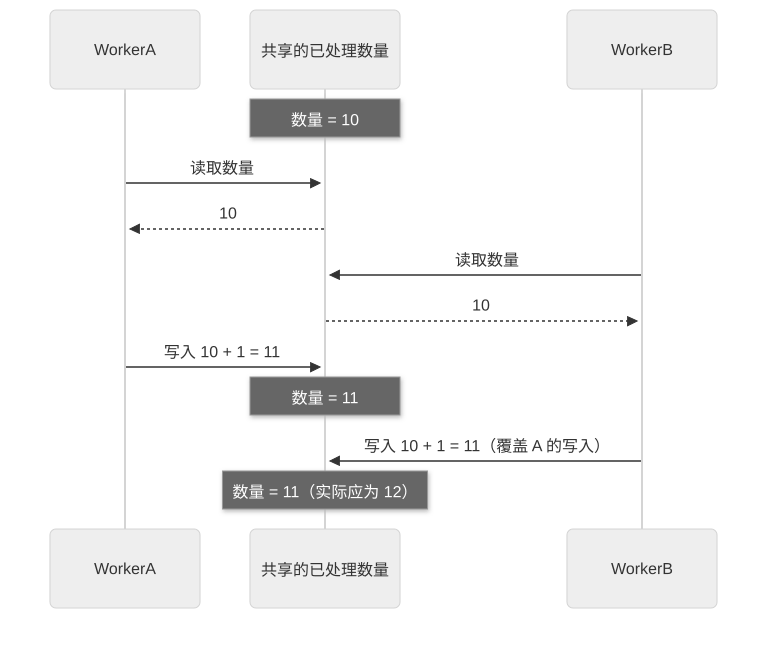
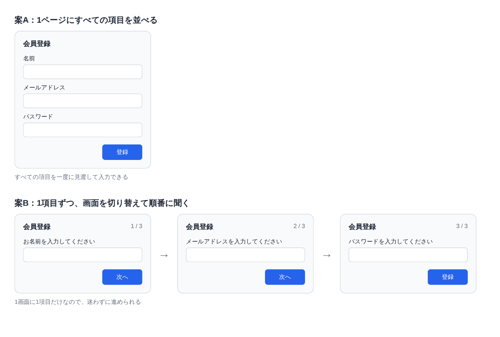

# 第 17 章：Core，决定工作方式的十条原则

[目录](README.md) · [上一篇](21-chapter.md) · [下一篇](23-chapter.md) · [English](../en/22-chapter.md)

作者：kaito · [日文原文](https://zenn.dev/sc30gsw/books/080faba713547b/viewer/a8e80b) · [作者英文版](https://zenn.dev/sc30gsw/books/7ff701b9811d04/viewer/97d863)

来源快照：2026-10-03。中文为 AI 辅助译稿，尚未完成人工终审；正文中的“我”指原作者。

[Authorization / 授权记录](../AUTHORIZATION.md)

<!-- book-body:start -->
本章介绍以下 10 条 Principle。

1. [Laziness Protocol](https://github.com/cursor/plugins/blob/main/pstack/skills/principle-laziness-protocol/SKILL.md)
2. [Subtract Before You Add](https://github.com/cursor/plugins/blob/main/pstack/skills/principle-subtract-before-you-add/SKILL.md)
3. [Minimize Reader Load](https://github.com/cursor/plugins/blob/main/pstack/skills/principle-minimize-reader-load/SKILL.md)
4. [Foundational Thinking](https://github.com/cursor/plugins/blob/main/pstack/skills/principle-foundational-thinking/SKILL.md)
5. [Redesign from First Principles](https://github.com/cursor/plugins/blob/main/pstack/skills/principle-redesign-from-first-principles/SKILL.md)
6. [Attack the Premise](https://github.com/cursor/plugins/blob/main/pstack/skills/principle-attack-the-premise/SKILL.md)
7. [Outcome-Oriented Execution](https://github.com/cursor/plugins/blob/main/pstack/skills/principle-outcome-oriented-execution/SKILL.md)
8. [Experience First](https://github.com/cursor/plugins/blob/main/pstack/skills/principle-experience-first/SKILL.md)
9. [Exhaust the Design Space](https://github.com/cursor/plugins/blob/main/pstack/skills/principle-exhaust-the-design-space/SKILL.md)
10. [Build the Lever](https://github.com/cursor/plugins/blob/main/pstack/skills/principle-build-the-lever/SKILL.md)

这 10 条属于 Core（核心）组。随附指南的 [`docs/guide/08-principles.md`](https://github.com/cursor/plugins/blob/main/pstack/docs/guide/08-principles.md) 将它们描述为决定「<strong>做多少，以及何时重新审视设计</strong>」的原则。例如，Agent 用这些原则判断是否应缩小差异、在添加功能前削减复杂性，或在基于同一前提的修复两次失败后质疑该前提。

如果只是逐条列出这 10 条 Principle，就不容易看出每条适用于什么判断。本章按判断对象把它们分为四组，并依次介绍。

- <strong>1～3</strong>……减少代码的原则
- <strong>4～7</strong>……决定如何安排设计（设计基础与重新审视的时机）的原则
- <strong>8 和 9</strong>……决定追求什么（用户体验，以及在多个方案中选择目标形态）的原则
- <strong>10</strong>……把手工工作变成工具的原则

本章按上述顺序，逐条从以下角度介绍 10 条 Principle。

- <strong>规则</strong>……该 Principle 要求做什么
- <strong>触发条件</strong>……该 Principle 适用于什么情境

<a id="%E3%81%93%E3%81%AE%E7%AB%A0%E3%81%AE%E6%A7%8B%E6%88%90"></a>


## 本章结构

本章结构如下。

- 阅读 Principle 前应了解的三个前提
- 10 条 Principle 一览
- 「Laziness Protocol」：以最小改动取得最大成果
- 「Subtract Before You Add」：添加功能前先削减复杂性
- 「Minimize Reader Load」：减少读者须追踪的间接引用层次与须记住的代码状态
- 「Foundational Thinking」：编写逻辑前先确定数据结构和基础设施
- 「Redesign from First Principles」：按新需求从一开始就存在来重新设计
- 「Attack the Premise」：基于同一前提的修复两次在同一测试失败后，质疑该前提
- 「Outcome-Oriented Execution」：优先实现可验证的最终形态，而非为维持迁移途中的一致性加入临时代码
- 「Experience First」：选择用户体验而非实现便利
- 「Exhaust the Design Space」：没有先例的设计先做两三个方案比较
- 「Build the Lever」：制作执行工作的工具，而非手工操作
- 总结

<a id="principle%E3%82%92%E8%AA%AD%E3%82%80%E5%89%8D%E3%81%AB%E6%8A%BC%E3%81%95%E3%81%88%E3%82%8B3%E3%81%A4%E3%81%AE%E5%89%8D%E6%8F%90"></a>


## 阅读 Principle 前应了解的三个前提

[第 8 章](https://zenn.dev/sc30gsw/books/080faba713547b/viewer/096f3d)和[第 9 章](https://zenn.dev/sc30gsw/books/080faba713547b/viewer/6b7496)也介绍了 Principle 的运作方式。阅读本章时，只需掌握以下三个前提。

1. <strong>Principle 决定是否纳入当前改动，以及工作是否尚未完成</strong>  
   <strong>Principle 本身是判断标准，而非步骤或能力</strong>。不过，「Build the Lever」和「[<strong>Prove It Works</strong>](https://github.com/cursor/plugins/blob/main/pstack/skills/principle-prove-it-works/SKILL.md)」等 Principle 在应用时也会要求编写脚本。
2. <strong>触发条件写在 `/poteto-mode` 的 Principle 列表和每条 Principle 的开头</strong>  
   本书将原则适用的情境称为触发条件。本章的触发条件，译自 `/poteto-mode` 的「[Principles](https://github.com/cursor/plugins/blob/main/pstack/skills/poteto-mode/SKILL.md#principles)」列表中各条目的「何时适用」，以及各条 Principle 的 `SKILL.md` 开头（description）所述的适用情境。
3. <strong>即使请求中没有写 Principle 名称，Agent 也会使用它</strong>  
   <strong>只要工作符合触发条件，Agent 就会自行阅读并应用该 Principle</strong>。不过，<strong>Agent 只在开始多步骤工作时阅读索引，而且是否适用也由 Agent 自己判断</strong>，因此可能漏掉适用的情境。  
   如果 Agent 遗漏（或跳过）了某条 Principle，人可以<strong>在请求中明确写出 Principle 名称</strong>，让 Agent 应用它并调整工作方向。

<aside class="msg message"><span class="msg-symbol">!</span><div class="msg-content">
<p class="code-line" data-line="60">本章只给 10 条 Principle 中的「Subtract Before You Add」「Exhaust the Design Space」「Build the Lever」这三条提供请求示例。</p>
<p class="code-line" data-line="62">本书只收录 pstack 随附指南或 <a href="https://github.com/cursor/plugins/blob/main/pstack/README.md" rel="nofollow noopener noreferrer" target="_blank">README</a> 中已有的请求示例。如果为原文没有示例的 Principle 自行编写示例，可能会展示 pstack 并未预期的用法。</p>
</div></aside>

<a id="10%E5%8E%9F%E5%89%87%E3%81%AE%E4%B8%80%E8%A6%A7"></a>


## 10 条 Principle 一览

<table class="code-line" data-line="67">
<thead class="code-line" data-line="67">
<tr class="code-line" data-line="67">
<th>分组</th>
<th>Principle</th>
<th>一句话结论</th>
</tr>
</thead>
<tbody class="code-line" data-line="69">
<tr class="code-line" data-line="69">
<td>减少代码</td>
<td>「<strong>Laziness Protocol</strong>」</td>
<td>用最少的代码与复杂性取得最大的成果</td>
</tr>
<tr class="code-line" data-line="70">
<td>减少代码</td>
<td>「<strong>Subtract Before You Add</strong>」</td>
<td>添加功能前先削减复杂性</td>
</tr>
<tr class="code-line" data-line="71">
<td>减少代码</td>
<td>「<strong>Minimize Reader Load</strong>」</td>
<td>减少读者须追踪的间接引用层次与须记住的代码状态</td>
</tr>
<tr class="code-line" data-line="72">
<td>设计安排</td>
<td>「<strong>Foundational Thinking</strong>」</td>
<td>编写逻辑前先确定数据结构和基础设施</td>
</tr>
<tr class="code-line" data-line="73">
<td>设计安排</td>
<td>「<strong>Redesign from First Principles</strong>」</td>
<td>按新需求从一开始就存在来重新设计</td>
</tr>
<tr class="code-line" data-line="74">
<td>设计安排</td>
<td>「<strong>Attack the Premise</strong>」</td>
<td>基于同一前提的修复两次在同一测试失败后，质疑该前提</td>
</tr>
<tr class="code-line" data-line="75">
<td>设计安排</td>
<td>「<strong>Outcome-Oriented Execution</strong>」</td>
<td>优先实现可验证的最终形态，而非为维持迁移途中的一致性加入临时代码</td>
</tr>
<tr class="code-line" data-line="76">
<td>追求的目标</td>
<td>「<strong>Experience First</strong>」</td>
<td>选择用户体验而非实现便利</td>
</tr>
<tr class="code-line" data-line="77">
<td>追求的目标</td>
<td>「<strong>Exhaust the Design Space</strong>」</td>
<td>没有先例的设计先做两三个方案比较</td>
</tr>
<tr class="code-line" data-line="78">
<td>转化为工具</td>
<td>「<strong>Build the Lever</strong>」</td>
<td>制作执行工作或证明工作正确的工具，而非手工操作</td>
</tr>
</tbody>
</table>

<a id="%E3%80%8Elaziness-protocol%E3%80%8F%E3%81%AF%E3%80%81%E6%9C%80%E5%B0%8F%E3%81%AE%E5%A4%89%E6%9B%B4%E3%81%A7%E6%9C%80%E5%A4%A7%E3%81%AE%E7%B5%90%E6%9E%9C%E3%82%92%E5%BE%97%E3%82%8B"></a>


## 「Laziness Protocol」以最小改动取得最大成果

「<strong>Laziness Protocol</strong>」要求<strong>以最少的代码与复杂性取得最大的成果</strong>。它判断解决方案好坏的唯一标准是：人类开发者<strong>是否会因维护这些代码而疲惫不堪</strong>。原文明确写道：「<strong>如果维护这些代码令人疲惫不堪，那就是糟糕的解决方案</strong>」。

<a id="%E3%83%AB%E3%83%BC%E3%83%AB%EF%BC%9A%E3%82%B3%E3%83%BC%E3%83%89%E3%82%92%E6%B6%88%E3%81%97%E3%80%81%E5%91%BC%E3%81%B3%E5%87%BA%E3%81%97%E3%81%AE%E9%9A%8E%E5%B1%A4%E3%82%92%E6%B5%85%E3%81%8F%E3%81%97%E3%80%81%E5%88%A4%E6%96%AD%E3%82%92%E4%B8%80%E3%81%8B%E6%89%80%E3%81%A7%E6%B1%BA%E3%82%81%E3%82%8B"></a>


### 规则：删除代码、减少调用层次、集中作出判断

主要规则如下。

<a id="%E6%B6%88%E3%81%9B%E3%82%8B%E3%82%82%E3%81%AE%E3%82%92%E5%85%88%E3%81%AB%E6%8E%A2%E3%81%99"></a>


#### 先寻找可以删除的内容

接到改进请求时，先寻找可以删除的内容，再考虑添加代码。

<a id="%E5%91%BC%E3%81%B3%E5%87%BA%E3%81%97%E3%81%AE%E9%9A%8E%E5%B1%A4%E3%82%92%E6%B5%85%E3%81%8F%E3%81%99%E3%82%8B"></a>


#### 减少调用层次

如果为了找到代码中的目标，需要查看四个或更多文件，或追踪四层或更多处理，就应去掉中间层，缩短路径。必须追踪多层才能得到答案的代码，会让维护者疲惫。

<a id="%E5%88%A4%E6%96%AD%E3%82%92%E4%B8%80%E3%81%8B%E6%89%80%E3%81%AB%E3%81%BE%E3%81%A8%E3%82%81%E3%82%8B"></a>


#### 在一处集中作出判断

不要在多个位置重复判断同一条件；只在一处判断。  
例如，先判断输入框是否为空，再把结果用于「按钮启用或禁用」和「提示信息显示」等多个位置。修改条件时，只需修改这一处。相同判断散落多处，就得一直花力气保持它们一致。

<a id="%E5%B7%AE%E5%88%86%E3%82%92%E6%9C%80%E5%B0%8F%E3%81%AB%E3%81%99%E3%82%8B"></a>


#### 缩小差异

相比精巧的样板代码，应选择行数更少的实现。

<a id="%E6%96%B0%E3%81%97%E3%81%84%E5%80%A4%E3%82%92%E5%B1%A4%E3%81%AB%E9%80%9A%E3%81%99%E5%89%8D%E3%81%AB%E6%AD%A2%E3%81%BE%E3%82%8B"></a>


#### 让新值穿过多层之前先停下来

如果请求要求让一个新值穿过类型、schema、pipeline 等多个层次，先停下来寻找更直接的做法。

例如，为仅向付费会员显示按钮而新增功能时，不要立刻把「是否为付费会员」这个新值加到 API 类型、转换流程和从父组件传给子组件的属性等多个层次。先看看能否直接用按钮附近已有的用户信息判断。

<a id="%E7%99%BA%E7%81%AB%E6%9D%A1%E4%BB%B6"></a>


### 触发条件

- 重构或估算差异规模时
- 想增加抽象或层次时
- 想让新值穿过多个层次传递时

<a id="%E3%80%8Esubtract-before-you-add%E3%80%8F%E3%81%AF%E3%80%81%E6%A9%9F%E8%83%BD%E3%82%92%E8%BF%BD%E5%8A%A0%E3%81%99%E3%82%8B%E5%89%8D%E3%81%AB%E8%A4%87%E9%9B%91%E3%81%95%E3%82%92%E5%89%8A%E3%82%8B"></a>


## 「Subtract Before You Add」在添加功能前削减复杂性

「<strong>Subtract Before You Add</strong>」要求<strong>扩展系统时先去除复杂性，再构建新内容</strong>。在复杂系统中添加功能会进一步堆积复杂性。先削减复杂性，代码会减少，系统的基本结构也会显现，下一步如何设计通常也会更清楚。

<a id="%E3%83%AB%E3%83%BC%E3%83%AB%EF%BC%9A%E4%BD%9C%E3%82%8B%E5%89%8D%E3%81%AB%E8%A4%87%E9%9B%91%E3%81%95%E3%82%92%E5%8F%96%E3%82%8A%E9%99%A4%E3%81%8F"></a>


### 规则：构建前先去除复杂性

- 构建前先去除复杂性；打磨品质前，先缩减到最小范围
- 不增加对必要性尚未证实的边缘情况的处理，而根据实际观察到的用法设计
- 验证器与防护措施只覆盖规格要求的范围，不凭猜测添加
- 即使在提示词或 Skill 文本中，也要删除重复指令

<a id="%E7%99%BA%E7%81%AB%E6%9D%A1%E4%BB%B6-1"></a>


### 触发条件

决定添加功能或处理、重构、重写的先后顺序时。

<a id="%E4%BE%9D%E9%A0%BC%E3%81%AE%E4%BE%8B%EF%BC%9A%E5%8F%A4%E3%81%84%E3%82%A2%E3%83%80%E3%83%97%E3%82%BF%E3%82%92%E6%B6%88%E3%81%97%E3%81%A6%E3%81%8B%E3%82%89%E8%A8%AD%E8%A8%88%E3%81%95%E3%81%9B%E3%82%8B"></a>


### 请求示例：删除旧适配器后再设计

以下示例来自随附指南：Agent 正要在现有三个适配器之外添加第四个适配器。

```
use subtract before you add. delete the obsolete adapters first, then design what's left.
// subtract before you add を使って。まず古くなったアダプタを消して。それから残ったものを設計して。
```

<aside class="msg message"><span class="msg-symbol">!</span><div class="msg-content">
<p class="code-line" data-line="142"><strong>适配器</strong>……吸收外部服务之间的差异，使它们能以相同方式调用的组件。</p>
<p class="code-line" data-line="144">例如，A 公司、B 公司、C 公司的支付服务各有不同的调用方式；为每家公司准备适配器后，应用程序都能以相同写法 <code>pay(金額)</code> 调用。</p>
</div></aside>

<a id="%E3%80%8Eminimize-reader-load%E3%80%8F%E3%81%AF%E3%80%81%E8%AA%AD%E3%81%BF%E6%89%8B%E3%81%8C%E3%81%9F%E3%81%A9%E3%82%8B%E9%96%93%E6%8E%A5%E5%8F%82%E7%85%A7%E3%81%AE%E5%B1%A4%E3%81%A8%E3%80%81%E8%A6%9A%E3%81%88%E3%81%A6%E3%81%8A%E3%81%8F%E5%BF%85%E8%A6%81%E3%81%8C%E3%81%82%E3%82%8B%E3%82%B3%E3%83%BC%E3%83%89%E3%81%AE%E7%8A%B6%E6%85%8B%E3%82%92%E6%B8%9B%E3%82%89%E3%81%99"></a>


## 「Minimize Reader Load」减少读者须追踪的间接引用层次与须记住的代码状态

「<strong>Minimize Reader Load</strong>」将可维护性定义为「<strong>读者理解代码所需付出的工作量</strong>」。代码被阅读的次数远多于被编写的次数。

这条 Principle 用「须追踪的层次」和「须记住的状态」两个维度衡量读者负担。

「须追踪的层次」指读者从产生疑问到找到答案，需要经过多少层函数或文件。

「须记住的状态」指读者为理解代码行为，必须在脑中记住的隐藏状态或可变值，也就是需要持续追踪「哪个值」在「何处」会「改变」所造成的负担。

这两个维度分别造成不同类型的阅读困难。

例如，即使只有一个文件，无须追踪多层函数，如果有 50 个可从任何位置修改的全局变量，读者仍难以弄清某个值何时何处改变。反过来，即使变量不多，如果要经过六层适配器（承担转换的层次）才能找到答案，代码同样难读。

因此，这条 Principle 要求同时减少两种负担，而非只处理其中一种。

「<strong>Minimize Reader Load</strong>」相当于[第 20 章](https://zenn.dev/sc30gsw/books/080faba713547b/viewer/c155cc)「[<strong>Guard the Context Window</strong>](https://github.com/cursor/plugins/blob/main/pstack/skills/principle-guard-the-context-window/SKILL.md)」（避免大量输出占满 Agent 上下文窗口）的面向人类版本。一次能记住的内容（工作记忆）有限，这对 Agent 和阅读代码的人都一样。

<a id="%E3%83%AB%E3%83%BC%E3%83%AB%EF%BC%9A%E5%B1%A4%E3%81%A8%E7%8A%B6%E6%85%8B%E3%82%92%E6%B8%9B%E3%82%89%E3%81%99"></a>


### 规则：减少层次与状态

<a id="%E5%8F%97%E3%81%91%E6%B8%A1%E3%81%99%E3%81%A0%E3%81%91%E3%81%AE%E5%B1%A4%E3%82%92%E3%81%AA%E3%81%8F%E3%81%99"></a>


#### 去掉只负责转交调用的层次

如果某个函数只调用另一个函数，而且只在一处被使用，就去掉这个函数，让调用方直接调用原本被它调用的函数。  
例如，如果 `saveUser()` 只调用 `db.save()`，就直接调用 `db.save()`。

```
type User = { name: string };
declare const db: { save(user: User): Promise<void> };
declare const user: User;

// 前：saveUser は db.save を呼ぶだけで、使われているのはここ1か所
function saveUser(user: User) {
  return db.save(user);
}
await saveUser(user);

// 後：saveUser をなくし、db.save を直接呼ぶ
await db.save(user);
```

如果调用方与实际处理之间的中间层没有任何可替换的实现，也应同样去掉；为将来扩展而预先加入的层次也包括在内。

例如，只使用一家支付服务，却仍加入 `PaymentGateway` 这样的可替换接口。这样的层次只会增加读者「打开文件查看里面做了什么」的工作。

```
declare const aPayClient: { charge(amount: number): Promise<void> };

// 前：取り替え用の窓口を挟んでいるが、実装は A社用の1つしかない
interface PaymentGateway {
  pay(amount: number): Promise<void>;
}

class APayPaymentGateway implements PaymentGateway {
  pay(amount: number) {
    return aPayClient.charge(amount);
  }
}

const gateway: PaymentGateway = new APayPaymentGateway();
await gateway.pay(1000);

// 後：窓口をなくし、A社の決済を直接呼ぶ
await aPayClient.charge(1000);
```

<a id="%E7%8A%B6%E6%85%8B%E3%81%AE%E7%AF%84%E5%9B%B2%E3%82%92%E7%8B%AD%E3%82%81%E3%82%8B"></a>


#### 缩小状态的作用范围

缩小值可以被修改的范围。例如，相比可从任何地方修改的全局变量，应选择只在一个函数中使用的局部变量。

也不要把可以从其他值计算出来的值另存为变量。  
例如，除了商品列表再存一个「商品数量」变量，每次修改列表都必须同步更新数量。原有三件商品，添加一件后忘记更新数量，就会出现列表有四件、数量仍是三的情况。应在需要时从列表计算数量。

状态的作用范围越小，读者需要记住的代码状态就越少。

<a id="%E4%B8%8D%E5%A4%89%E6%9D%A1%E4%BB%B6%E3%81%AF%E3%80%81%E5%A2%83%E7%95%8C%E3%81%A7%E4%B8%80%E5%BA%A6%E3%81%A0%E3%81%91%E7%A2%BA%E3%81%8B%E3%82%81%E3%81%A6%E5%90%8D%E5%89%8D%E3%82%92%E4%BB%98%E3%81%91%E3%82%8B"></a>


#### 在边界只验证一次不变量，并为它命名

不变量指「金额大于或等于零」等程序运行期间始终必须满足的条件。这条 Principle 要求只在边界验证一次，而非在每个使用位置重复验证。

<aside class="msg message"><span class="msg-symbol">!</span><div class="msg-content">
<p class="code-line" data-line="226">这里的<strong>边界</strong>，指表单输入或 API 响应等外部数据进入的位置。</p>
<p class="code-line" data-line="228">例如，接收订单表单金额的函数，只检查一次「金额是否大于或等于零」，再把已验证的值作为名为 <code>NonNegativeAmount</code>（非负金额）的类型传递。</p>
<p class="code-line" data-line="230">使用金额的函数（如计算总额或创建发票的函数）接收 <code>NonNegativeAmount</code> 类型，无须重复检查相同条件。</p>
<p class="code-line" data-line="232">只看类型名就能知道「这个金额已在边界验证为非负」。这样，<strong>读者只需阅读边界的一处和类型名，就能一次记住该条件</strong>。</p>
<div class="code-block-container"><pre class="shiki github-dark" style="background-color:#151e2c;color:#e1e4e8"><code class="code-line" data-line="234"><span class="line"><span style="color:#a0aab5">// 0以上だと確かめ済みの金額を表す型</span></span>
<span class="line"><span style="color:#F97583">type</span><span style="color:#B392F0"> NonNegativeAmount</span><span style="color:#F97583"> =</span><span style="color:#79B8FF"> number</span><span style="color:#F97583"> &amp;</span><span style="color:#E1E4E8"> { </span><span style="color:#F97583">readonly</span><span style="color:#FFAB70"> __brand</span><span style="color:#F97583">:</span><span style="color:#9ECBFF"> "NonNegativeAmount"</span><span style="color:#E1E4E8"> };</span></span>
<span class="line"></span>
<span class="line"><span style="color:#a0aab5">// 境界：注文フォームから受け取った金額を、ここで一度だけ確かめる</span></span>
<span class="line"><span style="color:#F97583">function</span><span style="color:#B392F0"> parseAmount</span><span style="color:#E1E4E8">(</span><span style="color:#FFAB70">input</span><span style="color:#F97583">:</span><span style="color:#79B8FF"> number</span><span style="color:#E1E4E8">)</span><span style="color:#F97583">:</span><span style="color:#B392F0"> NonNegativeAmount</span><span style="color:#E1E4E8"> {</span></span>
<span class="line"><span style="color:#F97583">  if</span><span style="color:#E1E4E8"> (input </span><span style="color:#F97583">&lt;</span><span style="color:#79B8FF"> 0</span><span style="color:#E1E4E8">) {</span></span>
<span class="line"><span style="color:#F97583">    throw</span><span style="color:#F97583"> new</span><span style="color:#B392F0"> Error</span><span style="color:#E1E4E8">(</span><span style="color:#9ECBFF">"金額は0以上で入力してください"</span><span style="color:#E1E4E8">);</span></span>
<span class="line"><span style="color:#E1E4E8">  }</span></span>
<span class="line"></span>
<span class="line"><span style="color:#F97583">  return</span><span style="color:#E1E4E8"> input </span><span style="color:#F97583">as</span><span style="color:#B392F0"> NonNegativeAmount</span><span style="color:#E1E4E8">; </span><span style="color:#a0aab5">// 確かめた直後なので、ここでだけ型を付ける</span></span>
<span class="line"><span style="color:#E1E4E8">}</span></span>
<span class="line"></span>
<span class="line"><span style="color:#a0aab5">// 使う側：NonNegativeAmount で受け取るので、「0以上か」を確かめ直さない</span></span>
<span class="line"><span style="color:#F97583">function</span><span style="color:#B392F0"> calcTotal</span><span style="color:#E1E4E8">(</span><span style="color:#FFAB70">price</span><span style="color:#F97583">:</span><span style="color:#B392F0"> NonNegativeAmount</span><span style="color:#E1E4E8">, </span><span style="color:#FFAB70">quantity</span><span style="color:#F97583">:</span><span style="color:#79B8FF"> number</span><span style="color:#E1E4E8">)</span><span style="color:#F97583">:</span><span style="color:#79B8FF"> number</span><span style="color:#E1E4E8"> {</span></span>
<span class="line"><span style="color:#F97583">  return</span><span style="color:#E1E4E8"> price </span><span style="color:#F97583">*</span><span style="color:#E1E4E8"> quantity;</span></span>
<span class="line"><span style="color:#E1E4E8">}</span></span>
<span class="line"></span>
<span class="line"><span style="color:#F97583">function</span><span style="color:#B392F0"> createInvoice</span><span style="color:#E1E4E8">(</span><span style="color:#FFAB70">amount</span><span style="color:#F97583">:</span><span style="color:#B392F0"> NonNegativeAmount</span><span style="color:#E1E4E8">)</span><span style="color:#F97583">:</span><span style="color:#79B8FF"> string</span><span style="color:#E1E4E8"> {</span></span>
<span class="line"><span style="color:#F97583">  return</span><span style="color:#9ECBFF"> `ご請求金額：${</span><span style="color:#E1E4E8">amount</span><span style="color:#9ECBFF">}円`</span><span style="color:#E1E4E8">;</span></span>
<span class="line"><span style="color:#E1E4E8">}</span></span>
<span class="line"></span></code></pre></div>
<p class="code-line" data-line="257"><code>calcTotal</code> 和 <code>createInvoice</code> 中没有 <code>if (amount &lt; 0)</code> 这样的检查。未经过 <code>parseAmount</code> 的数值在传入时会产生编译错误，因此使用方无须再次验证。</p>
</div></aside>

<a id="30%E7%A7%92%E3%83%86%E3%82%B9%E3%83%88%E3%81%A7%E5%88%A4%E5%AE%9A%E3%81%99%E3%82%8B"></a>


#### 用 30 秒测试判断

<strong>这条 Principle 用「30 秒测试」判断层次或状态是否过多</strong>。如果新读者无法在 30 秒内回答「X 从哪里来」「什么可能改变 X」，就应减少层次或状态。

<a id="%E7%99%BA%E7%81%AB%E6%9D%A1%E4%BB%B6-2"></a>


### 触发条件

审阅处理流程难以追踪的代码，或编写、重组这类代码时。

<a id="%E3%80%8Efoundational-thinking%E3%80%8F%E3%81%AF%E3%80%81%E3%83%AD%E3%82%B8%E3%83%83%E3%82%AF%E3%81%AE%E5%89%8D%E3%81%AB%E3%83%87%E3%83%BC%E3%82%BF%E6%A7%8B%E9%80%A0%E3%81%A8%E5%9C%9F%E5%8F%B0%E3%82%92%E6%B1%BA%E3%82%81%E3%82%8B"></a>


## 「Foundational Thinking」在编写逻辑前确定数据结构和基础设施

「<strong>Foundational Thinking</strong>」要求<strong>编写逻辑前先确定数据的形态</strong>。

这条 Principle 将判断分为以下两类。

1. 结构判断（决定数据形态和工作顺序）
2. 代码写法判断

结构判断保留未来的选择余地。这里的结构判断指「决定数据形态或工作顺序」，未来的选择余地指「之后仍可选择其他路线的空间」。  
代码写法判断则保持代码简洁。只要正确选择数据结构，后续代码需要写什么，通常也会自然明确。

poteto 在《The Complete Guide to pstack》[Part 2](https://x.com/poteto/status/2097732320606507506) 中提出这样的分工：<strong>Agent 时代的工程师把时间用于选择架构和数据结构，Agent 则补齐实现细节</strong>。这条 Principle 将选择数据结构的判断放在 Agent 工作的开头。

<a id="%E3%83%AB%E3%83%BC%E3%83%AB%EF%BC%9A%E3%83%87%E3%83%BC%E3%82%BF%E6%A7%8B%E9%80%A0%E3%82%92%E6%B1%BA%E3%82%81%E3%80%81%E4%B8%A6%E8%A1%8C%E3%81%99%E3%82%8B%E7%8A%B6%E6%85%8B%E3%82%92%E5%88%86%E3%81%91%E3%80%81%E5%9C%9F%E5%8F%B0%E3%82%92%E4%BD%9C%E3%81%A3%E3%81%A6%E3%81%8B%E3%82%89%E4%BB%95%E7%B5%84%E3%81%BF%E3%82%92%E7%A9%8D%E3%82%80"></a>


### 规则：确定数据结构、拆分并发状态、先建基础设施再叠加功能

<a id="%E3%83%87%E3%83%BC%E3%82%BF%E6%A7%8B%E9%80%A0%E3%82%92%E5%85%88%E3%81%AB%E6%B1%BA%E3%82%81%E3%82%8B"></a>


#### 先确定数据结构

编写逻辑前，先确定核心数据的类型。接着梳理这些数据将在何处、如何被读写，并选择适合最常见操作的形态。

例如，制作商品列表功能时，先确定「商品包含名称、价格、库存数量」，之后再考虑如何展示或加入购物车。确定数据形态后，使用它的处理逻辑就容易编写。

```
// 先に決める：商品は名前、価格、在庫数を持つ
type Product = {
  name: string;
  price: number;
  stock: number;
};

// 形が決まっているので、表示やカートへの追加は迷わずに書ける
function formatProduct(product: Product): string {
  return `${product.name}　${product.price}円（在庫 ${product.stock}）`;
}

function canAddToCart(product: Product): boolean {
  return product.stock > 0;
}
```

<a id="%E3%82%B3%E3%83%BC%E3%83%89%E3%81%A7%E3%81%AF%E3%80%81%E8%A1%8C%E3%81%AE%E9%87%8D%E8%A4%87%E3%82%88%E3%82%8A%E6%A7%8B%E9%80%A0%E3%81%AE%E9%87%8D%E8%A4%87%E3%82%92%E3%81%AA%E3%81%8F%E3%81%99"></a>


#### 在代码中消除结构重复，而非仅仅消除相似的代码行

不要每见到几行相似代码就提取公共函数，应优先消除数据形态等结构上的重复。

这条 Principle 认为，只有三段相似语句时，不必急于抽取共用逻辑，直接保留往往更好。比起精巧的写法，应选择一眼能懂的写法。所谓精巧，是指虽然写得短，但读者无法立刻理解的写法。例如，判断数字是否为奇数，与其使用 `n & 1` 这样的位运算，不如写 `n % 2 === 1`。

<strong>过早抽象或过于精巧的写法，都背离保持代码简洁的目标</strong>。

<a id="%E5%90%8C%E6%99%82%E3%81%AB%E6%9B%B8%E3%81%8D%E6%8F%9B%E3%81%88%E3%82%89%E3%82%8C%E3%82%8B%E5%80%A4%E3%81%AF%E3%80%81%E5%85%B1%E6%9C%89%E3%81%9B%E3%81%9A%E5%88%86%E3%81%91%E3%82%8B"></a>


#### 将可能并发修改的值分开，而非共享

多个主体（同时运行的 Worker 或 Agent）共享同一个值之前，先思考「<strong>其他主体同时修改这个值会发生什么</strong>」。如果会引发问题，就不要共享该值，而是让每个主体持有自己的值。

例如，Worker A 和 B 都把共享的「已处理数量」加一。若数量原为 10，而 A、B 几乎同时运行，就会出现以下过程。

<span class="embed-block zenn-embedded zenn-embedded-mermaid"><iframe data-content="sequenceDiagram%0A%20%20%20%20participant%20A%20as%20WorkerA%0A%20%20%20%20participant%20S%20as%20%E5%85%B1%E6%9C%89%E3%81%AE%E5%87%A6%E7%90%86%E6%B8%88%E3%81%BF%E4%BB%B6%E6%95%B0%0A%20%20%20%20participant%20B%20as%20WorkerB%0A%20%20%20%20Note%20over%20S%3A%20%E4%BB%B6%E6%95%B0%20%3D%2010%0A%20%20%20%20A-%3E%3ES%3A%20%E4%BB%B6%E6%95%B0%E3%82%92%E8%AA%AD%E3%82%80%0A%20%20%20%20S--%3E%3EA%3A%2010%0A%20%20%20%20B-%3E%3ES%3A%20%E4%BB%B6%E6%95%B0%E3%82%92%E8%AA%AD%E3%82%80%0A%20%20%20%20S--%3E%3EB%3A%2010%0A%20%20%20%20A-%3E%3ES%3A%2010%20%2B%201%20%3D%2011%20%E3%82%92%E6%9B%B8%E3%81%8D%E8%BE%BC%E3%82%80%0A%20%20%20%20Note%20over%20S%3A%20%E4%BB%B6%E6%95%B0%20%3D%2011%0A%20%20%20%20B-%3E%3ES%3A%2010%20%2B%201%20%3D%2011%20%E3%82%92%E6%9B%B8%E3%81%8D%E8%BE%BC%E3%82%80%EF%BC%88A%E3%81%AE%E6%9B%B8%E3%81%8D%E8%BE%BC%E3%81%BF%E3%82%92%E4%B8%8A%E6%9B%B8%E3%81%8D%EF%BC%89%0A%20%20%20%20Note%20over%20S%3A%20%E4%BB%B6%E6%95%B0%20%3D%2011%EF%BC%88%E6%9C%AC%E5%BD%93%E3%81%AF12%EF%BC%89" frameborder="0" id="zenn-embedded__607ee6fd993ff" loading="lazy" scrolling="no" src="https://embed.zenn.studio/mermaid#zenn-embedded__607ee6fd993ff"></iframe></span>

<!-- book-diagram-link:start -->


[查看图示 1](../diagrams/zh-CN/22-01.md)
<!-- book-diagram-link:end -->

两个 Worker 各处理了一件工作，本应得到 12；但 B 根据 A 写入前读到的 10 写入 11，结果计数仍是 11，丢失了一次更新。

因此，每个 Worker 应各自保存处理数量，只在需要总数时相加。值分属不同主体后，就不会再被其他主体修改。

```
type Job = { id: string };
declare const store: {
  get(key: string): Promise<number>;
  set(key: string, value: number): Promise<void>;
};
declare function processJob(job: Job): Promise<void>;
declare const jobsForA: Job[];
declare const jobsForB: Job[];

// 前：全Workerで1つの「処理済み件数」を共有し、読んでから書き込む
async function countUp() {
  // A と B がほぼ同時に 10 を読む
  const current = await store.get("processedCount"); 
  // どちらも 11 を書き込み、1件分が消える
  await store.set("processedCount", current + 1);
}

// 後：Workerごとに自分の件数を持たせ、全体が必要なときだけ合計する
async function runWorker(jobs: Job[]): Promise<number> {
  let processedCount = 0; // このWorker専用の値

  for (const job of jobs) {
    await processJob(job);
    processedCount += 1;
  }

  return processedCount;
}

const counts = await Promise.all([runWorker(jobsForA), runWorker(jobsForB)]);
const total = counts[0] + counts[1];
```

<a id="%E5%9C%9F%E5%8F%B0%E3%82%92%E5%85%88%E3%81%AB%E4%BD%9C%E3%82%8B"></a>


#### 先建基础设施

问自己：「<strong>后续每个阶段都会因它存在而受益吗</strong>？」如果答案是「是」，就先建设它。CI、lint、测试基础设施和共享类型都属于这类基础。此 Principle 称其为 <strong>scaffold</strong>（字面意为「脚手架」）。

功能前先做准备，修复前先建测试。提交也应小而目的单一。有了基础设施，后续所有工作都能使用它。

不过，<strong>删除未使用代码的优先级高于建设基础设施</strong>。

如果保留未使用代码，先建基础设施，共享类型和测试可能也会为这些无用代码提供支持。先删除它们，才能看清实际使用的部分，为之建设合适的基础设施。这与本章的[「Subtract Before You Add」](#%E3%80%8Esubtract-before-you-add%E3%80%8F%E3%81%AF%E3%80%81%E6%A9%9F%E8%83%BD%E3%82%92%E8%BF%BD%E5%8A%A0%E3%81%99%E3%82%8B%E5%89%8D%E3%81%AB%E8%A4%87%E9%9B%91%E3%81%95%E3%82%92%E5%89%8A%E3%82%8B)思路相同。

此外，如[第 4 章](https://zenn.dev/sc30gsw/books/080faba713547b/viewer/dc9141)所述，代码库也是 Agent 的记忆。因此，本书认为，优先删除未使用代码也有助于避免留下错误的上下文。

<a id="%E5%A4%89%E6%9B%B4%E3%82%921%E3%81%A4%E8%A1%8C%E3%81%86%E3%81%9F%E3%81%B3%E3%81%AB%E3%80%81%E3%81%BE%E3%81%A8%E3%81%BE%E3%81%A3%E3%81%9F%E4%BB%95%E7%B5%84%E3%81%BF%E3%82%921%E3%81%A4%E7%BD%AE%E3%81%8F"></a>


#### 每做一项改动，都留下一个完整机制

每做一项改动，都创建一个完整机制（可供多处使用的共用函数或组件等），或让已有的共用函数或组件更易使用。

添加新功能时，不要在每个使用位置散布特例处理。例如，为商品列表增加排序功能，不应在每个展示列表的页面各写一套排序逻辑，而应制作一个负责排序的组件，由各页面调用。

<strong>新功能集中在一处，阅读和修改的人也只需查看这一处</strong>。

<a id="%E7%99%BA%E7%81%AB%E6%9D%A1%E4%BB%B6-3"></a>


### 触发条件

- 编写逻辑前（选择核心类型或数据结构时）
- 决定先建基础设施（CI、lint、测试基础设施和共享类型等后续工作都会使用的机制）还是先做功能时
- 思考并发运行的多个<strong>主体</strong>应共享什么时

<aside class="msg message"><span class="msg-symbol">!</span><div class="msg-content">
<p class="code-line" data-line="403">这里的<strong>主体</strong>，指同时运行并推进处理的实体。</p>
<p class="code-line" data-line="405">例如，从队列取出任务并行处理的多个 Worker（负责执行处理的程序），或同时在同一仓库工作的多个 Agent，都属于主体。</p>
</div></aside>

<a id="%E3%80%8Eredesign-from-first-principles%E3%80%8F%E3%81%AF%E3%80%81%E6%96%B0%E3%81%97%E3%81%84%E8%A6%81%E4%BB%B6%E3%82%92%E6%9C%80%E5%88%9D%E3%81%8B%E3%82%89%E3%81%82%E3%81%A3%E3%81%9F%E5%89%8D%E6%8F%90%E3%81%A8%E3%81%97%E3%81%A6%E8%A8%AD%E8%A8%88%E3%81%97%E7%9B%B4%E3%81%99"></a>


## 「Redesign from First Principles」按新需求从一开始就存在来重新设计

「<strong>Redesign from First Principles</strong>」要求不要把变更后加到现有设计中，而要<strong>按这项需求从一开始就存在来重新设计</strong>。本书认为，如果「<strong>Foundational Thinking</strong>」适用于「新建事物」，那么「<strong>Redesign from First Principles</strong>」适用于「将变更融入现有设计」。

<a id="%E3%83%AB%E3%83%BC%E3%83%AB%EF%BC%9A4%E3%81%A4%E3%81%AE%E6%89%8B%E9%A0%86%E3%81%A7%E8%A8%AD%E8%A8%88%E3%81%97%E7%9B%B4%E3%81%99"></a>


### 规则：用四个步骤重新设计

1. 阅读所有受影响的文件，理解现有设计
2. 问自己：「如果从一开始就知道这项新需求，要从零编写，会怎样设计？」
3. 将相关类型、文档、示例和说明设计理由的章节等所有位置都调整到新设计
4. 先构思重新设计后的整体，再把改动分成小步逐步实施

例如，为原本只处理日元的价格计算增加美元支付，可以这样思考。

- 后加功能时，在每个使用金额的位置加入「如果是美元就这样计算」的分支
- 重新设计时，先问「如果从一开始就支持多币种，会怎样设计」，再把金额改为「数值与币种」的组合

最后，为体现重新设计的结果，所有使用金额的位置、类型和文档都应改用这一形态。

```
// 後付け：金額は円の数値のまま、使う箇所ごとに「ドルなら」の分岐を追加する
function formatPrice(amount: number, isDollar: boolean): string {
  if (isDollar) {
    return `$${amount.toFixed(2)}`;
  }

  return `${amount}円`;
}
```

```
// 設計し直す：金額を「数値と通貨の組」として持ち、使う箇所はすべてこの型を受け取る
type Currency = "JPY" | "USD";
type Money = { amount: number; currency: Currency };

function formatPrice(price: Money): string {
  if (price.currency === "USD") {
    return `$${price.amount.toFixed(2)}`;
  }

  return `${price.amount}円`;
}
```

这条 Principle 将上述四步视为<strong>把变更融入现有设计，同时保留未来选择余地</strong>的方法。如果只是在原设计上追加，新加部分会一直与原设计不一致。之后的修改只能绕开这种不一致，未来可选的设计路线也会减少。

<a id="%E7%99%BA%E7%81%AB%E6%9D%A1%E4%BB%B6-4"></a>


### 触发条件

将新需求融入现有设计时。

<a id="%E3%80%8Eattack-the-premise%E3%80%8F%E3%81%AF%E3%80%81%E5%90%8C%E3%81%98%E5%89%8D%E6%8F%90%E3%81%AB%E7%AB%8B%E3%81%A4%E4%BF%AE%E6%AD%A3%E3%81%8C%E5%90%8C%E3%81%98%E3%83%86%E3%82%B9%E3%83%88%E3%81%A72%E5%9B%9E%E8%90%BD%E3%81%A1%E3%81%9F%E3%82%89%E5%89%8D%E6%8F%90%E3%82%92%E7%96%91%E3%81%86"></a>


## 「Attack the Premise」：基于同一前提的修复两次在同一测试失败后，质疑该前提

「<strong>Attack the Premise</strong>」规定，如果基于同一前提的两次或更多修复在同一道 gate 失败，<strong>就应质疑前提，而非继续修改</strong>。

<aside class="msg message"><span class="msg-symbol">!</span><div class="msg-content">
<ul class="code-line" data-line="462">
<li class="code-line" data-line="462">
<strong>gate</strong>……意为「关卡」，指修复必须通过的测试或检查。</li>
<li class="code-line" data-line="463">
<strong>前提</strong>……编写修复的人或 Agent 理所当然地认为「原因就在这里」的想法。</li>
</ul>
</div></aside>

例如，Agent 认为「处理速度慢是因为数据量过大」，第一次和第二次都尝试减少每批处理的数据量，但两次都在同一测试失败。

如果数据量是原因，减少数据量应使测试通过。两次测试都失败，说明速度慢可能另有原因。因此，写第三次修复前，Agent 应质疑「数据量过大」这个想法本身。每次基于相同前提的修复失败，<strong>失败本身就为判断该前提提供了证据</strong>，Agent 可以据此反思前提。

「<strong>Redesign from First Principles</strong>」围绕新需求重组设计，而这条 Principle <strong>质疑现有设计视为「理所当然」的前提</strong>。

<a id="%E3%83%AB%E3%83%BC%E3%83%AB%EF%BC%9A%E7%9B%B4%E3%81%99%E5%89%8D%E3%81%AB%E5%89%8D%E6%8F%90%E3%82%92%E6%9B%B8%E3%81%8D%E5%87%BA%E3%81%97%E3%80%81%E5%81%8F%E3%82%8A%E3%82%92%E6%95%B0%E3%81%88%E3%82%8B"></a>


### 规则：修改前写出前提，并统计偏斜分布

<a id="%E5%89%8D%E6%8F%90%E3%82%92%E6%9B%B8%E3%81%8D%E5%87%BA%E3%81%99"></a>


#### 写出前提

用一句话写出所有失败修复共同视为理所当然的前提，以明确需要质疑的对象。

<a id="%E6%AC%A1%E3%81%AE%E4%BF%AE%E6%AD%A3%E3%81%AE%E5%89%8D%E3%81%AB%E3%80%81census-%E3%82%92%E5%8F%96%E3%82%8B"></a>


#### 下一次修复前先做 census 统计

<strong>census</strong>（字面意为「人口普查」）是按主体（同时运行的 Worker 或 Agent）统计偏斜情况的明细。

例如，四个 Worker 分工处理任务时，分别统计各自未处理的数量，得到「Worker 1 有 30 件，Worker 2～4 各有 2 件」这样的明细。census 要说明的不是偏斜有多大，而是偏斜集中在哪个主体（本例为 Worker 1）。

Agent 应将 census 统计写成可反复运行的脚本。这符合本章最后介绍的[「Build the Lever」](#%E3%80%8Ebuild-the-lever%E3%80%8F%E3%81%AF%E3%80%81%E6%89%8B%E4%BD%9C%E6%A5%AD%E3%81%A7%E3%81%AF%E3%81%AA%E3%81%8F%E4%BD%9C%E6%A5%AD%E3%82%92%E3%81%99%E3%82%8B%E9%81%93%E5%85%B7%E3%82%92%E4%BD%9C%E3%82%8B)原则。

<a id="%E5%81%8F%E3%82%8A%E6%96%B9%E3%82%92%E8%AA%AD%E3%82%80"></a>


#### 解读偏斜模式

<strong>如果每次运行都偏向同样少数几个主体，说明某处设置或代码反复把导致偏斜的角色分配给它们</strong>。Agent 应找出这一分配机制。

这个分配机制，就是接下来要追问的「为什么」。  
这也是「[<strong>Fix Root Causes</strong>](https://github.com/cursor/plugins/blob/main/pstack/skills/principle-fix-root-causes/SKILL.md)」（不断追问「为什么」，修复根因而非症状的 Principle，见[第 19 章](https://zenn.dev/sc30gsw/books/080faba713547b/viewer/1fb019)）的思路。

<a id="%E5%81%8F%E3%82%8A%E3%82%92%E5%BE%8C%E3%81%8B%E3%82%89%E8%A3%9C%E3%82%8F%E3%81%9A%E3%80%81%E5%81%8F%E3%82%8A%E3%82%92%E7%94%9F%E3%82%80%E5%89%B2%E3%82%8A%E5%BD%93%E3%81%A6%E3%81%9D%E3%81%AE%E3%82%82%E3%81%AE%E3%82%92%E3%81%AA%E3%81%8F%E3%81%99"></a>


#### 消除造成偏斜的分配方式，而非事后补救

采用以下任一方式，避免同一主体每次都承担该角色。

- 在主体之间轮换角色
- 随机分配
- 将角色移到其他位置

例如，如果第一批任务总是交给第一个 Worker，就每次更换接收者。

即使增加事后补救机制，造成偏斜的分配方式仍在，而且每次运行都会增加额外工作（「<strong>Laziness Protocol</strong>」）。事后补救机制包括：空闲 Worker 去领取其他 Worker 的任务、所有 Worker 共用的任务池、成批转交任务或定期重新分配等。

<a id="%E5%89%8D%E6%8F%90%E3%81%A8census%E3%81%8C%E3%81%A7%E3%81%8D%E3%82%8B%E3%81%BE%E3%81%A7%E3%80%81%E6%AC%A1%E3%81%AE%E4%BF%AE%E6%AD%A3%E3%82%92%E5%A7%8B%E3%82%81%E3%81%AA%E3%81%84"></a>


#### 在写出前提并完成 census 之前，不开始下一次修复

Agent 在写出前提、完成 census 前，不开始下一次修复。如果 census 显示各主体分布均匀，说明这一前提不是原因。此时 Agent 应到别处寻找原因，并保留 census 作为证据。

<aside class="msg message"><span class="msg-symbol">!</span><div class="msg-content">
<p class="code-line" data-line="510">例如，多个 Worker 处理队列，两次未通过「在时间上限内清空队列」的测试。</p>
<p class="code-line" data-line="512">首先，Agent 在两次修复中分别加入以下处理。</p>
<ul class="code-line" data-line="514">
<li class="code-line" data-line="514">第一次……加入空闲 Worker 领取其他 Worker 任务的机制</li>
<li class="code-line" data-line="515">第二次……加入定期重新分配任务的机制</li>
</ul>
<p class="code-line" data-line="517">两次修复都基于同一前提：「任务堆积在少数 Worker 上，是因为各任务耗时不同」。</p>
<p class="code-line" data-line="519">接着，在编写第三次修复前，Agent 写脚本，从运行日志中统计每个 Worker 的未处理数量。</p>
<p class="code-line" data-line="521">如果任务耗时差异是原因，积压任务的 Worker 应随每次运行而变化。<br/>
但如果三次运行中始终只有 Worker 1 的未处理数量很高，说明原前提不成立。下一个要问的「为什么」是：「什么把这个角色分配给了 Worker 1？」</p>
<p class="code-line" data-line="524">可能的原因之一是：某项设置总让 Worker 1 接收第一批任务。</p>
</div></aside>

<a id="%E7%99%BA%E7%81%AB%E6%9D%A1%E4%BB%B6-5"></a>


### 触发条件

基于同一前提的两次或更多修复，在同一道 gate 失败时。

<a id="%E3%80%8Eoutcome-oriented-execution%E3%80%8F%E3%81%AF%E3%80%81%E7%A7%BB%E8%A1%8C%E9%80%94%E4%B8%AD%E3%81%AE%E3%82%B3%E3%83%BC%E3%83%89%E3%81%AE%E6%95%B4%E5%90%88%E6%80%A7%E3%82%92%E4%BF%9D%E3%81%A4%E3%81%9F%E3%82%81%E3%81%AE%E4%B8%80%E6%99%82%E7%9A%84%E3%81%AA%E3%82%B3%E3%83%BC%E3%83%89%E3%82%88%E3%82%8A%E3%80%81%E7%A2%BA%E3%81%8B%E3%82%81%E3%82%89%E3%82%8C%E3%82%8B%E6%9C%80%E7%B5%82%E5%BD%A2%E3%82%92%E5%84%AA%E5%85%88%E3%81%99%E3%82%8B"></a>


## 「Outcome-Oriented Execution」优先实现可验证的最终形态，而非为迁移途中保持一致加入临时代码

「<strong>Outcome-Oriented Execution</strong>」规定，相比让迁移中的代码在每一步都顺畅运行，应优先<strong>到达最终目标形态，并验证它正确</strong>。如果要求每个中间阶段都能运行，就可能产生<strong>兼容旧形式和新形式的临时代码；这些代码若未删除，容易长期留存并成为负担</strong>。

例如，将配置文件从旧格式迁到新格式，为使迁移的每一步都能读取两种格式，可能编写把旧格式转换成新格式的过渡代码。

迁移结束后，旧格式不再使用，这段过渡代码本该删除，却容易因遗忘或担心仍有旧格式残留而留下来。遵循这条 Principle 的 Agent 应朝目标形态推进，而不是靠这些代码维持中途一致性，并在预定的验证边界（事先划定的正确性检查节点）证明结果正确。

<a id="%E3%83%AB%E3%83%BC%E3%83%AB%EF%BC%9A%E9%80%94%E4%B8%AD%E3%81%A7%E5%A3%8A%E3%82%8C%E3%81%A6%E3%82%88%E3%81%84%E5%A0%B4%E6%89%80%E3%82%92%E5%85%88%E3%81%AB%E6%B1%BA%E3%82%81%E3%80%81%E6%9C%80%E5%BE%8C%E3%81%AB%E5%85%A8%E9%83%A8%E3%82%92%E7%A2%BA%E3%81%8B%E3%82%81%E3%82%8B"></a>


### 规则：事先划定可暂时失效的范围，最后全面验证

- 只有当暂时无法运行符合计划、范围有限且可恢复时，才允许这样做。
- 事先声明哪里可以暂时失效。例如，在计划中写明「迁移期间，管理界面的搜索可以暂时不可用」。
- 即使在迁移途中，也要在当前修改的位置保留能迅速发现问题的检查。
- 计划结束时，必须完整通过静态检查（如类型检查）和实际运行验证。

这条 Principle 并非无条件允许中途失效，而是要求<strong>预先在计划中写明可暂时失效的范围</strong>。

<a id="%E7%99%BA%E7%81%AB%E6%9D%A1%E4%BB%B6-6"></a>


### 触发条件

执行已预先划定阶段边界的计划性重写或迁移时。Agent 不应把它用于没有阶段边界的日常小修复。

<aside class="msg message"><span class="msg-symbol">!</span><div class="msg-content">
<p class="code-line" data-line="553">阶段边界（原文称 <strong>phase boundaries</strong>）指大型工作分成若干阶段后，各阶段之间的分界点。</p>
<p class="code-line" data-line="555">例如，迁移配置文件格式时，可按以下方式分阶段，并在每个阶段结束时验证是否正常运行。</p>
<ol class="code-line" data-line="557">
<li class="code-line" data-line="557">支持读取新格式</li>
<li class="code-line" data-line="558">将所有配置文件改写为新格式</li>
<li class="code-line" data-line="559">删除读取旧格式的逻辑</li>
</ol>
</div></aside>

<a id="%E3%80%8Eexperience-first%E3%80%8F%E3%81%AF%E3%80%81%E5%AE%9F%E8%A3%85%E3%81%AE%E9%83%BD%E5%90%88%E3%82%88%E3%82%8A%E3%83%A6%E3%83%BC%E3%82%B6%E3%83%BC%E3%81%AE%E4%BD%93%E9%A8%93%E3%82%92%E9%81%B8%E3%81%B6"></a>


## 「Experience First」选择用户体验而非实现便利

「<strong>Experience First</strong>」规定：<strong>如果对开发者更省事的做法与提升用户体验的做法冲突，应选择提升用户体验</strong>。三个打磨完善的功能胜过十个粗糙功能。此外，设计决策用一次性 HTML 验证，比直接在生产代码中试验成本更低。

<a id="%E3%83%AB%E3%83%BC%E3%83%AB%EF%BC%9A%E6%A9%9F%E8%83%BD%E3%82%92%E5%B0%91%E3%81%AA%E3%81%8F%E3%80%81%E3%82%88%E3%81%8F%E4%BD%9C%E3%82%8B"></a>


### 规则：少做功能，并把它做好

<a id="%E3%81%99%E3%81%B9%E3%81%A6%E3%81%AE%E6%A9%9F%E8%83%BD%E3%80%81%E6%93%8D%E4%BD%9C%E3%80%81%E9%81%B8%E6%8A%9E%E8%82%A2%E3%81%AB%E7%90%86%E7%94%B1%E3%82%92%E6%8C%81%E3%81%9F%E3%81%9B%E3%82%8B"></a>


#### 为每项功能、操作和选项找到理由

对于界面中的每个按钮和设置选项，都应能说明它为什么必要。

<a id="%E6%A9%9F%E8%83%BD%E3%82%92%E5%B0%91%E3%81%AA%E3%81%8F%E4%BD%9C%E3%82%8A%E3%80%81%E3%82%88%E3%81%8F%E4%BD%9C%E3%82%8B"></a>


#### 少做功能，并把它做好

与其凑齐十个粗糙功能，不如做好三个功能。

<a id="%E6%B1%BA%E3%82%81%E3%82%8B%E5%89%8D%E3%81%AB%E3%83%97%E3%83%AD%E3%83%88%E3%82%BF%E3%82%A4%E3%83%97%E3%82%92%E4%BD%9C%E3%82%8B"></a>


#### 决定前先制作原型

编写生产代码前，先用一次性 HTML 等制作原型，亲手操作、实际验证后，再决定设计方向。相比在生产代码中返工，在原型阶段发现错误成本更低。

<a id="%E7%B4%B0%E9%83%A8%E3%82%92%E6%AD%A3%E3%81%97%E3%81%8F%E3%81%99%E3%82%8B"></a>


#### 做好细节

正确处理页面切换、元素对齐、留白、操作反馈和错误显示。

例如，保存失败时应显示发生了什么，而非毫无提示。

<a id="%E3%83%A6%E3%83%BC%E3%82%B6%E3%83%BC%E3%81%8C%E4%B8%BB%E3%81%AB%E8%A1%8C%E3%81%86%E4%BD%9C%E6%A5%AD%E3%81%AE%E6%B5%81%E3%82%8C%E3%82%92%E4%B8%AD%E5%BF%83%E3%81%AB%E3%81%99%E3%82%8B"></a>


#### 以用户的主要工作流程为中心

每项功能都应帮助用户完成主要工作流程，或者至少不妨碍它。

<a id="%E5%BD%B1%E9%9F%BF%E3%81%AF%E3%83%A6%E3%83%BC%E3%82%B6%E3%83%BC%E3%81%AE%E8%A6%96%E7%82%B9%E3%81%A7%E8%AA%AC%E6%98%8E%E3%81%99%E3%82%8B"></a>


#### 从用户视角说明影响

这里的用户包括所有使用成果的人。对界面而言，是应用用户；对库或内部 API 而言，是导入它们的同事；下一位维护代码的工程师也包括在内。

例如，不要只说「修改了 API 响应格式」，而要说明「列表页面比以前显示得更快」等用户实际感受到的变化。

这条 Principle 区分了两条原则的职责：「<strong>Foundational Thinking</strong>」决定工作顺序，「<strong>Experience First</strong>」决定目标形态。同时，它认为 CI、测试基础设施和共享类型等基础设施，最终也是为了提升用户体验。

<a id="%E7%99%BA%E7%81%AB%E6%9D%A1%E4%BB%B6-7"></a>


### 触发条件

在产品、UX 或功能范围上，必须选择一方并放弃另一方的取舍出现时。

<a id="%E3%80%8Eexhaust-the-design-space%E3%80%8F%E3%81%AF%E3%80%81%E5%89%8D%E4%BE%8B%E3%81%AE%E3%81%AA%E3%81%84%E8%A8%AD%E8%A8%88%E3%81%A7%E3%81%AF2%E3%80%9C3%E6%A1%88%E3%82%92%E4%BD%9C%E3%81%A3%E3%81%A6%E6%AF%94%E3%81%B9%E3%82%8B"></a>


## 「Exhaust the Design Space」：没有先例的设计先做两三个方案比较

「<strong>Exhaust the Design Space</strong>」要求：面对代码库中没有先例的交互或设计决策，<strong>实现前先尝试几个具体的替代方案</strong>。因为做错东西的代价，比试验三个方案的代价更高。

<a id="%E3%83%AB%E3%83%BC%E3%83%AB%EF%BC%9A%E5%BD%A2%E3%81%AE%E9%81%95%E3%81%862%E3%80%9C3%E6%A1%88%E3%82%92%E4%B8%A6%E3%81%B9%E3%81%A6%E6%AF%94%E3%81%B9%E3%82%8B"></a>


### 规则：并排比较两三个形态不同的方案

对于答案不明显的设计，Agent 应制作两三个彼此竞争、形态不同的方案（原文称 competing prototypes），比较后再决定采用哪一个。方案可以是可实际操作的原型，也可以是草稿。这条规则也称为「Design it twice（设计两次）」。

关键在于<strong>方案之间的形态必须有根本差异</strong>。只对第一个方案做些微调整，不算第二个方案。只有比较形态不同的方案，才能知道哪一种更适合用户。

例如，设计注册页面时，下面两种方案的形态不同，可以作为两个方案。



相反，只改变方案 A 的按钮颜色或位置，页面形态仍与方案 A 相同，不能算另一个方案。

<a id="%E7%99%BA%E7%81%AB%E6%9D%A1%E4%BB%B6-8"></a>


### 触发条件

- 制作代码库尚无类似先例的新 UI 交互时
- 选择有多种可行实现方式的架构时
- 判断主要取决于使用感受、而非逻辑推理的产品设计时

相反，这条 Principle 不适用于以下变更。

- 做法已确立的机械式实现
- 目标状态明确的缺陷修复或重构
- 受约束限制、只有一种可行方式的变更

<a id="%E4%BE%9D%E9%A0%BC%E3%81%AE%E4%BE%8B%EF%BC%9A%E3%83%97%E3%83%AD%E3%83%88%E3%82%BF%E3%82%A4%E3%83%97%E3%82%922%E3%81%A4%E4%BD%9C%E3%81%A3%E3%81%A6%E6%AF%94%E3%81%B9%E3%82%8B"></a>


### 请求示例：制作两个原型并比较

以下示例来自 pstack 的 README。此请求会让 Agent 进入「[<strong>Prototype</strong>](https://github.com/cursor/plugins/blob/main/pstack/skills/poteto-mode/playbooks/prototype.md)」Playbook，因此制作原型时就以之后会丢弃为前提。

```
/poteto-mode build two prototypes of the markdown renderer so we can compare. spawn an agent for each.
// 比べられるように、markdown レンダラーのプロトタイプを2つ作って。それぞれにエージェントを1つずつ立てて。
```

<a id="%E3%80%8Ebuild-the-lever%E3%80%8F%E3%81%AF%E3%80%81%E6%89%8B%E4%BD%9C%E6%A5%AD%E3%81%A7%E3%81%AF%E3%81%AA%E3%81%8F%E4%BD%9C%E6%A5%AD%E3%82%92%E3%81%99%E3%82%8B%E9%81%93%E5%85%B7%E3%82%92%E4%BD%9C%E3%82%8B"></a>


## 「Build the Lever」：制作执行工作的工具，而非手工操作

「<strong>Build the Lever</strong>」（字面意为「制作杠杆」）规定：如果工作并不简单，就应避免手工操作，<strong>制作执行这项工作或证明工作正确的工具</strong>。

制作工具有两个好处。

第一是处理量。codemod（机械式修改代码的脚本）和其他脚本无论运行多少次，每次都按同样方式处理。因此，即使目标有一百个文件，Agent 也无须像手工操作那样逐个花时间处理。

如果中途调整处理方式，或目标文件增加，Agent 只需重新运行脚本，就能以相同方式重新处理所有文件。

第二是准确性。审阅者可以阅读工具的代码并实际重新运行，亲自验证工作是否正确。

手工修改则不会留下改写过程。因此，审阅者若要重新确认正确性，只能自己重做一遍。若一百个文件都是手工改写的，审阅者也得逐个检查一百个文件，既费时间，也容易遗漏。

这条 Principle 用「确定性的脚本把『相信我』变成『运行它』」概括第二个好处。

<aside class="msg message"><span class="msg-symbol">!</span><div class="msg-content">
<ul class="code-line" data-line="656">
<li class="code-line" data-line="656">
<strong>确定性的脚本</strong>……对相同输入始终产生相同结果的脚本。</li>
<li class="code-line" data-line="657">
<strong>把「相信我」变成「运行它」</strong>……手工工作的结果只能请审阅者相信；有脚本，审阅者就能亲自重新运行并核对结果。</li>
</ul>
</div></aside>

<a id="%E3%83%AB%E3%83%BC%E3%83%AB%EF%BC%9A%E6%9C%80%E5%88%9D%E3%81%AE1%E5%9B%9E%E3%82%92%E6%89%8B%E3%81%A7%E3%82%84%E3%81%A3%E3%81%A6%E6%89%8B%E9%A0%86%E3%82%92%E5%AD%A6%E3%82%93%E3%81%A7%E3%81%8B%E3%82%89%E9%81%93%E5%85%B7%E3%82%92%E4%BD%9C%E3%82%8B"></a>


### 规则：先手工完成第一次、摸清步骤，再制作工具

<a id="%E6%9C%80%E5%88%9D%E3%81%AE1%E5%9B%9E%E3%81%AF%E6%89%8B%E3%81%A7%E3%82%84%E3%82%8A%E3%80%81%E3%81%9D%E3%82%8C%E3%81%8B%E3%82%89%E9%81%93%E5%85%B7%E3%82%92%E4%BD%9C%E3%82%8B"></a>


#### 第一次先手工完成，再制作工具

例如，要在一百个文件中把旧函数名改为新函数名，先手工改写一个文件，确认步骤，再编写改写脚本。

然后，在第一个文件上运行脚本，将输出与手工改写结果比较，证明脚本正确。工具应保证可安全重复运行。

<a id="%E4%BD%9C%E6%A5%AD%E3%81%AB%E5%90%88%E3%81%A3%E3%81%9F%E9%81%93%E5%85%B7%E3%82%92%E9%81%B8%E3%81%B6"></a>


#### 选择适合任务的工具

编辑用 codemod 或脚本；大量重复文件用生成器；分析时把数据导出到 SQLite 并用查询检查；验证则用可反复运行的脚本。

<a id="%E3%82%B9%E3%82%AF%E3%83%AA%E3%83%97%E3%83%88%E3%81%A7%E3%81%A7%E3%81%8D%E3%82%8B%E3%81%93%E3%81%A8%E3%81%AF%E3%82%B9%E3%82%AF%E3%83%AA%E3%83%97%E3%83%88%E3%81%A7%E8%A1%8C%E3%81%84%E3%80%81%E8%A4%87%E6%95%B0%E3%81%AE%E3%82%B5%E3%83%96%E3%82%A8%E3%83%BC%E3%82%B8%E3%82%A7%E3%83%B3%E3%83%88%E3%81%AB%E5%88%86%E3%81%91%E3%81%A6%E4%BB%BB%E3%81%9B%E3%81%AA%E3%81%84"></a>


#### 脚本能做的工作，就由脚本完成，不要拆给多个子 Agent

如果脚本一次就能处理所有单元，Agent 应自行运行。相比让子 Agent 逐个手工处理，每次都产生相同结果的脚本更可靠。

<a id="%E3%82%B5%E3%83%96%E3%82%A8%E3%83%BC%E3%82%B8%E3%82%A7%E3%83%B3%E3%83%88%E3%81%AB%E9%85%8D%E3%82%8B%E3%81%A8%E3%81%8D%E3%81%AF%E3%80%81%E6%89%8B%E9%A0%86%E6%9B%B8%E3%82%92skill%E3%81%A8%E3%81%97%E3%81%A6%E6%9B%B8%E3%81%8F"></a>


#### 委派给子 Agent 时，把操作说明写成 Skill

需要把工作分给子 Agent 时，应编写供所有子 Agent 阅读的 Skill，将工作步骤、验证方法与禁止触碰的范围集中写在其中。

把这份 Skill 放在子 Agent 无法修改的位置，防止它们悄悄改动既定的步骤或验证方法。

<a id="%E4%BD%9C%E3%82%8B%E3%81%AE%E3%81%AF%E3%83%95%E3%83%AC%E3%83%BC%E3%83%A0%E3%83%AF%E3%83%BC%E3%82%AF%E3%81%A7%E3%81%AF%E3%81%AA%E3%81%8F%E3%80%81%E6%9C%80%E5%B0%8F%E3%81%AE%E3%82%B9%E3%82%AF%E3%83%AA%E3%83%97%E3%83%88%E3%81%AB%E3%81%99%E3%82%8B"></a>


#### 制作最小脚本，而非框架

只制作能完成工作或证明结果正确的最小脚本（「<strong>Laziness Protocol</strong>」）。

<a id="%E4%BD%9C%E6%A5%AD%E3%81%8C%E3%82%BB%E3%83%83%E3%82%B7%E3%83%A7%E3%83%B3%E3%82%92%E3%81%BE%E3%81%9F%E3%81%84%E3%81%A7%E7%B6%9A%E3%81%8F%E3%81%AA%E3%82%89%E3%80%81%E9%81%93%E5%85%B7%E3%82%92%E3%82%B3%E3%83%9F%E3%83%83%E3%83%88%E3%81%99%E3%82%8B"></a>


#### 工作跨越多个会话时提交工具

将工具保存下来，使下一次会话仍能使用。

从首次手工操作到工具处理全部目标的流程，如下图所示。

```
1回目を手で行い、手順を学ぶ
   ↓
道具（codemod、スクリプトなど）を作る
   ↓
道具で1回目の再実行をし、手でやった版と出力を比べる
   ↓ 一致したら
道具を自分で実行し、残りのすべての単位を処理する
（サブエージェントに1つずつ手作業で行わせない）
```

<strong>Agent 应用这条 Principle 时，差异中会增加工具文件</strong>。如果 Agent 引用了这条 Principle，差异中却没有 codemod、脚本、生成器或委派用 Skill，那么 Agent 并未实际应用它。

还有两条 Principle 同样涉及制作工具或脚本。为避免混淆，下表说明各自处理的对象。

<table class="code-line" data-line="707">
<thead class="code-line" data-line="707">
<tr class="code-line" data-line="707">
<th>原则</th>
<th>对象</th>
</tr>
</thead>
<tbody class="code-line" data-line="709">
<tr class="code-line" data-line="709">
<td>「<strong>Build the Lever</strong>」</td>
<td>使眼前的工作可批量处理且易于验证</td>
</tr>
<tr class="code-line" data-line="710">
<td>「<a href="https://github.com/cursor/plugins/blob/main/pstack/skills/principle-encode-lessons-in-structure/SKILL.md" rel="nofollow noopener noreferrer" target="_blank"><strong>Encode Lessons in Structure</strong></a>」（<a href="https://zenn.dev/sc30gsw/books/080faba713547b/viewer/dd2d9f" target="_blank">第 21 章</a>）</td>
<td>把反复出现的指令固化到 lint 规则或运行时检查等机制中，成为长期有效的防护措施</td>
</tr>
<tr class="code-line" data-line="711">
<td>「<a href="https://github.com/cursor/plugins/blob/main/pstack/skills/principle-prove-it-works/SKILL.md" rel="nofollow noopener noreferrer" target="_blank"><strong>Prove It Works</strong></a>」（<a href="https://zenn.dev/sc30gsw/books/080faba713547b/viewer/1fb019" target="_blank">第 19 章</a>）</td>
<td>宣称完成前，实际运行并验证</td>
</tr>
</tbody>
</table>

<a id="%E7%99%BA%E7%81%AB%E6%9D%A1%E4%BB%B6-9"></a>


### 触发条件

所有不简单的工作，无论是编辑、迁移、分析还是检查。

只有少数几处一眼就能确认的简单修改，Agent 才无须制作工具。

制作工具与否，取决于工作是否简单，而非相同工作重复多少次。这里的简单工作是指修改位置少、一眼就能判断结果正确。

修改位置多或验证步骤多的工作，即使只做一次也并不简单。因此，只要有工具就能验证正确性，Agent 即便只做一次，也应制作工具。

<a id="%E4%BE%9D%E9%A0%BC%E3%81%AE%E4%BE%8B%EF%BC%9A%E5%B8%AD%E3%82%92%E5%A4%96%E3%81%97%E3%81%A6%E3%81%84%E3%82%8B%E9%96%93%E3%81%AB%E7%A7%BB%E8%A1%8C%E3%82%92%E4%BB%BB%E3%81%9B%E3%82%8B"></a>


### 请求示例：离开期间委托迁移

pstack 的 README 中有以下请求示例。README 将它列为 `/figure-it-out` 的示例；本书认为，这项保持行为不变的迁移也是工具有用的场景。

```
/poteto-mode i'm stepping away. migrate every caller from the synchronous store to the new async one, keeping behavior identical. i want to trust it was done right when i'm back.
// 席を外す。すべての呼び出し元を、同期ストアから新しい非同期ストアへ移して。振る舞いは同じに保って。戻ったとき、正しくできたと信じられるようにしたい。
```

<a id="%E3%81%BE%E3%81%A8%E3%82%81"></a>


## 总结

- Principle 是决定是否纳入当前改动、工作是否尚未完成的判断标准。人可以在请求中写出 Principle 名称，调整 Agent 的工作方向。
- 减少代码的三条 Principle 是「<strong>Laziness Protocol</strong>」「<strong>Subtract Before You Add</strong>」和「<strong>Minimize Reader Load</strong>」。
- 设计安排由四条 Principle 决定：「<strong>Foundational Thinking</strong>」（先确定数据形态与基础设施）、「<strong>Redesign from First Principles</strong>」（按需求从一开始就存在来重新设计）、「<strong>Attack the Premise</strong>」（质疑在同一测试持续失败的修复所依赖的前提）和「<strong>Outcome-Oriented Execution</strong>」（声明可暂时失效的位置，再朝最终形态推进）。
- 目标形态由「<strong>Experience First</strong>」（选择用户体验）和「<strong>Exhaust the Design Space</strong>」（没有先例的设计比较不同形态的方案）决定。
- 「<strong>Build the Lever</strong>」把工作转化为可重复执行的工具。如果 Agent 虽引用这条 Principle，却未在差异中加入工具，就不能算实际应用。

下一章[第 18 章](https://zenn.dev/sc30gsw/books/080faba713547b/viewer/cdc49b)介绍 Architecture 的六条 Principle，它们都用于决定「数据和验证应放在代码的什么位置」。
<!-- book-body:end -->

---

[目录](README.md) · [上一篇](21-chapter.md) · [下一篇](23-chapter.md) · [English](../en/22-chapter.md)
