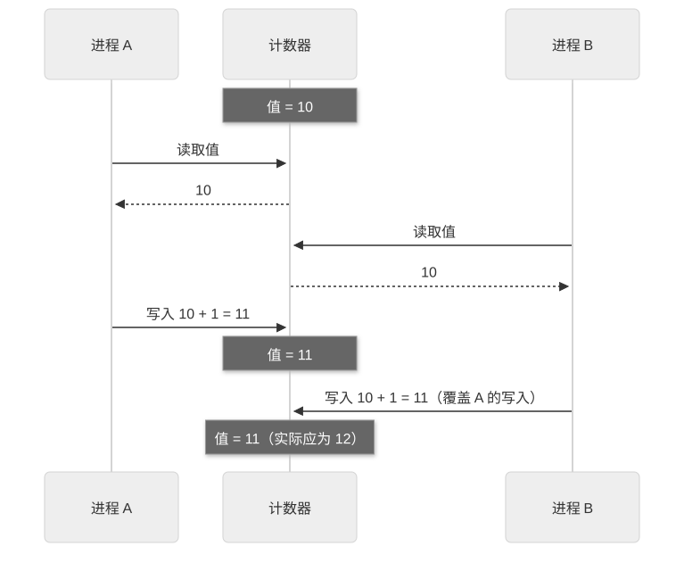
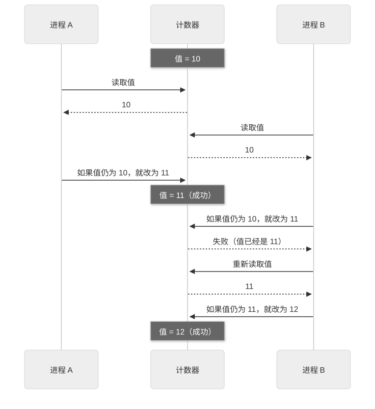

# 第 18 章：Architecture，设计边界与依赖的六条原则

[目录](README.md) · [上一篇](22-chapter.md) · [下一篇](24-chapter.md) · [English](../en/23-chapter.md)

作者：kaito · [日文原文](https://zenn.dev/sc30gsw/books/080faba713547b/viewer/cdc49b) · [作者英文版](https://zenn.dev/sc30gsw/books/7ff701b9811d04/viewer/e529e4)

来源快照：2026-10-03。中文为 AI 辅助译稿，尚未完成人工终审；正文中的“我”指原作者。

[Authorization / 授权记录](../AUTHORIZATION.md)

<!-- book-body:start -->
本章介绍以下六条 Principle。

1. [Model the Domain](https://github.com/cursor/plugins/blob/main/pstack/skills/principle-model-the-domain/SKILL.md)
2. [Boundary Discipline](https://github.com/cursor/plugins/blob/main/pstack/skills/principle-boundary-discipline/SKILL.md)
3. [Type System Discipline](https://github.com/cursor/plugins/blob/main/pstack/skills/principle-type-system-discipline/SKILL.md)
4. [Make Operations Idempotent](https://github.com/cursor/plugins/blob/main/pstack/skills/principle-make-operations-idempotent/SKILL.md)
5. [Migrate Callers Then Delete Legacy APIs](https://github.com/cursor/plugins/blob/main/pstack/skills/principle-migrate-callers-then-delete-legacy-apis/SKILL.md)
6. [Separate Before Serializing Shared State](https://github.com/cursor/plugins/blob/main/pstack/skills/principle-separate-before-serializing-shared-state/SKILL.md)

这六条属于 Architecture（架构）组，决定<strong>Agent 应如何组织代码的形态（例如如何保存状态、在哪里验证）</strong>。随附指南的 [`docs/guide/08-principles.md`](https://github.com/cursor/plugins/blob/main/pstack/docs/guide/08-principles.md) 将它们概括为决定「状态、验证和兼容性应放在哪里」的原则。

应用这六条 Principle，Agent 会采取以下做法。

- 用状态机保存状态，而非组合多个布尔值
- 将外部数据的验证集中在边界
- 将所有调用方迁到新 API 后，在同一改动中删除旧 API

<aside class="msg message"><span class="msg-symbol">!</span><div class="msg-content">
<ul class="code-line" data-line="18">
<li class="code-line" data-line="18">
<strong>状态机</strong>……预先规定可能的状态及状态之间如何转移的写法。在任一时刻，只能处于某个既定状态。<br/>
例如，交通信号灯一次只显示绿、黄、红其中一种颜色，并按绿→黄→红的顺序变化。它不会「绿灯和红灯同时亮」，也不会「从绿灯直接跳到红灯」。状态机用代码表达这样的规则。</li>
<li class="code-line" data-line="20">
<strong>边界</strong>……表单输入或 API 响应等外部数据进入的位置。</li>
</ul>
</div></aside>

本章与[第 17 章](https://zenn.dev/sc30gsw/books/080faba713547b/viewer/a8e80b)一样，逐条从规则和触发条件介绍六条 Principle，最后从「让结构本身成为给 Agent 的说明书」这一角度加以总结。

本章的请求示例也与[第 17 章](https://zenn.dev/sc30gsw/books/080faba713547b/viewer/a8e80b)一样，写成包含 Principle 名称的单行指令。即使不写名称，只要工作符合触发条件，Agent 就会自行阅读并应用 Principle；这一点已在[第 17 章](https://zenn.dev/sc30gsw/books/080faba713547b/viewer/a8e80b)的前提中说明。

<aside class="msg message"><span class="msg-symbol">!</span><div class="msg-content">
<p class="code-line" data-line="28">六条 Principle 中，本章只给「Separate Before Serializing Shared State」提供请求示例。</p>
<p class="code-line" data-line="30">本书只收录 pstack 随附指南或 <a href="https://github.com/cursor/plugins/blob/main/pstack/README.md" rel="nofollow noopener noreferrer" target="_blank">README</a> 中已有的请求示例。若为原文没有示例的 Principle 自行编写示例，可能展示 pstack 并未预期的用法。</p>
</div></aside>

<a id="%E3%81%93%E3%81%AE%E7%AB%A0%E3%81%AE%E6%A7%8B%E6%88%90"></a>


## 本章结构

本章结构如下。

- 六条 Principle 一览
- 「Model the Domain」：用结构而非条件分支表达领域
- 「Boundary Discipline」：将输入验证集中在外部边界，在内部信任类型
- 「Type System Discipline」：利用类型防止构造无效状态
- 「Make Operations Idempotent」：让操作无论运行多少次都得到相同结果
- 「Migrate Callers Then Delete Legacy APIs」：迁移所有调用方，在同一改动中删除旧 API
- 「Separate Before Serializing Shared State」：先消除共享写入，锁是最后手段
- Architecture 组的六条 Principle：让结构本身成为给 Agent 的说明书
- 总结

<a id="6%E5%8E%9F%E5%89%87%E3%81%AE%E4%B8%80%E8%A6%A7"></a>


## 六条 Principle 一览

<table class="code-line" data-line="49">
<thead class="code-line" data-line="49">
<tr class="code-line" data-line="49">
<th>Principle</th>
<th>一句话结论</th>
</tr>
</thead>
<tbody class="code-line" data-line="51">
<tr class="code-line" data-line="51">
<td>「<strong>Model the Domain</strong>」</td>
<td>用结构而非散落的条件分支表达领域</td>
</tr>
<tr class="code-line" data-line="52">
<td>「<strong>Boundary Discipline</strong>」</td>
<td>将验证与错误处理集中在外部数据进入的边界；边界内部的代码信任类型</td>
</tr>
<tr class="code-line" data-line="53">
<td>「<strong>Type System Discipline</strong>」</td>
<td>利用类型检查，在编译阶段阻止构造不可能的状态</td>
</tr>
<tr class="code-line" data-line="54">
<td>「<strong>Make Operations Idempotent</strong>」</td>
<td>让改变状态的操作无论运行多少次，或从中途重新执行，最终都到达相同状态</td>
</tr>
<tr class="code-line" data-line="55">
<td>「<strong>Migrate Callers Then Delete Legacy APIs</strong>」</td>
<td>迁移调用方至新 API，并在同一改动中删除旧 API</td>
</tr>
<tr class="code-line" data-line="56">
<td>「<strong>Separate Before Serializing Shared State</strong>」</td>
<td>先消除共享写入；只有确实必要时才用锁让写入排队</td>
</tr>
</tbody>
</table>

<a id="%E3%80%8Emodel-the-domain%E3%80%8F%E3%81%AF%E3%80%81%E3%83%89%E3%83%A1%E3%82%A4%E3%83%B3%E3%82%92%E6%9D%A1%E4%BB%B6%E5%88%86%E5%B2%90%E3%81%A7%E3%81%AF%E3%81%AA%E3%81%8F%E6%A7%8B%E9%80%A0%E3%81%A7%E8%A1%A8%E3%81%99"></a>


## 「Model the Domain」用结构而非条件分支表达领域

「<strong>Model the Domain</strong>」要求用数据结构表达实际业务领域，而不是把领域规则分散写在各处的条件分支中。  
当状态或分支可能增多时，Agent 应<strong>先选择表达领域的结构，再添加条件分支（if/else）</strong>。

<aside class="msg message"><span class="msg-symbol">!</span><div class="msg-content">
<ul class="code-line" data-line="64">
<li class="code-line" data-line="64">
<strong>领域</strong>……软件处理的业务或对象（例如网店的订单、库存、配送）。</li>
<li class="code-line" data-line="65">
<strong>数据结构</strong>……数据包含哪些字段，以及各字段取什么类型的值（如下例中的 <code>Order</code> 和 <code>OrderFlags</code>）。</li>
<li class="code-line" data-line="66">
<strong>表达领域的结构</strong>……与真实业务规则具有相同形态的数据结构。</li>
</ul>
<p class="code-line" data-line="68">例如，真实订单只会处于「待付款」「待发货」「已发货」「已取消」四种状态之一。</p>
<p class="code-line" data-line="70">上述订单数据可用以下两种结构表达。</p>
<div class="code-block-container"><pre class="shiki github-dark" style="background-color:#151e2c;color:#e1e4e8"><code class="code-line" data-line="72"><span class="line"><span style="color:#a0aab5">// 表达领域的结构：状态只能取 status 的四种值之一</span></span>
<span class="line"><span style="color:#F97583">type</span><span style="color:#B392F0"> Order</span><span style="color:#F97583"> =</span><span style="color:#E1E4E8"> {</span></span>
<span class="line"><span style="color:#FFAB70">  address</span><span style="color:#F97583">:</span><span style="color:#79B8FF"> string</span><span style="color:#E1E4E8">;</span></span>
<span class="line"><span style="color:#FFAB70">  status</span><span style="color:#F97583">:</span><span style="color:#9ECBFF"> "unpaid"</span><span style="color:#F97583"> |</span><span style="color:#9ECBFF"> "paid"</span><span style="color:#F97583"> |</span><span style="color:#9ECBFF"> "shipped"</span><span style="color:#F97583"> |</span><span style="color:#9ECBFF"> "canceled"</span><span style="color:#E1E4E8">;</span></span>
<span class="line"><span style="color:#E1E4E8">};</span></span>
<span class="line"></span>
<span class="line"><span style="color:#a0aab5">// 未表达领域的结构：用三个布尔值保存状态</span></span>
<span class="line"><span style="color:#a0aab5">// 甚至能出现 isShipped: true 与 isCanceled: true 这样现实中不存在的组合</span></span>
<span class="line"><span style="color:#F97583">type</span><span style="color:#B392F0"> OrderFlags</span><span style="color:#F97583"> =</span><span style="color:#E1E4E8"> {</span></span>
<span class="line"><span style="color:#FFAB70">  address</span><span style="color:#F97583">:</span><span style="color:#79B8FF"> string</span><span style="color:#E1E4E8">;</span></span>
<span class="line"><span style="color:#FFAB70">  isPaid</span><span style="color:#F97583">:</span><span style="color:#79B8FF"> boolean</span><span style="color:#E1E4E8">;</span></span>
<span class="line"><span style="color:#FFAB70">  isShipped</span><span style="color:#F97583">:</span><span style="color:#79B8FF"> boolean</span><span style="color:#E1E4E8">;</span></span>
<span class="line"><span style="color:#FFAB70">  isCanceled</span><span style="color:#F97583">:</span><span style="color:#79B8FF"> boolean</span><span style="color:#E1E4E8">;</span></span>
<span class="line"><span style="color:#E1E4E8">};</span></span>
<span class="line"></span></code></pre></div>
<p class="code-line" data-line="89">两者都规定了订单包含的字段，以及各字段可取的值，因此都属于数据结构。<br/>
但只有 <code>Order</code> 与真实订单规则具有相同形态，才是表达领域的结构。</p>
</div></aside>

<a id="%E6%95%A3%E3%82%89%E3%81%B0%E3%81%A3%E3%81%9F%E7%9C%9F%E5%81%BD%E5%80%A4%E3%80%81%E7%B9%B0%E3%82%8A%E8%BF%94%E3%81%95%E3%82%8C%E3%82%8B%E5%89%8D%E6%8F%90%E3%80%81%E5%BA%83%E3%81%8C%E3%82%8B%E5%88%86%E5%B2%90%E3%81%AF%E3%80%81%E4%B8%8D%E8%A6%81%E3%81%AA%E8%A4%87%E9%9B%91%E3%81%95%E3%81%A7%E3%81%82%E3%82%8B"></a>


### 散落的布尔值、重复前提和蔓延的分支，都是不必要的复杂性

这条 Principle 将以下三种情况视为本可避免的复杂性。

- 散落的布尔值
- 在各文件重复的「这些数据应该具有这种形态」的前提
- 跨文件蔓延的分支

<a id="3%E3%81%A4%E3%81%AE%E8%A4%87%E9%9B%91%E3%81%95%E3%82%92%E5%90%AB%E3%82%80%E3%82%B3%E3%83%BC%E3%83%89%E3%81%A7%E3%81%AF%E3%80%81%E3%81%82%E3%82%8A%E3%81%88%E3%81%AA%E3%81%84%E7%8A%B6%E6%85%8B%E3%81%8C%E6%9B%B8%E3%81%91%E3%81%A6%E3%81%97%E3%81%BE%E3%81%86"></a>


### 包含上述三种复杂性的代码会允许写出不可能的状态

例如，网店订单同时在生成配送标签和编写通知邮件的两个文件中使用。

包含上述三种复杂性的代码如下。

```
// order.ts：用三个布尔值保存订单状态（分散的布尔值）
type Order = {
  address: string;
  isPaid: boolean;
  isShipped: boolean;
  isCanceled: boolean;
  trackingNo?: string;
};

// label.ts：生成发货标签
function labelText(order: any): string {
  // 在这里验证「订单应当有地址」这一前提
  if (!order.address) throw new Error("住所がありません");
  // 按状态分支
  if (order.isCanceled) return "キャンセル済み";
  if (order.isShipped) return "発送済み";
  if (order.isPaid) return "発送待ち";
  return "支払い待ち";
}

// mail.ts：生成通知邮件的主题
function mailSubject(order: any): string {
  // 在另一个文件中再次验证相同前提
  if (!order.address) throw new Error("住所がありません");
  // 同样的分支逻辑在多个文件中重复
  if (order.isCanceled) return "ご注文をキャンセルしました";
  if (order.isShipped) return "商品を発送しました";
  if (order.isPaid) return "お支払いを確認しました";
  return "お支払いをお待ちしています";
}
```

<!-- book-code-note:start -->
> **Oh My Stack 项目注（代码示例）**：示例中的日文字符串是程序输出：地址缺失时抛出「没有地址」；发货标签依次使用「已取消」「已发货」「待发货」「待付款」；邮件主题依次表达「订单已取消」「商品已发货」「已确认付款」「等待付款」。这些原值会影响示例的输出。
<!-- book-code-note:end -->


这段代码允许 `isShipped` 和 `isCanceled` 同时为 `true`。  
这是<strong>不可能的状态</strong>：真实订单不可能同时「已发货」和「已取消」。  
它还允许 `isShipped` 为 `true`，却没有 `trackingNo`（物流追踪编号）。

<a id="%E3%83%89%E3%83%A1%E3%82%A4%E3%83%B3%E3%82%92%E8%A1%A8%E3%81%99%E6%A7%8B%E9%80%A0%E3%82%92%E9%81%B8%E3%81%B6%E3%81%A8%E3%80%81%E3%81%82%E3%82%8A%E3%81%88%E3%81%AA%E3%81%84%E7%8A%B6%E6%85%8B%E3%81%8C%E6%9B%B8%E3%81%91%E3%81%AA%E3%81%8F%E3%81%AA%E3%82%8A%E3%80%81%E5%88%86%E5%B2%90%E3%82%82%E6%B8%9B%E3%82%8B"></a>


### 选择表达领域的结构，可避免不可能的状态并减少分支

Agent 选择表达领域的结构后，<strong>不可能的状态根本无法写出，条件分支也会减少</strong>。这类结构包括状态机和字段明确的类型化对象。

用表达领域的结构改写同一订单，如下所示。

```
// order.ts：集中定义订单结构与可能的状态
type OrderStatus =
  | { state: "unpaid" }
  | { state: "paid" }
  | { state: "shipped"; trackingNo: string }
  | { state: "canceled" };

type Order = { address: string; status: OrderStatus };

// 将每种状态对应的文字集中到一张表中
const LABEL_TEXT: Record<OrderStatus["state"], string> = {
  unpaid: "支払い待ち",
  paid: "発送待ち",
  shipped: "発送済み",
  canceled: "キャンセル済み",
};

// label.ts：把各状态的文字集中到表中，信任类型并直接查表
function labelText(order: Order): string {
  return LABEL_TEXT[order.status.state];
}

// mail.ts：把各状态的邮件主题集中到表中，信任类型并直接查表
const MAIL_SUBJECT: Record<OrderStatus["state"], string> = {
  unpaid: "お支払いをお待ちしています",
  paid: "お支払いを確認しました",
  shipped: "商品を発送しました",
  canceled: "ご注文をキャンセルしました",
};

function mailSubject(order: Order): string {
  return MAIL_SUBJECT[order.status.state];
}
```

<!-- book-code-note:start -->
> **Oh My Stack 项目注（代码示例）**：状态映射和邮件主题中的日文是实际输出值：未付款、已付款、已发货、已取消对应的标签分别是「待付款」「待发货」「已发货」「已取消」；邮件主题分别表示「等待付款」「已确认付款」「商品已发货」「订单已取消」。
<!-- book-code-note:end -->


在这段代码中，三种复杂性分别被消除。

- <strong>散落的布尔值</strong>……以 `OrderStatus` 四种状态之一代替三个布尔值。「已发货且已取消」无法表示。只有 `shipped` 状态包含追踪编号，而且进入 `shipped` 状态就必须有该编号。
- <strong>重复的前提</strong>……「订单有地址」只在 `Order` 类型中定义一次。各文件信任类型，无须重复检查地址。
- <strong>跨文件分支</strong>……状态对应的文本由查表决定。添加新状态时，只需为表增加一行；遗漏时会在编译阶段报错。

<a id="%E6%A7%8B%E9%80%A0%E3%81%AF%E3%80%81%E5%BE%8C%E3%81%8B%E3%82%89%E5%85%A5%E3%82%8C%E7%9B%B4%E3%81%99%E3%81%AE%E3%81%A7%E3%81%AF%E3%81%AA%E3%81%8F%E3%80%81%E3%82%B3%E3%83%BC%E3%83%89%E3%82%92%E6%9B%B8%E3%81%8F%E3%81%A8%E3%81%8D%E3%81%AB%E9%81%B8%E3%81%B6"></a>


### 结构应在编写代码时选择，而非日后补加

Agent 应<strong>在编写代码时选择结构</strong>。在这个阶段作出选择，几乎不会增加额外工作。

相反，代码若已写成条件分支，之后再补入结构，往往会被推迟。

因为重新引入结构不会改变代码行为，属于重构。  
与新功能不同，重构没有明显可见的成果，因此开发者和 Agent 都容易先加功能，把重构推后。

例如，运费规则的条件分支已散布在三个文件，再用查找表替换，也不会改变运费金额或界面显示。因此，这项替换容易被视为「不用立刻做」，而每加一项新功能，分支却继续增加。

<a id="%E3%83%AB%E3%83%BC%E3%83%AB%EF%BC%9A%E6%95%A3%E3%82%89%E3%81%B0%E3%81%A3%E3%81%9F%E6%9B%B8%E3%81%8D%E6%96%B9%E3%81%94%E3%81%A8%E3%81%AB%E3%80%81%E4%BB%A3%E3%82%8F%E3%82%8A%E3%81%AE%E6%A7%8B%E9%80%A0%E3%81%8C%E6%B1%BA%E3%81%BE%E3%81%A3%E3%81%A6%E3%81%84%E3%82%8B"></a>


### 规则：每种散乱写法都有相应的替代结构

这条 Principle 列举了以下典型替换方式。

<table class="code-line" data-line="207">
<thead class="code-line" data-line="207">
<tr class="code-line" data-line="207">
<th>散乱的写法</th>
<th>替代结构</th>
</tr>
</thead>
<tbody class="code-line" data-line="209">
<tr class="code-line" data-line="209">
<td>表达状态的布尔值（如 <code>isLoading</code>、<code>isError</code>），以及「现在处于哪个阶段」的检查，散落在代码各处</td>
<td>状态机（规定可能状态及状态如何转移的表达方式）</td>
</tr>
<tr class="code-line" data-line="210">
<td>给函数传递分散的参数，「这些数据应该有这个字段」的同一前提在各处重复</td>
<td>字段明确的类型化对象（如 <code>User</code> 类型）</td>
</tr>
<tr class="code-line" data-line="211">
<td>按类型分流处理的同一条件分支，散布在多个文件中</td>
<td>映射或查找表（以类型为键查找对应值或处理方式），或 discriminated union（可用表示类型的字段区分的联合类型）</td>
</tr>
<tr class="code-line" data-line="212">
<td>在各个使用位置直接修改状态</td>
<td>reducer（根据当前状态与操作计算下一状态的函数）</td>
</tr>
</tbody>
</table>

下面通过示例和代码逐一说明表中各行。

<a id="%E7%9C%9F%E5%81%BD%E5%80%A4%E3%81%AE%E4%BB%A3%E3%82%8F%E3%82%8A%E3%81%AB%E3%80%81%E7%8A%B6%E6%85%8B%E6%A9%9F%E6%A2%B0%E3%82%92%E4%BD%BF%E3%81%86"></a>


#### 用状态机代替布尔值

用布尔值保存状态时，`running`（运行中）与 `failed`（失败）同时为 `true` 这样的矛盾状态，也能写出来而不产生编译错误。  
改用状态机后，<strong>这种组合根本无法表示</strong>。

```
// 修改前：可以表示相互矛盾的状态组合
type ExportJobFlags = { running: boolean; failed: boolean; retrying: boolean };

// 修改后：每种状态可携带的数据由类型决定
type ExportJob =
  | { state: "queued" }
  | { state: "running"; attempt: number }
  | { state: "failed"; attempt: number; error: string }
  | { state: "done"; rowCount: number };

// 同时定义状态转换：只有失败的任务才能作为下一次尝试回到 running 状态
function retry(job: ExportJob): ExportJob {
  if (job.state !== "failed") return job;
  return { state: "running", attempt: job.attempt + 1 };
}
```

<a id="%E3%81%B0%E3%82%89%E3%81%B0%E3%82%89%E3%81%AE%E5%BC%95%E6%95%B0%E3%81%AE%E4%BB%A3%E3%82%8F%E3%82%8A%E3%81%AB%E3%80%81%E5%9E%8B%E4%BB%98%E3%81%8D%E3%81%AE%E3%82%AA%E3%83%96%E3%82%B8%E3%82%A7%E3%82%AF%E3%83%88%E3%82%92%E4%BD%BF%E3%81%86"></a>


#### 用类型化对象代替分散的参数

例如，给发送欢迎邮件的函数和创建发票的函数分别传递会员姓名、邮箱、套餐等分散参数，两者就都在参数排列中重复了「会员应有姓名、邮箱、套餐」这个前提。

Agent 应创建一个表示会员的 `User` 类型，让两个函数都接收 `User`。  
这样，增加会员字段时只需修改 `User` 类型；也不会误把姓名和邮箱以相反顺序传入。

```
// 修改前：两个函数各自列出相同的三个参数
function sendWelcomeMail(name: string, email: string, plan: string) { /* ... */ }
function createInvoice(name: string, email: string, plan: string) { /* ... */ }
```

```
// 修改后：只定义一次 User 类型，两个函数都接收它
type User = { name: string; email: string; plan: "free" | "paid" };

function sendWelcomeMail(user: User) { /* ... */ }
function createInvoice(user: User) { /* ... */ }
```

<a id="%E5%BA%83%E3%81%8C%E3%81%A3%E3%81%9F%E6%9D%A1%E4%BB%B6%E5%88%86%E5%B2%90%E3%81%AE%E4%BB%A3%E3%82%8F%E3%82%8A%E3%81%AB%E3%80%81%E5%8F%82%E7%85%A7%E8%A1%A8%E3%82%84-discriminated-union-%E3%82%92%E4%BD%BF%E3%81%86"></a>


#### 用查找表或 discriminated union 代替蔓延的条件分支

例如，显示页面、账单和邮件三个文件分别用条件分支决定各类订单的运费。Agent 应创建一张「按订单类型查运费」的表，让三个文件共用。

这样，新增订单类型时，无须分别修改三个文件的条件分支，只需在表中增加一行。

```
type OrderKind = "standard" | "express" | "pickup";
declare const order: { kind: OrderKind };

// 修改前：页面、计费和邮件三个文件中都有相同的 if/else
function shippingFee(kind: OrderKind): number {
  if (kind === "standard") return 500;
  if (kind === "express") return 1200;
  return 0;
}

// 修改后：只建立一张按类别查运费的表，三个文件都查询它
const SHIPPING_FEES: Record<OrderKind, number> = {
  standard: 500,
  express: 1200,
  pickup: 0,
};

const fee = SHIPPING_FEES[order.kind];
```

写成 `Record<OrderKind, number>` 后，如果在类型 `OrderKind` 中增加订单类型，却忘记在表 `SHIPPING_FEES` 中加一行，编译阶段就会报错。

当每个类型对应一个确定的「值」时，查找表很合适。

如果不同类型<strong>拥有的数据本身不同</strong>，Agent 应使用 <strong>discriminated union</strong>。

例如，支付方式有「银行卡」「银行转账」「货到付款」三类：只有银行卡支付包含卡号后四位，只有银行转账包含收款账户编号。

若用表示类型的字段及可选字段（optional 类型）编写，仍能表示「银行卡支付却含有银行账户编号」这样的无效值。  
使用 discriminated union 后，`kind` 的值决定允许哪些字段，因此无法写出这类值。

```
// 修改前：任何支付方式都可以包含全部字段
type PaymentLoose = { method: "card" | "bank" | "cod"; cardLast4?: string; bankAccount?: string };

// 修改后：kind 的值决定可以包含哪些字段
type Payment =
  | { kind: "card"; cardLast4: string }
  | { kind: "bank"; bankAccount: string }
  | { kind: "cod" };

function paymentLabel(p: Payment): string {
  switch (p.kind) {
    case "card":
      return `カード（末尾 ${p.cardLast4}）`;
    case "bank":
      return `銀行振込（口座 ${p.bankAccount}）`;
    case "cod":
      return "代金引換";
  }
}
```

<!-- book-code-note:start -->
> **Oh My Stack 项目注（代码示例）**：三种支付方式的原始输出依次是「卡片（末尾四位数字）」「银行转账（账户号码）」和「货到付款」。这些日文显示值会影响示例输出，因此保留。
<!-- book-code-note:end -->


<a id="%E3%81%9D%E3%81%AE%E5%A0%B4%E3%81%AE%E6%9B%B8%E3%81%8D%E6%8F%9B%E3%81%88%E3%81%AE%E4%BB%A3%E3%82%8F%E3%82%8A%E3%81%AB%E3%80%81reducer-%E3%82%92%E4%BD%BF%E3%81%86"></a>


#### 用 reducer 代替到处直接修改

例如，商品列表、商品详情和购物车三个页面都直接修改购物车内容，适合使用 <strong>reducer</strong>。  
此时，想知道购物车内容在哪里、怎样发生变化，就必须阅读全部三个位置。

Agent 应将购物车操作（添加、删除）定义为类型，创建一个「由当前购物车和操作计算下一购物车」的 reducer。三个页面不再直接修改购物车，而是把操作交给 reducer。  
这样，<strong>只看 reducer 就能知道购物车内容如何变化</strong>。

```
type CartItem = { id: string; price: number };
type Cart = { items: CartItem[] };
declare let cart: Cart;
declare const item: CartItem;
declare const id: string;

// 修改前：三个页面分别直接修改购物车
cart.items.push(item);
cart.items = cart.items.filter((i) => i.id !== id);

// 修改后：用类型定义操作，下一步购物车状态只在 reducer 中计算
type CartAction =
  | { type: "add"; item: CartItem }
  | { type: "remove"; id: string };

function cartReducer(cart: Cart, action: CartAction): Cart {
  switch (action.type) {
    case "add":
      return { items: [...cart.items, action.item] };
    case "remove":
      return { items: cart.items.filter((i) => i.id !== action.id) };
  }
}

cart = cartReducer(cart, { type: "add", item });
```

<a id="%E7%84%A1%E7%90%86%E3%81%AB%E6%A7%8B%E9%80%A0%E3%82%92%E5%85%A5%E3%82%8C%E3%81%AA%E3%81%84"></a>


#### 不强行引入结构

不过，这条 Principle 并不要求强行引入结构。如果现有代码清楚、集中在一处，且预计不会扩展，Agent 就应保留简单写法。

Agent 还应<strong>质疑只在调用之间插入一层、却没有减少任何复杂性的共用函数或类型</strong>。如果它们既没有减少分支，也没有减少重复规则或无效状态，只会增加读者需要打开查看的位置。

<a id="%E7%99%BA%E7%81%AB%E6%9D%A1%E4%BB%B6"></a>


### 触发条件

- 编写有状态的逻辑时
- 分支很多时
- 「这些数据有这个字段」的同一前提在多个文件重复时

出现以下情况，说明可能跳过了这条 Principle。

- Agent 为新功能在现有的一串条件分支上再添一个分支
- Agent 增加第二个布尔值，它必须始终与现有布尔值保持一致

例如，已有 `isLoading` 表示加载中，又增加 `isError` 表示错误。加载失败时，代码必须将 `isError` 设为 `true`，同时将 `isLoading` 恢复为 `false`。

如果忘记恢复 `isLoading`，`isLoading: true` 与 `isError: true` 就会同时成立，界面出现「既在加载又已报错」的矛盾状态。

这样，增加第二个布尔值后，每次修改其中一个，都需要同步维护另一个。

`/poteto-mode` 的「[Non-negotiables](https://github.com/cursor/plugins/blob/main/pstack/skills/poteto-mode/SKILL.md#non-negotiables)」也要求遵守这条 Principle（见[第 8 章](https://zenn.dev/sc30gsw/books/080faba713547b/viewer/096f3d)）。

「Non-negotiables」要求 Agent 在编写任何代码时，先明确数据形态，再依这条 Principle 选择结构。<strong>23 条 Principle 中，只有「Model the Domain」被「Non-negotiables」明确点名</strong>。

<a id="%E3%80%8Eboundary-discipline%E3%80%8F%E3%81%AF%E3%80%81%E5%85%A5%E5%8A%9B%E3%81%AE%E6%A4%9C%E8%A8%BC%E3%82%92%E5%A4%96%E3%81%A8%E3%81%AE%E5%A2%83%E7%95%8C%E3%81%AB%E9%9B%86%E3%82%81%E3%80%81%E5%86%85%E5%81%B4%E3%81%AF%E5%9E%8B%E3%82%92%E4%BF%A1%E3%81%98%E3%82%8B"></a>


## 「Boundary Discipline」将输入验证集中在外部边界，在内部信任类型

「<strong>Boundary Discipline</strong>」要求<strong>在系统边界进行输入验证、类型收窄和错误处理</strong>。它列举的边界包括 CLI 参数、配置文件、外部 API 和经网络传入的数据。

在边界验证过的值带有类型，因此边界内部的代码应信任它符合类型，无须重复相同检查。

将检查集中于边界，是因为检查散落在代码各处会带来以下两个问题。

- 同一检查要在多处重复编写
- 开发者和 Agent 以为「某处应该已经检查过了」；若不了解各项检查究竟在哪里进行，就可能漏掉完全没有验证的路径

下面的代码展示了检查分散在各处的情况：来自订单表单的「数量」是否至少为一，只有部分函数会验证。

```
let stock = 10; // 库存数量

// 计算价格：检查数量是否至少为 1
function calcPrice(quantity: number): number {
  if (quantity < 1) throw new Error("数量は1以上にしてください");
  return quantity * 500;
}

// 减少库存：假定「其他地方已经验证过」，此处不做检查
function reserveStock(quantity: number) {
  stock = stock - quantity;
}

// 订单页面：先调用 calcPrice，验证后再减少库存
calcPrice(2);
reserveStock(2);

// 另一个页面：直接调用 reserveStock
reserveStock(-3); // 库存从 8 意外增加到 11
```

<!-- book-code-note:start -->
> **Oh My Stack 项目注（代码示例）**：异常消息要求数量至少为 1；原文作为抛出的错误内容保留。
<!-- book-code-note:end -->


订单页面的路径通过 `calcPrice` 进行了检查，但只调用 `reserveStock` 的路径完全没有检查。  
因此，`-3` 直接传入，本应减少库存的处理反而增加了库存。

按这条 Principle 改写相同处理，结果如下。

```
let stock = 10; // 库存数量

// 边界：在这里对表单传来的值只验证一次
function parseQuantity(input: string): number {
  const quantity = Number(input);
  if (!Number.isInteger(quantity) || quantity < 1) {
    throw new Error("数量は1以上の整数にしてください");
  }
  return quantity;
}

// 内部：只会收到已验证的值，因此不重复验证
function calcPrice(quantity: number): number {
  return quantity * 500;
}

function reserveStock(quantity: number) {
  stock = stock - quantity;
}

// 所有页面都先让表单值经过 parseQuantity，再使用它
const quantity = parseQuantity("-3"); // 这里会报错，执行不会继续
calcPrice(quantity);
reserveStock(quantity);
```

<!-- book-code-note:start -->
> **Oh My Stack 项目注（代码示例）**：异常消息要求数量是至少为 1 的整数；原文作为抛出的错误内容保留。
<!-- book-code-note:end -->


现在只有 `parseQuantity` 一处负责检查，`calcPrice` 内的检查也不再需要。  
所有页面都会先让表单值经过 `parseQuantity`，因此 `-3` 等值不会传到 `calcPrice` 或 `reserveStock`。

这条 Principle 还要求将业务逻辑写成纯函数，让 shell 成为只调用纯函数的轻薄外层（详见[「提取由 shell 调用的纯函数」](#%E3%82%B7%E3%82%A7%E3%83%AB%E3%81%8C%E5%91%BC%E3%81%B6%E3%81%A0%E3%81%91%E3%81%AE%E7%B4%94%E7%B2%8B%E9%96%A2%E6%95%B0%E3%81%AB%E5%88%87%E3%82%8A%E5%87%BA%E3%81%99)）。逻辑脱离框架后，<strong>无需运行框架即可单独测试逻辑</strong>。

<a id="%E3%83%AB%E3%83%BC%E3%83%AB%EF%BC%9A%E5%A4%96%E3%81%8B%E3%82%89%E5%85%A5%E3%82%8B%E3%83%87%E3%83%BC%E3%82%BF%E3%82%92%E5%A2%83%E7%95%8C%E3%81%A7%E6%A4%9C%E8%A8%BC%E3%81%99%E3%82%8B"></a>


### 规则：在边界验证外部数据

Agent 用以下两个问题判断应在哪里进行验证。

<a id="%E5%A4%96%E3%81%8B%E3%82%89%E5%85%A5%E3%81%A3%E3%81%A6%E3%81%8D%E3%81%9F%E3%83%87%E3%83%BC%E3%82%BF%E3%81%A0%E3%81%91%E3%82%92%E7%A2%BA%E3%81%8B%E3%82%81%E3%82%8B"></a>


#### 只验证刚从外部进入的数据

第一个问题是：「这些数据此刻是否正在跨越系统边界（刚从外部进入）？」  
<strong>如果没有跨越边界，再检查就是多余的</strong>。边界代码把验证后的值转换为带类型的值，传入内部函数；内部函数信任该类型。

例如，读取配置文件的函数在读取时已验证 `batchSize` 为正数，使用它的内部函数就无须再检查 `batchSize > 0`。只需在边界验证一次，所有内部函数便可放心使用。

```
type Config = { batchSize: number };

// 边界：读取配置文件时只验证一次，并转成 Config 类型的值
function parseConfig(raw: { batchSize?: unknown }): Config {
  if (typeof raw.batchSize !== "number" || raw.batchSize <= 0) {
    throw new Error("batchSize は正の数にしてください");
  }
  return { batchSize: raw.batchSize };
}

// 内部：信任 Config 类型，不再重复检查 batchSize > 0
function splitIntoBatches(items: string[], config: Config): string[][] {
  const batches: string[][] = [];
  for (let i = 0; i < items.length; i += config.batchSize) {
    batches.push(items.slice(i, i + config.batchSize));
  }
  return batches;
}
```

<!-- book-code-note:start -->
> **Oh My Stack 项目注（代码示例）**：异常消息要求 batchSize 为正数；原文作为抛出的错误内容保留。
<!-- book-code-note:end -->


<a id="%E3%82%B7%E3%82%A7%E3%83%AB%E3%81%8C%E5%91%BC%E3%81%B6%E3%81%A0%E3%81%91%E3%81%AE%E7%B4%94%E7%B2%8B%E9%96%A2%E6%95%B0%E3%81%AB%E5%88%87%E3%82%8A%E5%87%BA%E3%81%99"></a>


#### 提取由 shell 调用的纯函数

第二个问题是：「这段处理能否提取为纯函数，让 shell 仅负责调用？」  
如果可以，Agent 就应将其提取为纯函数。

<aside class="msg message"><span class="msg-symbol">!</span><div class="msg-content">
<ul class="code-line" data-line="493">
<li class="code-line" data-line="493">
<strong>纯函数</strong>……相同参数始终返回相同结果，且不读写界面或文件等程序外部对象的函数。</li>
<li class="code-line" data-line="494">
<strong>shell</strong>……负责与界面、文件、网络、框架等外部对象交互的部分：从外部取值，交给纯函数，再将结果输出到外部。</li>
</ul>
</div></aside>

例如，Agent 不应把订单总额计算直接写在按钮点击处理函数内，而应提取为 `calcTotal(items)`，点击处理函数只负责调用它。这样，无须运行界面即可测试金额计算。

另一方面，shell 中没有计算逻辑，出错的余地很小。

```
type Item = { price: number; quantity: number };
declare const button: HTMLButtonElement;
declare const totalLabel: HTMLElement;
declare function readItemsFromCart(): Item[];

// 纯函数：相同的 items 总返回相同的总价，不访问页面
function calcTotal(items: Item[]): number {
  return items.reduce((sum, item) => sum + item.price * item.quantity, 0);
}

// 外壳：只从页面读取值、调用纯函数，并把结果写回页面
button.addEventListener("click", () => {
  const items = readItemsFromCart(); // 从页面读取
  const total = calcTotal(items); // 把计算交给纯函数
  totalLabel.textContent = `${total}円`; // 写入页面
});
```

<!-- book-code-note:start -->
> **Oh My Stack 项目注（代码示例）**：页面文字末尾的「円」表示日元，是原示例的实际显示值。
<!-- book-code-note:end -->

<a id="%E7%99%BA%E7%81%AB%E6%9D%A1%E4%BB%B6-1"></a>


### 触发条件

加入输入验证或错误处理，或编写连接框架与自身代码的适配器时。

<a id="%E3%80%8Etype-system-discipline%E3%80%8F%E3%81%AF%E3%80%81%E5%9E%8B%E3%81%A7%E4%B8%8D%E6%AD%A3%E3%81%AA%E7%8A%B6%E6%85%8B%E3%82%92%E4%BD%9C%E3%82%8C%E3%81%AA%E3%81%8F%E3%81%99%E3%82%8B"></a>


## 「Type System Discipline」利用类型防止构造无效状态

「<strong>Type System Discipline</strong>」把类型检查器视为证明「这个值必定具有这种形态」的工具（原文称 proof assistant）。

Agent 用类型检查器让矛盾状态或遗漏的 variant 处理在<strong>编译阶段就报错，而不是运行之后才发现</strong>。如果类型系统未能发现这些遗漏，原本可由编译器阻止的错误就会留到运行时。

<aside class="msg message"><span class="msg-symbol">!</span><div class="msg-content">
<ul class="code-line" data-line="531">
<li class="code-line" data-line="531">
<strong>类型检查器</strong>……程序运行前发现类型错误的机制，例如 TypeScript 编译器。</li>
<li class="code-line" data-line="532">
<strong>variant</strong>……组成联合类型的每一种形态。例如在 <code>type Status = "success" | "error" | "pending";</code> 中，<code>success</code>、<code>error</code> 等每个值都是一个 variant。</li>
<li class="code-line" data-line="533">
<strong>联合类型</strong>……表示一个值可取若干形态之一的类型。TypeScript 的联合类型，例如 <code>type FooBar = 'foo' | 'bar'</code>，其值只能是 foo 或 bar 之一。</li>
</ul>
</div></aside>

<a id="%E3%83%AB%E3%83%BC%E3%83%AB%EF%BC%9A%E4%B8%8D%E6%AD%A3%E3%81%AA%E7%8A%B6%E6%85%8B%E3%82%92%E3%80%81%E5%9E%8B%E3%81%AE%E5%AE%9A%E7%BE%A9%E3%81%AE%E6%99%82%E7%82%B9%E3%81%A7%E6%9B%B8%E3%81%91%E3%81%AA%E3%81%8F%E3%81%99%E3%82%8B"></a>


### 规则：在定义类型时就排除无效状态

主要模式如下。

<a id="%E3%81%82%E3%82%8A%E3%81%88%E3%81%AA%E3%81%84%E7%8A%B6%E6%85%8B%E3%82%92%E6%9B%B8%E3%81%91%E3%81%AA%E3%81%8F%E3%81%99%E3%82%8B"></a>


#### 让不可能的状态无法表示

如果任务类型是 `{ completed: boolean; completedAt?: Date }`，就能写出「已经完成却没有完成时间」的无意义组合。

因此，Agent 应改用 `{ kind: "open" } | { kind: "done"; at: Date }` 这样的联合类型。这样一来，只能写出「完成时必有时间」的形态。

相比事后检查组合是否正确，<strong>从一开始就不允许表示无效组合更可靠</strong>。

<a id="%E6%84%8F%E5%91%B3%E3%81%AE%E9%81%95%E3%81%86%E5%80%A4%E3%81%AB%E5%8D%B0%E3%82%92%E4%BB%98%E3%81%91%E3%82%8B"></a>


#### 为含义不同的值加类型标记

Agent 将 `UserId` 和 `OrderId` 设为品牌类型，即使两者底层都是字符串，也不可互换使用。

<aside class="msg message"><span class="msg-symbol">!</span><div class="msg-content">
<p class="code-line" data-line="553"><strong>品牌类型</strong>……给字符串或数字等基本值（primitive）加上类型标记形成的类型，例如下方代码中的 UserId 与 OrderId。</p>
</div></aside>

例如，把订单 ID 传给应接收用户 ID 的 `getUser()`，就会在编译时出错。如果两者可互换，不同含义的值即使被混淆也能通过编译。

```
type UserId = string & { readonly __brand: "UserId" };
type OrderId = string & { readonly __brand: "OrderId" };
type User = { id: UserId; name: string };

declare function getUser(id: UserId): Promise<User>;
declare const orderId: OrderId;

// 两者内部都是字符串，但传入 OrderId 会导致编译错误
await getUser(orderId);
```

<a id="%E5%9E%8B%E3%82%B7%E3%82%B9%E3%83%86%E3%83%A0%E3%81%AB%E5%98%98%E3%82%92%E3%81%A4%E3%81%8B%E3%81%AA%E3%81%84"></a>


#### 不对类型系统说谎

Agent 不应靠 cast 或 assertion 绕过类型检查；绕过的位置仍有运行时出错的风险。

<aside class="msg message"><span class="msg-symbol">!</span><div class="msg-content">
<ul class="code-line" data-line="575">
<li class="code-line" data-line="575">
<strong>cast</strong>……强制把值视为另一种类型的写法，例如以 <code>value as unknown as User</code> 强制完成未经类型检查的转换。</li>
<li class="code-line" data-line="576">
<strong>assertion</strong>……向编译器断言「这个值必然属于这一类型」的写法，例如在 TypeScript 中使用 <code>as</code> 子句写成 <code>as User</code>。</li>
</ul>
</div></aside>

例如，未经验证就把 API 响应写成 `as User`，编译会通过。  
但即使实际响应缺少 `name` 字段，代码仍假定它存在，最终可能在使用 `user.name` 时于运行中出错。

编译器无法证明的事实，Agent 应通过实际检查值或用条件分支收窄类型，自行证明。

<a id="%E6%89%B1%E3%81%84%E6%BC%8F%E3%82%8C%E3%81%AE%E7%A2%BA%E8%AA%8D%E3%81%AF%E3%82%B3%E3%83%B3%E3%83%91%E3%82%A4%E3%83%A9%E3%81%AB%E4%BB%BB%E3%81%9B%E3%82%8B"></a>


#### 让编译器检查遗漏的分支

Agent 应使联合类型增加新 variant 时，未处理它的分支产生编译错误。

例如，任务类型新增「已取消」（`canceled`）时，如果决定显示文本的函数没有处理它，应让编译报错。  
这样，就无须靠人逐处查找遗漏。

```
// 已给任务类型添加 canceled
type Task = { kind: "open" } | { kind: "done" } | { kind: "canceled" };

// 修改前：未处理的类型会落到最后的 return ""，编译不会报错
function labelLoose(task: Task): string {
  if (task.kind === "open") return "未完了";
  if (task.kind === "done") return "完了";
  return ""; // canceled 类型的任务在页面上显示为空文字
}

// 修改后：漏掉任何类型都会导致编译错误
function label(task: Task): string {
  switch (task.kind) {
    case "open":
      return "未完了";
    case "done":
      return "完了";
    default: {
      // 因为没有用 case 处理 canceled，编译会在此行报错
      const unhandled: never = task;
      return unhandled;
    }
  }
}
```

<!-- book-code-note:start -->
> **Oh My Stack 项目注（代码示例）**：`open` 和 `done` 的日文显示值分别表示「未完成」与「已完成」；它们是函数实际返回的文字，因此保留原值。
<!-- book-code-note:end -->

原来的 `labelLoose` 即使忘记处理 `canceled` 也能编译通过，直到界面显示空文本，才会发现遗漏。

修改后的 `label` 中，`never` 类型表示「这里理论上不会有任何值到达」。

如果所有类型都已由 `case` 处理，就不会有值到达 `default`，编译可通过。

如果遗漏 `canceled`，该任务会进入 `default`，在赋值给 `never` 变量的位置产生编译错误。报错的位置就是应增加 `canceled` 分支的位置。

<a id="%E5%9E%8B%E3%82%92%E5%BC%B7%E3%82%81%E3%82%8B%E3%81%AE%E3%81%AF%E3%80%81%E5%BC%B1%E3%81%99%E3%81%8E%E3%82%8B%E3%81%A8%E5%88%86%E3%81%8B%E3%81%A3%E3%81%9F%E5%A0%B4%E6%89%80%E3%81%A0%E3%81%91%E3%81%AB%E3%81%99%E3%82%8B"></a>


#### 只在已证明类型太弱的位置加强类型

不过，这条 Principle 并不以把类型定义得越细越好为目标。类型的职责不是尽可能细致地描述数据，而是<strong>完整列出该类型各使用位置必须处理的情况</strong>。

因此，Agent 只在发现类型过弱的位置加强类型。判断线索包括运行时 assertion，或声称「不可能发生」并抛错的 `throw` 语句。这些位置说明类型放行了本可阻止的情况。

例如，任务一旦完成就必有时间，却仍需写 `if (!task.completedAt) throw new Error("起きるはずがない")`，说明类型允许了「已完成却无时间」的值。

<a id="%E7%99%BA%E7%81%AB%E6%9D%A1%E4%BB%B6-2"></a>


### 触发条件

- 设计类型时
- 审阅函数签名（接收参数与返回值的类型）时
- 在静态类型语言（如 TypeScript，运行前检查类型）中编写代码时

这条 Principle 提出的一个判断问题，把类型看作给下一位修改代码的 Agent 的指令。

> "If a new variant is added next month, will the compiler tell the next agent where to add a case?" If no, the match isn't exhaustive.
>
> 「下个月新增 variant 时，编译器会告诉下一位 Agent 在哪里增加分支吗？」如果不会，分支就没有覆盖所有情况。

编写覆盖所有情况的分支，编译器就会告诉下一位 Agent 应修改的位置，因此人无须再写「增加新状态时，记得改这三处」之类的文字指令。

`/typescript-best-practices` 是以 TypeScript 的具体写法体现这条 Principle 的 Skill（见[第 29 章](https://zenn.dev/sc30gsw/books/080faba713547b/viewer/4f9a46)）。

<a id="%E3%80%8Emake-operations-idempotent%E3%80%8F%E3%81%AF%E3%80%81%E6%93%8D%E4%BD%9C%E3%82%92%E4%BD%95%E5%BA%A6%E5%AE%9F%E8%A1%8C%E3%81%97%E3%81%A6%E3%82%82%E5%90%8C%E3%81%98%E7%B5%90%E6%9E%9C%E3%81%AB%E3%81%AA%E3%82%8B%E3%82%88%E3%81%86%E3%81%AB%E4%BD%9C%E3%82%8B"></a>


## 「Make Operations Idempotent」让操作无论执行多少次都到达相同状态

「<strong>Make Operations Idempotent</strong>」要求改变状态的操作，无论执行多少次，或从中途重新执行，<strong>最终都收敛到同一正确状态</strong>。

<aside class="msg message"><span class="msg-symbol">!</span><div class="msg-content">
<ul class="code-line" data-line="655">
<li class="code-line" data-line="655">
<strong>幂等（idempotent）</strong>……同一操作执行多少次，都与只执行一次得到相同结果的性质。例如，设置值为 5，无论执行多少次，结果仍是 5。</li>
</ul>
</div></aside>

这项要求源于：<strong>必须按操作可能中途停止来设计</strong>。

命令、启动和结束步骤、重复处理循环，经常会因崩溃、重启或重试而中途停止或再次执行。

如果前次执行留下的数据或文件使下一次执行结果改变，开发者每次重启都得调查「为什么这次结果不同」。

保证幂等性后，反复重新执行都得到同一结果，就不必每次重启后重新调查。

<a id="%E3%83%AB%E3%83%BC%E3%83%AB%EF%BC%9A3%E3%81%A4%E3%81%AE%E5%95%8F%E3%81%84%E3%81%A7%E5%8F%8E%E6%9D%9F%E3%82%92%E7%A2%BA%E3%81%8B%E3%82%81%E3%82%8B"></a>


### 规则：用三个问题检查是否收敛

Agent 用以下三个问题检查操作是否幂等。

1. 连续执行两次相同操作，结果会怎样？
2. 如果前次执行中途停止，下次执行会得到什么结果？（无论在开始、途中还是结束前停止，结果都相同吗？）
3. 不管重新执行多少次，最终是否到达同一状态（收敛）？

只要其中一个问题的答案是「取决于前次执行留下什么」，操作就需要<strong>调和（reconciliation）步骤</strong>。

以第二个问题为例。

假设要把 1,000 行写入输出文件，下次执行保留前次的文件，并从第一行开始追加到末尾。

如果前次写到第 400 行停止，文件中就会接上本次写入的 1,000 行。前次 400 行与本次最初 400 行内容相同，于是文件变成有重复内容的 1,400 行。如果前次一行都没写，文件则只有 1,000 行。

结果随前次执行停止的位置而变，就需要调和。

<aside class="msg message"><span class="msg-symbol">!</span><div class="msg-content">
<ul class="code-line" data-line="685">
<li class="code-line" data-line="685">
<strong>调和</strong>……检查前次执行留下的内容，无论留下什么，都将状态调整到正确状态的步骤。</li>
</ul>
<p class="code-line" data-line="687">例如，即使中途停止的执行留下只写到第 400 行的输出文件，<strong>下次执行先找到并删除该文件，再开始写入</strong>，不管前次停在哪，最终都会得到相同的 1,000 行文件。</p>
</div></aside>

<a id="%E7%99%BA%E7%81%AB%E6%9D%A1%E4%BB%B6-3"></a>


### 触发条件

设计可能中途停止或重试的命令、启动和结束步骤、重复处理循环时。

<a id="%E3%80%8Emigrate-callers-then-delete-legacy-apis%E3%80%8F%E3%81%AF%E3%80%81%E5%91%BC%E3%81%B3%E5%87%BA%E3%81%97%E5%85%83%E3%82%92%E3%81%99%E3%81%B9%E3%81%A6%E7%A7%BB%E3%81%97%E3%80%81%E3%81%9D%E3%81%AE%E5%A4%89%E6%9B%B4%E3%81%AE%E4%B8%AD%E3%81%A7%E5%8F%A4%E3%81%84api%E3%82%82%E6%B6%88%E3%81%99"></a>


## 「Migrate Callers Then Delete Legacy APIs」迁移所有调用方，并在同一改动中删除旧 API

「<strong>Migrate Callers Then Delete Legacy APIs</strong>」用于确定新内部 API 才是正确设计时。

Agent 不保留兼容层，迁移所有调用方至新 API，<strong>并在同一改动中删除旧 API</strong>。

同时保留新旧 API，会出现两套实现相同事情的调用方式，清理被推迟，代码只增不减。

<aside class="msg message"><span class="msg-symbol">!</span><div class="msg-content">
<p class="code-line" data-line="703"><strong>兼容层</strong>……为继续支持旧 API 调用方式而保留的层。</p>
</div></aside>

poteto 在[演讲](https://x.com/poteto/status/2102050467505430555)中（见[第 4 章](https://zenn.dev/sc30gsw/books/080faba713547b/viewer/dc9141)）指出，推荐的实现方式必须收敛为一种。本书把这条 Principle 理解为在 API 迁移中重新收敛至一种实现方式的步骤。

<a id="%E3%83%AB%E3%83%BC%E3%83%AB%EF%BC%9A%E5%91%BC%E3%81%B3%E5%87%BA%E3%81%97%E5%85%83%E3%82%92%E6%B4%97%E3%81%84%E5%87%BA%E3%81%97%E3%81%A6%E7%A7%BB%E3%81%97%E3%80%81%E5%8F%A4%E3%81%84api%E3%82%92%E3%81%99%E3%81%90%E6%B6%88%E3%81%99"></a>


### 规则：找齐并迁移调用方，立即删除旧 API

主要规则如下。

<a id="%E5%91%BC%E3%81%B3%E5%87%BA%E3%81%97%E5%85%83%E3%81%8C%E6%AE%8B%E3%81%A3%E3%81%A6%E3%81%84%E3%82%8B%E3%81%93%E3%81%A8%E3%82%92%E3%80%81%E5%8F%A4%E3%81%84api%E3%82%92%E6%AE%8B%E3%81%99%E7%90%86%E7%94%B1%E3%81%AB%E3%81%97%E3%81%AA%E3%81%84"></a>


#### 不以仍有调用方为由保留旧 API

Agent 应找出旧 API 的所有调用方，迁移到新 API，然后立即删除旧 API。

例如，要把 `getUser(id)` 换成 `fetchUser({ id })`，Agent 应搜索所有调用 `getUser` 的位置，改为 `fetchUser`，在同一系列改动中删除 `getUser`。

新旧调用方式并存，读者会不知该用哪一种，清理也容易被推迟。

<a id="%E4%B8%80%E6%99%82%E7%9A%84%E3%81%AA%E3%81%A4%E3%81%AA%E3%81%8E%E3%81%AE%E5%B1%A4%E3%81%AF%E4%BE%8B%E5%A4%96%E3%81%AB%E3%81%99%E3%82%8B"></a>


#### 临时过渡层应是例外

连接旧调用方式与新 API 的临时层（适配器）只能在确实必要时使用；Agent 设置它时必须确定删除期限。若习惯性地增加过渡层，代码就会只增不减。

例如，保留旧 `getUser(id)`，把函数体改成只有 `return fetchUser({ id });` 一行，就是一种适配器。

<a id="%E3%83%86%E3%82%B9%E3%83%88%E3%82%92%E6%96%B0%E3%81%97%E3%81%84api%E3%81%AB%E5%90%88%E3%82%8F%E3%81%9B%E3%82%8B"></a>


#### 调整测试以适应新 API

Agent 应将测试调整为验证新 API 承诺的行为，删除只维护旧实现内部结构的测试。

例如，应保留验证「`fetchUser({ id })` 是否返回相应 ID 的用户」的测试，删除只验证「旧 `getUser` 内部调用另一个函数多少次」的测试。

保留保护旧实现细节的测试，代码就不得不继续遵循本应删除的旧内部结构。

<a id="%E7%99%BA%E7%81%AB%E6%9D%A1%E4%BB%B6-4"></a>


### 触发条件

在旧调用方尚未全部迁移时引入新的内部 API。

<strong>有外部用户的公开 API（外部 API）不能直接应用这条 Principle</strong>，因为它依赖以下三个前提。

1. 没有外部用户在使用旧 API
2. 删除旧 API 后会失效的调用方，都能在项目内部一次性改完
3. 引入新 API 是为简化代码或重构

<a id="%E3%80%8Eseparate-before-serializing-shared-state%E3%80%8F%E3%81%AF%E3%80%81%E6%9B%B8%E3%81%8D%E8%BE%BC%E3%81%BF%E5%85%88%E3%81%AE%E5%85%B1%E6%9C%89%E3%82%92%E3%81%AA%E3%81%8F%E3%81%99%E3%81%AE%E3%81%8C%E5%85%88%E3%81%A7%E3%80%81%E3%83%AD%E3%83%83%E3%82%AF%E3%81%AF%E6%9C%80%E5%BE%8C%E3%81%AE%E6%89%8B%E6%AE%B5"></a>


## 「Separate Before Serializing Shared State」先消除共享写入，锁是最后手段

「<strong>Separate Before Serializing Shared State</strong>」适用于多个主体（如 Agent 或 Worker）可能共享同一写入目标的情境。

加入锁之前，Agent 应先判断<strong>各主体是否真的需要写入同一目标</strong>。如果不需要，就为每个主体分配独立的写入目标，消除共享。并发写入造成的竞态条件可能只偶尔出现、难以复现，因此查找原因很费时间。

<aside class="msg message"><span class="msg-symbol">!</span><div class="msg-content">
<ul class="code-line" data-line="751">
<li class="code-line" data-line="751">
<strong>Serializing（串行化）</strong>……使用锁等机制让写入逐一按顺序进行。</li>
<li class="code-line" data-line="752">
<strong>锁</strong>……保证同一时刻只有一个处理过程可以写入的机制。</li>
<li class="code-line" data-line="753">
<strong>竞态条件</strong>……多个处理过程同时读写相同数据，导致结果随执行顺序而变化的状态。</li>
</ul>
<p class="code-line" data-line="755">例如，处理过程 A 和 B 都给值为 10 的计数器加一，就会出现以下情况。</p>
<span class="embed-block zenn-embedded zenn-embedded-mermaid"><iframe data-content="sequenceDiagram%0A%20%20%20%20participant%20A%20as%20%E5%87%A6%E7%90%86A%0A%20%20%20%20participant%20C%20as%20%E3%82%AB%E3%82%A6%E3%83%B3%E3%82%BF%0A%20%20%20%20participant%20B%20as%20%E5%87%A6%E7%90%86B%0A%20%20%20%20Note%20over%20C%3A%20%E5%80%A4%20%3D%2010%0A%20%20%20%20A-%3E%3EC%3A%20%E5%80%A4%E3%82%92%E8%AA%AD%E3%82%80%0A%20%20%20%20C--%3E%3EA%3A%2010%0A%20%20%20%20B-%3E%3EC%3A%20%E5%80%A4%E3%82%92%E8%AA%AD%E3%82%80%0A%20%20%20%20C--%3E%3EB%3A%2010%0A%20%20%20%20A-%3E%3EC%3A%2010%20%2B%201%20%3D%2011%20%E3%82%92%E6%9B%B8%E3%81%8D%E8%BE%BC%E3%82%80%0A%20%20%20%20Note%20over%20C%3A%20%E5%80%A4%20%3D%2011%0A%20%20%20%20B-%3E%3EC%3A%2010%20%2B%201%20%3D%2011%20%E3%82%92%E6%9B%B8%E3%81%8D%E8%BE%BC%E3%82%80%EF%BC%88A%E3%81%AE%E6%9B%B8%E3%81%8D%E8%BE%BC%E3%81%BF%E3%82%92%E4%B8%8A%E6%9B%B8%E3%81%8D%EF%BC%89%0A%20%20%20%20Note%20over%20C%3A%20%E5%80%A4%20%3D%2011%EF%BC%88%E6%9C%AC%E5%BD%93%E3%81%AF12%EF%BC%89" frameborder="0" id="zenn-embedded__597a2b07711f9" loading="lazy" scrolling="no" src="https://embed.zenn.studio/mermaid#zenn-embedded__597a2b07711f9"></iframe></span>

<!-- book-diagram-link:start -->


[查看图示 1](../diagrams/zh-CN/23-01.md)
<!-- book-diagram-link:end --><p class="code-line" data-line="773">两个处理过程各加一，结果本应为 12；但 B 根据 A 写入前的值 10 写入 11，因此最终得到 11。</p>
</div></aside>

<a id="%E3%83%AD%E3%83%83%E3%82%AF%E3%81%AF%E5%85%B1%E6%9C%89%E3%82%92%E3%81%AA%E3%81%8F%E3%81%95%E3%81%AA%E3%81%84%E3%81%AE%E3%81%A7%E3%80%81%E6%9B%B8%E3%81%8D%E8%BE%BC%E3%81%BF%E3%81%AE%E7%9B%B4%E5%88%97%E5%8C%96%E3%81%AF%E6%9C%80%E5%BE%8C%E3%81%AE%E6%89%8B%E6%AE%B5%E3%81%AB%E3%81%99%E3%82%8B"></a>


### 锁不会消除共享，因此串行化写入是最后手段

这条 Principle <strong>将写入串行化视为无法拆分写入目标时的最后手段</strong>。

这是因为锁并不消除共享本身。  
拆分写入目标后，不再有多个主体写入同一位置，竞态条件就不会发生。

而使用锁后，写入目标仍是共享的。所有主体每次写入都必须获取锁；只要有一个处理过程未经获取锁便写入，竞态条件就会重现。

此外，持锁的主体若中途停止，锁可能无法释放，其他主体就可能一直无法写入。

因此，<strong>这条 Principle 要求在觉得「需要加锁」时，先重新审视写入目标是否真的无法拆分，而不是立刻加锁</strong>。

<a id="%E5%88%86%E3%81%91%E3%82%89%E3%82%8C%E3%81%AA%E3%81%84%E3%81%A8%E3%81%8D%E3%82%82%E3%80%81%E9%A0%86%E7%95%AA%E3%81%AF%E6%8C%87%E7%A4%BA%E3%81%A7%E3%81%AF%E3%81%AA%E3%81%8F%E4%BB%95%E7%B5%84%E3%81%BF%E3%81%A7%E5%AE%88%E3%82%89%E3%81%9B%E3%82%8B"></a>


### 即使无法拆分，也要用机制保证顺序，而非依赖指令

<strong>如果写入目标确实无法拆分，也应使用锁等机制保证顺序，而非依赖对人的指令</strong>。

这条 Principle 的第一段以以下一句话结尾。

> Instructions and conventions are not concurrency control.
>
> 指令和惯例并不是并发控制。

放在 Agent 工作中，即使人在请求中写了「不要修改同一个文件」，这句话本身也不是防止 Agent 并发写入的机制。

<a id="%E3%83%AB%E3%83%BC%E3%83%AB%EF%BC%9A%E3%83%AD%E3%83%83%E3%82%AF%E3%81%AE%E5%89%8D%E3%81%AB%E6%9B%B8%E3%81%8D%E8%BE%BC%E3%81%BF%E5%85%88%E3%82%92%E5%88%86%E3%81%91%E3%82%8B"></a>


### 规则：加锁前先拆分写入目标

步骤共有三个。

<a id="1.-%E8%A4%87%E6%95%B0%E3%81%AE%E4%B8%BB%E4%BD%93%E3%81%8C%E6%9B%B8%E3%81%8D%E6%8F%9B%E3%81%88%E3%82%8B%E3%80%81%E5%85%B1%E6%9C%89%E3%81%AE%E5%A0%B4%E6%89%80%E3%82%92%E8%A6%8B%E3%81%A4%E3%81%91%E3%82%8B"></a>


#### 1. 找出多个主体会修改的共享位置

找出多个主体读写的文件，或多个主体会 push 的分支等。

<a id="2.-%E6%9B%B8%E3%81%8D%E8%BE%BC%E3%81%BF%E5%85%88%E3%81%AE%E5%85%B1%E6%9C%89%E3%82%92%E3%81%AA%E3%81%8F%E3%81%99"></a>


#### 2. 消除共享写入

Agent 应以消除共享写入为基本处理方式。

首先判断各主体是否确实需要同一份权威数据，还是只在分别记录不同事实。

随后，为每个主体分配专属的文件、键或分支，并在读取或报告结果时汇总。

例如，两个 Worker 分别向同一个 `state.json` 写入各自的字段，就是共享写入。改成 `indexer-state.json` 和 `metrics-state.json` 后，就消除了共享。

拆分写入目标前后的示意如下。

```
拆分前（各主体共享同一个写入位置）
WorkerA ─┐
           ├─→ state.json
WorkerB ─┘

拆分后（各主体分别拥有自己的写入位置）
WorkerA ──→ indexer-state.json
WorkerB ──→ metrics-state.json
```

<a id="3.-%E5%88%86%E3%81%91%E3%82%89%E3%82%8C%E3%81%AA%E3%81%84%E3%81%A8%E3%81%8D%E3%81%A0%E3%81%91%E3%80%81%E6%9B%B8%E3%81%8D%E8%BE%BC%E3%81%BF%E3%82%92%E7%9B%B4%E5%88%97%E5%8C%96%E3%81%99%E3%82%8B"></a>


#### 3. 只有无法拆分时才串行化写入

只有在写入目标必须统一才能保证正确时，才引入让写入逐一按顺序进行的机制（串行化）。

例如库存余量或座位预订，各主体必须读写同一个值，才有可能正确。

这条 Principle 提出了以下四种机制。

- <strong>锁文件</strong>……写入前创建表示「正在写入」的文件，写完后删除；其他主体在文件存在时等待。
- <strong>按阶段顺序执行</strong>……拆分写入阶段，上一阶段结束后才开始下一阶段（如 A 写完后 B 再写）。
- <strong>由单一主体负责写入</strong>……只允许一个主体写入，其他主体请它「写入这个值」。
- <strong>原子比较并交换</strong>……仅当值仍为读取时的值，才进行修改，例如「如果仍是 10，就改成 11」；若值已改变，就重新读取再试。检查与写入必须作为不可被其他处理过程插入的单一操作（原子操作）完成。

将原子比较并交换应用到前述计数器示例，结果如下。

<span class="embed-block zenn-embedded zenn-embedded-mermaid"><iframe data-content="sequenceDiagram%0A%20%20%20%20participant%20A%20as%20%E5%87%A6%E7%90%86A%0A%20%20%20%20participant%20C%20as%20%E3%82%AB%E3%82%A6%E3%83%B3%E3%82%BF%0A%20%20%20%20participant%20B%20as%20%E5%87%A6%E7%90%86B%0A%20%20%20%20Note%20over%20C%3A%20%E5%80%A4%20%3D%2010%0A%20%20%20%20A-%3E%3EC%3A%20%E5%80%A4%E3%82%92%E8%AA%AD%E3%82%80%0A%20%20%20%20C--%3E%3EA%3A%2010%0A%20%20%20%20B-%3E%3EC%3A%20%E5%80%A4%E3%82%92%E8%AA%AD%E3%82%80%0A%20%20%20%20C--%3E%3EB%3A%2010%0A%20%20%20%20A-%3E%3EC%3A%20%E5%80%A4%E3%81%8C%E3%81%BE%E3%81%A010%E3%81%AA%E3%82%8911%E3%81%AB%E3%81%99%E3%82%8B%0A%20%20%20%20Note%20over%20C%3A%20%E5%80%A4%20%3D%2011%EF%BC%88%E6%88%90%E5%8A%9F%EF%BC%89%0A%20%20%20%20B-%3E%3EC%3A%20%E5%80%A4%E3%81%8C%E3%81%BE%E3%81%A010%E3%81%AA%E3%82%8911%E3%81%AB%E3%81%99%E3%82%8B%0A%20%20%20%20C--%3E%3EB%3A%20%E5%A4%B1%E6%95%97%EF%BC%88%E5%80%A4%E3%81%AF%E3%82%82%E3%81%8611%EF%BC%89%0A%20%20%20%20B-%3E%3EC%3A%20%E5%80%A4%E3%82%92%E8%AA%AD%E3%81%BF%E7%9B%B4%E3%81%99%0A%20%20%20%20C--%3E%3EB%3A%2011%0A%20%20%20%20B-%3E%3EC%3A%20%E5%80%A4%E3%81%8C%E3%81%BE%E3%81%A011%E3%81%AA%E3%82%8912%E3%81%AB%E3%81%99%E3%82%8B%0A%20%20%20%20Note%20over%20C%3A%20%E5%80%A4%20%3D%2012%EF%BC%88%E6%88%90%E5%8A%9F%EF%BC%89" frameborder="0" id="zenn-embedded__d9fee855d3d6f" loading="lazy" scrolling="no" src="https://embed.zenn.studio/mermaid#zenn-embedded__d9fee855d3d6f"></iframe></span>

<!-- book-diagram-link:start -->


[查看图示 2](../diagrams/zh-CN/23-02.md)
<!-- book-diagram-link:end -->

B 第一次试图改值时，A 已将其改为 11，因此失败。B 重新读取 11 再试，最终正确得到 12。

<a id="%E7%99%BA%E7%81%AB%E6%9D%A1%E4%BB%B6-5"></a>


### 触发条件

多个并发主体可能写入同一文件、分支、键或有状态对象时。

<a id="%E4%BE%9D%E9%A0%BC%E3%81%AE%E4%BE%8B%EF%BC%9A%E4%B8%A6%E8%A1%8C%E3%81%99%E3%82%8B%E8%A9%A6%E8%A1%8C%E3%81%AB%E3%80%81%E3%81%9D%E3%82%8C%E3%81%9E%E3%82%8C%E5%B0%82%E7%94%A8%E3%81%AEworktree%E3%82%92%E4%B8%8E%E3%81%88%E3%82%8B"></a>


### 请求示例：为并行尝试分别提供专用 worktree

随附指南的 [`docs/guide/08-principles.md`](https://github.com/cursor/plugins/blob/main/pstack/docs/guide/08-principles.md) 举例：两个并行尝试准备写入同一分支时，可使用以下单行请求。

```
separate before serializing shared state. give each attempt its own worktree, no locks.
// 使用 separate before serializing shared state。给每次尝试分配专用 worktree，不要加锁。
```

<aside class="msg message"><span class="msg-symbol">!</span><div class="msg-content">
<ul class="code-line" data-line="883">
<li class="code-line" data-line="883">
<strong>worktree</strong>……从同一 Git 仓库创建额外工作目录的功能，可让不同分支在不同目录中同时工作。</li>
</ul>
</div></aside>

<a id="architecture%E3%81%AE6%E5%8E%9F%E5%89%87%E3%81%AF%E3%80%81%E6%A7%8B%E9%80%A0%E3%81%9D%E3%81%AE%E3%82%82%E3%81%AE%E3%82%92%E3%82%A8%E3%83%BC%E3%82%B8%E3%82%A7%E3%83%B3%E3%83%88%E3%81%B8%E3%81%AE%E8%AA%AC%E6%98%8E%E6%9B%B8%E3%81%AB%E3%81%99%E3%82%8B"></a>


## Architecture 组的六条 Principle 让结构本身成为给 Agent 的说明书

poteto 在演讲中提出，提高对 Agent 信任的一种方法是改善代码库本身的结构：让 Agent 看见文件夹、类型和流程边界，就知道自己可以在哪里做什么。

演讲将其称为<strong>让结构本身成为给 Agent 的说明书的设计</strong>。

六条 Principle 各自将判断保留在类型、状态机和文件划分等结构中。下表列出各条 Principle 在审阅时可提出的问题，以及承载该判断的结构。

<table class="code-line" data-line="894">
<thead class="code-line" data-line="894">
<tr class="code-line" data-line="894">
<th>原则</th>
<th>审阅时可问的一句话</th>
<th>承载判断的结构</th>
</tr>
</thead>
<tbody class="code-line" data-line="896">
<tr class="code-line" data-line="896">
<td>「<strong>Model the Domain</strong>」</td>
<td>「是否增加了第二个布尔值？」</td>
<td>状态机、discriminated union、查找表</td>
</tr>
<tr class="code-line" data-line="897">
<td>「<strong>Boundary Discipline</strong>」</td>
<td>「这些数据此刻是否正在跨越边界（刚从外部进入）？」</td>
<td>每个边界的解析函数（验证外部数据并转换为带类型值的函数）</td>
</tr>
<tr class="code-line" data-line="898">
<td>「<strong>Type System Discipline</strong>」</td>
<td>「新增 variant 后，编译器会指出遗漏吗？」</td>
<td>联合类型、品牌类型、用 <code>never</code> 检查分支是否覆盖所有情况</td>
</tr>
<tr class="code-line" data-line="899">
<td>「<strong>Make Operations Idempotent</strong>」</td>
<td>「重复执行两次或中途停止，会怎样？」</td>
<td>调和步骤</td>
</tr>
<tr class="code-line" data-line="900">
<td>「<strong>Migrate Callers Then Delete Legacy APIs</strong>」</td>
<td>「旧 API 何时删除？」</td>
<td>在迁移调用方的同一系列改动中删除旧 API</td>
</tr>
<tr class="code-line" data-line="901">
<td>「<strong>Separate Before Serializing Shared State</strong>」</td>
<td>「只有一个主体会写入这个目标吗？」</td>
<td>为每个主体分配文件、分支和 worktree</td>
</tr>
</tbody>
</table>

<a id="%E3%81%BE%E3%81%A8%E3%82%81"></a>


## 总结

- 「<strong>Model the Domain</strong>」把散落的分支和布尔值整理成状态机或查找表。Agent 每次编写代码都应应用这条 Principle。
- 「<strong>Boundary Discipline</strong>」将验证集中在边界，边界内信任类型。
- 「<strong>Type System Discipline</strong>」在编译阶段阻止构造不可能的状态。
- 「<strong>Make Operations Idempotent</strong>」用三个问题检查，让操作即使重试或重启，也收敛到相同的最终状态。
- 「<strong>Migrate Callers Then Delete Legacy APIs</strong>」在同一系列改动中迁移调用方并删除旧 API。本书认为，这有助于只保留一种推荐实现方式。
- 「<strong>Separate Before Serializing Shared State</strong>」在用锁串行化写入前，先消除共享写入本身。
- 本书认为，六条 Principle 都是在让结构本身成为给 Agent 的说明书。

下一章[第 19 章](https://zenn.dev/sc30gsw/books/080faba713547b/viewer/1fb019)介绍 Verification 组的四条 Principle，它们决定什么才算完成的证据。
<!-- book-body:end -->

---

[目录](README.md) · [上一篇](22-chapter.md) · [下一篇](24-chapter.md) · [English](../en/23-chapter.md)
