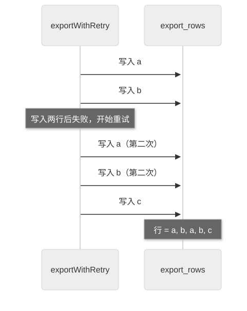

# 第 19 章：Verification，通过实际行为验证的四条原则

[目录](README.md) · [上一篇](23-chapter.md) · [下一篇](25-chapter.md) · [English](../en/24-chapter.md)

作者：kaito · [日文原文](https://zenn.dev/sc30gsw/books/080faba713547b/viewer/1fb019) · [作者英文版](https://zenn.dev/sc30gsw/books/7ff701b9811d04/viewer/d3f914)

来源快照：2026-10-03。中文为 AI 辅助译稿，尚未完成人工终审；正文中的“我”指原作者。

[Authorization / 授权记录](../AUTHORIZATION.md)

<!-- book-body:start -->
本章介绍以下四条 Principle。

1. [Prove It Works](https://github.com/cursor/plugins/blob/main/pstack/skills/principle-prove-it-works/SKILL.md)
2. [Fix Root Causes](https://github.com/cursor/plugins/blob/main/pstack/skills/principle-fix-root-causes/SKILL.md)
3. [Sequence Work into Verifiable Units](https://github.com/cursor/plugins/blob/main/pstack/skills/principle-sequence-verifiable-units/SKILL.md)
4. [Test Behavior, Not Implementation](https://github.com/cursor/plugins/blob/main/pstack/skills/principle-test-behavior-not-implementation/SKILL.md)

这四条属于 Verification（验证）组，决定<strong>Agent 验证到什么程度才可以宣称工作完成</strong>。随附指南的 [`docs/guide/08-principles.md`](https://github.com/cursor/plugins/blob/main/pstack/docs/guide/08-principles.md) 将它们概括为决定「什么才算证明」的原则。

应用这四条 Principle，Agent 会采取以下做法。

- 不因「构建通过」就结束，而是打开输出文件，检查实际写入的行
- 不只消除错误症状（如值为 null 时加检查并跳过处理），而是查明错误原因并修复
- 将工作拆成小单元，每完成一个单元就运行测试，通过后再进入下一单元
- 测试时比较具体输入所产生的实际返回值与期望值，而非检查代码调用了哪些函数

本章与[第 17 章](https://zenn.dev/sc30gsw/books/080faba713547b/viewer/a8e80b)一样，逐条从规则和触发条件介绍四条 Principle，最后说明它们如何用于处理重复行的请求。

重复行的请求，是[前言](https://zenn.dev/sc30gsw/books/080faba713547b/viewer/d4d843)介绍的这个示例：用户请 Agent 修复「运行中途触发重试时，导出会写入重复行」的缺陷。

```
/poteto-mode the export writes duplicate rows when a retry lands mid-run. repro first, then fix and verify.
// 再試行が実行の途中に入ると、エクスポートが重複した行を書き出す。まず再現して、それから直して、確かめて。
```

本章的请求示例也与[第 17 章](https://zenn.dev/sc30gsw/books/080faba713547b/viewer/a8e80b)一样，写成包含 Principle 名称的单行指令。即使不写名称，只要工作符合触发条件，Agent 就会自行阅读并应用 Principle；这一点已在[第 17 章](https://zenn.dev/sc30gsw/books/080faba713547b/viewer/a8e80b)的前提中说明。

<aside class="msg message"><span class="msg-symbol">!</span><div class="msg-content">
<p class="code-line" data-line="28">四条 Principle 中，本章只给「Prove It Works」提供请求示例。</p>
<p class="code-line" data-line="30">本书只收录 pstack 随附指南或 <a href="https://github.com/cursor/plugins/blob/main/pstack/README.md" rel="nofollow noopener noreferrer" target="_blank">README</a> 中已有的请求示例。如果为原文没有示例的 Principle 自行编写示例，可能会展示 pstack 并未预期的用法。</p>
</div></aside>

<a id="%E3%81%93%E3%81%AE%E7%AB%A0%E3%81%AE%E6%A7%8B%E6%88%90"></a>


## 本章结构

本章结构如下。

- 四条 Principle 一览
- 「Prove It Works」：直接检查实际成果，而非依赖代理指标
- 「Fix Root Causes」：修复缺陷原因，而非掩盖症状
- 「Sequence Work into Verifiable Units」：把工作拆成可验证的小单元逐步推进
- 「Test Behavior, Not Implementation」：测试行为，而非实现细节
- 在重复行请求中，「Fix Root Causes」和「Prove It Works」应用于「Bug fix」Playbook 的各个步骤
- 总结

<a id="4%E5%8E%9F%E5%89%87%E3%81%AE%E4%B8%80%E8%A6%A7"></a>


## 四条 Principle 一览

<table class="code-line" data-line="47">
<thead class="code-line" data-line="47">
<tr class="code-line" data-line="47">
<th>Principle</th>
<th>一句话结论</th>
</tr>
</thead>
<tbody class="code-line" data-line="49">
<tr class="code-line" data-line="49">
<td>「<strong>Prove It Works</strong>」</td>
<td>直接检查实际成果，而非依赖代理指标</td>
</tr>
<tr class="code-line" data-line="50">
<td>「<strong>Fix Root Causes</strong>」</td>
<td>修复造成错误等表面症状的根本原因，而非掩盖症状</td>
</tr>
<tr class="code-line" data-line="51">
<td>「<strong>Sequence Work into Verifiable Units</strong>」</td>
<td>把工作拆成可验证的小单元，各单元的测试等检查通过后再进入下一个</td>
</tr>
<tr class="code-line" data-line="52">
<td>「<strong>Test Behavior, Not Implementation</strong>」</td>
<td>以使用者相同方式调用代码，将可观察的结果与直接写在测试中的期望值比较</td>
</tr>
</tbody>
</table>

<aside class="msg message"><span class="msg-symbol">!</span><div class="msg-content">
<p class="code-line" data-line="55"><strong>代理指标</strong>（原文称 proxy）……代替真正要验证的对象而使用的间接线索。</p>
<p class="code-line" data-line="57">例如，认为「文件修改时间很新，内容应该也正确改写了」或「构建通过，功能应该能用」，这里的修改时间和构建成功就是代理指标。</p>
</div></aside>

<a id="%E3%80%8Eprove-it-works%E3%80%8F%E3%81%AF%E3%80%81%E4%BD%9C%E6%A5%AD%E3%81%AE%E7%B5%90%E6%9E%9C%E3%82%92%E4%BB%A3%E7%90%86%E6%8C%87%E6%A8%99%E3%81%A7%E3%81%AF%E3%81%AA%E3%81%8F%E6%9C%AC%E7%89%A9%E3%82%92%E7%9B%B4%E6%8E%A5%E8%A6%8B%E3%81%A6%E7%A2%BA%E3%81%8B%E3%82%81%E3%82%8B"></a>


## 「Prove It Works」直接检查实际成果，而非依赖代理指标

「<strong>Prove It Works</strong>」要求 Agent 在宣称完成前，<strong>亲自验证</strong>实际运行的应用、输出文件或界面上显示的值。

这条 Principle 的核心是原文开头的以下一句话，[第 2 章](https://zenn.dev/sc30gsw/books/080faba713547b/viewer/27a183)也引用过。

> Verify every task output by checking the real thing directly. Do not infer from proxies, self-reports, or "it compiles."
>
> 对每项工作成果，直接检查实际对象加以验证。不要从代理指标、自述或「编译通过」推断。

提出这项要求，是因为<strong>未经验证的工作，即使看起来正确，实际也可能出错</strong>。

与直接查看实际成果相比，Agent 容易觉得下列间接检查更省事，因为它们都不必运行功能。

- 文件修改时间（「修改时间很新，导出应该成功了」）
- 输出是否为新内容（「看起来是这次运行产生的，应该正确」）
- Agent 的自述（「已经修好了」的报告）
- 保存的截图（先前拍下的界面）

但<strong>依错误推测继续工作，代价可能远高于直接验证实际成果</strong>。

例如，Agent 只看修改时间，就报告「导出成功」，实际上文件含重复行。用户之后发现重复，就得重新调查错误从哪一步开始。

因此，未检查实际成果就宣称完成，之后可能大幅增加工作量；必须在完成前直接验证。

<a id="%E3%83%AB%E3%83%BC%E3%83%AB%EF%BC%9A%E5%AE%9F%E9%9A%9B%E3%81%AB%E5%8B%95%E3%81%8B%E3%81%97%E3%81%9F%E7%B5%90%E6%9E%9C%E3%81%A8%E5%AE%9F%E9%9A%9B%E3%81%AE%E5%80%A4%E3%82%92%E8%AA%AD%E3%82%80"></a>


### 规则：实际运行并读取实际值

直接检查实际对象，指 Agent 亲自运行功能、读取实际值。主要规则如下。

<a id="%E6%A9%9F%E8%83%BD%E3%81%AF%E5%AE%9F%E9%9A%9B%E3%81%AB%E5%8B%95%E3%81%8B%E3%81%97%E3%81%A6%E7%A2%BA%E3%81%8B%E3%82%81%E3%82%8B"></a>


#### 实际运行功能并验证

Agent 不应因「构建通过」或「Agent 如此报告」就结束，而要实际运行功能、观察结果。构建成功只说明代码能够编译。

例如，按下按钮可把商品加入购物车，Agent 就应实际按下按钮，在界面确认购物车中出现该商品。

<a id="%E3%83%97%E3%83%AD%E3%82%B0%E3%83%A9%E3%83%A0%E3%81%8C%E5%8B%95%E3%81%84%E3%81%A6%E3%81%84%E3%82%8B%E3%81%8B%E3%81%AF%E3%80%81%E7%9B%B4%E6%8E%A5%E7%A2%BA%E3%81%8B%E3%82%81%E3%82%8B"></a>


#### 直接确认程序是否正在运行

Agent 不应依据日志文件等程序留下的其他信息，推测服务器一类的程序是否正在运行。

例如，不应仅因「日志最近更新」就认定服务器仍在运行，而应实际访问服务器并确认收到响应。日志可能是在服务器停止前一刻写下的。

<a id="%E4%BF%9D%E5%AD%98%E3%81%95%E3%82%8C%E3%81%9F%E5%86%99%E3%81%97%E3%81%A7%E3%81%AF%E3%81%AA%E3%81%8F%E3%80%81%E5%AE%9F%E9%9A%9B%E3%81%AE%E5%80%A4%E3%82%92%E8%AA%AD%E3%82%80"></a>


#### 读取实际值，而非保存的副本

Agent 应读取实际值，而非缓存值或由原始值派生的其他显示。

例如，要验证界面显示的金额，应读取当前界面的数字，而非旧截图。原始值改变后，旧截图可能仍显示过时数据。

<a id="%E7%A2%BA%E8%AA%8D%E3%81%AB%E5%A4%B1%E6%95%97%E3%81%97%E3%81%9F%E3%82%89%E3%80%81%E3%82%B7%E3%82%B9%E3%83%86%E3%83%A0%E3%82%88%E3%82%8A%E5%85%88%E3%81%AB%E7%A2%BA%E3%81%8B%E3%82%81%E6%96%B9%E3%82%92%E7%96%91%E3%81%86"></a>


#### 检查失败时，先质疑检查方法，再判断系统是否出错

检查结果异常时，Agent 不应立刻断定系统坏了，应先检查自己的验证方法是否有误。

例如，界面没有显示新值，Agent 应先确认是否一直开着旧页面、是否访问了其他环境的服务器。验证方法错误时，可能误把正常系统当成故障去修。

<a id="%E7%A2%BA%E8%AA%8D%E3%81%AF%E3%82%B9%E3%82%AF%E3%83%AA%E3%83%97%E3%83%88%E3%81%AB%E3%81%97%E3%81%A6%E6%AE%8B%E3%81%99"></a>


#### 将验证写成脚本并保留

这条 Principle 认为，最有力的证据不是一次性的目视检查，而是<strong>可反复执行相同比较的脚本</strong>。

脚本每次运行都会做相同比较，审阅者无须相信 Agent 的描述，可以亲自运行相同检查，核对结果是否一致。

因此，Agent 应尽可能编写并运行验证脚本，把输出保留在审阅者可见的位置。

例如，比较输出文件与期望内容的脚本可以写成如下形式。

```
// check-export.ts：書き出したファイルの行を、期待する行と比べる
import { readFileSync } from "node:fs";

const actual = readFileSync("out/export.csv", "utf8").trim().split("\n");
const expected = ["a", "b", "c"];

if (JSON.stringify(actual) !== JSON.stringify(expected)) {
  console.error("NG", { actual, expected });
  process.exit(1);
}
console.log("OK", actual.length);
```

如果输出文件包含 `a`、`b`、`c` 三行，脚本输出 `OK 3`。

如果行重复，变成 `a`、`b`、`a`、`b`、`c`，脚本会输出 `NG` 和实际、期望内容，审阅者也能亲自查看差异。

不过，Agent 通常只需在审阅者可见的位置保留脚本和输出，无须将其纳入提交。

只有在大型移植或迁移等大规模、复杂工作中，未来需要审计工作过程时，才将其纳入提交。

<a id="%E7%99%BA%E7%81%AB%E6%9D%A1%E4%BB%B6"></a>


### 触发条件

工作完成之后、宣称完成之前。

<a id="%E4%BE%9D%E9%A0%BC%E3%81%AE%E4%BE%8B%EF%BC%9A%E3%83%93%E3%83%AB%E3%83%89%E3%83%AD%E3%82%B0%E3%81%A7%E3%81%AF%E3%81%AA%E3%81%8F%E3%80%81%E6%9C%AC%E7%89%A9%E3%81%AE%E5%87%BA%E5%8A%9B%E3%82%92%E6%B1%82%E3%82%81%E3%82%8B"></a>


### 请求示例：索取实际输出，而非构建日志

随附指南的 [`docs/guide/10-recipes-and-pitfalls.md`](https://github.com/cursor/plugins/blob/main/pstack/docs/guide/10-recipes-and-pitfalls.md) 将只凭构建通过就报告成功列为常见陷阱，因为构建成功只说明编译通过。

同一页面列出一条让偏离任务的执行回到正轨的单行请求：索取实际输出而非构建日志。Agent 只凭构建通过就报告成功时，可以使用它。

```
apply prove it works. show me the real output, not the build log.
// prove it works を適用して。ビルドログではなく、本物の出力を見せて。
```

<a id="%E3%80%8Efix-root-causes%E3%80%8F%E3%81%AF%E3%80%81%E4%B8%8D%E5%85%B7%E5%90%88%E3%81%AE%E7%97%87%E7%8A%B6%E3%81%A7%E3%81%AF%E3%81%AA%E3%81%8F%E5%8E%9F%E5%9B%A0%E3%82%92%E7%9B%B4%E3%81%99"></a>


## 「Fix Root Causes」修复缺陷原因，而非掩盖症状

「<strong>Fix Root Causes</strong>」要求 Agent 调试时不要止步于消除错误的最小改动，而要<strong>追问为什么，找到根本原因（root cause），在原因所在的位置修复</strong>。

原因在于症状性的处理（权宜之计）会不断累积。

<strong>权宜之计留下真正的缺陷；每当缺陷造成新症状，就会再增加一项权宜之计。权宜之计越多，读者越难理解系统行为。</strong>

此外，权宜之计若留在代码中，Agent 可能把它当作正确实现的上下文，不断复制错误，代码库就无法继续充当可靠记忆（见[第 4 章](https://zenn.dev/sc30gsw/books/080faba713547b/viewer/dc9141)）。

修复原因起初可能更费时间，但能减少调试的总时间，并使后续所有任务持续受益。

<a id="%E3%83%AB%E3%83%BC%E3%83%AB%EF%BC%9A%E7%97%87%E7%8A%B6%E3%82%92%E9%9A%A0%E3%81%99%E3%82%AC%E3%83%BC%E3%83%89%E3%82%92%E8%BF%BD%E5%8A%A0%E3%81%9B%E3%81%9A%E3%80%81%E5%8E%9F%E5%9B%A0%E3%82%92%E7%9B%B4%E3%81%99"></a>


### 规则：修复原因，不增加掩盖症状的防护判断

主要规则如下。

<a id="%E5%85%88%E3%81%AB%E4%B8%8D%E5%85%B7%E5%90%88%E3%82%92%E5%86%8D%E7%8F%BE%E3%81%99%E3%82%8B"></a>


#### 先复现缺陷

修复前，Agent 应亲自建立触发缺陷的条件，确认它实际发生。

例如，用户报告「连续按两次保存按钮会报错」，Agent 应先自己按两次，观察错误。不能复现，就无法确认之后是否修好。

<a id="%E6%A0%B9%E6%9C%AC%E5%8E%9F%E5%9B%A0%E3%81%AB%E5%BD%93%E3%81%9F%E3%82%8B%E3%81%BE%E3%81%A7%E3%80%8C%E3%81%AA%E3%81%9C%E3%80%8D%E3%82%92%E5%95%8F%E3%81%86"></a>


#### 持续追问「为什么」，直到找到根本原因

Agent 应持续追问「为什么」，直到找到根本原因。

以前述保存按钮为例，Agent 可以这样追问。

1. 为什么报错？→ 因为保存运行了两次
2. 为什么保存运行两次？→ 因为按过一次后，按钮仍可点击
3. 为什么按钮仍可点击？→ 因为保存期间没有禁用按钮

第三个答案是原因，因此 Agent 应在保存期间禁用按钮。

若停在第一个答案，Agent 可能只增加「忽略第二次保存」的处理，按钮仍可点击的根本原因没有解决。

若中途停止追问，就只能对症处理；因此应持续追问，直到找到根因。

<a id="%E3%82%AC%E3%83%BC%E3%83%89%E3%81%A7%E7%97%87%E7%8A%B6%E3%82%92%E9%9A%A0%E3%81%95%E3%81%AA%E3%81%84"></a>


#### 不用防护判断掩盖症状

Agent 不应加一道防护判断来掩盖症状。

<aside class="msg message"><span class="msg-symbol">!</span><div class="msg-content">
<p class="code-line" data-line="203"><strong>防护判断</strong>……当值可能导致问题时，停止或跳过剩余处理的简短检查，例如在函数开头写 <code>if (user === null) return;</code>。</p>
</div></aside>

例如，在值为 null 时崩溃的代码中加入「null 就不处理」，崩溃虽然消失，值为什么会变成 null 却仍不清楚。

因此，Agent 应修复值变成 null 的原因，而非只加防护判断。后者只掩盖症状，真正的缺陷仍在。

<a id="%E9%95%B7%E3%81%84%E8%A8%80%E3%81%84%E8%A8%B3%E3%81%AE%E3%82%B3%E3%83%A1%E3%83%B3%E3%83%88%E3%81%8C%E5%BF%85%E8%A6%81%E3%81%AA%E3%82%89%E3%80%81%E3%82%B3%E3%83%BC%E3%83%89%E3%82%92%E7%9B%B4%E3%81%99"></a>


#### 如果需要长篇注释解释权宜之计，就修改代码

<strong>如果必须用一整段注释来为权宜之计辩解，说明代码有问题</strong>。应修改代码，而非注释。

例如，对重复行缺陷作出如下改动，很可能只是权宜之计。

```
type Row = { id: string };
declare function writeRow(row: Row): void; // 1行をファイルに書く

const writtenIds = new Set<string>();

function writeRowOnce(row: Row) {
  // 再試行が入ると、書き終えたはずの行がもう一度届くことがある。
  // なぜもう一度届くのかは分かっていない。
  // そこで、書き終えた行の ID を覚えておき、同じ ID の行が届いたら書かずに捨てる。
  // こうすれば、重複した行は書き出されなくなる。
  if (writtenIds.has(row.id)) return;
  writeRow(row);
  writtenIds.add(row.id);
}
```

这项改动不再写出重复行，但注释没有解释为什么同一行会再次到达。

写下这类注释和代码前，Agent 应先追问为什么同一行会再次到达。

如果必须用长篇注释为修改辩解，就应改代码，而不是写注释。

<a id="%E4%B8%80%E3%81%8B%E6%89%80%E3%81%A0%E3%81%91%E3%81%A7%E3%81%AA%E3%81%8F%E3%80%81%E5%90%8C%E3%81%98%E3%83%91%E3%82%BF%E3%83%BC%E3%83%B3%E3%81%AE%E7%AE%87%E6%89%80%E3%82%92%E3%81%99%E3%81%B9%E3%81%A6%E7%9B%B4%E3%81%99"></a>


#### 修复所有具有相同模式的位置，而非只修一处

Agent 应搜索（用 grep）与原因具有相同模式的代码，修复所有找到的位置。

例如，一个页面的问题来自「按过一次后按钮仍可点击」，Agent 应检查其他页面的按钮是否采用相同写法。只修一处，其他地方就可能留下相同缺陷。

<a id="%E8%A1%8C%E3%81%8D%E8%A9%B0%E3%81%BE%E3%81%A3%E3%81%9F%E3%82%89%E3%80%81%E6%8E%A8%E6%B8%AC%E3%81%9B%E3%81%9A%E3%81%AB%E8%A8%88%E6%B8%AC%E3%81%99%E3%82%8B"></a>


#### 遇到阻碍时先测量，不靠猜测修改

进展受阻时，Agent 应添加日志或读取实际错误信息，确认发生了什么，而非凭猜测修改。猜测若错，只会再增加一层权宜之计。

遇到「重启后无法运行」的缺陷，Agent 应先怀疑重启后仍留存的旧状态（原文称 stale persistent state），再怀疑代码。例如：

- 配置文件
- 缓存
- 锁文件
- 保存在文件中的处理中间状态

如果删除保存中间状态的文件后就能运行，原因便是文件里留下的旧状态。

此时，Agent 不应删掉文件便结束，而应优先修复为：读取文件后验证状态是否符合当前代码预期。只删文件，下次留下旧状态仍会无法运行。

例如，旧代码把中间状态保存为 `{ step: 3 }`，当前代码预期的是 `{ lastRowId: "b" }`；状态验证可写成以下形式。

```
// 今のコードが想定する、途中の状態の形
// 古い { step: 3 } の形は、下の loadState で弾く
type SavedState = { lastRowId: string };

// 保存ファイルから読み込んだ値が、SavedState の形かを確かめる
function loadState(raw: unknown): SavedState | null {
  if (
    typeof raw === "object" &&
    raw !== null &&
    "lastRowId" in raw &&
    typeof raw.lastRowId === "string"
  ) {
    return { lastRowId: raw.lastRowId };
  }
  // { step: 3 } のような古い形の状態は使わず、最初からやり直す
  return null;
}
```

如果运行结果会随前次执行留下的状态而变化，就需要验证读入的状态。

<a id="%E7%99%BA%E7%81%AB%E6%9D%A1%E4%BB%B6-1"></a>


### 触发条件

调试时。

<a id="%E3%80%8Esequence-work-into-verifiable-units%E3%80%8F%E3%81%AF%E3%80%81%E4%BD%9C%E6%A5%AD%E3%82%92%E7%A2%BA%E3%81%8B%E3%82%81%E3%82%89%E3%82%8C%E3%82%8B%E5%B0%8F%E3%81%95%E3%81%AA%E5%8D%98%E4%BD%8D%E3%81%AB%E5%88%86%E3%81%91%E3%81%A6%E9%80%B2%E3%82%80"></a>


## 「Sequence Work into Verifiable Units」把工作拆成可验证的小单元逐步推进

「<strong>Sequence Work into Verifiable Units</strong>」要求 Agent 将工作拆成小单元，每完成一个单元就执行测试等检查，<strong>所有检查通过后再进入下一个单元</strong>。

例如，在五十个文件中改名，Agent 应在改完一个包后运行该包的测试，通过后再处理下一个包。

因为每个单元都验证，出错时就能在造成错误的单元中及时发现。

如果一次改完十个包才测试失败，Agent 就必须找出十项改动中哪一项造成问题，而且此时可能已在错误状态上继续做了更多工作。

逐个验证时，测试失败后只需查看刚改的一个包。

一次性验证的改动越多，排查原因的范围就越大，因此每做一个单元的改动都应验证。

<a id="%E3%83%AB%E3%83%BC%E3%83%AB%EF%BC%9A%E4%B8%80%E5%8D%98%E4%BD%8D%E3%81%9A%E3%81%A4%E7%A2%BA%E3%81%8B%E3%82%81%E3%81%A6%E9%80%B2%E3%82%81%E3%80%81%E3%82%B3%E3%83%9F%E3%83%83%E3%83%88%E3%81%AF%E6%AD%A3%E3%81%97%E3%81%95%E3%82%92%E7%A4%BA%E3%81%99%E9%A0%86%E3%81%AB%E4%B8%A6%E3%81%B9%E3%82%8B"></a>


### 规则：逐单元验证并推进，按证明正确性的顺序排列提交

工作推进规则如下。

<a id="%E4%B8%80%E3%81%A4%E5%A4%89%E3%81%88%E3%81%9F%E3%82%89%E3%80%81%E4%B8%80%E5%BA%A6%E7%A2%BA%E3%81%8B%E3%82%81%E3%82%8B"></a>


#### 每改一个单元，就验证一次

Agent 应从已知正常的状态开始，完成一项改动，运行检查，再继续。以上述改名为例，一个包就是一个单元。

<span class="embed-block zenn-embedded zenn-embedded-mermaid"><iframe data-content="flowchart%20TD%0A%20%20%20%20A%5B%E6%AD%A3%E5%B8%B8%E3%81%A8%E5%88%86%E3%81%8B%E3%81%A3%E3%81%A6%E3%81%84%E3%82%8B%E7%8A%B6%E6%85%8B%5D%20--%3E%20B%5B%E5%A4%89%E6%9B%B4%E3%82%921%E3%81%A4%E5%85%A5%E3%82%8C%E3%82%8B%5D%0A%20%20%20%20B%20--%3E%20C%5B%E3%83%81%E3%82%A7%E3%83%83%E3%82%AF%E3%82%92%E5%AE%9F%E8%A1%8C%E3%81%99%E3%82%8B%5D%0A%20%20%20%20C%20--%3E%20D%7B%E3%81%99%E3%81%B9%E3%81%A6%E9%80%9A%E3%81%A3%E3%81%9F%E3%81%8B%7D%0A%20%20%20%20D%20--%20%E9%80%9A%E3%81%A3%E3%81%9F%20--%3E%20E%5B%E6%AC%A1%E3%81%AE%E5%8D%98%E4%BD%8D%E3%81%B8%E9%80%B2%E3%82%80%5D%0A%20%20%20%20E%20--%3E%20B%0A%20%20%20%20D%20--%20%E8%90%BD%E3%81%A1%E3%81%9F%20--%3E%20F%5B%E7%9B%B4%E5%89%8D%E3%81%AB%E5%85%A5%E3%82%8C%E3%81%9F1%E3%81%A4%E3%81%AE%E5%A4%89%E6%9B%B4%E3%82%92%E7%9B%B4%E3%81%99%5D%0A%20%20%20%20F%20--%3E%20C" frameborder="0" id="zenn-embedded__8fb5240cdcb78" loading="lazy" scrolling="no" src="https://embed.zenn.studio/mermaid#zenn-embedded__8fb5240cdcb78"></iframe></span>

<!-- book-diagram-link:start -->


[查看图示 1](../diagrams/zh-CN/24-01.md)
<!-- book-diagram-link:end -->

检查失败时，Agent 只需修复刚做的这一项改动，排查范围不会扩大。

即使 Agent 使用自动修改的工具（如[第 17 章](https://zenn.dev/sc30gsw/books/080faba713547b/viewer/a8e80b)「[<strong>Build the Lever</strong>](https://github.com/cursor/plugins/blob/main/pstack/skills/principle-build-the-lever/SKILL.md)」要求制作的工具），也不能跳过逐单元检查。工具让这类检查几乎不费事。

<a id="%E5%A7%8B%E3%82%81%E3%82%8B%E5%89%8D%E3%81%AB%E3%80%81%E3%81%8D%E3%82%8C%E3%81%84%E3%81%AAtrunk%E3%81%AE%E4%B8%8A%E3%81%ABrebase%E3%81%99%E3%82%8B"></a>


#### 开始前先在干净的 trunk 上 rebase

开始工作前，Agent 应将分支 rebase（把分支提交重新叠放在其他提交上的 Git 操作）到最新且没有额外改动的 trunk（合并目标主线分支）上。

这样，每次检查都是在最新 trunk 这一真实基线（原文称 baseline）之上比较。

如果基于旧 trunk 或混有其他改动的分支工作，检查失败时就无法区分是自己的修改，还是原有内容造成的。

<a id="%E3%82%B3%E3%83%9F%E3%83%83%E3%83%88%E3%81%AF%E3%80%81%E6%AD%A3%E3%81%97%E3%81%95%E3%82%92%E7%A4%BA%E3%81%99%E9%A0%86%E3%81%AB%E4%B8%A6%E3%81%B9%E3%82%8B"></a>


#### 按证明正确性的顺序排列提交

Agent 应排列提交和 PR，使审阅者依序查看提交就能确认改动正确。基本顺序是「<strong>失败的测试先行，其上再放修复</strong>」。

这样排列，审阅者能亲眼看到测试由失败变成通过。

```
コミットの並び（下が先）

修正のコミット          ← ここでテストが通る
   ↑
失敗するテストのコミット  ← ここでテストが落ちる
   ↑
trunk
```

这条 Principle 还提出以下三种排列方式。

- 重组结构的提交之前，先放删除无用代码的提交。例如，先删未使用函数，再重组剩余文件。
- 改善性能的提交之前，先放记录改善前测量值的提交。例如，先记录当前处理时间，再修改代码加速。
- 实现功能的提交之前，先放只建设功能基础的提交。例如，先添加空页面和通向它的路由，再填入新页面内容。

Agent 应让每个提交都可以独立合入，并让整个提交序列像一份逐步证明改动正确的说明。

<a id="%E7%99%BA%E7%81%AB%E6%9D%A1%E4%BB%B6-2"></a>


### 触发条件

工作有多个阶段（如批量修复、迁移或一系列相似编辑），或需要决定提交与 PR 排列顺序时。

<a id="%E3%80%8Etest-behavior%2C-not-implementation%E3%80%8F%E3%81%AF%E3%80%81%E5%AE%9F%E8%A3%85%E3%81%A7%E3%81%AF%E3%81%AA%E3%81%8F%E6%8C%AF%E3%82%8B%E8%88%9E%E3%81%84%E3%82%92%E3%83%86%E3%82%B9%E3%83%88%E3%81%99%E3%82%8B"></a>


## 「Test Behavior, Not Implementation」测试行为，而非实现细节

「<strong>Test Behavior, Not Implementation</strong>」规定：测试应以使用方相同的方式调用代码，并<strong>将使用方可观察的结果，与直接写在测试中的期望值比较</strong>。

<aside class="msg message"><span class="msg-symbol">!</span><div class="msg-content">
<ul class="code-line" data-line="366">
<li class="code-line" data-line="366">
<strong>行为</strong>（Behavior）……代码使用者能看到的动作或结果，例如函数返回值或保存的数据。</li>
<li class="code-line" data-line="367">
<strong>实现</strong>（Implementation）……代码内部如何调用函数等具体构造。</li>
<li class="code-line" data-line="368">
<strong>直接写在测试中的期望值</strong>（原文称 literal expected value）……不通过代码计算、直接写出值本身的期望值，例如下例中的 <code>"hello-world"</code>。</li>
</ul>
<p class="code-line" data-line="370">例如，测试把字符串转为 URL 适用形式的 <code>slugify</code>，可以用以下两种写法（假定使用 Vitest 测试运行器）。</p>
<div class="code-block-container"><pre class="shiki github-dark" style="background-color:#151e2c;color:#e1e4e8"><code class="code-line" data-line="372"><span class="line"><span style="color:#a0aab5">// 文字列をURL向けの形に変える</span></span>
<span class="line"><span style="color:#F97583">declare</span><span style="color:#F97583"> function</span><span style="color:#B392F0"> slugify</span><span style="color:#E1E4E8">(</span><span style="color:#FFAB70">text</span><span style="color:#F97583">:</span><span style="color:#79B8FF"> string</span><span style="color:#E1E4E8">)</span><span style="color:#F97583">:</span><span style="color:#79B8FF"> string</span><span style="color:#E1E4E8">; </span></span>
<span class="line"></span>
<span class="line"><span style="color:#a0aab5">// 実装をテストする：slugify が内部で toLowerCase を呼んだかを見る</span></span>
<span class="line"><span style="color:#F97583">const</span><span style="color:#79B8FF"> spy</span><span style="color:#F97583"> =</span><span style="color:#E1E4E8"> vi.</span><span style="color:#B392F0">spyOn</span><span style="color:#E1E4E8">(</span><span style="color:#79B8FF">String</span><span style="color:#E1E4E8">.</span><span style="color:#79B8FF">prototype</span><span style="color:#E1E4E8">, </span><span style="color:#9ECBFF">"toLowerCase"</span><span style="color:#E1E4E8">);</span></span>
<span class="line"><span style="color:#B392F0">slugify</span><span style="color:#E1E4E8">(</span><span style="color:#9ECBFF">"Hello, World!"</span><span style="color:#E1E4E8">);</span></span>
<span class="line"><span style="color:#B392F0">expect</span><span style="color:#E1E4E8">(spy).</span><span style="color:#B392F0">toHaveBeenCalled</span><span style="color:#E1E4E8">();</span></span>
<span class="line"></span>
<span class="line"><span style="color:#a0aab5">// 振る舞いをテストする：使う側と同じく slugify を呼び、結果を直接書いた期待値と比べる</span></span>
<span class="line"><span style="color:#B392F0">expect</span><span style="color:#E1E4E8">(</span><span style="color:#B392F0">slugify</span><span style="color:#E1E4E8">(</span><span style="color:#9ECBFF">"Hello, World!"</span><span style="color:#E1E4E8">)).</span><span style="color:#B392F0">toBe</span><span style="color:#E1E4E8">(</span><span style="color:#9ECBFF">"hello-world"</span><span style="color:#E1E4E8">);</span></span>
<span class="line"></span></code></pre></div>
<p class="code-line" data-line="385">第一种写法只要 <code>slugify</code> 调用了 <code>toLowerCase</code> 就能通过，即使结果不是 <code>"hello-world"</code>；第二种写法在结果不是 <code>"hello-world"</code> 时就会失败。</p>
</div></aside>

之所以这样规定，是因为只检查代码调用过哪些函数，或仅复制代码中常量的测试，即使代码有缺陷也可能不失败。

这类测试既没有以使用方相同方式调用代码，也没有比较可观察结果；它们只占用 CI 时间和审阅者注意力，却发现不了缺陷。

而且，<strong>仅复制常量的测试，在有人有意修改该常量时也会失败，妨碍正确的改动</strong>。

例如，假设「每页显示数量」的配置值为 `20`，测试也写 `20`，只比较配置值是否为 `20`。

想把每页数量改为 30 时，将配置值改为 `30`，页面已经正确显示 30 项，测试却仍预期 `20` 而失败。要通过测试，只能再把测试中的 `20` 改为 `30`。

因此，只复制常量值的测试会因正确修改常量而失败，成为改动的阻碍。

<a id="%E3%83%AB%E3%83%BC%E3%83%AB%EF%BC%9A%E3%80%8C%E5%85%A8%E9%83%A8undefined%E3%81%A7%E3%82%82%E9%80%9A%E3%82%8B%E3%81%8B%E3%80%8D%E3%81%AE%E4%B8%80%E5%95%8F%E3%81%A7%E3%80%81%E4%BD%95%E3%82%82%E7%A2%BA%E3%81%8B%E3%82%81%E3%81%A6%E3%81%84%E3%81%AA%E3%81%84%E3%83%86%E3%82%B9%E3%83%88%E3%82%92%E8%A6%8B%E5%88%86%E3%81%91%E3%82%8B"></a>


### 规则：用「即使全部返回 undefined 也能通过吗」识别没有实际验证的测试

保留测试前，Agent 应问：「如果测试导入的函数全部只返回 `undefined`，它还能通过吗？」

如果能通过，测试就<strong>完全没有观察到行为</strong>，即使真实代码损坏也不会失败。此时 Agent 应重写断言，或删除测试。

<aside class="msg message"><span class="msg-symbol">!</span><div class="msg-content">
<ul class="code-line" data-line="407">
<li class="code-line" data-line="407">
<strong>断言</strong>……在测试中确认结果是否符合预期的语句，例如 <code>expect(slugify("Hello, World!")).toBe("hello-world");</code>。</li>
<li class="code-line" data-line="408">
<strong>模拟对象</strong>……测试中代替真实对象的假组件，例如由 <code>vi.fn()</code> 创建的假函数。</li>
</ul>
</div></aside>

能通过上述问题的测试，主要有以下五种形式。

<a id="%E7%A2%BA%E3%81%8B%E3%82%81%E6%96%B9%E3%81%8C%E5%BC%B1%E3%81%84"></a>


#### 验证方式太弱

没有断言，或只用 `toBeDefined`（只检查值不是 `undefined`）等几乎任何结果都能通过的验证方式。

例如，对前述 `slugify` 写 `expect(slugify("Hello, World!")).toBeDefined()`，即使它返回的是 `"xyz"` 而非 `"hello-world"`，测试仍会通过。

```
// 文字列をURL向けの形に変える
declare function slugify(text: string): string; 

// 弱い：slugify が "xyz" を返しても通る
expect(slugify("Hello, World!")).toBeDefined();

// 強い："hello-world" 以外を返せば落ちる
expect(slugify("Hello, World!")).toBe("hello-world");
```

<a id="%E5%91%BC%E3%81%B0%E3%82%8C%E3%81%9F%E3%81%8B%E3%81%A9%E3%81%86%E3%81%8B%E3%81%A0%E3%81%91%E3%82%92%E8%A6%8B%E3%82%8B"></a>


#### 只看是否被调用

只验证模拟对象被调用（`toHaveBeenCalled`），或结果为空（`toEqual([])`）。

例如，测试按姓名搜索会员的 `findUsers`，若只写 `expect(findUsers("存在しない名前")).toEqual([])`，那么即使 `findUsers` 已经坏到对任何姓名都返回空数组，测试仍能通过。

```
type User = { name: string };
declare function findUsers(name: string): User[]; // 名前で会員を探す

// 空の配列になることだけを見ている。常に [] を返す壊れた実装でも通る
expect(findUsers("存在しない名前")).toEqual([]);
```

<a id="%E6%9C%9F%E5%BE%85%E5%80%A4%E3%82%92%E3%83%86%E3%82%B9%E3%83%88%E5%AF%BE%E8%B1%A1%E3%81%8B%E3%82%89%E4%BD%9C%E3%82%8B"></a>


#### 用被测代码生成期望值

用被测代码自身计算期望值的测试。

例如，计算总金额的 `calcTotal` 忘记乘数量：两件各 100 日元的商品，本应返回 `200`，却只返回 `100`。

原测试在期望值一侧也调用相同的 `calcTotal`，所以无论它返回什么错误值，左右两侧始终相同，测试总能通过。

```
type Item = { price: number; quantity: number };
// 合計金額を計算する（数量を掛け忘れるバグがある）
declare function calcTotal(items: Item[]): number; 

const items = [{ price: 100, quantity: 2 }];

// 前：期待値も calcTotal で計算している。左も右も 100 になるので通ってしまう
expect(calcTotal(items)).toBe(calcTotal(items));

// 後：期待値をテストに直接書く。100 は 200 と違うので落ちる
expect(calcTotal(items)).toBe(200);
```

<a id="%E5%AE%9A%E6%95%B0%E3%82%92%E6%9B%B8%E3%81%8D%E5%86%99%E3%81%97%E3%81%9F%E3%81%A0%E3%81%91"></a>


#### 只复制常量

仅把代码中的常量、配置值或提示词字符串再写一遍，用于比较的测试。

例如，代码将 Agent 一次可使用的工具数量上限设为 `8`，测试只把 `LIMITS.maxTools` 中的 `8` 重写一遍。

```
// コード：道具の数の上限を 8 と決めている
const LIMITS = { maxTools: 8 };

// テスト：コードに書いた 8 を、テストでもう一度書いているだけ
expect(LIMITS.maxTools).toBe(8);
```

<a id="%E3%83%86%E3%82%B9%E3%83%88%E3%81%8C%E7%94%A8%E6%84%8F%E3%81%97%E3%81%9F%E3%83%87%E3%83%BC%E3%82%BF%E3%82%92%E8%A6%8B%E3%82%8B%E3%81%A0%E3%81%91"></a>


#### 只查看测试自身准备的数据

测试只读取自己在准备阶段创建的数据，完全不调用被测代码。

```
it("keeps the user name", () => {
  const user = { name: "taro" }; // テストが自分で作ったデータ
  expect(user.name).toBe("taro"); // テスト対象のコードを一度も呼んでいない
});
```

<a id="%E6%9B%B8%E3%81%8D%E7%9B%B4%E3%81%97%E6%96%B9"></a>


#### 如何重写

##### 用具体输入调用被测代码，与直接写出的期望值比较

重写测试时，Agent 应在测试中用一项具体输入调用被测代码，将输出值或可观察变化（如数据已保存）与直接写出的期望值比较。

例如，`slugify` 可写成 `expect(slugify("Hello, World!")).toBe("hello-world")`。

##### 验证某事没有发生时，也验证另一项输入会使它发生

如果要验证某事不会发生，Agent 应在同一个测试中，另用一项输入验证它会发生。

例如，对 `findUsers`，也在同一测试中比较一个能够找到会员的姓名所得到的结果。

```
type User = { name: string };
declare function findUsers(name: string): User[]; // 名前で会員を探す

expect(findUsers("存在しない名前")).toEqual([]);
expect(findUsers("taro")).toEqual([{ name: "taro" }]);
```

总是返回空数组的错误实现，会在第二条断言失败。

##### 对常量，不复制其值，而是验证读取该常量并运行的处理

对于常量，Agent 应验证使用它的处理对某项输入产生的行为，而非重述常量值。

例如，「每页显示数量」可改写如下。

```
// 1ページに表示する件数の設定値（今は 20）
declare const PAGE_SIZE: number; 
// 配列をページごとに分ける。pageSize を省くと PAGE_SIZE を使う
declare function paginate<T>(items: T[], pageSize?: number): T[][];

// 前：設定値を書き写しただけ。設定値を 30 に変えると落ちる
expect(PAGE_SIZE).toBe(20);

// 後：ページに分ける処理を、入力1つで確かめる
expect(paginate(["a", "b", "c"], 2)).toEqual([["a", "b"], ["c"]]);
```

后一个测试在分页处理损坏时会失败，但把配置值改为 `30` 时不会失败。

##### 找不到有效验证方式的测试应删除

如果找不到这样的验证方式，Agent 应删除该测试。

##### 对模拟对象，验证收到的内容而非仅验证被调用

使用模拟对象本身没有问题；但测试应验证它接收到的内容或调用后的状态，而非只验证它被调用过。

例如，用模拟对象代替发送邮件的组件时，Agent 应验证传入了「正确的收件人和正文」，而非只验证「调用过发送」。只验证调用，内容错误也能通过。

```
type Mailer = { send: (mail: { to: string; body: string }) => void };
// 会員を登録し、登録のお礼のメールを mailer で送る
declare function registerUser(mailer: Mailer, user: { email: string }): Promise<void>;

// 前：送信が呼ばれたことだけを見る。宛先や本文が間違っていても通る
it("sends a welcome mail", async () => {
  const mailer = { send: vi.fn() };
  await registerUser(mailer, { email: "taro@example.com" });
  expect(mailer.send).toHaveBeenCalled();
});

// 後：モックが受け取った宛先と本文を、直接書いた期待値と比べる
it("sends a welcome mail", async () => {
  const mailer = { send: vi.fn() };
  await registerUser(mailer, { email: "taro@example.com" });
  expect(mailer.send).toHaveBeenCalledWith({
    to: "taro@example.com",
    body: "ご登録ありがとうございます",
  });
});
```

这段测试中，即使 `registerUser` 把空地址作为收件人，原测试也能通过；修改后的测试会因收件人不是 `taro@example.com` 而失败。

<a id="%E7%99%BA%E7%81%AB%E6%9D%A1%E4%BB%B6-3"></a>


### 触发条件

编写、修改测试，或决定是否保留测试时。

<a id="%E4%BE%8B%EF%BC%9A%E5%86%8D%E8%A9%A6%E8%A1%8C%E3%81%AE%E3%83%86%E3%82%B9%E3%83%88%E3%82%92%E6%8C%AF%E3%82%8B%E8%88%9E%E3%81%84%E3%81%A7%E6%9B%B8%E3%81%8F"></a>


### 示例：用行为验证重试

以重复行请求为例，比较[「只看是否被调用」](#%E5%91%BC%E3%81%B0%E3%82%8C%E3%81%9F%E3%81%8B%E3%81%A9%E3%81%86%E3%81%8B%E3%81%A0%E3%81%91%E3%82%92%E8%A6%8B%E3%82%8B)的测试及其改写方式。重复行请求就是本章开头的以下请求。

```
/poteto-mode the export writes duplicate rows when a retry lands mid-run. repro first, then fix and verify.
// 再試行が実行の途中に入ると、エクスポートが重複した行を書き出す。まず再現して、それから直して、確かめて。
```

Agent 收到请求后，要编写重试测试。

下面的测试只要 `exportWithRetry` 调用了 `db.query`，即使没有正确写出行，也能通过。

```
type Db = { query: (...args: unknown[]) => unknown };
type InMemoryDb = Db & { rows: (table: string) => { source_row_id: string }[] };

// 元の行 input をエクスポートし、途中で失敗したら再試行する
declare function exportWithRetry(
  db: Db,
  input: string[],
  options?: { failAfterRows?: number },
): Promise<void>;
 // テスト用に、メモリ上で動くDBを作る
declare function createInMemoryDb(): InMemoryDb;
// 元の行（a、b、c の3行）
declare const input: string[]; 

// 悪いテスト。モックが呼ばれたことしか見ていない
it("writes rows on retry", async () => {
  const db = { query: vi.fn() };
  await exportWithRetry(db, input);
  expect(db.query).toHaveBeenCalled();
});
```

下一段测试将使用方可观察的结果，也就是实际写出的行，与直接写在测试中的期望值 `["a", "b", "c"]` 比较。

```
// 振る舞いを確かめるテスト
it("writes each source row once when a retry lands mid-run", async () => {
  const db = createInMemoryDb();
  await exportWithRetry(db, input, { failAfterRows: 2 });
  expect(db.rows("export_rows").map((r) => r.source_row_id)).toEqual(["a", "b", "c"]);
});
```

`failAfterRows: 2` 指定写出两行后失败一次，使重试在运行中途发生。

如果重试从第一行重新写入，结果会如下变化。

<span class="embed-block zenn-embedded zenn-embedded-mermaid"><iframe data-content="sequenceDiagram%0A%20%20%20%20participant%20E%20as%20exportWithRetry%0A%20%20%20%20participant%20D%20as%20export_rows%0A%20%20%20%20E-%3E%3ED%3A%20a%20%E3%82%92%E6%9B%B8%E3%81%8F%0A%20%20%20%20E-%3E%3ED%3A%20b%20%E3%82%92%E6%9B%B8%E3%81%8F%0A%20%20%20%20Note%20over%20E%3A%202%E8%A1%8C%E3%82%92%E6%9B%B8%E3%81%84%E3%81%9F%E5%BE%8C%E3%81%A7%E5%A4%B1%E6%95%97%E3%81%97%E3%80%81%E5%86%8D%E8%A9%A6%E8%A1%8C%E3%81%99%E3%82%8B%0A%20%20%20%20E-%3E%3ED%3A%20a%20%E3%82%92%E6%9B%B8%E3%81%8F%EF%BC%882%E5%9B%9E%E7%9B%AE%EF%BC%89%0A%20%20%20%20E-%3E%3ED%3A%20b%20%E3%82%92%E6%9B%B8%E3%81%8F%EF%BC%882%E5%9B%9E%E7%9B%AE%EF%BC%89%0A%20%20%20%20E-%3E%3ED%3A%20c%20%E3%82%92%E6%9B%B8%E3%81%8F%0A%20%20%20%20Note%20over%20D%3A%20%E8%A1%8C%20%3D%20a%2C%20b%2C%20a%2C%20b%2C%20c" frameborder="0" id="zenn-embedded__5d78a47c7549c" loading="lazy" scrolling="no" src="https://embed.zenn.studio/mermaid#zenn-embedded__5d78a47c7549c"></iframe></span>

<!-- book-diagram-link:start -->


[查看图示 2](../diagrams/zh-CN/24-02.md)
<!-- book-diagram-link:end -->

最初写入的 `a`、`b` 后面接着重试从第一行写出的 `a`、`b`、`c`，实际行就成为 `["a", "b", "a", "b", "c"]`，与期望的 `["a", "b", "c"]` 不同，测试会失败。

因此，测试能否捕捉缺陷，取决于比较的对象；应将可观察结果与直接写出的期望值比较。

<a id="%E9%87%8D%E8%A4%87%E8%A1%8C%E3%81%AE%E4%BE%9D%E9%A0%BC%E3%81%A7%E3%81%AF%E3%80%81%E3%80%8Efix-root-causes%E3%80%8F%E3%81%A8%E3%80%8Eprove-it-works%E3%80%8F%E3%81%8C%E3%80%8Ebug-fix%E3%80%8Fplaybook%E3%81%AE%E5%90%84%E6%89%8B%E9%A0%86%E3%81%A7%E4%BD%BF%E3%82%8F%E3%82%8C%E3%82%8B"></a>


## 在重复行请求中，「Fix Root Causes」和「Prove It Works」应用于「Bug fix」Playbook 的各个步骤

再看一次开头的重复行请求。

```
/poteto-mode the export writes duplicate rows when a retry lands mid-run. repro first, then fix and verify.
// 再試行が実行の途中に入ると、エクスポートが重複した行を書き出す。まず再現して、それから直して、確かめて。
```

本书认为，在这个请求中，[第 11 章](https://zenn.dev/sc30gsw/books/080faba713547b/viewer/6fcb42)介绍的「[<strong>Bug fix</strong>](https://github.com/cursor/plugins/blob/main/pstack/skills/poteto-mode/playbooks/bug-fix.md)」Playbook，主要会在各步骤应用两条 Principle。

请求中的「先复现」对应「<strong>Fix Root Causes</strong>」，「再验证」对应「<strong>Prove It Works</strong>」。

<table class="code-line" data-line="656">
<thead class="code-line" data-line="656">
<tr class="code-line" data-line="656">
<th>「<strong>Bug fix</strong>」的步骤</th>
<th>使用的 Principle 及其如何改变判断</th>
</tr>
</thead>
<tbody class="code-line" data-line="658">
<tr class="code-line" data-line="658">
<td>1. 亲自复现</td>
<td>「<strong>Fix Root Causes</strong>」：建立在运行中途触发重试的条件，逐步收窄范围直到复现重复行；复现后才编写修复</td>
</tr>
<tr class="code-line" data-line="659">
<td>2. 通过二分查找缩小原因范围</td>
<td>「<strong>Fix Root Causes</strong>」：提出可能原因，每次将怀疑范围缩小一半，加入日志，逐个检验候选原因</td>
</tr>
<tr class="code-line" data-line="660">
<td>3. 规划修复</td>
<td>「<strong>Fix Root Causes</strong>」：输出后再删除重复行，只是处理症状，未修复重复产生的原因。如果打算让写入幂等，应使用<a href="https://zenn.dev/sc30gsw/books/080faba713547b/viewer/cdc49b" target="_blank">第 18 章</a>「<a href="https://github.com/cursor/plugins/blob/main/pstack/skills/principle-make-operations-idempotent/SKILL.md" rel="nofollow noopener noreferrer" target="_blank"><strong>Make Operations Idempotent</strong></a>」的三个问题检查写入设计</td>
</tr>
<tr class="code-line" data-line="661">
<td>4. 在相同环境以相同操作验证</td>
<td>「<strong>Prove It Works</strong>」：不只看单元测试通过，还要让原先的复现流程通过，并检查实际写出的行</td>
</tr>
<tr class="code-line" data-line="662">
<td>5. 先提交会失败的复现</td>
<td>「<strong>Sequence Work into Verifiable Units</strong>」：在 Git 历史中保留测试从失败到通过的变化</td>
</tr>
<tr class="code-line" data-line="663">
<td>回答</td>
<td>「<strong>Prove It Works</strong>」：写明根本原因与修复，并附上复现步骤在修复前失败、修复后通过的输出</td>
</tr>
</tbody>
</table>

在步骤 2 中，Agent 要检查的可能原因例如以下三种。

- 队列（待处理任务的排列）把同一任务交付了两次
- 重试没有从已写入行之后继续，而是从已写过的行重新开始
- 写入并非幂等（见[第 18 章](https://zenn.dev/sc30gsw/books/080faba713547b/viewer/cdc49b)）
  - 幂等……同一操作执行多少次，结果都与只执行一次相同

<a id="%E3%81%BE%E3%81%A8%E3%82%81"></a>


## 总结

- 「<strong>Prove It Works</strong>」不把「编译通过」「Agent 如此报告」当作证据，而是直接检查实际成果物（输出文件或运行中的界面）。
- 「<strong>Fix Root Causes</strong>」先复现缺陷，再不断追问「为什么」直到找到原因；不靠防护判断掩盖症状。
- 「<strong>Sequence Work into Verifiable Units</strong>」逐个小单元验证测试等检查通过，并让失败复现的提交排在修复提交之前。
- 「<strong>Test Behavior, Not Implementation</strong>」用「即使全部返回 undefined 也能通过吗」识别发现不了任何缺陷的测试。
- 在重复行请求中，「<strong>Fix Root Causes</strong>」用于「<strong>Bug fix</strong>」从复现到规划修复的步骤，「<strong>Prove It Works</strong>」用于验证与回答。

下一章[第 20 章](https://zenn.dev/sc30gsw/books/080faba713547b/viewer/c155cc)介绍 Delegation 组的两条 Principle：「[<strong>Guard the Context Window</strong>](https://github.com/cursor/plugins/blob/main/pstack/skills/principle-guard-the-context-window/SKILL.md)」与「[<strong>Never Block on the Human</strong>](https://github.com/cursor/plugins/blob/main/pstack/skills/principle-never-block-on-the-human/SKILL.md)」。
<!-- book-body:end -->

---

[目录](README.md) · [上一篇](23-chapter.md) · [下一篇](25-chapter.md) · [English](../en/24-chapter.md)
