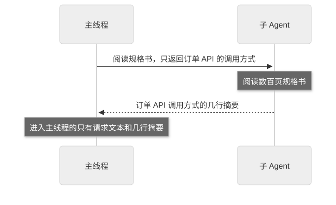
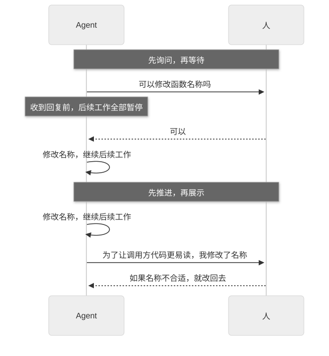

# 第 20 章：Delegation，处理委派与并行工作的两条原则

[目录](README.md) · [上一篇](24-chapter.md) · [下一篇](26-chapter.md) · [English](../en/25-chapter.md)

作者：kaito · [日文原文](https://zenn.dev/sc30gsw/books/080faba713547b/viewer/c155cc) · [作者英文版](https://zenn.dev/sc30gsw/books/7ff701b9811d04/viewer/0ec4d6)

来源快照：2026-10-03。中文为 AI 辅助译稿，尚未完成人工终审；正文中的“我”指原作者。

[Authorization / 授权记录](../AUTHORIZATION.md)

<!-- book-body:start -->
本章讨论以下两项原则。

1. [Guard the Context Window](https://github.com/cursor/plugins/blob/main/pstack/skills/principle-guard-the-context-window/SKILL.md)
2. [Never Block on the Human](https://github.com/cursor/plugins/blob/main/pstack/skills/principle-never-block-on-the-human/SKILL.md)

这两项属于 Delegation（委派）组，规定了 Agent 将工作交给子 Agent，或不等待人类回复而继续工作时如何判断。

随附指南的 [`docs/guide/08-principles.md`](https://github.com/cursor/plugins/blob/main/pstack/docs/guide/08-principles.md) 将两者概括为<strong>让并行工作保持有序的原则</strong>（原文为「keep parallel work sane」）。  
它们都帮助负责委派的 Agent 持续推进并行工作，避免子 Agent 的大量输出填满上下文，也避免因等待人类回复而停下。

运用这两项原则时，Agent 会这样行动。

- 让子 Agent 阅读数千行测试日志或数百页 API 规格文档，主线程（调用子 Agent 的原始会话）只接收几行摘要，例如「哪些测试失败、为什么失败」
- 对于重命名函数等可以撤销的工作，不向人类询问「可以改吗」，而是执行后展示结果和理由
- 只有向共享分支 force-push（覆盖远程分支历史的推送）等无法撤销的操作，才在执行前向人类确认

此外，<strong>两项原则保护的资源不同</strong>。「Guard the Context Window」保护 Agent 的上下文，避免原始数据（例如数千行测试日志、截图、大型文档等未经摘要直接读入的输出）将其填满。

这类数据的大部分内容不会用于判断，却会按读入量占用上下文，因此需要这项原则保护 Agent 的上下文。

「Never Block on the Human」保护人类的注意力，使其不用每次都被 Agent 的批准请求打断。

这两项原则也用在 Playbook 的步骤中。

例如，[第 15 章](https://zenn.dev/sc30gsw/books/080faba713547b/viewer/7d7609)的「[<strong>Session pickup</strong>](https://github.com/cursor/plugins/blob/main/pstack/skills/poteto-mode/playbooks/session-pickup.md)」Playbook 让子 Agent 阅读很长的会话记录（「Guard the Context Window」）。[第 16 章](https://zenn.dev/sc30gsw/books/080faba713547b/viewer/8a8dd5)的「[<strong>Multi-phase or multi-PR plan</strong>](https://github.com/cursor/plugins/blob/main/pstack/skills/poteto-mode/playbooks/multi-phase-plan.md)」Playbook 不会把运行原型即可回答的问题拿去问使用者（「Never Block on the Human」）。

本章与[第 17 章](https://zenn.dev/sc30gsw/books/080faba713547b/viewer/a8e80b)一样，从规则和触发条件两个角度逐项解释，最后讨论它们与[演讲](https://x.com/poteto/status/2102050467505430555)主题「人类无需在旁边盯着」的关系。

<aside class="msg message"><span class="msg-symbol">!</span><div class="msg-content">
<p class="code-line" data-line="29">本章没有为这两项原则提供请求示例。</p>
<p class="code-line" data-line="31">本书只采用 pstack 随附指南或 <a href="https://github.com/cursor/plugins/blob/main/pstack/README.md" rel="nofollow noopener noreferrer" target="_blank">README</a> 中已有的请求示例。如果为原文未提供示例的原则自行编写示例，就可能展示 pstack 并未设想的使用方式。</p>
</div></aside>

<a id="%E3%81%93%E3%81%AE%E7%AB%A0%E3%81%AE%E6%A7%8B%E6%88%90"></a>


## 本章结构

本章结构如下。

- 两项原则一览
- 「Guard the Context Window」让子 Agent 阅读大量输出或文档，只在主线程留下摘要
- 「Never Block on the Human」不等待人类确认，直接推进可以撤销的工作
- 保护 Agent 的上下文和人类的注意力，人类便无需在旁边盯着
- 总结

<a id="2%E5%8E%9F%E5%89%87%E3%81%AE%E4%B8%80%E8%A6%A7"></a>


## 两项原则一览

<table class="code-line" data-line="46">
<thead class="code-line" data-line="46">
<tr class="code-line" data-line="46">
<th>Principle</th>
<th>一句话结论</th>
<th>保护的资源</th>
</tr>
</thead>
<tbody class="code-line" data-line="48">
<tr class="code-line" data-line="48">
<td>「<strong>Guard the Context Window</strong>」</td>
<td>让子 Agent 阅读大量输出或文档（如数千行日志、数百页规格文档），主线程只保留摘要</td>
<td>Agent 的上下文</td>
</tr>
<tr class="code-line" data-line="49">
<td>「<strong>Never Block on the Human</strong>」</td>
<td>无需等待确认即可推进可以撤销的工作（如编写代码、重命名函数），并向人类展示结果和理由；只有无法撤销的操作（如 force-push、删除生产数据）才需要执行前确认</td>
<td>人类的注意力</td>
</tr>
</tbody>
</table>

<a id="%E3%80%8Eguard-the-context-window%E3%80%8F%E3%81%AF%E3%80%81%E5%A4%A7%E3%81%8D%E3%81%AA%E5%87%BA%E5%8A%9B%E3%82%84%E6%96%87%E6%9B%B8%E3%82%92%E3%82%B5%E3%83%96%E3%82%A8%E3%83%BC%E3%82%B8%E3%82%A7%E3%83%B3%E3%83%88%E3%81%AB%E8%AA%AD%E3%81%BE%E3%81%9B%E3%80%81%E4%B8%BB%E3%82%B9%E3%83%AC%E3%83%83%E3%83%89%E3%81%AB%E8%A6%81%E7%B4%84%E3%82%92%E6%AE%8B%E3%81%99"></a>


## 「Guard the Context Window」让子 Agent 阅读大量输出或文档，只在主线程留下摘要

「<strong>Guard the Context Window</strong>」原则要求<strong>逐一判断放入主线程的内容是否值得其成本</strong>。这里的成本是主线程读入的 token（AI 模型计量文本的单位）数量。

<aside class="msg message"><span class="msg-symbol">!</span><div class="msg-content">
<p class="code-line" data-line="56"><strong>值得其成本</strong>……相对于主线程读入的 token 数量，内容能帮助 Agent 作出下一步判断</p>
<p class="code-line" data-line="58">例如，用几行概括「哪些测试失败、为什么失败」，Agent 可以直接据此决定下一步修复什么，因此值得其成本。</p>
<p class="code-line" data-line="60">相反，若将包括通过测试在内的数千行日志原样读入主线程，Agent 用于判断的只有极少部分，就不值得其成本。</p>
</div></aside>

原则提出这一要求，是因为<strong>上下文窗口（模型一次能够读入和处理的文本量上限）有限，而且在同一次会话中，已用掉的容量无法重新腾出</strong>。

上下文窗口填满后，Agent 的推理质量会下降。随后，会话压缩（将放不下的会话内容摘要压缩）可能漏掉先前读过的部分内容，最终工作本身也会停止。

<a id="%E3%83%AB%E3%83%BC%E3%83%AB%EF%BC%9A%E3%82%B3%E3%82%B9%E3%83%88%E3%81%AB%E8%A6%8B%E5%90%88%E3%81%86%E3%82%82%E3%81%AE%E3%81%A0%E3%81%91%E3%82%92%E4%B8%BB%E3%82%B9%E3%83%AC%E3%83%83%E3%83%89%E3%81%AB%E7%BD%AE%E3%81%8F"></a>


### 规则：只把值得其成本的内容放入主线程

原则列出以下三种做法。

<a id="1.-%E5%A4%A7%E3%81%8D%E3%81%AA%E5%87%BA%E5%8A%9B%E3%82%84%E6%96%87%E6%9B%B8%E3%82%92%E3%82%B5%E3%83%96%E3%82%A8%E3%83%BC%E3%82%B8%E3%82%A7%E3%83%B3%E3%83%88%E3%81%AB%E8%AA%AD%E3%81%BE%E3%81%9B%E3%82%8B"></a>


#### 1. 让子 Agent 阅读大量输出或文档

Agent 让子 Agent 阅读冗长的输出（如数千行测试日志）、截图和大型文档，主线程只接收摘要，不接收原始数据。因为在主线程阅读原始数据会相应占用其上下文。

以阅读大型文档时如何分工为例。如果只想从数百页的 API 规格文档中了解如何调用订单 API，Agent 会这样分配工作。

<span class="embed-block zenn-embedded zenn-embedded-mermaid"><iframe data-content="sequenceDiagram%0A%20%20%20%20participant%20M%20as%20%E4%B8%BB%E3%82%B9%E3%83%AC%E3%83%83%E3%83%89%0A%20%20%20%20participant%20S%20as%20%E3%82%B5%E3%83%96%E3%82%A8%E3%83%BC%E3%82%B8%E3%82%A7%E3%83%B3%E3%83%88%0A%20%20%20%20M-%3E%3ES%3A%20%E4%BB%95%E6%A7%98%E6%9B%B8%E3%82%92%E8%AA%AD%E3%81%BF%E3%80%81%E6%B3%A8%E6%96%87API%E3%81%AE%E5%91%BC%E3%81%B3%E6%96%B9%E3%81%A0%E3%81%91%E3%82%92%E8%BF%94%E3%81%97%E3%81%A6%0A%20%20%20%20Note%20over%20S%3A%20%E4%BD%95%E7%99%BE%E3%83%9A%E3%83%BC%E3%82%B8%E3%81%AE%E4%BB%95%E6%A7%98%E6%9B%B8%E3%82%92%E8%AA%AD%E3%82%80%0A%20%20%20%20S--%3E%3EM%3A%20%E6%B3%A8%E6%96%87API%E3%81%AE%E5%91%BC%E3%81%B3%E6%96%B9%E3%81%AE%E8%A6%81%E7%B4%84%EF%BC%88%E6%95%B0%E8%A1%8C%EF%BC%89%0A%20%20%20%20Note%20over%20M%3A%20%E4%B8%BB%E3%82%B9%E3%83%AC%E3%83%83%E3%83%89%E3%81%AB%E5%85%A5%E3%82%8B%E3%81%AE%E3%81%AF%E3%80%81%E4%BE%9D%E9%A0%BC%E3%81%AE%E6%96%87%E3%81%A8%E6%95%B0%E8%A1%8C%E3%81%AE%E8%A6%81%E7%B4%84%E3%81%A0%E3%81%91" frameborder="0" id="zenn-embedded__210e00621bbe" loading="lazy" scrolling="no" src="https://embed.zenn.studio/mermaid#zenn-embedded__210e00621bbe"></iframe></span>

<!-- book-diagram-link:start -->


[查看图示 1](../diagrams/zh-CN/25-01.md)
<!-- book-diagram-link:end -->

阅读数百页规格文档填满的只是子 Agent 的上下文。主线程的上下文仅消耗请求文本和几行摘要所占的容量。

因此，若在主线程阅读大型文档会占用大量上下文，就需要让子 Agent 阅读。

<a id="2.-%E6%AF%8E%E5%9B%9E%E4%BD%BF%E3%81%86%E3%83%86%E3%83%B3%E3%83%97%E3%83%AC%E3%83%BC%E3%83%88%E3%82%84%E5%8F%82%E8%80%83%E8%B3%87%E6%96%99%E3%81%AF-skill.md-%E6%9C%AC%E4%BD%93%E3%81%AB%E7%BD%AE%E3%81%8F"></a>


#### 2. 将每次都用到的模板和参考资料放在 `SKILL.md` 正文中

Agent 应把每次使用 Skill 都要阅读的模板和参考资料写在 `SKILL.md` 正文中，不另存文件。否则每次使用 Skill 时，读取额外文件都会增加成本。

例如，一个审查 Skill 每次都按相同格式写报告，文件可以这样安排。

```
前：毎回使う報告の形を、別ファイルに分けている
skills/review/SKILL.md             ← 手順と「報告は templates/report.md の形で書く」という一文
skills/review/templates/report.md  ← 報告の形

後：毎回使う報告の形を、SKILL.md 本体に書く
skills/review/SKILL.md             ← 手順と、報告の形
```

采用前一种方式，Agent 每次使用 Skill 都要先读 `SKILL.md`，再读 `templates/report.md`。采用后一种方式，只读一次 `SKILL.md` 即可。

因此，如果文件位置会改变每次读取的次数，就应把每次都要用的内容放在 `SKILL.md` 正文中。

<a id="3.-%E6%AE%B5%E9%9A%8E%E3%81%94%E3%81%A8%E3%81%AE%E4%BD%9C%E6%A5%AD%E3%81%AE%E7%AF%84%E5%9B%B2%E3%81%AB%E4%B8%8A%E9%99%90%E3%82%92%E8%A8%AD%E3%81%91%E3%82%8B"></a>


#### 3. 给每个阶段的工作范围设定上限

Agent 将大型工作划分为阶段（原文为 phase），并为每个阶段规定处理的文件数量和允许使用的轮次数量上限。轮次指 Agent 向模型提出请求并接收回复的一次往返。

Agent 还要事先估算工作机制本身占用的上下文，例如调用子 Agent 时，发给子 Agent 的请求及其返回的摘要也会占用主线程的上下文。

如果既不设上限，也不计入机制本身的开销，上下文可能在某个阶段尚未完成时就已填满。Agent 的推理质量可能随之下降，工作也可能中止。

<a id="%E5%9F%BA%E6%BA%96%E3%81%AF%E3%80%81%E3%82%B3%E3%82%B9%E3%83%88%E3%81%AB%E8%A6%8B%E5%90%88%E3%81%86%E3%81%8B%E3%81%A9%E3%81%86%E3%81%8B"></a>


#### 判断标准是内容是否值得其成本

<strong>原则的标准不是减少阅读量，而是内容是否值得其成本</strong>。第二种做法体现了这一点。

把模板放入 `SKILL.md` 正文会使文件变长，单次阅读量也会增加。

原则仍选择放在正文，是因为每次都用到的模板，即便拆成单独文件，最终也每次都要读。读入的内容没有变，却多了一次读取，所以放在正文中成本更低。

<a id="%E7%99%BA%E7%81%AB%E6%9D%A1%E4%BB%B6"></a>


### 触发条件

大量输出、长文件或重复阅读同一文件等情况使上下文逐渐填满时，就会触发这项原则。计划把工作分给多个子 Agent 并行推进（原文为 fan-out）时也适用。

<a id="playbook%E3%81%AE%E4%BE%8B%EF%BC%9A%E3%82%B3%E3%83%BC%E3%83%89%E3%83%99%E3%83%BC%E3%82%B9%E3%82%92%E8%AA%BF%E3%81%B9%E3%82%8B%E3%82%B5%E3%83%96%E3%82%A8%E3%83%BC%E3%82%B8%E3%82%A7%E3%83%B3%E3%83%88%E3%81%AB%E3%80%81%E8%BF%94%E3%81%99%E4%B8%AD%E8%BA%AB%E3%82%924%E3%81%A4%E3%81%AB%E9%99%90%E5%AE%9A%E3%81%97%E3%81%A6%E3%81%84%E3%82%8B"></a>


### Playbook 示例：要求调查代码库的子 Agent 只返回四类内容

「[<strong>Multi-phase or multi-PR plan</strong>](https://github.com/cursor/plugins/blob/main/pstack/skills/poteto-mode/playbooks/multi-phase-plan.md)」Playbook（[第 16 章](https://zenn.dev/sc30gsw/books/080faba713547b/viewer/8a8dd5)）在编写计划前，将调查代码库的工作交给子 Agent。它引用这项原则，<strong>规定子 Agent 只返回以下四类内容</strong>。

- 相关文件的位置
- 代码库的惯例
- 测试命令
- 处理入口（原文为 entry points，即所调查功能开始执行的函数或文件，例如最先接收 API 请求的处理函数、接收 CLI 命令的函数）

Playbook 还禁止子 Agent 原样粘贴读过的代码（原文为 inlined dumps）作为回复。

把返回内容限定为这四类，主线程便只会收到编写计划所需的信息。

<a id="%E3%80%8Enever-block-on-the-human%E3%80%8F%E3%81%AF%E3%80%81%E5%85%83%E3%81%AB%E6%88%BB%E3%81%9B%E3%82%8B%E4%BD%9C%E6%A5%AD%E3%82%92%E4%BA%BA%E9%96%93%E3%81%AE%E7%A2%BA%E8%AA%8D%E3%82%92%E5%BE%85%E3%81%9F%E3%81%9A%E3%81%AB%E9%80%B2%E3%82%81%E3%82%8B"></a>


## 「Never Block on the Human」不等待人类确认，直接推进可以撤销的工作

「<strong>Never Block on the Human</strong>」原则要求 Agent 对可以撤销的工作<strong>直接执行，无需请求许可</strong>，然后向人类展示结果和理由。人类看到结果后，可以再修正工作方向（原文为 course-correct）。

原则开头的两句话是：

> The human supervises asynchronously. Agents must stay unblocked.
>
> 人类以异步方式监督。Agent 必须能够继续推进。

也就是说，人类不必现场陪同 Agent 工作，而是在事后检查结果，因此 Agent 不应因等待人类回复而停下。

原则之所以如此要求，是因为<strong>每当 Agent 停下来等待人类许可，工作流程（原文为 pipeline）就会中断，人类回复的速度便决定了整个工作的进度</strong>。

代码变更可以撤销，也可以审查，所以<strong>错误判断的成本通常低于停下来的成本</strong>。判断错了，人类在审查时发现并撤销变更即可；而停下来则意味着后续所有工作都要等人类回复才能继续。

<a id="%E3%83%AB%E3%83%BC%E3%83%AB%EF%BC%9A%E5%85%83%E3%81%AB%E6%88%BB%E3%81%9B%E3%81%AA%E3%81%84%E6%93%8D%E4%BD%9C%E3%81%A0%E3%81%91%E4%BA%BA%E9%96%93%E3%81%AB%E7%A2%BA%E8%AA%8D%E3%81%99%E3%82%8B"></a>


### 规则：只有无法撤销的操作才向人类确认

原则要求 Agent 不要问「可以做 X 吗」，而是先执行 X，再展示结果和理由（原文为 Proceed, then present）。

例如，Agent 犹豫是否要重命名函数时，「询问并等待」与「先推进再展示」的区别如下。

<span class="embed-block zenn-embedded zenn-embedded-mermaid"><iframe data-content="sequenceDiagram%0A%20%20%20%20participant%20A%20as%20%E3%82%A8%E3%83%BC%E3%82%B8%E3%82%A7%E3%83%B3%E3%83%88%0A%20%20%20%20participant%20H%20as%20%E4%BA%BA%E9%96%93%0A%20%20%20%20Note%20over%20A%2CH%3A%20%E8%81%9E%E3%81%84%E3%81%A6%E5%BE%85%E3%81%A4%E5%A0%B4%E5%90%88%0A%20%20%20%20A-%3E%3EH%3A%20%E9%96%A2%E6%95%B0%E3%81%AE%E5%90%8D%E5%89%8D%E3%82%92%E5%A4%89%E3%81%88%E3%81%A6%E3%82%82%E3%81%84%E3%81%84%E3%81%A7%E3%81%99%E3%81%8B%0A%20%20%20%20Note%20over%20A%3A%20%E8%BF%94%E4%BA%8B%E3%81%8C%E6%9D%A5%E3%82%8B%E3%81%BE%E3%81%A7%E3%80%81%E5%BE%8C%E3%81%AE%E4%BD%9C%E6%A5%AD%E3%81%8C%E3%81%99%E3%81%B9%E3%81%A6%E6%AD%A2%E3%81%BE%E3%82%8B%0A%20%20%20%20H--%3E%3EA%3A%20%E3%81%84%E3%81%84%E3%81%A7%E3%81%99%0A%20%20%20%20A-%3E%3EA%3A%20%E5%90%8D%E5%89%8D%E3%82%92%E5%A4%89%E3%81%88%E3%80%81%E5%BE%8C%E3%81%AE%E4%BD%9C%E6%A5%AD%E3%82%92%E7%B6%9A%E3%81%91%E3%82%8B%0A%20%20%20%20Note%20over%20A%2CH%3A%20%E9%80%B2%E3%82%81%E3%81%A6%E3%81%8B%E3%82%89%E8%A6%8B%E3%81%9B%E3%82%8B%E5%A0%B4%E5%90%88%0A%20%20%20%20A-%3E%3EA%3A%20%E5%90%8D%E5%89%8D%E3%82%92%E5%A4%89%E3%81%88%E3%80%81%E5%BE%8C%E3%81%AE%E4%BD%9C%E6%A5%AD%E3%82%92%E7%B6%9A%E3%81%91%E3%82%8B%0A%20%20%20%20A-%3E%3EH%3A%20%E5%91%BC%E3%81%B3%E5%87%BA%E3%81%97%E5%81%B4%E3%81%AE%E3%82%B3%E3%83%BC%E3%83%89%E3%81%8C%E8%AA%AD%E3%81%BF%E3%82%84%E3%81%99%E3%81%8F%E3%81%AA%E3%82%8B%E3%81%9F%E3%82%81%E3%80%81%E5%90%8D%E5%89%8D%E3%82%92%E5%A4%89%E3%81%88%E3%81%BE%E3%81%97%E3%81%9F%0A%20%20%20%20H--%3E%3EA%3A%20%EF%BC%88%E5%90%8D%E5%89%8D%E3%81%8C%E5%90%88%E3%82%8F%E3%81%AA%E3%81%91%E3%82%8C%E3%81%B0%EF%BC%89%E5%85%83%E3%81%AB%E6%88%BB%E3%81%97%E3%81%A6" frameborder="0" id="zenn-embedded__8a4a7fab85de9" loading="lazy" scrolling="no" src="https://embed.zenn.studio/mermaid#zenn-embedded__8a4a7fab85de9"></iframe></span>

<!-- book-diagram-link:start -->


[查看图示 2](../diagrams/zh-CN/25-02.md)
<!-- book-diagram-link:end -->

如果先询问并等待，人类回复前工作便会停滞。如果先推进再展示，即便名称不合适，人类也只需在审查时回复「改回去」。

因此，对可以撤销的工作，询问并等待会使工作停下，应先推进再展示。

此外，<strong>原则还要求机制能够自行逐步修复</strong>（原文为 self-healing）。Agent 在工作途中发现问题时，应记录问题，并在下一轮工作中修复，无需等待人类指示。每次发现问题都等待指示，工作就会一再停下。

例如，Agent 在工作途中发现另一项测试偶尔失败，应记录该问题，并在下一轮工作中修复。报告问题后停下来等人类指示，不属于 self-healing。

可以不等确认就推进的依据，是变更能够撤销。  
无法撤销的操作一旦出错就无法挽回，所以 Agent 在执行前要向人类确认。

根据操作类型，处理方式分为以下三种。

<table class="code-line" data-line="193">
<thead class="code-line" data-line="193">
<tr class="code-line" data-line="193">
<th>类型</th>
<th>处理方式</th>
<th>示例</th>
</tr>
</thead>
<tbody class="code-line" data-line="195">
<tr class="code-line" data-line="195">
<td>无法撤销的操作</td>
<td>需要确认</td>
<td>force-push、删除生产数据、向外部发送消息</td>
</tr>
<tr class="code-line" data-line="196">
<td>可以撤销的操作</td>
<td>不停下，继续推进</td>
<td>编写代码、编辑笔记、拆分任务</td>
</tr>
<tr class="code-line" data-line="197">
<td>产品方向</td>
<td>由人类决定要开发什么；方向确定后，实施过程不停下</td>
<td>决定开发哪项功能</td>
</tr>
</tbody>
</table>

<a id="%E7%99%BA%E7%81%AB%E6%9D%A1%E4%BB%B6-1"></a>


### 触发条件

当 Agent 面对可以撤销的工作，想问「可以做 X 吗」的时候。

<a id="%2Fpoteto-mode-%E3%81%AE2%E3%81%8B%E6%89%80%E3%81%8C%E3%80%81%E6%AD%A2%E3%81%BE%E3%82%8B%E6%93%8D%E4%BD%9C%E3%81%A8%E9%80%B2%E3%82%81%E3%82%8B%E6%93%8D%E4%BD%9C%E3%81%AE%E7%B7%9A%E5%BC%95%E3%81%8D%E3%82%92%E5%85%B7%E4%BD%93%E7%9A%84%E3%81%AB%E3%81%97%E3%81%A6%E3%81%84%E3%82%8B"></a>


### `/poteto-mode` 的两处规定明确划分了哪些操作要停、哪些可以继续

启动工作时使用的 Skill `/poteto-mode` 有两个小节，具体规定了 Agent 遇到哪些操作要停下来、遇到哪些操作可以继续。

- 「[Autonomy](https://github.com/cursor/plugins/blob/main/pstack/skills/poteto-mode/SKILL.md#autonomy)」一节要求：在向共享分支 force-push、部署、删除数据、向客户发消息等无法撤销的写入之前，必须停下来。另一方面，可以撤销的工作，以及在团队聊天中发帖或更新工单等外部操作，都应直接推进，不必询问（[第 35 章](https://zenn.dev/sc30gsw/books/080faba713547b/viewer/4f8911)）。
- 「[Non-negotiables](https://github.com/cursor/plugins/blob/main/pstack/skills/poteto-mode/SKILL.md#non-negotiables)」一节（[第 8 章](https://zenn.dev/sc30gsw/books/080faba713547b/viewer/096f3d)）要求：<strong>如果答案是可以通过运行来观察的事实，例如行为、耗时、页面布局或输出，Agent 应运行原型来判断，而非询问人类</strong>。只有任何实验都无法决定的产品或偏好问题才问人类（[第 38 章](https://zenn.dev/sc30gsw/books/080faba713547b/viewer/7549a7)）。

「<strong>Never Block on the Human</strong>」原则不区分收件人，将向外部发送消息一律视为无法撤销的操作，要求执行前向人类确认（见[「规则：只有无法撤销的操作才向人类确认」](#%E3%83%AB%E3%83%BC%E3%83%AB%EF%BC%9A%E5%85%83%E3%81%AB%E6%88%BB%E3%81%9B%E3%81%AA%E3%81%84%E6%93%8D%E4%BD%9C%E3%81%A0%E3%81%91%E4%BA%BA%E9%96%93%E3%81%AB%E7%A2%BA%E8%AA%8D%E3%81%99%E3%82%8B)表格第一行）。而「Autonomy」一节按接收对象区分外部操作：给客户发消息属于要停下来的操作，在团队聊天中发帖则可以继续推进。

也就是说，「Autonomy」一节的划分更细。

<a id="%E3%82%A8%E3%83%BC%E3%82%B8%E3%82%A7%E3%83%B3%E3%83%88%E3%81%AE%E3%82%B3%E3%83%B3%E3%83%86%E3%82%AD%E3%82%B9%E3%83%88%E3%81%A8%E4%BA%BA%E9%96%93%E3%81%AE%E6%B3%A8%E6%84%8F%E3%82%92%E5%AE%88%E3%82%8B%E3%81%A8%E3%80%81%E4%BA%BA%E9%96%93%E3%81%AF%E9%9A%A3%E3%81%A7%E8%A6%8B%E5%BC%B5%E3%82%89%E3%81%9A%E3%81%AB%E6%B8%88%E3%82%80"></a>


## 保护 Agent 的上下文和人类的注意力，人类便无需在旁边盯着

演讲中提出的一个观点是：只要环境建设得足够完善，人类就无需一直在旁边盯着 Agent。

本书认为，Agent 遵循 Delegation 的两项原则时，<strong>人类就不必在旁边盯着</strong>。原因有两个。

- 如果原始数据没有填满 Agent 的上下文，即使工作持续很久，推理质量也不易下降，工作也不易中断。因此人类无需频繁查看进度。
- 如果 Agent 不询问就推进可以撤销的工作，人类便无需现场回答「可以做吗」等批准请求。人类只要在方便时阅读 Agent 展示的结果和理由，再作判断即可。

<a id="%E3%81%BE%E3%81%A8%E3%82%81"></a>


## 总结

- 「<strong>Guard the Context Window</strong>」……保护 Agent 的上下文。让子 Agent 阅读数千行日志等大量内容，主线程只留下摘要。判断标准是「是否值得其成本」，不是「是否减少阅读量」；因此每次都用的模板即使会让 `SKILL.md` 变长，也应放在正文中。
- 「<strong>Never Block on the Human</strong>」……保护人类的注意力。Agent 推进编写代码等可以撤销的工作后，再展示结果和理由；只有 force-push、删除生产数据等无法撤销的操作，以及决定开发哪项功能等产品方向，才需要向人类确认。
- <strong>保护上下文和注意力</strong>……人类无需在旁边盯着，只要阅读 Agent 展示的结果和理由，再作判断即可。

下一章[第 21 章](https://zenn.dev/sc30gsw/books/080faba713547b/viewer/dd2d9f)介绍 Meta 组的原则「[<strong>Encode Lessons in Structure</strong>](https://github.com/cursor/plugins/blob/main/pstack/skills/principle-encode-lessons-in-structure/SKILL.md)」。
<!-- book-body:end -->

---

[目录](README.md) · [上一篇](24-chapter.md) · [下一篇](26-chapter.md) · [English](../en/25-chapter.md)
