# 第 21 章：Meta，改进机制本身的原则

[目录](README.md) · [上一篇](25-chapter.md) · [下一篇](27-chapter.md) · [English](../en/26-chapter.md)

作者：kaito · [日文原文](https://zenn.dev/sc30gsw/books/080faba713547b/viewer/dd2d9f) · [作者英文版](https://zenn.dev/sc30gsw/books/7ff701b9811d04/viewer/10f4b3)

来源快照：2026-10-03。中文为 AI 辅助译稿，尚未完成人工终审；正文中的“我”指原作者。

[Authorization / 授权记录](../AUTHORIZATION.md)

<!-- book-body:start -->
本章讨论以下一项原则。

1. [Encode Lessons in Structure](https://github.com/cursor/plugins/blob/main/pstack/skills/principle-encode-lessons-in-structure/SKILL.md)

这项原则要求把反复出现的纠正（多次修正同样的错误）写进机制（工具、代码、元数据、自动化），而不是写成文字指令。

当 Agent 发现自己要第二次写下同一条提醒时，应停止增加文字提醒，<strong>改用 lint 规则或运行时检查，让机器来执行</strong>。

<aside class="msg message"><span class="msg-symbol">!</span><div class="msg-content">
<p class="code-line" data-line="9"><strong>运行时检查</strong>……程序运行时检查是否遵守规则的代码</p>
<p class="code-line" data-line="11">例如，在显示日期之前检查它是否符合 <code>2026/09/26</code> 格式，可以使用以下代码。</p>
<div class="code-block-container"><pre class="shiki github-dark" style="background-color:#151e2c;color:#e1e4e8"><code class="code-line" data-line="13"><span class="line"><span style="color:#a0aab5">// 画面に表示する日付の文字列</span></span>
<span class="line"><span style="color:#F97583">declare</span><span style="color:#F97583"> const</span><span style="color:#79B8FF"> text</span><span style="color:#F97583">:</span><span style="color:#79B8FF"> string</span><span style="color:#E1E4E8">;</span></span>
<span class="line"></span>
<span class="line"><span style="color:#a0aab5">// 実行時チェック：表示する直前に、日付の形を確かめる</span></span>
<span class="line"><span style="color:#F97583">if</span><span style="color:#E1E4E8"> (</span><span style="color:#F97583">!</span><span style="color:#9ECBFF">/</span><span style="color:#F97583">^</span><span style="color:#79B8FF">\d</span><span style="color:#F97583">{4}</span><span style="color:#85E89D;font-weight:bold">\/</span><span style="color:#79B8FF">\d</span><span style="color:#F97583">{2}</span><span style="color:#85E89D;font-weight:bold">\/</span><span style="color:#79B8FF">\d</span><span style="color:#F97583">{2}$</span><span style="color:#9ECBFF">/</span><span style="color:#E1E4E8">.</span><span style="color:#B392F0">test</span><span style="color:#E1E4E8">(text)) {</span></span>
<span class="line"><span style="color:#F97583">  throw</span><span style="color:#F97583"> new</span><span style="color:#B392F0"> Error</span><span style="color:#E1E4E8">(</span><span style="color:#9ECBFF">`日付の形が違います: ${</span><span style="color:#E1E4E8">text</span><span style="color:#9ECBFF">}`</span><span style="color:#E1E4E8">);</span></span>
<span class="line"><span style="color:#E1E4E8">}</span></span>
<span class="line"></span></code></pre></div>
<p class="code-line" data-line="23">只有程序实际执行到这里，这段代码才会发现日期格式不对。</p>
</div></aside>

例如，Agent 可以将「不要从外部 import `internal/` 中的模块」这条提醒改为检查 import 的 lint 规则。

随附指南的 [`docs/guide/08-principles.md`](https://github.com/cursor/plugins/blob/main/pstack/docs/guide/08-principles.md) 将这项原则单独归为 meta（元）原则。

它的作用与其余 22 项原则不同。

其他原则规定具体工作中的判断，例如修复原因而不是症状、可以撤销的工作无需等待确认即可推进。  
而「Encode Lessons in Structure」把工作中发现的教训转化为后续工作的机制，例如 lint 规则。

这项原则把<strong>错误、人类的纠正、意外结果都视为学习信号</strong>（原文为 learning signal）。

Agent 捕捉到学习信号后，应将其送到合适的位置（例如把反复出现的纠正变成 lint 规则），不能止于记录，而要立即修复或创建具体的待办事项（详见[「反馈循环：将纠正转化为机制的三个阶段」](#%E3%83%95%E3%82%A3%E3%83%BC%E3%83%89%E3%83%90%E3%83%83%E3%82%AF%E3%81%AE%E3%83%AB%E3%83%BC%E3%83%97%EF%BC%9A%E8%A8%82%E6%AD%A3%E3%82%92%E4%BB%95%E7%B5%84%E3%81%BF%E3%81%AB%E5%A4%89%E3%81%88%E3%82%8B3%E6%AE%B5)）。

[演讲](https://x.com/poteto/status/2102050467505430555)也提到，不要让纠正带来的教训只留在会话里，应以可复用的形式存入仓库（[第 3 章](https://zenn.dev/sc30gsw/books/080faba713547b/viewer/a88ea5)、[第 4 章](https://zenn.dev/sc30gsw/books/080faba713547b/viewer/dc9141)）。

本章将依次讲解这项原则的规则、触发条件，以及 pstack 自身如何运用它。

<aside class="msg message"><span class="msg-symbol">!</span><div class="msg-content">
<p class="code-line" data-line="44">本章没有为这项原则提供请求示例。</p>
<p class="code-line" data-line="46">本书只采用 pstack 随附指南或 <a href="https://github.com/cursor/plugins/blob/main/pstack/README.md" rel="nofollow noopener noreferrer" target="_blank">README</a> 中已有的请求示例。如果为原文未提供示例的原则自行编写示例，就可能展示 pstack 并未设想的使用方式。</p>
</div></aside>

<a id="%E3%81%93%E3%81%AE%E7%AB%A0%E3%81%AE%E6%A7%8B%E6%88%90"></a>


## 本章结构

本章结构如下。

- 规则：将反复出现的纠正转化为最强的机制，并删除文字指令
- 触发条件
- pstack 自身就是按这项原则构建的
- 总结

<a id="%E3%83%AB%E3%83%BC%E3%83%AB%EF%BC%9A%E7%B9%B0%E3%82%8A%E8%BF%94%E3%81%99%E8%A8%82%E6%AD%A3%E3%82%92%E3%80%81%E6%9C%80%E3%82%82%E5%BC%B7%E3%81%84%E4%BB%95%E7%B5%84%E3%81%BF%E3%81%AB%E5%A4%89%E3%81%88%E3%81%A6%E6%8C%87%E7%A4%BA%E3%82%92%E6%B6%88%E3%81%99"></a>


## 规则：将反复出现的纠正转化为最强的机制，并删除文字指令

「<strong>Encode Lessons in Structure</strong>」原则要求用机制执行反复出现的提醒，而不是依赖文字指令。

Agent 发现同一提醒写了两次，就要<strong>建立执行提醒的机制，并删除原来的文字指令</strong>。

原则之所以提出这一要求，是因为<strong>文字指令容易被忽略</strong>。

读者必须看到文字、记住内容并照做，指令才会得到遵守。

对 Agent 而言，换一次会话，上次会话中收到的纠正就不会自动传承。即便 Agent 回答「我会记住」，这一承诺也不会留到下一次会话。

机制不依赖 Agent 的记忆也能运作。因此，用机制取代文字指令，可以让下一次会话中的 Agent 也遵守同一规则。

<a id="%E6%89%8B%E9%A0%86%EF%BC%9A%E4%BB%95%E7%B5%84%E3%81%BF%E3%81%AB%E3%81%97%E3%81%9F%E3%82%89%E6%8C%87%E7%A4%BA%E3%81%AE%E6%96%87%E7%AB%A0%E3%82%92%E6%B6%88%E3%81%99"></a>


### 步骤：建立机制后删除文字指令

步骤有三个。

1. 问自己能否把指令变成 lint 规则、元数据标志、运行时检查或脚本
2. 如果可以，就建立机制并删除指令
3. 如果不可以（机器无法判断，仍需要判断力），就突出这条指令，并附上违反指令的失败示例

<aside class="msg message"><span class="msg-symbol">!</span><div class="msg-content">
<p class="code-line" data-line="81"><strong>元数据标志</strong>……放在文件开头设置区（frontmatter）的值</p>
<p class="code-line" data-line="83">例如，pstack 各项 Principle 的 <code>SKILL.md</code> 在文件开头的设置区写有以下值。</p>
<div class="code-block-container"><pre class="shiki github-dark" style="background-color:#151e2c;color:#e1e4e8"><code class="code-line" data-line="85"><span class="line"><span style="color:#B392F0">---</span></span>
<span class="line"><span style="color:#85E89D">name</span><span style="color:#E1E4E8">: </span><span style="color:#9ECBFF">principle-encode-lessons-in-structure</span></span>
<span class="line"><span style="color:#85E89D">disable-model-invocation</span><span style="color:#E1E4E8">: </span><span style="color:#79B8FF">true</span></span>
<span class="line"><span style="color:#B392F0">---</span></span>
<span class="line"></span></code></pre></div>
<p class="code-line" data-line="92">其中 <code>disable-model-invocation: true</code> 就是元数据标志。</p>
<p class="code-line" data-line="94">这个标志禁止 Agent 根据会话内容自行选择并运行该 Skill。它通过设置区的值来决定这一点，而不是在正文写下「不要主动使用这个 Skill」。</p>
</div></aside>

<a id="%E6%A9%9F%E6%A2%B0%E3%81%A7%E5%88%A4%E5%AE%9A%E3%81%A7%E3%81%8D%E3%82%8B%E6%8C%87%E7%A4%BA%E3%81%AF%E3%80%81lint%E3%81%AE%E3%83%AB%E3%83%BC%E3%83%AB%E3%81%AB%E3%81%97%E3%81%A6%E6%96%87%E7%AB%A0%E3%82%92%E6%B6%88%E3%81%99"></a>


#### 能由机器判断的指令，改为 lint 规则并删除文字

开头的「不要从外部 import `internal/` 中的模块」属于步骤二。

如果 Agent 在规则文件（例如记录 Agent 规则的 `AGENTS.md`）里看到下面这句话，就应增加检查 import 的 lint 规则，并从规则文件中删除这句话。

AGENTS.md

```
前：ルールファイルに、文章で書いている
- internal/ のモジュールを、internal/ の外から import しない
```

eslint.config.js

```
// 後：次の設定を追加し、ルールファイルの文は消す（typescript-eslint を導入済みの前提）
import tseslint from "typescript-eslint";

export default [
  {
    files: ["src/**/*.ts"],
    languageOptions: { parser: tseslint.parser },
    // internal/ の中どうしの import は許す
    ignores: ["src/internal/**"],
    rules: {
      "no-restricted-imports": ["error", {
        patterns: [{
          group: ["**/internal/**"],
          message: "internal/ のモジュールは、internal/ の外から import しないでください",
        }],
      }],
    },
  },
];
```

有了这项设置，`internal/` 之外的文件若 import `internal/` 的模块，lint 就会报错。因此，无需再把同一提醒留在规则文件中。

也就是说，<strong>机器能够判断的指令可以交给机制执行，文字指令便不再需要</strong>。

<a id="%E6%A9%9F%E6%A2%B0%E3%81%A7%E5%88%A4%E5%AE%9A%E3%81%A7%E3%81%8D%E3%81%AA%E3%81%84%E6%8C%87%E7%A4%BA%E3%81%AF%E3%80%81%E7%9B%AE%E7%AB%8B%E3%81%9F%E3%81%9B%E3%81%A6%E5%A4%B1%E6%95%97%E3%81%AE%E4%BE%8B%E3%82%92%E6%B7%BB%E3%81%88%E3%82%8B"></a>


#### 机器无法判断的指令，应突出显示并附上失败示例

相反，「错误消息要让用户知道下一步该做什么」属于步骤三。

机器很难判断消息写得好不好，因此 Agent 应保留这条文字指令，放在显眼处，并附上糟糕消息的示例。

AGENTS.md

```
## 必ず守ること

- **エラーメッセージは、ユーザーが次に何をすればよいか分かるように書く**
  - 失敗の例：「エラーが発生しました」。ユーザーは、次に何をすればよいか分からない
```

机器无法判断的指令只能以文字保留，因此需要突出显示，并附上失败示例。

<a id="%E4%BB%95%E7%B5%84%E3%81%BF%E3%81%A7%E7%9B%B4%E3%81%9B%E3%82%8B%E3%81%AA%E3%82%89%E3%80%81%E4%BB%95%E7%B5%84%E3%81%BF%E3%81%A0%E3%81%91%E3%82%92%E4%BD%BF%E3%81%86"></a>


#### 能靠机制修复，就只使用机制

原则要求：<strong>如果机制可以解决问题，就只用机制</strong>。

同时保留机制和文字指令，意味着在两个地方维护同一规则；只更新其中一个，两者就会冲突。因此原则要求建立机制后删除文字指令。

例如只修改 lint 规则，却忘记修改规则文件，读过规则文件的 Agent 仍可能按照旧规则编写代码。

<a id="%E5%90%8C%E3%81%98%E6%8C%87%E7%A4%BA%E3%82%92%E4%BD%95%E5%BA%A6%E3%82%82%E6%9B%B8%E3%81%8F%E3%81%AE%E3%81%AF%E3%80%81%E4%BB%95%E7%B5%84%E3%81%BF%E3%81%8C%E8%B6%B3%E3%82%8A%E3%81%AA%E3%81%84%E3%81%93%E3%81%A8%E3%81%AE%E7%97%87%E7%8A%B6%E3%81%A7%E3%81%82%E3%82%8B"></a>


#### 反复写下同一指令，是机制不足的症状

原文把文字指令称为「症状」（symptom）。

本书将反复写下同一指令理解为：执行规则的机制不足所呈现的症状。  
据此可以认为，原则要求<strong>建立缺失的机制以解决原因，而不是继续增加作为症状的指令</strong>。

<a id="%E5%BC%B7%E3%81%95%E3%81%AE%E9%A0%86%E4%BD%8D%EF%BC%9A%E4%BD%BF%E3%81%88%E3%82%8B%E4%B8%AD%E3%81%A7%E6%9C%80%E3%82%82%E5%BC%B7%E3%81%84%E4%BB%95%E7%B5%84%E3%81%BF%E3%82%92%E9%81%B8%E3%81%B6"></a>


### 强度排序：选择可行方案中最强的机制

如果有多种机制可用，Agent 应<strong>选择当前情况允许的最强方案</strong>。

按强度从高到低，有以下四类机制。

1. <strong>无法表示的状态</strong>（原文为 unrepresentable state）……用类型让违反规则的状态无法写出来。违反规则时会发生编译错误。
2. <strong>使 CI 失败的 lint 或禁用 API</strong>……lint 检测到违反规则的写法或被禁止的 API 时，CI 失败，变更无法合入。
3. <strong>标准辅助函数</strong>……提供封装了规定写法的共用函数（如稍后出现的 `formatDate()`），让代码调用该函数。
4. <strong>运行时检查</strong>……运行时检查条件。即使代码违反规则，也要执行到相关部分才会发现。

选择较强机制，是因为<strong>Agent 会模仿周围代码已有的写法来编写代码</strong>（[第 4 章](https://zenn.dev/sc30gsw/books/080faba713547b/viewer/dc9141)）。

如果放入较弱的防护机制（原文为 guard，即执行规则的机制中排名较低的方案），它就会成为下一个 Agent 模仿的样板。

例如，只用运行时检查保证日期显示格式，就可能让较弱的机制成为样板。

订单列表页面自行格式化日期，并在显示前检查它是否符合 `2026/09/26` 格式。下一个 Agent 开发发货列表页面时，模仿这段代码，同样自行格式化日期，也加上同样的运行时检查。

```
type Order = { id: string; orderedAt: Date };
type Shipment = { id: string; shippedAt: Date };

// 注文一覧の画面：日付を自分で整形し、表示する直前に形を確かめる
function orderRow(order: Order): string {
  const d = order.orderedAt;
  const mm = String(d.getMonth() + 1).padStart(2, "0");
  const dd = String(d.getDate()).padStart(2, "0");
  const text = `${d.getFullYear()}/${mm}/${dd}`;

  if (!/^\d{4}\/\d{2}\/\d{2}$/.test(text)) {
    throw new Error(`日付の形が違います: ${text}`);
  }

  return `${order.id} ${text}`;
}

// 発送一覧の画面：次のエージェントが上をまね、同じ整形と同じ実行時チェックを書き足す
function shipmentRow(shipment: Shipment): string {
  const d = shipment.shippedAt;
  const mm = String(d.getMonth() + 1).padStart(2, "0");
  const dd = String(d.getDate()).padStart(2, "0");
  const text = `${d.getFullYear()}/${mm}/${dd}`;

  if (!/^\d{4}\/\d{2}\/\d{2}$/.test(text)) {
    throw new Error(`日付の形が違います: ${text}`);
  }

  return `${shipment.id} ${text}`;
}
```

如果改为提供标准辅助函数 `formatDate()`，并通过 lint 禁止绕过它自行格式化日期，下一个 Agent 模仿的就会是调用 `formatDate()` 的写法。

```
type Order = { id: string; orderedAt: Date };
type Shipment = { id: string; shippedAt: Date };

// date.ts：日付の整形は、正規のヘルパー formatDate() の一か所だけで行う
function formatDate(d: Date): string {
  const mm = String(d.getMonth() + 1).padStart(2, "0");
  const dd = String(d.getDate()).padStart(2, "0");
  return `${d.getFullYear()}/${mm}/${dd}`;
}

// 注文一覧の画面
function orderRow(order: Order): string {
  return `${order.id} ${formatDate(order.orderedAt)}`;
}

// 発送一覧の画面：次のエージェントも、上をまねて formatDate() を呼ぶ
function shipmentRow(shipment: Shipment): string {
  return `${shipment.id} ${formatDate(shipment.shippedAt)}`;
}
```

```
// eslint.config.js に次の設定を追加し、date.ts の外で日付を整形するコードを禁じる（typescript-eslint を導入済みの前提）
import tseslint from "typescript-eslint";

export default [
  {
    files: ["src/**/*.ts"],
    languageOptions: { parser: tseslint.parser },
    ignores: ["src/date.ts"],
    rules: {
      "no-restricted-properties": ["error", {
        property: "getFullYear",
        message: "日付の整形には formatDate() を使ってください",
      }],
    },
  },
];
```

这样，日期格式化会集中在 `formatDate()` 一处，添加页面时也不再重复增加同样的运行时检查。

因此，下一个 Agent 会模仿已有机制的写法，应该选用可行方案中最强的机制。

<a id="%E3%83%95%E3%82%A3%E3%83%BC%E3%83%89%E3%83%90%E3%83%83%E3%82%AF%E3%81%AE%E3%83%AB%E3%83%BC%E3%83%97%EF%BC%9A%E8%A8%82%E6%AD%A3%E3%82%92%E4%BB%95%E7%B5%84%E3%81%BF%E3%81%AB%E5%A4%89%E3%81%88%E3%82%8B3%E6%AE%B5"></a>


### 反馈循环：将纠正转化为机制的三个阶段

Agent 将纠正转化为机制，要经过以下三个阶段。

- <strong>及时捕捉纠正</strong>……人类介入工作并纠正，或测试失败时，Agent 判断这次纠正是一次性问题，还是会反复出现的模式。
- <strong>把纠正送到正确层级</strong>（原文为 Route to the right layer）……一次性问题写入笔记（原文为 brain note）；反复出现的纠正写入 Skill 或 lint 规则；整个系统的问题则写入 Principle。
- <strong>把纠正处理到底</strong>……不能只记录，要么立即应用（如立即添加 lint 规则），要么创建具体的待办事项（如「添加禁止 import `internal/` 的 lint 规则」）。

<span class="embed-block zenn-embedded zenn-embedded-mermaid"><iframe data-content="flowchart%20TD%0A%20%20%20%20A%5B%E4%BA%BA%E9%96%93%E3%81%AE%E8%A8%82%E6%AD%A3%E3%82%84%E3%83%86%E3%82%B9%E3%83%88%E3%81%AE%E5%A4%B1%E6%95%97%5D%20--%3E%20B%7B%E3%81%A9%E3%81%AE%E7%A8%AE%E9%A1%9E%E3%81%AE%E8%A8%82%E6%AD%A3%E3%81%8B%7D%0A%20%20%20%20B%20--%3E%7C%E4%B8%80%E5%9B%9E%E3%81%8D%E3%82%8A%7C%20C%5B%E3%83%A1%E3%83%A2%E3%81%AB%E6%9B%B8%E3%81%8F%5D%0A%20%20%20%20B%20--%3E%7C%E7%B9%B0%E3%82%8A%E8%BF%94%E3%81%99%E4%BF%AE%E6%AD%A3%7C%20D%5BSkill%E3%81%8Blint%E3%81%AE%E3%83%AB%E3%83%BC%E3%83%AB%E3%81%AB%E3%81%99%E3%82%8B%5D%0A%20%20%20%20B%20--%3E%7C%E3%82%B7%E3%82%B9%E3%83%86%E3%83%A0%E5%85%A8%E4%BD%93%E3%81%AE%E5%95%8F%E9%A1%8C%7C%20E%5BPrinciple%E3%81%AB%E3%81%99%E3%82%8B%5D%0A%20%20%20%20C%20--%3E%20F%5B%E4%BB%8A%E3%81%99%E3%81%90%E9%81%A9%E7%94%A8%E3%81%99%E3%82%8B%E3%81%8B%E3%80%81%E5%85%B7%E4%BD%93%E7%9A%84%E3%81%AAtodo%E3%82%92%E4%BD%9C%E3%82%8B%5D%0A%20%20%20%20D%20--%3E%20F%0A%20%20%20%20E%20--%3E%20F" frameborder="0" id="zenn-embedded__9425fa8a7aa49" loading="lazy" scrolling="no" src="https://embed.zenn.studio/mermaid#zenn-embedded__9425fa8a7aa49"></iframe></span>

<!-- book-diagram-link:start -->


[查看图示 1](../diagrams/zh-CN/26-01.md)
<!-- book-diagram-link:end -->

如果在三个阶段中的任何一处停下，纠正就不会反映到下一次工作中。

原文列出以下三种应避免的反面做法。

- <strong>只是承认，没有记录</strong>……回答「我会记住」，这句话也不会留到下一次会话。
- <strong>只是记录，没有送到正确层级</strong>……该写成 lint 规则的内容只写在笔记里，若不实现 lint 规则，下一个 Agent 再犯同样的错误，CI 也不会失败，还得再纠正一次。这样的笔记便没有发挥作用。
- <strong>只修复一个实例，没有归纳规则</strong>……只修正一处从外部 import `internal/` 的代码，却不添加 lint 规则，下一个 Agent 仍会在别处写下同样的 import。修复一个实例，并没有消除产生同类错误的模式。

<a id="%E7%99%BA%E7%81%AB%E6%9D%A1%E4%BB%B6"></a>


## 触发条件

<strong>发现自己第二次写下同一指令</strong>，或<strong>发现同一纠正反复出现</strong>的时候。

<a id="%E3%82%B9%E3%82%AF%E3%83%AA%E3%83%97%E3%83%88%E3%82%92%E4%BD%9C%E3%82%8B%E5%A0%B4%E9%9D%A2%E3%81%A7%E3%80%81%E4%BC%BC%E3%81%9F2%E3%81%A4%E3%81%AE%E5%8E%9F%E5%89%87%E3%81%A8%E8%A6%8B%E5%88%86%E3%81%91%E3%82%8B"></a>


### 编写脚本时，如何区分另外两项相似的原则

这项原则与「[<strong>Build the Lever</strong>](https://github.com/cursor/plugins/blob/main/pstack/skills/principle-build-the-lever/SKILL.md)」「[<strong>Prove It Works</strong>](https://github.com/cursor/plugins/blob/main/pstack/skills/principle-prove-it-works/SKILL.md)」都可能促使 Agent 编写脚本。

「Build the Lever」原文这样区分三项原则。

- 「Build the Lever」用于更快地完成眼前工作，并让结果更易审查
- 「Prove It Works」把验证本身写成脚本
- 「Encode Lessons in Structure」把反复出现的指令变成长期有效的防护机制

本书按照脚本回答的问题整理这种区分。

- <strong>「眼前这项工作该怎么完成？」</strong>……对应[第 17 章](https://zenn.dev/sc30gsw/books/080faba713547b/viewer/a8e80b)的「<strong>Build the Lever</strong>」（例如批量重命名的 codemod）。
- <strong>「这项工作是否正确完成？」</strong>……对应[第 19 章](https://zenn.dev/sc30gsw/books/080faba713547b/viewer/1fb019)的「<strong>Prove It Works</strong>」（例如检查导出文件中各行的脚本）。
- <strong>「如何防止同一错误再次出现？」</strong>……对应「<strong>Encode Lessons in Structure</strong>」（例如禁止 import `internal/` 的 lint 规则）。

<a id="pstack%E8%87%AA%E8%BA%AB%E3%81%8C%E3%80%81%E3%81%93%E3%81%AE%E5%8E%9F%E5%89%87%E3%81%A7%E4%BD%9C%E3%82%89%E3%82%8C%E3%81%A6%E3%81%84%E3%82%8B"></a>


## pstack 自身就是按这项原则构建的

<strong>pstack 也将自己的教训保存在机制中，而不只写成文字</strong>。以下是典型例子。

- <strong>`/reflect`（[第 33 章](https://zenn.dev/sc30gsw/books/080faba713547b/viewer/f70847)）</strong>……对于从会话中收集的经验，如果 lint 或脚本能更可靠地强制执行，`/reflect` 就不会把它添加到 Skill 文字中，而是将实现相关机制作为任务，录入团队的待办列表（管理问题的地方）。
- <strong>`preferences.md`</strong>……「[<strong>Orchestrate</strong>](https://github.com/cursor/plugins/blob/main/pstack/skills/poteto-mode/playbooks/orchestrate.md)」Playbook（[第 16 章](https://zenn.dev/sc30gsw/books/080faba713547b/viewer/8a8dd5)）把长期有效的指令（如使用哪个模型、不能触碰哪些路径）逐行写入此文件，并在每次启动或恢复子 Agent 时原样贴入。因为恢复时指令容易遗漏，每漏一次，人类就得再说一次。Agent <strong>发现自己重复某条指令时，应先在此文件增加一行，再继续工作</strong>。

<a id="%E3%81%BE%E3%81%A8%E3%82%81"></a>


## 总结

- <strong>规则</strong>……同一指令（如「不要从外部 import `internal/` 中的模块」）写了两次，就要考虑能否做成 lint 规则、运行时检查等机制；如果可以，就删除文字指令。在可用的机制中选择最强方案，依次是类型、使 CI 失败的 lint、标准辅助函数、运行时检查。无法转化为机制的指令，要突出显示并附上失败示例。
- <strong>触发条件</strong>……第二次写下同一指令，或发现同一纠正反复出现。
- <strong>pstack 自身如何运用</strong>……`/reflect` 将可转化为机制的经验录入待办事项；「Orchestrate」Playbook 每次都会把 `preferences.md` 中的长期指令贴给子 Agent。

演讲指出，信任的增长来自仓库中留下的验证方法、工作步骤和约束，而不是会话的多少。「<strong>Encode Lessons in Structure</strong>」正是在每次纠正后增加约束（如 lint 规则、类型）的原则。

[第四部分](https://zenn.dev/sc30gsw/books/080faba713547b/viewer/4b3166)至此结束。[第五部分](https://zenn.dev/sc30gsw/books/080faba713547b/viewer/2a4af5)讨论 Playbook 和 Principle 调用的具体工具 Skill。首先，[第 22 章](https://zenn.dev/sc30gsw/books/080faba713547b/viewer/788746)将介绍四项 Skill，用于在变更前确认代码行为与原因，并从上次工作的位置继续。
<!-- book-body:end -->

---

[目录](README.md) · [上一篇](25-chapter.md) · [下一篇](27-chapter.md) · [English](../en/26-chapter.md)
