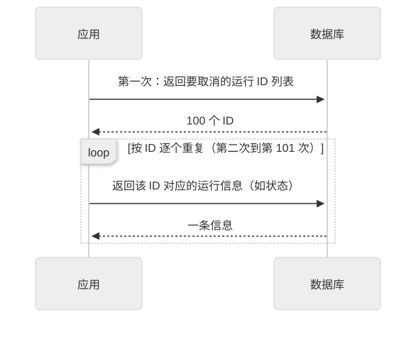
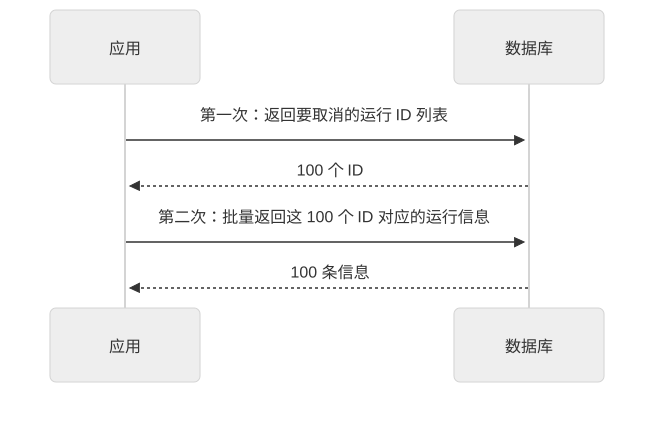

# 第 22 章：理解代码库与过去的工作

[目录](README.md) · [上一篇](27-chapter.md) · [下一篇](29-chapter.md) · [English](../en/28-chapter.md)

作者：kaito · [日文原文](https://zenn.dev/sc30gsw/books/080faba713547b/viewer/788746) · [作者英文版](https://zenn.dev/sc30gsw/books/7ff701b9811d04/viewer/031877)

来源快照：2026-10-03。中文为 AI 辅助译稿，尚未完成人工终审；正文中的“我”指原作者。

[Authorization / 授权记录](../AUTHORIZATION.md)

<!-- book-body:start -->
本章介绍以下四项 Skill。

1. [`/how`](https://github.com/cursor/plugins/blob/main/pstack/skills/how/SKILL.md)
2. [`/why`](https://github.com/cursor/plugins/blob/main/pstack/skills/why/SKILL.md)
3. [`/teach`](https://github.com/cursor/plugins/blob/main/pstack/skills/teach/SKILL.md)
4. [`/recall`](https://github.com/cursor/plugins/blob/main/pstack/skills/recall/SKILL.md)

四项 Skill 都用于调查当前代码和以往工作。该用哪一项，<strong>取决于想知道什么</strong>。

选择方式如下。

- <strong>现在如何运行</strong>（例如取消运行时会经过哪些函数、如何修改数据库）……`/how`
- <strong>为什么形成了当前的设计</strong>（例如重试上限为什么是 5）……`/why`
- <strong>希望把这两方面合成易懂的解释</strong>（例如想充分理解这个 PR 如何改变重试机制）……`/teach`
- <strong>从上次中断处继续工作</strong>（例如上周的导出任务推进到了哪里、哪些修改被撤回）……`/recall`

调查已完成的变更可能破坏什么、差异有哪些弱点的 Skill，将在[第 27 章](https://zenn.dev/sc30gsw/books/080faba713547b/viewer/997880)介绍。

本章先列出四项 Skill，再逐项从使用时机、步骤和输出三个角度说明。原文提供请求示例的 Skill，也会附上示例。

最后总结如何区分相似的 Skill 与 Playbook。

<a id="%E3%81%93%E3%81%AE%E7%AB%A0%E3%81%AE%E6%A7%8B%E6%88%90"></a>


## 本章结构

本章结构如下。

- 四项 Skill 一览
- `/how` 在变更前解释代码行为，让人能在脑中追踪执行过程
- `/why` 区分有记录佐证的理由与推测，回答代码为何形成现状
- `/teach` 用通俗语言解释代码机制与原因，直到人能够理解
- `/recall` 收集近期工作的经过，让人从上次失败处继续
- 根据眼前的问题选择 /how、/why、/teach、/recall 或「Session pickup」
- 总结

<a id="4%E3%81%A4%E3%81%AEskill%E3%81%AE%E4%B8%80%E8%A6%A7"></a>


## 四项 Skill 一览

<table class="code-line" data-line="36">
<thead class="code-line" data-line="36">
<tr class="code-line" data-line="36">
<th>Skill</th>
<th>简述</th>
<th>主要问题</th>
</tr>
</thead>
<tbody class="code-line" data-line="38">
<tr class="code-line" data-line="38">
<td><code>/how</code></td>
<td>解释当前代码的行为（触发条件、经过的函数、数据流）</td>
<td>X 如何运行？这段代码应该放在哪里？</td>
</tr>
<tr class="code-line" data-line="39">
<td><code>/why</code></td>
<td>从提交、PR、工单等记录调查代码为何形成现状，并标明每个理由的可信程度</td>
<td>为什么会这样？为什么选择 Y？</td>
</tr>
<tr class="code-line" data-line="40">
<td>
<code>/teach</code></td>
<td>
调用 <code>/how</code> 和 <code>/why</code>，把结果合成一份从通俗定义开始的解释</td>
<td>我想真正理解它</td>
</tr>
<tr class="code-line" data-line="41">
<td><code>/recall</code></td>
<td>从个人聊天记录及共享记录（如 PR、工单、生产错误）整理近期工作推进到哪里、哪些事情不顺利</td>
<td>我做到哪一步了？发生了什么？</td>
</tr>
</tbody>
</table>

四项 Skill 都<strong>只在按名称调用时运行</strong>。

四个 `SKILL.md` 都设置了 `disable-model-invocation: true`，禁止 Agent 根据会话内容自行选择运行。因此，只有使用者按名称调用，或 `/poteto-mode` 及其他 Skill 在步骤中按名称调用时，它们才会运行。

调用者的区别如下。

- <strong>`/how`、`/why`</strong>……`/poteto-mode` 会按 Playbook 步骤调用它们。`/how` 还会依据「[Non-negotiables](https://github.com/cursor/plugins/blob/main/pstack/skills/poteto-mode/SKILL.md#non-negotiables)」一节的规则调用。其他 Skill 也会在步骤中调用：`/teach`、`/architect`、`/no-comments` 会调用 `/how`；`/teach`、`/recall`、`/architect`、`/no-comments` 会调用 `/why`。使用者也可以按名称直接调用。
- <strong>`/teach`、`/recall`</strong>……它们没有出现在 `/poteto-mode` 的「Non-negotiables」规则、Playbook 步骤或其他 Skill 的步骤中，因此只在使用者按名称调用时运行。

<a id="%2Fhow-%E3%81%AF%E3%80%81%E5%A4%89%E6%9B%B4%E3%81%AE%E5%89%8D%E3%81%AB%E3%80%81%E3%82%B3%E3%83%BC%E3%83%89%E3%81%AE%E6%8C%99%E5%8B%95%E3%82%92%E9%A0%AD%E3%81%AE%E4%B8%AD%E3%81%A7%E3%81%9F%E3%81%A9%E3%82%8C%E3%82%8B%E3%82%88%E3%81%86%E3%81%AB%E8%AA%AC%E6%98%8E%E3%81%99%E3%82%8B"></a>


## `/how` 在变更前解释代码行为，让人能在脑中追踪执行过程

`/how` 会解释代码行为，详细程度足以让刚加入该子系统的资深工程师<strong>在脑中重现执行过程</strong>。

<aside class="msg message"><span class="msg-symbol">!</span><div class="msg-content">
<p class="code-line" data-line="57"><strong>子系统</strong>……应用中负责一项完整功能的部分，例如取消运行、登录或支付。它通常横跨多个文件或模块。</p>
</div></aside>

在脑中重现，指读者无需打开代码，就能追踪处理从什么事件开始、经过哪些文件中的哪些函数，以及数据流向哪里。

解释的目的是让读者把握流程，因此无需逐行注释源码，写成过于琐碎的说明。

例如，对于取消运行的机制，读者应能在不打开代码的情况下说明以下流程（文件名和函数名只是示例）。

<span class="embed-block zenn-embedded zenn-embedded-mermaid"><iframe data-content="flowchart%20TD%0A%20%20%20%20A%5B%22%E3%81%8D%E3%81%A3%E3%81%8B%E3%81%91%EF%BC%9A%E5%88%A9%E7%94%A8%E8%80%85%E3%81%8C%E3%82%AD%E3%83%A3%E3%83%B3%E3%82%BB%E3%83%AB%E3%83%9C%E3%82%BF%E3%83%B3%E3%82%92%E6%8A%BC%E3%81%99%22%5D%20--%3E%20B%5B%22api%2Fruns.ts%20%E3%81%AE%20cancelRun()%22%5D%0A%20%20%20%20B%20--%3E%20C%5B%22services%2Frunner.ts%20%E3%81%AE%20stopRun()%22%5D%0A%20%20%20%20C%20--%3E%20D%5B%22%E3%83%87%E3%83%BC%E3%82%BF%EF%BC%9Aruns%20%E3%83%86%E3%83%BC%E3%83%96%E3%83%AB%E3%81%AE%20status%20%E3%82%92%20cancelled%20%E3%81%AB%E6%9B%B4%E6%96%B0%E3%81%99%E3%82%8B%22%5D" frameborder="0" id="zenn-embedded__e4cb051502854" loading="lazy" scrolling="no" src="https://embed.zenn.studio/mermaid#zenn-embedded__e4cb051502854"></iframe></span>

<!-- book-diagram-link:start -->


[查看图示 1](../diagrams/zh-CN/28-01.md)
<!-- book-diagram-link:end -->

<a id="%E4%BD%BF%E3%81%84%E3%81%A9%E3%81%8D%EF%BC%9A%E3%82%B3%E3%83%BC%E3%83%89%E3%81%AE%E6%8C%99%E5%8B%95%E3%81%AE%E8%AA%AC%E6%98%8E%E3%81%A8%E3%80%81%E3%81%A9%E3%81%93%E3%81%AB%E7%BD%AE%E3%81%8F%E3%81%8B%E3%81%AE%E5%95%8F%E3%81%84"></a>


### 使用时机：解释代码行为，以及询问代码应该放在哪里

在修改代码前，希望了解子系统的行为（例如取消运行依次经过哪些函数），或询问「这段代码应放在哪里」「放在这一层是否合适」时使用。这里的层指按职责划分的代码层，例如页面、API、数据库读写。

若要问「为什么这样设计」等动机，应使用 `/why`。

<a id="%E6%89%8B%E9%A0%86%EF%BC%9A%E4%BA%8B%E5%AE%9F%E3%82%92%E9%9B%86%E3%82%81%E3%82%8B%E5%BD%B9%E3%81%A8%E3%80%81%E8%AA%AC%E6%98%8E%E3%82%92%E6%9B%B8%E3%81%8F%E5%BD%B9%E3%82%92%E5%88%86%E3%81%91%E3%82%8B"></a>


### 步骤：分开收集事实与撰写解释

若问题简单（例如「函数 X 如何运行」，范围限于一个模块），由<strong>explainer</strong>（解释者）一次完成调查和解释。

若问题横跨多个文件或服务（例如整个子系统的结构），Agent 将问题拆成 2～4 个角度，<strong>explorer</strong>（调查者）会被<strong>并行启动</strong>，再由 explainer 整合结果。

角度指调查同一子系统时互不重叠的部分。例如取消运行机制可分为「接收取消请求」「停止运行」「更新数据库」。

若不确定问题简单还是复杂，Agent 将其视为简单问题，只用 explainer 调查，不启动 explorer。

<span class="embed-block zenn-embedded zenn-embedded-mermaid"><iframe data-content="flowchart%20TD%0A%20%20%20%20Q%5B%E5%95%8F%E3%81%84%5D%20--%3E%20J%7B%E5%8D%98%E7%B4%94%E3%81%8B%E3%80%81%E8%A4%87%E6%95%B0%E3%81%AE%E3%83%95%E3%82%A1%E3%82%A4%E3%83%AB%E3%82%84%E3%82%B5%E3%83%BC%E3%83%93%E3%82%B9%E3%81%AB%E3%81%BE%E3%81%9F%E3%81%8C%E3%82%8B%E3%81%8B%7D%0A%20%20%20%20J%20--%3E%7C%E5%8D%98%E7%B4%94%7C%20E1%5Bexplainer%20%E3%81%8C1%E5%9B%9E%E3%81%A7%E8%AA%BF%E3%81%B9%E3%81%A6%E8%AA%AC%E6%98%8E%E3%81%99%E3%82%8B%5D%0A%20%20%20%20J%20--%3E%7C%E3%81%BE%E3%81%9F%E3%81%8C%E3%82%8B%7C%20S%5B%E5%95%8F%E3%81%84%E3%82%922%E3%80%9C4%E3%81%AE%E5%88%87%E3%82%8A%E5%8F%A3%E3%81%AB%E5%88%86%E3%81%91%E3%82%8B%5D%0A%20%20%20%20S%20--%3E%20X1%5Bexplorer%201%5D%0A%20%20%20%20S%20--%3E%20X2%5Bexplorer%202%5D%0A%20%20%20%20S%20--%3E%20X3%5Bexplorer%203%5D%0A%20%20%20%20X1%20--%3E%20E2%5Bexplainer%20%E3%81%8C%E4%BA%8B%E5%AE%9F%E3%81%AE%E4%B8%80%E8%A6%A7%E3%82%92%E7%B5%B1%E5%90%88%E3%81%97%E3%81%A6%E8%AA%AC%E6%98%8E%E3%81%99%E3%82%8B%5D%0A%20%20%20%20X2%20--%3E%20E2%0A%20%20%20%20X3%20--%3E%20E2" frameborder="0" id="zenn-embedded__07da6c8845611" loading="lazy" scrolling="no" src="https://embed.zenn.studio/mermaid#zenn-embedded__07da6c8845611"></iframe></span>

<!-- book-diagram-link:start -->


[查看图示 2](../diagrams/zh-CN/28-02.md)
<!-- book-diagram-link:end -->

无论采用哪条路径，供使用者阅读的解释都由 explainer 撰写。explorer 只收集解释所需的事实。

explorer 返回事实清单，包括发现的组件、处理流程、阅读的文件、与其他部分的边界及意外发现，而不撰写正文。

因为面向读者的解释由 explainer 另写，explorer 可以优先考虑调查深度与准确性，无需顾虑文字是否易读。

explorer 不应编造未知或未追踪到的部分，而应如实写下「无法确定 X 如何连接到 Y」。

`/how` 只负责解释，因此其所有子 Agent 都在不修改文件的只读模式下运行。

<a id="%E5%87%BA%E5%8A%9B%EF%BC%9Aoverview-%E3%81%8B%E3%82%89-gotchas-%E3%81%BE%E3%81%A7%E3%81%AE5%E3%81%A4%E3%81%AE%E8%A6%8B%E5%87%BA%E3%81%97%E3%81%A7%E6%9B%B8%E3%81%8F"></a>


### 输出：用 Overview 到 Gotchas 的五个标题组织内容

解释的目标，是让不熟悉该领域的人读完后，能够有把握地开始工作。

为此，explainer 按全貌、细节、工作入口的顺序使用以下五个标题；不适用的标题可省略。以下示例以「取消运行的机制」为问题。

- <strong>Overview（概述）</strong>……说明机制是什么、做什么、为何存在，让读者读完这部分就能决定是否继续（例如取消机制负责从使用者操作到停止运行的流程）。
- <strong>Key Concepts（关键概念）</strong>……列出理解后文所需的类型与服务（例如表示运行的类型、接收取消请求的服务）。
- <strong>How It Works（运行机制）</strong>……这是最长的部分，说明触发条件、处理步骤和数据流（例如取消请求依次经过哪些函数并修改数据库状态）。
- <strong>Where Things Live（文件位置）</strong>……简要列出相关文件或目录及其内容，只列开始在该领域工作时必须打开的文件（例如接收取消请求的 `api/runs.ts`、停止运行的 `services/runner.ts`）。
- <strong>Gotchas（注意事项）</strong>……说明仅看代码不易发现的细节、意外行为、当前设计的来历和容易犯错之处（例如取消后正在运行的处理不会立即停止，而是完成当前阶段才停止；所以页面显示「已取消」后，处理仍可能继续几秒）。

若处理流程横跨多个组件，explainer 也会加入图示。不过，图示是为了说明流程；仅靠文字即可讲清楚时便省略。

<a id="%E4%BE%9D%E9%A0%BC%E3%81%AE%E4%BE%8B%EF%BC%9A%E5%AE%9F%E9%9A%9B%E3%81%AB%E6%8C%81%E3%81%A3%E3%81%A6%E3%81%84%E3%82%8B%E5%95%8F%E3%81%84%E3%82%92%E3%81%9D%E3%81%AE%E3%81%BE%E3%81%BE%E8%81%9E%E3%81%8F"></a>


### 请求示例：直接问自己实际关心的问题

`/how` 会在许多 Playbook 的步骤中被调用，典型例子如下。

- 「[<strong>Bug fix</strong>](https://github.com/cursor/plugins/blob/main/pstack/skills/poteto-mode/playbooks/bug-fix.md)」（修复缺陷）
- 「[<strong>Feature</strong>](https://github.com/cursor/plugins/blob/main/pstack/skills/poteto-mode/playbooks/feature.md)」（新增功能）
- 「[<strong>Refactoring</strong>](https://github.com/cursor/plugins/blob/main/pstack/skills/poteto-mode/playbooks/refactoring.md)」（在不改变行为的前提下整理结构）

此外，`/poteto-mode` 的「Non-negotiables」规定：作出不显而易见的变更或设计判断，以及确认「真的没问题吗」时，应使用 `/how`。

除 Playbook 外，`/teach`、用于确定设计的 `/architect`（[第 24 章](https://zenn.dev/sc30gsw/books/080faba713547b/viewer/2ad346)）、用于审查差异注释的 `/no-comments`（[第 31 章](https://zenn.dev/sc30gsw/books/080faba713547b/viewer/8960d3)），也会在步骤中调用 `/how`。

直接调用时，提出自己真正关心的问题即可。[README](https://github.com/cursor/plugins/blob/main/pstack/README.md) 的示例如下。

```
/how do we cancel runs? do we have an n+1 when we look up every run to cancel?
// 実行のキャンセルはどう動いてる？キャンセル対象の実行を1件ずつ引いていて、N+1になっていない？
```

<aside class="msg message"><span class="msg-symbol">!</span><div class="msg-content">
<p class="code-line" data-line="146"><strong>N+1</strong>……取得列表的一次查询之后，又对每个条目分别发起一次查询的写法。</p>
<p class="code-line" data-line="148">例如，要取消 100 次运行，应用可能向数据库发起 101 次查询。每次查询都要等待，因此条目越多，处理越慢。</p>
<span class="embed-block zenn-embedded zenn-embedded-mermaid"><iframe data-content="sequenceDiagram%0A%20%20%20%20participant%20App%20as%20%E3%82%A2%E3%83%97%E3%83%AA%0A%20%20%20%20participant%20DB%20as%20%E3%83%87%E3%83%BC%E3%82%BF%E3%83%99%E3%83%BC%E3%82%B9%0A%20%20%20%20App-%3E%3EDB%3A%201%E5%9B%9E%E7%9B%AE%EF%BC%9A%E3%82%AD%E3%83%A3%E3%83%B3%E3%82%BB%E3%83%AB%E3%81%99%E3%82%8B%E5%AE%9F%E8%A1%8C%E3%81%AEID%E3%82%92%E4%B8%80%E8%A6%A7%E3%81%A7%E8%BF%94%E3%81%97%E3%81%A6%0A%20%20%20%20DB--%3E%3EApp%3A%20100%E4%BB%B6%E5%88%86%E3%81%AEID%0A%20%20%20%20loop%20ID%E3%81%94%E3%81%A8%E3%81%AB%E7%B9%B0%E3%82%8A%E8%BF%94%E3%81%99%EF%BC%882%E5%9B%9E%E7%9B%AE%E3%80%9C101%E5%9B%9E%E7%9B%AE%EF%BC%89%0A%20%20%20%20%20%20%20%20App-%3E%3EDB%3A%20%E3%81%93%E3%81%AEID%E3%81%AE%E5%AE%9F%E8%A1%8C%E3%81%AE%E6%83%85%E5%A0%B1%EF%BC%88%E7%8A%B6%E6%85%8B%E3%81%AA%E3%81%A9%EF%BC%89%E3%82%92%E8%BF%94%E3%81%97%E3%81%A6%0A%20%20%20%20%20%20%20%20DB--%3E%3EApp%3A%201%E4%BB%B6%E5%88%86%E3%81%AE%E6%83%85%E5%A0%B1%0A%20%20%20%20end" frameborder="0" id="zenn-embedded__6bf5edbc83f2c" loading="lazy" scrolling="no" src="https://embed.zenn.studio/mermaid#zenn-embedded__6bf5edbc83f2c"></iframe></span>

<!-- book-diagram-link:start -->


[查看图示 3](../diagrams/zh-CN/28-03.md)
<!-- book-diagram-link:end -->
<p class="code-line" data-line="162">要消除 N+1，应用应停止逐个 ID 查询，在第二次查询中一次传入全部 100 个 ID。数据库会一次返回这 100 条信息，总查询次数便降至两次，如下图所示。</p>
<span class="embed-block zenn-embedded zenn-embedded-mermaid"><iframe data-content="sequenceDiagram%0A%20%20%20%20participant%20App%20as%20%E3%82%A2%E3%83%97%E3%83%AA%0A%20%20%20%20participant%20DB%20as%20%E3%83%87%E3%83%BC%E3%82%BF%E3%83%99%E3%83%BC%E3%82%B9%0A%20%20%20%20App-%3E%3EDB%3A%201%E5%9B%9E%E7%9B%AE%EF%BC%9A%E3%82%AD%E3%83%A3%E3%83%B3%E3%82%BB%E3%83%AB%E3%81%99%E3%82%8B%E5%AE%9F%E8%A1%8C%E3%81%AEID%E3%82%92%E4%B8%80%E8%A6%A7%E3%81%A7%E8%BF%94%E3%81%97%E3%81%A6%0A%20%20%20%20DB--%3E%3EApp%3A%20100%E4%BB%B6%E5%88%86%E3%81%AEID%0A%20%20%20%20App-%3E%3EDB%3A%202%E5%9B%9E%E7%9B%AE%EF%BC%9A%E3%81%93%E3%81%AE100%E4%BB%B6%E5%88%86%E3%81%AEID%E3%81%AE%E5%AE%9F%E8%A1%8C%E3%81%AE%E6%83%85%E5%A0%B1%E3%82%92%E3%80%81%E3%81%BE%E3%81%A8%E3%82%81%E3%81%A6%E8%BF%94%E3%81%97%E3%81%A6%0A%20%20%20%20DB--%3E%3EApp%3A%20100%E4%BB%B6%E5%88%86%E3%81%AE%E6%83%85%E5%A0%B1" frameborder="0" id="zenn-embedded__27ed2ffced186" loading="lazy" scrolling="no" src="https://embed.zenn.studio/mermaid#zenn-embedded__27ed2ffced186"></iframe></span>

<!-- book-diagram-link:start -->


[查看图示 4](../diagrams/zh-CN/28-04.md)
<!-- book-diagram-link:end -->
</div></aside>

随附指南的 [`03-understand.md`](https://github.com/cursor/plugins/blob/main/pstack/docs/guide/03-understand.md) 提醒使用者：不要以为「反正 Agent 会读代码」，就跳过该页面介绍的 Skill（`/how`、`/why`、`/teach`、`/recall`）。

指南这样提醒，是因为<strong>Agent 若不先追踪代码行为就开始修改，很容易在第一个看似合理的位置只修补症状，没有修复根本原因</strong>。只修补症状，根因仍在，后续便会出现新的缺陷（[第 19 章](https://zenn.dev/sc30gsw/books/080faba713547b/viewer/1fb019)）。

同一页面还指出，先使用 `/how`，比日后处理因此产生的缺陷成本更低。

<a id="%2Fwhy-%E3%81%AF%E3%80%81%E3%82%B3%E3%83%BC%E3%83%89%E3%81%8C%E4%BB%8A%E3%81%AE%E5%BD%A2%E3%81%AB%E3%81%AA%E3%81%A3%E3%81%9F%E7%90%86%E7%94%B1%E3%82%92%E3%80%81%E8%A8%98%E9%8C%B2%E3%81%A7%E8%A3%8F%E3%81%A5%E3%81%91%E3%82%89%E3%82%8C%E3%82%8B%E3%82%82%E3%81%AE%E3%81%A8%E6%8E%A8%E6%B8%AC%E3%81%AB%E5%88%86%E3%81%91%E3%81%A6%E7%AD%94%E3%81%88%E3%82%8B"></a>


## `/why` 区分有记录佐证的理由与推测，回答代码为何形成现状

`/why` 是一项 Skill，用于解释代码为何形成现状，并<strong>区分有记录佐证的理由与推测</strong>。

`/how` 回答「如何运行」，`/why` 则回答「哪些背景和判断使它形成当前设计」。

如果调查后找不到理由，`/why` 会回答「不知道」，不以推测填空。因为<strong>如果把推测写得很肯定，使用者就可能把推测当作事实，继而据此作决定</strong>。

<a id="%E4%BD%BF%E3%81%84%E3%81%A9%E3%81%8D%EF%BC%9A%E8%A8%AD%E8%A8%88%E3%81%AE%E7%90%86%E7%94%B1%E3%80%81%E3%83%AA%E3%82%B0%E3%83%AC%E3%83%83%E3%82%B7%E3%83%A7%E3%83%B3%E3%80%81%E3%81%97%E3%81%8D%E3%81%84%E5%80%A4%E3%81%AE%E7%94%B1%E6%9D%A5%E3%82%92%E5%95%8F%E3%81%86%E3%81%A8%E3%81%8D"></a>


### 使用时机：询问设计理由、回归问题或阈值来源

适用于询问「为什么这样运行」「为什么选择 Y」等设计理由，调查回归问题（原本可用的功能因变更而失效）、事故复盘（故障后整理原因和防止再发生的办法），或阈值来源（例如重试上限为何为 5）。

如果要问运行时的行为，即「现在如何运行」，应使用 `/how`。

<a id="%E6%89%8B%E9%A0%86%EF%BC%9A%E8%A8%BC%E6%8B%A0%E3%81%AE%E7%BD%AE%E3%81%8D%E5%A0%B4%E6%89%80%E3%81%94%E3%81%A8%E3%81%AB%E8%AA%BF%E6%9F%BB%E5%BD%B9%E3%82%921%E4%BD%93%E3%81%9A%E3%81%A4%E7%BD%AE%E3%81%8D%E3%80%81%E4%B8%A6%E5%88%97%E3%81%AB%E8%AA%BF%E3%81%B9%E3%82%8B"></a>


### 步骤：按证据所在位置分配调查者，并行调查

`/why` 将可能留下设计理由的地方分为下表七类。

<table class="code-line" data-line="200">
<thead class="code-line" data-line="200">
<tr class="code-line" data-line="200">
<th>类别</th>
<th>MCP 示例</th>
<th>特别适合回答的问题</th>
</tr>
</thead>
<tbody class="code-line" data-line="202">
<tr class="code-line" data-line="202">
<td>源码管理历史</td>
<td>git、<code>gh</code>（在终端操作 GitHub PR 和 Issue 的官方 CLI）</td>
<td>审查过程中写下的实现理由（例如 PR 描述）。这是唯一在任何环境中都一定可用的来源，因此始终调查</td>
</tr>
<tr class="code-line" data-line="203">
<td>问题与工单管理</td>
<td>Linear、Jira</td>
<td>产品或业务动机（例如应客户要求而新增）</td>
</tr>
<tr class="code-line" data-line="204">
<td>长篇文档</td>
<td>Notion、Google Docs</td>
<td>写代码前的设计理由（例如比较方案 A 与 B 的设计文档）</td>
</tr>
<tr class="code-line" data-line="205">
<td>即时聊天</td>
<td>Slack</td>
<td>未写进文档的讨论</td>
</tr>
<tr class="code-line" data-line="206">
<td>基础设施观测</td>
<td>Datadog</td>
<td>导致超时或重试设计的运行环境条件</td>
</tr>
<tr class="code-line" data-line="207">
<td>错误追踪</td>
<td>Sentry</td>
<td>导致防御性代码（例如检查 null、重试）的异常</td>
</tr>
<tr class="code-line" data-line="208">
<td>产品分析</td>
<td>BigQuery</td>
<td>决定代码形态的产品或数据背景（例如阈值数字的来源）</td>
</tr>
</tbody>
</table>

Agent 首先调查连接到使用者 Cursor 的 MCP（Model Context Protocol，即连接 Agent 与外部工具或数据的机制），确认每个 MCP 可读取哪类证据。

例如，若连接了 Linear MCP，就归入「问题与工单管理」；若连接了 Slack MCP，就归入「即时聊天」。

然后，Agent 为每个已连接 MCP 的类别并行启动一名<strong>调查者</strong>（investigator）。源码管理历史即使没有 MCP，也可以用 git 和 `gh` 读取，因此始终调查。

启动调查者前，Agent 使用如下命令收集目标文件的行、提交与 PR，再把线索交给所有调查者，让他们从具体代码开始调查。

```
# 対象の行を最後に変えたコミットを表示する
git blame -L <start>,<end> <file>

# PRの説明と議論を表示する
gh pr view <number> --json title,body,author,createdAt,mergedAt,labels,closingIssuesReferences,comments,reviews
```

调查结果由<strong>synthesizer</strong>（整合者）汇总，流程如下。

<span class="embed-block zenn-embedded zenn-embedded-mermaid"><iframe data-content="flowchart%20TD%0A%20%20%20%20A%5B%22git%20blame%20%E3%81%A8%20gh%20pr%20view%20%E3%81%A7%E3%80%81%E5%AF%BE%E8%B1%A1%E3%81%AE%E8%A1%8C%E3%80%81%E3%82%B3%E3%83%9F%E3%83%83%E3%83%88%E3%80%81PR%E3%82%92%E9%9B%86%E3%82%81%E3%82%8B%22%5D%20--%3E%7C%E9%9B%86%E3%82%81%E3%81%9F%E6%89%8B%E3%81%8C%E3%81%8B%E3%82%8A%E3%82%92%E5%85%A8%E5%93%A1%E3%81%AB%E6%B8%A1%E3%81%99%7C%20B%5B%E4%BD%BF%E3%81%88%E3%82%8BMCP%E3%81%94%E3%81%A8%E3%81%AB%E8%AA%BF%E6%9F%BB%E5%BD%B9%E3%82%921%E4%BD%93%E3%81%9A%E3%81%A4%E8%B5%B7%E5%8B%95%E3%81%99%E3%82%8B%5D%0A%20%20%20%20B%20--%3E%20C1%5B%E3%82%BD%E3%83%BC%E3%82%B9%E7%AE%A1%E7%90%86%5D%0A%20%20%20%20B%20--%3E%20C2%5B%E3%83%81%E3%82%B1%E3%83%83%E3%83%88%5D%0A%20%20%20%20B%20--%3E%20C3%5B%E9%95%B7%E6%96%87%E3%83%89%E3%82%AD%E3%83%A5%E3%83%A1%E3%83%B3%E3%83%88%5D%0A%20%20%20%20B%20--%3E%20C4%5B%E3%83%81%E3%83%A3%E3%83%83%E3%83%88%5D%0A%20%20%20%20B%20--%3E%20C5%5B%E3%82%A4%E3%83%B3%E3%83%95%E3%83%A9%5D%0A%20%20%20%20B%20--%3E%20C6%5B%E3%82%A8%E3%83%A9%E3%83%BC%E8%BF%BD%E8%B7%A1%5D%0A%20%20%20%20B%20--%3E%20C7%5B%E3%83%97%E3%83%AD%E3%83%80%E3%82%AF%E3%83%88%E5%88%86%E6%9E%90%5D%0A%20%20%20%20C1%20%26%20C2%20%26%20C3%20%26%20C4%20%26%20C5%20%26%20C6%20%26%20C7%20--%3E%7C%E8%A6%8B%E3%81%A4%E3%81%8B%E3%82%89%E3%81%AA%E3%81%8B%E3%81%A3%E3%81%9F%E7%B5%90%E6%9E%9C%E3%82%82%E5%90%AB%E3%82%81%E3%81%A6%E8%BF%94%E3%81%99%7C%20D%5Bsynthesizer%20%E3%81%8C%E3%80%81%E4%B8%BB%E5%BC%B5%E3%81%94%E3%81%A8%E3%81%AB%E7%A2%BA%E3%81%8B%E3%81%95%E3%81%AE%E6%AE%B5%E9%9A%8E%E3%82%92%E4%BB%98%E3%81%91%E3%81%A6%E3%81%BE%E3%81%A8%E3%82%81%E3%82%8B%5D" frameborder="0" id="zenn-embedded__50f7f7e08b5be" loading="lazy" scrolling="no" src="https://embed.zenn.studio/mermaid#zenn-embedded__50f7f7e08b5be"></iframe></span>

<!-- book-diagram-link:start -->


[查看图示 5](../diagrams/zh-CN/28-05.md)
<!-- book-diagram-link:end -->

调查者并行工作；若什么都没找到，也会向 synthesizer 返回「未找到」的结果。

synthesizer 还会记录哪些类别没有调查、哪些类别调查后没有发现，并说明理由。<strong>「查过但没找到」也是调查结果；如果不记录，使用者就无法区分没有调查和调查后没有发现</strong>。

<a id="%E5%87%BA%E5%8A%9B%EF%BC%9A%E3%81%99%E3%81%B9%E3%81%A6%E3%81%AE%E4%B8%BB%E5%BC%B5%E3%82%92%E3%80%81direct-%E3%81%8B%E3%82%89-unknown-%E3%81%BE%E3%81%A7%E3%81%AE%E7%A2%BA%E3%81%8B%E3%81%95%E3%81%AE5%E6%AE%B5%E9%9A%8E%E3%81%AB%E5%88%86%E3%81%91%E3%82%8B"></a>


### 输出：将所有主张按可信程度分为 Direct 到 Unknown 五级

代码能告诉我们它做了什么，却不能告诉我们它为什么存在。理由只可能留在提交、PR、工单和聊天等不完整的记录中。

因此 `/why` 按可信程度把每项主张分为以下五级。

下表示例针对「重试上限为什么是 5」这一问题。

<table class="code-line" data-line="253">
<thead class="code-line" data-line="253">
<tr class="code-line" data-line="253">
<th>级别</th>
<th>含义</th>
<th>示例</th>
</tr>
</thead>
<tbody class="code-line" data-line="255">
<tr class="code-line" data-line="255">
<td>Direct（直接证据）</td>
<td>有作者明确写出理由的记录</td>
<td>代码注释写明「上游 API 拒绝第六次及以后的重试，因此在第五次停止」</td>
</tr>
<tr class="code-line" data-line="256">
<td>Supported（有证据支持）</td>
<td>没有明确说明，但多项间接证据一致</td>
<td>把上限设为 5 的 PR，以及同一周的其他 PR 和工单，都提到了同一故障</td>
</tr>
<tr class="code-line" data-line="257">
<td>Inferred（推断）</td>
<td>根据上下文作出的合理解读，没有明确佐证</td>
<td>代码库其他地方的上限也是 5，因此可能沿用了团队惯例</td>
</tr>
<tr class="code-line" data-line="258">
<td>Speculative（推测）</td>
<td>证据薄弱，其他解释同样可能成立</td>
<td>或许是为了满足 SLA（承诺的响应时间），但 SLA 文档并未提到数字 5</td>
</tr>
<tr class="code-line" data-line="259">
<td>Unknown（未知）</td>
<td>已调查但未查明，应写明搜索了什么、在哪里搜索</td>
<td>用「retry」搜索工单，并阅读了修改该文件的六个 PR，仍未找到理由</td>
</tr>
</tbody>
</table>

synthesizer 只对<strong>Direct 和 Supported 级别的主张</strong>使用「所以是 X」这类肯定说法，因为这种句式意味着有证据支持因果关系。

例如，对于 Direct 主张，可明确写下「上限如此设定，是因为上游 API 拒绝第六次及以后的重试」，并附上来源。

对于 Inferred 主张，则应写「这个上限可能沿用了团队惯例」，让读者看出这只是推断。

即便使用者在问题中提出「我觉得是出于性能考虑」等假设，`/why` 也不会直接认可，而会将其视为候选解释，独立查证。

poteto 在「The Complete Guide to pstack」[Part 2](https://x.com/poteto/status/2097732320606507506) 中写道：<strong>请求 Agent 工作时，最好不要先说出自己的假设，以免把 Agent 引向错误方向</strong>。

若使用者打算在调查后修改代码，`/why` 会<strong>把调查结果转成 Preserve / Change / Avoid / Risk（保留、变更、避免、风险）四类约束，供变更计划使用</strong>。

例如，若调查重试上限的原因是为了修改它，可以得到以下约束。

```
Preserve: 上流のAPIが拒む回数を超えない（上限の理由として記録がある）
Change:   上限の値をコードに直接書かず、上流のAPIの制限と同じ場所で決める
Avoid:    上限をなくして、成功するまで再試行し続ける
Risk:     上流のAPIの制限が変わっていれば、今の5という値は合わなくなる
```

这样把调查结果分为四类约束，可以避免在制定变更计划时因不了解应保留的理由而无意中将其删除。

<a id="%E4%BE%9D%E9%A0%BC%E3%81%AE%E4%BE%8B%EF%BC%9A%E3%80%8C%E8%AA%B0%E3%82%82%E7%90%86%E7%94%B1%E3%82%92%E6%9B%B8%E3%81%8D%E6%AE%8B%E3%81%97%E3%81%A6%E3%81%84%E3%81%AA%E3%81%84%E3%80%8D%E3%82%82%E4%B8%80%E3%81%A4%E3%81%AE%E7%AD%94%E3%81%88%E3%81%AB%E3%81%AA%E3%82%8B"></a>


### 请求示例：「没人留下理由」也是一种答案

`/why` 会由「[<strong>Investigation</strong>](https://github.com/cursor/plugins/blob/main/pstack/skills/poteto-mode/playbooks/investigation.md)」（针对可通过阅读代码或历史回答的问题提供带引用的答复）和「<strong>Bug fix</strong>」Playbook 调用。`/recall`、`/teach`、`/architect`（[第 24 章](https://zenn.dev/sc30gsw/books/080faba713547b/viewer/2ad346)）、`/no-comments`（[第 31 章](https://zenn.dev/sc30gsw/books/080faba713547b/viewer/8960d3)）也会在步骤中调用 `/why`。

`03-understand.md` 给出了以下请求示例。

```
/why was the retry limit set to five? does the reason still hold?
// リトライ上限はなぜ5にしたの？その理由は今も成り立つ？
```

同一页面指出，「没人留下理由」本身也是一种答案。

知道理由没有记录后，使用者便可决定询问原作者，或停止进一步调查。因此 `/why` 也会报告未找到理由的结果。

<a id="%2Fteach-%E3%81%AF%E3%80%81%E3%82%B3%E3%83%BC%E3%83%89%E3%81%AE%E4%BB%95%E7%B5%84%E3%81%BF%E3%81%A8%E7%90%86%E7%94%B1%E3%82%92%E3%80%81%E4%BA%BA%E3%81%8C%E7%B4%8D%E5%BE%97%E3%81%A7%E3%81%8D%E3%82%8B%E3%81%BE%E3%81%A7%E5%B9%B3%E6%98%93%E3%81%AB%E8%AA%AC%E6%98%8E%E3%81%99%E3%82%8B"></a>


## `/teach` 用通俗语言解释代码机制与原因，直到人能够理解

`/teach` 是一项<strong>把代码或变更是什么、如何运行、为何这样设计合成一份通俗解释的 Skill</strong>。它的目标是让对方理解，而不是修改任何东西。

poteto 在「The Complete Guide to pstack」Part 2 中写道，和比自己聪明的对象（Agent）一起工作，重要的是让对方用自己能理解的方式重述，这成为 `/teach` 的灵感。

<a id="%E4%BD%BF%E3%81%84%E3%81%A9%E3%81%8D%EF%BC%9A%E8%A6%81%E7%B4%84%E3%81%A7%E3%81%AF%E3%81%AA%E3%81%8F%E3%80%81%E6%9C%AC%E5%BD%93%E3%81%AB%E7%90%86%E8%A7%A3%E3%81%97%E3%81%9F%E3%81%84%E3%81%A8%E3%81%8D"></a>


### 使用时机：希望真正理解，而非只看摘要

当摘要不足以说明问题，使用者希望真正理解一项变更或子系统时使用。

<a id="%E6%89%8B%E9%A0%86%EF%BC%9A%2Fhow-%E3%81%A8-%2Fwhy-%E3%82%92%E5%91%BC%E3%81%B3%E5%87%BA%E3%81%97%E3%80%81%E3%81%9D%E3%81%AE%E7%B5%90%E6%9E%9C%E3%82%921%E3%81%A4%E3%81%AE%E8%AA%AC%E6%98%8E%E3%81%AB%E3%81%BE%E3%81%A8%E3%82%81%E3%82%8B"></a>


### 步骤：调用 /how 和 /why，将结果合成一份解释

<a id="%E8%AA%BF%E6%9F%BB%E3%81%AF%E3%82%84%E3%82%8A%E7%9B%B4%E3%81%95%E3%81%9A%E3%80%81%2Fhow-%E3%81%A8-%2Fwhy-%E3%81%AE%E7%B5%90%E6%9E%9C%E3%82%92%E3%81%BE%E3%81%A8%E3%82%81%E3%82%8B"></a>


#### 汇总 /how 和 /why 的结果，不重复调查

`/teach` 会自己阅读代码，以判断从哪里开始解释什么；但它不会重新做调查，而是<strong>实际调用 `/how` 和 `/why`，再把结果合成一份解释</strong>。

若问题涉及整个子系统，会同时调用两者；若只是小变更，调用 `/how` 或 `/why` 其中一项可能就够了。

<a id="%2Fwhy-%E3%81%AB%E3%81%AF%E3%80%81%E6%97%A2%E5%AE%9A%E3%81%A7%E8%AA%BF%E3%81%B9%E3%82%8B%E7%AF%84%E5%9B%B2%E3%82%92%E7%B5%9E%E3%82%8B%E3%82%88%E3%81%86%E9%A0%BC%E3%82%80"></a>


#### 默认要求 /why 缩小调查范围

`/teach` 调用 `/why` 时，默认要求缩小调查范围（例如只查 git 和另外一两个位置）。调查所有类别会耗时，只有对方主要想了解原因时，才扩大范围。

<a id="%E6%8C%81%E3%81%A1%E5%B8%B0%E3%82%8B%E3%81%B9%E3%81%8D%E5%B0%91%E6%95%B0%E3%81%AE%E7%82%B9%E3%82%92%E6%B1%BA%E3%82%81%E3%80%81%E5%B9%B3%E6%98%93%E3%81%AA%E5%AE%9A%E7%BE%A9%E3%81%8B%E3%82%89%E7%9B%AE%E3%81%AE%E5%89%8D%E3%81%AE%E3%82%B3%E3%83%BC%E3%83%89%E3%81%B8%E3%81%A4%E3%81%AA%E3%81%90"></a>


#### 确定少数值得记住的要点，从通俗定义连接到眼前的代码

解释时，先确定对方需要记住的少数要点，从通俗定义开始，再连接到当前代码。要点取决于对方为何提问（接下来要修改、审查，还是调查缺陷）以及对方已经知道什么；这些可从会话中判断。

例如，先用一般语言定义「虚拟滚动是一种只渲染屏幕可见行的机制」，再连接到当前代码：「在这个应用中，打开很长的聊天记录时会使用虚拟滚动。」

<a id="1%E3%80%9C2%E6%96%87%E3%81%A7%E7%AD%94%E3%81%88%E3%81%9F%E3%82%89%E6%AD%A2%E3%81%BE%E3%82%8A%E3%80%81%E7%9B%B8%E6%89%8B%E3%81%AE%E5%8F%8D%E5%BF%9C%E3%82%92%E5%BE%85%E3%81%A4"></a>


#### 用一两句话回答后停下，等待对方反应

`/teach` 应采用对话形式，而非讲课。它不出小测验，也不要求对方复述；给出一两句话的最简回答后就停下，等待对方反应。如果对方希望深入，再继续展开。

<a id="%E5%9B%B3%E3%81%AF1%E6%9E%9A%E3%81%AB%E5%85%A8%E9%83%A8%E3%82%92%E6%8F%8F%E3%81%8B%E3%81%9A%E3%80%81%E7%B5%84%E3%81%BF%E4%B8%8A%E3%81%8C%E3%82%8B%E9%A0%86%E3%81%AB%E6%8F%8F%E3%81%8D%E7%9B%B4%E3%81%99"></a>


#### 不把所有内容画在一张图上，而是按构建顺序重画

说明机制的图应一次增加一个部件并重画。把所有部件画在一张图上可供查阅，却难以让读者追踪机制如何逐步建立。

例如，从页面到 API、再从 API 到数据库的流程，应依次画出以下三张图。

第一张只画页面到 API。

<span class="embed-block zenn-embedded zenn-embedded-mermaid"><iframe data-content="flowchart%20LR%0A%20%20%20%20UI%5B%E7%94%BB%E9%9D%A2%5D%20--%3E%20API" frameborder="0" id="zenn-embedded__34e8d41cae028" loading="lazy" scrolling="no" src="https://embed.zenn.studio/mermaid#zenn-embedded__34e8d41cae028"></iframe></span>

<!-- book-diagram-link:start -->


[查看图示 6](../diagrams/zh-CN/28-06.md)
<!-- book-diagram-link:end -->

第二张在第一张的基础上重画，加入数据库。

<span class="embed-block zenn-embedded zenn-embedded-mermaid"><iframe data-content="flowchart%20LR%0A%20%20%20%20UI%5B%E7%94%BB%E9%9D%A2%5D%20--%3E%20API%20--%3E%20DB%5B%E3%83%87%E3%83%BC%E3%82%BF%E3%83%99%E3%83%BC%E3%82%B9%5D" frameborder="0" id="zenn-embedded__a132f803ea654" loading="lazy" scrolling="no" src="https://embed.zenn.studio/mermaid#zenn-embedded__a132f803ea654"></iframe></span>

<!-- book-diagram-link:start -->


[查看图示 7](../diagrams/zh-CN/28-07.md)
<!-- book-diagram-link:end -->

第三张重画第二张，加入返回方向的箭头。

<span class="embed-block zenn-embedded zenn-embedded-mermaid"><iframe data-content="flowchart%20LR%0A%20%20%20%20UI%5B%E7%94%BB%E9%9D%A2%5D%20--%3E%20API%20--%3E%20DB%5B%E3%83%87%E3%83%BC%E3%82%BF%E3%83%99%E3%83%BC%E3%82%B9%5D%0A%20%20%20%20DB%20-.%20%E7%B5%90%E6%9E%9C%20.-%3E%20API%0A%20%20%20%20API%20-.%20%E7%B5%90%E6%9E%9C%20.-%3E%20UI" frameborder="0" id="zenn-embedded__cd5dbcb10fb4d" loading="lazy" scrolling="no" src="https://embed.zenn.studio/mermaid#zenn-embedded__cd5dbcb10fb4d"></iframe></span>

<!-- book-diagram-link:start -->


[查看图示 8](../diagrams/zh-CN/28-08.md)
<!-- book-diagram-link:end -->

这样每张图只增加一个部件，读者就能按照机制建立的顺序逐步理解。

<a id="%E5%87%BA%E5%8A%9B%EF%BC%9A%E8%AA%AC%E6%98%8E%E3%81%9D%E3%81%AE%E3%82%82%E3%81%AE%E3%82%92%E3%80%81%E8%A6%81%E7%82%B9%E3%81%8B%E3%82%89%E5%B9%B3%E6%98%93%E3%81%AB%E8%BF%94%E3%81%99"></a>


### 输出：直接给出通俗解释，从要点开始

回复应直接给出解释，而非工作报告。从要点开始，并附上值得继续用 `/how` 或 `/why` 深入调查的问题。

`/teach` 可以为解释而自由调整措辞，但必须保留 `/why` 表示可信程度的词语，例如 Direct 或 Inferred 等级。

「似乎是……」等保留措辞，不是可以随意改写的装饰，而是「记录中找不到佐证」这一调查结果的一部分。因此 `/teach` 不应改写表示可信程度的词语。

<a id="%E4%BE%9D%E9%A0%BC%E3%81%AE%E4%BE%8B%EF%BC%9A%E3%80%8C%E7%B4%8D%E5%BE%97%E3%81%95%E3%81%9B%E3%81%A6%E3%80%8D%E3%81%A8%E9%A0%BC%E3%82%80"></a>


### 请求示例：请对方「说服我」

`/teach` 是由使用者按名称调用的 Skill。`03-understand.md` 提供以下请求示例。

```
/teach me how this PR changes retries. convince me it fixes the cause and not the symptom.
// このPRがリトライをどう変えるか教えて。症状ではなく原因を直していると納得させて。
```

指南建议使用「说服我」（convince me）这一说法，让解释成为可以提出反驳并检验的论证，而非单向讲解。

实际使用方式将在[第 37 章](https://zenn.dev/sc30gsw/books/080faba713547b/viewer/b4b9a1)介绍。

<a id="%2Frecall-%E3%81%AF%E3%80%81%E6%9C%80%E8%BF%91%E3%81%AE%E4%BD%9C%E6%A5%AD%E3%81%AE%E7%B5%8C%E7%B7%AF%E3%82%92%E9%9B%86%E3%82%81%E3%80%81%E5%89%8D%E5%9B%9E%E3%81%AE%E5%A4%B1%E6%95%97%E5%9C%B0%E7%82%B9%E3%81%8B%E3%82%89%E5%86%8D%E9%96%8B%E3%81%A7%E3%81%8D%E3%82%8B%E3%82%88%E3%81%86%E3%81%AB%E3%81%99%E3%82%8B"></a>


## `/recall` 收集近期工作的经过，让人从上次失败处继续

`/recall` 在工作开始或恢复前，重新收集近期工作的经过（做过什么、决定了什么、哪里不顺利），<strong>让工作能够从上次失败处继续</strong>。它简要回答工作推进到哪里、下一步该做什么。

<a id="%E4%BD%BF%E3%81%84%E3%81%A9%E3%81%8D%EF%BC%9A%E3%80%8C%E3%81%A9%E3%81%93%E3%81%BE%E3%81%A7%E3%82%84%E3%81%A3%E3%81%9F%E3%81%8B%E3%80%8D%E3%82%92%E8%81%9E%E3%81%8F%E3%81%A8%E3%81%8D"></a>


### 使用时机：想知道「上次做到哪里」

在开始或恢复工作前，想问「回顾一下 X 的工作」「上次做到哪里了」时使用。

<a id="%E6%89%8B%E9%A0%86%EF%BC%9A%E3%83%81%E3%83%A3%E3%83%83%E3%83%88%E5%B1%A5%E6%AD%B4%E3%81%A8%E5%85%B1%E6%9C%89%E3%81%AE%E8%A8%98%E9%8C%B2%E3%82%92%E4%B8%A6%E5%88%97%E3%81%AB%E8%AA%BF%E3%81%B9%E3%82%8B"></a>


### 步骤：并行调查聊天记录与共享记录

<strong>工作经过分散在两类记录中，因此 `/recall` 两者都要读</strong>。

- <strong>个人聊天记录</strong>……记录做过什么、作出了哪些决定。
- <strong>共享记录</strong>……记录同一代码周围发生的事情，例如用户持续报告的症状、发布后被撤回的修复、生产环境持续出现的错误。

`/recall` 让 `/why` 的调查者查看共享记录。一个功能的缺陷持续越久，相关经过就越可能主要留在共享记录，而不是个人聊天记录。

此时 `/recall` 要求调查者回答的不是「为什么这样设计」，而是「现在是什么状态、试过什么但没有成功、用户一直在报告什么」。

主 Agent 在搜索前确定时间范围（默认最近七天）、主题、工作区（默认当前打开的工作区），并向使用者说明范围后再继续，以便使用者发现范围与预期不同时及时纠正。

除非使用者要求，主 Agent 不读取其他项目的历史。

若目标聊天只有一两条，主 Agent 会直接查找；更多时则让子 Agent 并行阅读历史。原始历史留在子 Agent 中，主 Agent 只接收发现的内容，避免长记录填满主 Agent 的上下文（[第 20 章](https://zenn.dev/sc30gsw/books/080faba713547b/viewer/c155cc)）。

主 Agent 使用 `git` 和 `gh` 核实找到的 PR 或分支的当前状态。聊天记录反映的是当时的状态，此后可能发生合并或撤回。

若使用者只是想继续某一条特定聊天，`/recall` 会把请求转交给「[<strong>Session pickup</strong>](https://github.com/cursor/plugins/blob/main/pstack/skills/poteto-mode/playbooks/session-pickup.md)」Playbook。

<a id="%E5%87%BA%E5%8A%9B%EF%BC%9Acapsule%E3%80%81threads%E3%80%81problems%E3%80%81next-move-%E3%81%AE4%E3%81%A4"></a>


### 输出：Capsule、Threads、Problems、Next move 四部分

为了让读者迅速掌握「整体推进到哪里、接下来做什么」，输出从总体摘要到下一步行动，分为四部分。

- <strong>Capsule（摘要）</strong>……最多五项，说明任务是什么、整体进度如何（例如迁移到任务队列的变更已经合并，只剩重试问题）。
- <strong>Threads（各工作单元的状态）</strong>……按行列出该主题下的工作单元（如一个 PR、一条分支），每行必须使用下表中的一个状态标签。
- <strong>Problems（反复出现的问题）</strong>……最多五项，记录反复出现的问题，包括被撤回的修复，让下一次尝试从上次失败处开始。
- <strong>Next move（下一步）</strong>……写出最有用的一项下一步行动。

Threads 使用以下六种状态标签。

<table class="code-line" data-line="423">
<thead class="code-line" data-line="423">
<tr class="code-line" data-line="423">
<th>标签</th>
<th>含义</th>
</tr>
</thead>
<tbody class="code-line" data-line="425">
<tr class="code-line" data-line="425">
<td><code>[merged #N]</code></td>
<td>PR #N 已合并</td>
</tr>
<tr class="code-line" data-line="426">
<td><code>[open PR #N]</code></td>
<td>PR #N 仍处于打开状态，例如等待审查</td>
</tr>
<tr class="code-line" data-line="427">
<td><code>[in flight &lt;branch&gt;]</code></td>
<td>正在分支上开展工作</td>
</tr>
<tr class="code-line" data-line="428">
<td><code>[verified, uncommitted]</code></td>
<td>已验证，但尚未提交</td>
</tr>
<tr class="code-line" data-line="429">
<td><code>[reverted #N]</code></td>
<td>PR #N 已被撤回</td>
</tr>
<tr class="code-line" data-line="430">
<td><code>[planned, not started]</code></td>
<td>已计划，但尚未开始</td>
</tr>
</tbody>
</table>

例如，对于上周的导出工作，包含上述四部分和全部六种标签的输出如下。

```
Capsule
- CSVエクスポートを、画面の処理から非同期のジョブに移す作業
- ジョブへの移行はマージ済みで、再試行すると同じ行がもう一度書き出される問題が残っている
Threads
- [merged #412] エクスポートをジョブに移す
- [reverted #418] 再試行を追加する（同じ行がもう一度書き出されたため差し戻し）
- [open PR #421] 行のキーで書き込みを冪等にする
- [in flight export-progress] 進み具合を画面に表示する
- [verified, uncommitted] 大きなファイルでのタイムアウトを延ばす
- [planned, not started] 古い同期のエクスポートを消す
Problems
- 再試行すると、1回目の試行で書いた行の後ろに、同じ行がもう一度書き出される。#418 はこれで差し戻された
Next move
- #421 のレビューの指摘に答え、マージする
```

这样，若 Problems 中保留被撤回的修复及其原因，下一次尝试便能从上次失败处开始。

<a id="%E4%BE%9D%E9%A0%BC%E3%81%AE%E4%BE%8B%EF%BC%9A%E4%BD%9C%E6%A5%AD%E3%81%AE%E5%A7%8B%E3%82%81%E3%81%AB%E8%87%AA%E5%88%86%E3%81%A7%E5%91%BC%E3%81%B6"></a>


### 请求示例：在工作开始时主动调用

使用者在开始或恢复工作时按名称调用 `/recall`。`03-understand.md` 提供以下请求示例。

```
/recall catch me up on the export work from last week
// 先週のエクスポートの作業について、状況を教えて
```

如何把工作交接给新的会话，将在[第 37 章](https://zenn.dev/sc30gsw/books/080faba713547b/viewer/b4b9a1)介绍。

<a id="%2Fhow%E3%83%BB%2Fwhy%E3%83%BB%2Fteach%E3%83%BB%2Frecall-%E3%81%A8%E3%80%8Esession-pickup%E3%80%8F%E3%81%AF%E3%80%81%E4%BB%8A%E6%8C%81%E3%81%A3%E3%81%A6%E3%81%84%E3%82%8B%E5%95%8F%E3%81%84%E3%81%A7%E9%81%B8%E3%81%B6"></a>


## 根据眼前的问题选择 /how、/why、/teach、/recall 或「Session pickup」

各项回答的问题如下。

- <strong>`/how`</strong>……「现在如何运行？」
- <strong>`/why`</strong>……「为什么是这种设计？」
- <strong>`/teach`</strong>……「我想真正理解。」
- <strong>`/recall`</strong>……「我之前做到哪里了？」

如果想从一条特定聊天继续，使用「<strong>Session pickup</strong>」；如果要读入横跨多条聊天的上下文，使用 `/recall`。

<a id="%E3%81%BE%E3%81%A8%E3%82%81"></a>


## 总结

- <strong>四项 Skill</strong>……都只在按名称调用时运行。`/how` 和 `/why` 也会由 `/poteto-mode` 按 Playbook 步骤调用。
- <strong>`/how`</strong>……区分收集事实的 explorer 与撰写解释的 explainer，用 Overview 到 Gotchas 的五个标题解释当前行为。
- <strong>`/why`</strong>……按 git、工单、聊天等证据来源并行调查，将主张分为 Direct 到 Unknown 五级。只有有记录佐证的主张才用「所以是 X」等肯定说法。
- <strong>`/teach`</strong>……汇总 `/how` 与 `/why` 的结果，从通俗定义开始解释，并一次增加一个部件来绘图。
- <strong>`/recall`</strong>……根据聊天历史与共享记录，用 Capsule、Threads、Problems、Next move 四部分总结工作状态，并在 Problems 中保留被撤回的修复及其原因。
- <strong>选择方式</strong>……根据当前的问题选择。如果想继续一条特定聊天，使用「<strong>Session pickup</strong>」。

下一[第 23 章](https://zenn.dev/sc30gsw/books/080faba713547b/viewer/3ce2b2)介绍 [`/figure-it-out`](https://github.com/cursor/plugins/blob/main/pstack/skills/figure-it-out/SKILL.md)，它为没有合适 Playbook 的任务设计 Playbook 本身。
<!-- book-body:end -->

---

[目录](README.md) · [上一篇](27-chapter.md) · [下一篇](29-chapter.md) · [English](../en/28-chapter.md)
