# 第 23 章：为现有 Playbook 无法覆盖的任务设计 Playbook

[目录](README.md) · [上一篇](28-chapter.md) · [下一篇](30-chapter.md) · [English](../en/29-chapter.md)

作者：kaito · [日文原文](https://zenn.dev/sc30gsw/books/080faba713547b/viewer/3ce2b2) · [作者英文版](https://zenn.dev/sc30gsw/books/7ff701b9811d04/viewer/ba4cc8)

来源快照：2026-10-03。中文为 AI 辅助译稿，尚未完成人工终审；正文中的“我”指原作者。

[Authorization / 授权记录](../AUTHORIZATION.md)

<!-- book-body:start -->
本章介绍 [`/figure-it-out`](https://github.com/cursor/plugins/blob/main/pstack/skills/figure-it-out/SKILL.md)。

`/figure-it-out` 为没有合适 Playbook 的任务设计步骤：先确定完成条件与验证机制，再边推进边记录判断。

`/figure-it-out` 的 `SKILL.md` 设置了 `disable-model-invocation: true`，禁止 Agent 根据会话内容自行选择并运行它。调用这项 Skill 的可以是使用者，也可以是将没有合适 Playbook 的任务或大型任务交给它的 `/poteto-mode`（[第 7 章](https://zenn.dev/sc30gsw/books/080faba713547b/viewer/4fda7d)）。

本章从使用时机、步骤、输出三个角度介绍 `/figure-it-out`，最后说明它与相似 Playbook 的区别。

<a id="%E3%81%93%E3%81%AE%E7%AB%A0%E3%81%AE%E6%A7%8B%E6%88%90"></a>


## 本章结构

本章结构如下。

- 使用时机：大型迁移，或使用者离开期间委托的工作
- 步骤：从 Frame 到 Verify，分五个 Phase 推进
- 输出：返回设计出的 Playbook 和判断记录的路径
- 请求示例：使用者离开期间的工作由 /poteto-mode 交给 /figure-it-out
- /figure-it-out 设计单次任务的推进方式，「Orchestrate」管理整个计划
- 总结

`/figure-it-out` 是一项<strong>为没有现成 Playbook 的任务设计 Playbook 本身的 Skill</strong>。编写代码前，它先设计工作流程（按什么顺序推进、途中验证什么），并留下记录，让暂时离开的使用者返回后能逐项检查 Agent 的判断。

<a id="%E4%BD%BF%E3%81%84%E3%81%A9%E3%81%8D%EF%BC%9A%E5%A4%A7%E3%81%8D%E3%81%AA%E7%A7%BB%E8%A1%8C%E3%82%84%E3%80%81%E5%B8%AD%E3%82%92%E5%A4%96%E3%81%97%E3%81%A6%E4%BB%BB%E3%81%9B%E3%82%8B%E4%BD%9C%E6%A5%AD"></a>


## 使用时机：大型迁移，或使用者离开期间委托的工作

当使用者委托跨越许多调用方的迁移，或希望 Agent 在自己离开期间继续工作、回来后能够信任结果时使用。

`/poteto-mode` 如何把这类任务交给 `/figure-it-out`，已在[第 7 章](https://zenn.dev/sc30gsw/books/080faba713547b/viewer/4fda7d)介绍。

<a id="%E6%89%8B%E9%A0%86%EF%BC%9Aframe-%E3%81%8B%E3%82%89-verify-%E3%81%BE%E3%81%A7%E3%80%815%E3%81%A4%E3%81%AE-phase-%E3%81%A7%E9%80%B2%E3%82%80"></a>


## 步骤：从 Frame 到 Verify，分五个 Phase 推进

`/figure-it-out` 将工作分为五个阶段（Phase）。

划分阶段，是为了先确定完成条件、建立验证机制，并在推进中记录判断，让使用者返回后能够信任这项工作。

<table class="code-line" data-line="33">
<thead class="code-line" data-line="33">
<tr class="code-line" data-line="33">
<th>Phase</th>
<th>内容</th>
</tr>
</thead>
<tbody class="code-line" data-line="35">
<tr class="code-line" data-line="35">
<td>A: Frame（确定框架）</td>
<td>确定完成条件、工作范围、严格程度（工作需要验证到什么程度）三件事。完成条件要写成可判断是否成立的条件，例如「调用同步存储的位置降为零」。用数字说明工作范围，包括工作单元的大致数量、工作量及调查发现的障碍。严格程度倾向设高；决定越难撤销，要求越严</td>
</tr>
<tr class="code-line" data-line="36">
<td>B: Design the workflow（设计流程）</td>
<td>拆分工作单元并排序，在开展工作前先建立验证机制。每个单元应是可以独立合并、仍能通过构建和测试且应用照常运行的变更，无需等待其他单元合并。例如，每个包用一个 PR 将同步存储的调用方迁至异步存储；即使只合并一个 PR，尚未迁移的调用方仍可用同步存储运行。最不确定能否成功的单元排在前面。建立验证机制时，还要记录变更前的值，例如先编写统计同步存储调用点的脚本并记录初始数量，让检查成为「变更前与变更后」的比较</td>
</tr>
<tr class="code-line" data-line="37">
<td>C: Run the loop（重复实验）</td>
<td>把每个单元当作实验，依据完成条件，用真实成果物（如测试运行结果或统计调用点的脚本输出）测量。判定分为 VERIFIED（已验证）、NOT VERIFIED（未验证）、INCONCLUSIVE（无法判断）；INCONCLUSIVE 不算通过</td>
</tr>
<tr class="code-line" data-line="38">
<td>D: Keep the audit trail（保留判断记录）</td>
<td>
使用 <code>/show-me-your-work</code>（<a href="https://zenn.dev/sc30gsw/books/080faba713547b/viewer/724887" target="_blank">第 28 章</a>）记录判断。人类返回后，可以依据记录和差异判断工作是否可信</td>
</tr>
<tr class="code-line" data-line="39">
<td>E: Verify and hand back（验证并交接）</td>
<td>在真实产品中验证整体结果；把反复出现的纠正写成 lint（自动检查代码写法的工具）规则或脚本，让机器执行，避免重复写文字指令（见 Principle「<a href="https://github.com/cursor/plugins/blob/main/pstack/skills/principle-encode-lessons-in-structure/SKILL.md" rel="nofollow noopener noreferrer" target="_blank"><strong>Encode Lessons in Structure</strong></a>」及<a href="https://zenn.dev/sc30gsw/books/080faba713547b/viewer/dd2d9f" target="_blank">第 21 章</a>）</td>
</tr>
</tbody>
</table>

在 Phase C，Agent 对每个单元重复以下实验。

<span class="embed-block zenn-embedded zenn-embedded-mermaid"><iframe data-content="flowchart%20TD%0A%20%20%20%20H%5B%E4%BB%AE%E8%AA%AC%E3%82%92%E7%AB%8B%E3%81%A6%E3%82%8B%5D%20--%3E%20C%5B%E6%9C%80%E5%B0%8F%E3%81%AE%E5%A4%89%E6%9B%B4%E3%82%92%E5%8A%A0%E3%81%88%E3%82%8B%5D%0A%20%20%20%20C%20--%3E%20M%5B%E7%B5%82%E4%BA%86%E6%9D%A1%E4%BB%B6%E3%81%AB%E7%85%A7%E3%82%89%E3%81%97%E3%81%A6%E3%80%81%E6%88%90%E6%9E%9C%E7%89%A9%E3%81%A7%E6%B8%AC%E3%82%8B%5D%0A%20%20%20%20M%20--%3E%20D%7B%E7%B5%82%E4%BA%86%E6%9D%A1%E4%BB%B6%E3%81%AB%E8%BF%91%E3%81%A5%E3%81%84%E3%81%9F%E3%81%8B%7D%0A%20%20%20%20D%20--%3E%7C%E8%BF%91%E3%81%A5%E3%81%84%E3%81%9F%7C%20K%5B%E5%A4%89%E6%9B%B4%E3%82%92%E6%AE%8B%E3%81%97%E3%80%81%E6%AC%A1%E3%81%AE%E5%8D%98%E4%BD%8D%E3%81%B8%E9%80%B2%E3%82%80%5D%0A%20%20%20%20D%20--%3E%7C%E8%BF%91%E3%81%A5%E3%81%8B%E3%81%AA%E3%81%8B%E3%81%A3%E3%81%9F%7C%20R%5B%E5%A4%89%E6%9B%B4%E3%82%92%E5%85%83%E3%81%AB%E6%88%BB%E3%81%99%5D%0A%20%20%20%20R%20--%3E%20H" frameborder="0" id="zenn-embedded__fd5f4b4a88ad9" loading="lazy" scrolling="no" src="https://embed.zenn.studio/mermaid#zenn-embedded__fd5f4b4a88ad9"></iframe></span>

<!-- book-diagram-link:start -->


[查看图示 1](../diagrams/zh-CN/29-01.md)
<!-- book-diagram-link:end -->

每验证完一个单元才进入下一单元，因此与最后统一检查相比，可以立即看出是哪一单元失败。

在这一循环中，Agent 查看的是成果物本身，而非 Worker（受委派工作的 Agent）的自我报告（[第 19 章](https://zenn.dev/sc30gsw/books/080faba713547b/viewer/1fb019)）。例如，不只听 Worker 说「测试通过」，而要看实际运行测试的结果。

同样，Phase A 规定的严格程度并不是「仔细看看」的态度，<strong>而是由必须通过的检查和必须留下的成果物决定</strong>。提高严格程度时，应增加未通过就不能进入下一单元的检查，并留下更多验证结果、判断记录等成果物。

<a id="%E5%87%BA%E5%8A%9B%EF%BC%9A%E8%A8%AD%E8%A8%88%E3%81%97%E3%81%9Fplaybook%E3%81%A8%E5%88%A4%E6%96%AD%E3%81%AE%E8%A8%98%E9%8C%B2%E3%81%AE%E3%83%91%E3%82%B9%E3%82%92%E8%BF%94%E3%81%99"></a>


## 输出：返回设计出的 Playbook 和判断记录的路径

回复应包含以下内容。

- 设计出的 Playbook
- 严格程度及其理由
- 判断记录的路径
- 依据 Phase A 的完成条件已验证的内容
- 尚未解决的问题

<a id="%E4%BE%9D%E9%A0%BC%E3%81%AE%E4%BE%8B%EF%BC%9A%E5%B8%AD%E3%82%92%E5%A4%96%E3%81%97%E3%81%A6%E3%81%84%E3%82%8B%E9%96%93%E3%81%AE%E4%BD%9C%E6%A5%AD%E3%81%AF%E3%80%81%2Fpoteto-mode-%E3%81%8C-%2Ffigure-it-out-%E3%81%AB%E5%9B%9E%E3%81%99"></a>


## 请求示例：使用者离开期间的工作由 /poteto-mode 交给 /figure-it-out

[README](https://github.com/cursor/plugins/blob/main/pstack/README.md) 的示例，是一个经 `/poteto-mode` 转交给 `/figure-it-out` 的请求。

```
/poteto-mode i'm stepping away. migrate every caller from the synchronous store
to the new async one, keeping behavior identical. i want to trust it was done
right when i'm back.
// 席を外す。同期ストアの呼び出し元をすべて新しい非同期ストアへ移して。
// 振る舞いは同一に保って。戻ったときに、正しくできたと信頼できるようにして。
```

<a id="%2Ffigure-it-out-%E3%81%AF%E3%81%9D%E3%81%AE%E4%BD%9C%E6%A5%AD1%E5%9B%9E%E5%88%86%E3%81%AE%E9%80%B2%E3%82%81%E6%96%B9%E3%82%92%E8%A8%AD%E8%A8%88%E3%81%97%E3%80%81%E3%80%8Eorchestrate%E3%80%8F%E3%81%AF%E8%A8%88%E7%94%BB%E5%85%A8%E4%BD%93%E3%82%92%E9%81%8B%E5%96%B6%E3%81%99%E3%82%8B"></a>


## /figure-it-out 设计单次任务的推进方式，「Orchestrate」管理整个计划

`/figure-it-out` 设计一次任务的推进方式，而「[<strong>Orchestrate</strong>](https://github.com/cursor/plugins/blob/main/pstack/skills/poteto-mode/playbooks/orchestrate.md)」负责管理跨越多天的整个计划。包含「[<strong>Autonomous run</strong>](https://github.com/cursor/plugins/blob/main/pstack/skills/poteto-mode/playbooks/autonomous-run.md)」（先确定完成条件，再不中断地完成一项任务）的比较见[第 16 章](https://zenn.dev/sc30gsw/books/080faba713547b/viewer/8a8dd5)。

<a id="%E3%81%BE%E3%81%A8%E3%82%81"></a>


## 总结

- <strong>`/figure-it-out`</strong>……面对没有合适 Playbook 的大型任务，设计一套推进步骤：先设定可验证的完成条件并建立验证机制，再逐单元验证、记录判断。
- <strong>选择方式</strong>……`/figure-it-out` 设计单次任务的推进方式，「<strong>Orchestrate</strong>」管理跨越多天的整个计划。

下一章[第 24 章](https://zenn.dev/sc30gsw/books/080faba713547b/viewer/2ad346)介绍并行运行多个 Agent、比较设计与成果物的三项 Skill：[`/architect`](https://github.com/cursor/plugins/blob/main/pstack/skills/architect/SKILL.md)、[`/arena`](https://github.com/cursor/plugins/blob/main/pstack/skills/arena/SKILL.md)、[`/swarm`](https://github.com/cursor/plugins/blob/main/pstack/skills/swarm/SKILL.md)。
<!-- book-body:end -->

---

[目录](README.md) · [上一篇](28-chapter.md) · [下一篇](30-chapter.md) · [English](../en/29-chapter.md)
