# 第 24 章：并行运行多个 Agent，比较设计与成果物

[目录](README.md) · [上一篇](29-chapter.md) · [下一篇](31-chapter.md) · [English](../en/30-chapter.md)

作者：kaito · [日文原文](https://zenn.dev/sc30gsw/books/080faba713547b/viewer/2ad346) · [作者英文版](https://zenn.dev/sc30gsw/books/7ff701b9811d04/viewer/2df1db)

来源快照：2026-10-03。中文为 AI 辅助译稿，尚未完成人工终审；正文中的“我”指原作者。

[Authorization / 授权记录](../AUTHORIZATION.md)

<!-- book-body:start -->
本章介绍以下三项 Skill。

1. [`/architect`](https://github.com/cursor/plugins/blob/main/pstack/skills/architect/SKILL.md)
2. [`/arena`](https://github.com/cursor/plugins/blob/main/pstack/skills/arena/SKILL.md)
3. [`/swarm`](https://github.com/cursor/plugins/blob/main/pstack/skills/swarm/SKILL.md)

三者都会并行运行多个子 Agent。差别在于<strong>希望通过并行得到什么</strong>。

区别如下。

- <strong>`/architect`</strong>……Agent 在实现前确定类型与模块边界。例如，导入操作应作为一个函数公开，还是分成读取、验证、保存三个函数公开？它让多个模型提出并比较设计方案，目标是确定一份供实现遵循的设计。
- <strong>`/arena`</strong>……Agent 让多个子 Agent 分别解决同一问题（例如决定缓存键格式），选择最佳方案作为基础，再吸收其他方案的优点。目标是一份最好的成果物。
- <strong>`/swarm`</strong>……Agent 把工作（例如检查 `packages/` 下所有包）分配给多个 Agent，或让它们竞争解决同一问题，再把结果汇成一份报告。目标是全面检查或快速获得答案。

本章先确认谁会调用这三项 Skill，再逐项从作用、使用时机、步骤三个角度说明。原文提供请求示例的 Skill，也会附上示例。

最后说明如何选择这三种并行 Skill。

<a id="%E3%81%93%E3%81%AE%E7%AB%A0%E3%81%AE%E6%A7%8B%E6%88%90"></a>


## 本章结构

本章结构如下。

- `/poteto-mode` 根据规则和 Playbook 步骤调用三项 Skill
- `/architect` 从调用方的用法推导类型，骨架若有误就丢弃
- `/arena` 让多个候选方案竞争，以得到一份最佳成果物
- `/swarm` 为全面覆盖或竞争将工作分给 Worker，并汇总成一份报告
- 根据想得到的结果，以及变更规模和撤销难度选择三项并行 Skill
- 总结

<a id="3%E3%81%A4%E3%81%AEskill%E3%81%AF%E3%80%81%2Fpoteto-mode-%E3%81%8C%E8%A6%8F%E5%89%87%E3%81%A8playbook%E3%81%AE%E6%89%8B%E9%A0%86%E3%81%AB%E5%BE%93%E3%81%A3%E3%81%A6%E5%91%BC%E3%81%B6"></a>


## `/poteto-mode` 根据规则和 Playbook 步骤调用三项 Skill

`/architect`、`/arena` 和 `/swarm` <strong>由 `/poteto-mode` 按照「Non-negotiables」规则与 Playbook 步骤调用</strong>。

<table class="code-line" data-line="33">
<thead class="code-line" data-line="33">
<tr class="code-line" data-line="33">
<th>Skill</th>
<th>简述</th>
<th>并行方式</th>
</tr>
</thead>
<tbody class="code-line" data-line="35">
<tr class="code-line" data-line="35">
<td><code>/architect</code></td>
<td>实现前确定调用方的用法、类型和模块形态</td>
<td>内部调用 <code>/arena</code>，比较多种设计方案</td>
</tr>
<tr class="code-line" data-line="36">
<td><code>/arena</code></td>
<td>让 N 个候选者（解决问题的子 Agent）处理同一问题，选出最佳者作为基础，再移植其他候选者的优点</td>
<td>所有候选者处理同一问题</td>
</tr>
<tr class="code-line" data-line="37">
<td><code>/swarm</code></td>
<td>让 N 名 Worker（并行运行的 Agent）分工或竞争，并汇成一份报告</td>
<td>分别负责不同范围，或竞争解决同一问题</td>
</tr>
</tbody>
</table>

调用者如下。

- <strong>`/architect`、`/arena`、`/swarm`</strong>……`/poteto-mode` 按「[Non-negotiables](https://github.com/cursor/plugins/blob/main/pstack/skills/poteto-mode/SKILL.md#non-negotiables)」一节的规则和 Playbook 步骤调用。其他 Skill 也会在步骤中调用：`/figure-it-out` 和 `/no-comments` 调用 `/architect`，`/architect` 和 `/blast-radius` 调用 `/arena`。使用者也可以按名称直接调用。

<a id="%2Farchitect-%E3%81%AF%E3%80%81%E5%91%BC%E3%81%B3%E5%87%BA%E3%81%97%E5%81%B4%E3%81%AE%E4%BD%BF%E3%81%84%E6%96%B9%E3%81%8B%E3%82%89%E5%9E%8B%E3%82%92%E6%B1%BA%E3%82%81%E3%80%81%E9%AA%A8%E7%B5%84%E3%81%BF%E3%81%8C%E9%96%93%E9%81%95%E3%81%A3%E3%81%A6%E3%81%84%E3%81%9F%E3%82%89%E6%8D%A8%E3%81%A6%E3%82%8B"></a>


## `/architect` 从调用方的用法推导类型，骨架若有误就丢弃

<a id="%E5%BD%B9%E5%89%B2%EF%BC%9A%E8%A8%AD%E8%A8%88%E3%82%92%E3%80%81%E6%96%87%E7%AB%A0%E3%81%A7%E3%81%AF%E3%81%AA%E3%81%8F%E3%82%B3%E3%83%BC%E3%83%89%E3%81%AE%E9%AA%A8%E7%B5%84%E3%81%BF%E3%81%A7%E6%B1%BA%E3%82%81%E3%82%8B"></a>


### 作用：用代码骨架确定设计，而非只写文字

`/architect` 是一项 Skill：<strong>编写跨函数边界的代码前，先用不含函数实现的骨架（`not implemented`）表达类型、函数签名（名称、参数与返回类型）和模块边界</strong>。

<aside class="msg message"><span class="msg-symbol">!</span><div class="msg-content">
<p class="code-line" data-line="51"><strong>骨架</strong>……只写类型、函数签名（名称、参数、返回类型）和模块边界，函数主体暂用 <code>throw new Error("not implemented")</code> 等占位实现（下例中的 <code>ImportOptions</code>、<code>ImportResult</code>、<code>importRows</code>）。<code>not implemented</code> 表示「尚未实现」；占位主体被调用时只抛出这个错误，不执行实际处理。</p>
<p class="code-line" data-line="53">以下以导入操作的骨架为例。</p>
<p class="code-line" data-line="55">先写调用方如何使用，再由此确定类型和签名，结果如下。</p>
<div class="code-block-container"><pre class="shiki github-dark" style="background-color:#151e2c;color:#e1e4e8"><code class="code-line" data-line="57"><span class="line"><span style="color:#a0aab5">// 调用方的用法：先写用法，再据此确定类型</span></span>
<span class="line"><span style="color:#F97583">async</span><span style="color:#F97583"> function</span><span style="color:#B392F0"> onImportClick</span><span style="color:#E1E4E8">(</span><span style="color:#FFAB70">file</span><span style="color:#F97583">:</span><span style="color:#B392F0"> File</span><span style="color:#E1E4E8">) {</span></span>
<span class="line"><span style="color:#F97583">  const</span><span style="color:#79B8FF"> result</span><span style="color:#F97583"> =</span><span style="color:#F97583"> await</span><span style="color:#B392F0"> importRows</span><span style="color:#E1E4E8">(file, { onError: </span><span style="color:#9ECBFF">"skip"</span><span style="color:#E1E4E8"> });</span></span>
<span class="line"><span style="color:#E1E4E8">  console.</span><span style="color:#B392F0">log</span><span style="color:#E1E4E8">(</span><span style="color:#9ECBFF">`${</span><span style="color:#E1E4E8">result</span><span style="color:#9ECBFF">.</span><span style="color:#E1E4E8">imported</span><span style="color:#9ECBFF">}件を取り込み、${</span><span style="color:#E1E4E8">result</span><span style="color:#9ECBFF">.</span><span style="color:#E1E4E8">skipped</span><span style="color:#9ECBFF">}件を飛ばしました`</span><span style="color:#E1E4E8">);</span></span>
<span class="line"><span style="color:#E1E4E8">}</span></span>
<span class="line"></span>
<span class="line"><span style="color:#a0aab5">// 骨架：只写类型和函数签名，暂不写实现</span></span>
<span class="line"><span style="color:#a0aab5">// onError 决定遇到无效行时跳过该行（skip）还是停止导入（stop）</span></span>
<span class="line"><span style="color:#F97583">type</span><span style="color:#B392F0"> ImportOptions</span><span style="color:#F97583"> =</span><span style="color:#E1E4E8"> { </span><span style="color:#FFAB70">onError</span><span style="color:#F97583">:</span><span style="color:#9ECBFF"> "skip"</span><span style="color:#F97583"> |</span><span style="color:#9ECBFF"> "stop"</span><span style="color:#E1E4E8"> };</span></span>
<span class="line"><span style="color:#F97583">type</span><span style="color:#B392F0"> ImportResult</span><span style="color:#F97583"> =</span><span style="color:#E1E4E8"> { </span><span style="color:#FFAB70">imported</span><span style="color:#F97583">:</span><span style="color:#79B8FF"> number</span><span style="color:#E1E4E8">; </span><span style="color:#FFAB70">skipped</span><span style="color:#F97583">:</span><span style="color:#79B8FF"> number</span><span style="color:#E1E4E8"> };</span></span>
<span class="line"></span>
<span class="line"><span style="color:#F97583">export</span><span style="color:#F97583"> async</span><span style="color:#F97583"> function</span><span style="color:#B392F0"> importRows</span><span style="color:#E1E4E8">(</span><span style="color:#FFAB70">file</span><span style="color:#F97583">:</span><span style="color:#B392F0"> File</span><span style="color:#E1E4E8">, </span><span style="color:#FFAB70">options</span><span style="color:#F97583">:</span><span style="color:#B392F0"> ImportOptions</span><span style="color:#E1E4E8">)</span><span style="color:#F97583">:</span><span style="color:#B392F0"> Promise</span><span style="color:#E1E4E8">&lt;</span><span style="color:#B392F0">ImportResult</span><span style="color:#E1E4E8">&gt; {</span></span>
<span class="line"><span style="color:#F97583">  throw</span><span style="color:#F97583"> new</span><span style="color:#B392F0"> Error</span><span style="color:#E1E4E8">(</span><span style="color:#9ECBFF">"not implemented"</span><span style="color:#E1E4E8">);</span></span>
<span class="line"><span style="color:#E1E4E8">}</span></span>
<span class="line"></span></code></pre></div>

<!-- book-code-note:start -->
> **Oh My Stack 项目注（代码示例）**：console.log 模板中的日文表示「导入了若干条，跳过了若干条」；它是示例运行时输出，故保留。
<!-- book-code-note:end -->


<p class="code-line" data-line="74">即使还没有实现，只看骨架也能知道：调用方只需调用一次 <code>importRows</code> 就能完成导入，返回值会说明导入和跳过了多少条。</p>
</div></aside>

Agent 先写骨架，是因为<strong>骨架成为实现必须遵守的「契约」：实现应符合骨架规定的类型与签名</strong>。

有了骨架，若实现偏离类型，或需要使用 `any`、[第 18 章](https://zenn.dev/sc30gsw/books/080faba713547b/viewer/cdc49b)介绍的类型断言（如 `as User`，直接断定值属于某类型）等绕过类型检查的手段，就会在与骨架的<strong>差异中显现</strong>。

例如，骨架规定 `importRows(file, options)`，实现时却需要第三个参数，签名变更就会出现在差异里。

Agent 应让这类偏差显现出来，重新审视究竟是骨架有误、遗漏了需求，还是实现做了多余的事，而不是在实现中默默调整。因为<strong>偏差意味着设计、需求或实现中至少有一处出了问题</strong>。

`/architect` 不只依靠一份方案确定骨架，而会让多个模型提出方案并整合。随后按骨架填入实现；一旦发现骨架错误，就丢弃并重新设计。

poteto 在「The Complete Guide to pstack」[Part 2](https://x.com/poteto/status/2097732320606507506) 中写道，用代码做计划更有效，并列举 `/poteto-mode` 的原型制作和 `/architect` 作为实现方式。

<a id="%E4%BD%BF%E3%81%84%E3%81%A9%E3%81%8D%EF%BC%9A%E9%96%A2%E6%95%B0%E3%81%AE%E5%A2%83%E7%95%8C%E3%82%92%E3%81%BE%E3%81%9F%E3%81%90%E3%82%B3%E3%83%BC%E3%83%89%E3%82%92%E6%9B%B8%E3%81%8F%E5%89%8D"></a>


### 使用时机：编写跨函数边界的代码之前

`/poteto-mode` 的「[Non-negotiables](https://github.com/cursor/plugins/blob/main/pstack/skills/poteto-mode/SKILL.md#non-negotiables)」一节（[第 8 章](https://zenn.dev/sc30gsw/books/080faba713547b/viewer/096f3d)）规定，跨函数边界的代码应使用 `/architect`。

Playbook 也依此将 `/architect` 纳入步骤。「[<strong>Feature</strong>](https://github.com/cursor/plugins/blob/main/pstack/skills/poteto-mode/playbooks/feature.md)」（新增功能）在步骤 2 必定调用它。「[<strong>Bug fix</strong>](https://github.com/cursor/plugins/blob/main/pstack/skills/poteto-mode/playbooks/bug-fix.md)」（修复缺陷）、「[<strong>Refactoring</strong>](https://github.com/cursor/plugins/blob/main/pstack/skills/poteto-mode/playbooks/refactoring.md)」（重构）、「[<strong>Perf issue</strong>](https://github.com/cursor/plugins/blob/main/pstack/skills/poteto-mode/playbooks/perf-issue.md)」（改善性能）则在变更跨越函数边界时调用它。

例如，新增函数并从另一文件的函数调用它，就跨越函数边界。只修改一个函数内部的计算等限定在单个函数内的变更，则无需 `/architect`。

其他 Skill 中，`/figure-it-out`（[第 23 章](https://zenn.dev/sc30gsw/books/080faba713547b/viewer/3ce2b2)）在难以撤销的设计判断上调用 `/architect`。`/no-comments`（[第 31 章](https://zenn.dev/sc30gsw/books/080faba713547b/viewer/8960d3)）若要修复注释审查提出的问题而需要新的代码形态，也只调用它一次。

<a id="%E6%89%8B%E9%A0%86%EF%BC%9Aground-%E3%81%8B%E3%82%89-scrap-%E3%81%BE%E3%81%A7%E3%80%815%E3%81%A4%E3%81%AE-phase-%E3%81%A7%E9%80%B2%E3%82%80"></a>


### 步骤：从 Ground 到 Scrap，分五个 Phase 推进

<table class="code-line" data-line="101">
<thead class="code-line" data-line="101">
<tr class="code-line" data-line="101">
<th>Phase</th>
<th>名称</th>
<th>内容</th>
</tr>
</thead>
<tbody class="code-line" data-line="103">
<tr class="code-line" data-line="103">
<td>A</td>
<td>Ground（打好基础）</td>
<td>
使用 <code>/how</code>（<a href="https://zenn.dev/sc30gsw/books/080faba713547b/viewer/788746" target="_blank">第 22 章</a>）调查新代码涉及的机制。只列出相关文件名不算完成调查，必须按 <code>/how</code> 的要求留下处理流程的追踪结果。如果设计要改变模块职责或代码层次，还需用 <code>/why</code> 调查当前设计的理由，并将其作为约束</td>
</tr>
<tr class="code-line" data-line="104">
<td>B</td>
<td>Sketch（绘制骨架）</td>
<td>
通过 <code>/arena</code> 生成多份设计方案，比较并整合</td>
</tr>
<tr class="code-line" data-line="105">
<td>C</td>
<td>Agree（取得共识）</td>
<td>默认不等待人类确认，直接进入实现；仅在使用者要求时展示设计并等待批准</td>
</tr>
<tr class="code-line" data-line="106">
<td>D</td>
<td>Implement（实现）</td>
<td>把骨架中 <code>not implemented</code> 的占位主体替换为实际代码</td>
</tr>
<tr class="code-line" data-line="107">
<td>E</td>
<td>Scrap（丢弃）</td>
<td>如果实现中反复出现不符合骨架的变通方法或偏离，就丢弃骨架并重新设计</td>
</tr>
</tbody>
</table>

<a id="phase-b%EF%BC%9A%E6%A7%8B%E9%80%A0%E3%81%AE%E7%95%B0%E3%81%AA%E3%82%8B%E6%A1%88%E3%82%922%E3%81%A4%E4%BB%A5%E4%B8%8A%E6%AF%94%E3%81%B9%E3%82%8B"></a>


#### Phase B：至少比较两种结构不同的方案

即使第一份方案看起来已经足够，Agent 也会<strong>先让候选者提出至少两种结构不同的设计，再加以整合</strong>。如果复杂设计只做一次，容易固化为模型最先想到的形态（见随附指南 [`04-design.md`](https://github.com/cursor/plugins/blob/main/pstack/docs/guide/04-design.md)）。

要比较的是结构本身不同的方案，而非同一种结构的小幅修改。

例如，只改 `importRows` 参数名称仍是同一结构的修改；只公开一个函数，与分别公开读取、验证、保存三个函数，则是结构不同的方案。

Phase B 的做法具体落实了[第 17 章](https://zenn.dev/sc30gsw/books/080faba713547b/viewer/a8e80b)的 Principle「[<strong>Exhaust the Design Space</strong>](https://github.com/cursor/plugins/blob/main/pstack/skills/principle-exhaust-the-design-space/SKILL.md)」。

`/arena` 启动的每名候选者（分别制作设计方案的子 Agent）遵循十项指令。以下介绍其中五项主要指令。

##### 1. 先写调用方的用法，再据此确定类型

候选者在写类型之前，先写使用该类型的调用方代码，因为<strong>调用方想如何使用，正是设计必须满足的规格</strong>。

若用法与类型冲突，候选者应修改类型，使其符合用法。

例如在前面的骨架示例中，先在 `onImportClick` 中写下 `importRows(file, { onError: "skip" })` 这一调用，再据此确定 `ImportOptions` 和 `ImportResult` 的类型。

```
// 调用方的用法：先写用法，再据此确定类型
async function onImportClick(file: File) {
  const result = await importRows(file, { onError: "skip" });
  console.log(`${result.imported}件を取り込み、${result.skipped}件を飛ばしました`);
}

// 骨架：只写类型与函数签名，暂不写实现
// onError 决定遇到无效行时是跳过该行（skip），还是停止导入（stop）
type ImportOptions = { onError: "skip" | "stop" };
type ImportResult = { imported: number; skipped: number };

export async function importRows(file: File, options: ImportOptions): Promise<ImportResult> {
  throw new Error("not implemented");
}
```

<!-- book-code-note:start -->
> **Oh My Stack 项目注（代码示例）**：console.log 模板中的日文表示「导入了若干条，跳过了若干条」；该字符串是示例运行时输出，故保留原值。
<!-- book-code-note:end -->


##### 2. 先选择符合常见读写操作的数据结构

写逻辑前，候选者先选择适合常见读写操作（例如按 ID 查找一个用户）的数据结构。

候选者逐项追踪这些读写操作在所选结构中如何完成。若结论是「以后再加索引或缓存」，说明该结构选错了。

例如，经常要按 ID 查找用户，却把用户保存在数组里。

每次按 ID 查找时都要从数组开头搜索。追踪后若得出「以后再添加按 ID 查找的索引」，就说明数组不合适。因此候选者一开始就应选择以 ID 为键的映射表。

```
type User = { id: string; name: string };
// 要查找的用户 ID
declare const id: string;

// 修改前：每次按 ID 查询都从头遍历数组
const userList: User[] = [];
const found = userList.find((u) => u.id === id);

// 修改后：用 ID 作为键建立映射，直接按 ID 查询
const usersById = new Map<string, User>();
const user = usersById.get(id);
```

合适的数据结构取决于常见的读写操作，因此候选者应在实现前作出选择。

##### 3. 减少公开的函数，把处理隐藏在内部

候选者应缩小公开的函数和类型（公开接口），将更多处理隐藏在接口后面，以<strong>减少调用方需要了解的内容</strong>。

公开内容少、内部隐藏处理多的接口称为「<strong>深接口</strong>」。

例如，导入操作可以采用以下两种公开接口。

```
// 深模块：只公开一个函数，将读取、验证和保存隐藏在内部
type DeepImporter = {
  importRows(file: File, options: ImportOptions): Promise<ImportResult>;
};

// 浅模块：公开三个函数，要求调用方按正确顺序调用
type ShallowImporter = {
  loadRows(file: File): string[][];
  validateRows(rows: string[][]): string[][];
  saveRows(rows: string[][]): Promise<void>;
};
```

使用 `DeepImporter`，调用方只需调用一次 `importRows`。使用 `ShallowImporter`，调用方必须按正确顺序调用三个函数。

##### 4. 尽可能用类型表达必须始终成立的条件

候选者首先用类型表达不变条件。无法用类型表达时，才用运行时检查；连运行时检查都不可行时，才写成注释。

例如，「已发货的订单必须有追踪编号」可用以下三种方式表达。

```
// 用类型表达：shipped 状态的订单必须有 trackingNo
type Order =
  | { state: "paid" }
  | { state: "shipped"; trackingNo: string };

// 运行时检查：类型无法阻止，只有执行时才会发现
type LooseOrder = { state: "paid" | "shipped"; trackingNo?: string };

function assertTrackingNo(order: LooseOrder): void {
  if (order.state === "shipped" && !order.trackingNo) {
    throw new Error("発送済みなのに追跡番号がありません");
  }
}

// 注释：能否遵守取决于读注释的人
type CommentedOrder = {
  state: "paid" | "shipped";
  // state 为 "shipped" 时，必须提供 trackingNo
  trackingNo?: string;
};
```

<!-- book-code-note:start -->
> **Oh My Stack 项目注（代码示例）**：异常消息中的日文表示「已发货却没有追踪号码」；该字符串是示例运行时输出，故保留原值。
<!-- book-code-note:end -->


如果用类型表达，编译器会在写出违反不变条件的代码时提示。因此应尽可能用类型表达不变条件。

##### 5. 外部数据只在入口验证一次，内部不重复检查

候选者在外部数据进入的地方（边界，例如接收文件或 API 响应的函数）验证一次，并为已验证的值赋予类型。内部代码直接使用带类型的值，不重新检查。<strong>入口检查一次，内部就不必重复写同样的检查</strong>。

例如导入操作中，`importRows` 读取文件每一行后立即检查 ID 是否为空。内部保存逻辑只接收已验证的行，因此不再检查 ID 是否为空。

这一指令遵循[第 18 章](https://zenn.dev/sc30gsw/books/080faba713547b/viewer/cdc49b)的 Principle「[<strong>Boundary Discipline</strong>](https://github.com/cursor/plugins/blob/main/pstack/skills/principle-boundary-discipline/SKILL.md)」。

##### 为设计附上理由文档，写明被否决的方案及原因

每位候选者都要为设计附上一页理由文档，先写调用方的使用方式（Usage），再写类型，并明确列出被否决的方案及原因。

比较方案时，候选者不能只看实现是否容易，还要比较展示给调用方的复杂度与隐藏在内部的复杂度。例如，`DeepImporter` 只要求调用方了解一个函数，`ShallowImporter` 要求了解三个，因此前者向调用方暴露的复杂度更低。

##### 整合前用四个危险信号检查

整合前，Agent 用四个危险信号检查所有候选方案。危险信号指一旦出现，就足以要求修改或否决设计的结构特征。

四个危险信号如下。

- <strong>浅模块</strong>……公开了许多函数或类型，背后却只隐藏少量处理。
- <strong>信息泄漏</strong>……本应只在一个模块内部决定的事情（例如数据如何存放），其他模块也把它当作前提。一旦改变决定，所有依赖它的模块都要一起修改。
- <strong>按执行顺序拆分</strong>……按读取→验证→保存的执行顺序拆成模块。这样各模块都会传递同一数据形态，依赖该形态的模块随之增多。原文建议把处理同一数据的逻辑放进一个模块，即使执行时机不同也一样。
- <strong>纯转发方法</strong>……仅把收到的参数原样交给另一方法。

例如，下面的导入骨架同时具有四个危险信号。

```
// load.ts：读取 CSV，并将每行转为字符串数组（浅模块）
export function loadRows(file: File): string[][] {
  throw new Error("not implemented");
}

// validate.ts：假设第 0 列是 ID，过滤掉 ID 为空的行（浅模块，泄露内部知识）
export function validateRows(rows: string[][]): string[][] {
  throw new Error("not implemented");
}

// save.ts：假设第 0 列是 ID，以 ID 为键保存（浅模块，泄露内部知识）
export function saveRows(rows: string[][]): Promise<void> {
  throw new Error("not implemented");
}

// importer.ts
export class Importer {
  // 只是将收到的 rows 原样传给 saveRows（透传方法）
  save(rows: string[][]): Promise<void> {
    return saveRows(rows);
  }
}

// 调用方：必须按正确顺序调用三个函数才能完成导入（按步骤拆分）
async function onImportClick(file: File) {
  const rows = validateRows(loadRows(file));
  await new Importer().save(rows);
}
```

四个信号在这段代码中分别表现如下。

- <strong>浅模块</strong>……`load.ts`、`validate.ts`、`save.ts` 三个文件各公开一个函数，但每个函数只做读取、筛掉行或保存等小事。相比公开函数数量，隐藏的处理很少，因此是浅模块。调用方必须自行组合三个函数，才能完成一次导入。原文也把调用方为完成一个操作而组合多个函数，列为浅模块的迹象。
- <strong>信息泄漏</strong>……`validate.ts` 与 `save.ts` 都假定「每一行是字符串数组，索引 0 的列是 ID」。若 CSV 列顺序改变、ID 移到索引 2 的列，就必须同时修改两个文件。
- <strong>按执行顺序拆分</strong>……文件按读取（`load.ts`）、验证（`validate.ts`）、保存（`save.ts`）拆分。三个文件依次传递行数据，都必须知道「每一行是字符串数组」。若行的形态变化，三个文件都得修改。
- <strong>纯转发方法</strong>……`Importer.save` 只将收到的 `rows` 原样交给 `saveRows`，没有隐藏任何处理。

决定若散落在多个模块，后续每次改变都要修改更多地方，因此应把同一决定封装在一个模块内。

前面 `importRows(file, options)` 的骨架中，调用方只需调用一个函数。行的表示方式、哪一列是 ID，均可隐藏在 `importRows` 模块内部。

<a id="phase-c%EF%BC%9A%E6%97%A2%E5%AE%9A%E3%81%A7%E3%81%AF%E4%BA%BA%E3%81%AE%E7%A2%BA%E8%AA%8D%E3%82%92%E6%8C%9F%E3%81%BE%E3%81%9A%E3%81%AB%E5%AE%9F%E8%A3%85%E3%81%B8%E9%80%B2%E3%82%80"></a>


#### Phase C：默认不等待人类确认，直接进入实现

<strong>默认情况下，Agent 不等待人类确认，直接进入实现</strong>。

Agent 不等待回复而继续，人类事后修正方向，符合 Principle「[<strong>Never Block on the Human</strong>](https://github.com/cursor/plugins/blob/main/pstack/skills/principle-never-block-on-the-human/SKILL.md)」（[第 20 章](https://zenn.dev/sc30gsw/books/080faba713547b/viewer/c155cc)）的思路。

若人类反对设计形态，Agent 将意见作为 Phase A 的新材料重新调查，并重做 Phase B。

若希望在实现前严格质询设计弱点，Agent 会对整合后的骨架运行[第 27 章](https://zenn.dev/sc30gsw/books/080faba713547b/viewer/997880)的 `/interrogate`。

<a id="phase-e%EF%BC%9A%E9%AA%A8%E7%B5%84%E3%81%BF%E3%82%92%E6%8D%A8%E3%81%A6%E3%82%8B%E5%88%A4%E6%96%AD"></a>


#### Phase E：何时丢弃骨架

<strong>Agent 根据反复出现的模式，而非单次事件，判断是否丢弃骨架</strong>。

迹象例如：

1. 同类变通方法反复出现在无关代码中（例如不同页面调用 `importRows` 前，都自行编写相同的预处理）
2. 为了让代码编译，需要使用 `any` 或类型断言等绕过类型约束的手段
3. 调用方必须知道共用函数或类型的内部规则才能使用它（例如调用 `importRows` 前必须先调用另一个初始化函数）
4. 多处独立位置至少两次出现同类偏离骨架的情况（例如两个函数分别需要增加骨架没有的参数）

同时具有四个迹象的实现示例如下。

```
type Row = { id: string; name: string };

// 预先建立导入所用数据库连接的函数
declare function initImporter(): Promise<void>;

// 骨架中的签名是 parseRows(text: string): Row[]
// 征兆 4：实现时需要骨架中没有的 tenantId 参数（表示数据属于哪个租户）
declare function parseRows(text: string, tenantId: string): Row[];

// 骨架中的签名是 saveRows(rows: Row[]): Promise<void>
// 征兆 4：实现时需要骨架中没有的 tenantId 参数（表示数据属于哪个租户）
declare function saveRows(rows: Row[], tenantId: string): Promise<void>;

// 设置页面
async function onUploadFromSettings(file: File) {
  // 征兆 3：若不先调用此函数，importRows 就会失败；这一约定无法从 importRows 的类型看出
  await initImporter();

  // 征兆 1：调用 importRows 前，自行去掉 CSV 的第一行（标题行）
  const lines = (await file.text()).split("\n");
  const body = new File([lines.slice(1).join("\n")], file.name);

  // 征兆 2：为读取骨架的 ImportResult 中没有的 reasons（跳过行的原因），使用 any
  const result = (await importRows(body, { onError: "skip" })) as any;
  console.log(result.reasons);
}

// 仪表盘：虽然与设置页面无关，却重复了征兆 1 的预处理和征兆 3 的初始化
async function onUploadFromDashboard(file: File) {
  // 征兆 3 的初始化
  await initImporter();
  // 征兆 1 的预处理
  const lines = (await file.text()).split("\n");
  const body = new File([lines.slice(1).join("\n")], file.name);
  await importRows(body, { onError: "stop" });
}
```

只需处理几个罕见输入或场景（边界情况），并不足以否定整个设计。数据本身复杂而导致分支增多，也不是丢弃骨架的理由。

例如，不同国家的地址格式不同而增加分支，是数据复杂所致，并不意味着设计有误。

丢弃骨架时，Agent 会对已有成果重新运行 `/how`，再次调查机制。随后将实现中发现的新约束作为重新设计的起点，从 Phase B 开始，而不是继续在旧骨架上修补。

此外，在新骨架中添加内容前，Agent 会先删除不再需要的东西，例如不再使用的函数或重复的验证。这遵循 Principle「[<strong>Subtract Before You Add</strong>](https://github.com/cursor/plugins/blob/main/pstack/skills/principle-subtract-before-you-add/SKILL.md)」（[第 17 章](https://zenn.dev/sc30gsw/books/080faba713547b/viewer/a8e80b)）。因此，在开始添加功能前，新骨架就已比旧骨架更小。

<a id="%E4%BE%9D%E9%A0%BC%E3%81%AE%E6%9B%B8%E3%81%8D%E6%96%B9%EF%BC%9A%E3%80%8C%E4%B8%80%E7%95%AA%E6%B0%97%E3%81%AB%E3%81%97%E3%81%A6%E3%81%84%E3%82%8B%E3%81%93%E3%81%A8%E3%80%8D%E3%82%92%E6%B7%BB%E3%81%88%E3%82%8B"></a>


### 请求写法：说明「最关心什么」

随附指南 [`04-design.md`](https://github.com/cursor/plugins/blob/main/pstack/docs/guide/04-design.md) 给出以下请求示例。

```
/architect design the import pipeline before writing any code. i care most about how callers use it.
// 写代码前先设计导入流程。我最关心调用方会怎样使用它。
```

若希望在 Phase C 加入确认环节，使用者可这样请求。

```
/architect with checkpoint. stop and show me before implementing.
// 请设置确认环节：在实现前停下来，给我看设计。
```

从调用方用法出发设计，以及重新审视设计的实践，将分别在[第 38 章](https://zenn.dev/sc30gsw/books/080faba713547b/viewer/7549a7)和[第 39 章](https://zenn.dev/sc30gsw/books/080faba713547b/viewer/166acb)介绍。

<a id="%2Farena-%E3%81%AF%E3%80%81%E4%B8%80%E3%81%A4%E3%81%AE%E6%9C%80%E8%89%AF%E3%81%AE%E6%88%90%E6%9E%9C%E7%89%A9%E3%81%AE%E3%81%9F%E3%82%81%E3%81%AB%E8%A4%87%E6%95%B0%E3%81%AE%E5%80%99%E8%A3%9C%E3%82%92%E7%AB%B6%E3%82%8F%E3%81%9B%E3%82%8B"></a>


## `/arena` 让多个候选方案竞争，以得到一份最佳成果物

<a id="%E5%BD%B9%E5%89%B2%EF%BC%9A%E5%90%8C%E3%81%98%E8%AA%B2%E9%A1%8C%E3%82%92n%E5%80%8B%E3%81%AE%E5%80%99%E8%A3%9C%E3%81%AB%E8%A7%A3%E3%81%8B%E3%81%9B%E3%82%8B"></a>


### 作用：让 N 个候选者解决同一问题

<strong>候选者</strong>是各自制作一份设计方案的子 Agent。  
`/arena` 让多个候选者解决同一问题，<strong>选出最佳成果物，并将其他成果物的好想法融入其中</strong>。

<a id="%E4%BD%BF%E3%81%84%E3%81%A9%E3%81%8D%EF%BC%9A%E5%BE%8C%E3%81%8B%E3%82%89%E7%9B%B4%E3%81%99%E3%81%A8%E9%AB%98%E3%81%8F%E3%81%A4%E3%81%8F%E6%88%90%E6%9E%9C%E7%89%A9"></a>


### 使用时机：后续修改成本高的成果物

对于缓存键格式等成果物，若只让模型做一次，容易受最先想到的设计限制，而事后修改又很昂贵，使用者或 Agent 就可以使用 `/arena`。

`/poteto-mode` 工作中主要在两种场景调用 `/arena`。

一是 `/architect` 在 Phase B 让多个候选者提出设计方案。  
二是「<strong>Feature</strong>」Playbook 的步骤 4：若实现有多种合理方式（例如错误处理或测试结构都存在多种合理写法），主 Agent 会把编码交给 `/arena` 的候选者。

<a id="%2Farena-%E3%81%AF%E3%80%81playbook%E3%82%84%E3%81%BB%E3%81%8B%E3%81%AEskill%E3%81%8B%E3%82%89%E3%82%82%E5%91%BC%E3%81%B0%E3%82%8C%E3%82%8B"></a>


#### `/arena` 也由 Playbook 和其他 Skill 调用

调用 `/arena` 的 Playbook 和 Skill，都在<strong>只让一个模型回答一次可能留下偏差或遗漏</strong>的场景使用它。各调用者的场景和理由如下。

##### `/architect`：不只依据一份方案决定设计

`/architect` 在 Phase B 调用 `/arena`，让多个模型提出设计方案。复杂设计若只做一次，容易固化为模型首先想到的形态（见本章[「Phase B：至少比较两种结构不同的方案」](#phase-b%EF%BC%9A%E6%A7%8B%E9%80%A0%E3%81%AE%E7%95%B0%E3%81%AA%E3%82%8B%E6%A1%88%E3%82%922%E3%81%A4%E4%BB%A5%E4%B8%8A%E6%AF%94%E3%81%B9%E3%82%8B)）。

##### 「Eval」Playbook：用多个模型与盲评衡量 Skill 变更的效果

「[<strong>Eval</strong>](https://github.com/cursor/plugins/blob/main/pstack/skills/poteto-mode/playbooks/eval.md)」用于衡量 Skill 或提示词变更如何影响 Agent 行为（[第 13 章](https://zenn.dev/sc30gsw/books/080faba713547b/viewer/8263c0)）。

「Eval」并不直接调用 `/arena`，但规定按照 `/arena` 的步骤推进。

在「Eval」中，多个模型在变更后的环境分别处理同一请求，再由另一个模型在不知道输出来源的情况下评分。  
因此，让多个候选者解决同一问题、再让另一模型评分的流程，与 `/arena` 相同。

##### 「Orchestrate」Playbook：开工前比较难以撤销的判断

「[<strong>Orchestrate</strong>](https://github.com/cursor/plugins/blob/main/pstack/skills/poteto-mode/playbooks/orchestrate.md)」管理持续多天、涉及多个 PR 和子 Agent 的项目（[第 16 章](https://zenn.dev/sc30gsw/books/080faba713547b/viewer/8a8dd5)）。

它在最初的 Frame 步骤中，把存在分歧的任务拆分方式和难以撤销的判断交给 `/arena`，先于第一个工作单元的试运行进行比较。因为<strong>一旦项目开始运行，就无法再轻易修正难以撤销的判断</strong>。

##### `/blast-radius`：让多个模型调查大型变更的影响

`/blast-radius`（[第 27 章](https://zenn.dev/sc30gsw/books/080faba713547b/viewer/997880)）调查规模大或影响范围广的变更时，会用 `/arena` 向多个模型提出同一问题，再整合回答。据其 `SKILL.md`，原因是<strong>不同模型会发现不同的缺陷</strong>。

<a id="%E6%89%8B%E9%A0%86%EF%BC%9Aframe-%E3%81%8B%E3%82%89-verify-%E3%81%BE%E3%81%A7%E3%80%816%E3%81%A4%E3%81%AE-phase-%E3%81%A7%E9%80%B2%E3%82%80"></a>


### 步骤：从 Frame 到 Verify，分六个 Phase 推进

<table class="code-line" data-line="429">
<thead class="code-line" data-line="429">
<tr class="code-line" data-line="429">
<th>Phase</th>
<th>名称</th>
<th>内容</th>
</tr>
</thead>
<tbody class="code-line" data-line="431">
<tr class="code-line" data-line="431">
<td>A</td>
<td>Frame（定义问题）</td>
<td>明确每个候选者要制作的成果物及 3～6 条评分标准，并为每人分配不同输出位置，避免候选者互相覆盖成果物</td>
</tr>
<tr class="code-line" data-line="432">
<td>B</td>
<td>Fan out（同时启动）</td>
<td>同时启动 N 个子 Agent；默认使用 Opus、GPT、Grok 三种模型</td>
</tr>
<tr class="code-line" data-line="433">
<td>C</td>
<td>Cross-judge（由另一模型评分）</td>
<td>所有候选者完成后，由<strong>评判者</strong>（cross-judge）模型评分。评判者尽可能选用与<strong>主 Agent</strong>（启动候选者的 Agent）不同系列的模型</td>
</tr>
<tr class="code-line" data-line="434">
<td>D</td>
<td>Pick（选择基础方案）</td>
<td>主 Agent 完整阅读全部候选成果，按各项标准评分，再与评判者推荐的基础方案比较后作决定。若一致，推荐可为选择提供佐证；若不一致，可能是主 Agent 或评判者有偏差，或评分标准含糊</td>
</tr>
<tr class="code-line" data-line="435">
<td>E</td>
<td>Graft（移植）</td>
<td>从未入选的方案找出有价值的部分，根据基础方案的设计重新编写后纳入，不能机械粘贴；最终成果物应遵循一致的设计思路</td>
</tr>
<tr class="code-line" data-line="436">
<td>F</td>
<td>Verify（验证）</td>
<td>遵循 Principle「<a href="https://github.com/cursor/plugins/blob/main/pstack/skills/principle-prove-it-works/SKILL.md" rel="nofollow noopener noreferrer" target="_blank"><strong>Prove It Works</strong></a>」（<a href="https://zenn.dev/sc30gsw/books/080faba713547b/viewer/1fb019" target="_blank">第 19 章</a>），以与其他成果物同样严格的标准验证整合结果能否实际运行</td>
</tr>
</tbody>
</table>

六个 Phase 的流程如下。

<span class="embed-block zenn-embedded zenn-embedded-mermaid"><iframe data-content="flowchart%20TD%0A%20%20%20%20A%5B%22A%3A%20%E6%8E%A1%E7%82%B9%E5%9F%BA%E6%BA%96%E3%82%92%E6%B1%BA%E3%82%81%E3%80%81%E5%80%99%E8%A3%9C%E3%81%94%E3%81%A8%E3%81%AB%E5%88%A5%E3%81%AE%E5%87%BA%E5%8A%9B%E5%85%88%E3%82%92%E5%89%B2%E3%82%8A%E5%BD%93%E3%81%A6%E3%82%8B%22%5D%20--%3E%20B%5B%22B%3A%20%E5%90%8C%E3%81%98%E3%83%97%E3%83%AD%E3%83%B3%E3%83%97%E3%83%88%E3%81%A7%E5%80%99%E8%A3%9C%E3%82%92%E5%90%8C%E6%99%82%E3%81%AB%E8%B5%B7%E5%8B%95%E3%81%99%E3%82%8B%22%5D%0A%20%20%20%20B%20--%3E%20C1%5B%22%E5%80%99%E8%A3%9C1%EF%BC%88Opus%EF%BC%89%22%5D%0A%20%20%20%20B%20--%3E%20C2%5B%22%E5%80%99%E8%A3%9C2%EF%BC%88GPT%EF%BC%89%22%5D%0A%20%20%20%20B%20--%3E%20C3%5B%22%E5%80%99%E8%A3%9C3%EF%BC%88Grok%EF%BC%89%22%5D%0A%20%20%20%20C1%20--%3E%20J%5B%22C%3A%20%E5%88%A4%E5%AE%9A%E5%BD%B9%E3%81%8C%E6%8E%A1%E7%82%B9%E3%81%99%E3%82%8B%22%5D%0A%20%20%20%20C2%20--%3E%20J%0A%20%20%20%20C3%20--%3E%20J%0A%20%20%20%20C1%20--%3E%20R%5B%22D%3A%20%E4%B8%BB%E3%82%A8%E3%83%BC%E3%82%B8%E3%82%A7%E3%83%B3%E3%83%88%E3%81%8C%E5%85%A8%E5%80%99%E8%A3%9C%E3%82%92%E8%AA%AD%E3%82%93%E3%81%A7%E6%8E%A1%E7%82%B9%E3%81%99%E3%82%8B%22%5D%0A%20%20%20%20C2%20--%3E%20R%0A%20%20%20%20C3%20--%3E%20R%0A%20%20%20%20J%20--%3E%20P%5B%22D%3A%20%E5%88%A4%E5%AE%9A%E5%BD%B9%E3%81%AE%E6%8E%A1%E7%82%B9%E3%81%A8%E6%AF%94%E3%81%B9%E3%81%A6%E3%80%81%E5%9C%9F%E5%8F%B0%E3%82%921%E3%81%A4%E9%81%B8%E3%81%B6%22%5D%0A%20%20%20%20R%20--%3E%20P%0A%20%20%20%20P%20--%3E%20E%5B%22E%3A%20%E3%81%BB%E3%81%8B%E3%81%AE%E5%80%99%E8%A3%9C%E3%81%AE%E8%89%AF%E3%81%84%E9%83%A8%E5%88%86%E3%82%92%E3%80%81%E5%9C%9F%E5%8F%B0%E3%81%AE%E8%A8%AD%E8%A8%88%E3%81%AB%E5%90%88%E3%82%8F%E3%81%9B%E3%81%A6%E6%9B%B8%E3%81%8D%E7%9B%B4%E3%81%97%E3%81%A6%E7%B5%84%E3%81%BF%E8%BE%BC%E3%82%80%22%5D%0A%20%20%20%20E%20--%3E%20F%5B%22F%3A%20%E7%B5%B1%E5%90%88%E3%81%97%E3%81%9F%E6%88%90%E6%9E%9C%E7%89%A9%E3%82%92%E7%A2%BA%E3%81%8B%E3%82%81%E3%82%8B%22%5D%0A%20%20%20%20F%20--%3E%20O%5B%22%E6%88%90%E6%9E%9C%E7%89%A91%E3%81%A4%E3%81%A8%E7%B5%B1%E5%90%88%E3%83%A1%E3%83%A2%E3%82%92%E8%BF%94%E3%81%99%22%5D" frameborder="0" id="zenn-embedded__ab0d2869cfde2" loading="lazy" scrolling="no" src="https://embed.zenn.studio/mermaid#zenn-embedded__ab0d2869cfde2"></iframe></span>

<!-- book-diagram-link:start -->


[查看图示 1](../diagrams/zh-CN/30-01.md)
<!-- book-diagram-link:end -->

<a id="%E5%88%A4%E5%AE%9A%E5%BD%B9%E3%81%AF%E3%80%81%E5%85%A8%E5%80%99%E8%A3%9C%E3%81%8C%E6%9B%B8%E3%81%8D%E7%B5%82%E3%81%88%E3%81%A6%E3%81%8B%E3%82%89%E8%B5%B7%E5%8B%95%E3%81%99%E3%82%8B"></a>


#### 所有候选者完成后才启动评判者

评判者的评分与主 Agent 阅读所有候选成果的工作，会在全部候选者完成后并行进行。主 Agent 不会在候选者仍在编写时启动评判者。

<a id="%E5%80%99%E8%A3%9C%E3%81%AB%E3%81%AF%E3%80%81%E4%BD%9C%E3%82%8B%E6%88%90%E6%9E%9C%E7%89%A9%E3%82%92%E6%98%8E%E8%A8%98%E3%81%97%E3%81%9F%E5%90%8C%E3%81%98%E3%83%97%E3%83%AD%E3%83%B3%E3%83%97%E3%83%88%E3%82%92%E6%B8%A1%E3%81%97%E3%80%81%E6%8E%A1%E7%82%B9%E5%9F%BA%E6%BA%96%E3%81%AF%E8%A6%8B%E3%81%9B%E3%81%AA%E3%81%84"></a>


#### 给候选者相同的提示词，明确成果物，但不展示评分标准

所有候选者收到同一提示词，<strong>每人要制作什么完全取决于提示词写了什么</strong>。因此，主 Agent 在 Phase A 应明确写出成果物，例如缓存键格式方案及理由。

评分标准用于主 Agent 在 Phase D 选择基础方案，因此主 Agent 只向候选者展示问题，不展示评分标准。

<a id="%E5%9C%9F%E5%8F%B0%E3%81%AB%E3%81%AF%E3%80%81%E6%9C%80%E3%82%82%E6%A9%9F%E8%83%BD%E3%82%92%E8%BF%BD%E5%8A%A0%E3%81%97%E3%82%84%E3%81%99%E3%81%84%E5%80%99%E8%A3%9C%E3%82%92%E9%81%B8%E3%81%B6"></a>


#### 选择最便于后续增加功能的方案作为基础

主 Agent 选择未来维护者最容易在不破坏不变条件的情况下增加功能的方案，作为基础。

若所有候选者得出相同结构，主 Agent 会把独立求解后的结果一致视为有力佐证，直接采用，不再移植。

<a id="%E5%80%99%E8%A3%9C%E3%81%AE%E5%BD%A2%E3%81%8C%E5%A4%A7%E3%81%8D%E3%81%8F%E9%A3%9F%E3%81%84%E9%81%95%E3%81%A3%E3%81%9F%E3%82%89%E3%80%81%E8%AA%B2%E9%A1%8C%E3%82%92%E5%AE%9A%E3%82%81%E7%9B%B4%E3%81%99"></a>


#### 候选方案差异过大时，重新定义问题

若候选方案结构差异过大，主 Agent 会判断问题定义不足，返回 Phase A 重新界定后再做一次。

例如三个候选者提出的缓存键格式全都不同，主 Agent 不会从三者各取一部分拼出中间方案，因为<strong>中间方案可能与任何候选者的设计思路都不一致</strong>。

<a id="%E6%9C%80%E5%BE%8C%E3%81%AB%E3%80%81%E7%B5%B1%E5%90%88%E3%81%97%E3%81%9F%E6%88%90%E6%9E%9C%E7%89%A9%E3%81%A8%E7%B5%B1%E5%90%88%E3%83%A1%E3%83%A2%E3%82%92%E8%BF%94%E3%81%99"></a>


#### 最后返回整合成果物与整合说明

主 Agent 最后返回一份整合后的成果物和一份简短的整合说明，内容包括：

- 作为基础的候选方案及选择理由，包括评判者的结论
- 从其他候选方案吸收的部分，以及每部分来自哪个方案
- 考虑过但未吸收的部分及原因
- 未能交付成果、中途退出的候选者（如有）；主 Agent 会用剩余方案继续整合，并记录其退出
- 在 Phase F（Verify）实际运行并验证整合成果物的结果

<a id="%E4%BE%9D%E9%A0%BC%E3%81%AE%E6%9B%B8%E3%81%8D%E6%96%B9%EF%BC%9A%E5%80%99%E8%A3%9C%E3%81%AE%E6%95%B0%E3%82%92%E6%8C%87%E5%AE%9A%E3%81%99%E3%82%8B"></a>


### 请求写法：指定候选者数量

`04-design.md` 提供指定候选数量的示例。

```
/arena this, 5 candidates. the cache key format is expensive to change later.
// 给出五个候选方案。缓存键格式事后修改代价很高。
```

随附指南 [`10-recipes-and-pitfalls.md`](https://github.com/cursor/plugins/blob/main/pstack/docs/guide/10-recipes-and-pitfalls.md) 还建议：对于事后修改成本高的决定，可以先就当前设计征求第二意见。

这时，主 Agent 将使用者与 Agent 正在推进的方案作为候选之一，与其他方案比较。

```
ask /arena for a second opinion on this thread and our approach
// 用 /arena 对这个讨论及我们的工作方式提出第二意见。
```

<a id="%2Fswarm-%E3%81%AF%E3%80%81%E7%B6%B2%E7%BE%85%E3%81%A8%E7%AB%B6%E4%BA%89%E3%81%AE%E3%81%9F%E3%82%81%E3%81%AB%E4%BB%95%E4%BA%8B%E3%82%92workers%E3%81%AB%E5%88%86%E3%81%91%E3%80%81%E7%B5%90%E6%9E%9C%E3%82%92%E4%B8%80%E3%81%A4%E3%81%AE%E5%A0%B1%E5%91%8A%E3%81%AB%E3%81%99%E3%82%8B"></a>


## `/swarm` 为全面覆盖或竞争将工作分给 Worker，并汇总成一份报告

<a id="%E5%BD%B9%E5%89%B2%EF%BC%9Acloud-agents%E3%82%92%E4%B8%A6%E5%88%97%E3%81%AB%E5%8B%95%E3%81%8B%E3%81%99"></a>


### 作用：并行运行 Cloud Agents

`/swarm` 同时运行 N 名云端 Agent（Worker），<strong>收集结果并返回一份报告</strong>。`/arena` 追求一份最佳答案，`/swarm` 则追求全面检查或快速答案。

poteto 在「The Complete Guide to pstack」[Part 1](https://x.com/poteto/status/2094457600259842065) 中提到，让大量 Cloud Agent（运行在 Cursor 云端的 Agent）执行验证 Skill，以足够的样本量确认性能改进，或对应用进行模糊测试。

<aside class="msg message"><span class="msg-symbol">!</span><div class="msg-content">
<p class="code-line" data-line="518"><strong>模糊测试</strong>……向应用提供大量随机或损坏的输入，以寻找缺陷的测试方法。</p>
</div></aside>

<a id="%E4%BD%BF%E3%81%84%E3%81%A9%E3%81%8D%EF%BC%9A%E7%B6%B2%E7%BE%85%E3%80%81%E7%AB%B6%E4%BA%89%E3%80%81%E9%96%A2%E9%96%80%E3%80%81%E6%8E%A2%E7%B4%A2%E3%81%AE%E5%88%86%E5%89%B2"></a>


### 使用时机：全面覆盖、竞争、关卡与分区调查

适用情况如下。

- <strong>全面覆盖</strong>……主 Agent 把多个范围分配给 Worker，确保逐一检查，没有遗漏（例如检查 `packages/` 下的全部包）。
- <strong>竞争</strong>……主 Agent 让多名 Worker 解决同一问题（例如分别尝试复现同一缺陷）。
- <strong>gauntlet</strong>（关卡）……主 Agent 为同一变更并列设置多项验证，要求变更通过全部验证（示例见下方说明框）。
- <strong>分区调查</strong>……主 Agent 把搜索范围拆开，让每名 Worker 调查一处（例如查找缺陷原因时，为每个可疑模块分配一名 Worker）。

<aside class="msg message"><span class="msg-symbol">!</span><div class="msg-content">
<p class="code-line" data-line="531"><strong>gauntlet</strong>（关卡）不是 pstack 文件中明确定义的术语。英语 gauntlet 指接连通过多项考验。</p>
<p class="code-line" data-line="533">可从随附指南 <code>04-design.md</code> 中的「gauntlet lanes」（关卡负责人），以及使用 <code>/swarm</code> 的 Playbook，看出它在 pstack 中的用法。</p>
<p class="code-line" data-line="535">例如「<a href="https://github.com/cursor/plugins/blob/main/pstack/skills/poteto-mode/playbooks/multi-phase-plan.md" rel="nofollow noopener noreferrer" target="_blank"><strong>Multi-phase or multi-PR plan</strong></a>」Playbook（<a href="https://zenn.dev/sc30gsw/books/080faba713547b/viewer/8a8dd5" target="_blank">第 16 章</a>）制定的计划要求：PR 准备好接受审查时，以及此后每次推送变更时，都针对当时 PR 的最新提交，通过 <code>/swarm</code> 并行运行以下负责人，<strong>仅在全部结果为 PASS 时才通过</strong>。</p>
<ul class="code-line" data-line="537">
<li class="code-line" data-line="537">一名负责人在最新提交上重新运行测试、lint 等检查</li>
<li class="code-line" data-line="538">十名负责人在实际页面或 CLI 中验证</li>
<li class="code-line" data-line="539">一名负责人测量性能</li>
<li class="code-line" data-line="540">至少两名负责人阅读差异和执行记录，质疑并检查 PR 描述</li>
</ul>
</div></aside>

`/poteto-mode` 在「Non-negotiables」一节规定，全面覆盖、竞争、关卡、分区调查等并行拆分工作应使用 `/swarm`。尤其是[第 16 章](https://zenn.dev/sc30gsw/books/080faba713547b/viewer/8a8dd5)介绍的边验证多个 PR 边推进的 Playbook，会用 `/swarm` 判断 PR 能否合并。

例如，「[<strong>Autopilot-full</strong>](https://github.com/cursor/plugins/blob/main/pstack/skills/poteto-mode/playbooks/autopilot-full.md)」（每个 PR 的负责人从制作负责到合并）中，协调 Agent（管理整体工作的 Agent）用 `/swarm` 并行运行独立验证者，再把结果汇成一项判定。每个 PR 的负责人只有得到无问题的判定，才会合并 PR。

<a id="%E6%89%8B%E9%A0%86%EF%BC%9Aframe-%E3%81%8B%E3%82%89-report-%E3%81%BE%E3%81%A7%E3%80%814%E3%81%A4%E3%81%AE-phase-%E3%81%A7%E9%80%B2%E3%82%80"></a>


### 步骤：从 Frame 到 Report，分四个 Phase 推进

`/swarm` 依次执行以下四个 Phase。

1. <strong>Frame</strong>……主 Agent 确定完成条件（用可验证的形式写明满足什么才算完成）和应返回的报告，同时决定模式（下表的分工、竞争、混合）及 Worker 数量。若使用者在请求中指定数量，就按指定数量；否则按模式确定。
2. <strong>Fan out</strong>……主 Agent 在云端同时启动所有 Worker。每名 Worker 返回 `PASS`（通过）、`ISSUES`（发现问题）或 `BLOCKED`（无法验证），并附证据，例如验证过的提交 SHA（标识提交的值）与检查输出。
3. <strong>Aggregate</strong>……主 Agent 收集结果。若采用竞争模式，则按 Frame 阶段事先声明的选择规则选出结果。
4. <strong>Report</strong>……主 Agent 将结果表、附有证据的问题、没有得到结果的范围（空白）和中途退出的 Worker（脱落）汇成一份报告。

Frame 可选择以下三种模式。

<table class="code-line" data-line="558">
<thead class="code-line" data-line="558">
<tr class="code-line" data-line="558">
<th>模式</th>
<th>内容</th>
</tr>
</thead>
<tbody class="code-line" data-line="560">
<tr class="code-line" data-line="560">
<td>分工（partition）</td>
<td>把工作分为不重叠的范围，每名 Worker 负责其中一个（例如每个包分配一名）</td>
</tr>
<tr class="code-line" data-line="561">
<td>竞争（race）</td>
<td>向 N 名 Worker 发出相同指令，让他们竞争（例如分别尝试复现同一缺陷）</td>
</tr>
<tr class="code-line" data-line="562">
<td>混合</td>
<td>结合分工与竞争（每个范围由多名 Worker 竞争处理）</td>
</tr>
</tbody>
</table>

采用竞争或混合模式时，主 Agent 必须在启动前声明选择规则：「第一个通过的结果」（first pass）、「对全部结果排序」（rank all）或「选出最佳结果」（best-of）。

主 Agent 会丢弃缺少所要求记录的结果（如验证过的提交 SHA 或测量次数等方法），并让相关 Worker 只重试一次。因为<strong>若不知道验证了哪个提交、如何验证，就无法判断结果是否适用于当前代码</strong>。

第二次仍缺少记录，就把该范围记为空白。<strong>空白不能算作通过</strong>。

例如，十名 Worker 中九名返回 `PASS`、一名没有结果，报告应写「九项通过、一项空白」，不能只写「九项通过」。

<a id="%E4%BE%9D%E9%A0%BC%E3%81%AE%E6%9B%B8%E3%81%8D%E6%96%B9%EF%BC%9A%E7%A2%BA%E3%81%8B%E3%82%81%E6%96%B9%E3%80%81%E5%BD%A2%E3%81%A8%E6%95%B0%E3%80%81%E8%BF%94%E3%81%99%E3%82%82%E3%81%AE%E3%82%92%E4%B8%80%E6%96%87%E3%81%9A%E3%81%A4%E6%9B%B8%E3%81%8F"></a>


### 请求写法：分别写明验证方法、模式与数量、所需输出

[README](https://github.com/cursor/plugins/blob/main/pstack/README.md) 和随附指南给出了以下请求示例。

```
/swarm check every package under packages/ against its check.sh. one worker per package. one report.
// 用各自的 check.sh 检查 packages/ 下的全部软件包。每个软件包安排一个 Agent，最后提交一份报告。
```

请求用三句话分别写明验证方法（`check.sh`）、模式与数量（每个包一名 Worker）、输出（一份报告）。<strong>这三项分别对应主 Agent 在 Frame 阶段要决定的内容</strong>；写进请求后，主 Agent 便可按指定条件构建 Frame。

<a id="%E4%B8%A6%E5%88%97%E3%81%AE3%E3%81%A4%E3%81%AEskill%E3%81%AF%E3%80%81%E5%BE%97%E3%81%9F%E3%81%84%E3%82%82%E3%81%AE%E3%81%A8%E3%80%81%E5%A4%89%E6%9B%B4%E3%81%AE%E5%A4%A7%E3%81%8D%E3%81%95%E3%82%84%E6%88%BB%E3%81%97%E3%81%AB%E3%81%8F%E3%81%95%E3%81%A7%E4%BD%BF%E3%81%84%E5%88%86%E3%81%91%E3%82%8B"></a>


## 根据目标、变更规模及撤销难度选择三项并行 Skill

选择方式如下。

- <strong>想设计跨函数边界的变更（例如创建新函数，并从另一文件的函数调用）</strong>……使用内部会调用 `/arena` 的 `/architect`
- <strong>最终想得到一份成果物（例如选定一种缓存键格式）</strong>……使用 `/arena`
- <strong>想把多个范围的检查结果汇成一张表（例如 `packages/` 下全部包的检查结果）</strong>……使用 `/swarm`

<a id="%E8%A8%AD%E8%A8%88%E3%81%AE%E6%89%8B%E9%96%93%E3%81%AF%E3%80%81%E5%A4%89%E6%9B%B4%E3%81%AE%E5%A4%A7%E3%81%8D%E3%81%95%E3%81%A8%E6%88%BB%E3%81%97%E3%81%AB%E3%81%8F%E3%81%95%E3%81%A7%E6%B1%BA%E3%82%81%E3%82%8B"></a>


### 设计投入取决于变更规模和撤销难度

并非每项变更都需要专门设计。`04-design.md` 提供以下参考标准。

<table class="code-line" data-line="595">
<thead class="code-line" data-line="595">
<tr class="code-line" data-line="595">
<th>情况</th>
<th>使用的工具</th>
</tr>
</thead>
<tbody class="code-line" data-line="597">
<tr class="code-line" data-line="597">
<td>小而完整的变更，但仍有疑虑</td>
<td>
仅用 <code>/interrogate</code></td>
</tr>
<tr class="code-line" data-line="598">
<td>跨函数边界，或转移所有权（由哪个模块负责）的变更</td>
<td>
使用 <code>/architect</code>（内部也调用 <code>/arena</code>）</td>
</tr>
<tr class="code-line" data-line="599">
<td>命名或算法等单项判断</td>
<td>
直接使用 <code>/arena</code></td>
</tr>
<tr class="code-line" data-line="600">
<td>按范围全面检查、并行检查，或按事先声明规则进行竞争</td>
<td><code>/swarm</code></td>
</tr>
<tr class="code-line" data-line="601">
<td>存在分歧、事后撤销成本高的设计</td>
<td>
先用 <code>/architect</code>，再用 <code>/interrogate</code>
</td>
</tr>
</tbody>
</table>

`/poteto-mode` 会自行套用这些标准；工作跨函数边界时，即便使用者没有要求，也会调用 `/architect`。因此，使用者直接调用这些 Skill，通常是希望检查比默认流程更仔细或更简短。

<a id="%2Farena-%E3%81%A8-%2Fswarm-%E3%81%AF%E3%80%81%E5%BE%97%E3%81%9F%E3%81%84%E3%82%82%E3%81%AE%E3%81%8C%E7%95%B0%E3%81%AA%E3%82%8B"></a>


### /arena 与 /swarm 的目标不同

<table class="code-line" data-line="608">
<thead class="code-line" data-line="608">
<tr class="code-line" data-line="608">
<th>项目</th>
<th><code>/arena</code></th>
<th><code>/swarm</code></th>
</tr>
</thead>
<tbody class="code-line" data-line="610">
<tr class="code-line" data-line="610">
<td>目标</td>
<td>制作一份最佳成果物</td>
<td>全面覆盖，或通过竞争快速获得答案</td>
</tr>
<tr class="code-line" data-line="611">
<td>给各子 Agent 的指令</td>
<td>所有人处理同一问题</td>
<td>分工时负责不同范围，竞争时收到相同指令</td>
</tr>
<tr class="code-line" data-line="612">
<td>汇总方式</td>
<td>选定基础方案，将其他候选方案的优点按基础方案的设计重新编写后移植</td>
<td>汇成表格；竞争时按事先声明的规则选择</td>
</tr>
<tr class="code-line" data-line="613">
<td>输出</td>
<td>一份整合成果物及整合说明</td>
<td>在聊天中给出的一份报告</td>
</tr>
</tbody>
</table>

<strong>为了全面覆盖而使用 `/arena`，是常见的误用</strong>（`10-recipes-and-pitfalls.md`）。`/arena` 把同一问题交给所有候选者，因此无法检查不同范围。

要全面覆盖，应使用 `/swarm` 分配范围，再汇总为一份报告。`/swarm` 不会像 `/arena` 一样选基础方案并移植。

<a id="%E3%81%BE%E3%81%A8%E3%82%81"></a>


## 总结

- <strong>三项 Skill 的分工</strong>……`/architect`、`/arena`、`/swarm` 由 `/poteto-mode` 按「Non-negotiables」规则和 Playbook 步骤调用。
- <strong>`/architect`</strong>……编写跨函数边界的代码前，从调用方的用法推导类型，建立不含函数实现的骨架。若同类变通方法或绕过类型约束的手段（`any`、类型断言）反复出现，就丢弃骨架并重新设计。
- <strong>`/arena`</strong>……让多个模型处理后续修改成本高的成果物（如缓存键格式），以最佳候选方案为基础，并将其他方案的优点按基础设计重写后移植。
- <strong>`/swarm`</strong>……为全面覆盖（如检查所有包）或竞争并行运行 Worker，汇成一份报告。如果某个范围缺少已验证提交等记录，重试一次后仍缺失，就将其报告为空白，不算通过。
- <strong>选择并行 Skill</strong>……跨函数边界的变更使用 `/architect`，需要一份成果物使用 `/arena`，需要覆盖多个范围的结果表使用 `/swarm`。

下一[第 25 章](https://zenn.dev/sc30gsw/books/080faba713547b/viewer/46bd1f)介绍将 pstack 扩展到使用者工作方式和 Grok Bot 的两项 Skill：[`/automate-me`](https://github.com/cursor/plugins/blob/main/pstack/skills/automate-me/SKILL.md)、[`/make-bot-ui`](https://github.com/cursor/plugins/blob/main/pstack/skills/make-bot-ui/SKILL.md)。
<!-- book-body:end -->

---

[目录](README.md) · [上一篇](29-chapter.md) · [下一篇](31-chapter.md) · [English](../en/30-chapter.md)
