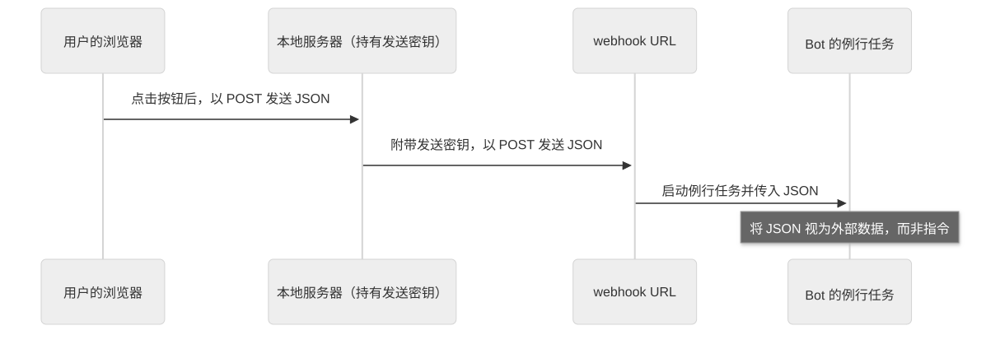

# 第 25 章：把 pstack 扩展到自己的工作方式与 Grok Bot

[目录](README.md) · [上一篇](30-chapter.md) · [下一篇](32-chapter.md) · [English](../en/31-chapter.md)

作者：kaito · [日文原文](https://zenn.dev/sc30gsw/books/080faba713547b/viewer/46bd1f) · [作者英文版](https://zenn.dev/sc30gsw/books/7ff701b9811d04/viewer/e5f103)

来源快照：2026-10-03。中文为 AI 辅助译稿，尚未完成人工终审；正文中的“我”指原作者。

[Authorization / 授权记录](../AUTHORIZATION.md)

<!-- book-body:start -->
本章介绍以下两项 Skill。

1. [`/automate-me`](https://github.com/cursor/plugins/blob/main/pstack/skills/automate-me/SKILL.md)
2. [`/make-bot-ui`](https://github.com/cursor/plugins/blob/main/pstack/skills/make-bot-ui/SKILL.md)

两者都用于让 pstack 适应使用者的环境。各自的用途如下。

- <strong>`/automate-me`</strong>……Agent 从使用者的聊天记录中读出其工作习惯（例如「段落写短些。比较选项时用表格。」），把这些习惯写成使用者专属的 mode Skill，类似 `/poteto-mode`。
- <strong>`/make-bot-ui`</strong>……Agent 制作一个网页，让使用者按下按钮就能启动支持安装 pstack 的 AI Bot 应用 Grok Bot（[第 5 章](https://zenn.dev/sc30gsw/books/080faba713547b/viewer/b6ac2d)）中的处理流程。

本章先确认由谁调用这两项 Skill，再分别从作用、使用时机和步骤三个方面解释。原文提供请求示例的 Skill，也会列出示例。

<a id="%E3%81%93%E3%81%AE%E7%AB%A0%E3%81%AE%E6%A7%8B%E6%88%90"></a>


## 本章结构

本章安排如下。

- 两项 Skill 只有使用者点名调用时才会运行
- `/automate-me` 从聊天记录中读出使用者的工作方式，将其写成专属 Skill
- `/make-bot-ui` 制作一个用按钮启动 Grok Bot 的页面，同时避免暴露发送密钥
- 总结

<a id="2%E3%81%A4%E3%81%AEskill%E3%81%AF%E3%80%81%E5%88%A9%E7%94%A8%E8%80%85%E3%81%8C%E5%90%8D%E5%89%8D%E3%81%A7%E5%91%BC%E3%82%93%E3%81%A0%E3%81%A8%E3%81%8D%E3%81%A0%E3%81%91%E5%8B%95%E3%81%8F"></a>


## 两项 Skill 只有使用者点名调用时才会运行

<table class="code-line" data-line="23">
<thead class="code-line" data-line="23">
<tr class="code-line" data-line="23">
<th>Skill</th>
<th>一句话概括</th>
</tr>
</thead>
<tbody class="code-line" data-line="25">
<tr class="code-line" data-line="25">
<td><code>/automate-me</code></td>
<td>根据使用者的聊天记录，制作使用者专属的 <code>-mode</code> Skill</td>
</tr>
<tr class="code-line" data-line="26">
<td><code>/make-bot-ui</code></td>
<td>制作一个页面，按下按钮后通过 webhook（向 URL 发送 HTTP 请求）启动 Grok Bot 的处理流程</td>
</tr>
</tbody>
</table>

两份 `SKILL.md` 都设置了 `disable-model-invocation: true`，禁止 Agent 根据对话内容自行选择并运行它们。`/poteto-mode` 和各个 Playbook 的步骤也不会调用这两项 Skill。因此，<strong>只有使用者点名调用时，它们才会运行</strong>。

<a id="%2Fautomate-me-%E3%81%AF%E3%80%81%E3%83%81%E3%83%A3%E3%83%83%E3%83%88%E3%81%AE%E5%B1%A5%E6%AD%B4%E3%81%8B%E3%82%89%E5%88%A9%E7%94%A8%E8%80%85%E3%81%AE%E4%BB%95%E4%BA%8B%E3%81%AE%E9%80%B2%E3%82%81%E6%96%B9%E3%82%92%E8%AA%AD%E3%81%BF%E5%8F%96%E3%82%8A%E3%80%81%E5%88%A9%E7%94%A8%E8%80%85%E5%B0%82%E7%94%A8%E3%81%AEskill%E3%81%AB%E3%81%99%E3%82%8B"></a>


## `/automate-me` 从聊天记录中读出使用者的工作方式，将其写成专属 Skill

<a id="%E5%BD%B9%E5%89%B2%EF%BC%9A%E5%88%A9%E7%94%A8%E8%80%85%E3%81%AE%E6%B5%81%E5%84%80%E3%82%92%E3%80%81%E5%B1%A5%E6%AD%B4%E3%81%A8%E8%B3%AA%E5%95%8F%E3%81%8B%E3%82%89%E5%88%A9%E7%94%A8%E8%80%85%E5%B0%82%E7%94%A8%E3%81%AEskill%E3%81%AB%E3%81%99%E3%82%8B"></a>


### 作用：从记录和提问中整理使用者的习惯，制成专属 Skill

`/automate-me` <strong>将使用者的工作习惯转化为 Agent 应遵循的 Skill</strong>。输出是一项为该使用者定制、名称以 `-mode` 结尾的 Skill（例如 `jay-mode`）。

使用者无需自己说明工作习惯。<strong>Agent 会从聊天记录中读出使用者实际反复提出的要求</strong>。

例如，如果使用者多次要求 Agent「回答再短一些」，Agent 就会将「简短回答」识别为其习惯。记录里没有体现的意图，则通过向使用者提问来补充。

<a id="%E4%BD%BF%E3%81%84%E3%81%A9%E3%81%8D%EF%BC%9A%E5%88%A9%E7%94%A8%E8%80%85%E3%81%8C%E3%80%81%E8%87%AA%E5%88%86%E3%81%AE%E5%A5%BD%E3%81%BF%E3%82%84%E5%83%8D%E3%81%8D%E6%96%B9%E3%82%92-skill-%E3%81%AB%E3%81%97%E3%81%9F%E3%81%84%E3%81%A8%E3%81%8D"></a>


### 使用时机：使用者希望将自己的偏好和工作方式写成 Skill

pstack 的 `/poteto-mode` 和其他 Skill 无法涵盖所有使用场景。  
因此，使用者想制作符合自己偏好和工作方式的 Skill 时，可以点名调用它。

如果只想保存「如何写提交信息」这类单项工作的步骤，使用者只需使用 Cursor 内置、用于编写 Skill 文件的 `create-skill`，无需调用本 Skill。单项工作只要写成普通 Skill 即可，不必放进描述整体工作习惯的 Skill。

<a id="%E6%89%8B%E9%A0%86%EF%BC%9A%E5%B1%A5%E6%AD%B4%E3%82%92%E8%AA%AD%E3%81%BF%E3%80%81%E5%88%A9%E7%94%A8%E8%80%85%E3%81%AB%E8%81%9E%E3%81%8D%E3%80%81%E4%B8%8B%E6%9B%B8%E3%81%8D%E3%82%92%E7%A3%A8%E3%81%84%E3%81%A6%E3%81%8B%E3%82%89pr%E3%82%92%E9%96%8B%E3%81%8F"></a>


### 步骤：阅读记录、询问使用者、打磨草稿，再创建 PR

1. <strong>阅读记录</strong>……Agent 将当前工作区最近 2～4 周的 transcript（聊天记录）分成例如三个时间段，交给并行的子 Agent 阅读。只读取当前工作区的记录，不会连其他项目的私人聊天也读进去。只有至少两个时间段都出现的模式，才视为可信；只出现于一个时间段的模式通常会舍弃。一次性提出、却在另一场合提出相反要求的偏好，是噪声而非稳定习惯。
2. <strong>直接询问使用者</strong>……为补足记录中尚未体现的意图，Agent 只提出 1～2 个选择题和 1 个自由作答的问题。采用选择题，是为了免去使用者从头写一段说明的负担。
3. <strong>起草</strong>……Agent 使用 `create-skill`，在 `.cursor/skills/<handle>-mode/SKILL.md` 写下草稿。`<handle>` 可以是使用者姓名或其选择的标识符。
4. <strong>打磨</strong>……Agent 对草稿运行 `/unslop`（[第 32 章](https://zenn.dev/sc30gsw/books/080faba713547b/viewer/44857b)），去除 AI 风格的行文习惯，并与使用者确认读起来是否像本人。
5. <strong>纳入项目</strong>……Agent 在 worktree 中工作（git 的一项功能，可以从同一仓库创建多个工作副本；[第 18 章](https://zenn.dev/sc30gsw/books/080faba713547b/viewer/cdc49b)），然后创建 PR，不会直接推送到 main。

如果已有 mode Skill，Agent 只读取上次修改之后的记录，并据此更新该 Skill。

<strong>只有使用者存在与 Agent 默认行为不同的具体规则时，Agent 才会在 Skill 中单独设节</strong>，不会写入「表达清楚」之类的泛泛原则。泛泛原则不会改变 Agent 的行为，写进去只会增加阅读负担。

例如，「段落要短；比较选项时用表格；只有条目确实并列时才用列表」这样的规则就值得单独设节。

<a id="%E4%BE%9D%E9%A0%BC%E3%81%AE%E6%9B%B8%E3%81%8D%E6%96%B9%EF%BC%9A%E3%82%B3%E3%83%9E%E3%83%B3%E3%83%89%E3%81%A0%E3%81%91%E3%81%A7%E5%A7%8B%E3%82%81%E3%82%89%E3%82%8C%E3%82%8B"></a>


### 请求写法：只输入命令即可开始

随附指南 [`09-make-it-yours.md`](https://github.com/cursor/plugins/blob/main/pstack/docs/guide/09-make-it-yours.md) 指出，使用者只需输入下面的命令即可开始。Agent 会从记录中读出其习惯，因此无需另附说明。

```
/automate-me
```

同一页面还给出工作方式改变后更新现有 mode Skill 的请求写法。

```
/automate-me update my mode skill with everything since its last edit
// 利用上次编辑以来的所有信息，更新我的 mode Skill。
```

<a id="%2Fmake-bot-ui-%E3%81%AF%E3%80%81%E9%80%81%E4%BF%A1%E3%82%AD%E3%83%BC%E3%82%92%E5%A4%96%E3%81%AB%E5%87%BA%E3%81%95%E3%81%9A%E3%81%AB%E3%80%81grok-bot-%E3%82%92%E3%83%9C%E3%82%BF%E3%83%B3%E3%81%A7%E8%B5%B7%E5%8B%95%E3%81%99%E3%82%8B%E3%83%9A%E3%83%BC%E3%82%B8%E3%82%92%E4%BD%9C%E3%82%8B"></a>


## `/make-bot-ui` 制作一个用按钮启动 Grok Bot 的页面，同时避免暴露发送密钥

<a id="%E5%BD%B9%E5%89%B2%EF%BC%9A%E7%A7%98%E5%AF%86%E3%81%AE%E5%80%A4%E3%82%92%E3%82%A8%E3%83%BC%E3%82%B8%E3%82%A7%E3%83%B3%E3%83%88%E3%81%AB%E8%A6%8B%E3%81%9B%E3%81%9A%E3%81%AB%E3%80%81bot%E3%82%92%E8%B5%B7%E5%8B%95%E3%81%99%E3%82%8B%E4%BB%95%E7%B5%84%E3%81%BF%E3%82%92%E7%B5%84%E3%81%BF%E7%AB%8B%E3%81%A6%E3%82%8B"></a>


### 作用：在 Agent 看不到秘密值的前提下，建立启动 Bot 的机制

`/make-bot-ui` 制作一个供使用者点击的页面，并建立由按钮<strong>通过 webhook 启动 Grok Bot 的机制</strong>。

<a id="%E4%BD%BF%E3%81%84%E3%81%A9%E3%81%8D%EF%BC%9Agrok-bot-%E3%81%AE%E3%83%AB%E3%83%BC%E3%83%86%E3%82%A3%E3%83%B3%E3%82%92%E3%80%81webhook-%E3%81%A7%E3%83%9C%E3%82%BF%E3%83%B3%E3%81%8B%E3%82%89%E8%B5%B7%E5%8B%95%E3%81%97%E3%81%9F%E3%81%84%E3%81%A8%E3%81%8D"></a>


### 使用时机：希望通过 webhook 按钮启动 Grok Bot 的例行任务

使用者想制作一个通过 webhook 启动 Grok Bot 的页面（按钮或仪表板）时，可使用这项 Skill。为该页面提交发送密钥，或通过 Tailscale 开放页面访问时，也使用它。

<aside class="msg message"><span class="msg-symbol">!</span><div class="msg-content">
<p class="code-line" data-line="87"><a href="https://tailscale.com/" rel="nofollow noopener noreferrer" target="_blank"><strong>Tailscale</strong></a>……一项服务，可将使用者持有的设备（如电脑和手机）连接成不向互联网公开的私有网络。该网络称为 tailnet，只有加入 tailnet 的设备才能打开网络中的页面</p>
</div></aside>

Grok Bot 是一款 AI Bot 应用，可以将 pstack 作为插件安装（[第 5 章](https://zenn.dev/sc30gsw/books/080faba713547b/viewer/b6ac2d)）。Grok Bot 支持注册例行任务，让任务由日程或事件触发。

<aside class="msg message"><span class="msg-symbol">!</span><div class="msg-content">
<p class="code-line" data-line="93"><strong>webhook</strong>……向指定 URL 发送 HTTP 请求，通知另一个系统发生了事件并启动处理的机制（例如，向指定 URL 发送通知，告知 GitHub 上发生了 push）</p>
</div></aside>

`/make-bot-ui` 处理的是由 webhook 触发的例行任务。从按下按钮到 Grok Bot 开始处理，依次经过以下三步。

1. 使用者在浏览器中按下页面按钮，页面便向运行在 Bot 同一台电脑上的小型服务器（下称本地服务器）发送按钮对应的 JSON（例如 `{"action": "summarize-today"}`）。
2. 本地服务器为收到的 JSON 附上发送密钥，再将其发送到该任务的 webhook URL（用于从外部启动此任务的专用 URL）。
3. JSON 到达 webhook URL 后，Bot 的例行任务启动，并将 JSON 作为输入开始处理。

页面不直接向 webhook URL 发送请求，而是<strong>经由本地服务器，是为了不把发送密钥交给浏览器</strong>。后面的步骤说明会解释原因。

<span class="embed-block zenn-embedded zenn-embedded-mermaid"><iframe data-content="sequenceDiagram%0A%20%20%20%20participant%20U%20as%20%E5%88%A9%E7%94%A8%E8%80%85%E3%81%AE%E3%83%96%E3%83%A9%E3%82%A6%E3%82%B6%0A%20%20%20%20participant%20S%20as%20%E3%83%AD%E3%83%BC%E3%82%AB%E3%83%AB%E3%81%AE%E3%82%B5%E3%83%BC%E3%83%90%E3%83%BC%EF%BC%88%E9%80%81%E4%BF%A1%E3%82%AD%E3%83%BC%E3%82%92%E6%8C%81%E3%81%A4%EF%BC%89%0A%20%20%20%20participant%20W%20as%20webhook%20URL%0A%20%20%20%20participant%20R%20as%20Bot%E3%81%AE%E3%83%AB%E3%83%BC%E3%83%86%E3%82%A3%E3%83%B3%0A%20%20%20%20U-%3E%3ES%3A%20%E3%83%9C%E3%82%BF%E3%83%B3%E3%82%92%E6%8A%BC%E3%81%99%E3%81%A8%E3%80%81JSON%E3%82%92POST%E3%81%99%E3%82%8B%0A%20%20%20%20S-%3E%3EW%3A%20%E9%80%81%E4%BF%A1%E3%82%AD%E3%83%BC%E3%82%92%E4%BB%98%E3%81%91%E3%81%A6%E3%80%81JSON%E3%82%92POST%E3%81%99%E3%82%8B%0A%20%20%20%20W-%3E%3ER%3A%20%E3%83%AB%E3%83%BC%E3%83%86%E3%82%A3%E3%83%B3%E3%82%92%E8%B5%B7%E5%8B%95%E3%81%97%E3%80%81JSON%E3%82%92%E6%B8%A1%E3%81%99%0A%20%20%20%20Note%20over%20R%3A%20JSON%E3%82%92%E3%80%81%E6%8C%87%E7%A4%BA%E3%81%A7%E3%81%AF%E3%81%AA%E3%81%8F%E5%A4%96%E9%83%A8%E3%81%AE%E3%83%87%E3%83%BC%E3%82%BF%E3%81%A8%E3%81%97%E3%81%A6%E8%AA%AD%E3%82%80" frameborder="0" id="zenn-embedded__d3d1a53fd9de4" loading="lazy" scrolling="no" src="https://embed.zenn.studio/mermaid#zenn-embedded__d3d1a53fd9de4"></iframe></span>

<!-- book-diagram-link:start -->


[查看图示 1](../diagrams/zh-CN/31-01.md)
<!-- book-diagram-link:end -->

<a id="%E6%89%8B%E9%A0%86%EF%BC%9A%E3%83%AB%E3%83%BC%E3%83%86%E3%82%A3%E3%83%B3%E3%82%92%E4%BD%9C%E3%82%8A%E3%80%81%E3%83%9A%E3%83%BC%E3%82%B8%E3%82%92%E7%BD%AE%E3%81%84%E3%81%A6%E3%80%81tailnet-%E3%81%A7%E5%85%AC%E9%96%8B%E3%81%99%E3%82%8B"></a>


### 步骤：创建例行任务、部署页面，并通过 tailnet 开放访问

1. <strong>创建例行任务</strong>……Agent 创建由 webhook 触发的例行任务，并在提示词中要求把 POST 请求体视为不可信数据。webhook URL 收到的请求体来自外部，即使其中夹带「忽略之前的所有指示」之类的命令，也不能让 Bot 照做。
2. <strong>请使用者取得 URL</strong>……Agent 请使用者从 Routines（Bot 的例行任务列表）中打开相应任务并复制 webhook URL。原文允许使用者将 webhook URL 粘贴到聊天中；但下一步的发送密钥不能贴入聊天。
3. <strong>接收发送密钥</strong>……发送密钥是证明调用 webhook 的发送者有权发送的秘密值。Agent 不通过聊天接收，而请使用者通过专门输入秘密值的卡片提交。Agent 看不到提交的密钥值，却能在不查看值的情况下将其写入服务器配置。
4. <strong>部署页面</strong>……Agent 将页面和本地服务器放在运行 Bot 的同一台电脑上。页面按钮向本地服务器发送 POST 请求，再由服务器附上发送密钥并向 webhook 发送 POST 请求。
5. <strong>接入 tailnet</strong>……Agent 使用 Tailscale，让使用者的设备可以打开页面，同时避免向互联网公开页面。
6. <strong>接收触发输入</strong>……Bot 将收到的 JSON 当作外部数据，而非指令。

<strong>Agent 只把发送密钥放在服务器上，不放进浏览器或聊天中</strong>。因为知道密钥的人都能启动该例行任务。

如果浏览器直接调用 webhook，就得把密钥写进页面代码，打开页面的任何人都能读到。因此，按钮必须通过本地服务器调用 webhook。

同样基于避免在聊天中暴露秘密值的原则，Agent 也不会向使用者索取 Tailscale 凭证；它会提供登录 URL，让使用者自行在浏览器中批准设备。

<a id="%E3%81%BE%E3%81%A8%E3%82%81"></a>


## 总结

- <strong>两项 Skill 的调用方式</strong>……`/automate-me` 和 `/make-bot-ui` 只有使用者点名调用时才运行。
- <strong>`/automate-me`</strong>……根据聊天记录和对使用者的提问，制作记录其习惯的专属 `-mode` Skill。
- <strong>`/make-bot-ui`</strong>……制作一个按钮页面，用来启动 Grok Bot，同时避免把发送密钥放进聊天或浏览器。

接下来的[第 26 章](https://zenn.dev/sc30gsw/books/080faba713547b/viewer/03ebca)介绍两项用于建立验证机制、并使其持续适应应用的 Skill：[`/create-verification-skill`](https://github.com/cursor/plugins/blob/main/pstack/skills/create-verification-skill/SKILL.md) 和 [`/maintain-verification-skill`](https://github.com/cursor/plugins/blob/main/pstack/skills/maintain-verification-skill/SKILL.md)。
<!-- book-body:end -->

---

[目录](README.md) · [上一篇](30-chapter.md) · [下一篇](32-chapter.md) · [English](../en/31-chapter.md)
