# 第 26 章：建立验证机制，并随应用变化持续维护

[目录](README.md) · [上一篇](31-chapter.md) · [下一篇](33-chapter.md) · [English](../en/32-chapter.md)

作者：kaito · [日文原文](https://zenn.dev/sc30gsw/books/080faba713547b/viewer/03ebca) · [作者英文版](https://zenn.dev/sc30gsw/books/7ff701b9811d04/viewer/9884cb)

来源快照：2026-10-03。中文为 AI 辅助译稿，尚未完成人工终审；正文中的“我”指原作者。

[Authorization / 授权记录](../AUTHORIZATION.md)

<!-- book-body:start -->
本章介绍以下两项 Skill。

1. [`/create-verification-skill`](https://github.com/cursor/plugins/blob/main/pstack/skills/create-verification-skill/SKILL.md)
2. [`/maintain-verification-skill`](https://github.com/cursor/plugins/blob/main/pstack/skills/maintain-verification-skill/SKILL.md)

两者都旨在让 Agent 实际运行应用，验证自己的工作。它们分别负责以下任务。

- <strong>`/create-verification-skill`</strong>……在项目中创建一套步骤，让 Agent 启动应用，像真实用户一样操作，并取得截图等证据。
- <strong>`/maintain-verification-skill`</strong>……定期检查 `/create-verification-skill` 编写的步骤中所述的功能和操作是否仍与当前应用一致，并修正偏差。

`/create-verification-skill` 会建立一项<strong>验证 Skill</strong>（原文称 verification skill），让 Agent 像真实用户一样运行应用并验证。验证 Skill 是项目专属的 Skill，包含 Agent 启动、操作开发中的应用，以及获取证据（截图、终端输出、日志等）所需的步骤（[第 3 章](https://zenn.dev/sc30gsw/books/080faba713547b/viewer/a88ea5)）。

两项之中，<strong>使用者首先要用的是创建验证 Skill 的 `/create-verification-skill`</strong>。

本章先确认两者的分工、调用者以及为何应从验证 Skill 开始，再分别从作用、使用时机、步骤和请求写法四个方面说明。

<a id="%E3%81%93%E3%81%AE%E7%AB%A0%E3%81%AE%E6%A7%8B%E6%88%90"></a>


## 本章结构

本章安排如下。

- 两项 Skill 各自负责的工作
- `/create-verification-skill` 建立通过用户实际路径运行应用的验证手段
- `/maintain-verification-skill` 定期修正 <strong>Feature Map</strong> 与当前应用的偏差
- 总结

<a id="2%E3%81%A4%E3%81%AEskill%E3%81%8C%E5%8F%97%E3%81%91%E6%8C%81%E3%81%A4%E4%BB%95%E4%BA%8B"></a>


## 两项 Skill 各自负责的工作

两项 Skill 的作用和成果如下表所示。

<table class="code-line" data-line="29">
<thead class="code-line" data-line="29">
<tr class="code-line" data-line="29">
<th>Skill</th>
<th>作用</th>
<th>成果物</th>
</tr>
</thead>
<tbody class="code-line" data-line="31">
<tr class="code-line" data-line="31">
<td><code>/create-verification-skill</code></td>
<td>在项目中建立启动、操作应用并留下证据（如截图）的步骤</td>
<td>
<code>.cursor/skills/verify-&lt;app&gt;/</code>（验证 Skill 与 <strong>Feature Map</strong>）</td>
</tr>
<tr class="code-line" data-line="32">
<td><code>/maintain-verification-skill</code></td>
<td>持续使验证 Skill 和 <strong>Feature Map</strong> 与当前应用保持一致</td>
<td>包含实际运行应用并验证过的修正的 PR（最多一份），或仅提交报告</td>
</tr>
</tbody>
</table>

<strong>Feature Map</strong> 是一份文档，按应用功能记录该功能能做什么、用户如何找到它、怎样用验证 Skill 操作它，以及可以验证什么结果（[第 4 章](https://zenn.dev/sc30gsw/books/080faba713547b/viewer/dc9141)）。

`/create-verification-skill` 与 `/maintain-verification-skill` 将[第 19 章](https://zenn.dev/sc30gsw/books/080faba713547b/viewer/1fb019)的 Principle「[<strong>Prove It Works</strong>](https://github.com/cursor/plugins/blob/main/pstack/skills/principle-prove-it-works/SKILL.md)」所要求的「实际运行功能并验证」，转化为项目中可用于各种工作的验证手段，并持续维护。

<a id="2%E3%81%A4%E3%81%AF%E3%80%81%E5%88%A9%E7%94%A8%E8%80%85%E3%81%8B-%2Fsetup-pstack-%E3%81%8C%E5%90%8D%E5%89%8D%E3%81%A7%E5%91%BC%E3%82%93%E3%81%A0%E3%81%A8%E3%81%8D%E3%81%A0%E3%81%91%E5%8B%95%E3%81%8F"></a>


### 两项 Skill 只有使用者或 `/setup-pstack` 点名调用时才会运行

两份 `SKILL.md` 都设有 `disable-model-invocation: true`（[第 25 章](https://zenn.dev/sc30gsw/books/080faba713547b/viewer/46bd1f)）。设有该选项时，Agent 不会根据对话内容自行选择并运行 Skill。因此，只有使用者点名调用，或其他 Skill 在步骤中明确指定调用时，它们才会运行。

两者的调用者如下。

- <strong>`/create-verification-skill`</strong>……使用者可以点名调用。此外，`/setup-pstack` 会在最后一步检查项目是否已有运行应用并验证的手段；若没有，就提出创建建议，并在使用者接受后调用这项 Skill。
- <strong>`/maintain-verification-skill`</strong>……只有使用者点名调用时才会运行。

<a id="%E6%9C%80%E5%88%9D%E3%81%AB%E6%A4%9C%E8%A8%BC%E3%82%B9%E3%82%AD%E3%83%AB%E3%82%92%E4%BD%9C%E3%82%8B%E3%81%AE%E3%81%AF%E3%80%81%E3%82%A8%E3%83%BC%E3%82%B8%E3%82%A7%E3%83%B3%E3%83%88%E3%81%8C%E8%87%AA%E5%88%86%E3%81%AE%E4%BB%95%E4%BA%8B%E3%82%92%E7%A2%BA%E3%81%8B%E3%82%81%E3%82%89%E3%82%8C%E3%82%8B%E3%82%88%E3%81%86%E3%81%AB%E3%81%99%E3%82%8B%E3%81%9F%E3%82%81"></a>


### 首先创建验证 Skill，是为了让 Agent 能自行验证工作

使用者首先准备验证 Skill，是因为<strong>如果 Agent 无法自行验证工作，不论交给它多少任务，最后仍要人逐项检查，人就会成为阻碍工作推进的瓶颈</strong>。

<strong>人一旦成为瓶颈，就得整天照看 Agent</strong>。有了验证 Skill，Agent 可以自行运行应用、确认结果，并持续工作直到成功。使用者只需查看 Agent 验证过的结果。

poteto 也在《The Complete Guide to pstack》的 [Part 1](https://x.com/poteto/status/2094457600259842065) 和 [Part 2](https://x.com/poteto/status/2097732320606507506) 反复表达这一观点。

尤其在 Part 1 中，他指出，有了验证 Skill，其他 Skill 和自动运行的机制也能负责检查应用。因此，他将验证 Skill 视为其他 Skill 与定期任务的基础。

Part 1 举了以下两个例子。

- `/swarm`（[第 24 章](https://zenn.dev/sc30gsw/books/080faba713547b/viewer/2ad346)）让大量 Cloud Agent 执行验证 Skill，以足够多的次数确认性能改善。
- Grok Bot 的例行任务（[第 25 章](https://zenn.dev/sc30gsw/books/080faba713547b/viewer/46bd1f)）每次收到 Slack 中的用户报告，就让 Cloud Agent 用验证 Skill 重现该问题。

<a id="%2Fcreate-verification-skill-%E3%81%AF%E3%80%81%E3%82%A2%E3%83%97%E3%83%AA%E3%82%92%E3%83%A6%E3%83%BC%E3%82%B6%E3%83%BC%E3%81%A8%E5%90%8C%E3%81%98%E7%B5%8C%E8%B7%AF%E3%81%A7%E5%8B%95%E3%81%8B%E3%81%99%E6%89%8B%E6%AE%B5%E3%82%92%E4%BD%9C%E3%82%8B"></a>


## `/create-verification-skill` 建立通过用户实际路径运行应用的验证手段

<a id="%E5%BD%B9%E5%89%B2%EF%BC%9A%E5%AE%9F%E9%9A%9B%E3%81%AE%E3%82%A2%E3%83%97%E3%83%AA%E3%82%92%E5%8B%95%E3%81%8B%E3%81%97%E3%81%A6%E6%8C%99%E5%8B%95%E3%82%92%E8%A8%BC%E6%98%8E%E3%81%99%E3%82%8B%E6%89%8B%E6%AE%B5%E3%82%92%E3%80%81%E3%83%97%E3%83%AD%E3%82%B8%E3%82%A7%E3%82%AF%E3%83%88%E3%81%AB%E4%BD%9C%E3%82%8B"></a>


### 作用：为项目建立实际运行应用并证明其行为的手段

`/create-verification-skill` 在 `.cursor/skills/verify-<app>/` 生成项目专属的验证 Skill。借助它，Agent 能够<strong>启动真实应用，像用户一样操作</strong>，并留下证据。

Agent 编写这项 Skill 的读者是其他 Agent，而非人。<strong>读者可能从未见过该应用，在工作途中毫无背景知识地打开验证 Skill</strong>。因此，Agent 会直接写出该仓库实际使用的命令和 selector（指定界面元素的方式），避免读者猜测。

验证 Skill 建好后，使用者只需说「在应用中验证」，任何 Agent 都能自行启动和操作应用，无需使用者再教一次方法（[`docs/guide/06-verify-and-ship.md`](https://github.com/cursor/plugins/blob/main/pstack/docs/guide/06-verify-and-ship.md)）。

<a id="%E4%BD%BF%E3%81%84%E3%81%A9%E3%81%8D%EF%BC%9A%E3%82%A2%E3%83%97%E3%83%AA%E3%81%AE%E6%8C%99%E5%8B%95%E3%82%92%E3%80%81%E3%82%B9%E3%82%AF%E3%83%AA%E3%83%97%E3%83%88%E3%81%A7%E7%A2%BA%E3%81%8B%E3%82%81%E3%82%8B%E6%89%8B%E6%AE%B5%E3%81%8C%E3%81%AA%E3%81%84%E3%81%A8%E3%81%8D"></a>


### 使用时机：项目缺少通过脚本验证应用行为的手段

使用者应在项目缺少可用脚本反复验证应用行为的手段时使用这项 Skill。

例如，项目既没有自动操作浏览器并检查画面的脚本，也没有运行 CLI 并核对输出的脚本。

配置 pstack 所用模型的 `/setup-pstack` 也会在最后一步检查项目是否缺少运行应用并验证的手段（`verify-*` Skill 或既有 harness）。若缺少，它会提出一次生成建议；使用者接受后，调用 `/create-verification-skill`（[第 34 章](https://zenn.dev/sc30gsw/books/080faba713547b/viewer/8487f0)）。

<a id="%E6%89%8B%E9%A0%86%EF%BC%9A%E3%83%AA%E3%83%9D%E3%82%B8%E3%83%88%E3%83%AA%E3%82%92%E8%AA%BF%E3%81%B9%E3%81%A6%E6%A4%9C%E8%A8%BC%E3%82%B9%E3%82%AD%E3%83%AB%E3%82%92%E6%9B%B8%E3%81%8D%E3%80%81%E4%B8%80%E5%BA%A6%E5%AE%9F%E8%A1%8C%E3%81%97%E3%81%A6%E3%81%8B%E3%82%89%E6%B8%A1%E3%81%99"></a>


### 步骤：调查仓库、编写验证 Skill，并在交付前运行一次

<a id="%E6%89%8B%E9%A0%861%EF%BC%9A%E3%82%A2%E3%83%97%E3%83%AA%E3%81%AE%E5%8B%95%E3%81%8B%E3%81%97%E6%96%B9%E3%82%92%E3%80%81%E5%88%A9%E7%94%A8%E8%80%85%E3%81%AB%E8%81%9E%E3%81%8F%E5%89%8D%E3%81%AB%E3%83%AA%E3%83%9D%E3%82%B8%E3%83%88%E3%83%AA%E3%81%8B%E3%82%89%E8%AA%BF%E3%81%B9%E3%82%8B"></a>


#### 步骤 1：先从仓库调查应用如何运行，再询问使用者

<strong>第一步，Agent 先从仓库代码和配置调查应用的运行方式，再考虑询问使用者</strong>（原文称这项调查为「面谈」，interview）。

Agent 只向使用者询问代码库中观察不到的事。<strong>连读代码就能知道的事也向使用者发问，会增加对方负担，并让工作在等待答复期间停下来</strong>。

Agent 从代码库回答以下五个问题，以收集验证 Skill 所需的内容：启动什么、如何操作、留下什么证据。

<table class="code-line" data-line="90">
<thead class="code-line" data-line="90">
<tr class="code-line" data-line="90">
<th>方面</th>
<th>问题</th>
</tr>
</thead>
<tbody class="code-line" data-line="92">
<tr class="code-line" data-line="92">
<td>Surface（用户接触的界面）</td>
<td>用户实际会接触什么（Web UI、CLI、API 等）</td>
</tr>
<tr class="code-line" data-line="93">
<td>Run（启动）</td>
<td>如何在本地启动应用（优先使用仓库自身的开发命令，例如 package scripts、Makefile、README 中的快速入门）</td>
</tr>
<tr class="code-line" data-line="94">
<td>Drive（操作）</td>
<td>Agent 如何通过程序操作？先找仓库现有的 Playwright 或 Cypress 测试、可用 curl 调用的端点等；若没有，再选择 CDP、PTY、tmux 或纯 HTTP 等通用手段</td>
</tr>
<tr class="code-line" data-line="95">
<td>Observe（观察）</td>
<td>能留下什么证据（截图、终端记录、响应正文、日志、退出码、数据库状态等）</td>
</tr>
<tr class="code-line" data-line="96">
<td>Isolate（隔离）</td>
<td>能否分别使用不同端口和数据目录，同时运行两个应用实例</td>
</tr>
</tbody>
</table>

<aside class="msg message"><span class="msg-symbol">!</span><div class="msg-content">
<ul class="code-line" data-line="99">
<li class="code-line" data-line="99">
<strong>Playwright、Cypress</strong>……自动操作浏览器进行测试的工具</li>
<li class="code-line" data-line="100">
<strong>CDP</strong>……通过程序使用浏览器开发者工具功能的机制。对于 Web 应用和 Electron（用于构建桌面应用的框架）应用，Agent 可借助 CDP 连接浏览器，发送点击和输入操作，并读取页面状态</li>
<li class="code-line" data-line="101">
<strong>PTY</strong>……伪终端（pseudo terminal）。它是由程序提供、可代替真实终端的终端；其中运行的应用会认为自己正被人在终端里操作</li>
<li class="code-line" data-line="102">
<strong>tmux</strong>……终端复用软件（<code>Terminal Multiplexer</code>），可在一个终端界面管理多个会话、窗口及分屏（pane）。也能从外部用命令向会话发送按键，或读取屏幕显示的内容
<ul class="code-line" data-line="103">
<li class="code-line" data-line="103">对于 CLI 和 TUI，Agent 在 PTY 或 tmux 会话中启动应用，发送按键输入，再读取屏幕显示的文字</li>
</ul>
</li>
<li class="code-line" data-line="104">
<strong>纯 HTTP</strong>……不经过界面，直接使用 curl 等向应用发送 HTTP 请求，并核对返回的响应</li>
<li class="code-line" data-line="105">
<strong>实例</strong>……每一个正在运行的应用。例如，同一个 Web 应用分别在 3000 和 3001 端口运行，就是两个实例</li>
</ul>
</div></aside>

如果无法并排运行两个实例，Agent 会在验证 Skill 中注明这一点，并要求两个 Agent 不要同时操作同一个实例。Agent 若同时操作使用者正在使用的实例，可能破坏使用者工作中的会话。

如果仓库代码按当前状态无法构建或启动，Agent 会先修到能够构建和启动，或准确报告缺少什么，再生成验证 Skill。因为以无法构建和启动的状态为前提编写的 Skill，会把错误步骤传给下一位 Agent。

<a id="%E6%89%8B%E9%A0%862%EF%BC%9Askill.md-%E3%81%AE6%E3%81%A4%E3%81%AE%E8%A6%8B%E5%87%BA%E3%81%97%E3%82%92%E6%9B%B8%E3%81%8F"></a>


#### 步骤 2：写出 `SKILL.md` 的六个标题

Agent 在生成的 `SKILL.md` 中安排以下六个标题，让从未见过应用的下一个 Agent 可以依次完成启动到清理的全程。

Agent 只根据[步骤 1](#%E6%89%8B%E9%A0%861%EF%BC%9A%E3%82%A2%E3%83%97%E3%83%AA%E3%81%AE%E5%8B%95%E3%81%8B%E3%81%97%E6%96%B9%E3%82%92%E3%80%81%E5%88%A9%E7%94%A8%E8%80%85%E3%81%AB%E8%81%9E%E3%81%8F%E5%89%8D%E3%81%AB%E3%83%AA%E3%83%9D%E3%82%B8%E3%83%88%E3%83%AA%E3%81%8B%E3%82%89%E8%AA%BF%E3%81%B9%E3%82%8B)查到的事实编写内容，不留下 placeholder（待以后填写的临时文字）。不熟悉应用的下一个 Agent 无法把临时文字替换为正确值。

以下对比保留 placeholder 与依据调查事实写成的示例。

```
<!-- プレースホルダが残っている：次のエージェントは、何を実行し、何をクリックすればよいか分からない -->
起動：`<起動コマンド>` を実行し、`http://localhost:<PORT>` が応答したら準備完了
操作：`TODO: 送信ボタンのセレクタ` をクリックする

<!-- 調査で見つけた事実で書いている：次のエージェントは、そのまま実行できる -->
起動：`pnpm dev` を実行し、`http://localhost:5173` が応答したら準備完了
操作：`getByRole('button', { name: '送信' })` をクリックする
```

<table class="code-line" data-line="130">
<thead class="code-line" data-line="130">
<tr class="code-line" data-line="130">
<th>标题</th>
<th>内容</th>
</tr>
</thead>
<tbody class="code-line" data-line="132">
<tr class="code-line" data-line="132">
<td>Launch（启动）</td>
<td>启动命令、判断应用「已准备就绪」的方法（如出现特定日志行或端口响应）以及停止方法</td>
</tr>
<tr class="code-line" data-line="133">
<td>Doctor（诊断）</td>
<td>只读检查，用于判断「操作这个实例来验证是否有意义」（例如进程是否运行、构建是否正确、使用该端口的是否为自己启动的实例、认证是否有效）</td>
</tr>
<tr class="code-line" data-line="134">
<td>Drive（操作）</td>
<td>使用该仓库真实的 selector 和命令编写操作步骤。使用 ARIA 标签或 data 属性等稳定标识，而不是屏幕坐标或按 Tab 键切换焦点的顺序</td>
</tr>
<tr class="code-line" data-line="135">
<td>Evidence（证据）</td>
<td>为证明结果要保留什么、存放在哪里</td>
</tr>
<tr class="code-line" data-line="136">
<td>Cleanup（清理）</td>
<td>如何清理由本次运行创建的实例，但不删除证据</td>
</tr>
<tr class="code-line" data-line="137">
<td>Helpers（辅助脚本）</td>
<td>如何调用随附的脚本</td>
</tr>
</tbody>
</table>

<aside class="msg message"><span class="msg-symbol">!</span><div class="msg-content">
<p class="code-line" data-line="140"><strong>ARIA 标签</strong>……赋予按钮等元素的名称，供屏幕阅读器朗读</p>
</div></aside>

下面用 Playwright 代码对比 Drive 中的「稳定标识」。

```
declare const page: {
  mouse: { click(x: number, y: number): Promise<void> };
  getByRole(role: "button", options: { name: string }): { click(): Promise<void> };
  locator(selector: string): { click(): Promise<void> };
};

// 前：画面の座標で押す。ボタンの位置が変わると、別の場所を押してしまう
async function saveByPosition() {
  await page.mouse.click(640, 410);
}

// 後：ARIAラベルで押す。ボタンの位置が変わっても、同じボタンを押せる
async function saveByLabel() {
  await page.getByRole("button", { name: "保存" }).click();
}

// 後：data 属性で押す。ボタンの位置が変わっても、同じボタンを押せる
async function saveByDataAttribute() {
  await page.locator('[data-testid="save"]').click();
}
```

Evidence 还要写明证明标准，例如：

- 操作用户实际经过的路径，而非测试专用的捷径
- 不只检查界面，也检查副作用（写入的文件、新增的行、发出的消息等）

测试专用捷径，例如直接改写内部值的函数，或专为测试准备的端点。Agent 即使用捷径完成检查，也无法证明用户实际经过的路径（真实应用行为）运作正常。

<a id="%E6%89%8B%E9%A0%863%EF%BC%9Afeature-map-%E3%81%AE%E6%9C%80%E5%88%9D%E3%81%AE%E7%89%88%E3%82%92%E4%BD%9C%E3%82%8B"></a>


#### 步骤 3：制作 Feature Map 的初始版本

Agent 还会为生成的验证 Skill 配上一份 <strong>Feature Map</strong>。

<strong>Feature Map</strong> 由每项面向用户的功能各自对应的功能文件，以及汇总这些文件的目录 `features/README.md` 组成。Agent 起初会找出约 3～5 项主要功能，分别制作功能文件。

Agent 从以下四处寻找主要功能。

- <strong>路由</strong>……Web 应用各页面对应的 URL 路径（例如 `/settings`）。
- <strong>命令</strong>……CLI 接受的命令或子命令（例如 `git commit` 中的 `commit`）。
- <strong>菜单</strong>……应用界面中列出的菜单项。
- <strong>文档</strong>……README、使用说明等解释应用功能的文档。

功能文件的内容，以及把 <strong>Feature Map</strong> 作为持续积累的记忆来维护的思路，将在[第 36 章](https://zenn.dev/sc30gsw/books/080faba713547b/viewer/7d7081)介绍。

> The map is the repo's maintained verification source; a proof that drives one convenient entry point is incomplete when the map lists others.
>
> Map 是仓库持续维护的验证依据；当 Map 列出其他入口时，只操作一个方便的入口并不能构成完整的证明。

这里的「入口」，是用户到达某项功能的方法，例如按钮、按键操作或命令。

如果 <strong>Feature Map</strong> 列出同一功能的多个入口，Agent 必须验证所有入口，才能证明功能运作正常。凭这一规则，<strong>Feature Map 也成为界定证明所需覆盖哪些入口的清单</strong>。

可以将这条规则应用到随附的 <strong>Feature Map</strong> 示例。示例中，笔记搜索功能的功能文件 [`search.md`](https://github.com/cursor/plugins/blob/main/pstack/skills/create-verification-skill/references/feature-map-example/search.md) 如下记载用户进入搜索功能的方法。

> <strong>How to get to it (user POV)</strong>
>
> - Choose the `Search` button in the browser toolbar.
> - Press `/` in the browser while focus is outside an editable field.
> - Run `notes search <query>` in a terminal.
>
> <strong>如何进入该功能（用户视角）</strong>
>
> - 选择浏览器工具栏中的 `Search` 按钮。
> - 当焦点位于可编辑区域以外时，在浏览器中按 `/` 键。
> - 在终端中运行 `notes search <query>`。

此例中的笔记搜索功能有三个入口：工具栏的 `Search` 按钮、`/` 键以及终端命令 `notes search <query>`。Agent 只通过 `Search` 按钮验证，证明仍不充分；还需验证另外两个入口。

因此，只要 <strong>Feature Map</strong> 列出同一功能的多个入口，Agent 就必须检查所有入口。

<a id="%E6%89%8B%E9%A0%864%EF%BC%9A%E7%94%9F%E6%88%90%E3%81%97%E3%81%9F%E6%A4%9C%E8%A8%BC%E3%82%B9%E3%82%AD%E3%83%AB%E3%82%92%E4%B8%80%E5%BA%A6%E6%9C%80%E5%BE%8C%E3%81%BE%E3%81%A7%E5%AE%9F%E8%A1%8C%E3%81%99%E3%82%8B"></a>


#### 步骤 4：将生成的验证 Skill 从头到尾运行一次

Agent <strong>在将验证 Skill 交给使用者之前，先按其中的指示完整执行一次</strong>。操作一项功能即可；其余功能可在之后的运行中依据 <strong>Feature Map</strong> 验证。

执行流程如下图所示。

<span class="embed-block zenn-embedded zenn-embedded-mermaid"><iframe data-content="flowchart%20TD%0A%20%20%20%20A%5B%E8%B5%B7%E5%8B%95%5D%20--%3E%20B%5BDoctor%5D%0A%20%20%20%20B%20--%3E%20C%5BFeature%20Map%20%E3%81%AE%E6%A9%9F%E8%83%BD%E3%82%92%E4%B8%80%E3%81%A4%E6%93%8D%E4%BD%9C%5D%0A%20%20%20%20C%20--%3E%20D%5B%E8%A8%BC%E6%8B%A0%E3%82%92%E5%8F%96%E3%82%8B%5D%0A%20%20%20%20D%20--%3E%20E%5B%E7%89%87%E4%BB%98%E3%81%91%5D%0A%20%20%20%20E%20--%3E%20F%7B%E3%81%A9%E3%81%AE%E6%89%8B%E9%A0%86%E3%82%82%E6%88%90%E5%8A%9F%E3%81%97%E3%80%81%E7%89%87%E4%BB%98%E3%81%91%E3%81%AE%E5%BE%8C%E3%82%82%E8%A8%BC%E6%8B%A0%E3%81%8C%E6%AE%8B%E3%81%A3%E3%81%A6%E3%81%84%E3%82%8B%E3%81%8B%7D%0A%20%20%20%20F%20--%3E%7C%E3%81%AF%E3%81%84%7C%20G%5B%E5%88%A9%E7%94%A8%E8%80%85%E3%81%AB%E6%89%8B%E6%B8%A1%E3%81%99%5D%0A%20%20%20%20F%20--%3E%7C%E3%81%84%E3%81%84%E3%81%88%7C%20H%5B%E5%A4%B1%E6%95%97%E3%81%97%E3%81%9F%E7%AE%87%E6%89%80%E3%82%92%E7%9B%B4%E3%81%99%5D%0A%20%20%20%20H%20--%3E%20A" frameborder="0" id="zenn-embedded__89e3e28bf7afe" loading="lazy" scrolling="no" src="https://embed.zenn.studio/mermaid#zenn-embedded__89e3e28bf7afe"></iframe></span>

<!-- book-diagram-link:start -->


[查看图示 1](../diagrams/zh-CN/32-01.md)
<!-- book-diagram-link:end -->

Agent 即使在失败的运行中也会执行清理，因此失败尝试启动的进程和占用的端口不会残留。

如果清理之后证据也不见了，Agent 会判定该次运行不合格，因为连证明都没有留下。

此外，生成的验证 Skill 在首次运行前只算草稿，不算成果物。书面步骤的错误只有执行后才能发现。

例如，Launch 中写错端口号，不运行就不会察觉。

最后，Agent 会向使用者介绍负责维护 <strong>Feature Map</strong> 的 `/maintain-verification-skill`。

<a id="%E4%BE%9D%E9%A0%BC%E3%81%AE%E6%9B%B8%E3%81%8D%E6%96%B9%EF%BC%9A%E3%82%B3%E3%83%9E%E3%83%B3%E3%83%89%E3%81%A0%E3%81%91%E3%81%A7%E5%A7%8B%E3%82%81%E3%82%89%E3%82%8C%E3%82%8B"></a>


### 请求写法：只输入命令即可开始

根据 `docs/guide/06-verify-and-ship.md`，使用者只需输入以下命令，就可以开始创建 <strong>Feature Map</strong> 和验证 Skill。Agent 会从仓库调查应用如何运行，因此使用者不必预先准备说明。

```
/create-verification-skill
```

实际创建和维护验证 Skill 的过程，将在[第 36 章](https://zenn.dev/sc30gsw/books/080faba713547b/viewer/7d7081)介绍。

<a id="%2Fmaintain-verification-skill-%E3%81%AF%E3%80%81feature-map-%E3%81%A8%E4%BB%8A%E3%81%AE%E3%82%A2%E3%83%97%E3%83%AA%E3%81%AE%E3%81%9A%E3%82%8C%E3%82%92%E5%AE%9A%E6%9C%9F%E7%9A%84%E3%81%AB%E7%9B%B4%E3%81%99"></a>


## `/maintain-verification-skill` 定期修正 <strong>Feature Map</strong> 与当前应用的偏差

<a id="%E5%BD%B9%E5%89%B2%EF%BC%9A%E6%A4%9C%E8%A8%BC%E3%82%B9%E3%82%AD%E3%83%AB%E3%81%A8-feature-map-%E3%82%92%E3%80%81%E4%BB%8A%E3%81%AE%E3%82%A2%E3%83%97%E3%83%AA%E3%81%A8%E9%A3%9F%E3%81%84%E9%81%95%E3%82%8F%E3%81%AA%E3%81%84%E3%82%88%E3%81%86%E4%BF%9D%E3%81%A4"></a>


### 作用：使验证 Skill 和 <strong>Feature Map</strong> 与当前应用保持一致

`/maintain-verification-skill` 检查验证 Skill 和 <strong>Feature Map</strong> 是否仍与当前应用一致，并修正偏差。

> A feature map rots the moment the app changes.
>
> 应用一旦改变，<strong>Feature Map</strong> 就开始过时。

应用改变后，<strong>Feature Map</strong> 的记载便可能开始偏离实际应用。所以，<strong>Feature Map</strong> 创建后仍需持续维护，而这项 Skill 正负责维护工作。

<a id="%E4%BD%BF%E3%81%84%E3%81%A9%E3%81%8D%EF%BC%9A%E3%82%A2%E3%83%97%E3%83%AA%E3%81%8C%E5%A4%89%E3%82%8F%E3%81%A3%E3%81%9F%E5%BE%8C%E3%81%AB%E3%80%81%E5%AE%9A%E6%9C%9F%E7%9A%84%E3%81%AB%E4%BD%BF%E3%81%86"></a>


### 使用时机：应用改变后定期运行

应用改变、<strong>Feature Map</strong> 的内容与当前应用出现偏差时，使用者应运行这项 Skill。

poteto 在《The Complete Guide to pstack》的 [Part 1](https://x.com/poteto/status/2094457600259842065) 建议至少每天运行一次，以便让 Agent 操作应用所需的信息始终保持最新。

因此，本书也建议至少每天运行一次，并通过 Routine 等机制将其自动化。

<a id="%E6%89%8B%E9%A0%86%EF%BC%9A%E3%82%BD%E3%83%BC%E3%82%B9%E3%82%B3%E3%83%BC%E3%83%89%E3%81%AF%E4%B8%A6%E5%88%97%E3%81%AB%E8%AA%AD%E3%81%BF%E3%80%81%E3%82%A2%E3%83%97%E3%83%AA%E3%81%AE%E6%93%8D%E4%BD%9C%E3%81%AF%E4%B8%BB%E3%82%A8%E3%83%BC%E3%82%B8%E3%82%A7%E3%83%B3%E3%83%88%E3%81%A0%E3%81%91%E3%81%8C%E8%A1%8C%E3%81%86"></a>


### 步骤：并行阅读源代码，但只由主 Agent 操作应用

<a id="%E3%83%97%E3%83%AD%E3%83%80%E3%82%AF%E3%83%88%E3%81%AE%E3%82%B3%E3%83%BC%E3%83%89%E3%81%AF%E7%B7%A8%E9%9B%86%E3%81%9B%E3%81%9A%E3%80%81%E9%80%80%E8%A1%8C%E3%81%AF-feature-map-%E3%82%92%E7%9B%B4%E3%81%95%E3%81%9A%E3%81%AB%E5%A0%B1%E5%91%8A%E3%81%99%E3%82%8B"></a>


#### 不修改产品代码；遇到回归时报告，不改写 <strong>Feature Map</strong> 掩盖它

<strong>Agent 只可编辑验证 Skill 自身的目录，包括 `SKILL.md`、`features/` 和验证 Skill 附带的脚本</strong>。

Agent 在检查期间不编辑产品代码。如果应用没有按照 <strong>Feature Map</strong> 运行，Agent 要辨别偏差来自 <strong>Feature Map</strong> 记载错误，还是产品回归（原先可用的功能坏掉）。前者修正 <strong>Feature Map</strong>，后者向使用者报告。

不能通过修改 <strong>Feature Map</strong> 来消除回归，是因为<strong>若产品已经坏了，却把 Feature Map 改成描述当前错误行为，故障本身便会被掩盖</strong>。

<a id="7%E6%AE%B5%E3%81%AE%E6%89%8B%E9%A0%86%E3%81%A7%E3%80%81%E7%B4%A2%E5%BC%95%E3%81%AE%E6%95%B4%E5%82%99%E3%81%8B%E3%82%89pr%E3%81%AB%E3%81%99%E3%82%8B%E3%81%8B%E3%81%AE%E5%88%A4%E6%96%AD%E3%81%BE%E3%81%A7%E3%82%92%E9%80%B2%E3%82%81%E3%82%8B"></a>


#### 七个步骤：从整理索引到决定是否创建 PR

具体步骤如下。

1. <strong>查找目标</strong>……主 Agent 找到要检查的验证 Skill（通常位于 `.cursor/skills/verify-*/`）。若找不到，就停止并建议使用 `/create-verification-skill`。
2. <strong>整理索引</strong>……主 Agent 对照 <strong>Feature Map</strong> 的目录（`README`）与功能文件，修复缺失项和失效链接。
3. <strong>阅读源代码</strong>……主 Agent 为每个功能文件并行启动一个只读子 Agent。各子 Agent 对照 <strong>Feature Map 的描述</strong>与当前源代码，指出疑似偏差并附上作为依据的代码位置。
4. <strong>交叉核对</strong>……主 Agent 实际核验步骤 3 提出的部分疑点，并从近期变更中寻找 <strong>Feature Map</strong> 尚未记载的功能。
5. <strong>实际操作</strong>……即使源代码没有发现问题，主 Agent 仍至少操作每项功能一次。
6. <strong>分类</strong>……主 Agent 按下文[「发现的问题分为三类，结果只用三种状态之一表示」](#%E8%A6%8B%E3%81%A4%E3%81%91%E3%81%9F%E5%95%8F%E9%A1%8C%E3%81%AF3%E7%A8%AE%E9%A1%9E%E3%81%AB%E4%BB%95%E5%88%86%E3%81%91%E3%80%81%E7%B5%90%E6%9E%9C%E3%81%AF3%E3%81%A4%E3%81%AE%E3%81%A9%E3%82%8C%E3%81%8B%E4%B8%80%E3%81%A4%E3%81%A7%E7%A4%BA%E3%81%99)中的表格，将问题归为三类。
7. <strong>决定是否创建 PR</strong>……若有通过实际操作验证的修正，主 Agent 重读修改的文件，再将改动汇入一份 PR。如果没有需要修正的内容，或无法完成检查，就不创建 PR，而是报告结果与已验证的范围。

即使子 Agent 在步骤 3 中没有发现某项功能存在偏差，主 Agent 仍会在步骤 5 实际操作它。因为<strong>只阅读源代码，无法证明应用会像 Feature Map 所述那样运行</strong>。证明需要实际运行应用并核验（[第 19 章](https://zenn.dev/sc30gsw/books/080faba713547b/viewer/1fb019)的 Principle「Prove It Works」）。

<a id="%E8%A4%87%E6%95%B0%E3%81%AE%E3%82%A8%E3%83%BC%E3%82%B8%E3%82%A7%E3%83%B3%E3%83%88%E3%81%8C%E5%90%8C%E3%81%98%E3%82%A2%E3%83%97%E3%83%AA%E3%82%92%E6%93%8D%E4%BD%9C%E3%81%99%E3%82%8B%E3%81%A8%E3%80%81%E8%A8%BC%E6%8B%A0%E3%81%8C%E4%BF%A1%E7%94%A8%E3%81%A7%E3%81%8D%E3%81%AA%E3%81%8F%E3%81%AA%E3%82%8B"></a>


#### 多个 Agent 操作同一个应用，会使证据失去可信度

多个子 Agent 并行阅读源代码，不会互相干扰。但<strong>多个 Agent 同时操作同一个应用，会让状态混杂</strong>，证据因此无法信赖。

例如，一个 Agent 打开的页面被另一个关掉，就无法判断截图反映的是谁的操作。因此，应用只由一个主 Agent 操作。

下图展示步骤 3 到步骤 5 的分工。

<span class="embed-block zenn-embedded zenn-embedded-mermaid"><iframe data-content="flowchart%20TD%0A%20%20%20%20subgraph%20S3%5B%E6%89%8B%E9%A0%863%E3%80%80%E3%82%BD%E3%83%BC%E3%82%B9%E3%82%B3%E3%83%BC%E3%83%89%E3%82%92%E8%AA%AD%E3%82%80%EF%BC%9A%E4%B8%A6%E5%88%97%E3%80%81%E8%AA%AD%E3%81%BF%E5%8F%96%E3%82%8A%E3%81%A0%E3%81%91%5D%0A%20%20%20%20%20%20%20%20A%5B%E3%82%B5%E3%83%96%E3%82%A8%E3%83%BC%E3%82%B8%E3%82%A7%E3%83%B3%E3%83%88A%EF%BC%9A%E6%A9%9F%E8%83%BD%E3%83%95%E3%82%A1%E3%82%A4%E3%83%AB1%5D%0A%20%20%20%20%20%20%20%20B%5B%E3%82%B5%E3%83%96%E3%82%A8%E3%83%BC%E3%82%B8%E3%82%A7%E3%83%B3%E3%83%88B%EF%BC%9A%E6%A9%9F%E8%83%BD%E3%83%95%E3%82%A1%E3%82%A4%E3%83%AB2%5D%0A%20%20%20%20%20%20%20%20C%5B%E3%82%B5%E3%83%96%E3%82%A8%E3%83%BC%E3%82%B8%E3%82%A7%E3%83%B3%E3%83%88C%EF%BC%9A%E6%A9%9F%E8%83%BD%E3%83%95%E3%82%A1%E3%82%A4%E3%83%AB3%5D%0A%20%20%20%20end%0A%20%20%20%20A%20--%3E%7C%E3%81%9A%E3%82%8C%E3%81%A6%E3%81%84%E3%82%8B%E7%96%91%E3%81%84%E3%81%AE%E3%81%82%E3%82%8B%E7%AE%87%E6%89%80%7C%20R%5B%E6%89%8B%E9%A0%864%E3%80%80%E4%B8%BB%E3%82%A8%E3%83%BC%E3%82%B8%E3%82%A7%E3%83%B3%E3%83%88%E3%81%8C%E7%AA%81%E3%81%8D%E5%90%88%E3%82%8F%E3%81%9B%E3%82%8B%5D%0A%20%20%20%20B%20--%3E%7C%E3%81%9A%E3%82%8C%E3%81%A6%E3%81%84%E3%82%8B%E7%96%91%E3%81%84%E3%81%AE%E3%81%82%E3%82%8B%E7%AE%87%E6%89%80%7C%20R%0A%20%20%20%20C%20--%3E%7C%E3%81%9A%E3%82%8C%E3%81%A6%E3%81%84%E3%82%8B%E7%96%91%E3%81%84%E3%81%AE%E3%81%82%E3%82%8B%E7%AE%87%E6%89%80%7C%20R%0A%20%20%20%20R%20--%3E%20L%5B%E6%89%8B%E9%A0%865%E3%80%80%E4%B8%BB%E3%82%A8%E3%83%BC%E3%82%B8%E3%82%A7%E3%83%B3%E3%83%88%E3%81%A0%E3%81%91%E3%81%8C%E3%82%A2%E3%83%97%E3%83%AA%E3%82%92%E6%93%8D%E4%BD%9C%E3%81%99%E3%82%8B%5D" frameborder="0" id="zenn-embedded__f56217f7e1311" loading="lazy" scrolling="no" src="https://embed.zenn.studio/mermaid#zenn-embedded__f56217f7e1311"></iframe></span>

<!-- book-diagram-link:start -->


[查看图示 2](../diagrams/zh-CN/32-02.md)
<!-- book-diagram-link:end -->

<a id="%E4%B8%BB%E3%82%A8%E3%83%BC%E3%82%B8%E3%82%A7%E3%83%B3%E3%83%88%E3%81%AF%E3%80%81%E6%93%8D%E4%BD%9C%E3%81%AE%E9%96%93%E3%81%AB3%E3%81%A4%E3%81%AE%E6%B1%BA%E3%81%BE%E3%82%8A%E3%82%92%E5%AE%88%E3%82%8B"></a>


#### 主 Agent 在操作期间遵守三条规则

主 Agent 在步骤 5 的操作过程中，无论中途出现什么故障，都要遵守以下三条规则。

- 如果实例出现意外行为，下一次操作前先运行 Doctor 检查，重新确认实例是否仍可操作。
  > Doctor（诊断）……只读检查，判断「操作这个实例来验证是否有意义」（例如进程是否运行、构建是否正确、占用该端口的是否为自己启动的实例、认证是否有效）。
- Cleanup（清理）不能删除已取得的证据。
  > Cleanup（清理）……清理由本次运行创建的实例，但不删除证据。
- 为操作而启动的东西，必须全部执行 Cleanup（清理），不能留下。

<a id="%E8%A6%8B%E3%81%A4%E3%81%91%E3%81%9F%E5%95%8F%E9%A1%8C%E3%81%AF3%E7%A8%AE%E9%A1%9E%E3%81%AB%E4%BB%95%E5%88%86%E3%81%91%E3%80%81%E7%B5%90%E6%9E%9C%E3%81%AF3%E3%81%A4%E3%81%AE%E3%81%A9%E3%82%8C%E3%81%8B%E4%B8%80%E3%81%A4%E3%81%A7%E7%A4%BA%E3%81%99"></a>


#### 发现的问题分为三类，结果只用三种状态之一表示

问题分为以下三类。

<table class="code-line" data-line="333">
<thead class="code-line" data-line="333">
<tr class="code-line" data-line="333">
<th>类别</th>
<th>处理方式</th>
</tr>
</thead>
<tbody class="code-line" data-line="335">
<tr class="code-line" data-line="335">
<td>文档偏差（从用户视角描述的功能有误或缺失）</td>
<td>
修正 <strong>Feature Map</strong></td>
</tr>
<tr class="code-line" data-line="336">
<td>harness 缺口（应用正常运行，但验证 Skill 的操作步骤或脚本无法操作）</td>
<td>修正操作步骤或脚本</td>
</tr>
<tr class="code-line" data-line="337">
<td>产品缺陷（应用行为本身坏了）</td>
<td>为使用者记录；不在这份 PR 中修复</td>
</tr>
</tbody>
</table>

结果只会是以下三者之一：无需修正的 `clean`；将已验证的修正汇入一份 PR 的 `changed`；未能完成检查的 `blocked`。

<a id="%E4%BE%9D%E9%A0%BC%E3%81%AE%E6%9B%B8%E3%81%8D%E6%96%B9%EF%BC%9A%E3%82%B3%E3%83%9E%E3%83%B3%E3%83%89%E3%81%A0%E3%81%91%E3%81%A7%E8%B6%B3%E3%82%8A%E3%82%8B"></a>


### 请求写法：只输入命令即可

`docs/guide/06-verify-and-ship.md` 也列出仅输入以下命令的请求方式。

```
/maintain-verification-skill
```

`SKILL.md` 的说明还指出，也可以使用下面的请求调用。

```
audit the verify skill
// 検証スキルを点検して
```

<a id="%E3%81%BE%E3%81%A8%E3%82%81"></a>


## 总结

- <strong>`/create-verification-skill`</strong>……先从仓库代码和配置调查应用如何启动及操作，而非先询问使用者，然后生成验证 Skill 和 <strong>Feature Map</strong>。从启动到清理完整运行一次，确认清理后证据仍在，再交给使用者。
- <strong>Feature Map</strong>……按应用功能记录其能做什么、用户如何进入、如何用验证 Skill 操作，以及能验证什么结果的文档。
- <strong>`/maintain-verification-skill`</strong>……只编辑验证 Skill 目录；发现产品回归时报告，而不直接修复。至少实际操作每项功能一次，并以无需修正的 `clean`、将已验证的修正汇入一份 PR 的 `changed`，或未能完成检查的 `blocked` 三种状态之一结束。

接下来的[第 27 章](https://zenn.dev/sc30gsw/books/080faba713547b/viewer/997880)介绍两项 Skill，用于检查已写好的变更可能破坏什么，以及差异中有哪些弱点：[`/blast-radius`](https://github.com/cursor/plugins/blob/main/pstack/skills/blast-radius/SKILL.md) 和 [`/interrogate`](https://github.com/cursor/plugins/blob/main/pstack/skills/interrogate/SKILL.md)。
<!-- book-body:end -->

---

[目录](README.md) · [上一篇](31-chapter.md) · [下一篇](33-chapter.md) · [English](../en/32-chapter.md)
