# 第 27 章：检查变更可能破坏的部分及差异中的薄弱点

[目录](README.md) · [上一篇](32-chapter.md) · [下一篇](34-chapter.md) · [English](../en/33-chapter.md)

作者：kaito · [日文原文](https://zenn.dev/sc30gsw/books/080faba713547b/viewer/997880) · [作者英文版](https://zenn.dev/sc30gsw/books/7ff701b9811d04/viewer/e23752)

来源快照：2026-10-03。中文为 AI 辅助译稿，尚未完成人工终审；正文中的“我”指原作者。

[Authorization / 授权记录](../AUTHORIZATION.md)

<!-- book-body:start -->
本章介绍以下两项 Skill。

1. [`/blast-radius`](https://github.com/cursor/plugins/blob/main/pstack/skills/blast-radius/SKILL.md)
2. [`/interrogate`](https://github.com/cursor/plugins/blob/main/pstack/skills/interrogate/SKILL.md)

两者都用于检查已经写好的变更。该用哪一项，<strong>取决于想知道什么</strong>。

选择方法如下。

- <strong>改动文件之外还有什么可能坏掉</strong>（例如：改变缓存值的结构后，读取同一缓存的其他服务会不会坏掉）……使用 `/blast-radius`
- <strong>差异中的代码本身是否有弱点</strong>（例如：输入为空或运行两次时，能否正确工作）……使用 `/interrogate`

本章先总览两项 Skill，再分别从使用时机、步骤、输出三个方面说明。原文提供请求示例的 Skill，也会列出示例。

最后会总结两者的分工。

<a id="%E3%81%93%E3%81%AE%E7%AB%A0%E3%81%AE%E6%A7%8B%E6%88%90"></a>


## 本章结构

本章安排如下。

- 两项 Skill 一览
- `/blast-radius` 通过运行代码，给出证明变更安全的依据
- `/interrogate` 让不同模型的审查者寻找差异中的弱点，由主 Agent 分类意见
- /interrogate 检查差异之内，/blast-radius 检查差异之外
- 总结

<a id="2%E3%81%A4%E3%81%AEskill%E3%81%AE%E4%B8%80%E8%A6%A7"></a>


## 两项 Skill 一览

<table class="code-line" data-line="28">
<thead class="code-line" data-line="28">
<tr class="code-line" data-line="28">
<th>Skill</th>
<th>一句话概括</th>
<th>主要问题</th>
</tr>
</thead>
<tbody class="code-line" data-line="30">
<tr class="code-line" data-line="30">
<td><code>/blast-radius</code></td>
<td>寻找修改文件之外可能受损的部分，并通过运行真实代码证明变更安全的依据</td>
<td>这项变更可能破坏什么</td>
</tr>
<tr class="code-line" data-line="31">
<td><code>/interrogate</code></td>
<td>不同模型的审查者寻找同一差异中的弱点，主 Agent 将意见归为「处理」「驳回」等四类</td>
<td>请严格指出这份差异的问题</td>
</tr>
</tbody>
</table>

两者都是<strong>只有被点名调用才会运行的 Skill</strong>。

两份 `SKILL.md` 都设有 `disable-model-invocation: true`，禁止 Agent 根据对话内容自行选择并运行。因此，只有使用者点名调用，或 `/poteto-mode`、其他 Skill 在步骤中明确指定调用时，它们才运行。

两者的调用者有所不同。

- <strong>`/interrogate`</strong>……`/poteto-mode` 会根据 Playbook 步骤和「[Non-negotiables](https://github.com/cursor/plugins/blob/main/pstack/skills/poteto-mode/SKILL.md#non-negotiables)」一节的规则调用它。`/architect` 也会在步骤中调用。使用者也可直接点名调用。
- <strong>`/blast-radius`</strong>……`/poteto-mode` 的「Non-negotiables」规则、Playbook 步骤及其他 Skill 的步骤均未提及它，所以只有使用者点名调用时才运行。

<a id="%2Fblast-radius-%E3%81%AF%E3%80%81%E5%A4%89%E6%9B%B4%E3%81%8C%E5%AE%89%E5%85%A8%E3%81%A0%E3%81%A8%E8%A8%80%E3%81%88%E3%82%8B%E6%A0%B9%E6%8B%A0%E3%82%92%E3%80%81%E3%82%B3%E3%83%BC%E3%83%89%E3%82%92%E5%AE%9F%E8%A1%8C%E3%81%97%E3%81%A6%E7%A4%BA%E3%81%99"></a>


## `/blast-radius` 通过运行代码，给出证明变更安全的依据

`/blast-radius` 查找看似很小的变更可能在修改文件之外破坏什么，并<strong>通过执行代码核验能够说明「安全」的依据</strong>。

<strong>一份听起来可信的影响范围说明，无论对错都同样有说服力；仅凭说明没有价值</strong>。因此，使用 `/blast-radius` 的 Agent 不会只回答「影响应该很小」，而会返回通过运行代码核验、能够作为安全依据的事实。

<a id="%E4%BD%BF%E3%81%84%E3%81%A9%E3%81%8D%EF%BC%9A%E5%B0%8F%E3%81%95%E3%81%8F%E8%A6%8B%E3%81%88%E3%81%A6%E4%BF%A1%E7%94%A8%E3%81%97%E3%81%8D%E3%82%8C%E3%81%AA%E3%81%84%E5%B7%AE%E5%88%86"></a>


### 使用时机：看似很小，却不能完全放心的差异

当差异看起来很小，仍想知道它可能在别处破坏什么时使用。

<a id="%E6%89%8B%E9%A0%86%EF%BC%9A%E5%A4%89%E6%9B%B4%E3%81%8C%E5%AE%89%E5%85%A8%E3%81%A7%E3%81%82%E3%82%8B%E6%A0%B9%E6%8B%A0%E3%82%92%E5%AE%9F%E8%A1%8C%E3%81%A7%E8%A8%BC%E6%98%8E%E3%81%99%E3%82%8B"></a>


### 步骤：以执行结果证明变更安全的依据

`/blast-radius` 的工作并非列出调用方，因为 Agent 用 grep 很快就能生成那份列表。

它要<strong>找到 grep 看不到的故障路径</strong>。例如，如果另一种语言写的服务也读取同一份缓存，这种故障就不会出现在调用方列表中。

因此，Agent 会继续检查库的源代码、执行时机（例如异步任务何时运行、关闭页面时如何清理）、API 返回的 JSON、数据库列、feature flag 等 grep 无法追踪到的地方。

<aside class="msg message"><span class="msg-symbol">!</span><div class="msg-content">
<p class="code-line" data-line="61"><strong>feature flag</strong>……不用改写代码，只切换配置就能启用或停用功能的机制（例如只向部分用户显示新页面）</p>
</div></aside>

不过，Agent 花时间的重点并不是罗列冗长的「可能出故障」清单，而是<strong>找出一个能够说明变更安全的事实</strong>。

一个事实就可能足够，因为很多看似危险的变更，只要某个关键事实成立，就可以判断为安全。

例如，改变清除缓存的处理时，若能确认「这次调用只会清除已经失效的缓存项，不会做其他事」，就能一次排除许多疑虑，包括误删仍在使用的项目。

所以，Agent 会找出这一事实，并用运行真实代码的脚本或测试证明它。

若变更较大或影响范围较广，Agent 会用 `/arena`（[第 24 章](https://zenn.dev/sc30gsw/books/080faba713547b/viewer/2ad346)）让多个模型调查，因为不同模型发现的故障可能不同。

<a id="%E5%87%BA%E5%8A%9B%EF%BC%9A%E5%AE%89%E5%85%A8%E3%81%AE%E6%A0%B9%E6%8B%A0%E3%81%A8%E7%A2%BA%E3%81%8B%E3%82%81%E3%81%9F%E6%B7%B1%E3%81%95%E3%80%81%E3%83%9E%E3%83%BC%E3%82%B8%E5%89%8D%E3%81%AE%E6%9C%80%E3%82%82%E6%89%8B%E8%BB%BD%E3%81%AA%E7%A2%BA%E8%AA%8D"></a>


### 输出：安全依据、验证深度，以及合并前最简便的检查

输出包括以下五项。

- 发生了什么变化，包括不易从差异中读出的变化
- 使变更安全的一个事实及其证明
- 风险：故障方式、真实存在的 `file:line`（文件名与行号）、发生可能性与损失、检查方法
- 已检查且确认无问题的事项及原因
- 合并前可执行、能够发现实际可能发生的故障的最简便测试或重现步骤（包括编写的脚本）

此外，Agent 会为每一项安全依据标明验证到了哪一步，方便读者判断能信任到什么程度。

验证分为以下五级，级数越大越可靠。Agent 会在不过度耗费精力的前提下，尽量验证到更高一级。

1. Agent 仅用文字陈述依据（单凭这一步没有价值）。
2. Agent 指出支持依据的代码行（`file:line`），或所调用库源码中的对应行。
3. Agent 逐步追踪可能导致所担忧故障（例如仍在使用的缓存项被删除）的处理流程，并说明流程无法走到该故障。
4. Agent 执行调用真实代码的脚本或测试（如果依据错误，就会明确失败）。
5. Agent 在运行中的应用里实际操作，确认行为符合所述依据。

以刚才的「这次调用只会清除已经失效的缓存项，不会做其他事」为例，逐级验证的方法如下。

- 第 1 级，只写「应该只会清除失效项」。
- 第 2 级，指出清除项目的函数的 `file:line`，或所调用库源码中的对应行。
- 第 3 级，逐步追踪传入仍有效项目时的处理流程，说明该项目不会到达清除步骤。
- 第 4 级，加载应用使用的同一个库并调用该函数，执行脚本确认有效项目仍在；若依据错误，脚本会明确失败。
- 第 5 级，在运行中的应用实际执行清除缓存的操作，确认有效项目仍在。

验证深度决定依据有多可信，因此 Agent 需要逐项说明验证到了哪一级。

如果无法证明，就标注 unproven（未证明）。

<a id="%2Finterrogate-%E3%81%AF%E3%80%81%E5%88%A5%E3%80%85%E3%81%AE%E3%83%A2%E3%83%87%E3%83%AB%E3%81%AE%E3%83%AC%E3%83%93%E3%83%A5%E3%82%A2%E3%83%BC%E3%81%8C%E5%B7%AE%E5%88%86%E3%81%AE%E5%BC%B1%E7%82%B9%E3%82%92%E6%8E%A2%E3%81%97%E3%80%81%E4%B8%BB%E3%82%A8%E3%83%BC%E3%82%B8%E3%82%A7%E3%83%B3%E3%83%88%E3%81%8C%E6%8C%87%E6%91%98%E3%82%92%E4%BB%95%E5%88%86%E3%81%91%E3%82%8B"></a>


## `/interrogate` 让不同模型的审查者寻找差异中的弱点，由主 Agent 分类意见

`/interrogate` 为通过 `/setup-pstack`（[第 34 章](https://zenn.dev/sc30gsw/books/080faba713547b/viewer/8487f0)）配置的每个审查模型各启动一名审查者。每名审查者都围绕「这份差异会在哪里出错」进行审查，<strong>再由主 Agent 对意见分类</strong>。

不同模型的盲点也不同。因此，<strong>若两个模型独立提出同一个问题，这个问题是真实缺陷的可能性较高</strong>。

<a id="%E4%BD%BF%E3%81%84%E3%81%A9%E3%81%8D%EF%BC%9A%E5%B7%AE%E5%88%86%E3%81%AE%E5%BC%B1%E7%82%B9%E3%82%92%E8%A4%87%E6%95%B0%E3%81%AE%E3%83%A2%E3%83%87%E3%83%AB%E3%81%AB%E6%8E%A2%E3%81%97%E3%81%A6%E3%81%BB%E3%81%97%E3%81%84%E3%81%A8%E3%81%8D"></a>


### 使用时机：希望多个模型寻找差异中的弱点

当希望从严格的代码质量角度找出差异可能出错的地方，例如要求「以对抗性视角审查」「找出盲点」时使用。

<a id="%E6%89%8B%E9%A0%86%EF%BC%9A%E3%83%AC%E3%83%93%E3%83%A5%E3%82%A2%E3%83%BC%E3%81%AF%E3%80%81%E6%84%8F%E5%9B%B3%E3%81%AF%E5%8F%97%E3%81%91%E5%85%A5%E3%82%8C%E3%81%9F%E3%81%86%E3%81%88%E3%81%A7%E3%80%81%E3%81%9D%E3%82%8C%E3%82%92%E5%AE%9F%E7%8F%BE%E3%81%99%E3%82%8B%E3%82%B3%E3%83%BC%E3%83%89%E3%81%AE%E5%BC%B1%E7%82%B9%E3%82%92%E6%8E%A2%E3%81%99"></a>


### 步骤：审查者接受变更意图，重点寻找实现代码的弱点

主 Agent 先确定审查范围（未指定时为 `git diff main...HEAD`），再用一段话写明变更意图。意图来自使用者请求、提交信息及 PR 描述；若无法确定，就先询问使用者。

随后，默认分别启动 Opus、GPT 和 Grok 三个模型的只读审查者。给所有审查者相同的指示和评估维度，是为了让意见差异来自模型本身，而非角色分工。

<span class="embed-block zenn-embedded zenn-embedded-mermaid"><iframe data-content="flowchart%20TD%0A%20%20%20%20M%5B%E4%B8%BB%E3%82%A8%E3%83%BC%E3%82%B8%E3%82%A7%E3%83%B3%E3%83%88%E3%81%8C%E3%80%81%E7%AF%84%E5%9B%B2%E3%82%92%E6%B1%BA%E3%82%81%E3%80%81%E6%84%8F%E5%9B%B3%E3%82%921%E6%AE%B5%E8%90%BD%E3%81%A7%E6%9B%B8%E3%81%8F%5D%20--%3E%7C%E5%90%8C%E3%81%98%E6%8C%87%E7%A4%BA%E3%80%81%E6%84%8F%E5%9B%B3%E3%80%81%E8%A9%95%E4%BE%A1%E3%81%AE%E8%A6%B3%E7%82%B9%7C%20R1%5B%E3%83%AC%E3%83%93%E3%83%A5%E3%82%A2%E3%83%BC%EF%BC%9AOpus%5D%0A%20%20%20%20M%20--%3E%7C%E5%90%8C%E3%81%98%E6%8C%87%E7%A4%BA%E3%80%81%E6%84%8F%E5%9B%B3%E3%80%81%E8%A9%95%E4%BE%A1%E3%81%AE%E8%A6%B3%E7%82%B9%7C%20R2%5B%E3%83%AC%E3%83%93%E3%83%A5%E3%82%A2%E3%83%BC%EF%BC%9AGPT%5D%0A%20%20%20%20M%20--%3E%7C%E5%90%8C%E3%81%98%E6%8C%87%E7%A4%BA%E3%80%81%E6%84%8F%E5%9B%B3%E3%80%81%E8%A9%95%E4%BE%A1%E3%81%AE%E8%A6%B3%E7%82%B9%7C%20R3%5B%E3%83%AC%E3%83%93%E3%83%A5%E3%82%A2%E3%83%BC%EF%BC%9AGrok%5D%0A%20%20%20%20R1%20--%3E%20S%5B%E4%B8%BB%E3%82%A8%E3%83%BC%E3%82%B8%E3%82%A7%E3%83%B3%E3%83%88%E3%81%8C%E3%80%81%E6%8C%87%E6%91%98%E3%82%92%E7%AA%81%E3%81%8D%E5%90%88%E3%82%8F%E3%81%9B%E3%81%A64%E3%81%A4%E3%81%AB%E4%BB%95%E5%88%86%E3%81%91%E3%82%8B%5D%0A%20%20%20%20R2%20--%3E%20S%0A%20%20%20%20R3%20--%3E%20S" frameborder="0" id="zenn-embedded__226f9133974c6" loading="lazy" scrolling="no" src="https://embed.zenn.studio/mermaid#zenn-embedded__226f9133974c6"></iframe></span>

<!-- book-diagram-link:start -->


[查看图示 1](../diagrams/zh-CN/33-01.md)
<!-- book-diagram-link:end -->

主 Agent 最重视至少两个模型独立提出的意见；只有一个模型提出的意见，权重较低。

<strong>审查者将变更目标（意图）视为正确，严格检查代码是否妥善实现这一目标</strong>。

例如，意图是「取消运行时将原本逐条获取的运行记录批量获取，消除 N+1」，审查者不会质疑「是否应该批量获取」。它要调查的是「批量查询会不会连不该取消的运行记录也查出来」。

审查者按以下维度评估。

- <strong>正确性</strong>……代码能否按意图运行（例如空输入、运行两次、上次运行中途停止时）。
- <strong>根本原因</strong>……是修复根因，还是只掩盖症状（例如是否用重试掩盖已经失效的前提）。
- <strong>结构健全性</strong>……改动是否融入系统结构（例如验证是否集中在边界、引入新 API 后是否仍留下旧 API）。
- <strong>验证</strong>……是否有办法确认代码运作正常（例如修复故障时，是否有重现故障的测试）。
- <strong>复杂度预算</strong>……复杂度是否与代码承担的职责相称（例如只有一个调用方的抽象、为尚未存在的情况设置配置）。
- <strong>安全性</strong>……危险输入是否存在未经检查的传递路径（例如用户输入是否未经验证就传给 SQL 或 shell）。

除这些维度外，审查者也会寻找在不改变外部行为的前提下，大幅简化实现的方法，例如通过改写完全去除条件分支或辅助函数。

因此，审查者会提出广泛的意见。主 Agent 掌握完整上下文，负责驳回只是个人偏好的改写，或实际上不可能发生的假设（例如调用方不可能传入 null，却指出「传入 null 会崩溃」）。审查者只看到了差异和一段意图，不知道此前已尝试且放弃的方案，也不知道代码之外的约束。

<a id="%E5%87%BA%E5%8A%9B%EF%BC%9A%E6%8C%87%E6%91%98%E3%82%92-act-on%E3%80%81consider%E3%80%81noted%E3%80%81dismissed-%E3%81%AB%E4%BB%95%E5%88%86%E3%81%91%E3%82%8B"></a>


### 输出：将意见分为 Act on、Consider、Noted、Dismissed

主 Agent 不只是中立的汇总者，而会像有经验的工程师那样，将所有意见归为四类。下表沿用刚才消除 N+1 的差异作为例子。

<table class="code-line" data-line="155">
<thead class="code-line" data-line="155">
<tr class="code-line" data-line="155">
<th>分类</th>
<th>含义</th>
<th>示例</th>
</tr>
</thead>
<tbody class="code-line" data-line="157">
<tr class="code-line" data-line="157">
<td>Act on（应处理）</td>
<td>确实影响正确性、安全性或可维护性的问题。在真实 PR 中会阻止合并</td>
<td>批量查询把已完成、不可取消的运行记录也查出来</td>
</tr>
<tr class="code-line" data-line="158">
<td>Consider（可考虑）</td>
<td>建议合理，但难以判断现在处理是否划算</td>
<td>缓存查询结果可以加速，但当前数据量是否需要尚不清楚</td>
</tr>
<tr class="code-line" data-line="159">
<td>Noted（记下即可）</td>
<td>技术上正确，但目前不处理</td>
<td>变量名称可以写得更具体</td>
</tr>
<tr class="code-line" data-line="160">
<td>Dismissed（驳回）</td>
<td>错误、过于琐碎，或因不了解上下文而提出的意见。需简短附上驳回理由</td>
<td>「记录太多会变慢」的意见；调用方已经限制数量，因此驳回</td>
</tr>
</tbody>
</table>

为 Dismissed 保留理由，是<strong>为了让使用者看到主 Agent 驳回了什么、为什么驳回，并自行重新考虑不同意的意见</strong>。

主 Agent 只返回分类后的结果，不会自动应用意见提出的修改。

<a id="%E4%BE%9D%E9%A0%BC%E3%81%AE%E4%BE%8B%EF%BC%9A%E6%84%8F%E8%A6%8B%E3%81%AE%E5%88%86%E3%81%8B%E3%82%8C%E3%82%8B%E8%A8%AD%E8%A8%88%E3%81%AB%E3%81%AF%E3%80%81%E3%83%9E%E3%83%BC%E3%82%B8%E3%81%99%E3%82%8B%E5%89%8D%E3%81%AB%E4%BD%BF%E3%81%86"></a>


### 请求示例：在合并有争议的设计前使用

`/poteto-mode` 的「Non-negotiables」规定，合并有争议的设计前要使用 `/interrogate`。此外，「[<strong>Feature</strong>](https://github.com/cursor/plugins/blob/main/pstack/skills/poteto-mode/playbooks/feature.md)」Playbook、创建 PR 的「[<strong>Opening a PR</strong>](https://github.com/cursor/plugins/blob/main/pstack/skills/poteto-mode/playbooks/opening-a-pr.md)」Playbook，以及[第 24 章](https://zenn.dev/sc30gsw/books/080faba713547b/viewer/2ad346)介绍的 `/architect` 也会调用它。

随附指南 [`04-design.md`](https://github.com/cursor/plugins/blob/main/pstack/docs/guide/04-design.md) 给出以下请求示例。

```
/interrogate the whole branch, but skeptically. no nitpicks unless it's an actual bug or regression.
// 以怀疑的态度审阅整个分支。只有真正的缺陷或回归才需要指出，不必纠缠细枝末节。
```

对抗性审查者找不到严重问题时，往往会用琐碎意见填满报告。若使用者像示例一样明确不要琐碎意见，Act on 中的意见就更有可能是真正的问题，也更值得阅读。

<a id="%2Finterrogate-%E3%81%AF%E5%B7%AE%E5%88%86%E3%81%AE%E4%B8%AD%E3%82%92%E3%80%81%2Fblast-radius-%E3%81%AF%E5%B7%AE%E5%88%86%E3%81%AE%E5%A4%96%E3%82%92%E7%96%91%E3%81%86"></a>


## /interrogate 检查差异之内，/blast-radius 检查差异之外

两者都在调查「这项变更是否可靠」，但 `/interrogate` 让多个模型审查差异内部，`/blast-radius` 则检查差异之外，并通过执行代码证明安全依据。

<a id="%E3%81%BE%E3%81%A8%E3%82%81"></a>


## 总结

- <strong>`/blast-radius`</strong>……找出使变更安全的一个事实（例如这次调用只清除已经失效的缓存项），并执行调用真实代码的脚本或测试予以证明。
- <strong>`/interrogate`</strong>……Opus、GPT 和 Grok 的审查者寻找同一份差异的弱点，主 Agent 将意见分为 Act on、Consider、Noted、Dismissed 四类，并为驳回的意见说明原因。
- <strong>使用区别</strong>……`/interrogate` 检查差异之内，`/blast-radius` 检查差异之外。

接下来的[第 28 章](https://zenn.dev/sc30gsw/books/080faba713547b/viewer/724887)介绍 [`/show-me-your-work`](https://github.com/cursor/plugins/blob/main/pstack/skills/show-me-your-work/SKILL.md)：记录 Agent 的判断和依据，让人之后能沿证据回溯检查。
<!-- book-body:end -->

---

[目录](README.md) · [上一篇](32-chapter.md) · [下一篇](34-chapter.md) · [English](../en/33-chapter.md)
