# 第 30 章：TDD，用修复前失败的测试验证修复

[目录](README.md) · [上一篇](35-chapter.md) · [下一篇](37-chapter.md) · [English](../en/36-chapter.md)

作者：kaito · [日文原文](https://zenn.dev/sc30gsw/books/080faba713547b/viewer/ad5727) · [作者英文版](https://zenn.dev/sc30gsw/books/7ff701b9811d04/viewer/32928b)

来源快照：2026-10-03。中文为 AI 辅助译稿，尚未完成人工终审；正文中的“我”指原作者。

[Authorization / 授权记录](../AUTHORIZATION.md)

<!-- book-body:start -->
本章介绍 [`/tdd`](https://github.com/cursor/plugins/blob/main/pstack/skills/tdd/SKILL.md)。

`/tdd` 指导 Agent 在修复故障前，先编写一项在故障仍存在时会失败的测试。例如，「重试时收到两条通知」这一故障，Agent 会编写验证「只收到一条通知」的测试。修复前测试失败，修复后通过。

`/tdd` 是从[第 29 章](https://zenn.dev/sc30gsw/books/080faba713547b/viewer/4f9a46)开始介绍的三项维护代码质量的 Skill 中的第二项。借助 `/tdd`，替代编写代码的 Agent 核验修复成果的是一项修复前失败、修复后通过的回归测试。

本章从作用、使用时机、步骤和请求写法四方面介绍 `/tdd`。

<a id="%E3%81%93%E3%81%AE%E7%AB%A0%E3%81%AE%E6%A7%8B%E6%88%90"></a>


## 本章结构

本章安排如下。

- 作用：修复故障前，用测试重现错误行为
- 使用时机：仅在使用者要求 TDD，或已有简便的测试途径时
- 步骤：修复前先确认测试「因正确的原因失败」
- 请求写法：只输入命令即可
- 总结

<a id="%E5%BD%B9%E5%89%B2%EF%BC%9A%E4%B8%8D%E5%85%B7%E5%90%88%E3%82%92%E7%9B%B4%E3%81%99%E5%89%8D%E3%81%AB%E3%80%81%E5%A3%8A%E3%82%8C%E3%81%9F%E6%8C%99%E5%8B%95%E3%82%92%E3%83%86%E3%82%B9%E3%83%88%E3%81%A7%E5%86%8D%E7%8F%BE%E3%81%99%E3%82%8B"></a>


## 作用：修复故障前，用测试重现错误行为

`/tdd` 要求在修复故障前先写一项回归测试（检查已修复故障是否再次发生的测试），确认它在修复前失败、修复后通过。

虽然名称是 TDD（测试驱动开发），但其 `SKILL.md` 的标题是「TDD Bug Fix」：<strong>这项 Skill 只处理故障修复，并非指导从测试开始设计新功能</strong>。

`/tdd` 并不要求每次都先写测试。<strong>只有使用者要求，或 Agent 已知道简便可行的测试途径时，才先写测试</strong>。

<a id="%E4%BD%BF%E3%81%84%E3%81%A9%E3%81%8D%EF%BC%9A%E5%88%A9%E7%94%A8%E8%80%85%E3%81%8Ctdd%E3%82%92%E9%A0%BC%E3%82%93%E3%81%A0%E3%81%A8%E3%81%8D%E3%81%8B%E3%80%81%E6%89%8B%E8%BB%BD%E3%81%AB%E6%9B%B8%E3%81%91%E3%82%8B%E3%83%86%E3%82%B9%E3%83%88%E3%81%AE%E5%BD%93%E3%81%A6%E3%81%8C%E3%81%82%E3%82%8B%E3%81%A8%E3%81%8D%E3%81%A0%E3%81%91"></a>


## 使用时机：仅在使用者要求 TDD，或已有简便的测试途径时

`/tdd` 设置了 `disable-model-invocation: true`（[第 25 章](https://zenn.dev/sc30gsw/books/080faba713547b/viewer/46bd1f)），因此 Agent 不会根据对话内容自行选择并运行它。

点名调用 `/tdd` 的是使用者和 `/poteto-mode`。[README](https://github.com/cursor/plugins/blob/main/pstack/README.md) 说明，`/poteto-mode` 会在步骤需要时运行 `/tdd`。

`SKILL.md` 的 description 将使用 `/tdd` 限定于以下情况。

- 使用者要求实施 TDD、失败测试或回归测试
- 已知道可以用本地快速运行的测试核验故障

反过来说，以下情况 Agent 不会新增测试。

- 测试途径不明确
- 编写测试代价很高
- 必须组合许多组件才能编写测试
- 使用者没有要求

「已有简便的测试途径」例如故障代码已有单元测试，只需在其中增加一项测试。

<a id="%E5%A4%A7%E3%81%8C%E3%81%8B%E3%82%8A%E3%81%AA%E6%BA%96%E5%82%99%E3%81%8C%E8%A6%81%E3%82%8B%E3%81%AA%E3%82%89%E3%80%81%E3%83%86%E3%82%B9%E3%83%88%E3%82%92%E8%BF%BD%E5%8A%A0%E3%81%9B%E3%81%9A%E3%80%81%E6%9C%80%E3%82%82%E8%BF%91%E3%81%84%E7%A2%BA%E8%AA%8D%E6%89%8B%E6%AE%B5%E3%81%AB%E5%88%87%E3%82%8A%E6%9B%BF%E3%81%88%E3%82%8B"></a>


### 若需要大量准备，就不新增测试，改用最接近的验证手段

前述「代价很高」与「必须组合许多组件」具体指编写测试需要以下事项。

- 在较大范围新建供测试运行的机制（harness）
- 实现稍有变化就会失效的脆弱 mock
- 运行耗时的 E2E 测试基础设施（按用户操作路径贯通整个应用的测试）
- 只有生产环境才有的状态（例如仅存在于生产数据库的数据）
- 不明确的重现步骤
- 与故障无关、规模较大的测试数据（fixture）改动

如果需要这些准备，Agent 不新增测试，转而使用最接近的验证方法，如脚本或手动重现命令。

这是因为<strong>勉强建立这些准备而写出的测试，对故障是否修好只能提供较弱的证据</strong>。

例如，依靠脆弱 mock 才通过的测试，验证的只是替身而非真实组件；与运行真实命令相比，它更难证明故障已修复（见随附指南 [`docs/guide/10-recipes-and-pitfalls.md`](https://github.com/cursor/plugins/blob/main/pstack/docs/guide/10-recipes-and-pitfalls.md)）。

<a id="%E3%80%8Ebug-fix%E3%80%8Fplaybook%E3%81%AF%E3%80%81%E6%89%8B%E8%BB%BD%E3%81%AA%E3%83%86%E3%82%B9%E3%83%88%E3%81%AE%E5%BD%93%E3%81%A6%E3%81%8C%E3%81%82%E3%82%8B%E3%81%A8%E3%81%8D%E3%81%A0%E3%81%91-%2Ftdd-%E3%82%92%E5%8F%82%E7%85%A7%E3%81%99%E3%82%8B"></a>


### 「Bug fix」Playbook 只在有简便测试途径时参考 `/tdd`

`/poteto-mode` 也使用 `/tdd`。规定故障修复流程的「<strong>Bug fix</strong>」Playbook 在步骤 5 要求，把重现故障的提交（例如在修复前代码上会失败的测试）放在 Git 历史中修复提交之前；如果有简便测试途径，再参考 `/tdd`。

但这份 Playbook 也规定：测试代价高、需要组合许多组件，或测试写法不明确时，应跳过 `/tdd`。

<a id="%E6%89%8B%E9%A0%86%EF%BC%9A%E7%9B%B4%E3%81%99%E5%89%8D%E3%81%AB%E3%80%8C%E6%AD%A3%E3%81%97%E3%81%84%E7%90%86%E7%94%B1%E3%81%A7%E5%A4%B1%E6%95%97%E3%81%99%E3%82%8B%E3%80%8D%E3%81%93%E3%81%A8%E3%82%92%E7%A2%BA%E3%81%8B%E3%82%81%E3%82%8B"></a>


## 步骤：修复前先确认测试「因正确的原因失败」

<a id="6%E6%AE%B5%E3%81%AE%E6%89%8B%E9%A0%86%E3%81%A7%E3%80%81%E4%BF%AE%E6%AD%A3%E5%89%8D%E3%81%AE%E5%A4%B1%E6%95%97%E3%81%8B%E3%82%89%E4%BF%AE%E6%AD%A3%E5%BE%8C%E3%81%AE%E6%88%90%E5%8A%9F%E3%81%BE%E3%81%A7%E3%82%92%E7%A2%BA%E3%81%8B%E3%82%81%E3%82%8B"></a>


### 六个步骤：从修复前失败核验到修复后通过

`/tdd` 有六个步骤。

1. <strong>理解故障</strong>……Agent 确定预期行为、当前行为，以及触发故障的最小重现方式（最短操作或输入）。
2. <strong>选择范围最窄的测试</strong>……Agent 在故障代码已有的测试中，选择能以最窄范围核验故障的测试。若找不到容易使用的测试，不会只为了完成这一步而从头建立新的测试。
3. <strong>先写失败测试</strong>……Agent 新增一项能发现此故障的最小测试，期望值写真实应有的行为。例如，故障会发送两条通知，也不能把期望值设为 2；应设为 1。
4. <strong>修复前运行测试</strong>……Agent 确认测试因预期原因，即故障本身而失败。
5. <strong>修复故障</strong>……Agent 在应用本体代码而非测试代码中，作出满足预期行为的最小修改，同时遵守周边代码依赖的约定（例如函数参数和返回值结构）。
6. <strong>重跑回归测试</strong>……Agent 确认测试通过。

找不到简便测试，及修复前测试并非因预期原因失败时，流程的分岔如下图。

<span class="embed-block zenn-embedded zenn-embedded-mermaid"><iframe data-content="flowchart%20TD%0A%20%20%20%20A%5B%E4%B8%8D%E5%85%B7%E5%90%88%E3%82%92%E7%90%86%E8%A7%A3%E3%81%99%E3%82%8B%5D%20--%3E%20B%7B%E6%89%8B%E8%BB%BD%E3%81%AB%E5%AE%9F%E8%A1%8C%E3%81%A7%E3%81%8D%E3%82%8B%E3%83%86%E3%82%B9%E3%83%88%E3%81%AE%E5%BD%93%E3%81%A6%E3%81%8C%E3%81%82%E3%82%8B%E3%81%8B%7D%0A%20%20%20%20B%20--%3E%7C%E3%81%AA%E3%81%84%7C%20X%5B%E3%82%B9%E3%82%AF%E3%83%AA%E3%83%97%E3%83%88%E3%82%84%E5%86%8D%E7%8F%BE%E3%82%B3%E3%83%9E%E3%83%B3%E3%83%89%E3%81%AA%E3%81%A9%E3%80%81%E6%9C%80%E3%82%82%E8%BF%91%E3%81%84%E7%A2%BA%E8%AA%8D%E6%89%8B%E6%AE%B5%E3%81%A7%E7%A2%BA%E3%81%8B%E3%82%81%E3%82%8B%5D%0A%20%20%20%20B%20--%3E%7C%E3%81%82%E3%82%8B%7C%20C%5B%E5%A4%B1%E6%95%97%E3%81%99%E3%82%8B%E3%83%86%E3%82%B9%E3%83%88%E3%82%92%E5%85%88%E3%81%AB%E6%9B%B8%E3%81%8F%5D%0A%20%20%20%20C%20--%3E%20D%5B%E4%BF%AE%E6%AD%A3%E5%89%8D%E3%81%AB%E3%83%86%E3%82%B9%E3%83%88%E3%82%92%E5%AE%9F%E8%A1%8C%E3%81%99%E3%82%8B%5D%0A%20%20%20%20D%20--%3E%20E%7B%E6%84%8F%E5%9B%B3%E3%81%97%E3%81%9F%E7%90%86%E7%94%B1%E3%81%A7%E5%A4%B1%E6%95%97%E3%81%97%E3%81%9F%E3%81%8B%7D%0A%20%20%20%20E%20--%3E%7C%E3%81%84%E3%81%84%E3%81%88%EF%BC%9A%E9%80%9A%E3%81%A3%E3%81%9F%E3%80%81%E3%81%BE%E3%81%9F%E3%81%AF%E5%88%A5%E3%81%AE%E7%90%86%E7%94%B1%E3%81%A7%E5%A4%B1%E6%95%97%E3%81%97%E3%81%9F%7C%20F%5B%E3%83%86%E3%82%B9%E3%83%88%E3%82%84%E5%86%8D%E7%8F%BE%E3%81%AE%E3%81%BB%E3%81%86%E3%82%92%E7%9B%B4%E3%81%99%5D%0A%20%20%20%20F%20--%3E%20D%0A%20%20%20%20E%20--%3E%7C%E3%81%AF%E3%81%84%7C%20G%5B%E4%B8%8D%E5%85%B7%E5%90%88%E3%82%92%E7%9B%B4%E3%81%99%5D%0A%20%20%20%20G%20--%3E%20H%5B%E3%83%86%E3%82%B9%E3%83%88%E3%82%92%E5%86%8D%E5%AE%9F%E8%A1%8C%E3%81%97%E3%80%81%E9%80%9A%E3%82%8B%E3%81%93%E3%81%A8%E3%82%92%E7%A2%BA%E3%81%8B%E3%82%81%E3%82%8B%5D" frameborder="0" id="zenn-embedded__46adb83cb2a77" loading="lazy" scrolling="no" src="https://embed.zenn.studio/mermaid#zenn-embedded__46adb83cb2a77"></iframe></span>

<!-- book-diagram-link:start -->


[查看图示 1](../diagrams/zh-CN/36-01.md)
<!-- book-diagram-link:end -->

<a id="%E4%BF%AE%E6%AD%A3%E5%89%8D%E3%81%AE%E5%AE%9F%E8%A1%8C%E3%81%A7%E3%80%81%E4%B8%8D%E5%85%B7%E5%90%88%E3%81%AE%E3%81%9B%E3%81%84%E3%81%A7%E5%A4%B1%E6%95%97%E3%81%97%E3%81%A6%E3%81%84%E3%82%8B%E3%81%8B%E3%82%92%E8%A6%8B%E5%88%86%E3%81%91%E3%82%8B"></a>


### 在修复前运行测试，辨别失败是否确由故障造成

步骤 4 在修复前运行测试，是为了<strong>区分失败来自故障本身，还是其他原因</strong>。

若测试因函数名写错等其他原因失败，无论故障是否存在都会失败；这就不能证明测试能发现故障。

如果测试在修复前就通过，也说明它没检测到故障；Agent 应修改测试。

<a id="%E4%BE%8B%EF%BC%89%E9%80%9A%E7%9F%A5%E3%81%8C2%E9%80%9A%E5%B1%8A%E3%81%8F%E4%B8%8D%E5%85%B7%E5%90%88%E3%81%A7%E3%80%81%E6%AD%A3%E3%81%97%E3%81%84%E7%90%86%E7%94%B1%E3%81%AE%E5%A4%B1%E6%95%97%E3%81%A8%E5%88%A5%E3%81%AE%E7%90%86%E7%94%B1%E3%81%AE%E5%A4%B1%E6%95%97%E3%82%92%E6%AF%94%E3%81%B9%E3%82%8B"></a>


### 示例：比较通知重复故障中正确原因与其他原因导致的失败

以修复「重试时收到两条通知」为例，看看步骤 4 中修复前的运行。

测试要验证的预期行为是「即使重试，也只收到一条通知」。

```
declare function test(name: string, fn: () => void): void;
declare function expect<T>(actual: T): { toBe(expected: T): void };
// 確かめたい関数：通知を送り、失敗したら再試行する。送った通知の一覧を返す
declare function sendWithRetry(message: string): string[];

// 正しい理由で失敗するテスト：修正前は「1のはずが2だった」で失敗する
test("再試行しても、通知は1通だけ届く", () => {
  const sent = sendWithRetry("注文を受け付けました");
  expect(sent.length).toBe(1);
});

// 別の理由で失敗するテスト：関数名を書き間違えているので、不具合と関係なく失敗する
test("再試行しても、通知は1通だけ届く", () => {
  const sent = sendAndRetry("注文を受け付けました");
  expect(sent.length).toBe(1);
});
```

因此，如果修复前的测试因与故障无关的原因而失败，Agent 必须先修正测试，再修改实现。

<a id="%E3%83%86%E3%82%B9%E3%83%88%E3%81%8C%E6%9B%B8%E3%81%91%E3%81%AA%E3%81%84%E3%81%A8%E3%81%8D%E3%82%82%E3%80%81%E5%AE%9F%E8%A1%8C%E3%81%A7%E3%81%8D%E3%82%8B%E7%A2%BA%E8%AA%8D%E3%81%AB%E7%BD%AE%E3%81%8D%E6%8F%9B%E3%81%88%E3%82%8B"></a>


### 无法编写测试时，改用可执行的验证方法

若编写测试不切实际，Agent 会改用可执行的验证方法，例如脚本、手动重现命令、浏览器自动化，或检查日志中是否出现预期行。

<strong>即使不写测试，Agent 也不会省略验证</strong>；否则就没有证据表明故障已修复。

<a id="%E6%9C%80%E5%BE%8C%E3%81%AE%E5%A0%B1%E5%91%8A%E3%81%AB%E3%81%AF%E3%80%81%E7%B5%90%E6%9E%9C%E3%81%A0%E3%81%91%E3%81%A7%E3%81%AA%E3%81%8F%E4%BF%AE%E6%AD%A3%E5%89%8D%E5%BE%8C%E3%81%AE%E8%A8%BC%E6%8B%A0%E3%82%92%E6%9B%B8%E3%81%8F"></a>


### 最终报告不仅写结果，也写修复前后的证据

Agent 在最终报告中说明，修复前哪项测试（或其他验证）如何失败，以及修复后哪次运行通过。若无法展示修复前的失败，就说明原因及替代验证方法。

<strong>Agent 报告结果，也报告证据</strong>。只说「修好了」，读者无法核查是否真的修好。

<a id="%E6%82%AA%E3%81%84%E3%83%86%E3%82%B9%E3%83%88%E3%82%92%E8%BF%BD%E5%8A%A0%E3%81%99%E3%82%8B%E3%81%8F%E3%82%89%E3%81%84%E3%81%AA%E3%82%89%E3%80%81%E6%96%B0%E3%81%97%E3%81%84%E3%83%86%E3%82%B9%E3%83%88%E3%81%AF%E8%BF%BD%E5%8A%A0%E3%81%97%E3%81%AA%E3%81%84"></a>


### 与其新增糟糕的测试，不如不新增测试

`/tdd` 主张<strong>与其新增糟糕的测试，不如不新增</strong>。

糟糕的测试包括只检查 mock 的测试，或把当前实现细节固定下来的测试（[第 19 章](https://zenn.dev/sc30gsw/books/080faba713547b/viewer/1fb019)的 Principle「[<strong>Test Behavior, Not Implementation</strong>](https://github.com/cursor/plugins/blob/main/pstack/skills/principle-test-behavior-not-implementation/SKILL.md)」）。前者没有验证真实行为；后者即使代码改写未改变行为，也会失效。

仍以重复通知故障为例，下文对比两种糟糕测试与一项良好测试。

```
declare function test(name: string, fn: () => void): void;
declare function expect<T>(actual: T): { toBe(expected: T): void };
type Transport = { send(message: string): void };
// 確かめたい関数：通知を送り、失敗したら再試行する。送った通知の一覧を返す
declare function sendWithRetry(message: string, transport?: Transport): string[];
// 送信の部品の偽物（モック）。send が呼ばれた回数を数える
declare const mockTransport: Transport & { calls: number };
// 関数の内部で使っている、再試行の回数を数える変数
declare const retryState: { attempts: number };

// 悪いテスト1（モックばかりを確かめる）：偽物の send が呼ばれた回数しか見ておらず、
// 実際に届いた通知の数を確かめていない
test("送信の部品を1回呼ぶ", () => {
  sendWithRetry("注文を受け付けました", mockTransport);
  expect(mockTransport.calls).toBe(1);
});

// 悪いテスト2（実装の細部を固定する）：内部の変数の値に頼るので、
// 届く通知の数を変えない書き換え（例：変数名の変更など）でも壊れる
test("再試行の回数が1回になる", () => {
  sendWithRetry("注文を受け付けました");
  expect(retryState.attempts).toBe(1);
});

// 良いテスト：外から見える挙動（届いた通知の数）を確かめる
test("再試行しても、通知は1通だけ届く", () => {
  const sent = sendWithRetry("注文を受け付けました");
  expect(sent.length).toBe(1);
});
```

Agent 使测试符合预期行为，不会为了迁就错误实现而修改测试。此外，除非预期行为本身确实改变且理由明确，也不会减弱现有断言（例如 `expect(sent.length).toBe(1)`，用于判断结果是否符合预期）。

```
declare const sent: string[];
declare function expect<T>(actual: T): {
  toBe(expected: T): void;
  toBeGreaterThanOrEqual(expected: number): void;
};

// 前：意図した挙動（通知は1通だけ届く）を確かめる
expect(sent.length).toBe(1);

// 後（してはいけない書き換え）：2通届く間違った実装でも通るよう、アサーションを弱めた
expect(sent.length).toBeGreaterThanOrEqual(1);
```

<a id="%E4%BE%9D%E9%A0%BC%E3%81%AE%E6%9B%B8%E3%81%8D%E6%96%B9%EF%BC%9A%E3%82%B3%E3%83%9E%E3%83%B3%E3%83%89%E3%81%A0%E3%81%91%E3%81%A7%E8%B6%B3%E3%82%8A%E3%82%8B"></a>


## 请求写法：只输入命令即可

若能为待修故障编写简便测试，且对话中已经说明该故障，使用者只需输入命令（[`docs/guide/05-build-and-clean.md`](https://github.com/cursor/plugins/blob/main/pstack/docs/guide/05-build-and-clean.md)）。

```
/tdd implement
// /tdd で実装して
```

若希望只有在具备简便测试途径时才使用 `/tdd`，可按 `docs/guide/10-recipes-and-pitfalls.md` 中的示例附上条件。

```
/poteto-mode repro the duplicate write first. if there's a cheap test path, /tdd it. then fix and rerun.
// まず二重書き込みを再現して。手軽なテストの経路があれば /tdd で。それから直して、再実行して。
```

由于附有「if there's a cheap test path」（如果有简便测试途径）的条件，若没有此途径，Agent 可以跳过 `/tdd`，采用最接近的验证方法。

<a id="%E3%81%BE%E3%81%A8%E3%82%81"></a>


## 总结

- <strong>核验者</strong>……修复前失败、修复后通过的回归测试，用来验证修复。
- <strong>使用时机</strong>……只有使用者要求，或已知有简便测试途径时，才在修复前编写失败测试。
- <strong>步骤</strong>……修复前运行测试，确认失败确由故障造成，然后修复。

接下来的[第 31 章](https://zenn.dev/sc30gsw/books/080faba713547b/viewer/8960d3)介绍三项维护代码质量的 Skill 中的第三项：[`/no-comments`](https://github.com/cursor/plugins/blob/main/pstack/skills/no-comments/SKILL.md)，由并非编写代码的 Agent 审查差异中的注释。
<!-- book-body:end -->

---

[目录](README.md) · [上一篇](35-chapter.md) · [下一篇](37-chapter.md) · [English](../en/36-chapter.md)
