# 第 31 章：移除注释，整理代码库

[目录](README.md) · [上一篇](36-chapter.md) · [下一篇](38-chapter.md) · [English](../en/37-chapter.md)

作者：kaito · [日文原文](https://zenn.dev/sc30gsw/books/080faba713547b/viewer/8960d3) · [作者英文版](https://zenn.dev/sc30gsw/books/7ff701b9811d04/viewer/347946)

来源快照：2026-10-03。中文为 AI 辅助译稿，尚未完成人工终审；正文中的“我”指原作者。

[Authorization / 授权记录](../AUTHORIZATION.md)

<!-- book-body:start -->
本章介绍 [`/no-comments`](https://github.com/cursor/plugins/blob/main/pstack/skills/no-comments/SKILL.md)。

`/no-comments` 是一种 Skill：在审查前，Agent 会<strong>让没有写过差异中那些注释的另一位 Agent（Comment Sicko）审查它们</strong>。Comment Sicko 会删除解释项目自身代码意外行为的注释（例如保存函数还会发送确认邮件），并报告相应函数需要修改。<strong>原 Agent 则通过重命名或拆分函数来修改代码，让行为即使没有注释也能看明白。对于解释无法由自己改变的外部库等所强加行为的注释，则保留下来</strong>。

从[第 29 章](https://zenn.dev/sc30gsw/books/080faba713547b/viewer/4f9a46)开始介绍的三种维护代码质量的 Skill 中，`/no-comments` 是第三种。替写代码的 Agent 检查注释的，是没有写过那些注释的 Comment Sicko。

`/no-comments` 的审查对象，是差异中的注释，以及关闭 lint 或类型检查的指令（例如 `eslint-disable`、`@ts-ignore`）。

<aside class="msg message"><span class="msg-symbol">!</span><div class="msg-content">
<ul class="code-line" data-line="9">
<li class="code-line" data-line="9">
<strong>抑制指令</strong>……写在代码中的指令，用于只在该处关闭 lint 或类型检查发出的警告</li>
<li class="code-line" data-line="10">
<strong>Comment Sicko</strong>……pstack 随附的子 Agent，负责审查并删除注释（<a href="https://zenn.dev/sc30gsw/books/080faba713547b/viewer/096f3d" target="_blank">第 8 章</a>）
<ul class="code-line" data-line="11">
<li class="code-line" data-line="11">
<code>/no-comments</code> 启动 Comment Sicko，收到它的报告后，由 <code>/no-comments</code> 修改代码</li>
</ul>
</li>
</ul>
</div></aside>

本章从作用、使用时机、规则和步骤、请求写法四个角度讲解 `/no-comments`。

<a id="%E3%81%93%E3%81%AE%E7%AB%A0%E3%81%AE%E6%A7%8B%E6%88%90"></a>


## 本章结构

本章按以下顺序展开。

- 作用：让没有写过注释的 Agent（Comment Sicko）审查它们
- 使用时机：审查前，针对差异调用
- 规则与步骤：审查 Comment Sicko 的意见
- 请求写法：指定差异为对象
- 小结

<a id="%E5%BD%B9%E5%89%B2%EF%BC%9A%E3%82%B3%E3%83%A1%E3%83%B3%E3%83%88%E3%82%92%E6%9B%B8%E3%81%84%E3%81%A6%E3%81%84%E3%81%AA%E3%81%84%E3%82%A8%E3%83%BC%E3%82%B8%E3%82%A7%E3%83%B3%E3%83%88%EF%BC%88comment-sicko%EF%BC%89%E3%81%AB%E3%80%81%E3%81%9D%E3%81%AE%E3%82%B3%E3%83%A1%E3%83%B3%E3%83%88%E3%82%92%E5%AF%A9%E6%9F%BB%E3%81%95%E3%81%9B%E3%82%8B"></a>


## 作用：让没有写过注释的 Agent（Comment Sicko）审查它们

`/no-comments` 是在代码审查前移除注释的 Skill。

它会启动 Comment Sicko（[第 8 章](https://zenn.dev/sc30gsw/books/080faba713547b/viewer/096f3d)），并修复它所提出、经自己接受的问题。它还会针对注释声称的约束（例如「不得修改措辞」），提出用测试等代码表达该约束的方案。

这项 Skill <strong>把解释自身代码意外行为的注释，视为代码需要修改的标志</strong>。通过重命名或拆出函数，可以把这种行为改写成只读代码也能理解、无需文字说明的形式。  
※ 关于「解释意外行为的注释」，后文「[保存函数还发送确认邮件：用函数名替代注释](#%E4%BF%9D%E5%AD%98%E3%81%99%E3%82%8B%E9%96%A2%E6%95%B0%E3%81%8C%E7%A2%BA%E8%AA%8D%E3%83%A1%E3%83%BC%E3%83%AB%E3%82%82%E9%80%81%E3%82%8B%E4%BE%8B%E3%81%A7%E3%80%81%E3%82%B3%E3%83%A1%E3%83%B3%E3%83%88%E3%82%92%E9%96%A2%E6%95%B0%E5%90%8D%E3%81%AB%E7%BD%AE%E3%81%8D%E6%8F%9B%E3%81%88%E3%82%8B)」有进一步说明。

随附指南 [`docs/guide/05-build-and-clean.md`](https://github.com/cursor/plugins/blob/main/pstack/docs/guide/05-build-and-clean.md) 如下解释为何要把注释审查交给另一位 Agent。

> Comments need their own pass, and not from the agent that wrote them. An author defends its comments the way you'd defend yours.
>
> 注释需要单独审查，而且不应由写注释的 Agent 来做。作者会像你维护自己的注释一样，维护它写下的注释。

如果让 Agent 审查自己写的注释，<strong>它可能会维护自己的注释，把不必要的注释也留下</strong>。因此，注释审查由没有写过注释的 Comment Sicko 执行。

<a id="%E4%BD%BF%E3%81%84%E3%81%A9%E3%81%8D%EF%BC%9A%E3%83%AC%E3%83%93%E3%83%A5%E3%83%BC%E3%81%AE%E5%89%8D%E3%81%AB%E3%80%81%E5%B7%AE%E5%88%86%E3%82%92%E5%AF%BE%E8%B1%A1%E3%81%AB%E5%91%BC%E3%81%B6"></a>


## 使用时机：审查前，针对差异调用

`/no-comments` 设置了 `disable-model-invocation: true`（[第 25 章](https://zenn.dev/sc30gsw/books/080faba713547b/viewer/46bd1f)），因此 Agent 不会根据对话内容自行选用并运行它。启动该 Skill 的，是点名调用它的用户，以及 `/poteto-mode` 的规则或 Playbook 步骤。

`/poteto-mode` 的「[Non-negotiables](https://github.com/cursor/plugins/blob/main/pstack/skills/poteto-mode/SKILL.md#non-negotiables)」（[第 8 章](https://zenn.dev/sc30gsw/books/080faba713547b/viewer/096f3d)）规则，以及创建 PR 时使用的「[<strong>Opening a PR</strong>](https://github.com/cursor/plugins/blob/main/pstack/skills/poteto-mode/playbooks/opening-a-pr.md)」等 Playbook，规定要在审查之前调用 `/no-comments`。

`/no-comments` 查看调用者传入的文件或差异。若未传入范围，就查看与基准分支（默认为 `main`）之间的差异，并包括尚未提交的变更。

`/no-comments` 与另外两种进行类似清理的 Skill 按对象分工如下。

- <strong>代码中的冗余内容</strong>……`/deslop` 移除仅仅复述代码行为的注释、缺乏依据的防御性检查、已经不用的兼容性路径等。`/deslop` 随附于 [`cursor-team-kit`](https://github.com/cursor/plugins/tree/main/cursor-team-kit)，不包含在 pstack 中。
- <strong>文章的写作毛病</strong>……`/unslop`（[第 32 章](https://zenn.dev/sc30gsw/books/080faba713547b/viewer/44857b)）从 README、PR 描述等文字中移除 AI 式写作毛病。
- <strong>注释</strong>……`/no-comments` 让没有写过注释的 Agent 来审查它们。

<a id="%2Fno-comments-%E3%81%AF%E3%80%81pr%E3%82%92%E4%BD%9C%E3%82%8Bplaybook%E3%81%8B%E3%82%89%E3%82%82%E5%91%BC%E3%81%B0%E3%82%8C%E3%82%8B"></a>


### 创建 PR 的 Playbook 也会调用 `/no-comments`

调用 `/no-comments` 的 Playbook 都用它<strong>在 PR 交付审查或验证前，从差异中清理注释</strong>。以下分别说明各调用方的时机和理由。

<a id="%E3%80%8Eopening-a-pr%E3%80%8F%EF%BC%9A%E3%83%AC%E3%83%93%E3%83%A5%E3%83%BC%E3%81%AE%E5%89%8D%E3%81%AB%E3%80%81%E6%9C%AA%E5%AE%8C%E6%88%90%E3%81%AB%E8%A6%8B%E3%81%88%E3%82%8B%E5%B7%AE%E5%88%86%E3%82%92%E7%89%87%E4%BB%98%E3%81%91%E3%82%8B"></a>


#### 「Opening a PR」：审查前清理显得尚未完成的差异

「Opening a PR」是创建 PR 的 Playbook，在其他所有 Playbook 末尾调用。它规定审查前运行 `/no-comments`。负责创建 PR 的子 Agent 也会先运行 `/no-comments`，再发布 PR URL。

随附指南 `05-build-and-clean.md` 解释了为何不能跳过差异清理：<strong>对审查者来说，留有只是解释代码行为的注释或多余防御代码的差异，会显得尚未完成</strong>。同一页面还指出，<strong>残留的冗余代码会成为下一处缺陷藏身的地方</strong>。

<a id="%E3%80%8Eautopilot-full%E3%80%8F%E3%80%8Eautopilot-stack%E3%80%8F%EF%BC%9A%E3%82%B3%E3%83%BC%E3%83%89%E3%82%92%E7%A2%BA%E5%AE%9A%E3%81%95%E3%81%9B%E3%81%A6%E3%81%8B%E3%82%89%E3%80%81%E6%A4%9C%E8%A8%BC%E3%81%AB%E6%B8%A1%E3%81%99"></a>


#### 「Autopilot-full」「Autopilot-stack」：确定代码最终形态后再交给验证

在「[<strong>Autopilot-full</strong>](https://github.com/cursor/plugins/blob/main/pstack/skills/poteto-mode/playbooks/autopilot-full.md)」和「[<strong>Autopilot-stack</strong>](https://github.com/cursor/plugins/blob/main/pstack/skills/poteto-mode/playbooks/autopilot-stack.md)」（[第 16 章](https://zenn.dev/sc30gsw/books/080faba713547b/viewer/8a8dd5)）中，负责每个 PR 的 Agent（从头到尾负责一份 PR 变更的云端 Agent）先完成 `/deslop` 和 `/no-comments`，待拟合并的代码成为最终形态后，才报告该提交的 SHA（每次提交所获、可唯一标识它的编码）。然后，该负责人自行开展的验证和 CI，与 `/swarm`（[第 24 章](https://zenn.dev/sc30gsw/books/080faba713547b/viewer/2ad346)）执行的独立验证并行推进。

<a id="%E3%80%8Emulti-phase-or-multi-pr-plan%E3%80%8F%EF%BC%9A%E8%A8%88%E7%94%BB%E6%9B%B8%E3%81%AE%E3%83%81%E3%82%A7%E3%83%83%E3%82%AF%E3%83%AA%E3%82%B9%E3%83%88%E3%81%AB%E5%85%A5%E3%82%8C%E3%82%8B"></a>


#### 「Multi-phase or multi-PR plan」：放进计划书检查清单

「[<strong>Multi-phase or multi-PR plan</strong>](https://github.com/cursor/plugins/blob/main/pstack/skills/poteto-mode/playbooks/multi-phase-plan.md)」（[第 16 章](https://zenn.dev/sc30gsw/books/080faba713547b/viewer/8a8dd5)）生成的计划书，是每个 PR 的负责人逐项执行、操作人（指示开始执行计划并查看证据的人）依据证据核查的检查清单。计划书模板中，每个 PR 的共通项目包含「每次提交前运行 `/deslop`，审查前运行 `/no-comments`」。

<a id="%E8%A6%8F%E5%89%87%E3%81%A8%E6%89%8B%E9%A0%86%EF%BC%9Acomment-sicko-%E3%81%AE%E6%8C%87%E6%91%98%E3%82%92%E5%AF%A9%E6%9F%BB%E3%81%99%E3%82%8B"></a>


## 规则与步骤：审查 Comment Sicko 的意见

<a id="comment-sicko-%E3%81%AF%E3%82%B3%E3%83%A1%E3%83%B3%E3%83%88%E3%82%92%E5%AF%A9%E6%9F%BB%E3%81%97%E3%81%A6%E6%B6%88%E3%81%97%E3%80%81%E3%82%A2%E3%83%97%E3%83%AA%E3%81%AE%E3%82%B3%E3%83%BC%E3%83%89%E3%81%AF%E6%9B%B8%E3%81%8D%E6%8F%9B%E3%81%88%E3%81%AA%E3%81%84"></a>


### Comment Sicko 审查并删除注释，不改写应用代码

Comment Sicko（[`agents/comment-sicko.md`](https://github.com/cursor/plugins/blob/main/pstack/agents/comment-sicko.md)）只删除注释、报告需要修改的代码，不改写应用代码。

Comment Sicko 的定义带有「疯狂憎恨注释」的夸张口吻。但可以保留注释的规则很明确。

<strong>Comment Sicko 只保留以下五类注释，犹豫时就删除</strong>。

- 法律或许可证声明头
- 解释外部依赖或平台强加、且自己无法改变的非显而易见行为
- `// prettier-ignore`（指示代码格式化工具 Prettier 不要格式化紧随其后的代码），以及对规则本身错误、过细或只涉及风格的 lint 规则所做的抑制
- 定义公开 API 契约的文档注释
- 指向 issue 或 RFC（提出设计方案的文档）的链接，用来说明代码无法表达的约束

<a id="%E6%84%8F%E5%A4%96%E3%81%AA%E6%8C%99%E5%8B%95%E3%81%AE%E8%AA%AC%E6%98%8E%E3%82%84%E3%80%81%E9%87%8D%E8%A6%81%E3%81%AAlint%E3%83%AB%E3%83%BC%E3%83%AB%E3%81%AE%E6%8A%91%E5%88%B6%E3%81%AF%E6%B6%88%E3%81%97%E3%80%81must-kill-%E3%81%A8%E3%81%97%E3%81%A6%E6%8C%99%E3%81%92%E3%82%8B"></a>


### 删除意外行为的说明或关键 lint 规则的抑制，并列入 MUST KILL

Comment Sicko 会删除解释自身代码意外行为的注释，并在报告中将拥有该行为的符号（函数、变量、类型等名称）列为 `MUST KILL`。这一标记要求通过改名、拆分、补充类型或重新设计，使行为无需文字说明就能看明白。

如果代码用抑制指令（`eslint-disable`、`@ts-ignore`、`@ts-expect-error` 等）关闭用于查找真实缺陷或保护正确性与安全性的 lint 规则，Comment Sicko 也会删除抑制指令，并把引发 lint 警告的符号列为 `MUST KILL`。

<a id="%E4%BF%9D%E5%AD%98%E3%81%99%E3%82%8B%E9%96%A2%E6%95%B0%E3%81%8C%E7%A2%BA%E8%AA%8D%E3%83%A1%E3%83%BC%E3%83%AB%E3%82%82%E9%80%81%E3%82%8B%E4%BE%8B%E3%81%A7%E3%80%81%E3%82%B3%E3%83%A1%E3%83%B3%E3%83%88%E3%82%92%E9%96%A2%E6%95%B0%E5%90%8D%E3%81%AB%E7%BD%AE%E3%81%8D%E6%8F%9B%E3%81%88%E3%82%8B"></a>


### 保存函数还发送确认邮件：用函数名替代注释

来看一个解释自身代码意外行为的注释例子。

假设一个保存函数实际上还会发送确认邮件。

```
type User = { name: string; email: string };

// 前：自分たちの関数の意外な挙動を、コメントで説明している
// 注意：この関数は、保存に加えて確認メールも送る
function saveUser(user: User) { /* ... */ }
```

```
type User = { name: string; email: string };

// 後：2つの仕事を、名前で分かる2つの関数に切り出す
function saveUser(user: User) { /* ... */ }
function sendConfirmationMail(user: User) { /* ... */ }
```

前一个例子的注释不是在解释外部依赖强加的行为，而是在解释自身代码的意外行为。因此，Comment Sicko 会删除该注释，并把 `saveUser` 列为 `MUST KILL`。

Comment Sicko 本身不修改代码。`/no-comments` 可以像后一例那样将工作拆为两个函数，使人不看注释，也能从名称看出每个函数做什么。

因此，如果注释在解释自身代码的意外行为，就应删除注释，并修改代码，让名称表达相应行为。

<a id="%2Fno-comments-%E3%81%AF%E3%80%81comment-sicko-%E3%81%AE%E5%A0%B1%E5%91%8A%E3%82%92%E3%81%9D%E3%81%AE%E3%81%BE%E3%81%BE%E5%8F%97%E3%81%91%E5%85%A5%E3%82%8C%E3%81%9A%E3%81%AB%E5%AF%A9%E6%9F%BB%E3%81%99%E3%82%8B"></a>


### `/no-comments` 会审查 Comment Sicko 的报告，不会照单全收

`/no-comments` 不会直接接受 Comment Sicko 的报告及其修改，而是分三个阶段审查。

1. 驳回有误的报告，只允许重做一次
2. 对没有说明依据的警告性注释，先用 `/how` 或 `/why` 核实，再接受相应判断
3. 如需决定新的代码结构才能修复，先用 `/architect` 确定结构再修改

<a id="1.-%E8%AA%A4%E3%82%8A%E3%81%AE%E3%81%82%E3%82%8B%E5%A0%B1%E5%91%8A%E3%82%92%E5%8D%B4%E4%B8%8B%E3%81%97%E3%80%811%E5%9B%9E%E3%81%A0%E3%81%91%E3%82%84%E3%82%8A%E7%9B%B4%E3%81%95%E3%81%9B%E3%82%8B"></a>


#### 1. 驳回有误的报告，只允许重做一次

Comment Sicko 的报告或修改可能包含以下错误。

- <strong>对传入范围之外的内容提出意见</strong>……指出的代码不在 `/no-comments` 要求审查的文件或差异中
- <strong>改写应用代码</strong>……Comment Sicko 只许修改注释，却改写了应用代码
- <strong>删除应保留的注释</strong>……删除了「[Comment Sicko 审查并删除注释，不改写应用代码](#comment-sicko-%E3%81%AF%E3%82%B3%E3%83%A1%E3%83%B3%E3%83%88%E3%82%92%E5%AF%A9%E6%9F%BB%E3%81%97%E3%81%A6%E6%B6%88%E3%81%97%E3%80%81%E3%82%A2%E3%83%97%E3%83%AA%E3%81%AE%E3%82%B3%E3%83%BC%E3%83%89%E3%81%AF%E6%9B%B8%E3%81%8D%E6%8F%9B%E3%81%88%E3%81%AA%E3%81%84)」列出的五种可保留注释之一
- <strong>`MUST KILL` 的理由错误</strong>……报告中将某个符号列为 `MUST KILL` 的理由与实际代码不符，例如函数未发送确认邮件，却被指称为「还会发送确认邮件」
- <strong>错误地指出有意保留的代码</strong>……把有意编写且已决定保留的代码列为需要修改的内容

发现此类有误的报告时，`/no-comments` 会撤销 Comment Sicko 的修改，说明错误所在，只让它再审查一次。如果第二次报告仍有误，`/no-comments` 会将问题列为未解决，并以执行失败结束。

<a id="2.-%E6%A0%B9%E6%8B%A0%E3%81%AE%E6%9B%B8%E3%81%8B%E3%82%8C%E3%81%A6%E3%81%84%E3%81%AA%E3%81%84%E6%B3%A8%E6%84%8F%E6%9B%B8%E3%81%8D%E3%81%B8%E3%81%AE%E5%88%A4%E6%96%AD%E3%81%AF%E3%80%81%2Fhow-%E3%81%8B-%2Fwhy-%E3%81%A7%E7%A2%BA%E3%81%8B%E3%82%81%E3%81%A6%E3%81%8B%E3%82%89%E5%8F%97%E3%81%91%E5%85%A5%E3%82%8C%E3%82%8B"></a>


#### 2. 对缺少依据的警告性注释，先用 `/how` 或 `/why` 核实再接受判断

代码中可能有「IMPORTANT」或「do not remove（不得删除）」等没有说明理由的简短警告性注释。

如果 Comment Sicko 决定「删除」或「保留」这类注释，`/no-comments` 在接受判断前，会针对注释所附的符号运行 `/how` 或 `/why`（两者见[第 22 章](https://zenn.dev/sc30gsw/books/080faba713547b/viewer/788746)）。它用 `/how` 了解代码目前如何运作，用 `/why` 了解代码为何采用当前形式，以确认警告中的说法如今是否仍正确。

例如以下注释。

```
declare function sleep(ms: number): Promise<void>;
declare function saveDraft(): Promise<void>;

async function onClose(): Promise<void> {
  // IMPORTANT: do not remove
  await sleep(100);
  await saveDraft();
}
```

如果通过 `/why` 发现这段等待时间是为规避一个已经修好的旧库缺陷，那么警告所说的情况已不成立。此时，`/no-comments` 会接受 Comment Sicko「删除」的判断。

如果调查后仍无法作出判断，`/no-comments` 会删除注释。

<a id="3.-%E7%9B%B4%E3%81%99%E3%81%AE%E3%81%AB%E6%96%B0%E3%81%97%E3%81%84%E3%82%B3%E3%83%BC%E3%83%89%E3%81%AE%E5%BD%A2%E3%81%8C%E5%BF%85%E8%A6%81%E3%81%AA%E3%82%89%E3%80%81%2Farchitect-%E3%81%A7%E5%BD%A2%E3%82%92%E6%B1%BA%E3%82%81%E3%81%A6%E3%81%8B%E3%82%89%E7%9B%B4%E3%81%99"></a>


#### 3. 如需新代码结构，先用 `/architect` 确定结构再修改

对于接受的意见，若只是删除未使用的处理、移除不必要的参数、改用本应使用的 API 等小修正，`/no-comments` 会直接修改。

如果修正需要决定怎样拆分函数或设计类型等新代码结构，`/no-comments` 会将接受的意见汇总后只交给 `/architect` 一次（[第 24 章](https://zenn.dev/sc30gsw/books/080faba713547b/viewer/2ad346)），由它确定结构。`/architect` 在确定结构后停止，实际修改代码的是 `/no-comments`。

<a id="%E5%8F%97%E3%81%91%E5%85%A5%E3%82%8C%E3%81%9F%E6%8C%87%E6%91%98%E3%81%AF%E6%A0%B9%E6%9C%AC%E5%8E%9F%E5%9B%A0%E3%81%8B%E3%82%89%E7%9B%B4%E3%81%99"></a>


### 从根本原因修复已接受的意见

`/no-comments` 会从根本原因修复审查后接受的问题（见[第 19 章](https://zenn.dev/sc30gsw/books/080faba713547b/viewer/1fb019)的 Principle「[<strong>Fix Root Causes</strong>](https://github.com/cursor/plugins/blob/main/pstack/skills/principle-fix-root-causes/SKILL.md)」）。

例如，Comment Sicko 删除了解释规避方法（不修复缺陷原因、只避开症状的代码）理由的注释，`/no-comments` 就会一并删除规避代码，转而修复需要规避方法的根本原因。

不过，`/no-comments` 不修改传入范围之外的代码。如果根本原因位于范围之外，它只在范围内做能做的最小修正，并将余下问题列为未解决。

<a id="%E5%88%B6%E7%B4%84%E3%82%92%E4%B8%BB%E5%BC%B5%E3%81%99%E3%82%8B%E3%82%B3%E3%83%A1%E3%83%B3%E3%83%88%E3%81%AF%E3%80%81%E3%82%B3%E3%83%BC%E3%83%89%E3%81%A7%E5%AE%88%E3%82%89%E3%81%9B%E3%82%8B%E6%96%B9%E6%B3%95%E3%82%92%E6%8F%90%E6%A1%88%E3%81%97%E3%80%81%E6%89%BF%E8%AA%8D%E3%82%92%E5%BE%85%E3%81%A4"></a>


### 声称存在约束的注释：提出用代码强制约束的方法，等待批准

声称存在约束的注释，是指写着「do not remove（不得删除）」「do not change wording（不得修改措辞）」「talk to X before changing（修改前先咨询 X）」之类的话。

对于这类注释，`/no-comments` 会<strong>提出一种用代码而非注释来强制约束的方法，并等待用户批准</strong>。候选方式有以下四种；`/no-comments` 会选择传入范围内最省力的一种。

- <strong>类型</strong>……让违反约束的代码产生编译错误
- <strong>运行时检查</strong>……违反约束时，在运行时抛出错误
- <strong>测试</strong>……违反约束时让测试失败
- <strong>lint</strong>……让 lint 对违反约束的代码发出警告

例如，遇到「不得修改措辞」的注释，`/no-comments` 会提出编写一个措辞变化时会失败的测试。有了这个测试，即使没有注释，也能维持约束。

```
// 前：制約をコメントだけで主張している
// 文言を変えないこと
function stockLabel(count: number): string {
  return count === 0 ? "在庫切れです" : `残り${count}点`;
}
```

```
// テストを1件登録する
declare function test(name: string, fn: () => void): void;
// 値を確かめる
declare function expect(value: unknown): { toBe(expected: unknown): void };

// 後：制約をテストで表し、コメントを消す
function stockLabel(count: number): string {
  return count === 0 ? "在庫切れです" : `残り${count}点`;
}

test("在庫が0のときの文言は「在庫切れです」から変わらない", () => {
  expect(stockLabel(0)).toBe("在庫切れです");
});
```

这样，如果注释声称存在约束，就需要用测试等代码表达该约束。

如果用户批准，`/no-comments` 会先用代码表达约束，再删除注释；如果不批准，仍会删除注释，并将约束列为未解决问题报告。

<a id="%E3%82%B3%E3%83%A1%E3%83%B3%E3%83%88%E3%82%92%E6%B6%88%E3%81%99%E3%81%AE%E3%81%AF-comment-sicko-%E3%81%A7%E3%80%81%E4%BD%95%E3%82%92%E7%9B%B4%E3%81%99%E3%81%8B%E3%82%92%E6%B1%BA%E3%82%81%E3%82%8B%E3%81%AE%E3%81%AF-%2Fno-comments-%E3%81%A7%E3%81%82%E3%82%8B"></a>


### 删除注释的是 Comment Sicko，决定修什么的是 `/no-comments`

将上述流程画成图，如下所示。

<span class="embed-block zenn-embedded zenn-embedded-mermaid"><iframe data-content="flowchart%20TD%0A%20%20%20%20A%5B%22%2Fno-comments%20%E3%81%8C%20Comment%20Sicko%20%E3%82%92%E8%B5%B7%E5%8B%95%E3%81%99%E3%82%8B%22%5D%20--%3E%20B%5B%22Comment%20Sicko%20%E3%81%8C%E3%82%B3%E3%83%A1%E3%83%B3%E3%83%88%E3%82%92%E6%B6%88%E3%81%97%E3%80%81MUST%20KILL%20%E3%82%92%E5%A0%B1%E5%91%8A%E3%81%99%E3%82%8B%22%5D%0A%20%20%20%20B%20--%3E%20C%7B%22%2Fno-comments%20%E3%81%8C%E5%A0%B1%E5%91%8A%E3%82%92%E5%AF%A9%E6%9F%BB%E3%81%99%E3%82%8B%22%7D%0A%20%20%20%20C%20--%3E%7C%E8%AA%A4%E3%81%A3%E3%81%9F%E6%8C%87%E6%91%98%7C%20D%5B%22%E5%8D%B4%E4%B8%8B%E3%81%99%E3%82%8B%22%5D%0A%20%20%20%20C%20--%3E%7C%E5%8F%97%E3%81%91%E5%85%A5%E3%82%8C%E3%81%9F%E6%8C%87%E6%91%98%7C%20E%5B%22%E6%A0%B9%E6%9C%AC%E5%8E%9F%E5%9B%A0%E3%81%8B%E3%82%89%E7%9B%B4%E3%81%99%22%5D%0A%20%20%20%20E%20--%3E%20F%7B%22%E5%88%B6%E7%B4%84%E3%82%92%E4%B8%BB%E5%BC%B5%E3%81%99%E3%82%8B%E3%82%B3%E3%83%A1%E3%83%B3%E3%83%88%E3%81%8C%E3%81%82%E3%81%A3%E3%81%9F%E3%81%8B%22%7D%0A%20%20%20%20F%20--%3E%7C%E3%81%AA%E3%81%84%7C%20G%5B%22%E5%88%A9%E7%94%A8%E8%80%85%E3%81%AB%E5%A0%B1%E5%91%8A%E3%81%99%E3%82%8B%22%5D%0A%20%20%20%20F%20--%3E%7C%E3%81%82%E3%82%8B%7C%20H%5B%22%E5%9E%8B%E3%80%81%E3%83%86%E3%82%B9%E3%83%88%E3%80%81lint%20%E3%81%AA%E3%81%A9%E3%81%A7%E8%A1%A8%E3%81%99%E6%A1%88%E3%82%92%E5%87%BA%E3%81%99%22%5D%0A%20%20%20%20H%20--%3E%20I%7B%22%E5%88%A9%E7%94%A8%E8%80%85%E3%81%8C%E6%89%BF%E8%AA%8D%E3%81%97%E3%81%9F%E3%81%8B%22%7D%0A%20%20%20%20I%20--%3E%7C%E6%89%BF%E8%AA%8D%E3%81%97%E3%81%9F%7C%20J%5B%22%E5%88%B6%E7%B4%84%E3%82%92%E3%82%B3%E3%83%BC%E3%83%89%E3%81%A7%E8%A1%A8%E3%81%97%E3%81%A6%E3%81%8B%E3%82%89%E3%80%81%E3%82%B3%E3%83%A1%E3%83%B3%E3%83%88%E3%82%92%E6%B6%88%E3%81%99%22%5D%0A%20%20%20%20I%20--%3E%7C%E6%89%BF%E8%AA%8D%E3%81%97%E3%81%AA%E3%81%84%7C%20K%5B%22%E3%82%B3%E3%83%A1%E3%83%B3%E3%83%88%E3%82%92%E6%B6%88%E3%81%97%E3%80%81%E5%88%B6%E7%B4%84%E3%82%92%E6%9C%AA%E8%A7%A3%E6%B1%BA%E3%81%A8%E3%81%97%E3%81%A6%E5%A0%B1%E5%91%8A%E3%81%99%E3%82%8B%22%5D%0A%20%20%20%20J%20--%3E%20G%0A%20%20%20%20K%20--%3E%20G" frameborder="0" id="zenn-embedded__5540117dd96c3" loading="lazy" scrolling="no" src="https://embed.zenn.studio/mermaid#zenn-embedded__5540117dd96c3"></iframe></span>

<!-- book-diagram-link:start -->


[查看图示 1](../diagrams/zh-CN/37-01.md)
<!-- book-diagram-link:end -->

如图所示，Comment Sicko 负责删除注释；决定接受哪些意见并修改代码，以及决定用代码表达约束还是将它列为未解决问题的，是 `/no-comments`。

<a id="%E4%BE%9D%E9%A0%BC%E3%81%AE%E6%9B%B8%E3%81%8D%E6%96%B9%EF%BC%9A%E5%B7%AE%E5%88%86%E3%82%92%E5%AF%BE%E8%B1%A1%E3%81%AB%E6%8C%87%E5%AE%9A%E3%81%99%E3%82%8B"></a>


## 请求写法：指定差异为对象

随附指南 `05-build-and-clean.md` 给出了以下请求，用于在审查前将差异中的注释交给没有写过它们的 Agent。

```
/no-comments the diff
// 差分に対して
```

<a id="%E3%81%BE%E3%81%A8%E3%82%81"></a>


## 小结

- <strong>负责检查的角色</strong>……没有写过注释的 Comment Sicko 审查差异中的注释。
- <strong>使用时机</strong>……在审查前，针对差异调用。
- <strong>修改方式</strong>……删除解释意外行为的注释，并修改代码，让行为即使没有注释也能看明白。

下一章[第 32 章](https://zenn.dev/sc30gsw/books/080faba713547b/viewer/44857b)将介绍维护文章质量的三种 Skill：[`/unslop`](https://github.com/cursor/plugins/blob/main/pstack/skills/unslop/SKILL.md)、[`/bro`](https://github.com/cursor/plugins/blob/main/pstack/skills/bro/SKILL.md) 和 [`/technical-writing`](https://github.com/cursor/plugins/blob/main/pstack/skills/technical-writing/SKILL.md)。
<!-- book-body:end -->

---

[目录](README.md) · [上一篇](36-chapter.md) · [下一篇](38-chapter.md) · [English](../en/37-chapter.md)
