# 第 33 章：回顾工作中的经验并落实改进

[目录](README.md) · [上一篇](38-chapter.md) · [下一篇](40-chapter.md) · [English](../en/39-chapter.md)

作者：kaito · [日文原文](https://zenn.dev/sc30gsw/books/080faba713547b/viewer/f70847) · [作者英文版](https://zenn.dev/sc30gsw/books/7ff701b9811d04/viewer/7c5f9e)

来源快照：2026-10-03。中文为 AI 辅助译稿，尚未完成人工终审；正文中的“我”指原作者。

[Authorization / 授权记录](../AUTHORIZATION.md)

<!-- book-body:start -->
本章介绍 [`/reflect`](https://github.com/cursor/plugins/blob/main/pstack/skills/reflect/SKILL.md)。

`/reflect` 是一项 Skill：它从工作对话中提取能用于下一次工作的经验，并且只把用户批准的经验留下来，例如追加到现有 Skill 中。

负责提取经验的是两类子 Agent：从三个视角阅读对话的审阅者，以及汇总审阅结果的综合者。是否把经验写入 Skill，由用户决定。

本章从作用、使用时机、步骤和请求写法四个角度介绍 `/reflect`。

<a id="%E3%81%93%E3%81%AE%E7%AB%A0%E3%81%AE%E6%A7%8B%E6%88%90"></a>


## 本章结构

本章包含以下内容。

- 作用：从对话中筛选长期适用的经验
- 使用时机：有收获的工作刚结束，且用户调用 `/reflect` 时
- 步骤：汇集三个视角的经验，获得批准后再应用
- 请求写法：写明发生了什么，以及想保留什么
- 小结

<a id="%E5%BD%B9%E5%89%B2%EF%BC%9A%E4%BC%9A%E8%A9%B1%E3%81%8B%E3%82%89%E9%95%B7%E3%81%8F%E9%80%9A%E7%94%A8%E3%81%99%E3%82%8B%E5%AD%A6%E3%81%B3%E3%82%92%E7%B5%9E%E3%82%8A%E8%BE%BC%E3%82%80"></a>


## 作用：从对话中筛选长期适用的经验

[第 3 章](https://zenn.dev/sc30gsw/books/080faba713547b/viewer/a88ea5)讨论过这样一种做法：从用户纠正中得到的教训，不应只留在对话里，还应留在代码库、lint 等自动检查或 Skill 中。`/reflect` 负责其中写入 Skill 的部分。

不过，正如[第 21 章](https://zenn.dev/sc30gsw/books/080faba713547b/viewer/dd2d9f)的原则「[<strong>Encode Lessons in Structure</strong>](https://github.com/cursor/plugins/blob/main/pstack/skills/principle-encode-lessons-in-structure/SKILL.md)」所说，书面指令很容易被忽略。即使向 Skill 增加了一句话，如果下一个 Agent 没注意到，也不会有任何改变。

因此，本书将这项 Skill 的[步骤](#%E6%89%8B%E9%A0%86%EF%BC%9A3%E3%81%A4%E3%81%AE%E8%A6%96%E7%82%B9%E3%81%8B%E3%82%89%E9%9B%86%E3%82%81%E3%81%9F%E5%AD%A6%E3%81%B3%E3%82%92%E3%80%81%E6%89%BF%E8%AA%8D%E3%82%92%E5%BE%97%E3%81%A6%E3%81%8B%E3%82%89%E9%81%A9%E7%94%A8%E3%81%99%E3%82%8B)中的第 3 至第 5 步，视为<strong>筛选经验的步骤，而不是增加经验数量的步骤</strong>。

- 综合者<strong>剔除不会改变未来 Agent 行为的经验</strong>。
- 对于可通过 lint 或脚本强制执行的经验，Agent 不把它写成 Skill 的文字，而是放进团队使用的议题管理工具的待办项（Backlog）。
- 在剩余经验中，由用户选择要把哪些写入 Skill。

经过筛选，Skill 中只留下<strong>确实会改变下一个 Agent 行为的经验</strong>。

<a id="%E4%BD%BF%E3%81%84%E3%81%A9%E3%81%8D%EF%BC%9A%E5%AD%A6%E3%81%B3%E3%81%AE%E3%81%82%E3%81%A3%E3%81%9F%E4%BD%9C%E6%A5%AD%E3%81%AE%E7%9B%B4%E5%BE%8C%E3%81%AB%E3%80%81%E5%88%A9%E7%94%A8%E8%80%85%E3%81%8C-%2Freflect-%E3%82%92%E5%91%BC%E3%82%93%E3%81%A0%E3%81%A8%E3%81%8D"></a>


## 使用时机：有收获的工作刚结束，且用户调用 `/reflect` 时

随附指南的 [`docs/guide/09-make-it-yours.md`](https://github.com/cursor/plugins/blob/main/pstack/docs/guide/09-make-it-yours.md) 建议在有收获的工作刚结束时调用 `/reflect`。`/reflect` 的 `SKILL.md` 将使用时机定义为用户说「reflect」或「/reflect」时。

另一方面，在以下情况下，Agent 不使用这项 Skill。

- 对话内容琐碎
- 对话偏离了主题
- Agent 按照现有 Skill 正确完成了工作

最后一种情况下，工作能按现有 Skill 顺利完成，本身就是该 Skill 内容正确的证据。

此外，Agent <strong>不会把一次性事件当作可沉淀的经验</strong>。

还需注意，这项 Skill 设置了 `disable-model-invocation: true`（[第 25 章](https://zenn.dev/sc30gsw/books/080faba713547b/viewer/46bd1f)），所以 Agent 不会读到「reflect」一词后自行选择它。要运行这项 Skill，用户需明确以 `/reflect` 的名称调用。

<a id="%E6%89%8B%E9%A0%86%EF%BC%9A3%E3%81%A4%E3%81%AE%E8%A6%96%E7%82%B9%E3%81%8B%E3%82%89%E9%9B%86%E3%82%81%E3%81%9F%E5%AD%A6%E3%81%B3%E3%82%92%E3%80%81%E6%89%BF%E8%AA%8D%E3%82%92%E5%BE%97%E3%81%A6%E3%81%8B%E3%82%89%E9%81%A9%E7%94%A8%E3%81%99%E3%82%8B"></a>


## 步骤：从三个视角汇集经验，获得批准后再应用

步骤如下。

1. <strong>找到对话记录</strong>……Agent 寻找当前对话的 transcript 文件（与 Agent 对话的记录）。搜索范围仅限当前工作区的 `agent-transcripts/` 目录。如果连其他项目的目录也搜索，就可能读到不相关项目的私人对话。找不到文件时，Agent 会写一份对话摘要，交给审阅者代替原文件。
2. <strong>同时启动三个视角的审阅者</strong>……Agent 同时启动三个审阅者，分别从判断（Judgment）、工具（Tooling）和发散（Divergent）的视角阅读对话。默认模型分别为：判断和发散使用 `claude-opus-5-5-max`，工具使用 `gpt-5.6-sol-max`；可通过 `/setup-pstack` 修改（[第 34 章](https://zenn.dev/sc30gsw/books/080faba713547b/viewer/8487f0)）。各视角寻找什么经验，见本节[「三个视角的审阅者分别寻找不同类型的经验」](#3%E3%81%A4%E3%81%AE%E8%A6%96%E7%82%B9%E3%81%AE%E3%83%AC%E3%83%93%E3%83%A5%E3%83%BC%E5%BD%B9%E3%81%AF%E3%80%81%E3%81%9D%E3%82%8C%E3%81%9E%E3%82%8C%E5%88%A5%E3%81%AE%E7%A8%AE%E9%A1%9E%E3%81%AE%E5%AD%A6%E3%81%B3%E3%82%92%E6%8E%A2%E3%81%99)。
3. <strong>综合者分类</strong>……综合者把三个审阅者提出的候选经验分为 Accepted（采纳）、Rejected（驳回）和 Backlog 三类。
4. <strong>把可通过 lint 或脚本强制执行的内容移入 Backlog</strong>……在 Accepted 中，对于可由 lint 规则、脚本、元数据标志或运行时检查强制执行的内容，Agent 不把它写进 Skill，而是移入 Backlog。书面指令只有被人注意并遵守才有效；lint 和脚本即使无人留意，也能强制执行规则。
5. <strong>获得用户批准后才应用 Skill 编辑</strong>……Agent 向用户展示综合者的全部分类结果，由用户从 Accepted 中选择要应用的内容。用户也可以改变经验的归属，即决定写进哪项 Skill。Agent 只应用用户选中的编辑。只有 Accepted 的项目需要等待批准；Backlog 项目则由 Agent 无需等待批准，直接登记到议题管理工具。
6. <strong>向用户简短汇报</strong>……Agent 将已应用的编辑、新建的 Skill、移入 Backlog 的项目和驳回的项目逐项列出，每项一行，并附上驳回理由。

把第 2 至第 5 步画成图，就是下面这样。

<span class="embed-block zenn-embedded zenn-embedded-mermaid"><iframe data-content="flowchart%20TD%0A%20%20%20%20T%5B%22%E4%BC%9A%E8%A9%B1%E3%81%AE%E3%83%88%E3%83%A9%E3%83%B3%E3%82%B9%E3%82%AF%E3%83%AA%E3%83%97%E3%83%88%22%5D%20--%3E%20J%5B%22%E3%83%AC%E3%83%93%E3%83%A5%E3%83%BC%E5%BD%B9%EF%BC%88%E5%88%A4%E6%96%AD%EF%BC%89%22%5D%0A%20%20%20%20T%20--%3E%20K%5B%22%E3%83%AC%E3%83%93%E3%83%A5%E3%83%BC%E5%BD%B9%EF%BC%88%E9%81%93%E5%85%B7%EF%BC%89%22%5D%0A%20%20%20%20T%20--%3E%20D%5B%22%E3%83%AC%E3%83%93%E3%83%A5%E3%83%BC%E5%BD%B9%EF%BC%88%E7%99%BA%E6%95%A3%EF%BC%89%22%5D%0A%20%20%20%20J%20--%3E%20S%5B%22%E5%90%88%E6%88%90%E5%BD%B9%E3%81%8C%E5%AD%A6%E3%81%B3%E3%81%AE%E5%80%99%E8%A3%9C%E3%82%92%E4%BB%95%E5%88%86%E3%81%91%E3%82%8B%22%5D%0A%20%20%20%20K%20--%3E%20S%0A%20%20%20%20D%20--%3E%20S%0A%20%20%20%20S%20--%3E%7CAccepted%7C%20C%7B%22lint%20%E3%82%84%E3%82%B9%E3%82%AF%E3%83%AA%E3%83%97%E3%83%88%E3%81%A7%E5%BC%B7%E5%88%B6%E3%81%A7%E3%81%8D%E3%82%8B%E3%81%8B%22%7D%0A%20%20%20%20S%20--%3E%7CRejected%7C%20R%5B%22%E5%8D%B4%E4%B8%8B%E3%81%99%E3%82%8B%22%5D%0A%20%20%20%20S%20--%3E%7CBacklog%7C%20B%5B%22%E3%83%81%E3%83%BC%E3%83%A0%E3%81%AE%E8%AA%B2%E9%A1%8C%E7%AE%A1%E7%90%86%E3%81%AB%E7%99%BB%E9%8C%B2%E3%81%99%E3%82%8B%22%5D%0A%20%20%20%20C%20--%3E%7C%E3%81%A7%E3%81%8D%E3%82%8B%7C%20B%0A%20%20%20%20C%20--%3E%7C%E3%81%A7%E3%81%8D%E3%81%AA%E3%81%84%7C%20U%7B%22%E5%88%A9%E7%94%A8%E8%80%85%E3%81%8C%E6%89%BF%E8%AA%8D%E3%81%97%E3%81%9F%E3%81%8B%22%7D%0A%20%20%20%20U%20--%3E%7C%E6%89%BF%E8%AA%8D%E3%81%97%E3%81%9F%7C%20E%5B%22Skill%E3%82%92%E7%B7%A8%E9%9B%86%E3%81%99%E3%82%8B%22%5D%0A%20%20%20%20U%20--%3E%7C%E6%89%BF%E8%AA%8D%E3%81%97%E3%81%AA%E3%81%84%7C%20X%5B%22%E7%B7%A8%E9%9B%86%E3%81%97%E3%81%AA%E3%81%84%22%5D" frameborder="0" id="zenn-embedded__04053080908cf" loading="lazy" scrolling="no" src="https://embed.zenn.studio/mermaid#zenn-embedded__04053080908cf"></iframe></span>

<!-- book-diagram-link:start -->


[查看图示 1](../diagrams/zh-CN/39-01.md)
<!-- book-diagram-link:end -->

只有留在 Accepted 中、且获得用户批准的经验，才会引发 Skill 编辑。

<a id="3%E3%81%A4%E3%81%AE%E8%A6%96%E7%82%B9%E3%81%AE%E3%83%AC%E3%83%93%E3%83%A5%E3%83%BC%E5%BD%B9%E3%81%AF%E3%80%81%E3%81%9D%E3%82%8C%E3%81%9E%E3%82%8C%E5%88%A5%E3%81%AE%E7%A8%AE%E9%A1%9E%E3%81%AE%E5%AD%A6%E3%81%B3%E3%82%92%E6%8E%A2%E3%81%99"></a>


### 三个视角的审阅者分别寻找不同类型的经验

三个视角及各自寻找的经验如下。

- <strong>判断（Judgment）</strong>……寻找个别事件背后长期适用的原则，例如用户纠正背后的原则。
- <strong>工具（Tooling）</strong>……寻找下一个 Agent 必须重新查找的具体信息，包括工具、命令、路径和标志。例如 Agent 通过反复尝试找到的命令标志，或在本地复现失败执行的方法。此外，还要指出用户手动提供、但 Agent 本可通过 MCP（连接 Agent 与外部工具或数据的机制）自行取得的信息，例如用户贴进对话的工单 ID。
- <strong>发散（Divergent）</strong>……寻找另外两个视角遗漏的内容。例如因错误理由而碰巧奏效的判断、只是测试碰巧通过才得以保留的判断，以及 Agent 跳过的验证。

对于每一条经验，三个审阅者都会返回以下三项内容。

- <strong>原则</strong>……用一句话写出下一次工作仍适用的经验
- <strong>依据</strong>……对话中产生该经验的具体场景
- <strong>归属</strong>……要写入这条经验的 Skill

作为归属的 Skill 必须是这段对话实际用过的。如果某项 Skill 本来有帮助却没有被使用，审阅者应提出修改其说明（description）的建议。不属于这两种情况的经验，审阅者会舍弃。

<a id="%E5%90%88%E6%88%90%E5%BD%B9%E3%81%AF%E3%80%818%E3%81%A4%E3%81%AE%E5%9F%BA%E6%BA%96%E3%81%A7%E5%AD%A6%E3%81%B3%E3%82%92%E7%B5%9E%E3%82%8A%E8%BE%BC%E3%82%80"></a>


### 综合者依照八项标准筛选经验

对综合者的指示写在 `references/synthesizer.md` 中。根据这份指示，综合者要用以下八项标准，逐一检查候选经验。

<table class="code-line" data-line="100">
<thead class="code-line" data-line="100">
<tr class="code-line" data-line="100">
<th>标准</th>
<th>检查什么</th>
</tr>
</thead>
<tbody class="code-line" data-line="102">
<tr class="code-line" data-line="102">
<td>Durability（持久性）</td>
<td>六个月后文件路径或工具版本变了，这条经验还正确吗</td>
</tr>
<tr class="code-line" data-line="103">
<td>Specificity（具体性）</td>
<td>是否既宽泛到能用于别的工作，又具体到能辨认适用场景</td>
</tr>
<tr class="code-line" data-line="104">
<td>Existing-skill-first（优先使用现有 Skill）</td>
<td>能否只补充现有 Skill，而不创建新 Skill</td>
</tr>
<tr class="code-line" data-line="105">
<td>Convergence（共识）</td>
<td>是否有多个审阅者提出这条经验</td>
</tr>
<tr class="code-line" data-line="106">
<td>Decision-changing（改变行为）</td>
<td>写下这条经验后，下一个 Agent 的行动是否会改变</td>
</tr>
<tr class="code-line" data-line="107">
<td>Structural-mechanism check（可否通过机制执行）</td>
<td>能否通过 lint 或脚本强制执行</td>
</tr>
<tr class="code-line" data-line="108">
<td>Skill-was-used（Skill 是否用过）</td>
<td>要补充的 Skill 是否在这段对话中实际使用过</td>
</tr>
<tr class="code-line" data-line="109">
<td>Already-covered（是否已有规定）</td>
<td>目标 Skill 中是否已经写了相同内容</td>
</tr>
</tbody>
</table>

例如，对综合者的指示列出了下面这一行作为应舍弃的经验示例。

> linter at SHA `bd91aa7` uses chars/4 heuristic
>
> 在提交 `bd91aa7` 时，linter 使用字符数除以 4 的估算方法

`bd91aa7` 是 SHA（每次提交所附、可唯一标识该提交的标识符）。这一行只描述了「提交 `bd91aa7` 时的代码中，linter 是这样运行的」这一事实。如果后续提交改写了 linter，这个事实就不再正确。

因此，综合者依据 Durability 标准，不采纳它。

<a id="skill%E3%81%AE%E7%B7%A8%E9%9B%86%E3%81%AF%E3%80%81%E5%88%A9%E7%94%A8%E8%80%85%E3%81%AE%E6%98%8E%E7%A4%BA%E3%81%AE%E6%89%BF%E8%AA%8D%E3%82%92%E5%BE%97%E3%81%A6%E3%81%8B%E3%82%89%E9%81%A9%E7%94%A8%E3%81%99%E3%82%8B"></a>


### 修改 Skill 前，须获得用户明确批准

Skill 的改动会影响组织未来所有的 Agent。因此，<strong>Agent 不会自动应用 Skill 编辑，而是等待用户明确批准</strong>。

对于用户批准的编辑，Agent 会依修改规模采用以下方式。

- <strong>增加一行，或纠正过时事实等小改动</strong>……Agent 自行直接编辑。
- <strong>增加新章节等超过十行的大改动</strong>……交给 Cursor 内置的 `create-skill`（用于编写 Skill 的 Skill），让它反复起草、测试和修改。
- <strong>已有 Skill，却在本该使用的场景中没有使用</strong>……让 `create-skill` 修改该 Skill 的说明（description）。
- <strong>现有 Skill 中没有合适的归属</strong>……让 `create-skill` 创建新的 Skill。

如果环境中有 `SKILL.md` 验证工具，Agent 在完成工作前，会用它验证所有修改过的 Skill。

随附指南建议用户只批准那些会改变未来 Agent 判断的提案。同一页面还写道：「只发生过一次的奇怪事件是偶然事件，不是规则。」

<aside class="msg message"><span class="msg-symbol">!</span><div class="msg-content">
<p class="code-line" data-line="137"><strong><code>SKILL.md</code> 验证工具的例子</strong></p>
<p class="code-line" data-line="139"><code>SKILL.md</code> 验证工具主要检查文件开头的配置区（frontmatter）是否写得正确。例如有以下工具。</p>
<ul class="code-line" data-line="141">
<li class="code-line" data-line="141">
<a href="https://github.com/agentskills/agentskills/tree/main/skills-ref" rel="nofollow noopener noreferrer" target="_blank"><code>skills-ref validate</code></a>……由发布 Agent Skills 规范的代码库提供、作为参考实现的库中的命令。运行时指定 Skill 目录，例如 <code>skills-ref validate path/to/skill</code></li>
<li class="code-line" data-line="142">
<a href="https://github.com/anthropics/skills/blob/main/skills/skill-creator/scripts/quick_validate.py" rel="nofollow noopener noreferrer" target="_blank"><code>quick_validate.py</code></a>……Anthropic 的 <a href="https://github.com/anthropics/skills" rel="nofollow noopener noreferrer" target="_blank"><code>anthropics/skills</code></a> 代码库中，用于创建 Skill 的 Skill（skill-creator）附带的脚本。它检查是否有 <code>SKILL.md</code>、frontmatter 是否为有效 YAML、是否包含 <code>name</code> 和 <code>description</code>，以及是否出现不允许的字段</li>
</ul>
<p class="code-line" data-line="144">另外，pstack 本身没有随附用于验证 <code>SKILL.md</code> 的脚本工具。<br/>
因此，即使环境中没有验证工具，在 pstack 中，编写 Skill 的「<a href="https://github.com/cursor/plugins/blob/main/pstack/skills/poteto-mode/playbooks/authoring-a-skill.md" rel="nofollow noopener noreferrer" target="_blank"><strong>Authoring or modifying a skill</strong></a>」Playbook（<a href="https://zenn.dev/sc30gsw/books/080faba713547b/viewer/8263c0" target="_blank">第 13 章</a>）也承担验证工具的角色。</p>
<p class="code-line" data-line="147">这份 Playbook 要求检查 frontmatter 是否包含 <code>name</code> 和 <code>description</code>、被引用的文件是否存在，以及通向其他 Skill 的链接是否可访问。</p>
</div></aside>

<a id="%E4%BE%9D%E9%A0%BC%E3%81%AE%E6%9B%B8%E3%81%8D%E6%96%B9%EF%BC%9A%E4%BD%95%E3%81%8C%E8%B5%B7%E3%81%8D%E3%81%9F%E3%81%8B%E3%81%A8%E3%80%81%E4%BD%95%E3%82%92%E6%AE%8B%E3%81%97%E3%81%9F%E3%81%84%E3%81%8B%E3%82%92%E6%9B%B8%E3%81%8F"></a>


## 请求写法：写明发生了什么，以及想保留什么

随附指南给出了以下请求示例，供用户在有收获的工作刚结束时发送。

```
/reflect that took way too long. capture what we learned so the next run doesn't repeat it.
// 花费太久了。记录经验，避免下次执行时重蹈覆辙。
```

这项请求写明了发生什么事（花了太多时间），以及用户想保留什么（避免下一次执行重蹈覆辙的经验）。

<a id="%E3%81%BE%E3%81%A8%E3%82%81"></a>


## 小结

- <strong>收集经验的方法</strong>……从判断、工具、发散三个视角收集经验，再根据六个月后是否仍正确等标准进行筛选。
- <strong>Backlog</strong>……能通过 lint 或脚本强制执行的经验，不写进 Skill，而是移入团队的议题管理工具。
- <strong>保留经验的方法</strong>……获得用户批准后，向现有 Skill 的 `SKILL.md` 补充内容或修改原有内容。

下一章[第 34 章](https://zenn.dev/sc30gsw/books/080faba713547b/viewer/8487f0)将介绍安装 pstack 并为各个角色选择所用模型的 [`/setup-pstack`](https://github.com/cursor/plugins/blob/main/pstack/skills/setup-pstack/SKILL.md)。
<!-- book-body:end -->

---

[目录](README.md) · [上一篇](38-chapter.md) · [下一篇](40-chapter.md) · [English](../en/39-chapter.md)
