# 第 34 章：安装 pstack，为各角色选择模型

[目录](README.md) · [上一篇](39-chapter.md) · [下一篇](41-chapter.md) · [English](../en/40-chapter.md)

作者：kaito · [日文原文](https://zenn.dev/sc30gsw/books/080faba713547b/viewer/8487f0) · [作者英文版](https://zenn.dev/sc30gsw/books/7ff701b9811d04/viewer/c37697)

来源快照：2026-10-03。中文为 AI 辅助译稿，尚未完成人工终审；正文中的“我”指原作者。

[Authorization / 授权记录](../AUTHORIZATION.md)

<!-- book-body:start -->
本章介绍 [`/setup-pstack`](https://github.com/cursor/plugins/blob/main/pstack/skills/setup-pstack/SKILL.md)。

`/setup-pstack` 是一项<strong>按 pstack 启动的子 Agent 的角色决定所用模型的 Skill</strong>。用户安装 pstack 插件后，首先运行这项 Skill。

这里的角色，指子 Agent 承担的职责，例如 `bug-fix`（在「Bug fix」Playbook 中编写代码的子 Agent）、`judgment and prose`（负责写作和判断的子 Agent），以及 `arena runners`（`/arena` 让其解决同一任务的候选子 Agent）。

本章将介绍如何安装 pstack、`/setup-pstack` 的执行过程，以及它写出的规则文件。

<aside class="msg message"><span class="msg-symbol">!</span><div class="msg-content">
<p class="code-line" data-line="9">本章也介绍 pstack 的安装方法，因为和运行 <code>/setup-pstack</code> 一样，安装也是开始使用 pstack 时最先要做的事。</p>
<p class="code-line" data-line="11">pstack 自带的 Skill 与需要作为另一个插件安装的 Skill，已在<a href="https://zenn.dev/sc30gsw/books/080faba713547b/viewer/33f073#%E6%89%8B%E9%A0%86%E3%81%8C%E5%90%8D%E5%89%8D%E3%81%A7%E9%A0%BC%E3%82%8B%E4%B8%80%E9%83%A8%E3%81%AEskill%E3%81%AF%E3%80%81%E5%90%8C%E6%A2%B1%E3%81%95%E3%82%8C%E3%81%A6%E3%81%84%E3%81%AA%E3%81%84" target="_blank">「第 6 章：步骤中点名依赖的某些 Skill 并未随附」</a>中讨论。</p>
</div></aside>

<a id="%E3%81%93%E3%81%AE%E7%AB%A0%E3%81%AE%E6%A7%8B%E6%88%90"></a>


## 本章结构

本章包含以下内容。

- 安装 pstack
- 角色一览
- 整体流程
- 检测可用模型
- 读取上次的规则文件
- 选择推理预算
- inherit-parent 与 auto
- 写出前确认模型可用
- 面板角色
- 写出的文件
- 再次运行时保留的行
- 提议创建验证 Skill
- 小结

<a id="pstack%E3%82%92%E5%B0%8E%E5%85%A5%E3%81%99%E3%82%8B"></a>


## 安装 pstack

安装 pstack 只需一条命令和一段简短对话。

1. 在 Cursor 聊天窗口运行以下命令。

   ```
   /add-plugin pstack
   ```
2. 接着运行以下命令启动 `/setup-pstack`，并回答它提出的问题。本章后续章节会说明它问什么，以及这些回答决定什么。

   ```
   /setup-pstack
   ```
3. `/setup-pstack` 结束后，开始一段新对话。因为<strong>`/setup-pstack` 写出的模型规则从新对话开始生效</strong>。

<a id="%E5%BD%B9%E5%89%B2%E3%81%AE%E4%B8%80%E8%A6%A7"></a>


## 角色一览

`/setup-pstack` 会为以下 17 个角色选择模型（以 pstack version `0.15.5` 为准）。角色名称沿用规则文件中的原文。

<table class="code-line" data-line="54">
<thead class="code-line" data-line="54">
<tr class="code-line" data-line="54">
<th>角色</th>
<th>承担职责的子 Agent</th>
<th>默认模型</th>
</tr>
</thead>
<tbody class="code-line" data-line="56">
<tr class="code-line" data-line="56">
<td><code>feature, refactoring</code></td>
<td>在「Feature」「Refactoring」Playbook 中编写代码</td>
<td><code>grok-4.7-xhigh-fast</code></td>
</tr>
<tr class="code-line" data-line="57">
<td><code>bug-fix</code></td>
<td>在「Bug fix」Playbook 中编写代码</td>
<td><code>grok-4.7-xhigh-fast</code></td>
</tr>
<tr class="code-line" data-line="58">
<td><code>perf-issue</code></td>
<td>在「Perf issue」Playbook 中编写代码</td>
<td><code>grok-4.7-xhigh-fast</code></td>
</tr>
<tr class="code-line" data-line="59">
<td><code>hillclimb</code></td>
<td>在「Hillclimb」Playbook 中编写代码</td>
<td><code>grok-4.7-xhigh-fast</code></td>
</tr>
<tr class="code-line" data-line="60">
<td><code>judgment and prose</code></td>
<td>撰写文字并作出判断</td>
<td><code>claude-opus-5-5-max</code></td>
</tr>
<tr class="code-line" data-line="61">
<td><code>hardest tasks</code></td>
<td>为最困难的变更编写代码，包括跨多个位置的设计、复杂并发处理和不易发现细微错误的算法</td>
<td><code>claude-opus-5-5-max</code></td>
</tr>
<tr class="code-line" data-line="62">
<td><code>how explorer</code></td>
<td>
在 <code>/how</code> 中分头调查代码</td>
<td><code>grok-4.7-xhigh-fast</code></td>
</tr>
<tr class="code-line" data-line="63">
<td><code>how explainer</code></td>
<td>
在 <code>/how</code> 中将调查结果汇总成一份说明</td>
<td><code>claude-opus-5-5-max</code></td>
</tr>
<tr class="code-line" data-line="64">
<td><code>why investigators</code></td>
<td>
在 <code>/why</code> 中分头调查 Git 历史、工单等信息来源</td>
<td><code>grok-4.7-xhigh-fast</code></td>
</tr>
<tr class="code-line" data-line="65">
<td><code>why synthesizer</code></td>
<td>
在 <code>/why</code> 中将调查结果汇总成一个答案</td>
<td><code>claude-opus-5-5-max</code></td>
</tr>
<tr class="code-line" data-line="66">
<td><code>reflect tooling</code></td>
<td>
在 <code>/reflect</code> 中从工具视角阅读对话</td>
<td><code>gpt-5.6-sol-max</code></td>
</tr>
<tr class="code-line" data-line="67">
<td><code>reflect judgment, divergent, synthesizer</code></td>
<td>
在 <code>/reflect</code> 中从判断和发散视角阅读对话，并分类结果</td>
<td><code>claude-opus-5-5-max</code></td>
</tr>
<tr class="code-line" data-line="68">
<td><code>arena runners</code></td>
<td>
在 <code>/arena</code> 中解决同一任务的候选者</td>
<td>
<code>claude-opus-5-5-max</code>、<code>gpt-5.6-sol-max</code>、<code>grok-4.7-xhigh-fast</code>
</td>
</tr>
<tr class="code-line" data-line="69">
<td><code>arena cross-judge pool</code></td>
<td>
在 <code>/arena</code> 中为候选成果物评分的评判者（从中选择一个）</td>
<td>
<code>claude-opus-5-5-max</code>、<code>gpt-5.6-sol-max</code>、<code>grok-4.7-xhigh-fast</code>
</td>
</tr>
<tr class="code-line" data-line="70">
<td><code>swarm workers</code></td>
<td>
在 <code>/swarm</code> 中并行工作的 Worker</td>
<td><code>grok-4.7-xhigh-fast</code></td>
</tr>
<tr class="code-line" data-line="71">
<td><code>architect runners</code></td>
<td>
在 <code>/architect</code> 中拟定设计方案</td>
<td>
<code>claude-opus-5-5-max</code>、<code>gpt-5.6-sol-max</code>、<code>grok-4.7-xhigh-fast</code>
</td>
</tr>
<tr class="code-line" data-line="72">
<td><code>interrogate reviewers</code></td>
<td>
在 <code>/interrogate</code> 中寻找差异中的弱点</td>
<td>
<code>claude-opus-5-5-max</code>、<code>gpt-5.6-sol-max</code>、<code>grok-4.7-xhigh-fast</code>
</td>
</tr>
</tbody>
</table>

默认模型列出三个模型的角色，会在配置值中写入模型列表。本章后面会逐项说明。

<a id="%E5%85%A8%E4%BD%93%E3%81%AE%E6%B5%81%E3%82%8C"></a>


## 整体流程

`/setup-pstack` 会询问推理预算和各角色的模型，并将回答写入 `~/.cursor/rules/pstack-models.mdc`，成为一条<strong>始终生效的规则</strong>。

<aside class="msg message"><span class="msg-symbol">!</span><div class="msg-content">
<ul class="code-line" data-line="81">
<li class="code-line" data-line="81">
<strong>推理预算</strong>……原文为 budget，用于一次性决定各角色模型的推理强度</li>
<li class="code-line" data-line="82">
<strong>slug</strong>……用于指定模型的标识符，例如 <code>claude-opus-5-5-max</code>
<ul class="code-line" data-line="83">
<li class="code-line" data-line="83">例如，<code>claude-opus-5-5-max</code> 表示以 Effort Level <code>max</code> 运行 Claude Opus 5.5</li>
</ul>
</li>
<li class="code-line" data-line="84">
<strong>推理强度（Effort Level）</strong>……模型投入推理工作的等级。由 slug 中的 <code>max</code>、<code>xhigh</code>、<code>high</code>、<code>medium</code>、<code>low</code> 等词表示，越靠左越强</li>
</ul>
</div></aside>

pstack 的各项 Skill 读取这条规则，决定各角色使用的模型。

<span class="embed-block zenn-embedded zenn-embedded-mermaid"><iframe data-content="flowchart%20TD%0A%20%20%20%20S%5B%22%2Fsetup-pstack%22%5D%20--%3E%7C%E6%9B%B8%E3%81%8D%E5%87%BA%E3%81%99%7C%20R%5B%22~%2F.cursor%2Frules%2Fpstack-models.mdc%3Cbr%3E%EF%BC%88%E5%B8%B8%E3%81%AB%E9%81%A9%E7%94%A8%E3%81%95%E3%82%8C%E3%82%8B%E3%83%AB%E3%83%BC%E3%83%AB%EF%BC%89%22%5D%0A%20%20%20%20R%20--%3E%7C%E5%90%84Skill%E3%81%8C%E8%AA%AD%E3%82%80%7C%20Q%7B%22%E3%81%9D%E3%81%AE%E5%BD%B9%E5%89%B2%E3%81%AE%E8%A1%8C%E3%81%8C%E3%81%82%E3%82%8B%E3%81%8B%22%7D%0A%20%20%20%20Q%20--%3E%7C%E3%81%82%E3%82%8B%7C%20A%5B%22%E3%83%AB%E3%83%BC%E3%83%AB%E3%81%AB%E6%9B%B8%E3%81%8B%E3%82%8C%E3%81%9F%E3%83%A2%E3%83%87%E3%83%AB%E3%81%A7%E5%8B%95%E3%81%8F%22%5D%0A%20%20%20%20Q%20--%3E%7C%E3%81%AA%E3%81%84%7C%20B%5B%22%E3%81%9D%E3%81%AESkill%E3%81%AE%E6%97%A2%E5%AE%9A%E3%81%AE%E3%83%A2%E3%83%87%E3%83%AB%E3%81%A7%E5%8B%95%E3%81%8F%22%5D" frameborder="0" id="zenn-embedded__d3567d40b4b2e" loading="lazy" scrolling="no" src="https://embed.zenn.studio/mermaid#zenn-embedded__d3567d40b4b2e"></iframe></span>

<!-- book-diagram-link:start -->


[查看图示 1](../diagrams/zh-CN/40-01.md)
<!-- book-diagram-link:end -->

没有对应行的角色，会使用该 Skill 的默认模型。

因此，用户只需要修改想偏离默认模型的角色。例如，只想让 `bug-fix` 使用另一种模型，就只改 `bug-fix` 那一行。

若要让某个角色恢复使用默认模型，从规则文件中删除那一行即可。

`/setup-pstack` 按以下顺序执行。

<span class="embed-block zenn-embedded zenn-embedded-mermaid"><iframe data-content="flowchart%20TD%0A%20%20%20%20D%5B%22%E4%BD%BF%E3%81%88%E3%82%8B%E3%83%A2%E3%83%87%E3%83%AB%E3%81%AE%E3%82%B9%E3%83%A9%E3%83%83%E3%82%B0%E3%82%92%E6%A4%9C%E5%87%BA%E3%81%99%E3%82%8B%22%5D%20--%3E%20L%5B%22%E5%89%8D%E5%9B%9E%E3%81%AE%20%2Fsetup-pstack%20%E3%81%8C%E6%9B%B8%E3%81%84%E3%81%9F%3Cbr%3E%E3%83%AB%E3%83%BC%E3%83%AB%E3%83%95%E3%82%A1%E3%82%A4%E3%83%AB%E3%81%8C%E3%81%82%E3%82%8C%E3%81%B0%E8%AA%AD%E3%82%80%22%5D%0A%20%20%20%20L%20--%3E%20B%5B%22%E5%88%A9%E7%94%A8%E8%80%85%E3%81%8C%E6%8E%A8%E8%AB%96%E3%81%AE%E4%BA%88%E7%AE%97%E3%82%92%E9%81%B8%E3%81%B6%22%5D%0A%20%20%20%20B%20--%3E%20M%5B%22%E4%BA%88%E7%AE%97%E3%81%AB%E5%90%88%E3%82%8F%E3%81%9B%E3%81%A6%E3%80%81%E5%90%84%E5%BD%B9%E5%89%B2%E3%81%AE%E3%82%B9%E3%83%A9%E3%83%83%E3%82%B0%E3%82%92%E7%BD%AE%E3%81%8D%E6%8F%9B%E3%81%88%E3%82%8B%22%5D%0A%20%20%20%20M%20--%3E%20C%5B%22%E5%85%A8%E5%BD%B9%E5%89%B2%E3%81%A8%E3%83%A2%E3%83%87%E3%83%AB%E3%82%92%E7%A4%BA%E3%81%97%E3%80%81%3Cbr%3E%E5%8F%97%E3%81%91%E5%85%A5%E3%82%8C%E3%82%8B%E3%81%8B%E5%A4%89%E3%81%88%E3%82%8B%E3%81%8B%E3%82%92%E5%B0%8B%E3%81%AD%E3%82%8B%22%5D%0A%20%20%20%20C%20--%3E%20K%5B%22%E6%9B%B8%E3%81%8D%E5%87%BA%E3%81%99%E3%82%B9%E3%83%A9%E3%83%83%E3%82%B0%E3%81%8C%3Cbr%3E%E4%BD%BF%E3%81%88%E3%82%8B%E3%83%A2%E3%83%87%E3%83%AB%E3%81%8B%E3%82%92%E7%A2%BA%E3%81%8B%E3%82%81%E3%82%8B%22%5D%0A%20%20%20%20K%20--%3E%20W%5B%22%E3%83%AB%E3%83%BC%E3%83%AB%E3%83%95%E3%82%A1%E3%82%A4%E3%83%AB%E5%85%A8%E4%BD%93%E3%82%92%E6%9B%B8%E3%81%8D%E5%87%BA%E3%81%99%22%5D%0A%20%20%20%20W%20--%3E%20N%5B%22%E3%83%AB%E3%83%BC%E3%83%AB%E3%82%92%E6%9B%B8%E3%81%84%E3%81%9F%E3%81%93%E3%81%A8%E3%81%A8%E3%80%81%3Cbr%3E%E6%96%B0%E3%81%97%E3%81%84%E3%83%81%E3%83%A3%E3%83%83%E3%83%88%E3%81%8B%E3%82%89%E9%81%A9%E7%94%A8%E3%81%95%E3%82%8C%E3%82%8B%E3%81%93%E3%81%A8%E3%82%92%E4%BC%9D%E3%81%88%E3%82%8B%22%5D%0A%20%20%20%20N%20--%3E%20V%7B%22%E6%9C%AC%E7%89%A9%E3%81%AE%E3%82%A2%E3%83%97%E3%83%AA%E3%82%92%E5%8B%95%E3%81%8B%E3%81%97%E3%81%A6%3Cbr%3E%E7%A2%BA%E3%81%8B%E3%82%81%E3%82%8B%E6%89%8B%E6%AE%B5%E3%81%8C%E3%81%82%E3%82%8B%E3%81%8B%22%7D%0A%20%20%20%20V%20--%3E%7C%E3%81%AA%E3%81%84%7C%20O%5B%22%E6%A4%9C%E8%A8%BC%E3%82%B9%E3%82%AD%E3%83%AB%E3%81%AE%E4%BD%9C%E6%88%90%E3%82%92%E4%B8%80%E5%BA%A6%E3%81%A0%E3%81%91%E6%8F%90%E6%A1%88%E3%81%99%E3%82%8B%22%5D%0A%20%20%20%20V%20--%3E%7C%E3%81%82%E3%82%8B%7C%20E%5B%22%E7%B5%82%E3%82%8F%E3%82%8B%22%5D%0A%20%20%20%20O%20--%3E%20E" frameborder="0" id="zenn-embedded__d6b49d0509fbd" loading="lazy" scrolling="no" src="https://embed.zenn.studio/mermaid#zenn-embedded__d6b49d0509fbd"></iframe></span>

<!-- book-diagram-link:start -->


[查看图示 2](../diagrams/zh-CN/40-02.md)
<!-- book-diagram-link:end -->

<a id="%E4%BD%BF%E3%81%88%E3%82%8B%E3%83%A2%E3%83%87%E3%83%AB%E3%82%92%E6%A4%9C%E5%87%BA%E3%81%99%E3%82%8B"></a>


## 检测可用模型

首先，`/setup-pstack` 调查用户可用的模型 slug。调查方法如下。

- <strong>基本方法</strong>……检查当前对话中可传给子 Agent 的 slug。原文认为这是可靠的方法。
- <strong>有 API 或 CLI 时</strong>……如果 Cursor 提供列出用户可用模型的 API 或 CLI，为了避免遗漏，优先使用它们。
- <strong>什么也没找到时</strong>……请用户把自己可用的 slug 贴到聊天中。

本章将这样找到的 slug 称为「可用模型」。

<a id="%E5%89%8D%E5%9B%9E%E3%81%AE%E3%83%AB%E3%83%BC%E3%83%AB%E3%83%95%E3%82%A1%E3%82%A4%E3%83%AB%E3%82%92%E8%AA%AD%E3%82%80"></a>


## 读取上次的规则文件

如果过去运行过 `/setup-pstack`，它当时写出的规则文件（`~/.cursor/rules/pstack-models.mdc`）就已经存在。此时，`/setup-pstack` 会读取文件中的 `# budget` 行（上次选择的预算）和各角色的值，作为这次重新选择的起点。

不过，上次的规则文件中，可能还保留着已废弃角色的行（例如 `how critics` 行）。所谓已废弃角色，就是当前 pstack 写出的文件中不再列出的角色（文件内容见本章[「写出的文件」](#%E6%9B%B8%E3%81%8D%E5%87%BA%E3%81%99%E3%83%95%E3%82%A1%E3%82%A4%E3%83%AB)）。

`/setup-pstack` 会丢弃这些行，并在展示角色与模型列表时，告知用户丢弃了哪些行。

<a id="%E6%8E%A8%E8%AB%96%E3%81%AE%E4%BA%88%E7%AE%97%E3%82%92%E9%81%B8%E3%81%B6"></a>


## 选择推理预算

推理预算是一项<strong>一次性决定所有角色的模型要以哪一级推理强度运行</strong>的设置。强度由 slug 中的 `max`、`xhigh`、`high`、`medium`、`low` 表示；`max` 最强，`low` 最弱。

用户从以下四种预算中选择。  
每种预算都对应一个要统一达到的推理强度（下称「目标强度」）。

<table class="code-line" data-line="145">
<thead class="code-line" data-line="145">
<tr class="code-line" data-line="145">
<th>预算</th>
<th>目标强度</th>
<th>
<code>claude-opus-5-5-max</code> 如何变化</th>
</tr>
</thead>
<tbody class="code-line" data-line="147">
<tr class="code-line" data-line="147">
<td>unlimited</td>
<td>
<code>max</code>（但不替换 slug 中的强度，保留默认值）</td>
<td><code>claude-opus-5-5-max</code></td>
</tr>
<tr class="code-line" data-line="148">
<td>large</td>
<td>
统一为 <code>xhigh</code></td>
<td><code>claude-opus-5-5-xhigh</code></td>
</tr>
<tr class="code-line" data-line="149">
<td>medium</td>
<td>
统一为 <code>high</code></td>
<td><code>claude-opus-5-5-high</code></td>
</tr>
<tr class="code-line" data-line="150">
<td>small</td>
<td>
统一为 <code>medium</code></td>
<td><code>claude-opus-5-5-medium</code></td>
</tr>
</tbody>
</table>

<a id="%E3%82%B9%E3%83%A9%E3%83%83%E3%82%B0%E3%81%AE%E5%BC%B7%E3%81%95%E3%81%AE%E8%AA%9E%E3%82%92%E3%80%81%E7%9B%AE%E6%A8%99%E3%81%AE%E5%BC%B7%E3%81%95%E3%81%AB%E7%BD%AE%E3%81%8D%E6%8F%9B%E3%81%88%E3%82%8B"></a>


### 将 slug 中的强度词替换为目标强度

选择 `large`、`medium` 或 `small` 时，`/setup-pstack` 会把所有角色的 slug 中表示强度的词替换为目标强度。强度词位于 slug 末尾；若末尾是 `fast`，则位于 `fast` 前面。

例如，选择 `small`（目标强度为 `medium`）后，变化如下。

- `claude-opus-5-5-max` → `claude-opus-5-5-medium`
- `grok-4.7-xhigh-fast` → `grok-4.7-medium-fast`

如果一行中为同一角色列出多个模型，例如 `arena runners: claude-opus-5-5-max, gpt-5.6-sol-max, grok-4.7-xhigh-fast`，列出的所有 slug 都会被替换。这类角色将在本章[「面板角色」](#%E3%83%91%E3%83%8D%E3%83%AB%E3%81%AE%E5%BD%B9%E5%89%B2)中说明。

`inherit-parent` 和 `auto` 不是 slug，因此不会被替换。

<a id="%E7%BD%AE%E3%81%8D%E6%8F%9B%E3%81%88%E3%81%9F%E3%83%A2%E3%83%87%E3%83%AB%E3%81%8C%E4%BD%BF%E3%81%88%E3%81%AA%E3%81%84%E3%81%A8%E3%81%8D%E3%81%AF%E3%80%81%E5%90%8C%E3%81%98%E7%B3%BB%E7%B5%B1%E3%81%AE%E4%B8%AD%E3%81%A7%E4%BB%A3%E3%82%8F%E3%82%8A%E3%82%92%E9%81%B8%E3%81%B6"></a>


### 替换后的模型不可用时，在同一系列内选择替代模型

替换后的 slug 有时不在已检测到且可用的模型之中。例如，`claude-opus-5-5-medium` 可能不可用。

此时，`/setup-pstack` 按以下顺序选择替代模型。

1. 寻找同一系列（原文为 family）的可用模型
2. 在推理强度不高于目标强度的模型中，选择强度最高的一个
3. 如果一个也找不到，就标记该角色，请用户重新选择

例如，用户选择 `small`（目标强度为 `medium`），而可用的 Claude 模型只有 `claude-opus-5-5-high` 和 `claude-opus-5-5-low`。

- `high` 强于目标的 `medium`，所以不使用。
- `low` 弱于目标的 `medium`，所以可以使用。

因此，`/setup-pstack` 选用 `claude-opus-5-5-low`。

替代模型只从同一系列选择，所以<strong>即使降低预算，模型系列也不会改变</strong>。例如，原本使用 Claude 的角色不会因降低预算而切换到 Grok。

<a id="%E6%9C%80%E5%BE%8C%E3%81%AB%E3%80%81%E5%BD%B9%E5%89%B2%E3%81%A8%E3%83%A2%E3%83%87%E3%83%AB%E3%81%AE%E4%B8%80%E8%A6%A7%E3%82%92%E7%A2%BA%E3%81%8B%E3%82%81%E3%82%8B"></a>


### 最后核对角色与模型列表

替换完成后，`/setup-pstack` 会展示所有角色及其分配模型的列表，并标记需要重新选择的角色。

用户可以直接接受，也可以修改特定角色的模型。修改时，可以选择一个可用模型，或选择 `inherit-parent`、`auto`。

<a id="inherit-parent-%E3%81%A8-auto"></a>


## inherit-parent 与 auto

`inherit-parent` 和 `auto` 都表示<strong>该角色的子 Agent 使用与父对话相同的模型</strong>。父对话就是启动子 Agent 的那段对话。

对于设为这两个值的角色，各项 Skill 启动子 Agent 时不会指定模型。未指定模型的子 Agent 将使用与父对话相同的模型。

因此，使用 Auto（由 Cursor 自动选择模型的设置）进行对话的用户，可以在角色中写入 `inherit-parent` 或 `auto`，让子 Agent 也使用 Auto。

<a id="%E6%9B%B8%E3%81%8D%E5%87%BA%E3%81%99%E5%89%8D%E3%81%AB%E3%80%81%E4%BD%BF%E3%81%88%E3%82%8B%E3%83%A2%E3%83%87%E3%83%AB%E3%81%8B%E3%82%92%E7%A2%BA%E3%81%8B%E3%82%81%E3%82%8B"></a>


## 写出前确认模型可用

用户核对完列表后，`/setup-pstack` 会在写出规则文件前，检查将要写出的 slug 是否包含在本章[「检测可用模型」](#%E4%BD%BF%E3%81%88%E3%82%8B%E3%83%A2%E3%83%87%E3%83%AB%E3%82%92%E6%A4%9C%E5%87%BA%E3%81%99%E3%82%8B)一节检测到的可用模型中。

只要有一个 slug 不在其中，`/setup-pstack` 就会停止写入，请用户为该角色重新选择模型。<strong>`/setup-pstack` 不会将未经确认可用的 slug 写入规则文件</strong>。

因为规则文件中的 slug 会在各项 Skill 启动子 Agent 时，直接作为模型指定值传入。

`inherit-parent` 和 `auto` 不是模型 slug，因此不在此次检查范围内；它们始终可以写入规则文件。

<a id="%E3%83%91%E3%83%8D%E3%83%AB%E3%81%AE%E5%BD%B9%E5%89%B2"></a>


## 面板角色

各家前沿模型（各公司的最先进模型）都有强项和弱项。因此，pstack 的许多 Skill 会组合多个模型，发挥各自的长处（[README](https://github.com/cursor/plugins/blob/main/pstack/README.md)）。

对于为此列出多个模型的角色，`/setup-pstack` 称之为面板角色（原文为 panel roles）。面板是一种让多个模型解决同一问题、再比较结果的机制（[第 6 章](https://zenn.dev/sc30gsw/books/080faba713547b/viewer/33f073)）。

面板角色有以下三个。

- <strong>`arena runners`</strong>……`/arena` 让其解决同一任务的候选子 Agent
- <strong>`architect runners`</strong>……`/architect` 让其在写代码前拟定设计方案的子 Agent
- <strong>`interrogate reviewers`</strong>……`/interrogate` 让其查找差异中弱点的审阅子 Agent

<a id="%E4%B8%A6%E3%81%B9%E3%81%9F%E3%83%A2%E3%83%87%E3%83%AB%E3%81%AE%E6%95%B0%E3%81%A0%E3%81%91%E3%80%81%E3%82%B5%E3%83%96%E3%82%A8%E3%83%BC%E3%82%B8%E3%82%A7%E3%83%B3%E3%83%88%E3%81%8C%E8%B5%B7%E5%8B%95%E3%81%99%E3%82%8B"></a>


### 列出几个模型，就启动几个子 Agent

面板角色的值用 `,` 分隔多个模型。<strong>列出几个模型，就启动几个子 Agent</strong>。

例如，若值为 `arena runners: claude-opus-5-5-max, gpt-5.6-sol-max, grok-4.7-xhigh-fast`，`/arena` 会在三个模型上各启动一个子 Agent，总共三个。

列表中写入 `inherit-parent` 或 `auto` 时，每一项也会启动一个子 Agent。这个子 Agent 使用父对话的模型。

<a id="%E3%83%A2%E3%83%87%E3%83%AB%E3%82%92%E4%B8%A6%E3%81%B9%E3%81%A6%E3%82%82%E3%80%81%E3%83%91%E3%83%8D%E3%83%AB%E3%81%AE%E5%BD%B9%E5%89%B2%E3%81%A7%E3%81%AF%E3%81%AA%E3%81%84%E3%82%82%E3%81%AE"></a>


### 即使列出多个模型，也不属于面板角色的情况

规则文件中有一行虽然列出多个模型，却不属于面板角色，即 `arena cross-judge pool`。

`arena cross-judge pool` 列出的是 `/arena` 的评判者（为候选成果物评分的 Agent；[第 24 章](https://zenn.dev/sc30gsw/books/080faba713547b/viewer/2ad346)）可选的模型。所有候选者写完后，`/arena` 才会从该行列出的模型中选一个，启动评判者。选择时，尽量选与父对话不同系列的模型。

`swarm workers` 也不是面板角色。它是 `/swarm` 启动的所有 Worker 所用的默认模型，值中只写一个模型。

例外是模型竞赛（原文为 model race）：让运行于不同模型的 Worker 解决同一任务，比较哪种模型给出最好的结果。

在这种情况下，`/swarm` 启动 Worker 前，会逐个决定其使用的模型。该 Worker 使用指定的模型，而非 `swarm workers` 的模型。

<a id="%E6%9B%B8%E3%81%8D%E5%87%BA%E3%81%99%E3%83%95%E3%82%A1%E3%82%A4%E3%83%AB"></a>


## 写出的文件

`/setup-pstack` 每次运行都会将规则文件整体重写，不会向上次的文件追加行，也不会只修改部分行。

如果预算选 `unlimited`，且所有角色都接受默认值，`/setup-pstack` 写出的文件如下（以 pstack version `0.15.5` 为准）。

```
---
description: pstack per-role model choices (overrides skill defaults)
alwaysApply: true
---
# pstack model configuration. One line per role. Delete a line to fall back to the skill default.
# `inherit-parent` or `auto` as a value: the role runs on the parent chat model (omit Task `model`). Alias entries in a panel list still count toward its fan-out.
# budget: unlimited (max)
feature, refactoring: grok-4.7-xhigh-fast
bug-fix: grok-4.7-xhigh-fast
perf-issue: grok-4.7-xhigh-fast
hillclimb: grok-4.7-xhigh-fast
judgment and prose: claude-opus-5-5-max
hardest tasks: claude-opus-5-5-max
how explorer: grok-4.7-xhigh-fast
how explainer: claude-opus-5-5-max
why investigators: grok-4.7-xhigh-fast
why synthesizer: claude-opus-5-5-max
reflect tooling: gpt-5.6-sol-max
reflect judgment, divergent, synthesizer: claude-opus-5-5-max
arena runners: claude-opus-5-5-max, gpt-5.6-sol-max, grok-4.7-xhigh-fast
arena cross-judge pool: claude-opus-5-5-max, gpt-5.6-sol-max, grok-4.7-xhigh-fast
swarm workers: grok-4.7-xhigh-fast
architect runners: claude-opus-5-5-max, gpt-5.6-sol-max, grok-4.7-xhigh-fast
interrogate reviewers: claude-opus-5-5-max, gpt-5.6-sol-max, grok-4.7-xhigh-fast
```

根据 README，pstack 默认将 `grok-4.7-xhigh-fast` 分配给编写代码的角色（`feature, refactoring`、`bug-fix`、`perf-issue`、`hillclimb`），将 `claude-opus-5-5-max` 分配给负责最困难变更的 `hardest tasks`，以及负责文字和判断的 `judgment and prose`。

面板角色的默认模型有三个：`claude-opus-5-5-max`、`gpt-5.6-sol-max` 和 `grok-4.7-xhigh-fast`。

顺便附上我目前最新的配置。

我特别在意两点：调查角色与说明角色使用不同模型，以及 `/arena` 的评分角色中没有 Claude 模型。  
因为模型不同，人格也不同。

```
---
description: pstack per-role model choices (overrides skill defaults)
alwaysApply: true
---
# pstack model configuration. One line per role. Delete a line to fall back to the skill default.
# `inherit-parent` or `auto` as a value: the role runs on the parent chat model (omit Task `model`). Alias entries in a panel list still count toward its fan-out.
# budget: medium (high)
feature, refactoring: grok-4.7-high
bug-fix: grok-4.7-high
perf-issue: grok-4.7-high
hillclimb: grok-4.7-high
judgment and prose: claude-opus-5-5-high
hardest tasks: claude-opus-5-5-high
how explorer: grok-4.7-high
how explainer: claude-opus-5-5-medium
why investigators: grok-4.7-high
why synthesizer: claude-opus-5-5-medium
reflect tooling: claude-sonnet-5-5-high
reflect judgment, divergent, synthesizer: claude-opus-5-5-medium
arena runners: claude-opus-5-5-high, muse-spark-1.3-max, grok-4.7-high, claude-sonnet-5-5-high
arena cross-judge pool:  gpt-5.6-sol-medium, grok-4.7-high, muse-spark-1.3-max
swarm workers: grok-4.7-high
architect runners: claude-opus-5-5-high, muse-spark-1.3-max, grok-4.7-high, claude-sonnet-5-5-high
interrogate reviewers: claude-opus-5-5-medium, muse-spark-1.3-max, grok-4.7-high, claude-sonnet-5-5-high
```

<a id="%E5%86%8D%E5%AE%9F%E8%A1%8C%E3%81%97%E3%81%9F%E3%81%A8%E3%81%8D%E3%81%AB%E6%AE%8B%E3%82%8B%E8%A1%8C"></a>


## 再次运行时保留的行

再次运行 `/setup-pstack` 时，它会查看上次的规则文件，按以下方式决定各角色的模型。

- <strong>上次仍使用默认模型的角色</strong>……从默认模型重新决定。
- <strong>上次由用户改成非默认模型的角色</strong>……直接沿用用户改过的模型。

例如，上次只把 `bug-fix` 从默认的 `grok-4.7-xhigh-fast` 改为 `claude-opus-5-5-max`。再次运行后，`bug-fix` 会继续使用 `claude-opus-5-5-max`，其他角色则从默认模型重新决定。

<strong>用户无须每次重新运行时，再次选择自己已经改过的角色</strong>。

<a id="pstack-version-0.15.3-%E3%82%88%E3%82%8A%E5%89%8D%E3%81%AE%E3%83%AB%E3%83%BC%E3%83%AB%E3%83%95%E3%82%A1%E3%82%A4%E3%83%AB%E3%81%AF%E3%80%81%E5%8F%A4%E3%81%84%E3%83%A2%E3%83%87%E3%83%AB%E3%81%AE%E3%81%BE%E3%81%BE%E6%AE%8B%E3%82%8B"></a>


### pstack version `0.15.3` 之前的规则文件会保留旧模型

这个机制有一个注意点。

在 pstack version `0.15.3` 之前写出的规则文件，记录的是当时的默认模型，而 pstack 的默认模型后来变了。也就是说，那些曾经的默认值已经不同于现在的默认值。

因此，即使再次运行，`/setup-pstack` 也会把那些行当成「写有非默认模型的行」而保留。相应角色会继续使用旧的默认模型。

如果曾在 pstack version `0.15.3` 之前运行过 `/setup-pstack`，应先采取以下两种措施之一，再次运行 `/setup-pstack`（[README](https://github.com/cursor/plugins/blob/main/pstack/README.md) 及随附指南）。

- 删除写有当时默认模型的角色行
- 删除整个规则文件（`~/.cursor/rules/pstack-models.mdc`）

<a id="%E6%A4%9C%E8%A8%BC%E3%82%B9%E3%82%AD%E3%83%AB%E3%81%AE%E4%BD%9C%E6%88%90%E3%81%AE%E6%8F%90%E6%A1%88"></a>


## 提议创建验证 Skill

最后，`/setup-pstack` 会检查 Agent 是否能够实际运行项目的应用，确认变更确实生效。它会检查项目中是否存在以下两种设施。

- <strong>验证 Skill</strong>……供 Agent 启动应用、操作应用和收集证据的项目专用 Skill（[第 3 章](https://zenn.dev/sc30gsw/books/080faba713547b/viewer/a88ea5)）。用 `/create-verification-skill` 创建时，名称为 `verify-<应用名>`。
- <strong>现有测试工具链</strong>……代码库中已经具备、可从外部操作应用的机制（例如 Playwright 测试）。

如果两者都没有，`/setup-pstack` 会且只会提议一次，建议用 `/create-verification-skill` 创建验证 Skill。

在提议中，`/setup-pstack` 会说明创建验证 Skill 的目的是「<strong>让 Agent 能像用户一样操作应用，证明变更确实有效</strong>」。

- <strong>用户接受时</strong>……`/setup-pstack` 会调用 `/create-verification-skill`。
- <strong>用户拒绝时</strong>……`/setup-pstack` 不再建议 `/create-verification-skill`，直接结束。

`/create-verification-skill` 创建验证 Skill 的步骤见[第 26 章](https://zenn.dev/sc30gsw/books/080faba713547b/viewer/03ebca)；创建验证 Skill 并开始在自己的应用中使用的流程见[第 36 章](https://zenn.dev/sc30gsw/books/080faba713547b/viewer/7d7081)。

<a id="%E3%81%BE%E3%81%A8%E3%82%81"></a>


## 小结

- <strong>写出的内容</strong>……`/setup-pstack` 只使用已确认可用的 slug，把各角色的模型写进一个规则文件。
- <strong>推理预算</strong>……降低预算时，不更换模型系列，只降低推理强度。
- <strong>生效时间</strong>……规则从新对话开始生效，因此运行后需要开启新对话。

下一章[第 35 章](https://zenn.dev/sc30gsw/books/080faba713547b/viewer/4f8911)将介绍 pstack 安装完成后，用户将工作请求交给的 pstack 路由器 [`/poteto-mode`](https://github.com/cursor/plugins/blob/main/pstack/skills/poteto-mode/SKILL.md)。
<!-- book-body:end -->

---

[目录](README.md) · [上一篇](39-chapter.md) · [下一篇](41-chapter.md) · [English](../en/40-chapter.md)
