# 第 38 章：指南二，从用户的使用方式出发检验设计

[目录](README.md) · [上一篇](44-chapter.md) · [下一篇](46-chapter.md) · [English](../en/45-chapter.md)

作者：kaito · [日文原文](https://zenn.dev/sc30gsw/books/080faba713547b/viewer/7549a7) · [作者英文版](https://zenn.dev/sc30gsw/books/7ff701b9811d04/viewer/006bc8)

来源快照：2026-10-03。中文为 AI 辅助译稿，尚未完成人工终审；正文中的“我”指原作者。

[Authorization / 授权记录](../AUTHORIZATION.md)

<!-- book-body:start -->
[第37章](https://zenn.dev/sc30gsw/books/080faba713547b/viewer/b4b9a1)讨论了如何与 Agent 一起决定要做什么：解决哪个问题、采用什么设计，以及如何规划。

本章进入理解问题后的下一阶段，介绍如何尝试解决方案。

本章同样以《The Complete Guide to pstack》的 [Part 2](https://x.com/poteto/status/2097732320606507506)（下称“文章”）为基础。

文章建议的<strong>不是细化抽象计划（尚未写成代码、只有文字的计划），而是以下三件事</strong>。

- 实施前写出用户的使用方式
- 实际制作并运行多个方案
- 根据运行结果作出选择

[第37章](https://zenn.dev/sc30gsw/books/080faba713547b/viewer/b4b9a1)把文章内容归纳为[13个要点](https://zenn.dev/sc30gsw/books/080faba713547b/viewer/b4b9a1#13%E3%81%AE%E8%A6%81%E7%82%B9%E3%81%A8%E3%80%81%E8%A6%81%E7%82%B91%E3%80%9C4%E3%81%AE%E3%81%A4%E3%81%AA%E3%81%8C%E3%82%8A)。

本章讨论其中的要点 5 至 8。

<table class="code-line" data-line="16">
<thead class="code-line" data-line="16">
<tr class="code-line" data-line="16">
<th>No.</th>
<th>Part 2 中对应的章节</th>
<th>概要</th>
</tr>
</thead>
<tbody class="code-line" data-line="18">
<tr class="code-line" data-line="18">
<td>5</td>
<td>『Working backwards』</td>
<td>人让 Agent 在实施前编写 README 或教程，从用户如何使用出发，思考 API 和内部设计</td>
</tr>
<tr class="code-line" data-line="19">
<td>6</td>
<td>『Working backwards』</td>
<td>Agent 用 <code>/technical-writing</code> 按教程、操作指南、参考资料和解释等用途整理文档，并通过其内部使用的 <code>/unslop</code> 去掉 AI 容易写出的不自然措辞</td>
</tr>
<tr class="code-line" data-line="20">
<td>7</td>
<td>『Measure a hundred times, cut once』</td>
<td>人不直接采纳 Agent 的第一个设计，而是让 Agent 制作多个方案的原型，比较实际操作时的截图、测得的时间或布局</td>
</tr>
<tr class="code-line" data-line="21">
<td>8</td>
<td>『Measure a hundred times, cut once』『Architecting bigger changes』</td>
<td>对于能通过做出小实验并运行来回答的疑问，人让 Agent 自己验证。通过原型和验证减少不确定性，而不是反复审查抽象计划</td>
</tr>
</tbody>
</table>

表中“Part 2 中对应的章节”是讨论该要点的文章小节名。

首先解释 pstack 的 [README](https://github.com/cursor/plugins/blob/main/pstack/README.md) 为什么说“不相信计划”，然后逐一讨论要点 5 至 8。

每个要点主要分为“文章的观点”和“pstack”两部分。

<aside class="msg message"><span class="msg-symbol">!</span><div class="msg-content">
<p class="code-line" data-line="30">要点 7 使用的“Prototype”Playbook，其步骤已在<a href="https://zenn.dev/sc30gsw/books/080faba713547b/viewer/f1e85b" target="_blank">第12章</a>介绍。</p>
<p class="code-line" data-line="32">本章略去以下内容，重点讨论文章的建议。</p>
<ul class="code-line" data-line="34">
<li class="code-line" data-line="34">
<strong>如何制作原型</strong>……Agent 优先追求速度，不要求代码质量。</li>
<li class="code-line" data-line="35">
<strong>制作完成后的报告</strong>……Agent 向人展示试过的方案、证据（截图或测量结果）、取舍和推荐方案。</li>
</ul>
</div></aside>

<a id="%E3%81%93%E3%81%AE%E7%AB%A0%E3%81%AE%E6%A7%8B%E6%88%90"></a>


## 本章结构

本章内容如下。

- “不相信计划”的意思是“用代码规划”
- 要点 5：先写使用方式
- 要点 6：用 /technical-writing 按用途区分文档
- 要点 7：制作多个方案的原型并比较
- 要点 8：通过实验验证疑问
- 小结

<a id="%E3%80%8C%E8%A8%88%E7%94%BB%E3%82%92%E4%BF%A1%E3%81%98%E3%81%AA%E3%81%84%E3%80%8D%E3%81%AF%E3%80%81%E3%80%8C%E3%82%B3%E3%83%BC%E3%83%89%E3%81%A7%E8%A8%88%E7%94%BB%E3%81%99%E3%82%8B%E3%80%8D%E3%81%A8%E3%81%84%E3%81%86%E6%84%8F%E5%91%B3"></a>


## “不相信计划”的意思是“用代码规划”

pstack 的 README 写着“不相信计划”，意思并非抛弃规划，而是<strong>用代码规划</strong>。

[README](https://github.com/cursor/plugins/blob/main/pstack/README.md) 的“why are there no planning skills?”一节有这样一句话：

> personally, i don't believe in planning. the best spec is code.
>
> 就我个人而言，我不相信计划。最好的规格说明是代码。

<aside class="msg message"><span class="msg-symbol">!</span><div class="msg-content">
<p class="code-line" data-line="60"><strong>规划模式</strong>……Agent 在编写代码前写出计划的模式。</p>
</div></aside>

在文章的“Working backwards”一节，poteto 谈及多数带有规划模式的工具（原文为 harness）时指出：

“<strong>它们往往把实施细节写得过多，却把其他内容写得不够</strong>。”

但 poteto 也写了下面这句话，说明他并非完全不做规划。

> The truth is that I do plan, but I do so through code.
>
> 事实上，我也会规划，但我是通过代码来做的。

<strong>不同的是规划方法</strong>。

本书认为，<strong>用代码规划，并非不加思考就开始实施，而是“一边制作和验证，一边解答设计上的疑问”</strong>。

这种方法包括写出使用方式的教程（[要点5](#%E8%A6%81%E7%82%B95%EF%BC%9A%E4%BD%BF%E3%81%84%E6%96%B9%E3%82%92%E5%85%88%E3%81%AB%E6%9B%B8%E3%81%8F)），以及制作并验证可以实际运行、相互比较的原型（[要点7](#%E8%A6%81%E7%82%B97%EF%BC%9A%E8%A4%87%E6%95%B0%E6%A1%88%E3%81%AE%E3%83%97%E3%83%AD%E3%83%88%E3%82%BF%E3%82%A4%E3%83%97%E3%81%A7%E6%AF%94%E3%81%B9%E3%82%8B)、[要点8](#%E8%A6%81%E7%82%B98%EF%BC%9A%E7%96%91%E5%95%8F%E3%81%AF%E3%80%81%E5%AE%9F%E9%A8%93%E3%81%A7%E7%A2%BA%E3%81%8B%E3%82%81%E3%81%95%E3%81%9B%E3%82%8B)）。

<a id="%E8%A6%81%E7%82%B95%EF%BC%9A%E4%BD%BF%E3%81%84%E6%96%B9%E3%82%92%E5%85%88%E3%81%AB%E6%9B%B8%E3%81%8F"></a>


## 要点 5：先写使用方式

人在实施前让 Agent <strong>在 README 或教程中写出使用方式</strong>，然后从中反推 API 和内部设计。

<a id="%E8%A8%98%E4%BA%8B%E3%81%AE%E8%80%83%E3%81%88%EF%BC%9Areadme%E3%81%8B%E3%82%89%E6%9B%B8%E3%81%8D%E5%A7%8B%E3%82%81%E3%82%8B"></a>


### 文章的观点：从 README 开始写

poteto 在文章中介绍了“<strong>README 驱动开发</strong>”这种先写使用方式的开发方法。

<aside class="msg message"><span class="msg-symbol">!</span><div class="msg-content">
<p class="code-line" data-line="88"><strong>README 驱动开发</strong>……先写向目标用户解释使用方式的 README，再反推实施方式和架构的开发方法。</p>
</div></aside>

从 README 开始写，会迫使开发者站在使用所开发成果（例如 API）的一方，思考它是否好用（原文为 developer experience）。

例如，poteto 制作 Cursor 内部的桌面应用框架 Dune 时，据说先让 Agent 写教程，以了解用 Dune 开发应用会是什么体验。

在实施前写出的使用方式，<strong>对人来说是理解完成形态的材料，对 Agent 来说则是实施后验证行为的具体标准</strong>。

顺带一提，文章也写道，最初很难让 Agent 写出易读的教程，因此先制作了 `/technical-writing`（[要点6](#%E8%A6%81%E7%82%B96%EF%BC%9A%2Ftechnical-writing%E3%81%A7%E3%80%81%E6%96%87%E6%9B%B8%E3%82%92%E7%94%A8%E9%80%94%E3%81%94%E3%81%A8%E3%81%AB%E5%88%86%E3%81%91%E3%82%8B)）。

<a id="pstack%EF%BC%9A%2Farchitect-%E3%81%AE%E5%87%BA%E5%8A%9B%E3%82%82%E3%80%81%E4%BD%BF%E3%81%84%E6%96%B9%E3%82%92%E5%85%88%E3%81%AB%E6%9B%B8%E3%81%8F"></a>


### pstack：/architect 的输出也先写使用方式

[`/architect`](https://github.com/cursor/plugins/blob/main/pstack/skills/architect/SKILL.md)（[第24章](https://zenn.dev/sc30gsw/books/080faba713547b/viewer/2ad346)）的 `SKILL.md` 在“Outputs”一节也规定，<strong>先写调用方的使用方式，再从中推导出代码骨架</strong>。

> The caller's usage is written first and the type sketch derived from it.
>
> 先写调用方的使用方式，再由此推导类型骨架。

<aside class="msg message"><span class="msg-symbol">!</span><div class="msg-content">
<ul class="code-line" data-line="109">
<li class="code-line" data-line="109">
<strong>骨架</strong>……只写类型和函数的形状，暂不写内部实现的代码。</li>
<li class="code-line" data-line="110">
<strong>webhook</strong>……向指定 URL 发送 HTTP 请求，把事件通知给另一个系统的机制（<a href="https://zenn.dev/sc30gsw/books/080faba713547b/viewer/46bd1f" target="_blank">第25章</a>）。</li>
</ul>
</div></aside>

以从外部传来的 webhook 设置速率限制（一定时间内允许接收的请求数量上限）为例，看看如何从使用方式推导骨架。

这一功能也出现在文章“The workflow in practice”一节的示例 2 请求中（`we need to add rate limiting for external webhooks`），参见[第39章](https://zenn.dev/sc30gsw/books/080faba713547b/viewer/166acb)的“例 2）设计请求”。

这里以将来自同一发送方（发送 webhook 的外部系统）的 webhook 接收量限制为每分钟 60 个为例。

按照 `/architect` 的要求，Agent 先写使用方式，再从中推导骨架，就会得到以下结果。

```
// 1. 先に、呼び出し側の使い方を書く
const limiter = createRateLimiter({ perMinute: 60 });

function handleWebhook(webhook: { senderId: string }): Response {
  if (!limiter.tryAcquire(webhook.senderId)) {
    return new Response("Too Many Requests", { status: 429 });
  }
  return new Response("OK");
}

// 2. 使い方から骨組みを導く：型と関数の形だけを書き、中身はまだ書かない
type RateLimiterOptions = { perMinute: number };
type RateLimiter = { tryAcquire(senderId: string): boolean };

function createRateLimiter(options: RateLimiterOptions): RateLimiter {
  throw new Error("not implemented");
}
```

因为在第 1 部分的用法里给 `createRateLimiter` 传入了 `{ perMinute: 60 }`，第 2 部分的 `RateLimiterOptions` 形状也随之确定。

同样，第 1 部分根据 `limiter.tryAcquire(webhook.senderId)` 的结果决定是否接收，所以第 2 部分的 `RateLimiter` 必须有一个接收发送方 ID（字符串）并返回布尔值的 `tryAcquire`。

函数的内部实现（`throw new Error("not implemented")` 所在部分），在确定骨架后的实施阶段再写（文章对按骨架实施的说明，见[第39章](https://zenn.dev/sc30gsw/books/080faba713547b/viewer/166acb)的要点 9）。

由此可见，<strong>先写使用方式，类型和函数的形状便由使用方式决定</strong>。

<a id="%E8%A6%81%E7%82%B96%EF%BC%9A%2Ftechnical-writing%E3%81%A7%E3%80%81%E6%96%87%E6%9B%B8%E3%82%92%E7%94%A8%E9%80%94%E3%81%94%E3%81%A8%E3%81%AB%E5%88%86%E3%81%91%E3%82%8B"></a>


## 要点 6：用 /technical-writing 按用途区分文档

Agent 用 `/technical-writing` 把文档分为教程、操作指南、参考资料、解释四类，<strong>不在同一份文档里混合不同用途</strong>。

<a id="%E8%A8%98%E4%BA%8B%E3%81%AE%E8%80%83%E3%81%88%EF%BC%9A%E7%94%A8%E9%80%94%E3%81%AE%E6%B7%B7%E3%81%96%E3%81%A3%E3%81%9Freadme%E3%81%AF%E8%AA%AD%E3%81%BF%E3%81%AB%E3%81%8F%E3%81%84"></a>


### 文章的观点：混合用途的 README 不易读

poteto 说，没有使用 `/technical-writing` 时让 Agent 写的第一版 Dune README 很难读。

因为<strong>教程、操作指南、解释和参考资料四种作用都被塞进了一份文档</strong>，而且语言带有 AI 式的故作郑重。

因此 poteto 制作了 `/technical-writing`（[第32章](https://zenn.dev/sc30gsw/books/080faba713547b/viewer/44857b)）。

<aside class="msg message"><span class="msg-symbol">!</span><div class="msg-content">
<ul class="code-line" data-line="162">
<li class="code-line" data-line="162">
<strong><a href="https://diataxis.fr/" rel="nofollow noopener noreferrer" target="_blank">Diátaxis</a></strong>……按读者的目的把文档分成四种类型（模式）的框架。</li>
<li class="code-line" data-line="163">
<strong><code>/unslop</code></strong>……Agent 按规则从自己写的文章中删除 AI 式习惯（让读者觉得“像机器写的”措辞和格式，例如“希望这对你有所帮助”之类套话）的 Skill（<a href="https://zenn.dev/sc30gsw/books/080faba713547b/viewer/44857b" target="_blank">第32章</a>）。</li>
</ul>
</div></aside>

`/technical-writing` 根据 Diátaxis 给文档分类。  
`/technical-writing` 还会使用 `/unslop`，因此<strong>生成的文档更易读</strong>。

<a id="%E8%A8%98%E4%BA%8B%E3%81%AE%E8%80%83%E3%81%88%EF%BC%9A%2Ftechnical-writing-%E3%82%92%E3%81%BB%E3%81%8B%E3%81%AEskill%E3%81%A8%E7%B5%84%E3%81%BF%E5%90%88%E3%82%8F%E3%81%9B%E3%82%8B"></a>


### 文章的观点：将 /technical-writing 与其他 Skill 组合

pstack 的许多 Skill，包括 `/technical-writing`，组合使用时能互相增效。

文章以用户考虑自己应用设计的阶段（原文为 design phase）为例，说明这种情况。

把 pstack 的 Skill 组合起来、提取丰富的上下文，<strong>Agent 就不再只看到问题的一小部分，而能像人一样看到问题的核心部分</strong>。

<aside class="msg message"><span class="msg-symbol">!</span><div class="msg-content">
<ul class="code-line" data-line="178">
<li class="code-line" data-line="178">
<strong>验证 Skill</strong>……让 Agent 启动和操作应用、收集证据的项目专用 Skill（<a href="https://zenn.dev/sc30gsw/books/080faba713547b/viewer/7d7081" target="_blank">第36章</a>）。</li>
<li class="code-line" data-line="179">
<strong>虚拟化</strong>……长列表只渲染屏幕上可见部分的机制（<a href="https://zenn.dev/sc30gsw/books/080faba713547b/viewer/b4b9a1" target="_blank">第37章</a>）。</li>
</ul>
</div></aside>

以下这个由三个部分组成的请求，展示了 Skill 如何组合。

```
(1) /recall my work fixing virtualization bugs and perf issues from the past 7 days. use /how and /why to understand how our current virtualization implementation works.
// 過去7日間に仮想化の不具合と性能問題を直した作業を思い出して。/how と /why を使って、今の仮想化の実装がどう動いているかを理解して。

(2) then use /poteto-mode planning and /technical-writing to come up with a new virtualization engine that categorically eliminates flickering and jittering. let's start by writing a tutorial on how i would use this new package to virtualize a React app
// 次に、/poteto-mode で計画を立て、/technical-writing を使って、ちらつきとガタつきを根本からなくす新しい仮想化エンジンを考えて。まずは、私がこの新しいパッケージでReactアプリを仮想化する方法のチュートリアルを書くところから始めて。

(3) after you write the plan, /teach me and prove to me why this new approach is superior to our current engine
// 計画を書いたら、/teach で教えて。この新しい方法が今のエンジンより優れている理由を、私に証明して。
```

`/technical-writing` 出现在 (2)，承担编写新软件包教程的任务，也就是[要点5](#%E8%A6%81%E7%82%B95%EF%BC%9A%E4%BD%BF%E3%81%84%E6%96%B9%E3%82%92%E5%85%88%E3%81%AB%E6%9B%B8%E3%81%8F)所说的“使用方式”。

三个部分分别是：

- <strong>(1)</strong>……让 Agent 用 `/recall` 回顾过去七天的工作，用 `/how` 和 `/why` 理解当前虚拟化实现如何运行。
- <strong>(2)</strong>……利用 (1) 收集的内容（例如先前修复的缺陷），设计一种能从根本上消除闪烁和抖动的新方案。
- <strong>(3)</strong>……写完计划后，用 `/teach` 解释，并证明新软件包比当前引擎（负责现有虚拟化的组件）更好。  
  （这里，验证 Skill 之类的高质量工具很重要。）

因此，<strong>这条请求旨在让 Agent 提取先前工作和当前实现的丰富上下文，并将其用于设计和证明</strong>。

<a id="pstack%EF%BC%9A1%E3%81%A4%E3%81%AE%E6%96%87%E6%9B%B8%E3%81%AB1%E3%81%A4%E3%81%AE%E3%83%A2%E3%83%BC%E3%83%89"></a>


### pstack：一份文档采用一种模式

[`/technical-writing`](https://github.com/cursor/plugins/blob/main/pstack/skills/technical-writing/SKILL.md) 的 `SKILL.md` 在“Pick the mode first (Diátaxis)”一节规定，<strong>一份文档采用一种模式</strong>。

> One document, one mode.
>
> 一份文档，一种模式。

Agent 根据文档内容对读者有何帮助，通过以下两个问题选定模式。

- 是为了行动，还是为了理解
- 是为了学习，还是为了完成工作

两组答案的组合对应以下模式（各模式的说明依据文章）。

- <strong>行动与学习</strong>……教程。让初学者按步骤制作可见成果、边做边学的文档。
- <strong>行动与工作</strong>……操作指南。供熟悉工具的人解决当前特定问题的步骤文档。
- <strong>理解与工作</strong>……参考资料。准确、完整地说明 API 和配置项的文档。
- <strong>理解与学习</strong>……解释。说明背景、设计选择和取舍的文档。

前面两个问题既可用于整份文档，也可用于一句话。

此外，该 `SKILL.md` 禁止把参考资料表格塞进教程，要求把两者分开并建立链接。

例如，如果想在教程中途插入配置项清单，该清单属于帮助理解的参考资料，因此 Agent 会把它移到另一份文档，再从教程链接过去。

<span class="embed-block zenn-embedded zenn-embedded-mermaid"><iframe data-content="flowchart%20LR%0A%20%20%20%20subgraph%20before%5B%22%E5%88%86%E3%81%91%E3%82%8B%E5%89%8D%22%5D%0A%20%20%20%20%20%20%20%20A%5B%22%E3%83%81%E3%83%A5%E3%83%BC%E3%83%88%E3%83%AA%E3%82%A2%E3%83%AB%EF%BC%88%E6%89%8B%E9%A0%86%E3%81%AE%E9%80%94%E4%B8%AD%E3%81%AB%E3%80%81%E8%A8%AD%E5%AE%9A%E9%A0%85%E7%9B%AE%E3%81%AE%E4%B8%80%E8%A6%A7%E8%A1%A8%EF%BC%89%22%5D%0A%20%20%20%20end%0A%20%20%20%20subgraph%20after%5B%22%E5%88%86%E3%81%91%E3%81%9F%E5%BE%8C%22%5D%0A%20%20%20%20%20%20%20%20B%5B%22%E3%83%81%E3%83%A5%E3%83%BC%E3%83%88%E3%83%AA%E3%82%A2%E3%83%AB%EF%BC%88%E6%89%8B%E9%A0%86%E3%81%A0%E3%81%91%EF%BC%89%22%5D%20--%3E%7C%E3%83%AA%E3%83%B3%E3%82%AF%7C%20C%5B%22%E3%83%AA%E3%83%95%E3%82%A1%E3%83%AC%E3%83%B3%E3%82%B9%EF%BC%88%E8%A8%AD%E5%AE%9A%E9%A0%85%E7%9B%AE%E3%81%AE%E4%B8%80%E8%A6%A7%E8%A1%A8%EF%BC%89%22%5D%0A%20%20%20%20end%0A%20%20%20%20before%20--%3E%20after" frameborder="0" id="zenn-embedded__9858cc476ace" loading="lazy" scrolling="no" src="https://embed.zenn.studio/mermaid#zenn-embedded__9858cc476ace"></iframe></span>

<!-- book-diagram-link:start -->


[查看图示 1](../diagrams/zh-CN/45-01.md)
<!-- book-diagram-link:end -->

详细规则已在[第32章](https://zenn.dev/sc30gsw/books/080faba713547b/viewer/44857b)介绍。

<a id="%E8%A6%81%E7%82%B97%EF%BC%9A%E8%A4%87%E6%95%B0%E6%A1%88%E3%81%AE%E3%83%97%E3%83%AD%E3%83%88%E3%82%BF%E3%82%A4%E3%83%97%E3%81%A7%E6%AF%94%E3%81%B9%E3%82%8B"></a>


## 要点 7：制作多个方案的原型并比较

人不直接采用 Agent 的第一个设计，而是<strong>让 Agent 实际制作多个方案，根据操作和测量的结果选择采用哪个</strong>。

<a id="%E8%A8%98%E4%BA%8B%E3%81%AE%E8%80%83%E3%81%88%EF%BC%9A%E8%A4%87%E6%95%B0%E6%A1%88%E3%81%AE%E3%83%97%E3%83%AD%E3%83%88%E3%82%BF%E3%82%A4%E3%83%97%E3%82%92%E4%BD%9C%E3%81%A3%E3%81%A6%E6%AF%94%E3%81%B9%E3%82%8B"></a>


### 文章的观点：制作并比较多个方案的原型

poteto 在“Measure a hundred times, cut once”一节指出，<strong>规划中常见的失败</strong>有两种。

- 直接接受 Agent 给出的第一个设计
- 没有运行并验证的结果（经验证据），就把计划细化得过多

本书在要点 7 讨论第一种失败，在[要点8](#%E8%A6%81%E7%82%B98%EF%BC%9A%E7%96%91%E5%95%8F%E3%81%AF%E3%80%81%E5%AE%9F%E9%A8%93%E3%81%A7%E7%A2%BA%E3%81%8B%E3%82%81%E3%81%95%E3%81%9B%E3%82%8B)讨论第二种。

对于第一种，poteto 的解释如下。

过去由人写代码时，大家通常互相传阅设计文档，不断重写，直至设计稳定。

与 Agent 合作时，人可以省去自己写设计文档的程序，让 Agent 来写已成为常态。

问题在于，人们往往“<strong>直接接受 Agent 第一次交回的设计</strong>”。

poteto 称之为失败。

> With agents, while we can skip the ceremony of the design doc, I often see the mistake of accepting the first thing the agent gives back to you.
>
> 与 Agent 合作，可以省去设计文档这套程序；但我经常看到人们犯下直接接受 Agent 第一次交回内容的错误。

文章没有说明为何称之为失败，但凭直觉和经验，这个判断似乎也成立。

我认为，<strong>未经比较的设计，无法判断好坏</strong>。

过去，人们在设计文档中列出备选方案，并反复重写，就是为了比较方案并选出更好的一个。  
直接接受第一个设计，会整个跳过比较这一步。

应对这一失败的方法，是使用“[<strong>Prototype</strong>](https://github.com/cursor/plugins/blob/main/pstack/skills/poteto-mode/playbooks/prototype.md)”Playbook 制作并比较多个方案。

示例请求如下。

```
/poteto-mode prototype a few options for <feature request>. use /control-app* and take videos/screenshots for me to review and choose from
// <機能の要望>の案のプロトタイプをいくつか作って。/control-app* で動画とスクリーンショットを撮って、私が見比べて選べるようにして。
```

文章的脚注（*）解释，`/control-app` 指的是《The Complete Guide to pstack》[Part 1](https://x.com/poteto/status/2094457600259842065) 中制作的验证 Skill（[第36章](https://zenn.dev/sc30gsw/books/080faba713547b/viewer/7d7081)）。

对于改变外观的原型，Agent 会在应用内或工作目录中制作一次性的试作品。

比较 UI 操作方式时，Agent 会制作两三个方案，提供简单的切换开关，方便切换显示的方案。

例如，比较三种打开菜单的方式时，可以在屏幕上放置“方案 A”“方案 B”“方案 C”按钮，按哪个按钮，菜单就按对应方案打开。  
这样能留在同一个画面中切换和比较。

然后，Agent 用 `/control-app` 操作各个方案，拍摄截图，并测量实际的时机和布局。

“<strong>Prototype</strong>”Playbook 除了比较外观方案，也能比较功能或缺陷修复方案。

<a id="pstack%EF%BC%9A%E3%83%97%E3%83%AD%E3%83%88%E3%82%BF%E3%82%A4%E3%83%97%E3%81%AF%E3%80%81%E8%A8%AD%E8%A8%88%E3%82%92%E6%B1%BA%E3%82%81%E3%82%8B%E3%81%9F%E3%82%81%E3%81%AE%E4%BD%BF%E3%81%84%E6%8D%A8%E3%81%A6%E3%81%AE%E9%81%93%E5%85%B7"></a>


### pstack：原型是为决定设计而制作的一次性工具

“<strong>Prototype</strong>”Playbook 将<strong>原型定义为决定设计所用的一次性工具</strong>。

开始之前，Agent 应明确决定原型要“帮助决定什么”。

可能要决定的是以下三项。

- 采用哪种布局
- 采用哪种操作方式
- 屏幕元素排列得多紧凑

如果通过运行和观察就能判断哪种选择更好，也可以决定以下事项。

- 采用哪种行为
- 采用什么时机
- 采用哪种方法

如果没有需要用原型决定的事，Agent 不会制作原型，而会将任务交给开发新功能的“[<strong>Feature</strong>](https://github.com/cursor/plugins/blob/main/pstack/skills/poteto-mode/playbooks/feature.md)”Playbook。

即使人已经选定一个方案，Agent 也会把该方案交给“<strong>Feature</strong>”Playbook。

如果需要先决定类型或模块的形状，则交给 `/architect`。

<a id="%E8%A6%81%E7%82%B98%EF%BC%9A%E7%96%91%E5%95%8F%E3%81%AF%E3%80%81%E5%AE%9F%E9%A8%93%E3%81%A7%E7%A2%BA%E3%81%8B%E3%82%81%E3%81%95%E3%81%9B%E3%82%8B"></a>


## 要点 8：通过实验验证疑问

对于做出来并运行就能回答的疑问，人无需自己作答，也无须让 Agent 等待人的答复，而应<strong>让 Agent 通过实验验证</strong>。

在计划仍然抽象时，也不要反复审查并细化它。

<aside class="msg message"><span class="msg-symbol">!</span><div class="msg-content">
<ul class="code-line" data-line="332">
<li class="code-line" data-line="332">
<strong>实验</strong>……制作一个小版本，运行它并检查结果。</li>
<li class="code-line" data-line="333">
<strong>抽象计划</strong>……尚未用代码成形、只有文字的计划。即使长篇计划写满实施细节，只要尚未用代码成形，仍是抽象计划。</li>
</ul>
</div></aside>

<a id="%E8%A8%98%E4%BA%8B%E3%81%AE%E8%80%83%E3%81%88%EF%BC%9A%E7%96%91%E5%95%8F%E3%81%AF%E3%83%97%E3%83%AD%E3%83%88%E3%82%BF%E3%82%A4%E3%83%97%E3%81%A7%E7%AD%94%E3%81%88%E3%80%81%E6%8A%BD%E8%B1%A1%E7%9A%84%E3%81%AA%E8%A8%88%E7%94%BB%E3%81%AF%E6%95%B5%E5%AF%BE%E7%9A%84%E3%81%AB%E3%83%AC%E3%83%93%E3%83%A5%E3%83%BC%E3%81%97%E3%81%AA%E3%81%84"></a>


### 文章的观点：用原型回答疑问，不对抽象计划进行对抗性审查

> 没有运行并验证的结果（经验证据），就把计划细化得过多

应对[要点7提到的第二种失败](#%E8%A8%98%E4%BA%8B%E3%81%AE%E8%80%83%E3%81%88%EF%BC%9A%E8%A4%87%E6%95%B0%E6%A1%88%E3%81%AE%E3%83%97%E3%83%AD%E3%83%88%E3%82%BF%E3%82%A4%E3%83%97%E3%82%92%E4%BD%9C%E3%81%A3%E3%81%A6%E6%AF%94%E3%81%B9%E3%82%8B)的方法，同样是原型。

poteto 在“Measure a hundred times, cut once”一节写道，<strong>制作原型就是用代码规划</strong>。

<strong>有了原型，Agent 不用等人的回复，就可以根据运行和验证的结果回答自己的疑问</strong>。

例如，要判断“A 和 B 哪个更快”，Agent 可以分别运行、测量时间；要判断“这种操作会不会把屏幕布局弄乱”，可以操作原型进行确认。

在“Architecting bigger changes”一节的末尾，poteto 写道，<strong>用原型和 `/architect` 通过代码规划要有效得多</strong>。  
他接着说，这也是不对抽象计划进行对抗性审查的原因。

<aside class="msg message"><span class="msg-symbol">!</span><div class="msg-content">
<p class="code-line" data-line="352"><strong>对抗性审查</strong>……让 Agent 从寻找缺陷的立场提出批评。</p>
</div></aside>

不对抽象计划做对抗性审查，是因为这样审查会让 Agent <strong>把没有根据、只在理论上成立的风险编造得像事实一样</strong>。  
随后又会为根本不会发生的问题设计复杂的异常情况。

例如，Agent 可能针对计划中的某个函数指出：“如果向这个函数传入 null（表示没有值的值），处理就会崩溃”，并要求在计划中加入处理 null 的步骤。

有代码时，可以追踪调用方，确认实际上是否可能传入 null。

如果没有调用方会传入 null，就知道这项建议是在防备不会发生的问题。

但<strong>抽象计划中没有可追踪的调用方</strong>。  
因此，无法核实的指出会被当作事实，计划中便不断堆积针对不存在问题的异常处理。

基于这些原因，文章建议<strong>在计划仍然抽象时不要将其细化；对于尚未解决的疑问，让 Agent 制作原型、检查结果并自行得出答案</strong>。

<a id="pstack%EF%BC%9A%E3%82%A8%E3%83%BC%E3%82%B8%E3%82%A7%E3%83%B3%E3%83%88%E3%81%AF%E3%80%81%E4%BA%BA%E9%96%93%E3%81%AB%E8%81%9E%E3%81%8F%E5%89%8D%E3%81%AB%E3%80%81%E5%AE%9F%E9%A8%93%E3%81%A7%E7%AD%94%E3%81%88%E3%81%8C%E5%87%BA%E3%82%8B%E7%96%91%E5%95%8F%E3%81%8B%E3%82%92%E8%A6%8B%E5%88%86%E3%81%91%E3%82%8B"></a>


### pstack：Agent 在询问人之前，先判断疑问能否由实验回答

[`/poteto-mode`](https://github.com/cursor/plugins/blob/main/pstack/skills/poteto-mode/SKILL.md) 的“[Non-negotiables](https://github.com/cursor/plugins/blob/main/pstack/skills/poteto-mode/SKILL.md#non-negotiables)”一节列出所有 Playbook 的工作都必须遵守的规则（[第8章](https://zenn.dev/sc30gsw/books/080faba713547b/viewer/096f3d)）。

其中也有关于 Agent 想向人提问时的规定。

它针对的是推进方式存在多个选择时的问题，例如：

- 采用哪种方法
- 应该怎样制作
- 这项工作应该做什么

“Non-negotiables”要求 Agent 在提出这类问题前，<strong>先判断答案是否属于运行并观察就能得知的事实</strong>（[第35章](https://zenn.dev/sc30gsw/books/080faba713547b/viewer/4f8911)）。

如果答案是运行后可观察的事实，就不应该由人来回答。

可观察的事实包括：

- 行为
- 时机
- 布局
- 输出
- 性能

对于答案属于这类事实的疑问，<strong>Agent 无需询问人，而应使用“Prototype”Playbook 尝试并决定</strong>。

不过，“Non-negotiables”有一个例外：如果工作只是只读调查（“[<strong>Investigation</strong>](https://github.com/cursor/plugins/blob/main/pstack/skills/poteto-mode/playbooks/investigation.md)”Playbook），成果物是有证据支持的回答。

这种情况下，Agent 不制作原型，而是根据收集的证据回答。

<strong>Agent 应向人询问的是试了也无法回答的产品判断和偏好</strong>。

用下面两个问题看看这种分类。

“这样操作会让屏幕布局错乱吗？”可以通过操作原型观察，因此由 Agent 尝试并判断。

而“两个布局中，这款产品应该采用哪一个？”即使尝试也无法得出答案，属于偏好问题。屏幕元素如何排列（布局）可以观察，但观察本身不能决定该选哪一个。

因此，Agent 应把两个画面展示出来，交由人选择。

<a id="pstack%EF%BC%9A%2Finterrogate-%E3%81%AB%E3%81%8B%E3%81%91%E3%82%8B%E3%81%AE%E3%81%AF%E9%AA%A8%E7%B5%84%E3%81%BF%E3%81%A8%E5%B7%AE%E5%88%86"></a>


### pstack：/interrogate 审查骨架和差异

如果不对抽象计划做对抗性审查，那么 pstack 对什么做这种审查呢？

pstack 有一个 Skill，能让多个模型对变更进行对抗性审查：[<strong>`/interrogate`</strong>](https://github.com/cursor/plugins/blob/main/pstack/skills/interrogate/SKILL.md)（[第27章](https://zenn.dev/sc30gsw/books/080faba713547b/viewer/997880)）。

`/interrogate` 在给审查者的指令中，把他们称为“对抗性代码审查者”，要求他们寻找真正的问题，而非提供帮助或鼓励。

何时使用 `/interrogate` 由“Non-negotiables”规定：<strong>有争议的设计应在合并前交给 `/interrogate` 审查</strong>。

<aside class="msg message"><span class="msg-symbol">!</span><div class="msg-content">
<p class="code-line" data-line="420"><strong>有争议的设计</strong>……不同的人可能对其好坏作出不同判断的设计（原文为 contested design）。<br/>
本书认为，当几种做法无论选择哪一种都能正确运行时，就属于这种情况，例如错误处理：失败时抛出异常，或通过返回值表示失败，都能正确运行，因此可能有不同意见。</p>
</div></aside>

查看 pstack 的两个 `SKILL.md` 可以发现，提交给 `/interrogate` 的设计，都是<strong>已经形成代码的内容</strong>。

- <strong>差异</strong>……`/interrogate` 的 `SKILL.md` 把审查对象定为代码改动（差异）。
- <strong>骨架</strong>……`/architect`（将多个模型的设计方案整合为一个骨架的 Skill；[第24章](https://zenn.dev/sc30gsw/books/080faba713547b/viewer/2ad346)）的 `SKILL.md` 写道，在开始实施前，可以把整合后的骨架（只写类型和函数形状、尚无内部实现的代码）交给 `/interrogate`（“Phase C: Agree (opt-in)”一节）。

只要内容已形成代码，就能把审查指出的问题与实物核对。

在 `/interrogate` 中，掌握全局上下文的主 Agent 会核实审查者提出的问题。

像前面 null 的例子，只要追踪调用方，就能知道那种假设实际上不会发生，因此可归类为无需处理的意见（[第27章](https://zenn.dev/sc30gsw/books/080faba713547b/viewer/997880)）。

由此，本书认为，“不对抽象计划做对抗性审查”并不是“不审查”，而是<strong>先准备证据，再进行审查</strong>。

这里的证据，指骨架、差异、使用示例、原型、测量结果等审查者可以查看实物并核实的东西。

<a id="%E3%81%BE%E3%81%A8%E3%82%81"></a>


## 小结

- <strong>“不相信计划”的意思</strong>……并非抛弃规划，而是用代码规划。本书认为，用代码规划就是一边制作和验证，一边解答设计上的疑问。
- <strong>要点 5：先写使用方式</strong>……人让 Agent 先写 README 或教程，再由使用方式思考 API 和内部设计。
- <strong>要点 6：用 /technical-writing 按用途区分文档</strong>……Agent 用 `/technical-writing` 将文档分为教程、操作指南、参考资料、解释四种模式，不在一份文档中混合用途。`/technical-writing` 会用 `/unslop` 去除 AI 式的写作习惯。
- <strong>要点 7：制作多个方案的原型并比较</strong>……人不直接采用 Agent 的第一个设计，而是让它制作多个方案的原型，以截图和测量结果比较。原型是为决定设计而制作的一次性工具。
- <strong>要点 8：通过实验验证疑问</strong>……人让 Agent 自行实验验证能够通过实验回答的疑问。原则上，人只回答试了也无法决定的产品判断或偏好。本书认为，“不对抽象计划做对抗性审查”的意思，是准备骨架、差异、使用示例、原型和测量结果等证据后再审查。

下一章[第39章](https://zenn.dev/sc30gsw/books/080faba713547b/viewer/166acb)将讨论“确定解决方案，并将其转化为可执行计划”阶段的要点 9 至 13。

- 要点 9：用 /architect 比较并整合多种设计
- 要点 10：如果实施中发现设计错误，就重新审视设计
- 要点 11：拆分为可以小范围验证的任务
- 要点 12：计划文档是临时的
- 要点 13：应向 /poteto-mode 说明什么
<!-- book-body:end -->

---

[目录](README.md) · [上一篇](44-chapter.md) · [下一篇](46-chapter.md) · [English](../en/45-chapter.md)
