# 第 39 章：指南二，重新审视设计，形成可执行计划

[目录](README.md) · [上一篇](45-chapter.md) · [下一篇](47-chapter.md) · [English](../en/46-chapter.md)

作者：kaito · [日文原文](https://zenn.dev/sc30gsw/books/080faba713547b/viewer/166acb) · [作者英文版](https://zenn.dev/sc30gsw/books/7ff701b9811d04/viewer/f87769)

来源快照：2026-10-03。中文为 AI 辅助译稿，尚未完成人工终审；正文中的“我”指原作者。

[Authorization / 授权记录](../AUTHORIZATION.md)

<!-- book-body:start -->
[第 38 章](https://zenn.dev/sc30gsw/books/080faba713547b/viewer/7549a7)介绍了从用户的用法出发思考设计，用原型试验解决方案，并选择设计方案的方法。

本章继续讨论试验解决方案之后，Agent 如何<strong>确定大型变更的设计，并将其转化为可执行计划</strong>。

- <strong>确定设计（`/architect`）</strong>……决定类型、公开函数的签名（函数名称、参数和返回值类型），以及模块如何划分。
- <strong>转化为可执行计划（「[Multi-phase or multi-PR plan](https://github.com/cursor/plugins/blob/main/pstack/skills/poteto-mode/playbooks/multi-phase-plan.md)」Playbook）</strong>……把大型任务分为多份 PR，每份只包含一项变更（例如将「修改数据类型」和「让界面适配新类型」分开）。然后为每份 PR 写出要修改的文件和确认完成的方法（例如核对界面状态），形成计划文档。

本章也以《The Complete Guide to pstack》[Part 2](https://x.com/poteto/status/2097732320606507506)（下称文章）为依据。

[第 37 章](https://zenn.dev/sc30gsw/books/080faba713547b/viewer/b4b9a1)将文章归纳成[13 个要点](https://zenn.dev/sc30gsw/books/080faba713547b/viewer/b4b9a1#13%E3%81%AE%E8%A6%81%E7%82%B9%E3%81%A8%E3%80%81%E8%A6%81%E7%82%B91%E3%80%9C4%E3%81%AE%E3%81%A4%E3%81%AA%E3%81%8C%E3%82%8A)。

本章介绍其中剩余的要点 9～13。

<table class="code-line" data-line="13">
<thead class="code-line" data-line="13">
<tr class="code-line" data-line="13">
<th>No.</th>
<th>Part 2 对应章节</th>
<th>概述</th>
</tr>
</thead>
<tbody class="code-line" data-line="15">
<tr class="code-line" data-line="15">
<td>9</td>
<td>「Architecting bigger changes」</td>
<td>大型变更中，人将时间用于思考数据如何存放以及系统之间如何协作。Agent 使用 <code>/architect</code> 调查现有约束并设计，在比较、整合多个模型各自独立提出的方案之后再实现</td>
</tr>
<tr class="code-line" data-line="16">
<td>10</td>
<td>「Architecting bigger changes」</td>
<td>实现时如果发现与设计不符，Agent 就重新审视设计。根据实现中得到的证据（例如，类型需要 <code>any</code> 或强制类型转换），Agent 可能舍弃原设计，重新开始</td>
</tr>
<tr class="code-line" data-line="17">
<td>11</td>
<td>「Okay but I really want a planning doc」</td>
<td>设计具体化后，Agent 使用规划 Playbook 将其拆分为可分别验证的小任务或 PR，并规定每项任务都要以实际运行代码得到的验证结果作为完成证据</td>
</tr>
<tr class="code-line" data-line="18">
<td>12</td>
<td>「Okay but I really want a planning doc」</td>
<td>规划 Playbook 生成的计划文档，是执行任务以及在大型任务中与其他 Agent 分享进度的临时文档；poteto 通常在完成后删除</td>
</tr>
<tr class="code-line" data-line="19">
<td>13</td>
<td>「The workflow in practice」</td>
<td>
<code>/poteto-mode</code> 是根据请求选用 Playbook 或 Skill 的入口。人向 <code>/poteto-mode</code> 说明目标、约束、希望确认的结果以及进行审查的时机</td>
</tr>
</tbody>
</table>

表中「Part 2 对应章节」是文章讨论相应要点的小节名称。

先通过要点 9～11 了解如何确定设计并形成计划，再在要点 12 讨论计划文档的用途，要点 13 讨论人应向 `/poteto-mode` 说明什么。

最后，再把全部 13 个要点当作一条流程回顾。

每个要点主要分为「文章的观点」和「pstack」两个小节。

<aside class="msg message"><span class="msg-symbol">!</span><div class="msg-content">
<p class="code-line" data-line="30">要点 9～11 使用的 <code>/architect</code> 和「Multi-phase or multi-PR plan」Playbook 的步骤，已在<a href="https://zenn.dev/sc30gsw/books/080faba713547b/viewer/2ad346" target="_blank">第 24 章</a>与<a href="https://zenn.dev/sc30gsw/books/080faba713547b/viewer/8a8dd5" target="_blank">第 16 章</a>介绍。</p>
<p class="code-line" data-line="32">本章略去以下内容，重点说明文章推荐的做法。</p>
<ul class="code-line" data-line="34">
<li class="code-line" data-line="34">
<strong>要求展示设计</strong>……默认情况下，<code>/architect</code> 完成整合后的骨架（只写类型和函数形式、尚未写函数内部的代码）后，不等待使用者确认便进入实现。只有使用者在请求中明确要求（例如 <code>/architect with checkpoint. stop and show me before implementing.</code>），它才展示整合后的设计并停下。</li>
<li class="code-line" data-line="35">
<strong>舍弃骨架后的重新设计</strong>……Agent 以实现中发现的新约束为前提重新设计，并在增加功能前让新骨架比旧骨架更小（<a href="https://zenn.dev/sc30gsw/books/080faba713547b/viewer/a8e80b" target="_blank">第 17 章</a>的 Principle「Redesign from First Principles」「Subtract Before You Add」）。</li>
<li class="code-line" data-line="36">
<strong>无需计划的情况</strong>……若变更只涉及一两个文件，做法也显而易见，Agent 不创建计划，而是告知使用者不需要计划后停下。</li>
<li class="code-line" data-line="37">
<strong>检查计划格式</strong>……Agent 使用 <code>check-plan.mjs</code> 核对计划文档的结构和格式，并修正输出的全部问题。</li>
</ul>
</div></aside>

<a id="%E3%81%93%E3%81%AE%E7%AB%A0%E3%81%AE%E6%A7%8B%E6%88%90"></a>


## 本章结构

本章安排如下。

- 要点 9：用 /architect 比较并整合多个设计
- 要点 10：实现揭示设计错误时，重新审视设计
- 要点 11：拆成可分别验证的小任务
- 要点 12：计划文档是临时性的
- 要点 13：向 /poteto-mode 说明什么
- 将 13 个要点连成一条流程
- 总结

<a id="%E8%A6%81%E7%82%B99%EF%BC%9A%2Farchitect%E3%81%A7%E3%80%81%E8%A4%87%E6%95%B0%E3%81%AE%E8%A8%AD%E8%A8%88%E3%82%92%E6%AF%94%E8%BC%83%E3%83%BB%E7%B5%B1%E5%90%88%E3%81%99%E3%82%8B"></a>


## 要点 9：用 /architect 比较并整合多个设计

对于大型变更，人把时间花在架构设计、数据结构及系统间协作上；Agent 则花时间填入实现细节。

但 Agent 不会直接开始实现，<strong>而是先比较多个设计方案，整合成一个，再着手实现</strong>。

<a id="%E8%A8%98%E4%BA%8B%E3%81%AE%E8%80%83%E3%81%88%EF%BC%9Apoteto%E6%B0%8F%E3%81%AF%E3%82%A2%E3%83%BC%E3%82%AD%E3%83%86%E3%82%AF%E3%83%81%E3%83%A3%E3%81%AE%E8%A8%AD%E8%A8%88%E3%81%AB%E6%99%82%E9%96%93%E3%82%92%E4%BD%BF%E3%81%86"></a>


### 文章的观点：poteto 将时间用于架构设计

poteto 在「Architecting bigger changes」一节写道：<strong>在 Agent 时代，工程师更应该把时间用在以下方面</strong>。

- 架构设计
- 选择合适的数据结构
- 自己构建的系统之间如何协作

他也写道：<strong>实现细节由自己的 Agent 填入</strong>。

文章举出 `/architect`，作为分阶段推进设计的 Skill，并给出下面这一行请求示例。

```
/architect this new <feature request>
// この新しい<機能の要望>を設計して
```

文章将 [`/architect`](https://github.com/cursor/plugins/blob/main/pstack/skills/architect/SKILL.md) 的流程分为五个阶段。

1. 调查问题
2. 绘制骨架
3. 评估并整合
4. 依照骨架实现
5. 设计有误时舍弃

流程如下图所示。

<span class="embed-block zenn-embedded zenn-embedded-mermaid"><iframe data-content="flowchart%20TD%0A%20%20%20%20A%5B%22%E5%95%8F%E9%A1%8C%E3%82%92%E8%AA%BF%E3%81%B9%E3%82%8B%EF%BC%88%2Fhow%E3%80%81%2Fwhy%EF%BC%89%22%5D%20--%3E%20B%5B%22%E9%AA%A8%E7%B5%84%E3%81%BF%E3%82%92%E6%8F%8F%E3%81%8F%EF%BC%88%2Farena%EF%BC%89%22%5D%0A%20%20%20%20B%20--%3E%20B1%5B%22%E3%83%A2%E3%83%87%E3%83%ABA%20%E2%86%92%20%E6%A1%88A%22%5D%0A%20%20%20%20B%20--%3E%20B2%5B%22%E3%83%A2%E3%83%87%E3%83%ABB%20%E2%86%92%20%E6%A1%88B%22%5D%0A%20%20%20%20B%20--%3E%20B3%5B%22%E3%83%A2%E3%83%87%E3%83%ABC%20%E2%86%92%20%E6%A1%88C%22%5D%0A%20%20%20%20B1%20--%3E%20C%5B%22%E5%88%A4%E5%AE%9A%E5%BD%B9%E3%81%8C%E8%A9%95%E4%BE%A1%E3%81%97%E3%80%81%E4%B8%BB%E3%82%A8%E3%83%BC%E3%82%B8%E3%82%A7%E3%83%B3%E3%83%88%E3%81%8C1%E3%81%A4%E3%81%AE%E9%AA%A8%E7%B5%84%E3%81%BF%E3%81%AB%E7%B5%B1%E5%90%88%E3%81%99%E3%82%8B%22%5D%0A%20%20%20%20B2%20--%3E%20C%0A%20%20%20%20B3%20--%3E%20C%0A%20%20%20%20C%20--%3E%20D%5B%22%E9%AA%A8%E7%B5%84%E3%81%BF%E3%81%AB%E6%B2%BF%E3%81%A3%E3%81%A6%E5%AE%9F%E8%A3%85%E3%81%99%E3%82%8B%22%5D%0A%20%20%20%20D%20--%3E%7C%E8%A8%AD%E8%A8%88%E3%81%8C%E6%AD%A3%E3%81%97%E3%81%84%7C%20E%5B%22%E5%AE%9F%E8%A3%85%E3%82%92%E7%B5%82%E3%81%88%E3%82%8B%22%5D%0A%20%20%20%20D%20--%3E%7C%E8%A8%AD%E8%A8%88%E3%81%8C%E9%96%93%E9%81%95%E3%81%A3%E3%81%A6%E3%81%84%E3%82%8B%E3%81%A8%E5%88%86%E3%81%8B%E3%81%A3%E3%81%9F%7C%20F%5B%22%E9%AA%A8%E7%B5%84%E3%81%BF%E3%82%92%E6%8D%A8%E3%81%A6%E3%82%8B%22%5D%0A%20%20%20%20F%20--%3E%20A" frameborder="0" id="zenn-embedded__6bc4cdc90735f" loading="lazy" scrolling="no" src="https://embed.zenn.studio/mermaid#zenn-embedded__6bc4cdc90735f"></iframe></span>

<!-- book-diagram-link:start -->


[查看图示 1](../diagrams/zh-CN/46-01.md)
<!-- book-diagram-link:end -->

下面逐一说明这五个阶段。

<a id="1.-%E5%95%8F%E9%A1%8C%E3%82%92%E8%AA%BF%E3%81%B9%E3%82%8B"></a>


#### 1. 调查问题

Agent 使用 `/how` 和 `/why` 调查新代码将涉及的现有机制。

<aside class="msg message"><span class="msg-symbol">!</span><div class="msg-content">
<ul class="code-line" data-line="107">
<li class="code-line" data-line="107">
<strong><code>/how</code></strong>……调查代码当前如何运行的 Skill（<a href="https://zenn.dev/sc30gsw/books/080faba713547b/viewer/788746" target="_blank">第 22 章</a>）。</li>
<li class="code-line" data-line="108">
<strong><code>/why</code></strong>……调查代码为何形成现状的 Skill（<a href="https://zenn.dev/sc30gsw/books/080faba713547b/viewer/788746" target="_blank">第 22 章</a>）。</li>
</ul>
</div></aside>

由此准确掌握各模块的职责分工，以及现有约束。

<a id="2.-%E9%AA%A8%E7%B5%84%E3%81%BF%E3%82%92%E6%8F%8F%E3%81%8F"></a>


#### 2. 绘制骨架

Agent 让多个模型并行制作设计方案，彼此不看对方的方案（`/architect` 的 `SKILL.md` 使用 `/arena`）。  
这些模型通常来自不同系列。

<aside class="msg message"><span class="msg-symbol">!</span><div class="msg-content">
<p class="code-line" data-line="119"><strong><code>/arena</code></strong>……让多个 Agent 分别解决同一问题的 Skill（<a href="https://zenn.dev/sc30gsw/books/080faba713547b/viewer/2ad346" target="_blank">第 24 章</a>）。</p>
</div></aside>

每个模型提交的方案由以下四部分组成，原文称为 design package。

- <strong>调用方的用法</strong>……使用待建功能的一方如何编写代码（下例代码第 1 部分）。
- <strong>核心类型定义</strong>……设计中心的数据结构（下例代码第 2 部分的 `RateLimiterOptions` 和 `RateLimiter`）。
- <strong>公开函数的签名</strong>……供其他代码调用的函数名称、参数及返回值类型（下例代码第 2 部分的 `createRateLimiter` 第一行）。
- <strong>简述设计理由的文档</strong>……用约一页说明为何采用这一形式、还考虑过什么其他形式及为何没采用。只有这一部分用文字而非代码编写（写法见 `/architect` 的 `references/rationale-template.md`）。

前三部分通常绘制成骨架代码。

<aside class="msg message"><span class="msg-symbol">!</span><div class="msg-content">
<p class="code-line" data-line="132"><strong>骨架</strong>……只写类型与函数形式，暂不写函数内部的代码（<a href="https://zenn.dev/sc30gsw/books/080faba713547b/viewer/2ad346" target="_blank">第 24 章</a>）。</p>
</div></aside>

每个设计模型还会从以下三个方面自检方案。

- <strong>接口深度</strong>……调用方可见的函数和类型是否很少，却能在内部承担大量处理？例如，调用一次 `tryAcquire`，计数及每分钟重置计数能否都在内部完成？
- <strong>能力较弱模型可能遇到的失败</strong>……考察日后能力较弱的模型能否依照此设计写出满足要求的实现。
- <strong>对照四个危险信号</strong>……`/architect` 有一份设计危险信号清单（[`references/design-red-flags.md`](https://github.com/cursor/plugins/blob/main/pstack/skills/architect/references/design-red-flags.md)；[第 24 章](https://zenn.dev/sc30gsw/books/080faba713547b/viewer/2ad346)），包括浅模块、信息泄漏、按步骤拆分、纯转发方法。方案若符合其中一项，就应修正或舍弃。

##### 骨架代码示例

先写调用方的代码，再由此确定类型和函数形式，形成骨架。

<details><summary>骨架示例：第 38 章推导出的 webhook 限流骨架</summary><div class="details-content">
<p class="code-line" data-line="145"><a href="https://zenn.dev/sc30gsw/books/080faba713547b/viewer/7549a7" target="_blank">第 38 章</a>的要点 5（先写用法）示范了如何由调用方代码推导骨架。示例内容如下。</p>
<blockquote class="code-line" data-line="147">
<p class="code-line" data-line="147">这里以限制同一发送方（向我们发送 webhook 的外部系统）每分钟最多提交 60 个 webhook 为例。</p>
</blockquote>
<p class="code-line" data-line="149">这个例子按以下顺序编写。</p>
<div class="code-block-container"><pre class="shiki github-dark" style="background-color:#151e2c;color:#e1e4e8"><code class="code-line" data-line="151"><span class="line"><span style="color:#a0aab5">// 1. 先に、呼び出し側の使い方を書く</span></span>
<span class="line"><span style="color:#F97583">const</span><span style="color:#79B8FF"> limiter</span><span style="color:#F97583"> =</span><span style="color:#B392F0"> createRateLimiter</span><span style="color:#E1E4E8">({ perMinute: </span><span style="color:#79B8FF">60</span><span style="color:#E1E4E8"> });</span></span>
<span class="line"></span>
<span class="line"><span style="color:#F97583">function</span><span style="color:#B392F0"> handleWebhook</span><span style="color:#E1E4E8">(</span><span style="color:#FFAB70">webhook</span><span style="color:#F97583">:</span><span style="color:#E1E4E8"> { </span><span style="color:#FFAB70">senderId</span><span style="color:#F97583">:</span><span style="color:#79B8FF"> string</span><span style="color:#E1E4E8"> })</span><span style="color:#F97583">:</span><span style="color:#B392F0"> Response</span><span style="color:#E1E4E8"> {</span></span>
<span class="line"><span style="color:#F97583">  if</span><span style="color:#E1E4E8"> (</span><span style="color:#F97583">!</span><span style="color:#E1E4E8">limiter.</span><span style="color:#B392F0">tryAcquire</span><span style="color:#E1E4E8">(webhook.senderId)) {</span></span>
<span class="line"><span style="color:#F97583">    return</span><span style="color:#F97583"> new</span><span style="color:#B392F0"> Response</span><span style="color:#E1E4E8">(</span><span style="color:#9ECBFF">"Too Many Requests"</span><span style="color:#E1E4E8">, { status: </span><span style="color:#79B8FF">429</span><span style="color:#E1E4E8"> });</span></span>
<span class="line"><span style="color:#E1E4E8">  }</span></span>
<span class="line"><span style="color:#F97583">  return</span><span style="color:#F97583"> new</span><span style="color:#B392F0"> Response</span><span style="color:#E1E4E8">(</span><span style="color:#9ECBFF">"OK"</span><span style="color:#E1E4E8">);</span></span>
<span class="line"><span style="color:#E1E4E8">}</span></span>
<span class="line"></span>
<span class="line"><span style="color:#a0aab5">// 2. 使い方から骨組みを導く：型と関数の形だけを書き、中身はまだ書かない</span></span>
<span class="line"><span style="color:#F97583">type</span><span style="color:#B392F0"> RateLimiterOptions</span><span style="color:#F97583"> =</span><span style="color:#E1E4E8"> { </span><span style="color:#FFAB70">perMinute</span><span style="color:#F97583">:</span><span style="color:#79B8FF"> number</span><span style="color:#E1E4E8"> };</span></span>
<span class="line"><span style="color:#F97583">type</span><span style="color:#B392F0"> RateLimiter</span><span style="color:#F97583"> =</span><span style="color:#E1E4E8"> { </span><span style="color:#B392F0">tryAcquire</span><span style="color:#E1E4E8">(</span><span style="color:#FFAB70">senderId</span><span style="color:#F97583">:</span><span style="color:#79B8FF"> string</span><span style="color:#E1E4E8">)</span><span style="color:#F97583">:</span><span style="color:#79B8FF"> boolean</span><span style="color:#E1E4E8"> };</span></span>
<span class="line"></span>
<span class="line"><span style="color:#F97583">function</span><span style="color:#B392F0"> createRateLimiter</span><span style="color:#E1E4E8">(</span><span style="color:#FFAB70">options</span><span style="color:#F97583">:</span><span style="color:#B392F0"> RateLimiterOptions</span><span style="color:#E1E4E8">)</span><span style="color:#F97583">:</span><span style="color:#B392F0"> RateLimiter</span><span style="color:#E1E4E8"> {</span></span>
<span class="line"><span style="color:#F97583">  throw</span><span style="color:#F97583"> new</span><span style="color:#B392F0"> Error</span><span style="color:#E1E4E8">(</span><span style="color:#9ECBFF">"not implemented"</span><span style="color:#E1E4E8">);</span></span>
<span class="line"><span style="color:#E1E4E8">}</span></span>
<span class="line"></span></code></pre></div>
<p class="code-line" data-line="171">第 1 部分先写调用方代码：将 <code>{ perMinute: 60 }</code> 传给 <code>createRateLimiter</code>，再依据 <code>tryAcquire</code> 的结果决定是否接收 webhook。</p>
<p class="code-line" data-line="173">第 2 部分确定符合这一用法的类型与函数形式。</p>
<p class="code-line" data-line="175">这与第 38 章要点 5 是同一思路。该章这样写道。</p>
<blockquote class="code-line" data-line="177">
<p class="code-line" data-line="177">人在实现之前，让 Agent <strong>先在 README 或教程中写出用法</strong>，再由此反推 API 与内部设计。</p>
</blockquote>
</div></details>

<a id="3.-%E8%A9%95%E4%BE%A1%E3%81%97%E3%80%81%E7%B5%B1%E5%90%88%E3%81%99%E3%82%8B"></a>


#### 3. 评估并整合

由不同于主 Agent（启动各方案模型的 Agent）模型的评判者，按严格标准评估各方案。

主 Agent 根据各方案及其评估，将它们整合成一份设计。

随附指南 [`docs/guide/04-design.md`](https://github.com/cursor/plugins/blob/main/pstack/docs/guide/04-design.md) 说明，负责整合的 Agent 会完整阅读每份方案，选一份作为基础，吸收其他方案的优点，再验证结果。

<a id="4.-%E9%AA%A8%E7%B5%84%E3%81%BF%E3%81%AB%E6%B2%BF%E3%81%A3%E3%81%A6%E5%AE%9F%E8%A3%85%E3%81%99%E3%82%8B"></a>


#### 4. 依照骨架实现

Agent 将骨架中临时代替函数体的代码（例如 `throw new Error("not implemented")`）换成真实实现。

如果实现时发现函数需要未曾预料的参数或状态，Agent 不会悄悄在实现内部消化偏差，而会把它明确指出。

然后重新审视原因属于哪一种（`/architect` 的 `SKILL.md` 中「Phase D: Implement against the sketch」一节）：

- 骨架有误
- 遗漏了要求
- 实现做了超出需要的事

<a id="5.-%E8%A8%AD%E8%A8%88%E3%81%8C%E9%96%93%E9%81%95%E3%81%A3%E3%81%A6%E3%81%84%E3%81%9F%E3%82%89%E6%8D%A8%E3%81%A6%E3%82%8B"></a>


#### 5. 设计有误时舍弃

实现中若确认骨架有误，Agent 会舍弃全部骨架，从头开始（见[要点 10](#%E8%A6%81%E7%82%B910%EF%BC%9A%E5%AE%9F%E8%A3%85%E3%81%A7%E8%A8%AD%E8%A8%88%E3%81%AE%E8%AA%A4%E3%82%8A%E3%81%8C%E5%88%86%E3%81%8B%E3%81%A3%E3%81%9F%E3%82%89%E3%80%81%E8%A8%AD%E8%A8%88%E3%82%92%E8%A6%8B%E7%9B%B4%E3%81%99)）。

<a id="pstack%EF%BC%9A%2Farchitect-%E3%82%92%E4%BD%BF%E3%81%86%E3%81%AE%E3%81%AF%E3%80%81%E9%96%A2%E6%95%B0%E3%81%AE%E5%A2%83%E7%95%8C%E3%82%92%E3%81%BE%E3%81%9F%E3%81%90%E5%A4%89%E6%9B%B4%E3%81%A8%E3%80%81%E8%B2%AC%E4%BB%BB%E3%81%AE%E6%89%80%E5%9C%A8%E3%82%92%E7%A7%BB%E3%81%99%E5%A4%89%E6%9B%B4"></a>


### pstack：跨越函数边界或转移职责时使用 /architect

随附指南 [`docs/guide/04-design.md`](https://github.com/cursor/plugins/blob/main/pstack/docs/guide/04-design.md) 认为，大多数改动无需比较并整合多个方案这样的设计过程。

它将<strong>跨越函数边界的改动，或转移职责归属（哪个模块负责什么）的改动</strong>列为 `/architect` 的适用范围。

例如，改变某函数参数或返回值的结构，并需同步修改调用方，就是跨越函数边界的改动。

假设返回商品金额的函数 `getPrice`，改为返回「金额和币种」，而非仅返回金额。

```
// price.ts（変更前）：金額だけを返す
function getPrice(itemId: string): number {
  // ...
}

// price.ts（変更後）：金額と通貨を返す
function getPrice(itemId: string): { amount: number; currency: string } {
  // ...
}
```

返回值结构变了，调用 `getPrice` 的代码也必须同步修改。

将缓存职责从界面代码移到获取数据的模块，则是职责归属发生变化。

变更前，界面代码自己持有缓存（保存已获取数据的容器）。

```
// UserPage.ts（変更前）：画面のコードがキャッシュを持つ
const cache = new Map<string, User>();

async function showUser(id: string) {
  const user = cache.get(id) ?? (await fetchUser(id));
  cache.set(id, user);
  render(user);
}
```

变更后，获取数据的模块持有缓存，界面代码只负责调用。

```
// userApi.ts（変更後）：データを取得するモジュールがキャッシュを持つ
const cache = new Map<string, User>();

export async function fetchUser(id: string): Promise<User> {
  const cached = cache.get(id);
  if (cached) return cached;
  const user = await request(`/users/${id}`);
  cache.set(id, user);
  return user;
}

// UserPage.ts（変更後）：キャッシュを気にせず、呼ぶだけ
async function showUser(id: string) {
  render(await fetchUser(id));
}
```

缓存职责从界面代码移到了 `userApi.ts`。这就是转移职责的改动。

因此，若改动不局限于单个函数内部，而涉及其他代码依赖的约定（参数或返回值结构）或职责分工，就适合从 `/architect` 的设计流程开始。

`04-design.md` 明确说，`/poteto-mode` 接到请求后会自行应用这一标准，决定是否使用 `/architect`。

所以，<strong>使用者无须每次亲自判断是否要调用 `/architect`</strong>。

使用者直接调用 `/architect` 等 Skill，通常是希望比 `/poteto-mode` 的默认做法更仔细，或更简短地检查设计。

<a id="%E8%A6%81%E7%82%B910%EF%BC%9A%E5%AE%9F%E8%A3%85%E3%81%A7%E8%A8%AD%E8%A8%88%E3%81%AE%E8%AA%A4%E3%82%8A%E3%81%8C%E5%88%86%E3%81%8B%E3%81%A3%E3%81%9F%E3%82%89%E3%80%81%E8%A8%AD%E8%A8%88%E3%82%92%E8%A6%8B%E7%9B%B4%E3%81%99"></a>


## 要点 10：实现揭示设计错误时，重新审视设计

如果实现中发现骨架与实际需求不符，或不断出现权宜性的绕路办法（不修问题根因，只暂时绕开的写法），Agent 会将其视为设计有误的证据，<strong>重新审视设计；必要时舍弃骨架，从调查问题阶段重新设计</strong>。

例如，实现后可能发现函数需要骨架里没有的参数，这就是骨架与实现的偏差。

又如，Agent 为读取数据类型中没有的字段，到处重复写下 `as any`（强行指定类型、关闭类型检查），也是重复出现的绕路办法。

<a id="%E8%A8%98%E4%BA%8B%E3%81%AE%E8%80%83%E3%81%88%EF%BC%9A%E7%84%A1%E9%96%A2%E4%BF%82%E3%81%AA%E7%AE%87%E6%89%80%E3%81%AB%E7%8F%BE%E3%82%8C%E3%82%8B%E5%90%8C%E3%81%98%E5%9B%9E%E9%81%BF%E7%AD%96%E3%82%84%E3%80%81%E5%9E%8B%E3%81%AE%E9%80%83%E3%81%92%E9%81%93%E3%81%AF%E3%80%81%E8%A8%AD%E8%A8%88%E3%81%8C%E9%96%93%E9%81%95%E3%81%A3%E3%81%A6%E3%81%84%E3%82%8B%E8%A8%BC%E6%8B%A0"></a>


### 文章的观点：无关位置出现同样的绕路办法，或类型需要逃生口，都是设计错误的证据

「Architecting bigger changes」一节在解释 `/architect` 的五个阶段后，用下面这句话归纳何时应舍弃设计。

> If the same workaround appears across unrelated call sites, or if the types require escape hatches like any or forced casts, that is empirical proof that the architecture is wrong.
>
> 若无关的调用位置出现同样的绕路办法，或类型需要 any、强制转换等逃生口，这就是架构错误的实证。

这段引文列出两个迹象。

- 无关的调用位置出现相同的绕路办法
- 类型需要 `any` 或强制转换（例如 `as unknown as User`）之类的逃生口

以下用本书的示例展示两种迹象。

骨架里的 `Order` 类型没有币种字段。  
但 Agent 实际编写后发现，发票、邮件和管理界面这三个互不相关的地方都需要币种。

```
// 骨組みで決めた型：通貨の項目がない
type Order = { id: string; total: number };

// 表示や送信の対象になる注文
declare const order: Order;

// invoice.ts：型の逃げ道（as any）で、型にない項目を読む
const invoiceCurrency = (order as any).currency ?? "JPY";

// mail.ts：同じ回避策を、無関係な別の箇所でも書く
const mailCurrency = (order as any).currency ?? "JPY";

// admin.ts：さらに別の箇所でも、同じ回避策を書く
const adminCurrency = (order as any).currency ?? "JPY";
```

Agent 在三个位置重复同一种绕路办法，<strong>并非各位置都写得不好，而是骨架的 `Order` 类型缺少币种字段</strong>。

因此，当无关位置出现同样的绕路办法或类型逃生口时，<strong>应检查设计本身，而非逐个修补调用位置</strong>。

<a id="pstack%EF%BC%9A%E8%A8%AD%E8%A8%88%E3%82%92%E6%8D%A8%E3%81%A6%E3%82%8B%E3%81%8B%E3%81%AF%E3%80%81%E5%85%86%E5%80%99%E3%81%8C%E7%B9%B0%E3%82%8A%E8%BF%94%E3%81%97%E7%8F%BE%E3%82%8C%E3%82%8B%E3%81%8B%E3%81%A7%E5%88%A4%E6%96%AD%E3%81%99%E3%82%8B"></a>


### pstack：根据迹象是否反复出现，决定要不要舍弃设计

`/architect` 的 [`SKILL.md`](https://github.com/cursor/plugins/blob/main/pstack/skills/architect/SKILL.md) 要求：<strong>判断是否舍弃设计，不能只看迹象是否出现过一次，而要看同样的迹象是否反复出现</strong>。

该 `SKILL.md` 也要求<strong>看到迹象时，不立即断定设计有误</strong>。需要处理几个边缘情况（罕见输入或情境），不一定表示设计错误；问题本身也可能确实复杂。

文章把类型逃生口列为迹象，但按该 `SKILL.md` 的规则，只在某一处出现一次 `any`，不足以单独成为舍弃设计的理由。

相反，像发票、邮件和管理界面的例子一样，在三个无关调用位置都开始写相同绕路办法，就应将其视为可能需要舍弃骨架的迹象。

此外，同一 `SKILL.md` 的「Phase E: Scrap when the architecture is wrong」一节还列出以下四种迹象，供判断是否舍弃设计；这四种迹象是在上述相同绕路办法和类型逃生口之外的补充。

1. 多个互不相关的边缘情况，各自都需要专用分支
2. 骨架假设状态不共享，实现时 Agent 却发现需要加「锁」（防止并发改写的机制）
3. 调用方必须了解模块内部的约定才会正确使用（例如必须先调用初始化函数）
4. 实现中发现的骨架偏差，有相同形式的偏差在独立位置出现两次以上

下面用代码示范这四个迹象。

<details><summary>示例 1：无关边缘情况各自增加专用分支</summary><div class="details-content">
<p class="code-line" data-line="341">一个显示订单总额的函数，为三个互不相关的边缘情况分别增加专用分支。</p>
<div class="code-block-container"><pre class="shiki github-dark" style="background-color:#151e2c;color:#e1e4e8"><code class="code-line" data-line="343"><span class="line"><span style="color:#F97583">function</span><span style="color:#B392F0"> formatTotal</span><span style="color:#E1E4E8">(</span><span style="color:#FFAB70">order</span><span style="color:#F97583">:</span><span style="color:#B392F0"> Order</span><span style="color:#E1E4E8">)</span><span style="color:#F97583">:</span><span style="color:#79B8FF"> string</span><span style="color:#E1E4E8"> {</span></span>
<span class="line"><span style="color:#a0aab5">  // 古い形式の注文だけ、別の計算をする</span></span>
<span class="line"><span style="color:#F97583">  if</span><span style="color:#E1E4E8"> (order.id.</span><span style="color:#B392F0">startsWith</span><span style="color:#E1E4E8">(</span><span style="color:#9ECBFF">"legacy-"</span><span style="color:#E1E4E8">)) </span><span style="color:#F97583">return</span><span style="color:#B392F0"> formatLegacyTotal</span><span style="color:#E1E4E8">(order);</span></span>
<span class="line"><span style="color:#a0aab5">  // 返金の注文だけ、別の表示にする</span></span>
<span class="line"><span style="color:#F97583">  if</span><span style="color:#E1E4E8"> (order.total </span><span style="color:#F97583">&lt;</span><span style="color:#79B8FF"> 0</span><span style="color:#E1E4E8">) </span><span style="color:#F97583">return</span><span style="color:#9ECBFF"> `返金 ${</span><span style="color:#F97583">-</span><span style="color:#E1E4E8">order</span><span style="color:#9ECBFF">.</span><span style="color:#E1E4E8">total</span><span style="color:#9ECBFF">}円`</span><span style="color:#E1E4E8">;</span></span>
<span class="line"><span style="color:#a0aab5">  // ギフトの注文だけ、金額を隠す</span></span>
<span class="line"><span style="color:#F97583">  if</span><span style="color:#E1E4E8"> (order.id.</span><span style="color:#B392F0">endsWith</span><span style="color:#E1E4E8">(</span><span style="color:#9ECBFF">"-gift"</span><span style="color:#E1E4E8">)) </span><span style="color:#F97583">return</span><span style="color:#9ECBFF"> "ギフト"</span><span style="color:#E1E4E8">;</span></span>
<span class="line"><span style="color:#F97583">  return</span><span style="color:#9ECBFF"> `${</span><span style="color:#E1E4E8">order</span><span style="color:#9ECBFF">.</span><span style="color:#E1E4E8">total</span><span style="color:#9ECBFF">}円`</span><span style="color:#E1E4E8">;</span></span>
<span class="line"><span style="color:#E1E4E8">}</span></span>
<span class="line"></span></code></pre></div>
<p class="code-line" data-line="355">各分支都从 <code>id</code> 字符串或金额正负号推测订单类型，因为 <code>Order</code> 类型缺少表示订单种类的字段。这是应重新设计类型，而非继续加分支的迹象。</p>
</div></details>


<details><summary>示例 2：原本认为不共享的状态，结果需要加锁</summary><div class="details-content">
<p class="code-line" data-line="359">骨架假设各发送方的计数只由一个处理过程读写。</p>
<div class="code-block-container"><pre class="shiki github-dark" style="background-color:#151e2c;color:#e1e4e8"><code class="code-line" data-line="361"><span class="line"><span style="color:#a0aab5">// 骨組みの前提：送り手ごとの件数は、1つの処理だけが読み書きする</span></span>
<span class="line"><span style="color:#F97583">const</span><span style="color:#79B8FF"> counts</span><span style="color:#F97583"> =</span><span style="color:#F97583"> new</span><span style="color:#B392F0"> Map</span><span style="color:#E1E4E8">&lt;</span><span style="color:#79B8FF">string</span><span style="color:#E1E4E8">, </span><span style="color:#79B8FF">number</span><span style="color:#E1E4E8">&gt;();</span></span>
<span class="line"></span></code></pre></div>
<p class="code-line" data-line="366">但实现时发现，多个服务器会同时改写共享存储（<code>store</code>）里的同一计数。</p>
<p class="code-line" data-line="368">于是试图加锁，避免从读取到写回期间被其他服务器插入。</p>
<div class="code-block-container"><pre class="shiki github-dark" style="background-color:#151e2c;color:#e1e4e8"><code class="code-line" data-line="370"><span class="line"><span style="color:#a0aab5">// 実装の途中：骨組みになかったロックを足そうとしている</span></span>
<span class="line"><span style="color:#F97583">async</span><span style="color:#F97583"> function</span><span style="color:#B392F0"> tryAcquire</span><span style="color:#E1E4E8">(</span><span style="color:#FFAB70">senderId</span><span style="color:#F97583">:</span><span style="color:#79B8FF"> string</span><span style="color:#E1E4E8">)</span><span style="color:#F97583">:</span><span style="color:#B392F0"> Promise</span><span style="color:#E1E4E8">&lt;</span><span style="color:#79B8FF">boolean</span><span style="color:#E1E4E8">&gt; {</span></span>
<span class="line"><span style="color:#F97583">  await</span><span style="color:#E1E4E8"> lock.</span><span style="color:#B392F0">acquire</span><span style="color:#E1E4E8">(senderId);</span></span>
<span class="line"><span style="color:#F97583">  try</span><span style="color:#E1E4E8"> {</span></span>
<span class="line"><span style="color:#F97583">    const</span><span style="color:#79B8FF"> count</span><span style="color:#F97583"> =</span><span style="color:#E1E4E8"> (</span><span style="color:#F97583">await</span><span style="color:#E1E4E8"> store.</span><span style="color:#B392F0">get</span><span style="color:#E1E4E8">(senderId)) </span><span style="color:#F97583">??</span><span style="color:#79B8FF"> 0</span><span style="color:#E1E4E8">;</span></span>
<span class="line"><span style="color:#F97583">    await</span><span style="color:#E1E4E8"> store.</span><span style="color:#B392F0">set</span><span style="color:#E1E4E8">(senderId, count </span><span style="color:#F97583">+</span><span style="color:#79B8FF"> 1</span><span style="color:#E1E4E8">);</span></span>
<span class="line"><span style="color:#F97583">    return</span><span style="color:#E1E4E8"> count </span><span style="color:#F97583">&lt;</span><span style="color:#79B8FF"> 60</span><span style="color:#E1E4E8">;</span></span>
<span class="line"><span style="color:#E1E4E8">  } </span><span style="color:#F97583">finally</span><span style="color:#E1E4E8"> {</span></span>
<span class="line"><span style="color:#F97583">    await</span><span style="color:#E1E4E8"> lock.</span><span style="color:#B392F0">release</span><span style="color:#E1E4E8">(senderId);</span></span>
<span class="line"><span style="color:#E1E4E8">  }</span></span>
<span class="line"><span style="color:#E1E4E8">}</span></span>
<span class="line"></span></code></pre></div>
<p class="code-line" data-line="384">之所以需要锁，是因为骨架「状态不共享」的前提有误。</p>
</div></details>


<details><summary>示例 3：调用方必须了解内部约定才能使用</summary><div class="details-content">
<p class="code-line" data-line="388">必须先调用 <code>init()</code>，否则 <code>tryAcquire</code> 就会报错的设计。</p>
<div class="code-block-container"><pre class="shiki github-dark" style="background-color:#151e2c;color:#e1e4e8"><code class="code-line" data-line="390"><span class="line"><span style="color:#F97583">const</span><span style="color:#79B8FF"> limiter</span><span style="color:#F97583"> =</span><span style="color:#B392F0"> createRateLimiter</span><span style="color:#E1E4E8">({ perMinute: </span><span style="color:#79B8FF">60</span><span style="color:#E1E4E8"> });</span></span>
<span class="line"></span>
<span class="line"><span style="color:#E1E4E8">limiter.</span><span style="color:#B392F0">init</span><span style="color:#E1E4E8">(); </span><span style="color:#a0aab5">// これを先に呼ぶ、という内部の決まりがある</span></span>
<span class="line"><span style="color:#E1E4E8">limiter.</span><span style="color:#B392F0">tryAcquire</span><span style="color:#E1E4E8">(</span><span style="color:#9ECBFF">"sender-a"</span><span style="color:#E1E4E8">); </span><span style="color:#a0aab5">// init() を忘れると、ここでエラーになる</span></span>
<span class="line"></span></code></pre></div>
<p class="code-line" data-line="397">调用方若不知道「先调用 <code>init()</code>」这一内部约定，就无法正确使用。该约定既不体现在类型中，也不体现在函数形式中。</p>
</div></details>


<details><summary>示例 4：相同形式的偏差在两个独立位置出现</summary><div class="details-content">
<p class="code-line" data-line="401">骨架中，格式化金额的函数 <code>formatPrice</code> 只接受订单参数。</p>
<div class="code-block-container"><pre class="shiki github-dark" style="background-color:#151e2c;color:#e1e4e8"><code class="code-line" data-line="403"><span class="line"><span style="color:#a0aab5">// 骨組み：注文だけを受け取る</span></span>
<span class="line"><span style="color:#F97583">function</span><span style="color:#B392F0"> formatPrice</span><span style="color:#E1E4E8">(</span><span style="color:#FFAB70">order</span><span style="color:#F97583">:</span><span style="color:#B392F0"> Order</span><span style="color:#E1E4E8">)</span><span style="color:#F97583">:</span><span style="color:#79B8FF"> string</span><span style="color:#E1E4E8"> {</span></span>
<span class="line"><span style="color:#F97583">  throw</span><span style="color:#F97583"> new</span><span style="color:#B392F0"> Error</span><span style="color:#E1E4E8">(</span><span style="color:#9ECBFF">"not implemented"</span><span style="color:#E1E4E8">);</span></span>
<span class="line"><span style="color:#E1E4E8">}</span></span>
<span class="line"></span></code></pre></div>
<p class="code-line" data-line="410">但实现发票和邮件这两个独立部分时，两边都需要显示语言（<code>locale</code>）参数。</p>
<div class="code-block-container"><pre class="shiki github-dark" style="background-color:#151e2c;color:#e1e4e8"><code class="code-line" data-line="412"><span class="line"><span style="color:#a0aab5">// invoice.ts を実装中：骨組みにない引数 locale が必要になった</span></span>
<span class="line"><span style="color:#B392F0">formatPrice</span><span style="color:#E1E4E8">(order, locale);</span></span>
<span class="line"></span>
<span class="line"><span style="color:#a0aab5">// mail.ts を実装中：別の箇所でも、同じ形で locale が必要になった</span></span>
<span class="line"><span style="color:#B392F0">formatPrice</span><span style="color:#E1E4E8">(order, locale);</span></span>
<span class="line"></span></code></pre></div>
<p class="code-line" data-line="420">相同形式的偏差出现在两个不相关的位置，说明不只是某处的特殊需要，而可能是骨架遗漏了 <code>locale</code>。</p>
</div></details>

<a id="%E8%A6%81%E7%82%B911%EF%BC%9A%E5%B0%8F%E3%81%95%E3%81%8F%E6%A4%9C%E8%A8%BC%E3%81%A7%E3%81%8D%E3%82%8B%E4%BD%9C%E6%A5%AD%E3%81%AB%E5%88%86%E3%81%91%E3%82%8B"></a>


## 要点 11：拆成可分别验证的小任务

设计确定后，Agent 使用规划用的「[<strong>Multi-phase or multi-PR plan</strong>](https://github.com/cursor/plugins/blob/main/pstack/skills/poteto-mode/playbooks/multi-phase-plan.md)」Playbook，<strong>将任务拆成小规模、可分别验证的 PR</strong>。

同时，计划文档要写明每份 PR 的完成证据（例如日志行、截图或测试运行结果）。

<a id="%E8%A8%98%E4%BA%8B%E3%81%AE%E8%80%83%E3%81%88%EF%BC%9A%E8%A8%88%E7%94%BB%E7%94%A8%E3%81%AEplaybook%E3%81%AF%E3%80%81%E3%81%9F%E3%81%84%E3%81%A6%E3%81%84%E8%A8%AD%E8%A8%88%E3%81%AE%E5%BE%8C%E3%81%AB%E4%BD%BF%E3%81%86"></a>


### 文章的观点：规划 Playbook 通常在设计之后使用

poteto 在「Okay but I really want a planning doc」一节说，pstack 没有专门的规划 Skill，但有按多个阶段制定计划的 Playbook。

他通常等 Agent 拿出令自己满意的设计后，<strong>再用这份规划 Playbook（「Multi-phase or multi-PR plan」）把设计转化为具体到执行步骤的计划</strong>。  
（该 Playbook 产出的计划文档示例见下文[「计划文档的完整示例」](#%E8%A8%88%E7%94%BB%E6%9B%B8%E3%81%AE%E5%AE%8C%E6%88%90%E5%BD%A2%E3%81%AE%E4%BE%8B)。）

文章给出的请求只有一行。

```
/poteto-mode turn this design into a plan
// この設計を計画にして
```

使用这一 Playbook 后，Agent 会围绕完成证据及其验证方法，安排计划中的每项任务。

人批准计划后，Agent 逐项执行。  
计划中的每份 PR 都<strong>规模小、自成一体，便于审查</strong>。

<a id="pstack%EF%BC%9A%E8%A8%88%E7%94%BB%E6%9B%B8%E3%81%AB%E3%81%AF%E3%80%81pr%E3%81%94%E3%81%A8%E3%81%AB%E5%AE%8C%E4%BA%86%E3%81%AE%E8%A8%BC%E6%8B%A0%E3%81%A8%E7%A2%BA%E3%81%8B%E3%82%81%E6%96%B9%E3%82%92%E6%9B%B8%E3%81%8F"></a>


### pstack：计划文档逐份 PR 说明完成证据与验证方法

「[<strong>Multi-phase or multi-PR plan</strong>](https://github.com/cursor/plugins/blob/main/pstack/skills/poteto-mode/playbooks/multi-phase-plan.md)」Playbook 的文件（`playbooks/multi-phase-plan.md`）有以下五个要点。

- 计划本身是成果物，暂不实现
- 编写前先用原型解决未定问题
- 每份 PR 包含一项变更及其证据
- 仅通过测试不足以算完成验证
- 使用者指示开始后才执行

最后会给出遵照这五点编写的完整计划示例。

<a id="%E8%A8%88%E7%94%BB%E3%81%8C%E6%88%90%E6%9E%9C%E7%89%A9%E3%81%A7%E3%80%81%E5%AE%9F%E8%A3%85%E3%81%AF%E3%81%97%E3%81%AA%E3%81%84"></a>


#### 计划本身是成果物，暂不实现

<strong>Agent 在这份 Playbook 中只编写计划文档，不编写代码</strong>。

执行计划由文档中点名的执行用 Playbook 负责。

执行用 Playbook 可选「<strong>Autopilot-full</strong>」或「<strong>Autopilot-stack</strong>」。对于持续多日的整个工作项目（program），则使用「<strong>Orchestrate</strong>」（均见[第 16 章](https://zenn.dev/sc30gsw/books/080faba713547b/viewer/8a8dd5)）。

<a id="%E6%9B%B8%E3%81%8F%E5%89%8D%E3%81%AB%E3%80%81%E6%9C%AA%E8%A7%A3%E6%B1%BA%E3%81%AE%E7%96%91%E5%95%8F%E3%82%92%E3%83%97%E3%83%AD%E3%83%88%E3%82%BF%E3%82%A4%E3%83%97%E3%81%A7%E6%B1%BA%E3%82%81%E3%82%8B"></a>


#### 编写前先用原型解决未定问题

对于「哪种方法更快」等未解决的问题，Agent 会分别运行「[<strong>Prototype</strong>](https://github.com/cursor/plugins/blob/main/pstack/skills/poteto-mode/playbooks/prototype.md)」Playbook（[第 12 章](https://zenn.dev/sc30gsw/books/080faba713547b/viewer/f1e85b)）。

然后在计划文档附录中保留原型所得证据（分支、提交、截图）。

这与[第 38 章](https://zenn.dev/sc30gsw/books/080faba713547b/viewer/7549a7)要点 8（让实验回答疑问）相同。该章写道：

> 对于可以通过制作和运行来回答的疑问，人既不自行猜测，也不让 Agent 等待人的答复，而是<strong>让 Agent 通过实验核验</strong>。

<a id="1%E3%81%A4%E3%81%AEpr%E3%81%AB1%E3%81%A4%E3%81%AE%E5%A4%89%E6%9B%B4%E3%81%A8%E3%80%81%E3%81%9D%E3%81%AE%E8%A8%BC%E6%8B%A0"></a>


#### 每份 PR 一项变更及其证据

计划文档用标题（`##`）逐份划分 PR。例如，包含两份 PR 的计划文档形式如下。

```
# webhook のレート制限の計画書

## 送り手ごとに件数を数える RateLimiter を作る（PR 1）
（PR 1 について、下の欄を書く）

## 送り手ごとのレート制限を追加する（PR 2）
（PR 2 について、同じ欄を書く）
```

每个标题下都按顺序填写以下字段。本节末尾会展示填完内容的示例。

- 依赖的 PR
- 要修改的文件
- 要进行的变更
- 可观察结果（日志行或界面状态）
- 单元测试
- 现场验证（实际操作运行中的应用来检查）
- 性能检查
- 使用者审查（[第 16 章](https://zenn.dev/sc30gsw/books/080faba713547b/viewer/8a8dd5)称为「操作者」审查；只适用于改变用户操作流程的 PR，其余写「无」）
- 合并

例如，在上面骨架的 PR 2 标题下填入这些字段，结果如下。

```
## 送り手ごとのレート制限を追加する（PR 2）

**依存するPR**：PR 1（送り手ごとに件数を数える RateLimiter を作る）

**変更するファイル**
- [ ] `src/webhooks/handleWebhook.ts` を編集する

**行う変更**
- [ ] `handleWebhook` で `limiter.tryAcquire(senderId)` を呼び、上限を超えたら 429 を返す

**観察できる結果**
- [ ] 同じ送り手から1分に61件送ると、61件目でログに `rate_limited sender=sender-a` が出る

**単体テスト**（テストだけでは検証済みにしない）
- [ ] `handleWebhook.test.ts` に「61件目は 429 を返す」ケースを足し、`npm test` を実行する

**ライブ確認**
- [ ] 動いているサーバーに webhook を61件送り、61件目が 429 になることを確かめる

**性能の確認**
- [ ] webhook 1件あたりの処理時間を、変更前と変更後で比べる

**利用者のレビュー**：なし（利用者の操作の流れは変わらない）

**マージ**
- [ ] 単体テスト、ライブ確認、性能の確認にすべてチェックが入ってから、マージする
```

<a id="%E3%83%86%E3%82%B9%E3%83%88%E3%81%A0%E3%81%91%E3%81%A7%E3%81%AF%E6%A4%9C%E8%A8%BC%E6%B8%88%E3%81%BF%E3%81%AB%E3%81%97%E3%81%AA%E3%81%84"></a>


#### 仅通过测试不足以算完成验证

Playbook 用以下两句话规定验证标准。

> Tests alone are not sufficient verification. A PR is verified only when its unit, live, and perf boxes are all checked.
>
> 单有测试还不足以构成验证。只有单元测试、现场验证、性能检查三个字段全都勾选，PR 才算验证完成。

<a id="%E5%88%A9%E7%94%A8%E8%80%85%E3%81%8C%E9%96%8B%E5%A7%8B%E3%82%92%E6%8C%87%E7%A4%BA%E3%81%97%E3%81%A6%E3%81%8B%E3%82%89%E5%AE%9F%E8%A1%8C%E3%81%99%E3%82%8B"></a>


#### 使用者指示开始后才执行

Agent 将计划文档的位置和格式检查（`check-plan.mjs`）结果交给使用者，然后停下。

在使用者明确指示开始之前，不会执行计划。

<a id="%E8%A8%88%E7%94%BB%E6%9B%B8%E3%81%AE%E5%AE%8C%E6%88%90%E5%BD%A2%E3%81%AE%E4%BE%8B"></a>


#### 计划文档的完整示例

<details><summary>示例：webhook 限流计划文档（两份 PR）</summary><div class="details-content">
<p class="code-line" data-line="553">将上述两份 PR 骨架的各字段填入内容后，结果如下。</p>
<div class="code-block-container"><pre class="shiki github-dark" style="background-color:#151e2c;color:#e1e4e8"><code class="code-line" data-line="555"><span class="line"><span style="color:#79B8FF;font-weight:bold"># webhook のレート制限の計画書</span></span>
<span class="line"></span>
<span class="line"><span style="color:#79B8FF;font-weight:bold">## 送り手ごとに件数を数える RateLimiter を作る（PR 1）</span></span>
<span class="line"></span>
<span class="line"><span style="color:#E1E4E8;font-weight:bold">**依存するPR**</span><span style="color:#E1E4E8">：なし</span></span>
<span class="line"></span>
<span class="line"><span style="color:#E1E4E8;font-weight:bold">**変更するファイル**</span></span>
<span class="line"><span style="color:#FFAB70">-</span><span style="color:#E1E4E8"> [ ] </span><span style="color:#79B8FF">`src/webhooks/rateLimiter.ts`</span><span style="color:#E1E4E8"> を作る</span></span>
<span class="line"><span style="color:#FFAB70">-</span><span style="color:#E1E4E8"> [ ] </span><span style="color:#79B8FF">`src/webhooks/rateLimiter.test.ts`</span><span style="color:#E1E4E8"> を作る</span></span>
<span class="line"></span>
<span class="line"><span style="color:#E1E4E8;font-weight:bold">**行う変更**</span></span>
<span class="line"><span style="color:#FFAB70">-</span><span style="color:#E1E4E8"> [ ] </span><span style="color:#79B8FF">`createRateLimiter`</span><span style="color:#E1E4E8"> を実装し、送り手ごとに1分あたりの件数を数える</span></span>
<span class="line"></span>
<span class="line"><span style="color:#E1E4E8;font-weight:bold">**観察できる結果**</span></span>
<span class="line"><span style="color:#FFAB70">-</span><span style="color:#E1E4E8"> [ ] 検証用のスクリプトで同じ送り手として61回呼ぶと、61回目で </span><span style="color:#79B8FF">`false`</span><span style="color:#E1E4E8"> が表示される</span></span>
<span class="line"></span>
<span class="line"><span style="color:#E1E4E8;font-weight:bold">**単体テスト**</span><span style="color:#E1E4E8">（テストだけでは検証済みにしない）</span></span>
<span class="line"><span style="color:#FFAB70">-</span><span style="color:#E1E4E8"> [ ] 「60回目までは true、61回目は false」「1分たつと数え直す」の2つのケースを書き、</span><span style="color:#79B8FF">`npm test`</span><span style="color:#E1E4E8"> を実行する</span></span>
<span class="line"></span>
<span class="line"><span style="color:#E1E4E8;font-weight:bold">**ライブ確認**</span></span>
<span class="line"><span style="color:#FFAB70">-</span><span style="color:#E1E4E8"> [ ] 検証用のスクリプトを実際に動かし、観察できる結果のとおりになることを確かめる</span></span>
<span class="line"></span>
<span class="line"><span style="color:#E1E4E8;font-weight:bold">**性能の確認**</span></span>
<span class="line"><span style="color:#FFAB70">-</span><span style="color:#E1E4E8"> [ ] 10,000回呼んだときの時間を測り、1回あたりの時間を記録する</span></span>
<span class="line"></span>
<span class="line"><span style="color:#E1E4E8;font-weight:bold">**利用者のレビュー**</span><span style="color:#E1E4E8">：なし（利用者の操作の流れは変わらない）</span></span>
<span class="line"></span>
<span class="line"><span style="color:#E1E4E8;font-weight:bold">**マージ**</span></span>
<span class="line"><span style="color:#FFAB70">-</span><span style="color:#E1E4E8"> [ ] 単体テスト、ライブ確認、性能の確認にすべてチェックが入ってから、マージする</span></span>
<span class="line"></span>
<span class="line"><span style="color:#79B8FF;font-weight:bold">## 送り手ごとのレート制限を追加する（PR 2）</span></span>
<span class="line"></span>
<span class="line"><span style="color:#E1E4E8;font-weight:bold">**依存するPR**</span><span style="color:#E1E4E8">：PR 1（送り手ごとに件数を数える RateLimiter を作る）</span></span>
<span class="line"></span>
<span class="line"><span style="color:#E1E4E8;font-weight:bold">**変更するファイル**</span></span>
<span class="line"><span style="color:#FFAB70">-</span><span style="color:#E1E4E8"> [ ] </span><span style="color:#79B8FF">`src/webhooks/handleWebhook.ts`</span><span style="color:#E1E4E8"> を編集する</span></span>
<span class="line"></span>
<span class="line"><span style="color:#E1E4E8;font-weight:bold">**行う変更**</span></span>
<span class="line"><span style="color:#FFAB70">-</span><span style="color:#E1E4E8"> [ ] </span><span style="color:#79B8FF">`handleWebhook`</span><span style="color:#E1E4E8"> で </span><span style="color:#79B8FF">`limiter.tryAcquire(senderId)`</span><span style="color:#E1E4E8"> を呼び、上限を超えたら 429 を返す</span></span>
<span class="line"></span>
<span class="line"><span style="color:#E1E4E8;font-weight:bold">**観察できる結果**</span></span>
<span class="line"><span style="color:#FFAB70">-</span><span style="color:#E1E4E8"> [ ] 同じ送り手から1分に61件送ると、61件目でログに </span><span style="color:#79B8FF">`rate_limited sender=sender-a`</span><span style="color:#E1E4E8"> が出る</span></span>
<span class="line"></span>
<span class="line"><span style="color:#E1E4E8;font-weight:bold">**単体テスト**</span><span style="color:#E1E4E8">（テストだけでは検証済みにしない）</span></span>
<span class="line"><span style="color:#FFAB70">-</span><span style="color:#E1E4E8"> [ ] </span><span style="color:#79B8FF">`handleWebhook.test.ts`</span><span style="color:#E1E4E8"> に「61件目は 429 を返す」ケースを足し、</span><span style="color:#79B8FF">`npm test`</span><span style="color:#E1E4E8"> を実行する</span></span>
<span class="line"></span>
<span class="line"><span style="color:#E1E4E8;font-weight:bold">**ライブ確認**</span></span>
<span class="line"><span style="color:#FFAB70">-</span><span style="color:#E1E4E8"> [ ] 動いているサーバーに webhook を61件送り、61件目が 429 になることを確かめる</span></span>
<span class="line"></span>
<span class="line"><span style="color:#E1E4E8;font-weight:bold">**性能の確認**</span></span>
<span class="line"><span style="color:#FFAB70">-</span><span style="color:#E1E4E8"> [ ] webhook 1件あたりの処理時間を、変更前と変更後で比べる</span></span>
<span class="line"></span>
<span class="line"><span style="color:#E1E4E8;font-weight:bold">**利用者のレビュー**</span><span style="color:#E1E4E8">：なし（利用者の操作の流れは変わらない）</span></span>
<span class="line"></span>
<span class="line"><span style="color:#E1E4E8;font-weight:bold">**マージ**</span></span>
<span class="line"><span style="color:#FFAB70">-</span><span style="color:#E1E4E8"> [ ] 単体テスト、ライブ確認、性能の確認にすべてチェックが入ってから、マージする</span></span>
<span class="line"></span></code></pre></div>
<p class="code-line" data-line="614">真正的 Playbook 模板要求更细致。例如，现场验证分为十个方面，每方面都要写出截图及通过条件。PR 部分之前还有说明整体计划如何推进的章节，之后则附上原型证据等附录。</p>
</div></details>

因此，<strong>计划文档逐份 PR 规定完成证据及验证方法，并仅在使用者指示开始后执行</strong>。

<a id="%E8%A6%81%E7%82%B912%EF%BC%9A%E8%A8%88%E7%94%BB%E6%9B%B8%E3%81%AF%E4%B8%80%E6%99%82%E7%9A%84%E3%81%AA%E3%82%82%E3%81%AE"></a>


## 要点 12：计划文档是临时性的

计划文档用于「执行任务时」，或「向其他 Agent 说明大型任务进展时」，是一份<strong>临时文档</strong>。

<a id="%E8%A8%98%E4%BA%8B%E3%81%AE%E8%80%83%E3%81%88%EF%BC%9A%E8%A8%88%E7%94%BB%E6%9B%B8%E3%81%AF%E3%80%81%E7%B5%82%E3%82%8F%E3%81%A3%E3%81%9F%E3%82%89%E9%80%9A%E5%B8%B8%E3%81%AF%E6%B6%88%E3%81%99"></a>


### 文章的观点：任务完成后通常删除计划文档

poteto 写道，对于持续一周的大型项目，为让其他 Agent 了解进行中的工作，有时会临时把计划文档提交到仓库。

但<strong>任务完成后，通常会删除计划文档</strong>，避免给代码库留下混乱。

他还说，长期保留计划文档没有多少价值。

<a id="pstack%EF%BC%9A%E8%A8%88%E7%94%BB%E6%9B%B8%E3%81%AF%E3%80%81%E3%82%A8%E3%83%BC%E3%82%B8%E3%82%A7%E3%83%B3%E3%83%88%E3%81%AE%E3%82%B9%E3%83%88%E3%82%A2%E3%81%AE-docs%2F-%E3%81%AB%E7%BD%AE%E3%81%8F"></a>


### pstack：计划文档放在 Agent 存储区的 docs/ 下

「<strong>Multi-phase or multi-PR plan</strong>」Playbook 规定，除非使用者指定位置，<strong>计划文档写在 Agent 存储区的 `docs/` 中</strong>。

<aside class="msg message"><span class="msg-symbol">!</span><div class="msg-content">
<p class="code-line" data-line="636"><strong>Agent 存储区</strong>（原文称 agent store）……供 Agent 使用的存储区域。位置写在 Agent 的系统提示词（最初传给 Agent 的指示）里（见「Orchestrate」Playbook）。</p>
</div></aside>

<a id="%E8%A6%81%E7%82%B913%EF%BC%9A%2Fpoteto-mode%E3%81%AB%E4%BC%9D%E3%81%88%E3%82%8B%E3%81%93%E3%81%A8"></a>


## 要点 13：向 /poteto-mode 说明什么

人无需向 `/poteto-mode` 罗列步骤，而应说明<strong>目标、约束、希望看到的结果，以及审查时机</strong>。

<a id="%E8%A8%98%E4%BA%8B%E3%81%AE%E8%80%83%E3%81%88%EF%BC%9A%E3%81%9F%E3%81%84%E3%81%A6%E3%81%84%E3%81%AF-%2Fpoteto-mode-%E3%81%A0%E3%81%91%E3%81%A7%E3%82%88%E3%81%84"></a>


### 文章的观点：通常只需要 /poteto-mode

文章说，由于 `/poteto-mode` 会自动使用介绍过的许多 Skill，<strong>人通常只需向 `/poteto-mode` 提出请求</strong>。

「The workflow in practice」一节给出四种场景的请求示例。

<a id="%E4%BE%8B1%EF%BC%89%E5%8E%9F%E5%9B%A0%E3%81%AE%E5%88%86%E3%81%8B%E3%82%89%E3%81%AA%E3%81%84%E4%B8%8D%E5%85%B7%E5%90%88%E3%81%AE%E8%AA%BF%E6%9F%BB"></a>


#### 示例 1：调查原因不明的故障

第一种场景是调查生产环境中原因未明的故障。

```
/poteto-mode investigate why background workers periodically fail with timeout errors. give me a breakdown of what we know, what data you used, and your best hypotheses.
// バックグラウンドワーカーが定期的にタイムアウトエラーで失敗する理由を調べて。分かっていること、使ったデータ、有力な仮説を分けて示して。
```

请求除了目标，还指定了结果格式：已知事实、所用数据和最有力的假设。

收到请求后，Agent 调查代码，并行核查指标（如处理耗时或错误次数等系统状态的量化记录）与历史提交，再对问题可能所在提出有依据的推测。

<a id="%E4%BE%8B2%EF%BC%89%E8%A8%AD%E8%A8%88%E3%81%AE%E4%BE%9D%E9%A0%BC"></a>


#### 示例 2：请求设计

第二种场景是引入其他模块将依赖的新机制。

poteto 要求为外部发来的 webhook 设计限流机制（限制一定时间内接收的请求数量）。

```
/poteto-mode we need to add rate limiting for external webhooks. /architect this first, and answer any open questions with prototypes. let me review before proceeding.
// 外部の webhook にレート制限を追加する必要がある。まず /architect で設計して、未解決の疑問はプロトタイプで答えて。進める前に私にレビューさせて。
```

<aside class="msg message"><span class="msg-symbol">!</span><div class="msg-content">
<p class="code-line" data-line="674"><strong>webhook</strong>……向指定 URL 发送 HTTP 请求，以通知另一个系统发生事件的机制（<a href="https://zenn.dev/sc30gsw/books/080faba713547b/viewer/46bd1f" target="_blank">第 25 章</a>）。</p>
</div></aside>

该请求除了规定如何推进设计，还指定「继续前让我审查」，明确停下的时机。

Agent 会调查现有 webhook 机制，让多个模型竞争设计方案，用一次性原型测量性能，最终形成结构清晰、经过验证的接口。

<a id="%E4%BE%8B3%EF%BC%89%E7%A7%BB%E8%A1%8C%E3%81%AE%E8%A8%88%E7%94%BB"></a>


#### 示例 3：规划迁移

第三种场景是规划跨越许多文件的迁移。poteto 要求把整个 UI 库迁至 [StyleX](https://stylexjs.com/)（在 JavaScript 代码中编写样式的库），并制定分成多份 PR 的计划。

```
/poteto-mode create a plan to migrate our entire UI library to StyleX. break the migration into small, verifiable PRs. each PR must have its visual regression tests and live verification steps. i want the final result to be 100% identical compared to the original - bugs included
// UIライブラリ全体をStyleXへ移す計画を作って。移行は、小さく検証できるPRに分けて。各PRには、見た目の回帰テストと、動くアプリで確かめる検証手順を必ず持たせて。最終結果は、不具合も含めて元と100%同じにしたい。
```

除目标（整个 UI 库迁至 StyleX）外，请求还规定了以下三点，但没有指定具体迁移步骤。

- <strong>如何拆分迁移</strong>……规模小、可分别验证的 PR
- <strong>每份 PR 应有的验证</strong>……视觉回归测试（检查变更前后界面外观有无变化）及在运行中的应用里验证的步骤
- <strong>最终结果的约束</strong>……连既有缺陷也保持与原来相同

Agent 会把工作拆成彼此独立的阶段，写出可检查的清单，并为每阶段安全地完成构建、验证和合并作准备。

<a id="%E4%BE%8B4%EF%BC%89slack%E3%81%A7%E5%A0%B1%E5%91%8A%E3%81%95%E3%82%8C%E3%81%9F%E4%B8%8D%E5%85%B7%E5%90%88%E3%81%AE%E4%BF%AE%E6%AD%A3"></a>


#### 示例 4：修复 Slack 报告的故障

第四种场景是修复 Slack 上报告的故障。

这里有两个请求。

第一个适用于 Slack 讨论串里已经有足够背景的情况。

```
# thread already has sufficient context
/poteto-mode do it
// （スレッドには十分なコンテキストがすでにある）これをやって。
```

第二个指定重现方法与证据。

```
/poteto-mode repro this with /control-app. if it repros on main, fix it and show me a video as proof
// /control-app でこれを再現して。main で再現したら、直して、証拠として動画を見せて。
```

<aside class="msg message"><span class="msg-symbol">!</span><div class="msg-content">
<p class="code-line" data-line="720"><strong>验证 Skill</strong>……项目专属的 Skill，供 Agent 启动、操作应用并获取证据。<br/>
使用者运行 <code>/create-verification-skill</code> 后，由 Agent 创建。</p>
</div></aside>

`/control-app` 是文章对《The Complete Guide to pstack》[Part 1](https://x.com/poteto/status/2094457600259842065) 所创建验证 Skill 的称呼（[第 36 章](https://zenn.dev/sc30gsw/books/080faba713547b/viewer/7d7081)）。

<a id="4%E3%81%A4%E3%81%AE%E4%BE%8B%E3%81%AB%E5%85%B1%E9%80%9A%E3%81%99%E3%82%8B%E3%81%93%E3%81%A8"></a>


#### 四个示例的共同之处

四个场景中的请求都<strong>把具体步骤交给 `/poteto-mode`，只说明目标，并按需要补充以下内容</strong>。

- 约束
- 希望看到的结果（结果形式）
- 审查时机（何时停下）

不过，也可以在请求中指定手段，例如[示例 2](#%E4%BE%8B2%EF%BC%89%E8%A8%AD%E8%A8%88%E3%81%AE%E4%BE%9D%E9%A0%BC)中的 `/architect`，或[示例 4](#%E4%BE%8B4%EF%BC%89slack%E3%81%A7%E5%A0%B1%E5%91%8A%E3%81%95%E3%82%8C%E3%81%9F%E4%B8%8D%E5%85%B7%E5%90%88%E3%81%AE%E4%BF%AE%E6%AD%A3)中的 `/control-app`。

在[示例 4](#%E4%BE%8B4%EF%BC%89slack%E3%81%A7%E5%A0%B1%E5%91%8A%E3%81%95%E3%82%8C%E3%81%9F%E4%B8%8D%E5%85%B7%E5%90%88%E3%81%AE%E4%BF%AE%E6%AD%A3)的 `do it` 请求里，目标和上下文不在请求本身，而在 Slack 讨论串中。

<a id="pstack%EF%BC%9Askill%E3%81%AE%E5%90%8D%E5%89%8D%E3%81%AF%E3%80%81%E9%81%B8%E6%8A%9E%E3%82%92%E4%B8%8A%E6%9B%B8%E3%81%8D%E3%81%97%E3%81%9F%E3%81%84%E3%81%A8%E3%81%8D%E3%81%A0%E3%81%91%E6%9B%B8%E3%81%8F"></a>


### pstack：只有想覆盖默认选择时才点名 Skill

随附指南 [`docs/guide/02-poteto-mode.md`](https://github.com/cursor/plugins/blob/main/pstack/docs/guide/02-poteto-mode.md) 说明，`/poteto-mode` 会根据请求类型选择 Playbook，并在 Playbook 的步骤中调用必要的 Skill。

因此，<strong>使用者无需在请求里写明要按什么顺序使用哪些 Skill</strong>。

该页面建议，只有下述情况才点名 Skill（[第 7 章](https://zenn.dev/sc30gsw/books/080faba713547b/viewer/4fda7d)）。

> Name a skill only when you want to override a specific choice.
>
> 只有想覆盖某项具体选择时，才点名 Skill。

但像[示例 2](#%E4%BE%8B2%EF%BC%89%E8%A8%AD%E8%A8%88%E3%81%AE%E4%BE%9D%E9%A0%BC)那样引入其他模块依赖的新机制时，`/poteto-mode` 也可能依据[要点 9](#%E8%A6%81%E7%82%B99%EF%BC%9A%2Farchitect%E3%81%A7%E3%80%81%E8%A4%87%E6%95%B0%E3%81%AE%E8%A8%AD%E8%A8%88%E3%82%92%E6%AF%94%E8%BC%83%E3%83%BB%E7%B5%B1%E5%90%88%E3%81%99%E3%82%8B)（用 `/architect` 比较、整合多个设计）的标准，自行选用 `/architect`：

> 该指南将<strong>跨越函数边界的改动，或转移职责归属（哪个模块负责什么）的改动</strong>列为 `/architect` 的适用范围。

本书认为，[示例 2](#%E4%BE%8B2%EF%BC%89%E8%A8%AD%E8%A8%88%E3%81%AE%E4%BE%9D%E9%A0%BC)明确写 `/architect`，是为了不让 `/poteto-mode` 自行决定是否使用它，而是要求先设计、后实现。

<a id="13%E3%81%AE%E8%A6%81%E7%82%B9%E3%82%92%E3%80%81%E4%B8%80%E3%81%A4%E3%81%AE%E6%B5%81%E3%82%8C%E3%81%A8%E3%81%97%E3%81%A6%E8%AA%AD%E3%82%80"></a>


## 将 13 个要点连成一条流程

把 13 个要点排在一起，就形成[第 6 部](https://zenn.dev/sc30gsw/books/080faba713547b/viewer/b22889)「[本部章节](https://zenn.dev/sc30gsw/books/080faba713547b/viewer/b22889#%E3%81%93%E3%81%AE%E9%83%A8%E3%81%AE%E7%AB%A0)」表中的三个阶段。

1. <strong>理解问题</strong>（要点 1～4，[第 37 章](https://zenn.dev/sc30gsw/books/080faba713547b/viewer/b4b9a1)）……人让 Agent 像自己一样理解问题，并继承过去工作的上下文。
2. <strong>试验解决方案</strong>（要点 5～8，[第 38 章](https://zenn.dev/sc30gsw/books/080faba713547b/viewer/7549a7)）……Agent 通过说明用法的文档与原型试验解决方案，人再选择设计方案。
3. <strong>确定解决方案并转化为可执行计划</strong>（要点 9～13，本章）……Agent 比较多个方案、确定设计，依据实现所得证据重新审视设计，并转化为可验证的计划。计划文档是临时性的；poteto 认为任务完成后通常删除。人向入口 `/poteto-mode` 说明的不是步骤，而是目标、约束、希望看到的结果与审查时机。

本书认为，三个阶段的共同点是：<strong>判断的依据不是只有文字的计划，而是调查所得证据和实际运行结果</strong>。

具体而言，有以下两类证据。

- 调查代码和历史所得证据（[要点 3：用 /how、/why、/teach 了解机制和理由](https://zenn.dev/sc30gsw/books/080faba713547b/viewer/b4b9a1#%E8%A6%81%E7%82%B93%EF%BC%9A%2Fhow%E3%83%BB%2Fwhy%E3%83%BB%2Fteach%E3%81%A7%E3%80%81%E4%BB%95%E7%B5%84%E3%81%BF%E3%81%A8%E7%90%86%E7%94%B1%E3%82%92%E7%9F%A5%E3%82%8B)／[要点 4：用 /recall 将过去的工作带进新对话](https://zenn.dev/sc30gsw/books/080faba713547b/viewer/b4b9a1#%E8%A6%81%E7%82%B94%EF%BC%9A%2Frecall%E3%81%A7%E3%80%81%E9%81%8E%E5%8E%BB%E3%81%AE%E4%BD%9C%E6%A5%AD%E3%82%92%E6%96%B0%E3%81%97%E3%81%84%E4%BC%9A%E8%A9%B1%E3%81%B8%E5%BC%95%E3%81%8D%E7%B6%99%E3%81%90)）
- 实际制作并运行后得到的证据，例如操作原型的结果、测量值，或实现时在无关位置反复出现的同一种绕路办法（[要点 7：比较多个方案的原型](https://zenn.dev/sc30gsw/books/080faba713547b/viewer/7549a7#%E8%A6%81%E7%82%B97%EF%BC%9A%E8%A4%87%E6%95%B0%E6%A1%88%E3%81%AE%E3%83%97%E3%83%AD%E3%83%88%E3%82%BF%E3%82%A4%E3%83%97%E3%81%A7%E6%AF%94%E3%81%B9%E3%82%8B)／[要点 8：让实验回答疑问](https://zenn.dev/sc30gsw/books/080faba713547b/viewer/7549a7#%E8%A6%81%E7%82%B98%EF%BC%9A%E7%96%91%E5%95%8F%E3%81%AF%E3%80%81%E5%AE%9F%E9%A8%93%E3%81%A7%E7%A2%BA%E3%81%8B%E3%82%81%E3%81%95%E3%81%9B%E3%82%8B)／[要点 10：实现揭示设计错误时重新审视设计](https://zenn.dev/sc30gsw/books/080faba713547b/viewer/166acb#%E8%A6%81%E7%82%B910%EF%BC%9A%E5%AE%9F%E8%A3%85%E3%81%A7%E8%A8%AD%E8%A8%88%E3%81%AE%E8%AA%A4%E3%82%8A%E3%81%8C%E5%88%86%E3%81%8B%E3%81%A3%E3%81%9F%E3%82%89%E3%80%81%E8%A8%AD%E8%A8%88%E3%82%92%E8%A6%8B%E7%9B%B4%E3%81%99)）

文章也在最后的「The art of planning」一节指出，<strong>抽象计划（尚未落实为代码、只有文字的计划）只会给人工作正在推进的错觉</strong>。

它还说，冗长的计划文档会让人和 Agent 看起来勤奋，但内容可能并不扎实。

随后文章指出，pstack 是用于<strong>结合以下三项的工具</strong>。

- 彻底调查
- 实际试验所得证据
- 严格验证

该节最后这样写道：

> When you plan this way, engineering with agents stops feeling like a gamble. It becomes predictable and repeatable.
>
> 以这种方式规划时，与 Agent 一起做工程便不再像赌博，而会变得可预测、可重复。

<a id="%E3%81%BE%E3%81%A8%E3%82%81"></a>


## 总结

- <strong>要点 9：用 /architect 比较并整合多个设计</strong>……对于大型变更，人把时间用于架构、数据结构及系统间协作；Agent 负责填入实现细节。Agent 先用 `/architect` 比较多个设计并整合成一个，再开始实现。
- <strong>要点 10：实现揭示设计错误时，重新审视设计</strong>……如果发现骨架与实际需求不符，或相同的绕路办法、类型逃生口在无关位置反复出现，Agent 会将其视为设计错误的证据并重新审视；必要时舍弃骨架，从调查问题开始重做设计。
- <strong>要点 11：拆成可分别验证的小任务</strong>……Agent 使用规划 Playbook 将任务拆成可分别验证的小型 PR，逐份规定完成证据；证据不只有测试，还包括实际运行的结果。使用者指示开始后才执行计划。
- <strong>要点 12：计划文档是临时性的</strong>……计划文档用于执行任务及向其他 Agent 分享大型任务进度；poteto 通常在任务结束后删除。
- <strong>要点 13：向 /poteto-mode 说明什么</strong>……人向 `/poteto-mode` 说明目标、约束、希望看到的结果与审查时机，而非具体步骤。
- <strong>13 个要点的流程</strong>……本书认为，各阶段都以调查所得证据和实际运行结果作为判断依据，而非只有文字的计划。

[第 6 部](https://zenn.dev/sc30gsw/books/080faba713547b/viewer/b22889)至此结束。

接下来的[附录](https://zenn.dev/sc30gsw/books/080faba713547b/viewer/80691b)介绍 RGDD（README 驱动 with Grill Driven Development），作为实践本书内容的一种开发方法。

RGDD 是我构思的开发方法：先于代码准备 README 和术语表等供 Agent 持续阅读的上下文，再开展开发。

最后的「[结语](https://zenn.dev/sc30gsw/books/080faba713547b/viewer/f903e4)」将给出本书的结论，以及读完后的第一步。
<!-- book-body:end -->

---

[目录](README.md) · [上一篇](45-chapter.md) · [下一篇](47-chapter.md) · [English](../en/46-chapter.md)
