# 附录：README with Grill 驱动开发（RGDD）

[目录](README.md) · [上一篇](46-chapter.md) · [下一篇](48-chapter.md) · [English](../en/47-chapter.md)

作者：kaito · [日文原文](https://zenn.dev/sc30gsw/books/080faba713547b/viewer/80691b) · [作者英文版](https://zenn.dev/sc30gsw/books/7ff701b9811d04/viewer/58a03b)

来源快照：2026-10-03。中文为 AI 辅助译稿，尚未完成人工终审；正文中的“我”指原作者。

[Authorization / 授权记录](../AUTHORIZATION.md)

<!-- book-body:start -->
<strong>RGDD</strong>（<strong>README 驱动与 Grill Driven Development</strong>）是我在个人开发中运用本书内容和 pstack 时，构思出的一套开发方法。

在 RGDD 中，开发者<strong>先于代码，将供 Agent 阅读的上下文</strong>放进代码库，再让 Agent 读取这些上下文进行开发。

<aside class="msg message">!

<strong>上下文</strong>……主要是仓库中的文件，Agent 在每次工作时重新阅读。 
对话结束后仍会保留。

</aside>

[第 4 章](https://zenn.dev/sc30gsw/books/080faba713547b/viewer/dc9141)将代码库视为 Agent 的记忆，并写道：

> 让 Agent 继承过去判断的记忆，应放在<strong>代码库</strong>，而非模型内部。

在 RGDD 中，除代码外，以下文档也用作上下文。

- <strong>README</strong>……说明谁为了什么目的、如何使用软件的文档（例如用法或教程）。
- <strong>`GLOSSARY.md`</strong>……汇总领域术语（描述软件涉及的业务或对象的词语）及其定义的文档（例如「订单」具体指什么）。
- <strong>ADR</strong>（Architecture Decision Record）……设计决策及其理由的记录（例如为什么选用某个数据库）。
- <strong>编码规范</strong>……代码写法的规则（例如写在 `CODING_STANDARDS.md` 中的规则）。
- <strong>Feature Map 与验证 Skill</strong>……验证 Skill 是项目专属的 Skill，供 Agent 启动、操作应用并获取证据。Feature Map 则是其中按应用功能汇总进入方式和验证方法的文档（[第 36 章](https://zenn.dev/sc30gsw/books/080faba713547b/viewer/7d7081)）。

开发者先于代码准备 README、`GLOSSARY.md` 和 ADR；第一个功能运行起来后，再让 Agent 创建 Feature Map 和验证 Skill。

本附录解释 RGDD 的理念与做法。

## 本附录结构

本附录安排如下。

- RGDD 结合 README 驱动开发与 /grill-with-docs 制作上下文，并用其进行开发和验证
- RGDD 分五个阶段增加上下文，并核查、修订和更新
- 每个阶段阅读前一阶段的上下文并添加内容，使上下文持续成长
- 先准备上下文，是为了让 Agent 从一开始就能读到正确的范例
- 总结：先于代码，准备上下文

<aside class="msg message">!

<strong>上下文成长</strong>……随着工作推进，在上下文文件中增加术语和决策，同时持续核查、修订与更新已有内容。

</aside>

## RGDD 结合 README 驱动开发与 /grill-with-docs 制作上下文，再用于开发和验证

<strong>RGDD 将 README 驱动开发与 Matt Pocock 的 Skill [/grill-with-docs](https://github.com/mattpocock/skills/blob/main/skills/engineering/grill-with-docs/SKILL.md) 结合，用它们制作上下文，再将上下文用于开发与验证</strong>。

<aside class="msg message">!

<strong>README 驱动开发</strong>……先从说明目标用户如何使用产品的 README 写起，再反推实现和架构的开发方法。

</aside>

README 驱动开发将在[「1. 在 README 中写下用户视角的用法」](#1.-readme%E3%81%A7%E3%80%81%E3%83%A6%E3%83%BC%E3%82%B6%E3%83%BC%E3%81%8B%E3%82%89%E8%A6%8B%E3%81%9F%E4%BD%BF%E3%81%84%E6%96%B9%E3%82%92%E6%9B%B8%E3%81%8F)介绍，`/grill-with-docs` 则见[「2. 用 /grill-with-docs 创建领域术语和 ADR」](#2.-%2Fgrill-with-docs%E3%81%A7%E3%80%81%E3%83%89%E3%83%A1%E3%82%A4%E3%83%B3%E7%94%A8%E8%AA%9E%E3%81%A8adr%E3%82%92%E4%BD%9C%E3%82%8B)。

RGDD 的基础，是开头引述的第 4 章理念：将代码库视为 Agent 的记忆。

poteto 在《The Complete Guide to pstack》[Part 1](https://x.com/poteto/status/2094457600259842065) 的「Keep agents smart with Feature Maps」一节也写道：

> Personally, I think your codebase is the ultimate form of memory. Code is a projection of the decision making you and your team have made and represents the source of truth for what's happened and how things actually work.
>
> 我个人认为，代码库就是记忆的终极形式。代码映照着你和团队作过的决策，也是了解发生过什么、系统实际上如何运作的可靠信息来源。

同一节中，poteto 如此解释 Feature Map：

> A Feature Map is just a more compact form of that, designed to save tokens.
>
> Feature Map 只是这种记忆（代码库）的精简形式，目的是节省 token。

Feature Map 包含：

- 有哪些功能，各自做什么
- 从用户视角如何进入每项功能
- 如何用验证 Skill 操作
- 出现什么结果才能说明功能正常

<strong>RGDD 进一步将上下文扩展到「谁为了什么目的、如何使用」（README）、「使用哪些术语」（`GLOSSARY.md`）和「为何这样决定」（ADR）</strong>。

以下汇总五类上下文的内容与创建者、工具。

<table class="code-line" data-line="74">
<thead class="code-line" data-line="74">
<tr class="code-line" data-line="74">
<th>上下文</th>
<th>包含什么</th>
<th>创建者与工具</th>
</tr>
</thead>
<tbody class="code-line" data-line="76">
<tr class="code-line" data-line="76">
<td>README（或承担 README 作用的文档）</td>
<td>谁为了什么目的、如何使用</td>
<td>由开发者编写</td>
</tr>
<tr class="code-line" data-line="77">
<td><code>GLOSSARY.md</code></td>
<td>领域术语及其定义、应避免的说法</td>
<td><code>/grill-with-docs</code></td>
</tr>
<tr class="code-line" data-line="78">
<td>ADR（<code>docs/adr/</code>）</td>
<td>重要的设计决定及其背景和理由</td>
<td><code>/grill-with-docs</code></td>
</tr>
<tr class="code-line" data-line="79">
<td>编码规范（例如：<code>CODING_STANDARDS.md</code>）</td>
<td>代码写法</td>
<td>由开发者按仓库确定并编写</td>
</tr>
<tr class="code-line" data-line="80">
<td>Feature Map 与验证 Skill</td>
<td>功能清单、用户视角的进入方式与验证方法</td>
<td><a href="https://github.com/cursor/plugins/blob/main/pstack/skills/create-verification-skill/SKILL.md" rel="nofollow noopener noreferrer" target="_blank"><code>/create-verification-skill</code></a></td>
</tr>
</tbody>
</table>

<aside class="msg message">!

<ul class="code-line" data-line="83">
<li class="code-line" data-line="83">
<strong>领域术语</strong>……描述软件所处理的业务或对象的词语（例如点餐应用里的「订单」「取消」）。</li>
<li class="code-line" data-line="84">
<strong>应避免的说法</strong>……指向同一事物、但决定不用的其他词语（例如选定「订单」为术语后，「购买」「交易」便是应避免的说法）。在 <code>GLOSSARY.md</code> 中写在术语定义之下。</li>
</ul>

</aside>

编码规范并非五个阶段中创建的成果，而是 Agent 通过 [`/poteto-mode`](https://github.com/cursor/plugins/blob/main/pstack/skills/poteto-mode/SKILL.md)（将请求引向合适流程的 pstack 入口 Skill；[第 7 章](https://zenn.dev/sc30gsw/books/080faba713547b/viewer/4fda7d)）编写代码时应遵守的规则，因此不列入下节的五个阶段。

另外，<strong>README 不一定非要叫 `README.md`</strong>。

只要文档描述用户视角的用法，并作为其他上下文的起点，即使是规格说明，也可以承担 README 的角色。

## RGDD 分五个阶段增加上下文，并核查、修订和更新

开发者按以下五个阶段推进 RGDD。

1. 在 README 中写下用户视角的用法
2. 用 `/grill-with-docs` 创建领域术语和 ADR
3. 用 `/poteto-mode` 开发
4. 用 `/thermos` 审查
5. 用 `/create-verification-skill` 验证

每个阶段负责<strong>增加上下文，或核查、修订与更新留在上下文中的内容</strong>。

下面依次从「制作什么」「使用什么工具」「留下什么上下文」三方面介绍。

### 1. 在 README 中写下用户视角的用法

- <strong>制作什么</strong>……从应用用户视角写成的用法或教程 README，暂不讨论实现。
- <strong>使用什么工具</strong>……在 RGDD 中，开发者自己编写 README，不使用 Skill 或 CLI 等工具。不过，[第 38 章](https://zenn.dev/sc30gsw/books/080faba713547b/viewer/7549a7)的[要点 5](https://zenn.dev/sc30gsw/books/080faba713547b/viewer/7549a7#%E8%A6%81%E7%82%B95%EF%BC%9A%E4%BD%BF%E3%81%84%E6%96%B9%E3%82%92%E5%85%88%E3%81%AB%E6%9B%B8%E3%81%8F)（先写用法）介绍了让 Agent 编写的方式：

  > 人在实现之前，让 Agent <strong>先在 README 或教程中写出用法</strong>，再由此反推 API 与内部设计。
- <strong>留下什么上下文</strong>……「谁为了什么目的、如何使用」等应用用法的上下文，是其他上下文的起点。

示例：点餐应用的 README

只写用户视角的用法，暂不讨论实现。

<pre class="shiki github-dark" style="background-color:#151e2c;color:#e1e4e8"><code class="code-line" data-line="119"># 便捷点餐

这是一款用手机向附近店铺点餐的应用。

## 可以做什么

- 从菜单选择餐品并下单
- 查看订单状态（已接单、制作中、可取餐）
- 取餐前可以取消订单

## 使用方法

1. 打开应用，选择店铺
2. 从菜单选择餐品，点击「下单」
3. 状态变为「可取餐」后，到店取餐
</code></pre>

RGDD 把这一阶段放在最前面，是<strong>为了先给下一阶段的 `/grill-with-docs` 准备提问素材</strong>。

写出用户视角的用法后，`/grill-with-docs` 才能针对其中的模糊之处提出具体问题，开发者也能具体回答。

例如，上述 README 示例说「取餐前可以取消订单」。`/grill-with-docs` 可以据此问「正在制作中的订单也能取消吗？」，明确 README 尚未决定的事项。

### 2. 用 /grill-with-docs 创建领域术语和 ADR

- <strong>制作什么</strong>……汇总领域术语的 `GLOSSARY.md`，以及记录设计决策的 ADR。
- <strong>使用什么工具</strong>……Matt Pocock 的 `/grill-with-docs`。Agent 不会自行选择这项 Skill，需由开发者点名调用。
- <strong>留下什么上下文</strong>……领域术语及定义等背景知识（`GLOSSARY.md`），以及设计决策和理由等历史判断（ADR）。

`/grill-with-docs` 会<strong>为厘清计划或设计，向开发者反复深入提问，并在过程中创建 ADR 与术语表（`GLOSSARY.md`）</strong>。

`/grill-with-docs` 在步骤中调用另外两项 Skill。

- <strong>[`/grilling`](https://github.com/mattpocock/skills/blob/main/skills/productivity/grilling/SKILL.md)</strong>……围绕计划和设计反复询问开发者，厘清待定事项。
- <strong>[`/domain-modeling`](https://github.com/mattpocock/skills/blob/main/skills/engineering/domain-modeling/SKILL.md)</strong>……指出术语不一致或含糊的说法，立即把确定的术语写入 `GLOSSARY.md`。只有以下三项条件同时成立，才建议将判断记录成 ADR：
  - 难以推翻
  - 缺少背景时看起来出人意料
  - 确实比较过选项后才作出选择

下文解释 `/domain-modeling` 建议创建 ADR 的三项条件，并以点餐应用举例。

示例：创建 ADR 的三个条件

表中「含义」译自 <code>/domain-modeling</code> 的 <a href="https://github.com/mattpocock/skills/blob/main/skills/engineering/domain-modeling/ADR-FORMAT.md" rel="nofollow noopener noreferrer" target="_blank"><code>ADR-FORMAT.md</code></a> 中的「When to offer an ADR」一节。「示例」是本书将<a href="#1.-readme%E3%81%A7%E3%80%81%E3%83%A6%E3%83%BC%E3%82%B6%E3%83%BC%E3%81%8B%E3%82%89%E8%A6%8B%E3%81%9F%E4%BD%BF%E3%81%84%E6%96%B9%E3%82%92%E6%9B%B8%E3%81%8F">阶段 1</a>点餐应用 README 中「每家店的订单数据存入不同数据库」的判断套入条件后写成的。

<table class="code-line" data-line="165">
<thead class="code-line" data-line="165">
<tr class="code-line" data-line="165">
<th>条件</th>
<th>含义（<code>ADR-FORMAT.md</code>）</th>
<th>示例</th>
</tr>
</thead>
<tbody class="code-line" data-line="167">
<tr class="code-line" data-line="167">
<td>难以推翻</td>
<td>日后改变决定需要付出很大代价</td>
<td>日后若合并到一个数据库，必须迁移所有店铺的数据</td>
</tr>
<tr class="code-line" data-line="168">
<td>缺少背景时看起来出人意料</td>
<td>日后读代码的人会疑问「为何这样设计」</td>
<td>同为订单数据，却按店铺分开存储</td>
</tr>
<tr class="code-line" data-line="169">
<td>确实比较过选项后作出选择</td>
<td>存在其他可行方案，并有明确理由选定其中之一</td>
<td>比较过合并为一个数据库的方案；为将故障影响限制在单家店铺，选择分开存储</td>
</tr>
</tbody>
</table>

反过来说，少了其中任何一项条件，就不写 ADR。

例如「订单列表按最新排在前面」的决定容易撤销，也不会有人质疑原因，因此不写 ADR。<code>ADR-FORMAT.md</code> 如此说明：

<blockquote class="code-line" data-line="175">

If a decision is easy to reverse, skip it: you'll just reverse it. If it's not surprising, nobody will wonder why. If there was no real alternative, there's nothing to record beyond "we did the obvious thing."

若决定容易撤销，就不必写 ADR，直接撤销即可。若决定并不令人意外，就不会有人追问原因。若没有真正可选的方案，除了「做了显而易见的事」以外便无须记录。

</blockquote>

`/grilling` 会把待定事项按前置决策排序，并将当前就能回答的问题一起提出。具体方法与示例如下。

示例：/grilling 如何提问

<code>/grilling</code> 将待定事项整理成树状结构（原文称 design tree）。树枝表示「确定父决策后才可作出的子决策」。

以<a href="#1.-readme%E3%81%A7%E3%80%81%E3%83%A6%E3%83%BC%E3%82%B6%E3%83%BC%E3%81%8B%E3%82%89%E8%A6%8B%E3%81%9F%E4%BD%BF%E3%81%84%E6%96%B9%E3%82%92%E6%9B%B8%E3%81%8F">阶段 1</a>的 README 示例（简易点餐）为例，待定事项可以整理成以下决策树（本书自拟）。

<iframe data-content="graph%20TD%0A%20%20%20%20R%5B%E3%81%8B%E3%82%93%E3%81%9F%E3%82%93%E6%B3%A8%E6%96%87%E3%81%AE%E8%A8%AD%E8%A8%88%5D%20--%3E%20Q1%5BQ1%20%E5%8F%96%E3%82%8A%E6%B6%88%E3%81%9B%E3%82%8B%E6%9C%9F%E9%96%93%5D%0A%20%20%20%20R%20--%3E%20Q2%5BQ2%20%E5%8F%97%E3%81%91%E5%8F%96%E3%82%8A%E5%8F%AF%E8%83%BD%E3%81%AE%E7%9F%A5%E3%82%89%E3%81%9B%E6%96%B9%5D%0A%20%20%20%20Q1%20--%3E%20Q3%5BQ3%20%E5%8F%96%E3%82%8A%E6%B6%88%E3%81%9B%E3%82%8B%E6%9C%9F%E9%96%93%E3%81%AE%E3%80%81%E5%AE%A2%E3%81%B8%E3%81%AE%E8%A6%8B%E3%81%9B%E6%96%B9%5D%0A%20%20%20%20Q2%20--%3E%20Q4%5BQ4%20%E9%80%9A%E7%9F%A5%E3%82%92%E8%A8%B1%E5%8F%AF%E3%81%97%E3%81%A6%E3%81%84%E3%81%AA%E3%81%84%E5%AE%A2%E3%81%B8%E3%81%AE%E7%9F%A5%E3%82%89%E3%81%9B%E6%96%B9%5D" frameborder="0" id="zenn-embedded__887ef28a755a7" loading="lazy" scrolling="no" src="https://embed.zenn.studio/mermaid#zenn-embedded__887ef28a755a7"></iframe>

<!-- book-diagram-link:start -->

[查看图示 1](../diagrams/zh-CN/47-01.md)
<!-- book-diagram-link:end -->
例如 Q3「如何向顾客展示可取消的期限」，只有确定 Q1「可取消的期限」后才能回答。若期限是「仅在已接单时」或「取餐前」，展示方法也会不同。同样，Q4「如何告知未允许通知的顾客」，只有 Q2 确定「通过推送通知告知」后才会出现。

<code>/grilling</code> 将树上的问题分成几轮（原文称 round）提出。每轮只问<strong>所有前置决策均已确定、现在就能回答的问题</strong>。原文把这组问题称为 frontier，并这样解释：

<blockquote class="code-line" data-line="199">

The <strong>frontier</strong> is every decision whose prerequisites are already settled: the questions you can ask <em>now</em> without guessing at answers you haven't heard yet.

frontier 指所有前提已经确定的决策：无须猜测尚未听到的答案，现在就能提出的问题。

</blockquote>

上面的树中，第一轮是无须等待父决策的 Q1 和 Q2。Agent 会给它们编号，并附上推荐答案，一次性提问。

开发者回答 Q1 和 Q2 后，Q3 和 Q4 就可回答。Agent 在第二轮提出 Q3 和 Q4。

<strong>第一轮示例</strong>

这是按 <code>/grilling</code> 的 <a href="https://github.com/mattpocock/skills/blob/main/skills/productivity/grilling/SKILL.md" rel="nofollow noopener noreferrer" target="_blank"><code>SKILL.md</code></a> 的格式（为问题编号并附推荐答案），写出的上面决策树的第一轮（Q1、Q2）。

<pre class="shiki github-dark" style="background-color:#151e2c;color:#e1e4e8"><code class="code-line" data-line="211">❓ **Q1** - **可取消的阶段**: README 写着「取餐前可以取消订单」。制作中的订单也可以取消吗？

➡️ 只有「已接单」的订单可以取消（避免浪费已经开始制作的餐品）

---

❓ **Q2** - **如何通知可以取餐**: 如何告知顾客订单状态已变为「可取餐」？

➡️ 通过应用推送通知
</code></pre>

当开发者对 Q1 回答「仅在已接单时」，「取消」这一术语的定义便确定。于是 <code>/domain-modeling</code> 会将定义写入 <code>GLOSSARY.md</code>。

在这一阶段，<strong>Agent 能把与开发者确定的领域术语写进文件（`GLOSSARY.md`），而非只留在对话中</strong>。

对话中确定的术语，在对话结束后不会自动传给下一名 Agent。

而写在 `GLOSSARY.md` 中的术语，下一名 Agent 也能读到。

另外，在 `/grill-with-docs` 细化设计的期间，Agent 会将开发者的用词与 `GLOSSARY.md` 中的定义比对。

如果开发者的说法与定义不符，Agent 会当场指出（`/domain-modeling` 的 [`SKILL.md`](https://github.com/mattpocock/skills/blob/main/skills/engineering/domain-modeling/SKILL.md) 中「Challenge against the glossary」一节）。

> When the user uses a term that conflicts with the existing language in `GLOSSARY.md`, call it out immediately.
>
> 如果使用者（Skill 的使用者，在 RGDD 中即开发者）使用与 `GLOSSARY.md` 现有术语冲突的词，应立即指出。

判断不一致的线索是 `GLOSSARY.md` 中的「应避免的说法」（原文为 `_Avoid_`）。`/domain-modeling` 的 [`GLOSSARY-FORMAT.md`](https://github.com/mattpocock/skills/blob/main/skills/engineering/domain-modeling/GLOSSARY-FORMAT.md) 在「Rules」一节规定，若多个词指同一概念，选出最合适的一个作为术语，其余列为应避免的说法。

> When multiple words exist for the same concept, pick the best one and list the others under `_Avoid_`.
>
> 如果多个词指同一概念，选择最合适的一个，其余列在 `_Avoid_` 下。

例如，`GLOSSARY.md` 定义「订单」，并把「购买」列为应避免的说法（`GLOSSARY-FORMAT.md` 的示例）。

开发者说「购买」时，Agent 会指出它与既定术语不一致。

本阶段创建的 `GLOSSARY.md` 和 ADR，可以是以下这样的简短文档。

示例：GLOSSARY.md

写法参照 <code>/domain-modeling</code> 的 <code>GLOSSARY-FORMAT.md</code>，每个术语附上简短定义与应避免的说法。

<pre class="shiki github-dark" style="background-color:#151e2c;color:#e1e4e8"><code class="code-line" data-line="255"># 订单

涵盖顾客向店铺点餐到取餐的过程。

## 术语

**订单**:
顾客向店铺提交的餐品订单。
_应避免的说法_: 购买、交易

**取消订单**:
顾客取消「已接单」的订单。制作中的订单不能取消。
_应避免的说法_: 取消
</code></pre>

示例：ADR（docs/adr/0001-separate-database-per-store.md）

写法参照 <code>/domain-modeling</code> 的 <a href="https://github.com/mattpocock/skills/blob/main/skills/engineering/domain-modeling/ADR-FORMAT.md" rel="nofollow noopener noreferrer" target="_blank"><code>ADR-FORMAT.md</code></a>。ADR 是记录决定及其理由的短文，一段文字也可以。

<pre class="shiki github-dark" style="background-color:#151e2c;color:#e1e4e8"><code class="code-line" data-line="275"># 按店铺分别在独立数据库中保存订单数据

为了避免一家店发生故障时影响其他店铺的订单，按店铺分别在独立数据库中保存订单数据。也比较过集中到一个数据库的方案，但因故障会波及所有店铺而未采用。
</code></pre>

这份 ADR 记录的是折叠内容「示例：创建 ADR 的三个条件」中的表格所分析的决定。

### 3. 用 `/poteto-mode` 开发

- <strong>制作什么</strong>……实际代码。
- <strong>使用什么工具</strong>……通过 `/poteto-mode` 开发（[第 7 章](https://zenn.dev/sc30gsw/books/080faba713547b/viewer/4fda7d)）。开发者想了解代码机制或过去的经过时，可使用以下 Skill（[第 22 章](https://zenn.dev/sc30gsw/books/080faba713547b/viewer/788746)）。
  - [`/how`](https://github.com/cursor/plugins/blob/main/pstack/skills/how/SKILL.md)……调查运行机制
  - [`/why`](https://github.com/cursor/plugins/blob/main/pstack/skills/why/SKILL.md)……调查设计理由
  - [`/recall`](https://github.com/cursor/plugins/blob/main/pstack/skills/recall/SKILL.md)……从聊天记录等收集近期工作的经过
- <strong>留下什么上下文</strong>……代码本身与 PR。Agent 会在功能开发、故障修复等 Playbook（按任务类型编写的流程；[第 8 章](https://zenn.dev/sc30gsw/books/080faba713547b/viewer/096f3d)）的最后一步创建 PR。

开发阶段，<strong>Agent 一边阅读此前创建的上下文及编码规范（若开发者已准备），一边编写代码</strong>。

对于回复反馈、QA、修复故障等较轻或重复性工作，我会从 Grok Bot（AI Bot 应用；[第 5 章](https://zenn.dev/sc30gsw/books/080faba713547b/viewer/b6ac2d)）启动 Cloud Agents（Cursor 在云端运行 Agent 的功能），让它们完成工作。

Grok Bot 只负责启动 Cloud Agents，不让它直接做具体工作；这一点与 poteto 的用法相同。

[第 36 章](https://zenn.dev/sc30gsw/books/080faba713547b/viewer/7d7081)这样描述 poteto 的用法：

> <strong>从 Grok Bot 发出请求时，poteto 不让 Bot 自己执行任务，而是请它启动 Cloud Agents（Cursor 在云端运行 Agent 的功能）中的 Agent</strong>。

README、`GLOSSARY.md`、ADR 和编码规范都放在仓库中，因此包括 Cloud Agents 在内，所有执行工作的 Agent 都能阅读。

<strong>[阶段 2](#2.-%2Fgrill-with-docs%E3%81%A7%E3%80%81%E3%83%89%E3%83%A1%E3%82%A4%E3%83%B3%E7%94%A8%E8%AA%9E%E3%81%A8adr%E3%82%92%E4%BD%9C%E3%82%8B)创建的 ADR，也有助于开发者在开发期间通过 `/why` 询问判断理由</strong>。

`/why` 针对不同信息来源，分别设有说明如何调查的文件。

其中，调查版本管理历史的文件包含寻找 `docs/adr/` 等位置的 ADR 的步骤。

因此，只要 ADR 中记载了理由，`/why` 就可以把它作为回答的依据。

即使某项判断没有 ADR，`/why` 也会尝试重建理由：并行调查版本管理历史、工单和聊天记录，利用留下的线索。工单和聊天记录来自通过 MCP（连接 Agent 与外部工具或数据的机制）接入的服务。

若仍找不到线索，就会列明已查过的地方，并报告理由未知（Unknown）。

### 4. 用 `/thermos` 审查

- <strong>制作什么</strong>……审查意见清单。
- <strong>使用什么工具</strong>……Cursor 插件 [`/thermos`](https://github.com/cursor/plugins/tree/main/thermos)。
- <strong>留下什么上下文</strong>……Agent 根据意见修正后的代码。（※ <strong>`/thermos` 的步骤只负责把意见汇总成清单</strong>，不包括修正代码。）

`/thermos` 会让两名子 Agent 并行审查[阶段 3](#3.-%2Fpoteto-mode-%E3%81%A7%E9%96%8B%E7%99%BA%E3%81%99%E3%82%8B)中 Agent 编写的代码差异。

<aside class="msg message">!

<strong>子 Agent</strong>……受运行 <code>/thermos</code> 的 Agent（主 Agent）委托，执行部分工作的另一名 Agent。

</aside>

两项审查分别是：

- <strong>安全性与正确性审查</strong>（例如故障、破坏既有功能的变更、安全漏洞）
- <strong>严格的代码质量审查</strong>（例如维护困难、文件膨胀、不必要的抽象）

两项审查结束后，`/thermos` 会去除重复意见，汇总成一份清单。

两名子 Agent 都指出的同一个问题，权重会更高。

RGDD 加入这一阶段，是<strong>为了在权宜性的绕路办法（不修根因、只暂时绕开故障的写法）和难以维护的结构合并进入代码库前将其去除</strong>。留在代码中的绕路办法会被下一名 Agent 误认为正确范例，并照着复制。

[第 4 章](https://zenn.dev/sc30gsw/books/080faba713547b/viewer/dc9141)这样写道：

> 并非一切都值得留下作为记忆。若保留权宜性的绕路办法，<strong>下一名 Agent 会把它误认为正确的实现范例并复制；复制又会促成下一次复制，不良模式便悄悄扩散</strong>。

### 5. 用 `/create-verification-skill` 验证

- <strong>制作什么</strong>……项目专属的验证 Skill，包含操作应用的小型 CLI 与 Feature Map（[第 36 章](https://zenn.dev/sc30gsw/books/080faba713547b/viewer/7d7081)）。
- <strong>使用什么工具</strong>……pstack 的 [`/create-verification-skill`](https://github.com/cursor/plugins/blob/main/pstack/skills/create-verification-skill/SKILL.md)，以及持续更新验证 Skill 和 Feature Map 的 [`/maintain-verification-skill`](https://github.com/cursor/plugins/blob/main/pstack/skills/maintain-verification-skill/SKILL.md)（[第 26 章](https://zenn.dev/sc30gsw/books/080faba713547b/viewer/03ebca)）。
- <strong>留下什么上下文</strong>……有哪些功能，用户如何进入、如何验证每项功能。

`/create-verification-skill` 将 Feature Map 编排为目录 `features/README.md` 与各功能对应的文件。

目录链接到各功能文件。功能文件从用户视角说明以下四点。

- 功能是什么
- 如何进入
- 如何用验证 Skill 的 CLI 操作
- 看到什么结果才算功能正常

示例：功能文件（pstack 范例摘录）

这是 <code>/create-verification-skill</code> 的 <a href="https://github.com/cursor/plugins/tree/main/pstack/skills/create-verification-skill/references/feature-map-example" rel="nofollow noopener noreferrer" target="_blank"><code>references/feature-map-example/</code></a> 中，笔记应用「创建笔记」功能文件的节译，略去了一部分内容。

<pre class="shiki github-dark" style="background-color:#151e2c;color:#e1e4e8"><code class="code-line" data-line="362"># 创建笔记

可以从浏览器或 CLI 保存带标题的笔记。也可以放弃未完成的草稿，并从其他页面查看已保存的笔记。

## Sub-features

- `create-open` 从浏览器的各入口打开空白编辑页
- `create-save` 保存标题和正文

## How to get to it (user POV)

- 在浏览器工具栏中选择 `New note` 按钮
- 当焦点在输入框外时，在浏览器中按 `n` 键
- 在终端运行 `notes create --title &lt;title&gt; --body &lt;body&gt;`

## Driving it with control-notes

- **打开编辑页。** 选择 `New note`，运行 `control-notes browser click --role button --name "New note"`。`Note editor` 表单出现，`Title` 输入框获得焦点。
- **填写内容。** 输入标题和正文，分别运行 `control-notes browser fill --role textbox --name "Title" --value "Release checklist"` 和 `control-notes browser fill --role textbox --name "Body" --value "Tag and publish"`。`Save note` 按钮变为可点击。
- **保存笔记。** 选择 `Save note`，运行 `control-notes browser click --role button --name "Save note"`。`Note saved` 提示出现，标题变为 `Release checklist`。

## Gotchas

- 当焦点位于输入框内时，按 `n`，不会打开新的编辑页，而是输入字符。
</code></pre>

标题下的说明段落对应「功能是什么」；<code>How to get to it (user POV)</code> 对应「如何进入」；<code>Driving it with control-notes</code> 对应「如何操作」及「看到什么结果才算功能正常」。

<code>control-notes</code> 是范例验证 Skill 自带的应用操作 CLI。<code>Sub-features</code> 是以短 ID 逐行列出的细分功能；<code>Gotchas</code> 是可能使验证工作白费或结果无效的陷阱。四个标题在所有功能文件中都使用相同的英文名称和顺序。

Feature Map 的目录 `features/README.md` 与[阶段 1](#1.-readme%E3%81%A7%E3%80%81%E3%83%A6%E3%83%BC%E3%82%B6%E3%83%BC%E3%81%8B%E3%82%89%E8%A6%8B%E3%81%9F%E4%BD%BF%E3%81%84%E6%96%B9%E3%82%92%E6%9B%B8%E3%81%8F)的 README 名称相似，作用却不同。

[阶段 1](#1.-readme%E3%81%A7%E3%80%81%E3%83%A6%E3%83%BC%E3%82%B6%E3%83%BC%E3%81%8B%E3%82%89%E8%A6%8B%E3%81%9F%E4%BD%BF%E3%81%84%E6%96%B9%E3%82%92%E6%9B%B8%E3%81%8F)的 README 由开发者编写，描述计划建造的产品如何使用。

Feature Map 的 `features/README.md` 则是应用完成后，Agent 按 `/create-verification-skill` 步骤制作的目录。

《The Complete Guide to pstack》[Part 1](https://x.com/poteto/status/2094457600259842065) 将验证 Skill 视为最重要、最先要创建的 Skill（[第 36 章](https://zenn.dev/sc30gsw/books/080faba713547b/viewer/7d7081)）。<strong>RGDD 也持相同看法</strong>。

不过，从零创建应用时，尚无可运行和验证的对象，所以这里将其安排在最后一个阶段。

<aside class="msg alert">!

<strong>对于已有应用，本书强烈建议使用 <code>/create-verification-skill</code> 创建验证 Skill 与 Feature Map。</strong>

</aside>

`/create-verification-skill` 的 [`SKILL.md`](https://github.com/cursor/plugins/blob/main/pstack/skills/create-verification-skill/SKILL.md) 也以可运行的应用为前提。如果应用无法按当前状态构建或启动，该文件要求 Agent 在创建验证 Skill 之前先修复，或准确报告现状（见「1. Interview the repo, not the user」一节）。

因此在 RGDD 中，<strong>第一个功能运行起来后</strong>，开发者就运行 `/create-verification-skill`，让 Agent 制作验证 Skill。

此后，Agent 在每次任务中用它验证变更，开发者则使用 `/maintain-verification-skill`，让验证 Skill 和 Feature Map 保持最新。

我遵照《The Complete Guide to pstack》[Part 1](https://x.com/poteto/status/2094457600259842065) 的建议，每天至少运行一次 `/maintain-verification-skill`。运行工作交给用于维护的 Grok Bot。

这个 Bot 也遵照 Part 1 的建议，请 [Dr Eggbot](https://x.ai/bot/marketplace/bots/dr-eggbot-v2)（[第 36 章](https://zenn.dev/sc30gsw/books/080faba713547b/viewer/7d7081#dr-eggbot-%E3%81%A7%E6%AF%8E%E6%97%A5%E3%81%AE%E5%AE%9F%E8%A1%8C%E3%82%92%E4%BB%95%E7%B5%84%E3%81%BF%E3%81%AB%E3%81%99%E3%82%8B)）协助制作。

> I recommend running /maintain-verification-skill at least once a day to ensure that your agents always have the latest details on controlling your app.
>
> 我建议至少每天运行一次 /maintain-verification-skill，确保 Agent 始终掌握操作应用的最新细节。

## 每个阶段阅读前一阶段的上下文并添加内容，使上下文持续成长

上下文之所以持续成长，是因为 RGDD 的每个阶段都会<strong>阅读前一阶段留下的上下文，再添加内容，或核查、修订与更新保留在上下文中的成果</strong>。

<table class="code-line" data-line="426">
<thead class="code-line" data-line="426">
<tr class="code-line" data-line="426">
<th>阶段</th>
<th>阅读内容</th>
<th>添加的上下文，或核查、修订和更新的成果</th>
</tr>
</thead>
<tbody class="code-line" data-line="428">
<tr class="code-line" data-line="428">
<td>1. README</td>
<td>无</td>
<td>谁为了什么目的、如何使用</td>
</tr>
<tr class="code-line" data-line="429">
<td>2. <code>/grill-with-docs</code>
</td>
<td>README</td>
<td>术语、决策（ADR）</td>
</tr>
<tr class="code-line" data-line="430">
<td>3. <code>/poteto-mode</code>
</td>
<td>README、<code>GLOSSARY.md</code>、ADR、编码规范</td>
<td>代码、PR</td>
</tr>
<tr class="code-line" data-line="431">
<td>4. <code>/thermos</code>
</td>
<td>
<a href="#3.-%2Fpoteto-mode-%E3%81%A7%E9%96%8B%E7%99%BA%E3%81%99%E3%82%8B">阶段 3</a>编写的代码差异</td>
<td>差异中的问题（由 Agent 修正后保留在代码中）</td>
</tr>
<tr class="code-line" data-line="432">
<td>5. <code>/create-verification-skill</code>
</td>
<td>可运行的应用</td>
<td>Feature Map、验证方法</td>
</tr>
</tbody>
</table>

开发继续进行时，开发者和 Agent 仍按以下方式添加、核查、修订和更新上下文。

- <strong>出现新术语或新决策时</strong>……开发者再次使用 [`/grill-with-docs`](https://github.com/mattpocock/skills/blob/main/skills/engineering/grill-with-docs/SKILL.md) 深化设计。Agent 将术语写入 `GLOSSARY.md`，并在一项决策符合以下三项条件时建议写成 ADR：
  - 难以推翻
  - 缺少背景时看起来出人意料
  - 确实比较过选项后才作出选择
- <strong>审查发现差异中的问题时</strong>……Agent 先修复 `/thermos` 的意见，再将代码保留在仓库里。
- <strong>增加功能时</strong>……开发者运行 `/maintain-verification-skill`。若发现 Feature Map 缺少功能等问题，Agent 会把修正汇入一份 PR。

这种持续添加、核查、修订和更新上下文的方法，最主要的目标是<strong>为 Agent 持续保留合适的上下文，包括过去的背景</strong>。

这一目标来自[第 4 章](https://zenn.dev/sc30gsw/books/080faba713547b/viewer/dc9141)介绍的「园丁」思路。第 4 章如此描述维护代码库记忆的工作：

> 演讲把维护这种环境的人比作「<strong>园丁</strong>」。花园不能只靠增加植物来维持，还要修剪不需要的枝条、清除杂草，持续维护，让值得保留的东西生长。
>
> 代码库也一样，<strong>不只要添加知识，还必须持续清除过时的绕路办法和不良实现范例</strong>。

在 RGDD 中，开发者与 Agent 不只维护代码，也对 README、`GLOSSARY.md`、ADR 与 Feature Map 做园丁工作。

- <strong>添加</strong>……将新确定的术语和决策写入 `GLOSSARY.md` 与 ADR。相当于在花园中培育值得保留的东西。
- <strong>核查、修订与更新</strong>……核查并修正过时的术语定义，或与应用不符的 Feature Map。相当于修剪枝条、清除杂草。

保留过去的上下文，主要是 ADR 的职责。它记录决策及理由，即使日后改了决定，下一名 Agent 仍能了解过去为何如此决定。

[`/domain-modeling`](https://github.com/mattpocock/skills/blob/main/skills/engineering/domain-modeling/SKILL.md) 的 [`ADR-FORMAT.md`](https://github.com/mattpocock/skills/blob/main/skills/engineering/domain-modeling/ADR-FORMAT.md) 允许在 ADR 开头写状态（原文为 Status），以便日后修订决策。四种状态是提议中（proposed）、已采纳（accepted）、已弃用（deprecated）和被另一份 ADR 取代（superseded by ADR-NNNN）。

由于存在「被另一份 ADR 取代」这一状态，本书将其理解为：改变决策时保留旧 ADR，再增加新 ADR。

示例：改变决策后的 ADR

假设日后改变<a href="#2.-%2Fgrill-with-docs%E3%81%A7%E3%80%81%E3%83%89%E3%83%A1%E3%82%A4%E3%83%B3%E7%94%A8%E8%AA%9E%E3%81%A8adr%E3%82%92%E4%BD%9C%E3%82%8B">阶段 2</a>中的 ADR 示例（0001）。状态写法采用 <code>ADR-FORMAT.md</code> 列出的四种状态。

旧 ADR 不删除，只将状态改为「被 0002 取代」。

docs/adr/0001-separate-database-per-store.md

<pre class="shiki github-dark" style="background-color:#151e2c;color:#e1e4e8"><code class="code-line" data-line="467">---
status: superseded by ADR-0002
---

# 按店铺分别在独立数据库中保存订单数据

为了避免一家店发生故障时影响其他店铺的订单，按店铺分别在独立数据库中保存订单数据。也比较过集中到一个数据库的方案，但因故障会波及所有店铺而未采用。
</code></pre>

新 ADR 写明重新决定了什么，以及原因。

docs/adr/0002-single-database-for-orders.md

<pre class="shiki github-dark" style="background-color:#151e2c;color:#e1e4e8"><code class="code-line" data-line="479">---
status: accepted
---

# 将订单数据集中到一个数据库

店铺超过 300 家后，已无法继续维护每店一个数据库，因此将订单数据集中到一个数据库。对于 0001 曾试图避免的故障波及所有店铺的问题，通过在多处复制数据库来降低影响。
</code></pre>

下一名 Agent 阅读 0002 就能知道当前决策，阅读 0001 则能了解为何过去按店铺分开存储。

## 先准备上下文，是为了让 Agent 从一开始就能读到正确范例

保留上下文，就能将已决定的事项传给下一名 Agent。

先于代码准备上下文，则是<strong>为了让 Agent 一开始读到的范例就是正确的</strong>。

本书认为，如果按与 RGDD 相反的顺序先写代码，后来的上下文只能通过解读代码重建。

这时，混入代码中的权宜性绕路办法，也可能被当作正确上下文保留下来。

留在代码中的绕路办法，之后就成了下一名 Agent 的范例（见[阶段 4](#4.-%2Fthermos-%E3%81%A7%E3%83%AC%E3%83%93%E3%83%A5%E3%83%BC%E3%81%99%E3%82%8B)）。

## 总结：先于代码，准备上下文

- <strong>RGDD 是什么</strong>……先于代码准备 README、`GLOSSARY.md` 和 ADR，让 Agent 阅读它们并据此开发。
- <strong>按什么顺序推进</strong>……依次经历 README → `/grill-with-docs` → `/poteto-mode` → `/thermos` → `/create-verification-skill` 五个阶段。
- <strong>为何上下文会持续成长</strong>……每个阶段都会添加上下文，或核查、修订和更新已有内容。
- <strong>为何先准备上下文</strong>……为了让 Agent 从一开始就能读到正确的范例。

最后的「[结语](https://zenn.dev/sc30gsw/books/080faba713547b/viewer/f903e4)」将给出本书的结论，以及读完后的第一步。
<!-- book-body:end -->

---

[目录](README.md) · [上一篇](46-chapter.md) · [下一篇](48-chapter.md) · [English](../en/47-chapter.md)
